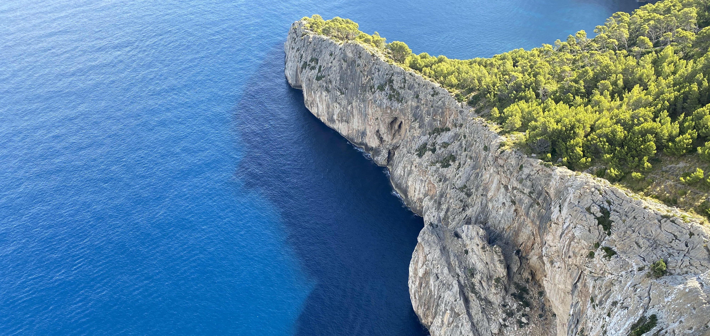

&nbsp;

Na našich minulých cestách jsme vždy jeli na poznávací dovolenou, při které
byl každý den nabitý tak, že jsme se po dovolené vrátili domů ještě víc unavení,
než jak jsme na dovolenou odjížděli a byli tím pádem rádi, že si můžeme jít zase
odpočinout zpátky do práce. Tento rok jsme si ale řekli, že si dáme od takových
poznávaček menší pauzu a pojedeme k moři. Nabrat síly. Odpočinout si.

První plán byl jet na [Santorini](https://cs.wikipedia.org/wiki/Santorini).
Když jsme ale zjistili, kolik stojí týdenní
pobyt v průměrném hotelu na tomto řeckém ostrově, rychle nás to přešlo. A tak jsme
hledali dál. Mezitím přišel [COVID-19](https://cs.wikipedia.org/wiki/Covid-19)
a já si na chvíli myslel, že v roce 2020
na žádnou zahraniční dovolenou nepojedeme. V průběhu června se ale situace začala
vracet do normálu, levných letenek přibylo a mimo jiné se spousta z nich objevila
na [Mallorcu](https://cs.wikipedia.org/wiki/Mallorca). A tak jsme si řekli, že pojedeme.
Koupili jsme letenky, ubytování a v půjčovně zarezervovali auto.

Během srpna se situace kolem [COVID-19](https://cs.wikipedia.org/wiki/Covid-19)
ve Španělsku zhoršila, takže česká vláda
zařadila Španělsko na seznam rizikových zemí, do kterých se sice může cestovat,
nicméně po návratu je nutné nastoupit do 14-denní karantény, nebo si nechat udělat
test. Pro nás to byla sice komplikace, ale na druhou stranu jsme měli všechno zařízené,
takže jsme si řekli, že test si zaplatíme a pojedeme.

&nbsp;

#### DEN 0

V den odjezdu začaly ale problémy přibývat. A zase v tom byl ten
[COVID-19](https://cs.wikipedia.org/wiki/Covid-19).

V 16 hodin jsme na hlavním nádraží v Brně nastoupili do žlutého vlaku a já si myslel,
že dovolená začíná. Nicméně úplně nezačínala. Nejdřív jsme si chtěli objednat jídlo.
K tomu v RegioJetu slouží mobilní aplikace, která má na Apple Storu hodnocení kolem dvou
hvězdiček z pěti, čemuž se vůbec nedivím. Nejdřív mi totiž trvalo věčnost si ji
nainstalovat a potom mi trvalo celou cestu do Prahy si přes ni něco objednat. Bohužel
se mi to nepovedlo, takže jsme přijeli do Prahy nenajezení.

To ale nebyl ten hlavní problém. V průběhu mého snažení o objednávku jídla ve vlaku
mi zazvonil telefon. Volalo mi číslo se španělskou předvolbou. Když jsem telefon
zvedl, ozvala se Antonia, naše recepční, která mi oznámila, že náš hotel, který
jsme už měli zaplacený, zavírají vlivem [COVID-19](https://cs.wikipedia.org/wiki/Covid-19).
Nejdříve jsem se lekl, že v hotelu
vypukla pandemie, ale potom mě Antonia uklidnila, že pouze nikdo do hotelu nejezdí
a jim se nevyplatí provozovat celé zařízení kvůli dvěma Bezděkům. Naštěstí nám Antonia
řekla, že nám vrátí peníze a nabídla nám ubytování v apartmánech stejného řetězce
pouze 300 metrů od původního hotelu. Takže problém vyřešen.

Po příjezdu do Prahy jsme se stavili ještě ve [Freshlabels](https://www.freshlabels.cz/)
a potom pokračovali na náš hotel. Proč jsme se stavovali v obchodě? Tomu předchází
ještě jedna komplikace, kterou jsem nezmínil. Když jsem se doma začal balit,
zjistil jsem, že nemám dost velký batoh. Po naší poslední cestě do USA jsem totiž
vyhodil svůj velký cestovní batoh s tím, že si musím koupit nový. V průběhu následujících
15 měsíců, které jsem na to měl, jsem ale žádný batoh nekoupil. A tak mi nezbylo
nic jiného, než se sbalit do malého batohu a plátěné tašky, objednat batoh ve
[Freshlabels](https://www.freshlabels.cz/) v Praze, vyzvednout cestou na hotel v Praze nový
batoh a přeskládat si věci do něj. Vyřešeno.

Po nákupu batohu jsme se stavili ještě v [banh--mi--ba](https://banhmiba.cz/) na večeři,
já si dal bagetu s rybou, Klára s kuřetem, a poté se vydali
do [Hotelu Krystal](https://worhot.com/hotels/krystal-praha-6). V tu dobu v Praze
lilo jako z konve, takže jsme dost zmokli. Mě dokonce nahodil od hlavy až k patě
projíždějící autobus, takže jsem byl po příjezdu na hotel rád, že se můžu osprchovat
a jít spát.

&nbsp;

#### DEN 1

V den odletu jsme vstávali už ve 4 hodiny ráno, protože letadlo nám letělo v 6:20.

Po rychlém sbalení věcí nás ve 4:40 nabral taxík před hotelem a odvezl nás na letiště. My bez větších problémů
prošli kontrolou, koupili si snídani a nalodili se na palubu letadla. V průběhu letu,
který trval asi 2,5 hodiny, jsem si snědl krocana se šunkou a sýrem z letiště,
podřimoval a snažil se nemyslet na přílet na [Mallorcu](https://cs.wikipedia.org/wiki/Mallorca).

Tam nás totiž čekala kontrola dokumentu, který musí mít každý, kdo v období
koronavirové krize cestuje do Španělska. Jedná se o něco jako čestné prohlášení,
ve kterém svým podpisem stvrzujete, že jste nepřišli do styku s žádnou nakaženou
osobou a že nemáte příznaky nemoci. Každý by si řekl, že vyplnit jeden formulář
bude hračka, ale já jej před odletem vyplňoval za sebe i za Kláru a u Kláry jsem
si spletl příjmení. Místo *Bezděková* jsem do formuáře napsal Klářino příjmení za svobodna.
A příjmení byla zrovna položka, která jako jedna z mála nešla po uložení změnit.
Takže jsem se až na [Mallorcu](https://cs.wikipedia.org/wiki/Mallorca) trošku strachoval,
aby Klára nemusela zůstat na [Mallorce](https://cs.wikipedia.org/wiki/Mallorca)
na letišti, nebo nemusela letět zpátky. Naštěstí kontrola proběhla přesně tak, jak
by se od Španělů dalo čekat - nikdo nám nezměřil teplotu, natož aby kdokoliv
kontroloval příjmení. Další pohroma zažehnána, jelo se dál.

A to doslova. Na letišti jsme si totiž půjčili auto, konkrétně bílý
[Huyndai i20](https://cs.wikipedia.org/wiki/Hyundai_i20),
a frčeli jsme na hotel, který se nacházel v městečku
[Port de Pollenca](https://www.fischer.cz/spanelsko/mallorca/port-de-pollenca)
na severu ostrova. Cesta trvala asi hodinu, takže jsme na místo dorazili kolem 12. hodiny
a vybalili si věci. Naše ubytování tvořil apartmán v zařízení jménem
[Hobby Club Apartments](https://www.cabot-hotels.com/en/hotels/puerto-pollensa/cabot-hobby-club/).
Náš pokoj byl moc pěkný. Nacházel se v horním patře celé budovy a z balkónu byl přístup
na střechu, kde se nacházela naše soukromá vířivka a bali postel.
Ani jedno jsme ale za celý náš pobyt nevyužili.

V den našeho příjezdu na ostrově nebylo moc pěkné počasí - bylo zamračeno,
bouřilo se a pršelo. Proto jsme se šli rychle najíst do restaurace
[La Maina](https://www.tripadvisor.cz/Restaurant_Review-g1028722-d7203912-Reviews-La_Maina-Port_de_Pollenca_Majorca_Balearic_Islands.html),
kde jsem si dal boloňské špagety, a potom jsme se vrátili na pokoj a snažili se
dohnat spánkový deficit.

Když jsme se probudili, byl akorát čas večeře. Abychom moc nezmokli, nasedli jsme
do auta a trošku se přiblížili k místnímu [Burger Kingu](https://www.burgerking.cz/).
Zbytek jsme došli pěšky. Ten večer jsem si dal hamburger s vejcem a hranolkama.
Byl první den, takže mi jídlo z fast foodu ještě relativně chutnalo.

Po večeři pršet přestalo, takže jsme se alespoň prošli po
[místní promenádě](images/travelling_promenada_Port_de_Pollenca.jpg) a
v obchodě nakoupili jídlo na další dny.

&nbsp;

#### DEN 2

Druhý den ráno nás čekalo na pokoji nepříjemné překvapení. Jídlo, které jsme nedali
do lednice, přilákalo místní mravence, takže jsme část naší snídaně museli vyhodit.
S jídlem jsme obecně na dovolené dost bojovali. Kromě mravenců se nám totiž i
několikrát stalo, že jsme koupili jídlo, které bylo po otevření obalu plesnivé.
Naštěstí jsme měli vždycky co jíst, takže jsme přežili :-)

Po zlikvidování mravenců a lehké snídani jsme se vydali na výlet do
[Palma de Mallorca](https://cs.wikipedia.org/wiki/Palma_de_Mallorca),
hlavního města ostrova.

Auto jsme nechali zaparkované v podzemních garážích
u přístavu a vydali se na prohlídku města. První zastávkou byla majestátní
[katedrála Panny Marie](https://cs.wikipedia.org/wiki/Katedr%C3%A1la_Panny_Marie_(Palma_de_Mallorca)),
která pochází z roku 1230 a je jednou z největších gotických katedrál v Evropě.
Odtud jsme se prázdnými úzkými uličkami města vydali na
[Plaza de Cort](https://es.wikipedia.org/wiki/Plaza_de_Cort), kde se nachází
[budova místní radnice](https://es.wikipedia.org/wiki/Ayuntamiento_de_Palma_de_Mallorca).
Kromě ní je na náměstí i pobočka [Starbucks](https://www.starbuckscoffee.cz/),
kde jsme koupili další hrníček do naší sbírky.

Odtud jsme pokračovali na [Plaza Mayor](https://es.wikipedia.org/wiki/Plaza_Mayor_de_Palma_de_Mallorca)
a k budově bývalého hotelu [Gran Hotel](https://en.wikipedia.org/wiki/Gran_Hotel_(Palma)).

Po obědě v [McDonald's](https://www.mcdonalds.cz/) jsme se chtěli jít podívat ještě
do budovy velké tržnice [Mercat de l’Olivar](https://www.mercatolivar.com/en/home/).
Ta ale byla kvůli [COVID-19](https://cs.wikipedia.org/wiki/Covid-19) zavřená.
Ostatně mnoho podniků bylo v hlavním městě zavřených - některé kvůli
[COVID-19](https://cs.wikipedia.org/wiki/Covid-19), jiné kvůli tomu, že byla neděle.
Nám to ale nevadilo. Město sice bylo prázdné, ale na druhou stranu se člověk nikde
s nikým nemačkal a na některých místech to dokonce vypadalo, jako by je měl jen
sám pro sebe. I díky tomu bylo možné v mnoha případech udělat pěkné fotky,
které si myslím, že by za jiných okolností nebylo možné udělat.

Cestou zpět do přístavu jsme se zastavili ještě v kavárně
[Ca'n Joan de s'Aigo](https://canjoandesaigo.com/en/home/), která funguje již od
roku 1700 a mimo jiné svým návštěvníkům nabízí klasické mallorcké sladké pečivo,
které se jmenuje [ensaimada](https://cs.wikipedia.org/wiki/Ensa%C3%AFmada). Já jej
ochutnal s čokoládovou náplní, Klára s vanilkovou polevou. Přestože moje
[ensaimada](https://cs.wikipedia.org/wiki/Ensa%C3%AFmada) připomínala trošku lejno,
oběma nám moc chutnalo.

Po návratu do přístavu jsme vyzvedli auto a vydali se zpět do
[Port de Pollenca](https://www.fischer.cz/spanelsko/mallorca/port-de-pollenca).
Když jsme kolem 17. hodiny přijeli zpět na pokoj, oblékli jsme plavky a šli se svlažit
do moře, což nám oběma bodlo. Po asi hodině čvachtání jsme vyrazili na večeři do
restaurace [Mamboreta](https://www.tripadvisor.cz/Restaurant_Review-g1028722-d14162093-Reviews-Mamboreta_Restaurante-Port_de_Pollenca_Majorca_Balearic_Islands.html),
kde jsem si dal [paellu s dary moře](https://cs.wikipedia.org/wiki/Paella).

Když jsme přišli na pokoj, byli jsme celkem dost unavení a mě poprvé napadlo, že možná
to s tím odpočíváním u moře nebude zase tak horké. Oba jsme se totiž shodli na tom,
že celý den na pláži si představit nedokážeme, ale výlet s následným čvachtáním
v moři už i jo :-)

&nbsp;

#### DEN 3

Po nepříjemnostech s mravenci z předchozího dne jsme se na škůdce připravili a
všechno jídlo dali do ledničky. Ráno jsme si tedy mohli konečně dát snídani,
kterou jsme den předem naplánovali :-)

Po jídle jsme se sbalili a vyrazili na naší první horskou etapu, jak jsem výletům
do hor začal přezdívat. [Mallorca](https://cs.wikipedia.org/wiki/Mallorca) je
ostrov 110 km dlouhý a mezi 60 a 90 km široký. Hlavní jeho část tvoří plochá
centrální planina, která není moc zajímavá ani co se týče památek, ani přírody.
Ta zajímavější část se nachází na severo-západě ostrova, kde se rozprostírá
pohoří [Serra de Tramuntana](https://cs.wikipedia.org/wiki/Serra_de_Tramuntana).
V něm lze najít jak spoustu historických památek, tak přírodních krás. A obojí
se vešlo do programu na tento den.

Naše první zastávka byla ve vesničce [Valldemossa](https://en.wikipedia.org/wiki/Valldemossa),
která je významná hned ze dvou důvodů. Jednak se tam narodila jediná mallorcká světice,
[sv. Kateřina](https://en.wikipedia.org/wiki/Catherine_of_Palma), takže je možné
se jít podívat na její rodný dům, druhak ve vesničce krátce přebývala spisovatelka
[George Sandová](https://cs.wikipedia.org/wiki/George_Sandov%C3%A1)
se svým neméně slavným milencem [Fryderykem Chopinem](https://cs.wikipedia.org/wiki/Fryderyk_Chopin).
Turisté z celého světa se tak přijíždějí dívat na místo, kde slavný pár žil a tvořil.
Tím je bývalý klášter [La Real Cartuja de Valldemossa](https://es.wikipedia.org/wiki/Cartuja_de_Valldemosa).
Obojí bylo zajímavé, nás ale nejvíce oslovily malebné úzké uličky, výhled na okolní hory
a ochotnávka typického valldemosského sladkého pečiva
[coca de patata](https://es.wikipedia.org/wiki/Coca_de_patata), což je v podstatě
jemný nadýchaný bochánek z bramborového těsta posypaný cukrem.

Druhou zastávku dnešního výletu tvořila další horská vesnička [Deià](https://cs.wikipedia.org/wiki/Dei%C3%A0).
Jedná se o malou vesničku zasazenou do 1064 metrů vysokého horského masivu Teix,
kterou si v průběhu let vybralo k životu mnoho významných osobností světové historie.
Jedním z takových byl i anglický spisovatel a autor literárního díla
[Já, Claudius](https://cs.wikipedia.org/wiki/J%C3%A1,_Claudius),
[Robert Graves](https://cs.wikipedia.org/wiki/Robert_Graves). Ten má ve vesnici
nejen svůj vlastní dům, který dnes slouží jako muzeum, ale i hrob na místním
hřbitově. Dle průvodců je [Deià](https://cs.wikipedia.org/wiki/Dei%C3%A0) také
místem, kde mají mnozí příslušníci horních deseti tisíc svou letní rezidenci.
Nás ale [Deià](https://cs.wikipedia.org/wiki/Dei%C3%A0) zase tolik neoslovila,
a tak jsme po procházce úzkými uličkami a nalezení domu a hrobu
[Roberta Gravese](https://cs.wikipedia.org/wiki/Robert_Graves) zamířili do jedné
z místních restaurací na oběd a poté jsme pokračovali do poslední zastávky našeho
výletu, kterou tvořilo město [Sollér](https://en.wikipedia.org/wiki/S%C3%B3ller).

To se nachází na úpatí hor, takže cesta z horské vesničky
[Deià](https://cs.wikipedia.org/wiki/Dei%C3%A0) dolů do
[Solléru](https://en.wikipedia.org/wiki/S%C3%B3ller) nebyla pro žádné poseroutky.
A protože já poseroutka jsem, musím přiznat, že adrenalin v těle mi v úzkých
serpentinách stoupal docela dost rapidně. Naštěstí jsme ale v pořádku dojeli a nic
se nestalo. V [Solléru](https://en.wikipedia.org/wiki/S%C3%B3ller) jsme si zašli
na hlavní náměstí Plaça Constitució, kde se nachází modernistický kostel Sant Bartomeu
a budova banky Santander, jejíž exteriér je dílem
[Gaudího](https://cs.wikipedia.org/wiki/Antoni_Gaud%C3%AD) žáků. Kromě toho
náměstím projíždí pro [Sollér](https://en.wikipedia.org/wiki/S%C3%B3ller)
typická oranžová tramvaj a nachází se na něm spousta restaurací a kaváren. V jedné
z nich jsme si tedy sedli, dali kávu a dočerpali síly.

Když jsme se kolem 18. hodiny vrátili zpět do našeho výchozího bodu v
[Port de Pollenca](https://www.fischer.cz/spanelsko/mallorca/port-de-pollenca),
stejně jako včera jsme se převlékli do plavek a šli se svlažit do moře.
Potom jsme zašli na večeři do Antonií doporučené restaurace
[Brisa Marina](https://www.enjoymallorca.com/travel-directory/brisa-marina/).
Tam jsme ochutnali další jídla mallorcké kuchyně. Já vyzkoušel dušené vepřové maso
na jablkách a Klára ochutnala místní cibulačku a [tumbet](https://en.wikipedia.org/wiki/Tombet).
[Tumbet](https://en.wikipedia.org/wiki/Tombet) je zeleninový pokrm připomínající
řeckou [musaku](https://cs.wikipedia.org/wiki/Musaka), který jsme překřtili na
*trumpet*. Po hlavním chodu následoval ještě dezert v podobě výborného
[mallorckého pudinku](https://en.wikipedia.org/wiki/Cr%C3%A8me_caramel).

&nbsp;

#### DEN 4

Předchozí den jsme nestihli zajít do obchodu pro snídani, takže jsem se hned ráno
převlékl a šel do supermarketu. Bohužel jsem zjistil, že je zavřeno, takže jsem
to otočil a vrátil se na pokoj s nepořízenou. Měli jsme ale sušenky a jogurt,
takže o hladu jsme nezůstali.

Po snídani nás čekala naše druhá horská etapa. Tentokrát jsme se vydali do hor
kousek od našeho hotelu. Naší první zastávkou na cestě byla vyhlídka
[Mirador Es Colomer](https://www.balim.cz/mallorca/vyhlidka-mirado-es-colomer).
Počasí nám vyšlo náramně, takže jsme měli možnost se pokochat výhledem na mořem
omývané útesy mysu [Cap de Formentor](https://www.mallorca-web.cz/clanky/mys-cap-de-formentor),
na kterém se nachází nejsevernější bod ostrova.

Tento den měl být kromě výhledů hlavně o plážích. Tou první, kam jsme mířili, byla
[Platja de Formentor](http://www.e-mallorca.cz/index.php/nejkrasnejsi-plaze/platja-de-formentor).
Jedná se o pláž, která se nachází v klidné zátoce a je obklopena borovicovými
háji. Podle průvodců je to jedna z nejhezčích pláží na ostrově. I nám se líbila.
Pláž byla čistá, voda průzračně čistá a přístup do vody pozvolný. Navíc s námi na pláži
nerelaxovalo moc lidí, což hlavně nyní považuji za obrovskou výhodu.

Jedinou nepříjemností tedy zůstává skutečnost, že mě při plavání v místních vodách
kousla nějaká ryba do nohy. Bylo to docela vtipné. Kolem mě totiž plavala jedna
větší ryba s dalšími třemi menšími rybami, asi mláďaty, a mě přišlo super je tam
pozorovat. Po chvíli se mě Klára zeptala, jestli si myslím, že nás můžou kousnout.
Já si ještě dělal srandu a říkal jsem, že určitě můžou - do prdele. A za malou
chvíli ke mně připlavala jedna z těch malých ryb a kousla mě do nohy. Možná je
zrovna maminka učila, jak lovit.

Když jsme se usušili, zašli jsme si dát pizzu do plážového baru a vyrazili jsme
na druhou pláž. Jednalo se o pláž [Cala Figuera](https://www.google.com/maps/place/Cala+Figuera/@39.9521016,3.1728817,15z/data=!4m14!1m8!3m7!1s0x0:0xdff8499ad4ca70bc!2sCala+Figuera!8m2!3d39.9521016!4d3.1728817!14m1!1BCgIgAQ!3m4!1s0x0:0xdff8499ad4ca70bc!8m2!3d39.9521016!4d3.1728817).
K pláži nebyl úplně pohodlný přístup. Auto jsme museli nechat na příjezdové cestě
na skále nacházející se nad pláží a potom nás čekal cca 700 metrů dlouhý sestup
k pláži. Pláž je známá tím, že se na ní kromě turistů vyhřívají i horské kozy,
které jsou ale hrozně otravné. Kromě koz se na pláži zrovna nacházelo docela dost
lidí, navíc se jednalo o kamenitou pláž bez možnosti se schovat před sluníčkem,
což nám moc nevyhovovalo, takže jsme si pouze chvíli sedli na ručník, odpočinuli si a
vrátili se zpět k autu.

Tam jsme si dali malou svačinu a pokračovali po úzkých
horských cestách na naši poslední zastávku, kterou byl maják na konci mysu
[Cap de Formentor](https://www.mallorca-web.cz/clanky/mys-cap-de-formentor).
Cesta k němu byla dost úzká a plná serpentin, takže jsem byl na jednu stranu rád,
když jsme k majáku dojeli, na druhou stranu mě ale děsila představa, že tu stejnou
cestu musíme absolvovat ještě jednou zpět. Od majáku byl znovu nádherný výhled na
skalnaté útesy a širé moře. Když jsme se nabažili panoramaty a dopili kávu z
místní kavárny, sedli jsme do auta a vydali se zpět do
[Port de Pollenca](https://www.fischer.cz/spanelsko/mallorca/port-de-pollenca).

Aby těch pláží nebylo málo, převlékli jsme se a šli jsme ten den na pláž potřetí.
Tentokrát jsme se ale už zase koupali. Po krátkém svlažení v moři jsme se převlékli
a šli do města vyzkoušet další restauraci, kterou nám doporučila naše recepční Antonia.
Tentokrát se jednalo o restauraci [Stay](https://stayrestaurant.com/), kterou
Antonia nazvala *posh*. Oba jsme si dali zeleninový krém a
[fish and chips](https://cs.wikipedia.org/wiki/Fish_and_chips). Jídlo v restauraci
bylo podle mě moc dobré, ale co se mi líbilo víc, byla poloha podniku. Jednalo se
totiž o restauraci na molu, odkud byl výborný výhled na přístav a zakotvené lodě.

&nbsp;

#### DEN 5

Pátý den na ostrově neměl podle předpovědí počasí začít úplně nejlépe. Měli jsme
tedy v plánu, že po náročném programu z předchozích dní si trošku pospíme a na výlet
vyrazíme později. A tak jsme také udělali. Po snídani jsem proto ještě plánoval
program na další dny a na naši třetí horskou etapu jsme vyrazili až kolem 11. hodiny.

Znovu jsme měli namířeno do pohoří [Serra de Tramuntana](https://cs.wikipedia.org/wiki/Serra_de_Tramuntana),
tentokrát však do [kláštera Lluc](https://cs.wikipedia.org/wiki/Santuari_de_Lluc)
pocházejícího z 18. století. Jedná se o jedno z největších poutních míst na ostrově.
V kostele je uložena soška černé madony, v katalánštině označovaná jako La Moreneta.
Podle legendy ji objevil arabský chlapec Lluc, jehož rodina konvertovala ke křesťanství.
Sošku odnesl do kostela v nedaleké vsi Escora, ta se však neustále vracela na místo
svého nálezu. Nakonec tu tedy byla pro sošku postavena kaple, kde mohla být natrvalo
uložena.

My jsme si hned po příjezdu zašli na rychlý oběd do jedné z restaurací a poté
se vydali na prohlídku kláštera, která zahrnovala baziliku s La Morenetou,
muzeum a botanickou zahradu.

Po prohlídce jsme nasedli do auta a jeli - jak jinak - na pláž. Jednalo se o pláž
[Sa Calobra](https://www.seemallorca.com/beaches/sa-calobra-beach-661010), ke které
vede pravděpodobně
[jedna z nejhezčích cest na ostrově](https://www.freshjam.cz/25206-nejlepsi-silnice-sveta-16-dil-sa-calobra-mallorca).
Jedná se o 12 km dlouhý úsek, který je protkán serpentinami strmě klesajícími
k pobřeží. Cesta sama o sobě vyžadovala za volantem dost soustředění, ale i tak
se jednalo o zážitek. Výhledy, které totiž cesta nabízí, byly opravdu nádherné.

Samotná pláž je podle mého názoru velice pěkná. Jedná se v podstatě o úzkou soutěsku
mezi dvěma vysokými skálami. Aby se člověk na pláž dostal, musí od auta ještě
projít dvěma tunely pro pěší, které jsou vytesány do jedné ze skal. Díky tomu,
že se jedná o kamenitou pláž, je voda průzračně čistá. Na můj vkus byla ale
docela studená a hluboká. Takže mým dovolenkovým favoritem bych ji nenazval.
Navíc na pláži [Sa Calobra](https://www.seemallorca.com/beaches/sa-calobra-beach-661010)
tentokrát kousla nějaká ryba Kláru. Myslím si, že to byl ten stejný druh,
který kousl včera mě na [Platja de Formentor](http://www.e-mallorca.cz/index.php/nejkrasnejsi-plaze/platja-de-formentor).

Když nás plavání v moři přestalo bavit, osušili jsme se a vydali se na hodinovou
cestu zpět do [Port de Pollenca](https://www.fischer.cz/spanelsko/mallorca/port-de-pollenca),
kde jsme zašli na rychlou večeři do [Burger Kingu](https://www.burgerking.cz/)
a jeli odpočívat na hotel.

&nbsp;

#### DEN 6

Horské etapy byly za námi. Na šestý den jsme naplánovali
[Cuevas del Drach](https://es.wikipedia.org/wiki/Cuevas_del_Drach), komplex jeskyní,
který je jedním z nejvýznamnějších přírodních úkazů na ostrově.

A tak jsme po snídani sedli do auta a vydali se na cestu na druhý konec ostrova.
Ten den nás navigace vedla nějakými polními cestami a ještě kilometr před příjezdem
do cíle jsme u cest neviděli žádné ukazatele na jeskyně. V tu chvíli jsem z cesty neměl úplně
nejlepší pocit a dost jsem se bál, že nestihneme prohlídku jeskyní v 11 hodin,
na kterou jsme měli koupené lístky. Naštěstí nás navigace nezklamala, a i když to bylo
malinko se stresem, nakonec nás dovedla tam, kam jsme chtěli.

Prohlídka jeskyní nezahrnovala výklad žádného průvodce. Co ale zahrnovala, byl
koncert vážné hudby a projížďka loďkou. Přibližně v půlce cca 1,5 km dlouhého
pěšího okruhu jsme se dostali do velké jeskynní místnosti, kde byla spousta
sedaček, na které nás zaměstnanci jeskyně usadili. Před námi se nacházelo jeskynní jezero.
Na něm se po chvíli objevily tři lodě. Na jedné z nich sedělo hudební uskupení ve složení
dvou houslí, jedné basy a piana. Další dvě loďky plnily pouze roli osvětlovačů.
Následovala krátká projížďka těchto tří lodí po jezírku, při kterém hudební
seskupení zahrálo několik skladeb. Po vystoupení přišel potlesk obecenstva a
možnost nechat se svézt v loďkách po jezírku. My jsme si řekli, že když už jsme
za to zaplatili, tak pojedeme. Projížďka sice byla opravdu velice krátká, ale svezli jsme se.
Potom jsme dokončili okruh prohlídky a v místním občerstvení si koupili oběd.

Po jídle jsme nasedli do auta a pokračovali na další pláž z našeho seznamu - tentokrát už na poslední -
[Calo des Moro](https://www.seemallorca.com/beaches/es-calo-des-moro-south-mallorca-688454).
Jednalo se o malou písečnou pláž ukrytou v zátoce, která
nabízela mělkou tyrkysovou vodu. Přestože říkám písečnou, na souši moc písku nebylo,
takže jsme museli nechat věci mezi velkými kameny, ke kterým nebyl úplně nejlepší
přístup. Pláž navíc byla dost malá, takže se na ní tísnilo hodně lidí, což kráse
samotného místa moc nepřidávalo. Za mě se ale i tak jednalo o jedno
z nejhezčích míst, které jsme na dovolené navštívili. Voda totiž byla teplá, čistá
a průzračně modrá jako na obrázku, takže jsem si relaxování ve vodě vážně užíval.

Po příjezdu na hotel jsme se pouze převlékli a šli na večeři do restaurace
[Celler La Parra](https://cellerlaparra.com/). Podle Antonie se mělo jednat
o restauraci, kde můžeme ochutnat typické mallorcké jídlo, a to jsme s Klárou
oba chtěli. Já si objednal jehněčí ramínko na mallorcký způsob s dušenou
zeleninou a hranolkama, což bylo asi to nejlepší jídlo, které jsem na dovolené měl,
a Klára si dala znovu [tumbet](https://en.wikipedia.org/wiki/Tombet), tentokrát
však se smaženými vajíčky.

Po výborné večeři jsme se odkutáleli na hotel a šli si po náročném dni lehnout.

&nbsp;

#### DEN 7

Sedmý den byl naším posledním celým dnem na ostrově, a tak jsme si řekli, že si
ho uděláme trošku volnější a budeme odpočívat.

Proto jsme se pořádně vyspali a po snídani se vydali do 10 km vzdáleného ranče
[Ranxo Ses Roques](https://www.ranxosesroques.com/en/), kde jsme si zaplatili
hodinovou vyjížďku na koních po okolí. Já jsem, jakožto začátečník, jel na klisně
jménem Noidoisi, což v překladu znamená "Ne i ano". Klára, jakožto pokročilejší jezdec,
jela na klisně jménem Canela, což je v češtině "Skořice".

Společně s námi jeli na projížďku ještě tři zaměstnanci ranče a dva návštěvníci.
Já jsem společně s dalšími amatéry se svým koněm pouze šel, ale ti, kteří byli
pokročilejší, měli do projížďky zahrnuty i úseky, kdy se s koněm klusalo. Cesta
vedla ne moc pěknou krajinou v okolí silnice a prašných cest, ale i přesto to byl
pěkný zážitek a já jsem rád, že jsme na projížďku vyrazili.

Po návratu na hotel jsme se převlékli a šli na oběd do restaurace
[Swing](https://www.swingrestaurante.com/), kde jsme si dali s Klárou napůl
vynikající zeleninovou [paellu](https://cs.wikipedia.org/wiki/Paella).

Po obědě jsme se vrátili na hotel a šli si lehnout. Spali jsme dost dlouho,
snad až do pěti hodin. Potom jsme se ale převlékli a šli poprvé (a naposledy)
k hotelovému bazénu. Klára odpočívala na lehátku a já si šel zaplavat.

Jak bylo naším zvykem, na večeři jsme vyrazili do města. Tentokrát do
vegetariánské restaurace [Bellaverde](https://restaurantbellaverde.wixsite.com/bellaverde),
která byla doporučovaná v našem kapesním průvodci. Já si objednal boloňské špagety
a vynikající banánový zákusek [banoffee](https://en.wikipedia.org/wiki/Banoffee_pie),
Klára si dala hamburger a čokoládový muffin se šlehačkou. Oběma nám moc chutnalo,
ale dost jsme se přejedli, což nebylo úplně na místě. Po návratu na pokoj jsme se
totiž museli ještě balit na cestu zpět domů.

&nbsp;

#### DEN 8

Ráno jsme vstali v 5:15, sbalili poslední věci a vydali se na letiště do
[Palma de Mallorca](https://cs.wikipedia.org/wiki/Palma_de_Mallorca). Cestou mě
překvapovalo, kolik lidí bylo na silnicích neukázněných a mělo zapnutá dálková
světla v úsecích, kde před nimi jelo dalších X aut. I přes několik krušných
chvilek, kdy jsem měl sto chutí někoho vybrzdit, vyblikat, nebo vytroubit, jsme dojeli na
letiště v pořádku, vrátili auto a šli na zavazadlovou kontrolu.

Protože jsme byli na letišti brzo, zašli jsme na snídani a potom čekali na letadlo,
které nám letělo v 9:50 místního času. Let probíhal úplně v pohodě. Klára se
kochala výhledem na [Alpy](https://cs.wikipedia.org/wiki/Alpy) a já psal tyto řádky.

Po příletu do Prahy jsme si zašli na jídlo a potom dvě hodiny čekali na test na
[COVID-19](https://cs.wikipedia.org/wiki/Covid-19). Jeho pověst nelže - není to
příjemné, ale dá se to vydržet, protože to netrvá dlouho :-) Mimochodem,
výsledky testu dorazily hned druhý den a byly **negativní**.

V 16:20 jsme na hlavním nádraží nasedli do žlutého vlaku a jeli domů.

&nbsp;

#### FOTKY

Fotky z [Mallorcy](https://cs.wikipedia.org/wiki/Mallorca) najdete
[zde](https://photos.app.goo.gl/ivnmeHjHX42TVNT78).

---

[blog](../index.html)
- [cestování](traveling_content.html)
