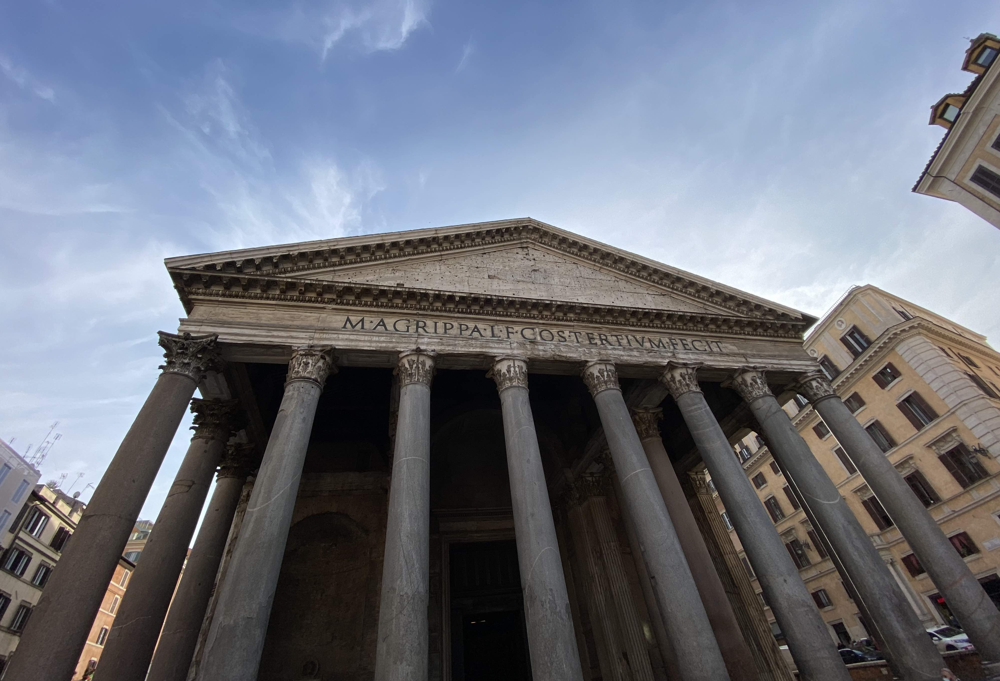

&nbsp;

V červenci nám nevyšel [Milán](https://cs.wikipedia.org/wiki/Mil%C3%A1n).
V říjnu vyšel [Řím](https://cs.wikipedia.org/wiki/%C5%98%C3%ADm).

Když jsme viděli, že rok 2021 nabízí možnost prodlouženého víkendu na konci října,
říkali jsme si, že bychom toho mohli využít. Zvlášť po tom, co nám v červenci
společnost [Ryanair](https://cs.wikipedia.org/wiki/Ryanair) zrušila letenky
do [Milána](https://cs.wikipedia.org/wiki/Mil%C3%A1n) a z naší plánované
zahraniční dovolené tak rázem nebylo nic.

S letenkami do [Říma](https://cs.wikipedia.org/wiki/%C5%98%C3%ADm) to taky
nebyla žádná sláva. [Společnost](https://cs.wikipedia.org/wiki/Ryanair) nám
je totiž ještě před odletem několikrát změnila. Nejdřív čas odletu a návratu,
potom rovnou příletové letiště. S malou nejistotou, co nás ještě na cestě potká,
i vlivem [COVIDvých](https://cs.wikipedia.org/wiki/Covid-19) opatření, jsme
se ale na [den vzniku samostatného Československa](https://cs.wikipedia.org/wiki/Den_vzniku_samostatn%C3%A9ho_%C4%8Deskoslovensk%C3%A9ho_st%C3%A1tu)
vydali na cestu.

&nbsp;

#### DEN 0

Byl čtvrtek po obědě, venku svítilo sluníčko a my se nalodili na palubu žlutého
autobusu do [Prahy](https://cs.wikipedia.org/wiki/Praha). Cesta probíhala úplně
v klidu. Nikde jsme nestáli. Já si nejdřív zdřímnul a potom jsem pročítal průvodce.
Klára se dívala na film. Do [Prahy](https://cs.wikipedia.org/wiki/Praha)
jsme dorazili na čas. První část cesty proběhla bez problémů.

V [hlavním městě](https://cs.wikipedia.org/wiki/Praha) nám všechny spoje skvěle
navazovaly, takže jsme se až nezvykle rychle přesunuli na
[letiště](https://cs.wikipedia.org/wiki/Leti%C5%A1t%C4%9B_V%C3%A1clava_Havla_Praha).
Druhá část cesty tedy byla na jedničku s hvězdičkou a já už si v tu chvíli
začínal říkat, že s naším "štěstím" to začíná trošku smrdět. Ale nepředbíhejme.
Na [letišti](https://cs.wikipedia.org/wiki/Leti%C5%A1t%C4%9B_V%C3%A1clava_Havla_Praha)
nikdo nebyl, takže jsme prakticky hned prošli kontrolou a následně jsme si sedli do
[bageterie PAUL](https://cs.wikipedia.org/wiki/Paul_(peka%C5%99stv%C3%AD)) na večeři.
Já jsem si dal [quiche](https://cs.wikipedia.org/wiki/Quiche), Klára bagetu.
Protože byla bageta velká a Klára měla strach, že mi
[quiche](https://cs.wikipedia.org/wiki/Quiche) nebude
stačit, dal jsem si i já nedobrovolně bagetu. Když se přiblížil čas odletu,
v [PAUL](https://cs.wikipedia.org/wiki/Paul_(peka%C5%99stv%C3%AD))
jsme to zabalili a přesunuli jsme se blíže k odletovým branám. A tam to přišlo.
Místo ohlášení brány hlásič oznámil, že náš let bude mít hodinové zpoždění, což
prakticky znamenalo, že bychom měli přiletět do
[Říma](https://cs.wikipedia.org/wiki/%C5%98%C3%ADm) až kolem 23. hodiny.
Nadšení jsme nebyli, ale nějak jsme to museli přežít. Vytáhli jsme proto počítač,
zapnuli [Netflix](https://cs.wikipedia.org/wiki/Netflix) a dívali se na seriál
[Služka](https://www.csfd.cz/film/925905-sluzka/prehled/), takže nám čekání
na letadlo relativně rychle uteklo.

Po ospalém letu jsme dorazili na hlavní římské letiště
[Fiumicino](https://cs.wikipedia.org/wiki/Leti%C5%A1t%C4%9B_%C5%98%C3%ADm-Fiumicino).
Protože už bylo pozdě, neřešili jsme MHD, vzali jsme si taxi a jeli
na [hotel](https://www.booking.com/hotel/it/san-pietro-grand-suite.cs.html). Řidič na to
docela šlapal, přejížděl z pruhu do pruhu, nedával blinkry, překračoval rychlostní
limity a na můj vkus nedodržoval rozumné rozestupy. Pokud tedy byl někdo po nočním
letu ospalý, myslím, že cesta do centra [Říma](https://cs.wikipedia.org/wiki/%C5%98%C3%ADm)
ho zaručeně probrala.

Po příjezdu na [hotel](https://www.booking.com/hotel/it/san-pietro-grand-suite.cs.html)
nás v rámci self check-inu čekalo pár úkolů, za které by se nemusela stydět
žádná únikovka. Nejdřív jsme se museli dostat do budovy hotelu, která byla zamčená
a my neměli klíč. Po tom, co jsem zhodnotil naše možnosti, jsem se rozhodl zazvonit
na zvonek našeho [hotelu](https://www.booking.com/hotel/it/san-pietro-grand-suite.cs.html).
Hned první možnost vyšla. Vůbec nevím, jak se to stalo, ale rázem zazvonil bzučák
a dveře se zázrakem otevřely. Po vystoupání do patra náš čekaly další zamčené dveře.
K těm jsme už ale měli číselný kód, takže u nich se žádné drama nekonalo.
Přišli jsme k recepci, kde jsme museli najít černou krabičku, ke které jsme měli
další PIN. Po zadání číselné kombinace se krabička otevřela a v ní pro nás byly
připraveny klíče od našeho pokoje. Nakonec tedy stačilo najít pokoj se jménem
SMERALDO a jít dovnitř.

Před usnutím nás čekal ještě jeden poslední úkol - objednat snídani. Na stolečku
jsme měli připravený lístek s možnostmi snídaňového menu. Abychom vytvořili objednávku,
bylo nutné zaškrtnout, co bychom si rádi dali, poté lístek vyfotit a poslat
na [WhatsApp](https://cs.wikipedia.org/wiki/WhatsApp) Silvii,
majitelce [hotelu](https://www.booking.com/hotel/it/san-pietro-grand-suite.cs.html).

Do postele jsme se dostali asi hodinu po půlnoci.

&nbsp;

#### DEN 1

První den v [Římě](https://cs.wikipedia.org/wiki/%C5%98%C3%ADm) jsme vstali
krátce před budíkem. V 8 hodin nám někdo zaklepal na dveře pokoje a přivezl
snídani na stole na kolečkách. Na něm bylo vše, co jsme si den předem objednali.
U mě se jednalo o obyčejného [krocana](https://cs.wikipedia.org/wiki/Croissant),
čokoládového [krocana](https://cs.wikipedia.org/wiki/Croissant), jogurt a kávu.

Po snídani jsme vyrazili na prohlídku města. Ta začala v nejmenším státě na světě,
tedy ve [Vatikánu](https://cs.wikipedia.org/wiki/Vatik%C3%A1n). Nejdříve jsme vyšplhali
na kupoli [Baziliky sv. Petra](https://cs.wikipedia.org/wiki/Bazilika_svat%C3%A9ho_Petra),
kde jsme mohli obdivovat nejen [Michelangelovy](https://cs.wikipedia.org/wiki/Michelangelo_Buonarroti)
malby, ale také výhled na celý [Řím](https://cs.wikipedia.org/wiki/%C5%98%C3%ADm).
Když jsem byl v [Římě](https://cs.wikipedia.org/wiki/%C5%98%C3%ADm) před deseti
lety poprvé (a do této dovolené naposledy), s Kubou a tetou jsme na kopuli nešli.
I proto jsem se tam chtěl jít tentokrát podívat. A musím říct, že to opravdu
stálo za to. Když si uvědomím, že stavební společnost, od které jsme před pár měsíci
koupili byt, nedokázala ani postavit rovnou zeď a ve [Vatikánu](https://cs.wikipedia.org/wiki/Vatik%C3%A1n)
o několik stovek let dřív postavili tak monumentální stavbu, na které je dokonalý
každý detail, nechce se mi tomu snad ani věřit.

Po prohlídce kopule, jsme se přesunuli do samotné
[baziliky]((https://cs.wikipedia.org/wiki/Bazilika_svat%C3%A9ho_Petra)).
Mezi nejzajímavější artefakty, které je možné v interiéru
[baziliky]((https://cs.wikipedia.org/wiki/Bazilika_svat%C3%A9ho_Petra))
spatřit na vlastní oči, patří bronzová socha
[sv. Petra](https://cs.wikipedia.org/wiki/Petr_(apo%C5%A1tol)), která už má od
uctívajících věřících ohoblované prsty u nohou, a také hlavní oltář schovaný pod
ikonickým bronzovým baldachýnem. Když jsme vyšli z
[baziliky]((https://cs.wikipedia.org/wiki/Bazilika_svat%C3%A9ho_Petra)), polovina
[náměstí](https://cs.wikipedia.org/wiki/Svatopetrsk%C3%A9_n%C3%A1m%C4%9Bst%C3%AD)
byla uzavřená. Později jsme zjistili, že to bylo způsobeno
[summitem G20](https://www.consilium.europa.eu/cs/meetings/international-summit/2021/10/30-31/),
který se o víkendu v [Římě](https://cs.wikipedia.org/wiki/%C5%98%C3%ADm) konal.
Tento [summit](https://www.consilium.europa.eu/cs/meetings/international-summit/2021/10/30-31/)
nám v dalších dnech zkomplikoval plány ještě několikrát.

My se ale nenechali odradit a pokračovali v prohlídce města
k [Andělskému hradu](https://cs.wikipedia.org/wiki/And%C4%9Blsk%C3%BD_hrad)
a poté dále do [čtvrti Ponte](https://en.wikipedia.org/wiki/Ponte_(rione_of_Rome)).
V ní jsme chvíli bloudili úzkými historickými uličkami, než jsme narazili na
[restauraci Cantina e Cucina](https://cantinaecucina.it/), kde jsme se zastavili
na oběd. Měli jsme hlad, takže jsme si dopřáli dvouchodové menu. Začali jsme
degustačním talířem [bruschettek](https://cs.wikipedia.org/wiki/Bruschetta)
(s rajčaty, šunkou a sýrem, sýrem a špenátem) a pokračovali hlavním chodem.
Já jsem si vybral [ravioli](https://cs.wikipedia.org/wiki/Ravioli) plněné sýrem
a špenátem přelité rajčatovou omáčkou, Klára zvolila těstoviny
[cacio e pepe](https://cs.wikipedia.org/wiki/Cacio_e_pepe). Oběma
nám moc chutnalo. Po obědě jsme zastavili ještě ve vedlejším podniku
[Two sizes](https://www.tripadvisor.com/Restaurant_Review-g187791-d11917500-Reviews-Two_Sizes_Tiramisu_in_Rome-Rome_Lazio.html).
Jedná se o malou cukrárnu, která se specializuje na
[tiramisu](https://cs.wikipedia.org/wiki/Tiramisu),
a podle svých slov je to nejlepší [tiramisu](https://cs.wikipedia.org/wiki/Tiramisu)
v [Římě](https://cs.wikipedia.org/wiki/%C5%98%C3%ADm). Člověk si může vybrat asi
ze tří příchutí a může volit mezi dvěma velikostmi - odtud pravděpodobně název.
Klára vyzkoušela malé karamelové [tiramisu](https://cs.wikipedia.org/wiki/Tiramisu),
já si dal velkou sicilskou [cannolu](https://cs.wikipedia.org/wiki/Cannolo).

Po obědě jsme se podívali na [náměstí Piazza Navona](https://cs.wikipedia.org/wiki/Piazza_Navona),
které má neobvyklý obloukový tvar a na kterém se nachází
[Fontána čtyř řek](https://cs.wikipedia.org/wiki/Font%C3%A1na_%C4%8Dty%C5%99_%C5%99ek).
Z něj jsme pokračovali sítí úzkých uliček k [Pantheonu](https://cs.wikipedia.org/wiki/Pantheon).
Do chrámu se sice neplatí vstup, ale jako v celém [Římě](https://cs.wikipedia.org/wiki/%C5%98%C3%ADm)
zaměstnanci kontrolovali [COVID](https://cs.wikipedia.org/wiki/Covid-19) pasy a
měřili teplotu. To způsobilo, že se na malém náměstí vytvořil dlouhý had lidí
čekajících na vstup. Fronta byla sice dlouhá, ale postupovala docela rychle, takže
jsme přibližně za 15 minut byli uvnitř. Tam jsme obdivovali díru ve stropu a já
hledal hrob [Rafaela](https://cs.wikipedia.org/wiki/Raffael_Santi).

Z [Pantheonu](https://cs.wikipedia.org/wiki/Pantheon) jsme pokračovali k
[Fontáně di Trevi](https://cs.wikipedia.org/wiki/Font%C3%A1na_di_Trevi).
Cestou jsme se ale malinko ztratili, takže jsme se zastavili na kávu v jedné
z italských kaváren, kde jsme jsme doplnili síly a zjistili, jak se přesně
k [fontáně](https://cs.wikipedia.org/wiki/Font%C3%A1na_di_Trevi) dostat.
U jedné z nejikoničtějších staveb věčného města byl bambilion lidí, kteří před
[fontánou](https://cs.wikipedia.org/wiki/Font%C3%A1na_di_Trevi) dělali různé pózy,
aby tak vytvořili co nejlepší fotku na Instagram, nebo do
[fontány](https://cs.wikipedia.org/wiki/Font%C3%A1na_di_Trevi) házeli mince, aby
zaručili, že se do [Říma](https://cs.wikipedia.org/wiki/%C5%98%C3%ADm) ještě
někdy v životě vrátí.

Množství lidí v [Římě](https://cs.wikipedia.org/wiki/%C5%98%C3%ADm) bylo obecně
po celou dobu našeho pobytu obrovské. Moc nevím, čím to bylo. Tím, že je o víkendu
volno a lidé z okolí [Říma](https://cs.wikipedia.org/wiki/%C5%98%C3%ADm) jedou
do centra na výlet? Ideálními teplotami, při kterých člověku není zima, ale ani
se nesmaží v betonovém pekle? Tím, že je po konci doby
[COVIDové](https://cs.wikipedia.org/wiki/Covid-19) obecně hlad po cestování,
a tak lidé prostě cestují? Nebo tím, že byly v
[Česku](https://cs.wikipedia.org/wiki/%C4%8Cesko) podzimní prázdniny? Ač byl
poslední bod myšlen s velkou nadsázkou, je pravda, že hlavně ráno
ve [Vatikánu](https://cs.wikipedia.org/wiki/Vatik%C3%A1n) jsem
slyšel češtinu až nezvykle často. Chvílemi jsem si až říkal, že kombinace
prodlouženého víkendu a levných letenek společnosti
[Ryanair](https://cs.wikipedia.org/wiki/Ryanair) možná
z [Říma](https://cs.wikipedia.org/wiki/%C5%98%C3%ADm) učinila největší české
město měsíce října 2021. Ať už byl ale důvod velkého počtu lidí
v [hlavním městě Itálie](https://cs.wikipedia.org/wiki/%C5%98%C3%ADm) jakýkoliv,
přiznávám bez mučení, že mě osobně to dost kazilo zážitky z naší dovolené.

Nedalo se ale nic dělat. Od přeplněné
[fontány di Trevi](https://cs.wikipedia.org/wiki/Font%C3%A1na_di_Trevi)
jsme pokračovali ke
[španělským schodům](https://cs.wikipedia.org/wiki/%C5%A0pan%C4%9Blsk%C3%A9_schody),
mojí nejoblíbenější památce věčného města. Na nich jsme potkali velice milou
paní ze [Zlína](https://cs.wikipedia.org/wiki/Zl%C3%ADn) žijící
v [Londýně](https://cs.wikipedia.org/wiki/Lond%C3%BDn), která přijela
do [Říma](https://cs.wikipedia.org/wiki/%C5%98%C3%ADm) se svým mužem a dcerou.
Sama od sebe se s námi dala do řeči a trošku vypadala, že rodný jazyk jí
v [Anglii](https://cs.wikipedia.org/wiki/Anglie) chybí. Po rozloučení
s anglicko-českou rodinou jsme si sedli k [fontáně](https://cs.wikipedia.org/wiki/Fontana_della_Barcaccia)
pod [schody](https://cs.wikipedia.org/wiki/%C5%A0pan%C4%9Blsk%C3%A9_schody)
a chvíli jen tak chillovali.

Protože čas kvapil a my měli být v 18:30 ve
[vatikánských muzeích](https://cs.wikipedia.org/wiki/Vatik%C3%A1nsk%C3%A1_muzea)
na prohlídce, nasedli jsme na metro a frčeli na
[hotel](https://www.booking.com/hotel/it/san-pietro-grand-suite.cs.html),
kde jsme se nechali věci, které jsme
do [muzea](https://cs.wikipedia.org/wiki/Vatik%C3%A1nsk%C3%A1_muzea) brát nechtěli.
Potom jsme se přesunuli do [Vatikánu](https://cs.wikipedia.org/wiki/Vatik%C3%A1n),
vzali si mapu [muzea](https://cs.wikipedia.org/wiki/Vatik%C3%A1nsk%C3%A1_muzea)
a vydali se na dvě hodiny dlouhou prohlídku. Nejzajímavější součástí expozice pro
mě byla rozhodně [Sixtinská kaple](https://cs.wikipedia.org/wiki/Sixtinsk%C3%A1_kaple),
ve které na Kláru jiná návštěvnice muzeí zavolala ochranku kvůli tomu, že
porušovala zákaz focení, i když o tom nevěděla. Kromě
[Michelangelova](https://cs.wikipedia.org/wiki/Michelangelo_Buonarroti) slavného
díla jsem zároveň obdivoval i točité schody od
[Giuseppa Moma](https://en.wikipedia.org/wiki/Giuseppe_Momo), které se nacházejí
u východu z [muzeí](https://cs.wikipedia.org/wiki/Vatik%C3%A1nsk%C3%A1_muzea).

Po prohlídce [muzeí](https://cs.wikipedia.org/wiki/Vatik%C3%A1nsk%C3%A1_muzea)
nám dost vyhládlo, takže jsme zašli na večeři do restaurace
[La Locanda di Pietro](https://www.lalocandadipietro.it/en/) kousek od
[Vatikánu](https://cs.wikipedia.org/wiki/Vatik%C3%A1n). Nejdříve jsme se s Klárou podělili
o cuketové hranolky, poté jsme si dali pizzu. Klára si dala margaritu,
já jsem si objednal pizzu na smetanovém základě s brambory a lanýži.

Po dlouhém dni jsme se přesunuli na
[hotel](https://www.booking.com/hotel/it/san-pietro-grand-suite.cs.html) a šli spát.

&nbsp;

#### DEN 2

Druhý den ráno jsme měli v plánu navštívit [Koloseum](https://cs.wikipedia.org/wiki/Koloseum).
Abychom se vyhnuli davům turistů, chtěli jsme u něj být se začátkem otvírací doby.
Vstali jsme proto v 8 hodin, dali si snídani a
z [hotelu](https://www.booking.com/hotel/it/san-pietro-grand-suite.cs.html)
vyrazili tak, abychom v 9:30 stáli před jedním z nových divů světa. Cesta trvala
trošku déle, takže jsme do centra přijeli až kolem 9:45. I tak to ale bylo
celkem jedno, protože jsme se před [Koloseem](https://cs.wikipedia.org/wiki/Koloseum)
dozvěděli, že je ten den zavřené kvůli
[summitu G20](https://www.consilium.europa.eu/cs/meetings/international-summit/2021/10/30-31/),
a lístky jdou kvůli [COVIDovým](https://cs.wikipedia.org/wiki/Covid-19)
opatřením stejně koupit pouze online. Takže všechno špatně.

Abychom si alespoň trošku spravili chuť, prošli jsme se alespoň kolem
[Kolosea](https://cs.wikipedia.org/wiki/Koloseum) a potom pokračovali k další
zastávce naší cesty, [Lateránské bazilice](https://cs.wikipedia.org/wiki/Later%C3%A1nsk%C3%A1_bazilika).
V ni jsme se podívali na sochy dvanácti apoštolů v nadživotní velikosti
a ve vedlejší budově jsme se zastavili u svatých schodů, po kterých údajně
Ježíš Kristus přicházel k Pilátovi na soud.

Následně jsme šli do [restaurace Luzzi](https://www.trattorialuzzi.it/) na oběd.
Jedná se o restauraci, kterou jako jedinou v okolí
[Kolosea](https://cs.wikipedia.org/wiki/Koloseum) doporučuje k návštěvě náš
[knižní průvodce](https://www.databazeknih.cz/knihy/rim-inspirace-na-cesty-178214).
To jsme ale zjistili až potom, co jsme ji navštívili. V restauraci jsme si dali zase
[bruschettu](https://cs.wikipedia.org/wiki/Bruschetta) s rajčaty jako předkrm
a poté těstoviny jako hlavní jídlo.

Po obědě jsme pokračovali k dalším dvěma kostelům, které byly ten den v plánu,
k [Santa Maria Maggiore](https://cs.wikipedia.org/wiki/Bazilika_Panny_Marie_Sn%C4%9B%C5%BEn%C3%A9)
a kostelu [San Pietro in Vincoli](https://cs.wikipedia.org/wiki/San_Pietro_in_Vincoli_(%C5%98%C3%ADm)).
Druhý jmenovaný byl zavřený, takže jsme se dovnitř nedostali.

Po krátké zastávce na kávu a zákusek jsme od kostela
[San Pietro in Vincoli](https://cs.wikipedia.org/wiki/San_Pietro_in_Vincoli_(%C5%98%C3%ADm))
seběhli k [Foru Romanu](https://cs.wikipedia.org/wiki/Forum_Romanum) a navštívili
ten den čtvrtý kostel, jehož jméno neznám. Do areálu [Fora](https://cs.wikipedia.org/wiki/Forum_Romanum)
jsme se sice nedostali, ale zase tolik nás to nemrzelo, protože jsme si ho
obešli ze všech stran, takže myslím, že vše důležité jsme viděli. Navíc si
myslím, že se Kláře díky zapadajícímu sluníčku (a samozřejmě jejímu umu) podařilo
udělat vynikající fotky.

Procházka kolem [Fora](https://cs.wikipedia.org/wiki/Forum_Romanum) nás zavedla
až ke [Kapitolským muzeí](https://cs.wikipedia.org/wiki/Kapitolsk%C3%A1_muzea).
Nejdříve jsme měli v plánu jejich návštěvu na poslední den, ale u pokladny nám řekli,
že lístky na další den neprodávají, protože muzeum bude zase kvůli
[summitu G20](https://www.consilium.europa.eu/cs/meetings/international-summit/2021/10/30-31/) zavřené.
Koupili jsme proto vstupenky a šli jsme do [muzea](https://cs.wikipedia.org/wiki/Kapitolsk%C3%A1_muzea)
rovnou. V něm se nachází několik sbírek obrazů a nepřeberné množství soch.
Nejznámějším exponátem je pravděpodobně
[bronzová socha vlčice kojící Romula a Rema](https://cs.wikipedia.org/wiki/Kapitolsk%C3%A1_vl%C4%8Dice),
symbol města [Říma](https://cs.wikipedia.org/wiki/%C5%98%C3%ADm). Kromě toho je
v [muzeu](https://cs.wikipedia.org/wiki/Kapitolsk%C3%A1_muzea) i dlouhý venkovní
balkon, ze kterého je nádherný výhled na sousední
[Forum Romanum](https://cs.wikipedia.org/wiki/Forum_Romanum).
[Muzeum](https://cs.wikipedia.org/wiki/Kapitolsk%C3%A1_muzea) bývá v průvodcích
označováno jako jedno z méně oblíbených, ale mě přijde, že neprávem.
Za návštěvu totiž určitě stálo.

Po prohlídce byl znovu čas večeře. V jedné z úzkých uliček kousek od
[Piazza Venezia](https://cs.wikipedia.org/wiki/Piazza_Venezia) jsme objevili
[restauraci Angelino](http://anticatrattoriaangelino.it/), asi nejhorší
restauraci, kterou jsme v rámci našeho pobytu navštívili. Místo vypadalo moc
hezky, ale jídlo nám moc nechutnalo, bylo drahé a obsluha se k nám nechovala pěkně.

Po večeři jsme se prošli nočním [Římem](https://cs.wikipedia.org/wiki/%C5%98%C3%ADm)
zpět na [hotel](https://www.booking.com/hotel/it/san-pietro-grand-suite.cs.html).
Tím, že byla tma, podařilo se nám vidět hezky osvětlený
[Andělský hrad](https://cs.wikipedia.org/wiki/And%C4%9Blsk%C3%BD_hrad) a
[Vatikán](https://cs.wikipedia.org/wiki/Vatik%C3%A1n). Na
[hotel](https://www.booking.com/hotel/it/san-pietro-grand-suite.cs.html)
jsme dorazili kolem deváté hodiny. O další hodinu později už jsem usínal.

&nbsp;

#### DEN 3

V pořadí třetí den v [Římě](https://cs.wikipedia.org/wiki/%C5%98%C3%ADm) začal
sladkou hotelovou snídaní na pokoji, která zahrnovala
[krocany](https://cs.wikipedia.org/wiki/Croissant), jogurt a kávu.

Po snídani jsme se sbalili a vyrazili metrem na zastávku
[Piramide](https://en.wikipedia.org/wiki/Piramide_(Rome_Metro)), kde se možná
trošku nečekaně nachází [pyramida](https://en.wikipedia.org/wiki/Pyramid_of_Cestius).
Jedná se o hrobku jednoho římského císaře, která je součástí dnes
[protestantského hřbitova](https://en.wikipedia.org/wiki/Protestant_Cemetery,_Rome).
Na něm je mj. pochován i [John Keats](https://en.wikipedia.org/wiki/John_Keats) a jeho
přítel Shelley. V den naší návštěvy byl Halloween, takže prohlídka byla  i trošku tématická.
[Hřbitov]((https://en.wikipedia.org/wiki/Protestant_Cemetery,_Rome)) ale moc halloweensky
nepůsobil. Mezi starými náhrobky totiž rostly palmy a cypřiše a po hrobech se válely kočky.
U [známého hrobu](https://en.wikipedia.org/wiki/Protestant_Cemetery,_Rome#/media/File:WWStoryRome.jpg)
se sochou plačícího anděla jsem někde pořád cítil kočičák. Myslím, že jsem ale do žádného nešlápl.

Ze [hřbitova]((https://en.wikipedia.org/wiki/Protestant_Cemetery,_Rome))
jsme šli podél [řeky Tibery](https://cs.wikipedia.org/wiki/Tibera) na
[Piazza Venezia](https://cs.wikipedia.org/wiki/Piazza_Venezia). Na něm se nachází monumentální
[památník Viktora Emmanuela II.](https://en.wikipedia.org/wiki/Victor_Emmanuel_II_Monument),
kterému [Římané](https://cs.wikipedia.org/wiki/%C5%98%C3%ADm) také přezdívají
psací stroj, nebo umělé zuby. Klára jej překřtila na piano.
Na [památník](https://en.wikipedia.org/wiki/Victor_Emmanuel_II_Monument) se lze
jít podívat a dle průvodců z něj má být pěkný výhled na
[Řím](https://cs.wikipedia.org/wiki/%C5%98%C3%ADm). I nás tento výhled zajímal,
nicméně plány nám překazil již několikrát zmiňovaný
[summit G20](https://www.consilium.europa.eu/cs/meetings/international-summit/2021/10/30-31/).
Kvůli němu bylo celé [Piazza Venezia](https://cs.wikipedia.org/wiki/Piazza_Venezia)
a okolí [Kapitolu](https://cs.wikipedia.org/wiki/Kapitol)
uzavřené, takže se žádná prohlídka nekonala.

Zašli jsme si proto na oběd do veganské [restaurace Buddy](https://www.buddyroma.com/),
kde jsme ochutnali typická italská jídla ve veganském hávu. Naše obědové menu tvořily
avokádovo-rajčatová [bruschetta](https://cs.wikipedia.org/wiki/Bruschetta),
pizza quattro formaggi a těstoviny amatriciana.

Odpoledne jsme se rozhodli projít ještě po centru a zajít se podívat do několika
obchodů, např. do Lush, & other stories, nebo COS. Cestou jsme se zastavili
ještě u některých památek ([Pantheon](https://cs.wikipedia.org/wiki/Pantheon),
[Španělské schody](https://cs.wikipedia.org/wiki/%C5%A0pan%C4%9Blsk%C3%A9_schody),
[Andělský hrad](https://cs.wikipedia.org/wiki/And%C4%9Blsk%C3%BD_hrad),
[Vatikán](https://cs.wikipedia.org/wiki/Vatik%C3%A1n)), dali si kávu a
[gelato](https://cs.wikipedia.org/wiki/Gelato). Na italské
[gelato](https://cs.wikipedia.org/wiki/Gelato) s příchutí čokoláda
a vanilka mi pan zmrzlinář dokonce nandal i kopeček šlehačky a vytvořil tím
jednu z nejlepších zmrzlin v mém životě.

Procházku centrem jsme zakončili kolem 17:30 na
[hotelu](https://www.booking.com/hotel/it/san-pietro-grand-suite.cs.html),
kde jsme nabrali trošku sil před dlouhým večerem a potom zašli na večeři.
Na jídlo jsme se zastavili v [restauraci La Soffitta](http://www.lasoffittarenovatio.com/)
kousek od [hotelu](https://www.booking.com/hotel/it/san-pietro-grand-suite.cs.html).
Já jsem si objednal těstoviny carbonara, Klára si dala
[gnocchi](https://cs.wikipedia.org/wiki/Noky) v rajčatové omáčce. Těstoviny
carbonara jsem snad ještě v restauraci neměl, takže je nemůžu porovnat s jinými
podniky. Musím ale uznat, že byly o dost lepší než ty, které dělám doma.

Po jídle jsme si stoupli na zastávku a čekali na příjezd autobusu, který nás měl
odvézt ke [Stadio Olimpico](https://en.wikipedia.org/wiki/Stadio_Olimpico)
na fotbalový zápas mezi domácím
[AS Řím](https://cs.wikipedia.org/wiki/AS_%C5%98%C3%ADm) a
[AC Milán](https://cs.wikipedia.org/wiki/AC_Mil%C3%A1n).
Na zastávce sice čekalo hodně fanoušků, ale když autobus stále nepřijížděl,
začínali jsme být s Klárou nervózní. Klára proto vytáhla mobil a začala hledat,
zda jsou zpoždění u římské MHD obvyklá. Po chvíli našla, že MHD
v [Římě](https://cs.wikipedia.org/wiki/%C5%98%C3%ADm) patří k jedné z nejhorší
na světě. Nejenže jsou obvyklá zpoždění, ale provoz také ovlivňují časté stávky,
takže se může stát, že prostředky MHD nejedou vůbec. To naštěstí nebyl náš případ.
Po deseti minutách totiž autobus přijel. Do něj nastoupilo i několik příznivců
[AS Řím](https://cs.wikipedia.org/wiki/AS_%C5%98%C3%ADm) a já si myslel,
že teď už bude cesta v klidu. Jenže to tak nebylo. Čekaly nás další tři zastávky
a hned na té druhé stál obrovský zástup fanoušků, kteří netrpělivě vyhlíželi náš spoj.
Když náš poloprázdný autobus přijížděl na zastávku, davy začaly zvenku bušit
do oken a já tušil, že tohle nebude příjemné. Když se otevřely dveře, začal boj
o místo v autobuse. Dav se vřítil dovnitř a zatlačil nás na okraj autobusu.
Někteří se snažili ještě vejít do autobusu, i když už byl úplně plný, takže
řidič zavíral dveře asi na pětkrát. Já osobně jsem byl přitlačen davem na okno
v uličce naproti vstupním dveřím a na mě byl namáčknutý o hlavu menší Ital tak
těsně, že jsem ho za dobu zbytku cesty poznal lépe, než bych si přál.

Po deseti minutách cesty jsme dorazili ke
[stadionu](https://en.wikipedia.org/wiki/Stadio_Olimpico), prošli kontrolou a našli naše
místa. Do začátku zápasu zbývalo asi 20 minut, při kterých se na stadionu pouštěli
různé písničky. Některé v italštině, některé anglické. Hlavně ty italské potom
fanoušci na stadionu dost hlasitě zpívali. Mně to připomínalo hudební koncert,
na kterém hraje i předkapela, která má za úkol dostat fanoušky do varu a připravit
je na hlavní hvězdu večera. A pokud byl záměr pořadatelů zápasu stejný, na mě to
určitě zafungovalo.

Po písničkách přišlo představení rozhodčích. U každého jména celý stadion bučel
a pískal. To stejné se dělo u oznámení sestavy hostujícího týmu. Naopak při
představení domácí sestavy každý fanoušek na stadionu ochotně řval jméno každého
hráče, který se měl objevit ten den trávníku. Když byly známy sestavy, celý
[stadion](https://en.wikipedia.org/wiki/Stadio_Olimpico) vstal a zazpíval
[hymnu domácího týmu](https://www.youtube.com/watch?v=kQwMpd5Cb54).
Zvlášť při refrénu, ve kterém se zpívá "Roma Roma Roma", mi běhal mráz po zádech.

Fanoušci byli obecně vynikající. Sice nároční, ale vynikající. Domácí se snažili
povzbuzovat a na hosty a rozhodčího naopak vyvíjet tlak bučením a pískotem.
Pokaždé, když se jim něco nelíbilo, vstali a začali hodně emotivně nadávat.
Asi nejsilnější okamžik interakce mezi fanoušky a hráči na hřišti přišel
v prvním poločase, kdy
[Zlatan Ibrahimovic](https://cs.wikipedia.org/wiki/Zlatan_Ibrahimovi%C4%87)
z [AC Milán](https://cs.wikipedia.org/wiki/AC_Mil%C3%A1n) zahrál přímý volný kop zpoza
vápna a podařilo se mu vstřelit gól. Fanoušci začali pískat a kontroverzní Švéd
na to reagoval tím, že se otočil ke kotli domácích, tzv. Curva Sud, a začal je
gestem ještě pobízet. Zvednutýma rukama jim ukazoval něco ve smyslu "Jo, pískejte
ještě víc". A taky, že jo. Fanoušci i na naší relativně klidné tribuně
se zvedli, začali pískat a nadávat. Najednou to byl celý stadion proti němu.
A od vstřeleného gólu na něj fanoušci pískali při každém dotyku s míčem.
[Zlatan Ibrahimovic](https://cs.wikipedia.org/wiki/Zlatan_Ibrahimovi%C4%87)
si za svoje nesportovní chování vysloužil žlutou kartu.

A to nebylo z jeho strany vše. Po poločase, když domácí tlačili
a snažili se vyrovnat, přišel break, při kterém
[Zlatan Ibrahimovic](https://cs.wikipedia.org/wiki/Zlatan_Ibrahimovi%C4%87)
dobíhal míč ve vápně a byl sestřelen domácím obráncem. Rozhodčí hned nařídil penaltu.
Rozhodnutí si ještě ověřil u videa, ale svůj verdikt nezměnil.
[Franck Kessié](https://cs.wikipedia.org/wiki/Franck_Kessi%C3%A9) s přehledem
pokutový kop proměnil a muž zápasu ze [Švédska](https://cs.wikipedia.org/wiki/%C5%A0v%C3%A9dsko)
vystřídal.

Následoval tlak domácích, spousta pádů a emocí. My s Klárou jsme odešli
ze stadionu krátce po 80. minutě, abychom se vyhnuli davům fanoušků a dorazili
na [hotel](https://www.booking.com/hotel/it/san-pietro-grand-suite.cs.html)
v rozumnou hodinu, takže jsme neviděli gól domácích z kopačky
[Stephana El Shaarawyho](https://cs.wikipedia.org/wiki/Stephan_El_Shaarawy), který
v nastavení upravil skóre zápasu na konečný výsledek 1:2. Sestřih utkání je
možné sledovat [zde](https://www.youtube.com/watch?v=l1rjDdZciCI&ab_channel=SerieA).

Zápas byl pro mě jedním z vrcholů celé dovolené. Sami jsme byli svědky skutečnosti,
že římští fanoušci jsou jedněmi z nejvášnivějších v celé Evropě.
Pokud pojedeme do [Říma](https://cs.wikipedia.org/wiki/%C5%98%C3%ADm) znovu, rozhodně
bych na zápas domácího [AS](https://cs.wikipedia.org/wiki/AS_%C5%98%C3%ADm) znovu zašel.

Na [hotel](https://www.booking.com/hotel/it/san-pietro-grand-suite.cs.html) jsme
dorazili kolem 23. hodiny, osprchovali se a šli spát, abychom nabrali síly na
zítřejší cestu.

&nbsp;

#### DEN 4

Poslední den dovolené byl už pouze cestovní.

Vstali jsme v 6 hodin, sbalili se a zavolali si
[Uber](https://cs.wikipedia.org/wiki/Uber), který nás zavezl na
[letiště](https://cs.wikipedia.org/wiki/Leti%C5%A1t%C4%9B_%C5%98%C3%ADm_Ciampino).
Zajímavé je, že Uber je v [Římě](https://cs.wikipedia.org/wiki/%C5%98%C3%ADm)
o dost levnější než taxi, ale jeho kvalita na mnohem vyšší úrovni. V černém
[pětkovém BMW](https://cs.wikipedia.org/wiki/BMW_%C5%99ady_5) pro nás přijel řidič
Marco. Ten na sobě měl oblek a elegantní podzimní kabát. Celou dobu cesty jel
podle předpisů, takže jsme neměli strach, že nedojedeme. Oproti cestě
z [letiště](https://cs.wikipedia.org/wiki/Leti%C5%A1t%C4%9B_%C5%98%C3%ADm-Fiumicino)
do centra města to byl znatelný rozdíl.

Kolem osmé hodiny jsme dorazili na malinké
[letiště Ciampino](https://cs.wikipedia.org/wiki/Leti%C5%A1t%C4%9B_%C5%98%C3%ADm_Ciampino),
kde jsme prakticky hned prošli kontrolou a dali si snídani. Čekání na let jsem
si zkrátil nákupem suvenýrů.

Let probíhal naprosto v klidu. Klára spala, já psal tento článek.
Na českou půdu jsme dosedli kolem 11. hodiny. Na
[letišti](https://cs.wikipedia.org/wiki/Leti%C5%A1t%C4%9B_V%C3%A1clava_Havla_Praha)
jsme vyplnili příjezdový formulář a jeli na oběd do naší oblíbené mexické
restaurace [Las Adelitas](https://www.lasadelitas.cz/).

Ve 14 hodin jsme nasedli do žlutého autobusu, který nás odvezl do
[Brna](https://cs.wikipedia.org/wiki/Brno). Tam náš říjnový prodloužený víkend
skončil. Nicméně já už se nyní těším na další putování :-)

&nbsp;

#### FOTKY

Fotky z [Říma](https://cs.wikipedia.org/wiki/%C5%98%C3%ADm) najdete
[zde](https://photos.app.goo.gl/rCLZAzhnDYm6DU596).

---

[blog](../index.html)
- [cestování](traveling_content.html)
