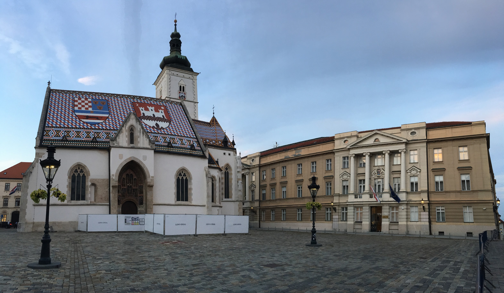

&nbsp;

Ve společnosti mého prvního zahraničního klienta bývalo vždy dobrým zvykem, že
na konci každého kvartálu se celá firma sjela do kanceláře v
[Záhřebu](https://cs.wikipedia.org/wiki/Z%C3%A1h%C5%99eb) a prodiskutovala, jak
se společnosti v uplynulém období dařilo. Pandemie
[COVID-19](https://cs.wikipedia.org/wiki/Covid-19) do toho trošku hodila
vidle, takže se mnoho zaměstnanců fyzicky nevidělo skoro dva roky. Nicméně
s příchodem očkování a rozvolňování opatření se začalo i ve firmě
hlasitě mluvit o tom, že by se tento zvyk mohl obnovit.

Týden před termínem plánované schůzky mi přišel email s oznámením, že do
[Záhřebu](https://cs.wikipedia.org/wiki/Z%C3%A1h%C5%99eb) mohou vycestovat všichni
zaměstnanci, kteří na cestě nebudou muset podstoupit
[PCR test](https://cs.wikipedia.org/wiki/Polymer%C3%A1zov%C3%A1_%C5%99et%C4%9Bzov%C3%A1_reakce)
a/nebo absolvovat karanténu. Protože jsem tuto podmínku jakožto očkovaná osoba
splnil, začal jsem plánovat cestu. Nejdříve jsem si nechal schválit rozpočet
na letenky, jízdenky, hotel a ostatní výdaje a následně jsem vše koupil.

Až o pár dní později jsem zjistil, že jsem také mohl napsat člověku pracujícímu
v jiném oddělení, který by se o vše výše zmíněné postaral. Nevadí, měl jsem už
vše zařízeno a koupeno, takže se jelo :-)

&nbsp;

#### DEN 0

Moje cesta začala odpoledním přesunem z [Brna](https://cs.wikipedia.org/wiki/Brno)
do [Vídně](https://cs.wikipedia.org/wiki/V%C3%ADde%C5%88). Na této trase jsem využil
žlutý vlak jedoucí z [Prahy](https://cs.wikipedia.org/wiki/Praha). Zpoždění se
ještě před příjezdem vlaku do [Brna](https://cs.wikipedia.org/wiki/Brno)  
vyšplhalo na 45 minut, které jsem strávil hleděním do blba. Nebyla to úplně zábava.
Zábavná byla ale cesta do [Vídně](https://cs.wikipedia.org/wiki/V%C3%ADde%C5%88),
při které jsem napsal článek na blog, který si můžete přečíst [zde](traveling_2021_Viden.html) :-)

Do hlavního města [Rakouska](https://cs.wikipedia.org/wiki/Rakousko) jsem dorazil
kolem 18:30. Po check-inu v [hotelu](https://www.booking.com/hotel/at/congresswien.cs.html)
jsem si na pokoji snědl večeři v podobě krůtího řízku s chlebem a mrkvičkou.
Tímto děkuji mamince za výborné jídlo <3 A protože jsem nechtěl jít ještě spát,
rozhodl jsem se vydat na menší večerní procházku po okolí. Nebylo moc času a
pomalu se začínalo stmívat, takže jsem se šel podívat pouze do gotického
[kostela sv. Alžběty](https://www.erzdioezese-wien.at/pages/index_pfarren_basic.siteswift),
který se nachází kousek od [hlavního nádraží](https://cs.wikipedia.org/wiki/Wien_Hauptbahnhof),
a tím pádem i od mého [hotelu](https://www.booking.com/hotel/at/congresswien.cs.html).

Po návratu na [hotel](https://www.booking.com/hotel/at/congresswien.cs.html) jsem
ještě něco málo udělal na počítači, osprchoval se a kolem desáté hodiny šel spát.

&nbsp;

#### DEN 1

Budík jsem si ve [Vídni](https://cs.wikipedia.org/wiki/V%C3%ADde%C5%88) nastavil na šest hodin.
Vstal jsem, zašel jsem do hotelové jídelny na smažená vajíčka s rajčaty a chlebem,
udělal jsem check-out v hotelu a online check-in na let do
[Záhřebu](https://cs.wikipedia.org/wiki/Z%C3%A1h%C5%99eb) a vydal se na
[letiště](https://cs.wikipedia.org/wiki/Leti%C5%A1t%C4%9B_V%C3%ADde%C5%88).
Tam jsem přijel kolem osmé hodiny vlakem.

Po průchodu pasovou a bezpečnostní kontrolou jsem v duty free zóně koupil
[tatranský čaj](https://www.alkohol.cz/produkty/tatratea-52-8259/) pro svoji
kolegyni Petru, která mě o něj speciálně poprosila. Protože
jsem byl na [letišti](https://cs.wikipedia.org/wiki/Leti%C5%A1t%C4%9B_V%C3%ADde%C5%88)
relativně brzo před odletem, stihl jsem udělat ještě pár věcí do práce.

Z [Vídně](https://cs.wikipedia.org/wiki/V%C3%ADde%C5%88) jsme odlétali v 10:10
malým vrtulovým letadlem, které bylo zaplněno asi
do poloviny své celkové kapacity. Let trval necelých 45 minut, takže než jsme
stačili vyletět do vzduchu, už jsme se chystali na přistání. Na malém moderním
[letišti Franjo Tudmana](https://cs.wikipedia.org/wiki/Leti%C5%A1t%C4%9B_Franjo_Tu%C4%91mana)
to vypadalo dost mrtvě. Nicméně i tak se mi podařilo najít stánek s turistickými
informacemi, kde mi paní poradila, jak se dostat do centra města. Protože mi autobus
odjížděl až za 30 minut, stihl jsem si ještě na
[letišti](https://cs.wikipedia.org/wiki/Leti%C5%A1t%C4%9B_Franjo_Tu%C4%91mana)
vybrat peníze a dát si ovocný salát.

Cesta autobusem do centra města trvala asi 45 minut a já měl celý autobus pro
sebe. Cestou jsem si začínal říkat, že to vypadá, jako bychom přijeli na východ.
Na předměstí se to hemžilo starými šedými paneláky, u kterých se zdálo, že se o ně
nikdo nestará. Ale kupodivu tam bydleli lidé. Po příjezdu do centra města se můj
dojem z chorvatského hlavního města moc nezměnil. Ubylo paneláků, přibylo secese,
ale šeď nezmizela.

Můj už tak špatný dojem nezlepšili ani místní lidé. S chorvatskými kolegy jsme
byli domluveni, že po mém příjezdu do kanceláře spolu zajdeme na oběd. Dopředu
jsem avizoval, kdy přiletím na letiště a kdy přibližně dorazím do kanceláře.
Přiznávám, asi o půl hodiny jsem se zpozdil, protože jsem byl ve městě poprvé
a v centru jsem chvíli tápal, na kterou tramvaj a kde přesně nastoupit. Na tom
ale nic nemění skutečnost, že když jsem s vyplazeným jazykem na vestě dorazil před prosklené
dveře naší kanceláře a podíval se skrz ně dovnitř, nikdo tam nebyl. Následně jsem
na [slacku](https://cs.wikipedia.org/wiki/Slack_(software)) zjistil,
do které [restaurace](https://platz.hr/) šli a já se vydal za nimi.
Tam mě ale čekalo další nemilé překvapení. U stolu pro šest lidí sedělo přesně šest lidí,
kteří měli už skoro po jídle a ani jeden z nich nebyl moc ochoten mi pomoct
vyřešit situaci s chybějící židlí. Nakonec to dopadlo to tak, že jsem si
vzal židli od vedlejšího stolu, jiný stůl se dvěma Chorvaty posunul o dva metry
dál a tím vytvořil místo na svoji židli, kterou jsem dal do čela stolu.
Chorvati byli v chillu a pohodě, na můj vkus ale až moc.

Na jídlo jsem si objednal podle kolegů typické chorvatské jídlo, které tvořily
papriky plněné mletým vepřovým masem. K nim se servírovalo uho a mačkané brambory.
Žádný fine dining to nebyl, ale něco teplého do žaludku, co zažene hlad, se hodilo.
Po obědě jsme se volně přesunuli do vedlejšího podniku, kde jsme strávili dalších
cca 30 minut pitím kávy. Zajímavé bylo, že
v [Chorvatsku](https://cs.wikipedia.org/wiki/Chorvatsko) neexistuje
koncept rozdělování jednoho účtu pro více lidí. To vedlo k tomu, že byl vybrán
vždy jeden nešťastník, který měl za úkol zaplatit a potom si vyřídit účty
s ostatními. V mém případě to také znamenalo, že se prakticky nedalo platit kartou.
A to nebylo nic příjemného. Při prvním výběru z bankomatu jsem to totiž netušil,
takže jsem si nevybral moc peněz. A každý výběr z bankomatu mě stál 24 HRK.

V kanceláři mě čekaly dvě pracovní schůzky - jedna s kolegyní Petrou, druhá s team
leadrem Lukou. Z kanceláře jsem odcházel kolem šesté hodiny jako jeden z posledních
společně s Lukou. Ten mi nabídl, že mě sveze
na [hotel](https://www.booking.com/hotel/hr/b-amp-b-schlosser-amp-concept.cs.html).
Ve výtahu mi říkal, že má nové auto a já mu budu rozumět lépe než on, protože navigace je nyní
v češtině. Když jsme dorazili k vozu, pochopil jsem. Na prakovišti totiž stála
černá [Škoda Octavia](https://cs.wikipedia.org/wiki/%C5%A0koda_Octavia) v provedení
combi :-) Cestou k hotelu mluvil hlavně Luka. Ukazoval, co se kde ve městě nachází
a na co se můžu jít podívat. Na [hotelu](https://www.booking.com/hotel/hr/b-amp-b-schlosser-amp-concept.cs.html),
kde byl pouze self-check-in, jsem potkal starší pár nějakých cizinců, kteří se
stejně jako já snažili dostat dovnitř. Nemluvili anglicky a byli hrozně zmatení,
takže jsem je vzal za ruku a ukázal jim, jak se do hotelu dostat.

Po vybalení věcí jsem se vzal a vyrazil do města. Před odjezdem do
[Chorvatska](https://cs.wikipedia.org/wiki/Chorvatsko) jsem se
na turistické atrakce nijak nepřipravoval, takže jsem prostě šel
do centra a čekal, co uvidím. Jediné, na co jsem se chtěl jít opravdu podívat, byla
[katedrála](https://cs.wikipedia.org/wiki/Katedr%C3%A1la_Nanebevzet%C3%AD_Panny_Marie,_svat%C3%A9ho_%C5%A0t%C4%9Bp%C3%A1na_a_svat%C3%A9ho_Ladislava),
u které jsem svoji prohlídku začal. Nebyla otevřená, takže jsem si u ní udělal jen
několik fotek a pokračoval dál. Historické centrum města je relativně malé.
Není proto divu, že za necelé dvě hodiny jsem ho prakticky
celé prošel a když jsem si poté na hotelovém pokoji googlil, co jsem to vlastně
viděl, zjistil jsem, že se jednalo skoro o všechny největší památky města. Vypíchl bych
hlavně [kostel sv. Marka](https://en.wikipedia.org/wiki/St._Mark's_Church,_Zagreb)
s neobvykle barevnou střechou, který stojí na stejnojmenném náměstí vedle
[sídla vlády](https://cs.wikipedia.org/wiki/B%C3%A1nsk%C3%BD_dv%C5%AFr).

Historické centrum města je protkané malými úzkými uličkami, ve kterých mě bavilo
bloudit. Širší centrum je zase plné starých secesních domů, které jsou ale dost
neudržované a omšelé, což městu ubírá na kráse. Když jsem se o kondici těchto staveb
bavil s místními, všichni říkali, že je to způsobeno i tím, že minulý rok
na jaře bylo v Záhřebu jedno
[velké silné zemětřesení](https://zpravy.aktualne.cz/zahranici/zahreb-chorvatsko-nejsilnejsi-zemetreseni-za-140-let/r~31147d3e6cec11eaa6f6ac1f6b220ee8/)
následované několika menšími, ze kterých se ještě místní nestačili
úplně vzpamatovat a opravit škody.

Po průzkumu města jsem zašel na jídlo do libanonské restaurace nacházející se
ve "žrací uličce" v centru města. Dal jsem si šátečky se sýrem a zeleninou a
grilované čevabčiči s hranolkama.
Na [hotel](https://www.booking.com/hotel/hr/b-amp-b-schlosser-amp-concept.cs.html)
jsem se vrátil kolem deváté hodiny, umyl jsem se a šel jsem spát.

&nbsp;

#### DEN 2

Druhý den v Záhřebu jsem se probudil hned v šest hodin. Bylo to ale dost zbytečné,
protože snídaně v podobě smažených vajíček s chlebem a zeleninou se podávala až
o půl deváté.

Po snídani jsem se vydal pěšky do kanceláře. Zvolil jsem cestu kolem
[hlavního nádraží](https://cs.wikipedia.org/wiki/Zagreb_Glavni_kolodvor)
a botanické zahrady, kterou jsem předchozí den nešel. V kanceláři se
spíš povídalo než pracovalo, takže než jsem se nadál, šlo se na oběd.
V [restauraci](https://www.maredogrill.com/) se náš sešlo už mnohem více
než včera, protože většina lidí přijela na firemní
meeting o den později než já. Na oběd jsem si objednal hamburger. Velkým překvapením
pro mě bylo, když mi číšník donesl grilované mleté maso se sýrovou náplní
uvnitř, bramborové dukátky a pita chleba. Byla toho obrovská porce, takže jsem se
hrozně přejedl. Po obědě následoval klasická odpolední káva ve vedlejší
[kavárně](https://caffe-bar-face2face.business.site/).

Odpoledne proběhl oficiální firemní meeting, kvůli kterému jsem
do [Chorvatska](https://cs.wikipedia.org/wiki/Chorvatsko) jel.
A musím říct, že to bylo super. Moc to o firemních schůzkách neříkám, ale tahle
vážně stála za to. Zástupce každého oddělení totiž ostatním řekl, co se jim za
poslední kvartál (ne)podařilo, takže jsem nejenom poznal zase o něco víc některé
lidi, ale hlavně jsem dostal větší povědomí o firmě a jejím fungování. Kromě toho
někteří kolegové vážně uměli mluvit, takže byla radost je poslouchat.

Po meetingu jsem se přesunul pěšky na hotelový pokoj, převlékl se a vyrazil na firemní
večeři do velice pěkné restaurace [Ficlek](https://www.facebook.com/GostionicaFiclek)
v centru města. Restaurace vaří klasická chorvatská jídla v moderním hávu. Bylo
tam příjemné prostředí a milá obsluha. Pokud pojedu někdy do Záhřebu znovu, rozhodně
tam zase zajdu. A co se jedlo? Na večeři se podávaly tři chody. V rámci každého
z nich se přineslo na stůl několik jídel a každý mohl ode všeho ochutnat. Výběr
byl následující:

- předkrm:
  - prkénko s nakrájenými uzeninami a sýry,
  - pečivo,
  - sýr cottage,
- hlavní jídlo:
  - zagrebački odrezak (řízek plněný sýrem a šunkou),
  - pohani picek (klasický řízek),
  - restani krumpir (lehce rozmačkané brambory),
  - mlinci (na kostky nakrájené chlebové těsto smíchané s něčím neidentifikovatelným),
- dezert:
  - knedle sa sezonskim voćem (knedle se sezónním ovocem - kadlátkama - a perníkem),
  - nějaká buchta.

Na pití se podávalo vše dle libosti hostů. Já jsem pil hruškovici, kterou objednali
moji kolegové u stolu na přípitek a potom přešli na víno. Já nechtěl nic kombinovat,
takže jsem zůstal u pálenky, která byla vynikající.

Kolem jedenácté hodiny jsem to v hospodě zabalil
a [Uberem](https://cs.wikipedia.org/wiki/Uber) se přesunul na hotel.

&nbsp;

#### DEN 3

V šest zazvonil budík a já musel vstávat, protože v osm mi letělo letadlo.
Na letiště mě zavezl [Uber](https://cs.wikipedia.org/wiki/Uber) s relativním
předstihem, takže jsem měl čas vypít heřmánkový čaj z místní kavárny a sníst
housky se salámem a sýrem, které pro mě připravila majitelka
[hotelu](https://www.booking.com/hotel/hr/b-amp-b-schlosser-amp-concept.cs.html)
Matea namísto snídaně.

Cesta zpět do [Česka](https://cs.wikipedia.org/wiki/%C4%8Cesko) už nebyla
v ničem extra zajímavá, takže jsem se v pořádku dostal
po trase [Záhřeb](https://cs.wikipedia.org/wiki/Z%C3%A1h%C5%99eb) -
[Vídeň](https://cs.wikipedia.org/wiki/V%C3%ADde%C5%88) -
[Brno](https://cs.wikipedia.org/wiki/Brno) až k nám do
[Žabin](https://cs.wikipedia.org/wiki/Brno-%C5%BDabov%C5%99esky)
a oběd jsem si dal už doma.

&nbsp;

#### FOTKY

Fotky ze [Záhřebu](https://cs.wikipedia.org/wiki/Z%C3%A1h%C5%99eb) najdete
[zde](https://photos.app.goo.gl/QgkgtgD2jUasN5a68).

---

[blog](../index.html)

- [seznam článků](content.html)
