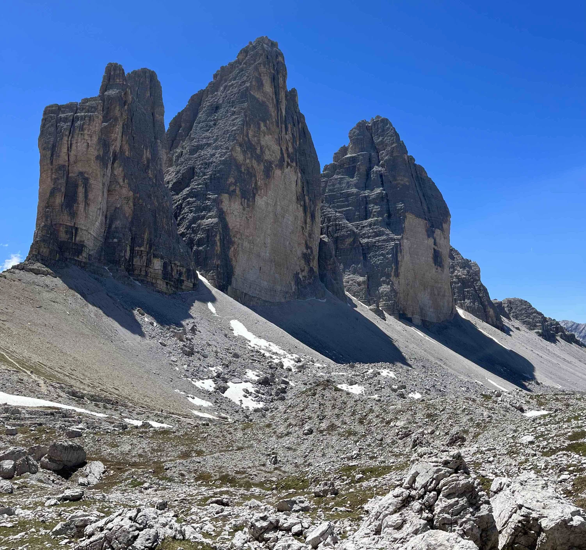
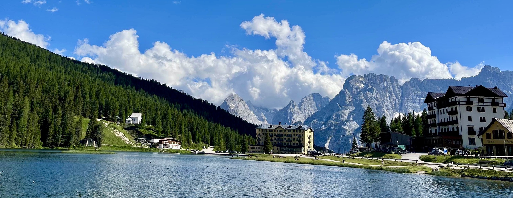
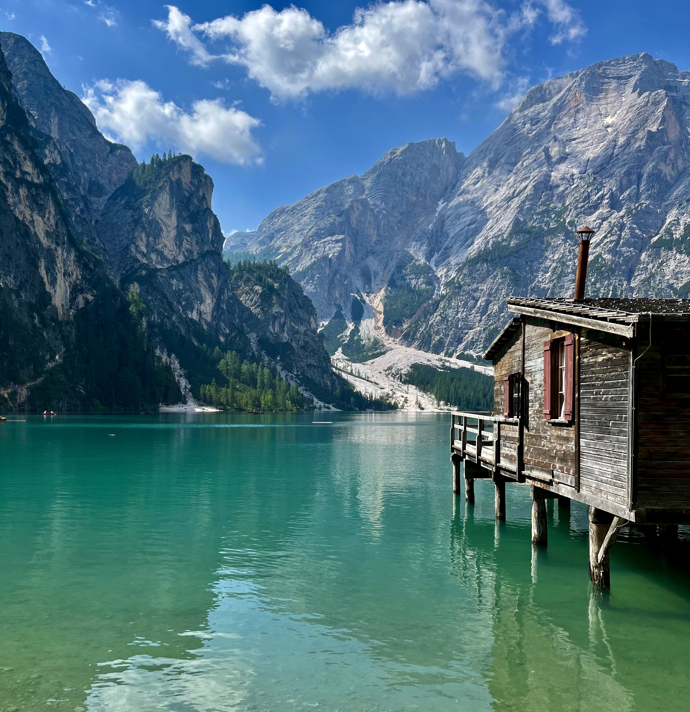

&nbsp;

Naprosto upřímně musím přiznat, že ještě před pár lety jsem ani nevěděl, že
nějaké Dolomity existují. Asi poprvé jsem se o nich dozvěděl díky [facebookové
stránce "Travel Bible"](https://www.facebook.com/travelbible.cz/),
kde [Matouš Vinš](http://www.matous-vins.cz/), jeden z autorů stejnojmenné
[knihy](https://travelbible.cz/), sdílel fotky ze svého výletu do nějakých
Dolomit, o kterých tvrdil, že figurují na jeho seznamu nejoblíbenějších cestovatelských
destinací. Když jsem začal googlit, zjistil jsem, že Dolomity jsou jedním
z horských masivů v italských Alpách. A podle fotek, které jsem našel, to tam
nevypadalo vůbec zle. V tu chvíli jsem si řekl, že když člověk, který toho
procestoval tolik, že o tom píše knihy, tvrdí, že je to jedno z nejhezčích
míst, které kdy navštívil, a navíc to není zase tak daleko z Česka, přidám
Dolomity na svůj cestovatelský seznam. Ten další destinaci určitě snese :-)

Potom jsem dlouho Dolomity neřešil. Někteří lidé, ať už známí nebo neznámí, sice
pohoří v severní Itálii navštívili a jejich fotky mě jen utvrdily v tom, že bych
se tam někdy moc rád podíval, ale nějak k tomu nikdy nebyla příležitost. Ta se
objevila až letos na začátku roku, kdy se naše malá rodinka rozrostla o 240 koní
a my tak začali přemýšlet, zda naše stádo lichokopytníků nevyužijeme k naší první
dovolené autem. A tak jsme přemýšleli, přemýšleli a přemýšleli... až jsme
vymysleli cestu do Chorvatska.

Ne, dělám si srandu. Do Dolomit!

A i když se naše cílová destinace nacházela v severní Itálii, rozhodli jsme se
nikam nespěchat a vzít to ještě malou oklikou přes Prahu a Hallstatt.

&nbsp;

#### DEN 0

V sobotu ráno jsme se v klidu nasnídali, sbalili si věci, nasedli do auta a
kolem 11. hodiny vyrazili na cestu.

Někde na 90. kilometru jsme zastavili na benzínové pumpě, kde jsme natankovali
palivo a dali si menší svačinku. Objednali jsme si hot dog maxi, který jsme snědli
napůl. Kvůli mojí nešikovnosti mi při druhém soustu kápnul kečup z rohlíku
na moje čerstvě vyprané béžové kraťasy, které jsem plánoval nosit alespoň ještě
další tři dny. Ještě jsme tedy nebyli ani v Praze a počet mých použitelných
kraťasů se rázem snížil o 50 %.

Po příjezdu do Prahy se stala druhá nepříjemnost. V hlavním městě jsme chtěli
zůstat jednu noc. A protože jsme jeli autem, musel jsem při plánování pobytu
přemýšlet nejen o tom, kde přespíme my, ale i o tom, kde necháme stát auto.
Nakonec jsem to vyřešil tak, že jsem autu rezervoval místo ve firemní
garáži a nám s Klárou jsem objednal hotel přímo naproti kanceláří. Když jsme
přijížděli k firmě, všiml jsem si, že před námi do garáže vjíždí auto. A tak jsem
šlápl na plyn a zařadil se těsně za auto před námi, abych nemusel vystupovat a
kartičkou si otevírat vrata. Vjel jsem tedy do garáže, do které jsem nikdy předtím
autem nevjížděl a měl jsem radost z toho, jak se mi podařilo ušetřit několik vteřin
drahocenného času. Když jsme ale projížděli garáží, u každého parkovacího místa
byl nápis "private" a žádné parkovací místo nebylo označeno logem naší firmy,
jak jsem očekával. Po chvíli jsme se proto zeptali
náhodného pána v garáži, zda neví, kde bychom firemní parkovací místa mohli najít.
Ten nám sdělil, že podle něj všechna místa patří obyvatelům rezidenčního objektu,
který s firmou přímo sousedí. Já tedy pochopil, že jsem se spletl
a vjel do úplně jiných vrat. Vyjeli jsme tedy z podzemí zase ven, tentokrát použili
kartičku ke vjezdu a rázem se otevřela vrata hned vedle těch, do kterých jsme vjeli
původně. V druhé podzemní garáži už byla parkovací místa hezky označena firemním
logem, takže jsme našli to naše a pohodlně zaparkovali.

Po martyriu spojeném s hledáním parkovacího místa nám vyhládlo, a tak jsme zašli
na jídlo do [Bistra Kro](https://www.krokitchen.cz/),
jednoho z oblíbených karlínských podniků, který se
zaměřuje na kuřecí speciality. Oba jsme si dali signature food v podobě trhaného
kuřecího masa s rýží, grilovanou zeleninou a kimči. Musím říct, že mi jídlo
moc chutnalo, takže až budou zase někdy ostatní kolegové v pražské kanceláři
dlouho přemýšlet o tom, kam zajít na oběd, já budu mít jasno!

Po jídle jsme zašli na kávu a zákusek do podniku, který se jmenuje
[Můj šálek kávy](https://mujsalekkavy.cz/en/).
O této kavárně jsem, narozdíl od Kláry, nikdy neslyšel, ale prostředí se
mi moc líbilo. A co víc!? Ochutnal jsem tam asi nejlepšího tvarohového míšu
ve svém životě. To byla velká paráda!

Po jídle jsme se prošli po Karlíně, navštívili
[kostel sv. Cyrila a Metoděje](https://cs.wikipedia.org/wiki/Kostel_svat%C3%A9ho_Cyrila_a_Metod%C4%9Bje_(Karl%C3%ADn))
a poté zamířili do kanceláře, kde jsem udělal Kláře menší komentovanou prohlídku
našich pracovních prostor. Po prohlídce jsme zamířili na hotel. Ubytovali jsme se
a na chvíli si zdřímli. Přijde mi, že jsme už asi staří, ale ta cesta, jídlo
a horko nás zmohly natolik, že jsme prostě vytuhli.

Když jsme se probudili, bylo už 18 hodin a to neznamenalo nic jiného, než že byl
čas večeře. Rozhodli jsme se, že když jsme v Praze po dlouhé době spolu, vyzkoušíme
ještě jeden slavný karlínský podnik, kterým je [Eska](https://eska.ambi.cz/cz/)
ze sítě Ambiente. Jedná se o fine diningovou restauraci v industriálním stylu, která se
nachází naproti [Fora Karlín](https://www.forumkarlin.cz/en/).
Já jsem na předkrm vyzkoušel chřest s vejcem 63 a silným šunkovým vývarem.
Potom jsem váhal, zda si dát druhý chod, nebo ne. Nakonec jsem si dal "jejich"
pečené brambory v pěně s grilovaným kaprem a koprem. A to byla chyba. Jídlo sice
nebylo špatné, ale bylo toho na mě už tolik, že jsem to nemohl dojíst a potom
jsem se necítil dobře.

Naštěstí se nejednalo o nic dramatického, takže jsme mohli pokračovat v programu.
Na naší pražské tour nás totiž čekala ještě jedna, řekl bych hlavní, zastávka,
kvůli které jsme se do Prahy vydali. V O2 Areně totiž ten den vystoupila skupina
[My Chemical Romance](https://cs.wikipedia.org/wiki/My_Chemical_Romance), dnes
už emo-rocková legenda z USA. Musím říct, že na dva roky
odkládané vystoupení jsem se docela těšil. Kapelu jsem poslouchal už na střední
škole a vidět ji hrát naživo byl dlouhou dobu můj sen. Bohužel mě ale vystoupení
trošku zklamalo. Nevím, zda jsme stáli na nějakém horším místě, ale podle mě
celkový dojem hodně kazil špatný zvuk. Ani jeden z nástrojů nebyl moc konkrétní.
Osobně jsem skoro nerozuměl hlavnímu zpěvákovi a doprovodné zpěvy jsem neslyšel
vůbec. Co se týče show, ta byla nulová. Na druhou stranu, pokud by byl dobrý zvuk,
žádná show by podle mě ani nebyla potřeba. Takto mě ale vystoupení moc nebavilo,
a tak jsme před poslední písničkou odešli z O2 Areny dřív, abychom se nemuseli
cpát s ostatními lidmi v metru na cestě na hotel.

&nbsp;

*Čekání na vystoupení Ministerstva České republiky v O2 Areně v Praze.*

&nbsp;

První den byl u konce a mě paradoxně víc bavilo trhané kuře s rýží a tvarohový
míša než živák skupiny, která se podílela na formaci mého hudebního vkusu.

Nevadí, jedeme dál!

&nbsp;

#### DEN 1

V neděli jsme vstali kolem osmé hodiny a zašli si na hotelovou snídani, kde jsme
potkali sousedy ze včerejšího oběda v [Bistru Kro](https://www.krokitchen.cz/).
Já si dal smažená vajíčka (tj. vaječina, pozn. pro čtenáře ze severu) s chlebem a
zeleninou, Klára zvolila sladkou variantu v podobě plněných šátečků a čerstvého ovoce. Při
check-outu na hotelové recepci, na které nepracoval jediný rodilý mluvčí, nám paní
recepční skoro naúčtovala dvě noci strávené v jiném pokoji. Naštěstí jsem si vedl
evidenci o provedených platbách, takže jsem věděl, že hotel je už zaplacený.
Po trošku neobvyklém check-outu jsme se pozdravili s naším panem ředitelem,
který ve firemních garážích vyzvedával svoje auto stejně jako my. Nasedli jsme
a vyrazili na jih.

Po skoro šesti hodinách cesty a jedné zastávce v Linci v McDonald's na oběd jsme
dorazili do [Hallstattu](https://cs.wikipedia.org/wiki/Hallstatt),
malebné vesničky u stejnojmenného jezera, které je
obklopeno horami ze všech stran. Nejdříve jsme zajeli do vedlejší vesničky
Obertraun, kde jsme se ubytovali v penzionu u slovensky mluvící paní. Ta nám dala
několik tipů, co můžeme v okolí [Hallstattu](https://cs.wikipedia.org/wiki/Hallstatt)
dělat, ale my měli program na ten den jasný - chtěli jsme vidět samotný
[Hallstatt](https://cs.wikipedia.org/wiki/Hallstatt).

Auto jsme nechali na malém parkovišti kousek za cedulí u vjezdu do vesnice, vybrali
si hotovost a půjčili si šlapadlo ve tvaru obří labutě, abychom se podívali na
[Hallstatt](https://cs.wikipedia.org/wiki/Hallstatt) z jezera.
Osobně jsem čekal, že se nám tak ukáže ikonický pohled na
kostelík obklopený z jedné strany horami a z druhé strany vodou. To bychom ale
pravděpodobně museli došlapat dál. Šlapadlo jsme měli půjčené pouze na 30 minut
a Klára se navíc bála, že se převrhneme, takže jsme moc daleko nedojeli.

Po vrácení šlapadla jsme si prošli malé náměstí, navštívili evangelický i katolický
kostel a zašli si na večeři do jedné z restaurací s terasou u jezera. Já jsem si
dal hovězí vývar s celestýnskými nudlemi a knedle s vajíčkem a slaninou. Klára měla
špecle s vajíčkem. Po jídle jsme se ještě prošli po
[Hallstattu](https://cs.wikipedia.org/wiki/Hallstatt) a hlavně našli
místo, odkud bylo možné si udělat známou fotku, kterou jsem popisoval výše, aniž
by si člověk musel půjčovat šlapadlo.

&nbsp;

*Ikonický pohled na [Hallstatt](https://cs.wikipedia.org/wiki/Hallstatt).*

&nbsp;

Na hotel jsme dorazili kolem osmé hodiny, umyli se a po náročném dni šli spát.

&nbsp;

#### DEN 2

Pondělí bylo dnem, který jsme měli vyhrazený pro přesun do cílové stanice naší
cesty, vesničky [Sesto](https://cs.wikipedia.org/wiki/Sexten) v severní Itálii.

Ráno jsme tedy vstali, dali si klasickou alpskou snídani v podobě pečiva s máslem,
salámem, sýrem a zeleninou, nasedli do auta a vyrazili na cestu!

Zastavili jsme pouze jednou na benzince a poté v jedné malé horské vesničce na
oběd. Zaparkovali jsme auto kousek od návsi a chvíli hledali podnik, kde
bychom se mohli najíst. Po nějaké době jsme uviděli vývěsní štít s logem irského
piva Guinness, pod kterým svítil neonový nápis "OPEN". Vešli jsme proto dovnitř
a řekli si, že zkusíme štěstí. Ocitli jsme se v temné chodbičce, kterou se
procházelo dál do hlavní části lokálu kolem páchnoucích záchodů. Po chvíli jsme
přišli do velké temné místnosti, která byla vyzdobena plakáty s různými světovými
značkami piva, smrděla po cigaretách a nikdo v ní nebyl. Nejdřív jsem si
myslel, že někdo stojí v koutě místnosti a dívá se na mě. Po chvíli jsem si ale
uvědomil, že je to jen další kartonová dekorace v podobě pro mě neznámého
filmového hrdiny. Když jsem se ale otočil a našel bar, zjistil jsem, že za ním
stojí tlusťoučký postarší pán. Přišli jsme tedy za ním a zeptali se, zda je možné
se v jeho podniku najíst. On na to odvětil, že se máme posadit. V temném
prostředí se nám moc sedět nechtělo, a tak jsme vyšli velkými dveřmi ven na
dlážděnou zahrádku, na které se nacházela spousta květináčů,
stromů a nevkusného nábytku. Vzali jsme místo a v menu si vybrali plněné
těstovinové taštičky. Já jsem si objednal taštičky plněné mletým masem, Klára
si vybrala taštičky plněné mačkanými brambory. Během čekání na jídlo Klára
vytáhla telefon a začala pročítat
[recenze na Googlu](https://www.google.com/maps/place/Bar-Restaurant+Piano/@46.7505075,13.1777991,16z/data=!4m13!1m7!3m6!1s0x4770ab6edd7e99ff:0x7b10624adf1acdc!2sGreifenburg,+Rakousko!3b1!8m2!3d46.7506974!4d13.1809373!3m4!1s0x0:0x93a585678d798a20!8m2!3d46.7505345!4d13.1817297).
Po chvíli telefon odložila se slovy, že pokud se tam chce najíst, dál číst nemůže.
Nakonec se ukázalo, že naše očekávání byla horší než realita. Podnik sice nevypadal
nejlépe, ale jídlo nám moc chutnalo. Pán mě potom ještě nechal odejít na náves
do bankomatu, abych si vybral peníze na zaplacení. Karty totiž nepřijímali.

Po nevšedním obědě v [restauraci](http://www.pianobar.at/), která byla vyhrazena
jen pro nás, jsme pokračovali v cestě. A jeli jsme tak dlouho, až jsme kolem
15:30 dorazili do malebné vesničky [Sesto](https://cs.wikipedia.org/wiki/Sexten),
která se nachází v severní Itálii kousek za rakouskými
hranicemi. Ubytovali jsme se v penzionu na konci vesnice. Byla to velká patrová
budova s bílou fasádou a výraznými dřevěnými prvky. Nepřipomíná vám to něco?
Mně by se při takovém popisu vybavila Řeka 142 a Bobova vysněná chalupa v alpském
stylu. Myslím, že jemu by se náš penzion opravdu moc líbil.

&nbsp;

*Penzion Unteradamerhof ve vesnici [Sesto](https://cs.wikipedia.org/wiki/Sexten).*

&nbsp;

Po check-inu jsme si vzali vodu a vyrazili na průzkum okolí. Prošli jsme
se kolem řeky až na druhý konec vesnice. Cestou zpět jsme se zastavili v kostele
a vyšlápli si kopec nad ním, odkud jsme měli možnost vidět široko do údolí.
Procházku jsme zakončili v [Pizzerii Erich](https://www.tripadvisor.com/Restaurant_Review-g194915-d3456249-Reviews-Pizzeria_Ristorante_Erich-Sesto_Province_of_South_Tyrol_Trentino_Alto_Adige.html),
jen kousek od našeho penzionu, kde jsme byli ten den poprvé na večeři.

&nbsp;

*Pohled na okolní hory z polany ve vesničce [Sesto](https://cs.wikipedia.org/wiki/Sexten).*

&nbsp;

Já si objednal lokální pizzu Tre Cime. Měl na ní být sýr, párek a speck, což je
podle mě lokální označení pro prosciutto. Na pizzu jsme čekali skoro hodinu.
Vtipné ale bylo, že když ji přinesli, postarší číšník dal talíř s pizzou před
Kláru, potom přede mě, pak se podíval na moji pizzu a řekl něco v tom smyslu, že
zapomněl na speck. Vzal tedy talíř a odběhl do kuchyně. Po dalších několika
minutách se vrátil s pizzou, na které už speck nechyběl, a tak jsem se mohl pustit
do jídla i já.

Po večeři jsme si prošli ještě horní část vesnice za naším penzionem a potom se
odebrali na pokoj.

&nbsp;

#### DEN 3

První den v Sestu jsme vstali v 8 hodin a vydali se na snídani. Paní
majitelka měla v jídelně připravené čtyři stoly. Na každém z nich se nacházel
košík s pečivem, máslo, domácí lučina, marmeláda, jogurt, musli a palačinky. Paní
nás usadila ke stolu u okna a zeptala se, zda máme zájem o kávu nebo čaj. Za chvíli
přicupitala s konvicí čaje, dvěma skleničkami džusu a dvěma malými talířky.
Na jednom z nich byl výběr salámů, na druhém několik plátků sýra. A tento scénář
se opakoval každý následující den. Paní se sice už neptala, zda si dáme čaj nebo kávu
a taky nám už nikdy nenaservírovala palačinky, jinak bylo ale menu stejné.
Já jsem tedy každý den jedl pečivo s lučinou, salámem a sýrem. Klára naopak volila
vždy jinou sladkou variantu snídaně.

Bylo také zajímavé pozorovat, jak si paní pamatovala různé stravovací návyky svých
hostů. My jsme např. první den nesnědli musli, a tak jsme už následující den žádné
nedostali. Dalším příkladem může být druhý den našeho pobytu, kdy jsem nevypil
pomerančový džus, takže od třetího dne jsme dostávali vždy už jen jeden.
Naopak tomu bylo u vedlejšího stolu.
Německy mluvící pár jedlíků ve středních letech vždy vyluxoval úplně celý stůl.
Není se tedy čemu divit, že ti dostali každý den musli, jogurt i dva džusíky.

Paní se taky každý den snažila o ranní small talk se svými hosty. Často se
tedy stávalo, že když donesla na stůl salámy a sýry, prohodila s nimi pár vět.
Stejně jako všichni domorodci z Dolomit uměla mluvit italsky i německy, takže
komunikace s ostatními hosty z Rakouska nebo Itálie jí nečinila problém. Problém
ale nastal, když zkusila komunikovat s námi, jedinými hosty, kteří uměli jen česky a
anglicky. Jednou k nám paní přišla s jídlem a na něco se nás zeptala. V jedné větě
tehdy použila slova "Samstag" a "Haus". Já si z toho vyvodil, že se nás ptá, zda
už v sobotu jedeme domů. To byla pravda, takže jsem odpověděl: "Ja." Chtěl jsem
se paní taky na něco zeptat. Ve své zásobě německých vět jsem měl ale jen těžko
pro konverzaci použitelné jazykolamy "Meine Mäuse haben Läuse" a "In der Höhle,
klagt der Löwe", a tak jsem s vypětím všech sil zkombinoval angličtinu s němčinou
a pokusil se přepoužít pro mě nové slovíčko "Haus" ve větě: "This Haus ist dust
Haus?", čímž jsem se snažil zeptat, zda jí patří penzion, ve kterém
se nacházíme. Paní asi pochopila, na co se ptám, a tak s úsměvem odpověděla "Ja."
Potom paní ale došlo, že s námi si moc nepokecá, takže v diskuzi už nepokračovala.
V následujících dnech se už ani moc nesnažila, a tak se naše konverzace smrskla
pouze na dvě věty. Paní se vždy zeptala: "So... gut?", a já odpověděl: "Alles gute!"

Po snídani nás čekal první celý den v Dolomitech. A ten nešlo strávit jinak než
u symbolu celého regionu, [skal Tre Cime](https://cs.wikipedia.org/wiki/Tre_Cime).
Cesta autem k chatě [Rifugio Auronzo](http://www.rifugioauronzo.it/), u
které začínala naše túra, nám zabrala asi 2 hodiny. Z toho polovinu času
jsme ale strávili stáním v koloně při čekání na mýtnou bránu. Pro vjezd
k [Tre Cime](https://cs.wikipedia.org/wiki/Tre_Cime) totiž bylo nutné zaplatit
poplatek ve výši 30 EUR.

Po zaparkování auta pod chatou jsme si vzali věci a vyrazili na túru. Ta vedla
kolem pravděpodobně nejslavnějšího masivu Dolomit nesoucí název
[Tre Cime](https://cs.wikipedia.org/wiki/Tre_Cime).
Přibližně po prvním kilometru, který jsme strávili na kamenité prašné cestě obklopeni
bílými skalami, jsme se zastavili na oběd v jedné z horských chat. Klára si dala
gnocchi s boloňskou omáčkou, já špagety s rajčatovou omáčkou. Nevím, jestli nejsme
až moc rozmlsaní, ale podle mě to bylo jedno z nejhorších jídel v mém životě.
Klářiny gnocchi byly úplně rozvařené a ragů nemělo žádnou chuť. Naopak moje špagety
by ještě nějakou chvíli ve vroucí vodě snesly. A moje rajčatová omáčka? To byl
spíš takový lepší kečup! Protože je ale hlad nejlepší kuchař, byli jsme rádi, že
jsme něco snědli a šli jsme dál.

Z jižní strany jsme obešli masiv proti směru hodinových ručiček, až jsme se dostali
na vrchol Paternsattel. Tam jsme byli skalám asi nejblíž za celou túru, takže jsme
je měli skoro na dosah ruky. Čekala nás druhá polovina treku kolem severní strany
masivu. V této části cesty jsme už procházeli spíše zelenými loukami, které nabízely
asi nejslavnější pohled na tři skalní útvary. Po celkem 4 hodinách a cca 10 ušlých
kilometrech jsme ukončili okruh na stejném místě, kde jsme začali, chatě
[Rifugio Auronzo](http://www.rifugioauronzo.it/).
Tam jsme si dali kávu a zákusek a kolem 17. hodiny vyrazili k jezerům
[Lago di Landro](https://it.wikipedia.org/wiki/Lago_di_Landro) a
[Lago di Misurina](https://cs.wikipedia.org/wiki/Lago_di_Misurina).

&nbsp;

*Pohled na skály [Tre Cime](https://cs.wikipedia.org/wiki/Tre_Cime) od severovýchodu.*

&nbsp;

U každého z nich jsme se na chvíli zastavili, prošli se a udělali několik fotek,
zvláště druhé zmíněné mi přišlo jako z jiného světa. Nádherná modrá voda, kolem
krásné jehličnaté lesy a v pozadí impozantní skalnaté hory, některé z nich ještě
místy pokryté sněhem. Myslel jsem si, že podobné scenérie nabízí maximálně národní
parky v Kanadě, nebo Spojených státech amerických, a ne že je máme 7 hodin cesty
autem z Brna. Bohužel i u těchto jezer je jasně viditelný zásah lidské vůle, a
tak kromě nádherných scenérií musí návštěvník zkousnout pohled na velké množství
hotelů a restauračních zařízení, které dojem lehce kazí.

&nbsp;

*[Lago di Misurina](https://cs.wikipedia.org/wiki/Lago_di_Misurina).*

&nbsp;

Po prohlídce jezer jsme nasedli do auta a vyrazili do vesničky Innichen, kde jsme
si dali večeři v jednom malém bistru. Protože v podniku nevařili, objednali jsme
si talíř s variací uzenin a sýrů. Jako dezert jsme ochutnali zmrzlinu, která měla
(alespoň v menu) značku Gelato di Italia 2020. Nevím, zda je tato cena nějak
prestižní, ale upřímně řečeno, zmrzlina to byla skutečně skvělá!

Zpět na penzion jsme dorazili kolem 19:30, osprchovali se a brzo šli spát.

&nbsp;

#### DEN 4

Druhý den po túře kolem [Tre Cime](https://cs.wikipedia.org/wiki/Tre_Cime)
nás čekalo nepříjemné překvapení. Vzbudili jsme
se už kolem sedmé hodiny, rudí jako raci a někteří z nás i trošku malátní. Podle
příznaků to vypadalo, že má Klára úžeh. Po snídani jsem proto zašel do lékárny
a koupil tam krém na opalování i krém po opalování, kterým jsme se oba namazali.

A protože nás kvalitní alpská strava trošku postavila na nohy, rozhodli jsme se
pokračovat v programu, jak bylo původně v plánu. Sedli jsme proto do auta a
vyrazili k nedalekému jezeru [Lago di Braies](https://cs.wikipedia.org/wiki/Lago_di_Braies),
jednomu z nejnavštěvovanějších jezer celých Dolomit. A myslím, že tento titul drží
[Lago di Braies](https://cs.wikipedia.org/wiki/Lago_di_Braies) právem.

Po příjezdu k jezeru jsme zaparkovali auto na parkovišti a vyrazili na okružní
túru kolem jezera, která měla přibližně 3,5 km. Většinu času se šlo okolními
jehličnatými lesy a zvlášť na začátku byl terén velice lehký a dobře přístupný.
To se změnilo až na druhé straně jezera, kde ubylo stromů a naopak přibylo kamení.
A taky krav! Pokud na [Kubě](https://cs.wikipedia.org/wiki/Kuba) mají
[Zátoku Sviní](https://cs.wikipedia.org/wiki/Z%C3%A1toka_Svin%C3%AD) a na
[Bahamách](https://cs.wikipedia.org/wiki/Bahamy) se můžete koupat s divokými
prasaty na [Pláži prasat](https://en.wikipedia.org/wiki/Pig_Beach),
pak u [Lago di Braies](https://cs.wikipedia.org/wiki/Lago_di_Braies) mají zase krávy!
V jednom místě se u jezera páslo stádo krav a některé z nich neváhaly a
šly se v teplém počasí osvěžit do vody. Někteří lidé považovali krávy za obrovskou
atrakci, a tak se s velkými býložravci fotili, hladili je, nebo se dokonce kousek
od nich koupali. Na začátku naší túry jsem měl taky chuť skočit do vody. Když
jsem ale viděl, co všechno krávy do vody vyměšují, už mě to tolik nelákalo.

&nbsp;

*[Lago di Braies](https://cs.wikipedia.org/wiki/Lago_di_Braies).*

&nbsp;

Po návratu k parkovišti jsme si zašli na oběd do bistra u jezera. Já jsem si dal
ravioli plněné špenátem a ricottou, Klára si objednala polentovou kaši se sýrem a
žampiony.

Po obědě jsme nasedli do auta a pokračovali jsme do malebné vesničky
[St. Magdalena](https://en.mapy.cz/zakladni?x=11.7146136&y=46.6433293&z=12&source=osm&id=322243),
kde jsme se prošli k místnímu kostelu a udělali několik fotek malebného údolí
[Val di Funes](https://italie.svetadily.cz/clanky/Val-di-Funes-horska-krajina-jako-z-pohadky),
za kterým ční majestátní skalnaté hory. Tyto fotky jsou pro mě
dalším symbolem Dolomit, takže návštěvu vesničky jsme nemohli vynechat. Při cestě
zpět k autu začalo pršet, a tak jsme se zastavili v moderním
[Hotelu Tyrol](https://www.tyrol-hotel.eu/en/hotel-tyrol-1.html), kde
jsme si dali kávu a zákusek v podobě vynikajícího jablečného štrůdlu se šlehačkou.

&nbsp;

*[Val di Funes](https://italie.svetadily.cz/clanky/Val-di-Funes-horska-krajina-jako-z-pohadky).*

&nbsp;

Po několika desítkách minut pršet přestalo, takže jsme zaplatili a pokračovali
k poslední zastávce daného dne, jezeru
[Lago di Carezza](https://en.wikipedia.org/wiki/Karersee). Po asi 90 minutách v autě
jsme zaparkovali auto na parkovišti a prošli se kolem malebného jezera s průzračnou
modrou vodou, které je položeno v nadmořské výšce 1,500 m n. m. Jezero je o dost
menší než [Lago di Braies](https://cs.wikipedia.org/wiki/Lago_di_Braies),
takže nám procházka na úpatí okolních skalnatých hor nezabrala více než 30 minut.
Mně osobně se [Lago di Carezza](https://en.wikipedia.org/wiki/Karersee) líbilo asi
nejvíce ze všech jezer v Dolomitech. Malé jezero položené vysoko v horách, s malým
počtem návštěvníků, křišťálově modrou vodou a nulovým počtem hotelů působilo úplně
jinak než ostatní jezera obklopená hromadou lidí, krávami, nebo komerčními stavbami.

&nbsp;

*[Lago di Carezza](https://en.wikipedia.org/wiki/Karersee).*

&nbsp;

Před odjezdem jsme si dali večeři v místním bufetu v podobě grilovaného
párku s hranolky, nasedli do auta a plni dojmů frčeli do našeho dočasného domova
ve vesničce [Sesto](https://cs.wikipedia.org/wiki/Sexten).

&nbsp;

#### DEN 5

Třetí den v Dolomitech byl pro mě strašák. Před odjezdem do Itálie nám předpověď
počasí ukazovala, že má celý týden pršet. Dlouho jsme se proto rozhodovali, zda
dovolenou na poslední chvíli nezrušit. Během pár dní před příjezdem do Dolomit
se ale předpověď ustálila na tom, že pršet by mělo pouze v průběhu našeho třetího
dne dovolené, a tak jsme se nakonec rozhodli do Itálie vyrazit. Ráno po probuzení
se mi ale nevstávalo úplně dobře, protože jsme měl tušení, že zmokneme.

Klára se naopak po negativní zkušenosti se sluníčkem nějakému dešti nebránila,
a tak jsme zašli na snídani a potom vyrazili vstříc novému dobrodružství.

Asi po dvou hodinách cesty jsme dorazili do malého městečka St. Ulrich vysoko
v horách, kde jsme nechali auto v místních podzemních garážích a nastoupili
na lanovku, která nás měla dovézt na vrchol hory Mont Seuc. Asi 15 minut jsme jeli
v kabině nahoru a dívali se pod sebe na sjezdovky, bike traily a městečko St. Ulrich.
Potom jsme se dostali na hřeben hory a tam se nám otevřel neskutečný výhled
na zelenou polanu [Alpe di Siusi](https://en.wikipedia.org/wiki/Seiser_Alm),
která byla řídce posetá malými dřevěnými
chaloupkami a z druhé strany ohraničena vysokými skalnatými horami. Pokud si nějak
představuji ráj, tak takto. Moje emoce byly v tu chvíli jako na horské dráze. V lanovce
jsem měl strach z obrovské výšky, ve které jsme se nacházeli, a navíc jsem pořád přemýšlel nad
tím, že pokud ten den přijde bouřka, tak na horách zemřeme. Potom jsme ale vystoupili
ven a mě naplnil pocit obrovského štěstí a vděčnosti, že můžu něco tak nádherného
vidět na vlastní oči. Bylo to pro mě neuvěřitelné!

&nbsp;

*Pohled na polanu [Alpe di Siusi](https://en.wikipedia.org/wiki/Seiser_Alm) a masiv Langkofel.*

&nbsp;

Když jsem se trošku uklidnil, vytáhl jsem z batohu oběd v podobě rohlíku s
máslem, salámem a sýrem, který jsme si udělali v našem penzionu na snídani a
společně s Klárou jsme vyrazili na 10 km dlouhou túru po
[Alpe di Siusi](https://en.wikipedia.org/wiki/Seiser_Alm).
Asi po 10 minutách chůze po zelené louce jsem začal pozorovat, že na obzoru se
jedna z mnoha vysokých hor začíná zahalovat do hustých šedých mraků. V tu chvíli
jsem si říkal, že bouřka je tady. Naštěstí to nebyla bouřka, ale jen déšť. Já jsem
si oblékl bundu, Klára vytáhla pláštěnku a v hustém dešti jsme pokračovali dál.
Asi po 20 minutách mrak zmizel, vysvitlo sluníčko a nám se znovu otevřel výhled
na malebné okolí.

&nbsp;

*Pohled na polanu [Alpe di Siusi](https://en.wikipedia.org/wiki/Seiser_Alm) zahalené do mraků.*

&nbsp;

Trasa naší túry nejdříve vedla po asfaltové cestě k Hotelu Panorama, kde jsme
si dali kávu a pravděpodobně zkažený zákusek s názvem "Dark Forest". Naštěstí nám nebylo
špatně, a tak jsme pokračovali dál po zelených loukách kolem dřevěných chaloupek
zpět k lanovce. Každou chvíli jsem se zastavoval, abych si udělal fotku majestátního
masivu Langkofel. Celá krajina se mi líbila tak moc, že před nástupem na lanovku
jsem si vyžádal, abychom si sedli na lavičku a chvíli se ještě kochali okolím.
Myslím, že nebudu přehánět, když řeknu, že polana
[Alpe di Siusi](https://en.wikipedia.org/wiki/Seiser_Alm) je jedním z nejhezčích
míst, které jsem kdy ve svém životě navštívil.

Po nádherné túře jsme sjeli lanovkou z Mont Seuc zpět do městečka St. Ulrich,
zaplatili za parkování a vydali se zpět do Sesta. Tam jsme zašli na večeři do
"naší" [Pizzerie Erich](https://www.tripadvisor.com/Restaurant_Review-g194915-d3456249-Reviews-Pizzeria_Ristorante_Erich-Sesto_Province_of_South_Tyrol_Trentino_Alto_Adige.html),
kde nás už poznávali. Já jsem si dal ostrý guláš s kulatými
knedlíky se speckem, Klára si objednala pizzu Italy s mozzarellou bufala.

Po večeři jsme se přesunuli do penzionu a po náročném dni šli rovnou na kutě.

&nbsp;

#### DEN 6

Poslední den v Dolomitech jsme měli na programu celodenní túru k jezeru
[Lago di Sorapis](https://cs.wikipedia.org/wiki/Lago_di_Sorapiss),
dalšího z dolomitských jezer, které je unikátní tím, že k němu
nevede žádná silnice, takže se k němu nedá dostat jinak než pěšky.

Po snídani jsme si proto sbalili batůžky, nasedli do auta a vyrazili k Hotelu Passo
Tre Croci, hotelu někde v lese, kde lišky dávají dobrou noc a kde mj. začíná trek
k [Lago di Sorapis](https://cs.wikipedia.org/wiki/Lago_di_Sorapiss).

Cesta vedla nejdříve lesem po široké cestě kolem zachovalých opevnění z 1. světové
války. Poté však cesta přešla v úzký kamenitý horský chodníček. Ten nejdříve vedl
relativně po rovince, později se však začalo stoupat do strmých skal, kde jsme se
museli přidržovat zábradlí, na některých úsecích stoupat po schodech a také se
vyhýbat ostatním turistům jdoucím v protisměru nad vysokým srázem. Myslel jsem
si, že túra bude v pohodě, ale ve skalách jsem pochopil, proč ji náš knižní
průvodce označil střední náročností, a to jako jedinou z našich absolvovaných
túr na této dovolené.

&nbsp;

*Kamenitá cesta ve skalách vedoucí k [Lago di Sorapis](https://cs.wikipedia.org/wiki/Lago_di_Sorapiss).*

&nbsp;

Když jsme přišli k jezeru, byla tam hromada lidí. Někteří navíc chtěli ulovit co
nejlepší fotku, jak se vystavují na kameni uprostřed jezera, a tak kazili fotky
nám ostatním. Na chvíli jsme si s Klárou sedli na rozpálené kameny na břehu,
dali si oběd v podobě snídaňového menu z penzionu a malinko znechucení se vydali
na cestu zpět.

&nbsp;

*[Lago di Sorapis](https://cs.wikipedia.org/wiki/Lago_di_Sorapiss) a kámen, na kterém se chtěl každý otrapa vyfotit.*

&nbsp;

Pokud cesta tam byla náročná, cesta zpět byla naprosté peklo. Naše špatná fyzická
kondice, ostré slunce, náročný terén a malé zásoby vody si vybraly svoji daň.
Po dvou hodinách na cestě zpět jsme proto byli rádi, že jsme dorazili zpět
k autu a mohli se vydat do Sesta. Cestou jsme se ještě zastavili u
[Lago di Misurina](https://cs.wikipedia.org/wiki/Lago_di_Misurina),
kde jsme se občerstvili vodou a zákuskem v jedné z místních restaurací.
Po příjezdu na penzion jsme si chvíli lehli a odpočívali.

Když jsme se trošku vzpamatovali, vydali jsme se na večeři do "naší" restaurace,
kde jsem vyzkoušel grilovanou zeleninu se sýrem a pečenými brambory. Klára znovu
nezklamala a při naší třetí návštěvě restaurace si objednala třetí pizzu!
Protože se jednalo o naši poslední večeři, rozhodl jsem se, že si dám ještě
zákusek v podobě místní pana cotty. A musím říct, že byla výborná!

Po jídle jsme se přesunuli na penzion a začali se balit na cestu domů.

&nbsp;

#### DEN 7

Ráno jsme nikam nespěchali. Zašli jsme si v klidu na snídani, dobalili věci,
rozloučili se s paní majitelkou a vyrazili na cestu. Po několika zastávkách,
problémech s naším rádiem v autě a 7 hodinách za volantem jsme konečně dorazili
domů!

&nbsp;

#### DOJMY Z DOLOMIT

- Na severu Itálie moc lidí anglicky nemluvilo, což pro nás nebylo snadné.
- Cesta autem pro mě byla náročná, ale stálo to za to.
- Po páté snídani v penzionu jsem se už opravdu těšil na domácí stravu.
- Údolí [Val di Funes](https://italie.svetadily.cz/clanky/Val-di-Funes-horska-krajina-jako-z-pohadky)
a polana [Alpe di Siusi](https://en.wikipedia.org/wiki/Seiser_Alm) jsou jedněmi
z nejhezčích míst, které jsem kdy v životě navštívil.
- Naprosto chápu, proč si [Matouš Vinš](http://www.matous-vins.cz/) Dolomity oblíbil.
- Příště bych se rád podíval na Secedu, šel zase pozdravit sympatické zaměstnance
v [Pizzerii Erich](https://www.tripadvisor.com/Restaurant_Review-g194915-d3456249-Reviews-Pizzeria_Ristorante_Erich-Sesto_Province_of_South_Tyrol_Trentino_Alto_Adige.html)
a ubytoval se v [Hotelu Tyrol](https://www.tyrol-hotel.eu/en/hotel-tyrol-1.html).
- Bylo to super!

&nbsp;

#### FOTKY

Fotky z Dolomit najdete [zde](https://photos.app.goo.gl/jXrqSh37icwFpc4W8).

---

[blog](../index.html)
- [cestování](traveling_content.html)
