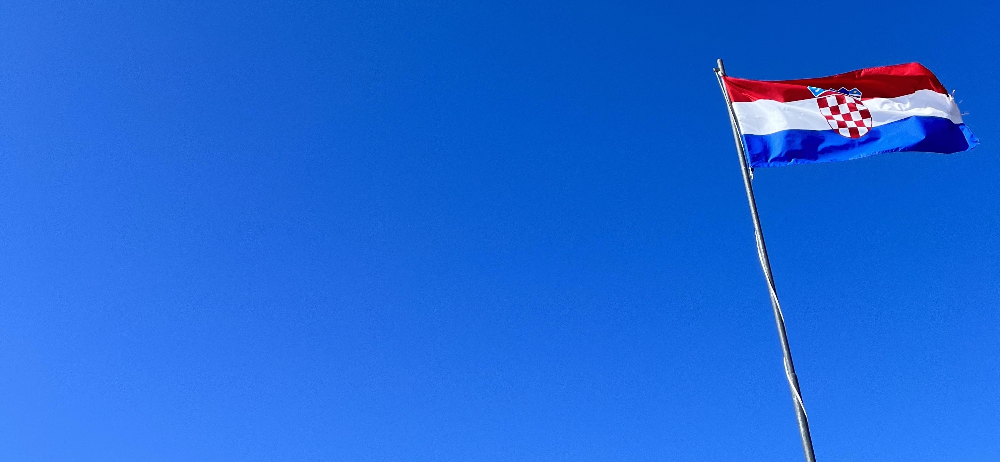
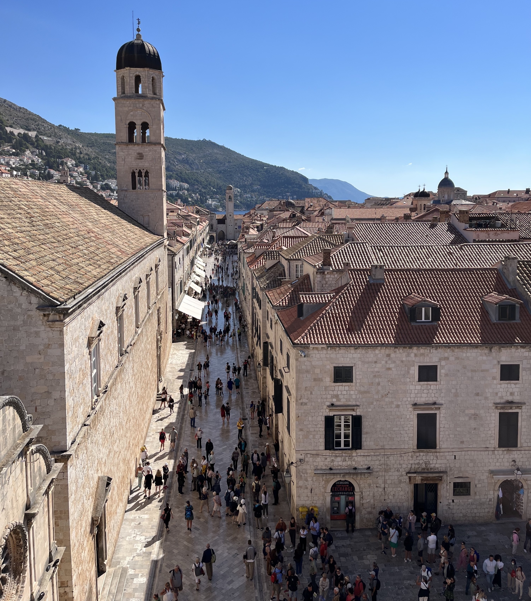
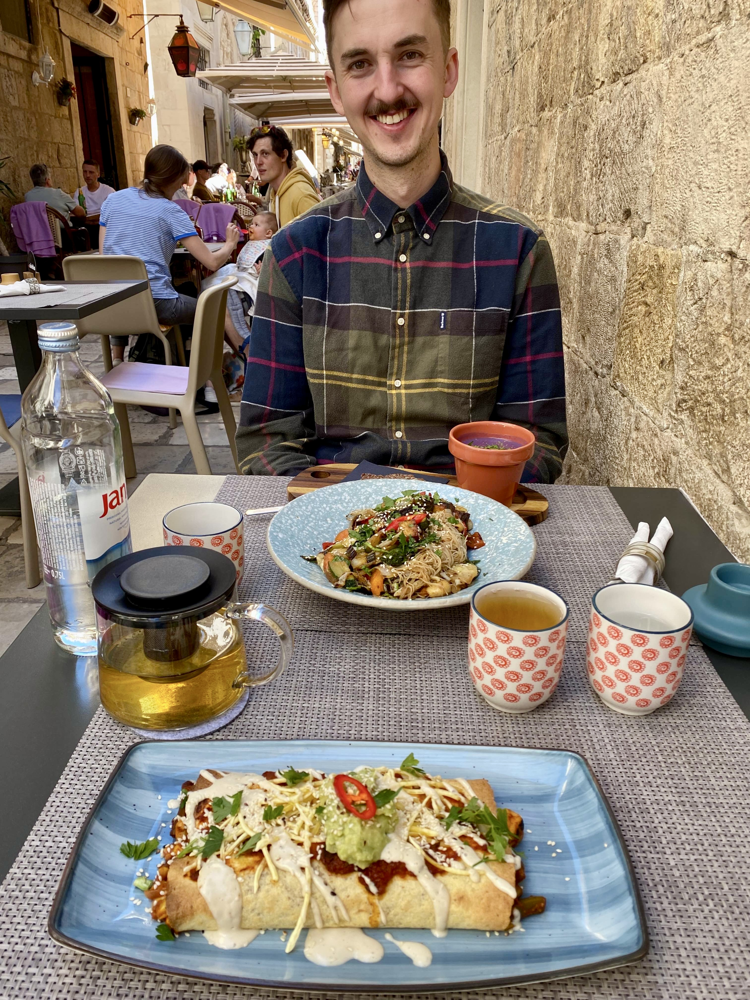
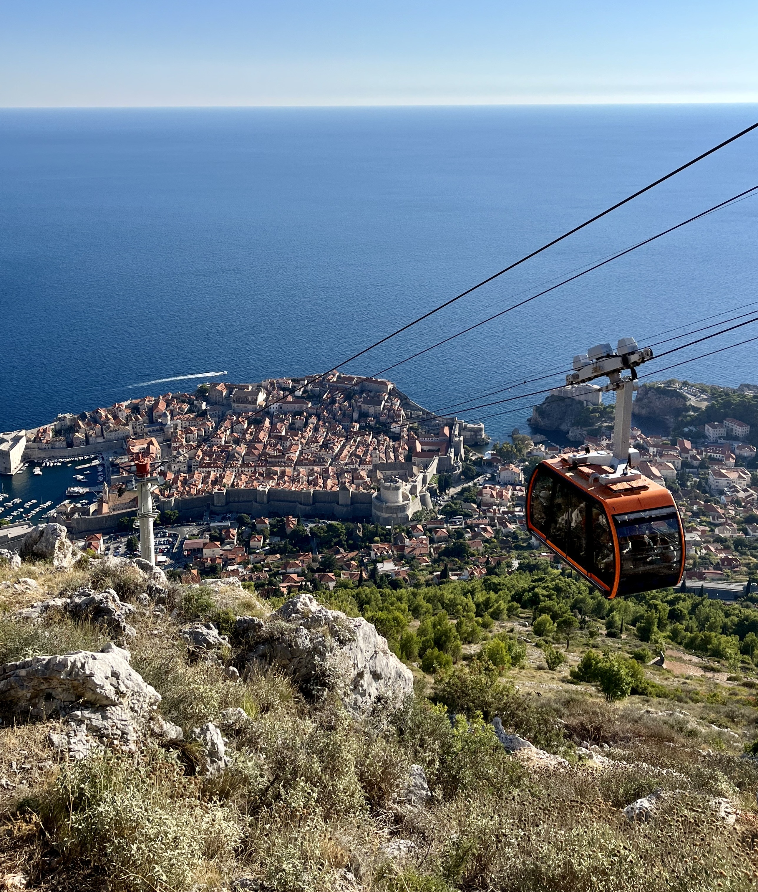
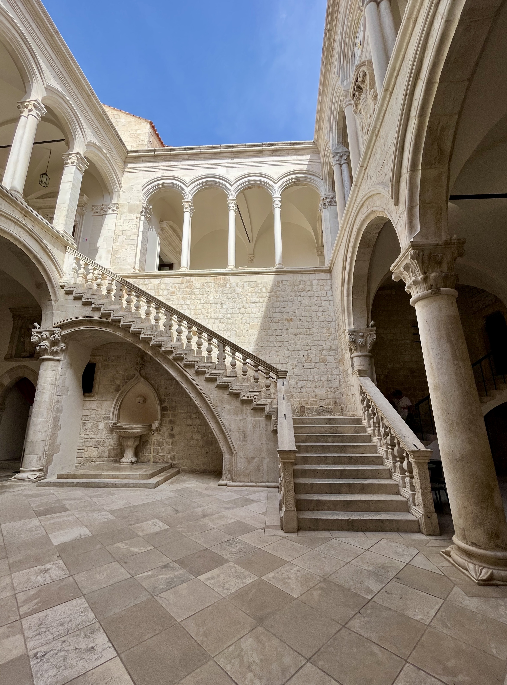
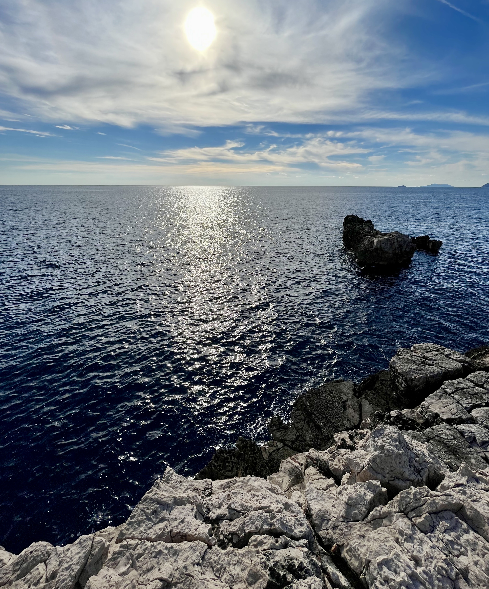

&nbsp;

Tento rok jsem absolvoval
[fotbalový víkend v Madridu](traveling_2022_Madrid.html),
[poznávací dovolenou ve Stockholmu](traveling_2022_Stockholm.html)
i [horské túry v Dolomitech](traveling_2022_Dolomites.html).
Když jsem se proto před začátkem léta zamýšlel, kam se vydat dál, uvědomil jsem
si, že jsme neměli naplánovanou žádnou cestu k moři - pokud tedy nepočítám
[zamrzlý Balt v březnu](traveling_2022_Stockholm.html).
Ač cesta k moři v našem podání znamená program ve stylu "celý den budeme
poznávat okolí a večer si půjdeme na půl hodiny zaplavat", nepřišlo mi to jako
špatný nápad. A tak jsem našel letenky do
[Dubrovníku](https://cs.wikipedia.org/wiki/Dubrovn%C3%ADk).

Byly to letenky za pár tisíc korun a na konec záři, kdy jsem
čekal že by ve městě mohla už doznívat hlavní turistická sezóna a zároveň by
nemuselo být takové horko. Nakonec se však ukázalo, že moje očekávání se od
reality trošku lišila. Pokud hlavní turistická sezóna doznívala, tak hodně
pomalu. A horko už sice nebylo, ale na druhou stranu teploty klesly ke 20 °C,
takže jsme si ani nebalili plavky a já byl v průběhu našeho pobytu rád za
flanelovou košili.

Přesto si ale myslím, že pobyt
v [Dubrovníku](https://cs.wikipedia.org/wiki/Dubrovn%C3%ADk) byl super!
Posuďte sami. :-)

&nbsp;

#### DEN 0

Ve čtvrtek ráno jsem se vzbudil, posnídal, sbalil si věci do batohu a
neplánovaně se vydal na menší nákup do dm drogerie. Klára si totiž vzpomněla, že
nám schází několik hygienických přípravků. Asi nemusím popisovat její výraz,
když jsem se vrátil domů a ona zjistila, že jsem na jeden ze dvou zapomněl. Na
mou obranu, těch věcí na zařízení bylo to ráno více a všechno jsem si prostě
nezapamatoval. Cestou z drogerie jsem jel ještě natankovat a také jsem se
malinko bál, abych v ranní špičce zaparkoval někde poblíž domu.

To se mi naštěstí podařilo, a tak jsme se kolem 10. hodiny naskládali do naší
kočky a vyrazili do [Vídně](https://cs.wikipedia.org/wiki/V%C3%ADde%C5%88).
Na letiště jsme dorazili kolem poledne, a protože nám cestou vyhládlo, hned po
bezpečnostní a pasové kontrole jsme zamířili do italského fast foodu
[Ciao a Tutti](https://www.viennaairport.com/hu/utas/uezletek__ttermek/detail_shops_und_restaurants?sug_id=1393953274301).
Já jsem si dal těstovinový salát s rajčatovou omáčkou,
mozzarellou a hráškem. Klára si objednala pizzu. Kdyby jídlo bylo teplé a nestálo
stejně jako menu s polévkou v [Red Piranha](https://redpiranha.cz/tydenni-menu/),
asi bych i přemýšlel nad tím, že bych se tam při další návštěvě vídeňského
letiště najedl znovu.

Po ne moc uspokojivém obědě následoval velice uspokojivý let
do [Dubrovníku](https://cs.wikipedia.org/wiki/Dubrovn%C3%ADk). Moc
často se mi to nestává, ale tentokrát se mi krátce po vzletu podařilo usnout a
probudil jsem se až ve chvíli, kdy stevard oznamoval, že se chystáme na přistání.
Protože to není z [Vídně](https://cs.wikipedia.org/wiki/V%C3%ADde%C5%88)
do [Dubrovníku](https://cs.wikipedia.org/wiki/Dubrovn%C3%ADk)
zase taková štreka, obě výše zmíněné události oddělovalo asi 30 minut.
I tak jsem byl ale rád, že jsem si mohl při cestě odpočinout.

Hned po příletu jsme si na přepážce koupili jízdenky na autobus do centra města.
Nikde jsme se potom nezdržovali a hned jsme šli obsadit dvě místa ve voze.
Později se to ukázalo jako hodně dobrý tah. Pro řidiče totiž kapacita autobusu
nebyla žádná míra, a tak nabíral turisty, dokud chodili. Nakonec se tedy
obsadila všechna sedadla i ulička po celé své délce. Cesta do centra města sice
trvala pouze 40 minut, i tak jsem byl ale rád, že nemusíme stát v uličce vedle
skupinky Asijatů, kteří si před nástupem raději fotili autobus ze všech stran,
než aby si šli sednout.

Autobus nám zastavil kousek od [Pločské brány](https://www.dubrovnik-travel.net/ploce-gate/),
jedné ze dvou hlavních bran do starého města. Po kamenné cestě jsme se dostali
za hradby a ocitli se v úplně jiném světě. Úzké uličky a béžové domečky s oranžovými
střechami naprosto vystihovaly moji představu
[města Královo přístaviště](https://gameofthrones.fandom.com/wiki/King%27s_Landing)
ze seriálu [Hra o trůny](https://www.csfd.cz/film/263138-hra-o-truny/prehled/).
Byla to paráda! V jedné z úzkých uliček jsme našli recepci našeho
[hotelu](https://www.booking.com/hotel/hr/apartment-coffeatus-a21.cs.html).
Tam jsme se seznámili s recepční Jasmínou, která nám vysvětlila, jak to
v [hotelu](https://www.booking.com/hotel/hr/apartment-coffeatus-a21.cs.html)
chodí. Narozdíl od jiných zařízení, na které jsme z cest zvyklí, mají recepci
na jednom místě, konkrétně v Široké ulici, pokoje se nachází ve vedlejší ulici
Za Rokom a, aby to nebylo tak snadné, na snídani se chodí do úplně jiného podniku
[Café Festival](https://www.cafefestival.com/) na hlavním ulici
[Stradun](https://en.wikipedia.org/wiki/Stradun_(street)).
Ač to může znít složitě, rychle jsme se zorientovali. Staré město je navíc
malinké, takže i kdyby se člověk chtěl dostat z jedné strany města na druhou,
cesta pěšky by netrvala ani 5 minut. Když si tedy uvědomím, že my v následujících
dnech chodili na snídani jen do vedlejší ulice, asi nám zabralo více času sejít
schody v budově než samotná cesta po městě.

Po check-inu na recepci nás Jasmína doprovodila do našeho apartmánu a následně
nám poskytla několik cenných rad k jeho užívání. Nejvíce se mi líbilo, když se
nás zeptala, zda umíme nastavit kotel. My na to, že ne. Jasmína potom ukázala
na malé tlačítko na zdi, které se nacházelo vedle vypínače na světlo a řekla:
"Dneska jsem kotel zapla. Tímto tlačítkem se kotel vypíná, takže na něj nesahejte
a všechno bude v pohodě." Kotel byl tedy nastaven. Uf. Tak to jsem si oddechl.
Po několika dalších podobně užitečných radách Jasmína odešla a nechala nás
vlastnímu osudu. My se vybalili a vyrazili na večeři.

Několik zdrojů chválilo
[restauraci Lady Pi Pi](https://www.tripadvisor.com/Restaurant_Review-g295371-d1797401-Reviews-Lady_Pi_Pi-Dubrovnik_Dubrovnik_Neretva_County_Dalmatia.html),
o kterou má být prý v [Dubrovníku](https://cs.wikipedia.org/wiki/Dubrovn%C3%ADk)
takový zájem, že se na stůl mnohdy stojí dlouhé fronty. Řekli jsme si, že podnik
vyzkoušíme, ale ve frontě stát nebudeme. Když jsme se vyškrábali na kopec, kde se
restaurace nacházela, nikdo před ní nestál. Počkali jsme tedy na číšníka a ten
nám nabídl na výběr ze dvou stolů. Říkal jsem si proto, že to asi zase taková
sláva nebude. Než jsme si ale stihli objednat pití, neuhodnete, co se před
restaurací začalo vytvářet... Frontička!

Já jsem si v této "supr čupr" restauraci objednal grilovanou rybu s fazolkami a
brambory. Klára si dala vegetariánský burger s grilovanou zeleninou a bramborovými
dukátky. Překvapením pro nás bylo, když donesli burger a na talíři nebyla žádná
houska. Jednalo se pouze o zeleninovou placku, takže Klára si moc nepochutnala.
Já na druhou stranu musím říct, že ryba byla vynikající. Že by ale naše zkušenost
odpovídala obrovským očekáváním, to se říct nedá. Restaurace je koncipována jako
podnik, kde se připravují pokrmy na grilu, typické pro chorvatskou kuchyni. Hosté
si mohou sednout pouze na venkovní zahrádku porostlou hustým břečťanem, takže,
když prší, je zavřeno. Tato skutečnost samozřejmě může navozovat jistý pocit
exkluzivity, pokud se člověk do podniku dostane. Navíc jedna část restaurace
nabízí opravdu pěkný výhled na město, takže chápu, že mnozí návštěvníci mohou
hodnotit kladně už jen to, že sedí. Opravdu si ale  nemyslím, že by se jednalo
o zase tak úžasný podnik, aby se vyplatilo čekat v dlouhé frontě na místo u stolu.

Posezení jsme zakončili oříškovým dortem, který vypadal tak dobře, že jej chtěl
ochutnat i pán ze skupiny čtyř amerických důchodců sedících u stolu vedle nás.
I když to bylo lákavé, my se nakonec nerozdělili. Místo toho jsme dojedli dort,
zaplatili a vyrazili na krátkou procházku po večerním
[Dubrovníku](https://cs.wikipedia.org/wiki/Dubrovn%C3%ADk). Na pokoj
jsme se dostali kolem 20. hodiny, umyli se a šli si po náročném dni brzo lehnout.

&nbsp;

#### DEN 1

Nevím, čím to bylo, ale první noc
v [Dubrovníku](https://cs.wikipedia.org/wiki/Dubrovn%C3%ADk) se mi spalo skvěle!
Vstával jsem tedy až v 8:30 a tím pádem jsem skoro zaspal domluvenou pracovní
akci, při které jsme měli s kolegou Niekem v plánu nasadit náš aplikační kód na produkční
prostředí. Ano, měl jsem sice dovolenou, ale tohle byla důležitá věc, která měla
být hotová v pondělí ráno. A protože jsem potřeboval Niekovu pomoc a Niek měl
v plánu v pondělí ráno letět za svojí rodinou
do [Holandska](https://cs.wikipedia.org/wiki/Holandsko), naplánovali jsme
nasazení na páteční ráno. Bohužel se věci nevyvíjeli podle mých představ. Po
chvíli jsem naznal, že pokud bych to chtěl udělat pořádně, strávím nad tím dalších
několik hodin, které jsem k dispozici neměl, a tak jsem po 15 minutách zaklapl
počítač a vydal se s Klárou na snídani do [Café Festival](https://www.cafefestival.com/).

Jen pro zajímavost uvedu, že v pondělí jsem začal nasazovat kód na naše produkční
prostředí v 8 hodin ráno. Skončil jsem ve 2 hodiny odpoledne.

V [Café Festival](https://www.cafefestival.com/) jsme si dali vaječnou omeletu
s pečivem. Naprosto upřímně, nebyla
to žádná sláva, ale něco teplého do žaludku přišlo vhod. Po snídani, to už mohlo
být kolem půl jedenácté, jsme se konečně pustili do prohlídky města. A pokud
v [Paříži](https://cs.wikipedia.org/wiki/Pa%C5%99%C3%AD%C5%BE) mají
[Eiffelovku](https://cs.wikipedia.org/wiki/Eiffelova_v%C4%9B%C5%BE),
v [Londýně](https://cs.wikipedia.org/wiki/Lond%C3%BDn)
[Big Ben](https://cs.wikipedia.org/wiki/Big_Ben) a
v [Římě](https://cs.wikipedia.org/wiki/%C5%98%C3%ADm)
[Koloseum](https://cs.wikipedia.org/wiki/Koloseum), tak
v [Dubrovníku](https://cs.wikipedia.org/wiki/Dubrovn%C3%ADk)
mají hradby, na kterých jsme začali. A osobně si myslím, že jako první
zastávka při prohlídce města posloužily hradby skvěle. Návštěvník totiž obejde
celé staré město, podívá se na všechny budovy z trošku jiné perspektivy a tak
nějak si udělá názor na to, kam by se potom ještě rád ve starém městě podíval.
Kromě toho procházka nabízí skvělé výhledy na moře, okolní útesy a hlavně na
přístav, který má člověk stojící na hradbách jako na dlani. Za mě se tedy
jednalo o jeden z highlightů hřeb naší dovolené.

&nbsp;

*Pohled z hradeb na [Stradun](https://en.wikipedia.org/wiki/Stradun_(street)),
hlavní ulici ve starém města. V popředí se nachází františkánský klášter, na
konci ulice stojí zvonice.*

&nbsp;

Druhým highlightem byla návštěva veganské
[restaurace Nishta](https://www.nishtarestaurant.com/). Osobně moc veganské
podniky v Česku nemusím. I když jim fandím, většinou mám s nimi špatnou zkušenost.
A problém je jednoduchý - jídlo mi prostě nechutná, a tak, pokud nechci jíst maso,
raději volím bezmasá jídla v klasických restauracích.
V [Dubrovníku](https://cs.wikipedia.org/wiki/Dubrovn%C3%ADk) jsem tedy před
návštěvou veganského podniku neměl moc velká očekávání. Místní kuchaři mě ale
překvapili. Já jsem vyzkoušel rýžové nudle se zeleninou a tofu. Klára si objednala
tortilly s tempehem a fazolemi na mexický způsob. Ochutnal jsem obě jídla a musím
říct, že každé z nich nabízelo obrovskou paletu chutí. Naše chuťové pohárky byly
v sedmém nebi, a tak se není čemu divit, že druhý den jsme chtěli jít do restaurace
na oběd znovu!

&nbsp;

*Hladový Jarda, který se chystá sníst zelnou polévku servírovanou v květináči.*

&nbsp;

Po obědě nás čekal druhý bod našeho programu,
[pevnost Lovrijenac](https://en.wikipedia.org/wiki/Lovrijenac). Jedná se o
pevnost položenou na skále ve výšce 37 metrů nad mořem. Místní jí často
přezdívají "Dubrovnický [Gibraltar](https://en.wikipedia.org/wiki/Gibraltar)" a
pro fanoušky [seriálu Hra o trůny](https://www.csfd.cz/film/263138-hra-o-truny/prehled/)
je zajímavá tím, že posloužila jako inspirace při vytváření modelu Rudé bašty. V reálu ale
pevnost ničím extra zajímavá není. Na hradbách pevnosti stojí pár historických
děl, na jedné věži visí chorvatská vlajka a to je, prosím pěkně, vše! Samozřejmě
je nutné dodat, že pevnost těží ze svého umístění naproti starého města. Z hradeb
je tedy možné udělat pěknou fotku [Dubrovníku](https://cs.wikipedia.org/wiki/Dubrovn%C3%ADk)
s okolním zálivem. Ale teď už je to opravdu vše.

Po návštěvě pevnosti jsme se vydali na kávu do dubrovnického coffee shopu numero uno, a sice
[kavárny Cogito](https://www.tripadvisor.com/Restaurant_Review-g295371-d12501076-Reviews-Cogito_Coffee-Dubrovnik_Dubrovnik_Neretva_County_Dalmatia.html),
která je zastrčená v podloubí kousek u přístavu. Nejsem žádný znalec kávy,
takže jen doplním, že mi místní filtr chutnal.

Náš odpolední program pokračoval krátkým výletem
na [horu Srd](https://en.wikipedia.org/wiki/Sr%C4%91). Na ni se lze
dostat lanovkou. Zpáteční jízdenku jsme pořídili za 200 kun, což podle mě není
žádná láce, ale na druhou stranu to stálo za to. I pětiletý klučina, který stál
v kabině lanovky celou cestu vedle nás, začal po příjezdu do cíle řvát na všechny
strany: "Tati, to byla super jízda! Tati, to bylo úžasný!" Maminka, která se celou
cestu dívala do země, jeho nadšení nesdílela. Mně se ale 10minutová vyhlídková
cesta líbila.

Na vrcholku hory si turisté mohou zakoupit adrenalinový zážitek v podobě projížďky
buginou, nebo svezení na zipline. Ti méně odvážní mohou využít nabídky pokrmů
v [restauraci Panorama](https://www.nautikarestaurants.com/panorama-restaurant-bar/).
My jsme nezvolili ani jedno. Místo toho jsme si prošli celý
areál a nějakou dobu se kochali nádherným výhledem na staré město i nedaleký ostrov
[Lokrum](https://cs.wikipedia.org/wiki/Lokrum).

&nbsp;

*Lanovka jedoucí na horu Srd.*

&nbsp;

Po návratu zpět do historického centra města jsme si zašli na večeři do
[trattorie Carmen](http://www.trattoria-carmen-dubrovnik.com/). Já jsem
si objednal pizzu Carmen, která obsahovala prosciutto, mozzarellu,
lanýže a rukolu. Klára zvolila domácí těstoviny s rajčatovou omáčkou a mozzarellu.
Bohužel tato volba se jí nejevila jako ta nejšťastnější, takže jsem si s ní, pro
klid v rodině, jídlo vyměnil. Mně to ale nevadilo, protože mi moc chutnalo
obojí - jak pizza, tak domácí těstoviny. Jako dezert jsem si dal vynikající panna
cottu s ovocem, která hezky doplnila už tak příjemnou návštěvu malého rodinného
podniku.

Po večeři už nás žádný program nečekal, takže jsme se ještě prošli po centru města
a poté se pomalu přesunuli na [hotel](https://www.booking.com/hotel/hr/apartment-coffeatus-a21.cs.html).

&nbsp;

#### DEN 2

Druhý den v [Dubrovníku](https://cs.wikipedia.org/wiki/Dubrovn%C3%ADk)
jsme zase nikam nespěchali. Vstali jsme kolem 8. hodiny,
zašli si na snídani a potom vyrazili na prohlídku nejvýznamnějších památek starého
města.

Viděli jsme:

- [Onofriovu fontánu](https://www.dubrovnik-travel.net/onofrios-fountain/),
- [františkánský klášter](https://en.wikipedia.org/wiki/Franciscan_friary,_Dubrovnik),
- [kostel sv. Blažeje](https://www.dubrovnik-travel.net/church-of-saint-blaise/),
- [zvonici](https://www.dubrovnik-travel.net/clock-tower/),
- [Rektorský palác](https://www.dubrovnik-travel.net/knezev-dvor-rectors-palace/),
- [katedrála Nanebevzetí Panny Marie](https://www.dubrovnik-travel.net/dubrovnik-cathedral/),
- [kostel sv. Ignáce](https://www.cestujlevne.com/pruvodce/chorvatsko/dubrovnik/kostel-sv-ignace).

U každé památky jsme si přečetli krátký popisek z našeho kapesního průvodce. Do
kostelů jsme se šli podívat a do rektorského paláce jsme si zaplatili vstup.

Jak už název napovídá,
[rektorský palác](https://www.dubrovnik-travel.net/knezev-dvor-rectors-palace/)
je budova, ve které žil rektor města. Dnes
slouží jako muzeum. Návštěvníci mohou v interiéru vidět obrazy chorvatských
umělců, sochy patrona [Dubrovníku](https://cs.wikipedia.org/wiki/Dubrovn%C3%ADk)
sv. Blažeje nebo historické spisy. Mně nejvíce
zaujalo nádvoří paláce, ve kterém se natáčela scéna
[seriálu Hra o trůny](https://www.csfd.cz/film/263138-hra-o-truny/prehled/), ve
které jde královna [Daenerys Targaryen](https://cs.wikipedia.org/wiki/Daenerys_Targaryen)
žádat Krále koření o to, aby jí půjčil lodě.

&nbsp;

*Nádvoří rektorského paláce.*

&nbsp;

Po prohlídce města jsme se vydali na oběd do naší oblíbené
[restaurace Nishta](https://www.nishtarestaurant.com/).
Bohužel jsme přišli v době, kdy v podniku neměli místo, a tak jsme museli jít
jinam. Nakonec jsme vybrali burgrárnu [Guloso](https://www.guloso.com.hr/),
kde se chlubili tím, že prodávají
nejlepší burgery v celém [Chorvatsku](https://cs.wikipedia.org/wiki/Chorvatsko).
Jejich recepty totiž vyhrály soutěž
Zagreb Hamburger festival 2021, a tak jsme si řekli, že podnik vyzkoušíme.
Seděli jsme venku na křivé dlažbě, padal jsem pořád dopředu a batoh jsem musel
mít na zádech, protože na barové stoličce si ho nebylo kam odložit. Pohodlí nic
moc. Když ale přinesli jídlo, to byl jiný příběh. Já jsem vyzkoušel vítěze výše
zmíněného festivalu. Jednalo se o hovězí burger v bramborové bulce se slaninou,
zelenou paprikou a mladým sýrem "škripavac", který se podával s hranolky a kečupem.
Toho sýra tam bylo opravdu poctivě, takže by se jídlo dalo přirovnat k takovému
cheeseburgeru na chorvatský způsob. A bylo to nebe v hubě!

Po vynikajícím obědě nás čekala návštěva druhého muzea. Jednalo se o
[War Photo Limited](https://www.warphotoltd.com/), muzeum válečných fotografií.
Muzeum bylo rozděleno na dvě patra. V tom prvním byla výstava fotografií z
[Libanonské občanské války](https://cs.wikipedia.org/wiki/Libanonsk%C3%A1_ob%C4%8Dansk%C3%A1_v%C3%A1lka),
která probíhala v letech 1975 až 1990 mezi křesťanskou a muslimskou částí obyvatel země.
Druhé patro muzea bylo věnované [válce v Jugoslávii](https://cs.wikipedia.org/wiki/V%C3%A1lka_v_Jugosl%C3%A1vii)
z konce minulého století, která vedla k rozpadu Jugoslávie. V této sekci se
nacházely i fotografie [Dubrovníku](https://cs.wikipedia.org/wiki/Dubrovn%C3%ADk).
Na nich bylo vidět, že město bylo v době konfliktu bombardováno a velká většina
historického centra byla poškozena. Po skončení války přijelo
do [Dubrovníku](https://cs.wikipedia.org/wiki/Dubrovn%C3%ADk) mnoho
dobrovolníků, kteří se zasloužili o rekonstrukci města a zachování jeho
historického rázu.

Po krátké zastávce na kávu jsme se vydali do přístavu. Tam jsme si koupili lístky
na loď a jeli se podívat na ostrov [Lokrum](https://cs.wikipedia.org/wiki/Lokrum). Ostrov se nachází necelý kilometr
jihovýchodně od [Dubrovníku](https://cs.wikipedia.org/wiki/Dubrovn%C3%ADk).
Po vylodění jsme se prošli po tamní přírodní
rezervaci, pokochali se výhledem na moře ze skalnatých útesů a prošli se po rajské
cestě až ke královské pevnosti, kde se nám naskytl nádherný pohled
na [Dubrovník](https://cs.wikipedia.org/wiki/Dubrovn%C3%ADk).

&nbsp;

*Výhled na moře ze skalnatých útesů na ostrově [Lokrum](https://cs.wikipedia.org/wiki/Lokrum).*

&nbsp;

Před šestou hodinou jsme se nalodili na spoj zpět na pevninu a zašli na večeři
do bosenské [restaurace Taj mahal](https://tajmahal-dubrovnik.com/).
Ano, bosenské restaurace. A ano, jmenuje se Taj mahal.
Protože se jednalo o náš poslední večer, rozhodli jsme se,
že se malinko rozšoupeneme. Já jsem si dal jehněčí vývar a telecí steak
s cibulovo-hořčičnou krustičkou, grilovanou zeleninou a bílým chlebem.
Klára si na předkrm objednala čerstvý smažený koblížek se sýrem a jako hlavní
chod si vybrala masové kuličky s mačkanými brambory. Podnik se mi opravdu líbil
a jídlo mi moc chutnalo, takže všem budoucím návštěvníkům
[Dubrovníku](https://cs.wikipedia.org/wiki/Dubrovn%C3%ADk) doporučuji!

Po jídle jsme se ještě prošli po městě a dali si zmrzlinu v
[Peppino's Gelato](https://peppinosgelato.com/), nejlepší
zmrzlinárně v [Dubrovníku](https://cs.wikipedia.org/wiki/Dubrovn%C3%ADk).
Já jsem zkusil příchuť tiramisu, Klára kinder maxi king.

Na pokoj jsme dorazili kolem 20. hodiny, umyli se a šli si lehnout, abychom
nabrali síly před cestou domů, která nás další den čekala.

&nbsp;

#### DEN 3

Poslední den v [Dubrovníku](https://cs.wikipedia.org/wiki/Dubrovn%C3%ADk)
jsme se vzbudili v 5 hodin, sbalili si věci a vyrazili
na cestu domů. Dost mě překvapilo, když se hned na poschodí pod námi otevřely
dveře a z nich na nás koukal mladý muž v trenkách. Očividně rozespalý se nás
silným britským přízvukem zeptal: "Are you off?" Já jsem trošku vyděšeně
odpověděl: "Yes," a hned jsem dodal: "why?" Celá situace se vysvětlila ve
chvíli, kdy odvětil: "You were extremely loud!" Poté zavřel dveře a mně bylo
trošku líto, že jsme vzbudili tohoto mladého Angličana, když jsme se ráno balili.

V pekárně mlinar, která má otevřeno non-stop, jsme si koupili snídani a
pokračovali jsme za hradby starého města k Pilské bráně, kde na nás už čekal náš
taxikář. Za necelou půlhodinu jsme dorazili s velkým časovým předstihem na
letiště. A protože tam nikdo nebyl, úplně v klidu jsme prošli bezpečnostní i
pasovou kontrolou, sedli jsme si do jedné z kaváren a snědli pečivo, které jsme
si koupili v centru.

Let proběhl naprosto v klidu. Ve [Vídni](https://cs.wikipedia.org/wiki/V%C3%ADde%C5%88)
jsme vyzvedli auto a kolem poledne jsme už byli doma.

&nbsp;

#### DOJMY Z DUBROVNÍKU

- Do [Dubrovníku](https://cs.wikipedia.org/wiki/Dubrovn%C3%ADk) jsem se hodně
těšil, ale na druhou stranu jsem čekal trošku větší
[Balkán](https://cs.wikipedia.org/wiki/Balk%C3%A1n). Byl jsem tedy
velice příjemně překvapený, když jsme dorazili do malebného
čistého městečka s pěknými silnicemi a dobrou infrastrukturou.
- Na každém kroku se nachází oficiální obchod s tématikou seriálu
[Hra o trůny](https://www.csfd.cz/film/263138-hra-o-truny/prehled/).
- Pekárna mlinar má otevřeno 24/7.
- Z jednoho konce starého města na druhý konec člověk dojde za 5 minut.
- V [Dubrovníku](https://cs.wikipedia.org/wiki/Dubrovn%C3%ADk) se mi opravdu moc
líbilo. Jeho návštěvu bych každému doporučil!

&nbsp;

#### FOTKY

Fotky z [Dubrovníku](https://cs.wikipedia.org/wiki/Dubrovn%C3%ADk)
najdete [zde](https://photos.app.goo.gl/XYkVTMt1PxawfiYd7).

---

[blog](../index.html)

- [seznam článků](content.html)
