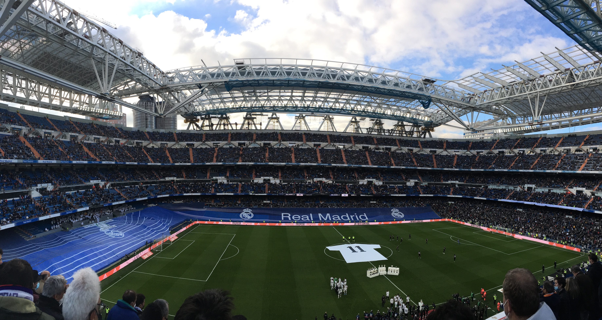

&nbsp;

Už delší dobu jsme se s Kubou bavili o tom, že bychom mohli po vzoru
[výletu do Barcelony](traveling_2019_Barcelona.html) zase sbalit naše příruční
zavazadla a vyrazit někam za sportem. Vysněné destinace byly
jasné - [Anglie](https://cs.wikipedia.org/wiki/Anglie) a
[Madrid](https://cs.wikipedia.org/wiki/Madrid).
Zároveň jsme se shodli na tom, že pokud už někam pojedeme, bylo by dobré zkusit
najít víkend, kdy se v dané lokalitě bude hrát více než jedno utkání. A protože
[COVIDová](https://cs.wikipedia.org/wiki/Covid-19) opatření byla touto dobou
v [Anglii](https://cs.wikipedia.org/wiki/Anglie) dost přísná, výběr se relativně
rychle omezil pouze na hlavní město
[Španělska](https://cs.wikipedia.org/wiki/%C5%A0pan%C4%9Blsko).

Oba jsme věděli o tom, že ideálním termínem pro náš trip bude třetí víkend v lednu.
V sobotu hraje [Atlético](https://cs.wikipedia.org/wiki/Atl%C3%A9tico_Madrid)
a v neděli zase [Real](https://cs.wikipedia.org/wiki/Real_Madrid).
Kde by mohl být problém? Pro mě osobně to byly finance. Kombinace Vánoc, nového
auta a jiných dovolených si vybrala svoji daň. A to nemluvím o
[dani z příjmu fyzických osob](https://cs.wikipedia.org/wiki/Da%C5%88_z_p%C5%99%C3%ADjm%C5%AF_fyzick%C3%BDch_osob),
která přijde na jaře. Mně osobně se tedy nechtělo takhle rychle zase utrácet
další peníze, a tak jsem tento výlet moc netlačil.

To se ale změnilo v pondělí. Když na mě vyskočila akční nabídka na letenky do
[Madridu](https://cs.wikipedia.org/wiki/Madrid), přišlo mi, že mi osud naznačuje,
že tahle příležitost se taky nemusí opakovat.
Vypadalo to, že všechno sedí. Proto jsem se docela rychle pro výlet nadchnul, zvedl
jsem telefon a zavolal Kubovi, zda do toho jdeme. Jinou odpověď než "ano" jsem
upřímně nečekal. Kuba je prostě klasický Yes man, který žádný výlet za kvalitním
fotbalem neodmítá. Dalším takovým Yes manem je Alberta. Naše parta byla tedy
kompletní a mohlo se vyrazit.

&nbsp;

#### DEN 0

Vlak do [Vídně](https://cs.wikipedia.org/wiki/V%C3%ADde%C5%88) nám odjížděl v 8:48,
sraz na nádraží jsme měli v 8:30.
Když jsem se tedy vzbudil v 6:30, pořád jsem si říkal, že mám hodně času. Jak
to tak ale většinou bývá, když má člověk hodně času, nakonec jsem vůbec nestíhal,
a tak jsem musel celou cestu z domu na šalinu běžet. Úplně propocený jsem dorazil
na nádraží, kde už mě čekal zbytek mojí crew. Možná jsem měl jazyk na vestě, ale
taky jsem se usmíval od ucha k uchu, protože jsem je rád viděl a upřímně jsem se
hrozně moc těšil na to, co nás čeká.

Náš spoj jel na čas. Když jsem ale přijeli na
[vídeňské nádraží](https://cs.wikipedia.org/wiki/Wien_Hauptbahnhof), zjistili jsme,
že navazující vlak na [letiště](https://cs.wikipedia.org/wiki/Leti%C5%A1t%C4%9B_V%C3%ADde%C5%88)
má zpoždění. A to se postupně navyšovalo. Řekli jsme
si, že počkáme 15 minut a pokud vlak nepřijede, pojedeme
[Uberem](https://cs.wikipedia.org/wiki/Uber). Ten nakonec nebyl
potřeba. Ale nebudu nikomu nic nalhávat, spoje jsme měli naplánované relativně
na těsno, takže zpoždění jednoho z nich nás trošku vyklepalo.

Na [letišti](https://cs.wikipedia.org/wiki/Leti%C5%A1t%C4%9B_V%C3%ADde%C5%88) jsme
prošli bezpečnostní kontrolou, dali si malou svačinku v podobě
bagety a nastoupili do letadla. Následoval 2,5 hodiny dlouhý let, který pro mě byl
neobvyklý hned z několika důvodů.

1. Asi 30 minut po vzletu do oblak nás zasáhly na můj vkus dost silné turbulence.
Netrvaly dlouho, ale s letadlem to házelo doprava, doleva, nahoru i dolů. Byly
to rozhodně ty nejsilnější turbulence, které jsem kdy zažil a na rovinu říkám, že
to nebylo nic příjemného.
2. Seděl jsem na místě u okýnka a dlouho chvíli jsem si krátil pozorování krajiny
pod námi. Asi 45 minut jsme přelétali nad [Alpami](https://cs.wikipedia.org/wiki/Alpy),
nad kterými se nevyskytovaly žádné mraky, takže viditelnost byla vynikající.
Jen jsem seděl a s otevřenými ústy obdivoval nádherné přírodní scenérie.
3. Po [Alpách](https://cs.wikipedia.org/wiki/Alpy) přišla
[Marseille](https://cs.wikipedia.org/wiki/Marseille). V průběhu letu
jsem nevěděl, o jaké velkoměsto se jedná, ale dost specifická střecha
[fotbalového stadionu](https://en.wikipedia.org/wiki/Stade_V%C3%A9lodrome) a
[členité pobřeží](https://www.google.com/maps/place/Marseille,+Francie/@43.2802598,5.2405647,11z/data=!3m1!4b1!4m5!3m4!1s0x12c9bf4344da5333:0x40819a5fd970220!8m2!3d43.296482!4d5.36978)
byly dobrými indiciemi při následném hledání názvu velkoměsta, nad kterým jsme přelétali.
4. Po přistání na [Barajas](https://cs.wikipedia.org/wiki/Leti%C5%A1t%C4%9B_Adolfa_Su%C3%A1reze)
jsme asi 15 minut jezdili po ranveji, než jsme našli
vhodné "parkovací místo" pro naše letadlo. V průběhu této doby si jedna naše
spolucestující sedící o pár řad přede mnou zapnula telefon a podle Kubových slov
zjistila, že někdo jí blízký leží v nemocnici. Následovalo naprosté nervové
zhroucení. Paní se hlasitě rozbrečela a začala na celé letadlo vykřikovat
"Porque? Porque?" Její partner vzal návod na postup v krizových situacích, který
našel v síťce sedadla před ním a začal ji ovívat a uklidňovat. Moc to ale nepomohlo.

Do [Madridu](https://cs.wikipedia.org/wiki/Madrid) jsme přiletěli kolem 16. hodiny
a upřímně mě překvapilo místní počasí.
Na obloze jsem sice nenašel jediný mráček, ale bylo relativně chladno. Když jsme
stáli na zastávce a čekali na letištní autobus, který nás měl zavést do centra,
dalo se to vydržet i v mikině. Ale situace se zhoršila v autobuse. Ne moc chytře
jsme si totiž sedli do jeho zadní části, kde byla otevřená okna, takže cestou to
tam sypalo jako blázen. Zatímco já jsem klepal kosu, ostatním Španělům to evidentně
vůbec nevadilo. A Kuba ani Bert neměli zájem situaci řešit. Cítil jsem, že pokud
něco neudělám, v tom autobuse zmrznu. Zajistil jsem proto okna na naší straně
vozu a následně jsem svojí lámanou španělštinou poprosil seňora sedícího naproti
přes uličku, aby udělal to stejné u sebe. A bylo teplo, nebo alespoň tepleji.

Po 30 minutách jsme vystoupili na
[Plaza de Cibeles](https://es.wikipedia.org/wiki/Plaza_de_Cibeles), vyfotili si
kašnu, kde fotbalisté [královského klubu](https://cs.wikipedia.org/wiki/Real_Madrid)
slaví každý titul se svými fanoušky a pěšky
pokračovali na [Puerta del Sol](https://cs.wikipedia.org/wiki/Puerta_del_Sol),
odkud už to bylo jen kousek do našeho
[hotelu](https://www.booking.com/hotel/es/hotelvictoria.cs.html).
Po vybalení věcí jsme se převlékli a vyrazili do víru velkoměsta. Protože jsme
už měli hlad, naší první zastávkou byl tapas bar
[El Matador](https://www.tripadvisor.com/Restaurant_Review-g187514-d990964-Reviews-Matador-Madrid.html).
Tam jsme si dali pivo a sdílený talíř plný tapas v podobě nakrájeným jamonů,
choriz a salchichonů. K uzeninám se podávala bagetka a tzv. pequitos, neboli
malé křupky z bílého těsta ve tvaru malých roztomilých rohlíčků.

Když jsme byli najezení, trošku jsme zrekognoskovali okolí našeho
[hotelu](https://www.booking.com/hotel/es/hotelvictoria.cs.html).
Prošli jsme se na [Puerta del Sol](https://cs.wikipedia.org/wiki/Puerta_del_Sol)
a [Plaza Mayor](https://cs.wikipedia.org/wiki/Plaza_Mayor). Protože už ale bylo relativně dost
hodin, nasedli jsme na metro a jeli na zastávku Las Rojas, odkud jsme pokračovali
pěšky na stadion [Atlética Madrid](https://cs.wikipedia.org/wiki/Atl%C3%A9tico_Madrid)
zvaný [Wanda Metropolitano](https://en.wikipedia.org/wiki/Metropolitano_Stadium). Cestou jsme se
zastavili u místního fotbalového hřiště "za barákem", kam si přišla zakopat skupina
přátel. Když to porovnám s našimi výkony na fotbálku, španělští borci byli úplně
jinde. A myslím, že vyšší úrovně dosahovalo i jejich hřiště. V porovnání s umělou trávou ve
[vyškovském parku](https://mapy.cz/zakladni?x=16.9930440&y=49.2827819&z=17&source=base&id=1921307)
se ta jejich zdála mnohem zelenější. Nevím, zda to tak
ale skutečně je, nebo si to jen namlouvám. Co ale vím naprosto jistě, je
skutečnost, že jim se za rohem nachází
[světový stadion](https://en.wikipedia.org/wiki/Metropolitano_Stadium), na kterém
se každou sezónu hraje
[Liga Mistrů](https://cs.wikipedia.org/wiki/Liga_mistr%C5%AF_UEFA) (v roce 2019 dokonce její
[finále](https://www.eurofotbal.cz/liga-mistru/2018-2019/reportaz/tottenham-hotspur-liverpool-fc-561847/)), zatímco
nám se za rohem nachází
[atletický ovál s pažitem](https://www.vyskov-mesto.cz/atleticky-a-fotbalovy-stadion/os-94795),
který nevyhovuje ani nárokům
[druhé nejvyšší fotbalové soutěže v Česku](https://www.fnliga.cz/), a tak
[náš klub](https://mfkvyskov.cz/) musí hrát
v [Drnovicích](https://cs.wikipedia.org/wiki/Sportovn%C3%AD_are%C3%A1l_Drnovice).

Na [stadionu](https://en.wikipedia.org/wiki/Metropolitano_Stadium) jsme navštívili
fan shop, kde jsme nic nevybrali, a koupili si druhou
večeři v podobě [tortilla de patatas](https://sk.wikipedia.org/wiki/Tortilla_de_patatas).
Na místa jsme dorazili s předstihem, takže
jsme byli svědkem představení
[sestav](https://www.livesport.cz/zapas/4rKp6Vfq/#prehled-zapasu/sestavy) a jmen
rozhodčích. Osobně mě dost mrzelo, že byl zraněný
[Antoine Griezmann](https://www.livesport.cz/hrac/griezmann-antoine/OxCa1jdT/), takže
jsme neviděli v akci největší současnou hvězdu klubu.
Nicméně i bez [francouzského špílmachra](https://www.livesport.cz/hrac/griezmann-antoine/OxCa1jdT/)
byla sestava domácích plná velkých jmen. Mohli jsme tak vidět třeba kapitána
[Kokeho](https://www.livesport.cz/hrac/koke/v9hLv1xJ/), vycházející hvězdu portugalské reprezentace
[Joao Felixe](https://www.livesport.cz/hrac/joao-felix/KI3YXMhi/), kontroverzního
[Luise Suareze](https://www.livesport.cz/hrac/suarez-luis/dUShzrBp/), brankářskou stálici
domácích v podobě [Jana Oblaka](https://www.livesport.cz/hrac/oblak-jan/SYy8ZHN9/), nebo
hvězdu zápasu [Yannicka Carrasca](https://www.livesport.cz/hrac/carrasco-yannick/lzccuuAC/).

Na [Wandu Metropolitano](https://en.wikipedia.org/wiki/Metropolitano_Stadium) přijela
v rámci 21. kola [španělské ligy](https://www.laliga.com/en-GB)
[Valencia](https://cs.wikipedia.org/wiki/Valencia_CF), kterou před zápasem dělily
v tabulce pouze čtyři body od
[domácího mužstva](https://cs.wikipedia.org/wiki/Atl%C3%A9tico_Madrid). S klukama jsme
proto očekávali vyrovnané utkání. I podle bookmakerů bylo ale favorizováno
[Atlético](https://cs.wikipedia.org/wiki/Atl%C3%A9tico_Madrid). Nicméně první
poločas ani jedné z předpovědí moc nenahrával. Domácí se nedostávali do šancí
a hosté je naopak proměňovali. Do šaten se tedy šlo za stavu 0:2.

Po přestávce ale přišly velké změny. Trenér
[Diego Simeone](https://cs.wikipedia.org/wiki/Diego_Simeone) stáhl
[Joao Felixe](https://www.livesport.cz/hrac/joao-felix/KI3YXMhi/), kterého
jsme do té doby hodnotili jako jednoho z nejlepších hráčů v dresu červenobílých, a
nahradil ho [Matheusem Cunhou](https://www.livesport.cz/hrac/cunha-matheus/bq5QzRdb/),
hráčem, o kterém jsem do té doby neslyšel. Právě
[brazilský rodák](https://www.livesport.cz/hrac/cunha-matheus/bq5QzRdb/) se ale
po rohovém kopu dostal k propadlému míči a v 64. minutě vstřelil kontaktní gól.

Následně začala [Valencia](https://cs.wikipedia.org/wiki/Valencia_CF)
hodně kouskovat hru a zdržovat, což se nelíbilo domácím fanouškům. Pokaždé,
když někdo z hostujícího týmu zůstal po souboji ležet na zemi,
slyšel jsem kolem sebe slova jako cabrón, nebo puta. Prostě nic pěkného.
Temperamentní Španělé mě ale bavili a zároveň vytvářeli skvělou atmosféru pro
sledování fotbalu. Nicméně ani povzbuzování místních příznivců nepomohlo hráčům
[Atlética](https://cs.wikipedia.org/wiki/Atl%C3%A9tico_Madrid) vstřelit
v 90 minutách další gól zaručující alespoň bod. Na druhou stranu
všichni na [stadionu](https://en.wikipedia.org/wiki/Metropolitano_Stadium)
doufali, že se to domácím hráčům podaří v prodloužení, které
bylo naplánováno na 7 minut. Krátce po jeho začátku neudržel
[brankář Valencie](https://www.livesport.cz/hrac/domenech-jaume/KbobTIgr/) střelu
z kraje pokutového území a
[Angel Correa](https://www.livesport.cz/hrac/correa-angel/McWkid34/)
neměl těžkou  práci při vstřelení branky.
Stav byl 2:2, celá [Wanda](https://en.wikipedia.org/wiki/Metropolitano_Stadium)
skákala a jásala. Starší muž sedící vedle mě začal
ukazovat prostředníček k
[brankáři hostí](https://www.livesport.cz/hrac/domenech-jaume/KbobTIgr/), který
zdržoval asi nejvíce a svoje gestikulace doprovázel několika peprnými výrazy.
Bylo to šílené, ale zápas nekončil.
Domácí chtěli víc a nakonec i víc dostali. V samém závěru utkání dostal na hranici
šestnáctky přihrávku střelec prvního gólu
[Cunha](https://www.livesport.cz/hrac/cunha-matheus/bq5QzRdb/). Místo střely zvolil přízemní
ostrý centr na zadní tyč, kam si naběhl krajní obránce
[Mario Hermoso](https://www.livesport.cz/hrac/hermoso-mario/OUjnz4Ab/).
A odkrytou bránu neminul. Obrat byl dokonán a mně se tak splnil sen zažít takto dramatický obrat
utkání přímo na stadionu s fanoušky vítězného tymu. Bylo to neskutečné.

Po zápase, na jehož sestřih je možné se podívat
[zde](https://www.youtube.com/watch?v=dsfkqbRjX5k), jsme se přesunuli na
[hotel](https://www.booking.com/hotel/es/hotelvictoria.cs.html), umyli se a šli spat.

&nbsp;

#### DEN 1

Protože jsme se předchozí den dostali do postele hodně pozdě, ráno jsme z ní moc
nespěchali. Leželi jsme asi do devíti hodin. Po trošku neobvyklé hotelové
snídani, kde jedinou zeleninovou položku tvořilo rozmixované rajčatové pyré, jsme
vyrazili na prohlídku města.

Společně jsme naplánovali krátký okruh v okolí
[hotelu](https://www.booking.com/hotel/es/hotelvictoria.cs.html), který ale zahrnoval to nej
z [Madridu](https://cs.wikipedia.org/wiki/Madrid). Prohlídku jsme začali na
[Puerta del Sol](https://cs.wikipedia.org/wiki/Puerta_del_Sol), které se nacházelo asi 50 metrů
od našeho [ubytování](https://www.booking.com/hotel/es/hotelvictoria.cs.html).
A to jsem té vzdálenosti možná ještě přidal. Poté jsme si
prošli [Mercado de San Miguel](https://es.wikipedia.org/wiki/Mercado_de_San_Miguel),
které jsem překřtil na "ráj tapas". Jedná se o malou
tržnici plnou malých obchůdků s tapas. Kdybychom neměli právě po snídani, určitě
bychom některá ochutnali. Výborně totiž vypadala všechna! Po krátké zastávce
v [hlavní madridské katedrále](https://cs.wikipedia.org/wiki/Katedr%C3%A1la_Panny_Marie_Almudensk%C3%A9)
jsme si udělali pár fotek
u [královského paláce](https://cs.wikipedia.org/wiki/Kr%C3%A1lovsk%C3%BD_pal%C3%A1c_v_Madridu).
Já jsem trošku na hulváta vylezl na malou zídku, ze které jsem
chtěl pořídit vysněný snímek. Když mě ale uviděl místní
[carabinieri](https://cs.wikipedia.org/wiki/Karabini%C3%A9%C5%99i), musel jsem
dolů. Naštěstí mě to nic nestálo. Naše tour pokračovala na nově zrekonstruované
[Plaza de Espaňa](https://cs.wikipedia.org/wiki/Plaza_de_Espa%C3%B1a_(Madrid))
plného zeleně, moderních laviček, dovádějících dětí a pejskařů. Ač se na
náměstí vyskytovaly nové zelené plochy a chodníčky, pana
[Cervantese](https://cs.wikipedia.org/wiki/Miguel_de_Cervantes_y_Saavedra)
společně s jeho hrdiny v podobě
[Dona Quijota a Sancha Panzy](https://cs.wikipedia.org/wiki/D%C5%AFmysln%C3%BD_ryt%C3%AD%C5%99_Don_Quijote_de_la_Mancha)
jsme našli na stejném místě jako při mojí poslední návštěvě
[Madridu](https://cs.wikipedia.org/wiki/Madrid) v roce 2016.

Z [Plaza de Espaňa](https://cs.wikipedia.org/wiki/Plaza_de_Espa%C3%B1a_(Madrid))
jsme se vydali na rušnou [Gran Via](https://cs.wikipedia.org/wiki/Gran_V%C3%ADa).
Po ní jsme došli až na [Plaza de Cibeles](https://es.wikipedia.org/wiki/Plaza_de_Cibeles),
kde jsme obdivovali budovu bývalé pošty a ikonickou kašnu. Odtud jsme se
vydali na jih po širokém bulváru [Paseo del Prado](https://cs.wikipedia.org/wiki/Paseo_del_Prado).
Na něm se nachází např.
[Museo del Prado](https://cs.wikipedia.org/wiki/Museo_del_Prado), nebo
[CaixaForum](https://en.wikipedia.org/wiki/CaixaForum_Madrid), stará elektrárna, která
nyní slouží jako muzeum. Výjimečná je ale hlavně svojí živou fasádou plnou zelených
rostlin. Na bulváru [Paseo del Prado](https://cs.wikipedia.org/wiki/Paseo_del_Prado),
po kterém jsme se vraceli zpět k parku
[Buen Retiro](https://en.wikipedia.org/wiki/Parque_del_Buen_Retiro,_Madrid),
nebyla k obdivu pouze hromada historických budov, nebo platanová alej.
V době naší nástěvy se do [Madridu](https://cs.wikipedia.org/wiki/Madrid)
sjeli zemědělci z celého [Španělska](https://cs.wikipedia.org/wiki/%C5%A0pan%C4%9Blsko)
a společně protestovali proti vládním nařízením. Po širokém bulváru proto projížděly
obrovské zemědělské stroje, které v jednom kuse troubily a vytvářely tak
hrozný kravál. A kdyby toho bylo pro někoho mála, v průvodu kolem nich procházeli
další protestující, kteří čas od času zapálili nějakou tu petardu. Při každé
detonaci jsem se nehorázně lekl, takže jsem byl rád, když jsme se od
demonstrantů vzdálili a zašli na jídlo v jedné z vedlejších uliček.

Na oběd se podávalo "menu del día", tříchodové denní menu v podobě špenátového
šátečku se sýrem, smažených kuřecích řízečků s hranolky a rýžového pudinku.
[Restaurace](https://rtorrenostra.blogspot.com/) ani jídlo nevypadaly úplně
fancy, ale mně moc chutnalo. Po hodinovém obědě jsme se dostali do menšího
časového pressu, protože do začátku našeho dalšího
programu, tedy [fotbalového zápasu](https://www.livesport.cz/zapas/h40uSCH2/#prehled-zapasu/prehled-zapasu)
[královského klubu](https://en.wikipedia.org/wiki/Real_Madrid_CF), zbývala asi
hodina a my se museli přesunout z centra ke stadionu
[Santiago Bernabéu](https://cs.wikipedia.org/wiki/Estadio_Santiago_Bernab%C3%A9u).
Při cestě (pro mě velice nepřehledně značeným) metrem jsem malinko přestával
věřit, že [utkání](https://www.livesport.cz/zapas/h40uSCH2/#prehled-zapasu/prehled-zapasu)
stihneme. Kuba s Bertem ale zachovali klid a zorientovali se mnohem lépe než
já, takže jsme díky nim všechno stihli. A vyšlo to hezky. Po příchodu na
[stadion](https://cs.wikipedia.org/wiki/Estadio_Santiago_Bernab%C3%A9u) jsem si zašel
na záchod, sedl na místo a šlo se na věc.

Tedy ne úplně, protože před zápasem proběhl ještě vzpomínkový akt věnovaný
[Franciscu Gentovi](https://cs.wikipedia.org/wiki/Francisco_Gento), legendě
klubu, která před několika dny odešla na věčnost. A bylo vidět, že si
jej v [Madridu](https://cs.wikipedia.org/wiki/Madrid) skutečně váží. Fanoušci
připravili dvě obrovská chorea. To větší s podobiznou
[hráče](https://cs.wikipedia.org/wiki/Francisco_Gento) roztáhli na hlavní
tribuně, druhé s nápisem "Gracias Gento" za brankou. Ve středovém kruhu ležel
obrovský bílý dres s číslem 11 a zároveň i všichni hráči
[Bílého baletu](https://cs.wikipedia.org/wiki/Real_Madrid) měli trikot s tímto
číslem na zádech. Následovalo vystoupení smyčcového kvartetu. Myslel jsem si, že
toto bude konec pietní akce, ale fanoušci vzdali hold zesnulému oblíbenci
ještě v průběhu zápasu. Když skončila symbolická 11. minuta, celý stadion
začal aplaudovat. Potlesk utichl po 60 vteřinách.

Co se týče fotbalu, měl jsem radost, že trenér
[Carlo Ancelotti](https://cs.wikipedia.org/wiki/Carlo_Ancelotti) k
[zápasu](https://www.livesport.cz/zapas/h40uSCH2/#prehled-zapasu/prehled-zapasu)
[nominoval](https://www.livesport.cz/zapas/h40uSCH2/#prehled-zapasu/sestavy)
prakticky to nejlepší, co mohl. Měli jsme tak možnost vidět několikanásobné vítěze
[Ligy Mistrů](https://cs.wikipedia.org/wiki/Liga_mistr%C5%AF_UEFA), mistra světa
z roku 2014, nebo mladé vycházející hvězdy.
Z týmu [Elche](https://cs.wikipedia.org/wiki/Elche_CF) jsem naopak neznal vůbec
nikoho. To ale nic neznamenalo. Hosté totiž nehráli vůbec špatně a když navíc
[Karim Benzema](https://www.livesport.cz/hrac/benzema-karim/tpV0VX0S/), současný
nejlepší střelec [Realu Madrid](https://cs.wikipedia.org/wiki/Real_Madrid), nedal
penaltu, střelecké konto otevřeli hráči v černých dresech. Ve 42. minutě totiž
přišel break a centr do pokutového území proměnil
[Lucas Boye](https://www.livesport.cz/hrac/boye-lucas/YiAqdTFb/). Do šaten se tak
šlo za nepříznivého stavu pro domácí.

Po půlce přišlo několik střídání a [Real](https://cs.wikipedia.org/wiki/Real_Madrid)
se začal více tlačit do brány. Naopak [Elche](https://cs.wikipedia.org/wiki/Elche_CF)
se snažilo zdržovat hru a urputně se bránilo. Nicméně po jedné ztrátě míče
[Realu Madrid](https://cs.wikipedia.org/wiki/Real_Madrid) se hráči hosté
pustili do kombinace, která skončila dalším gólem.
V 76. minutě se proto stav utkání změnil na 0:2 pro domácí a tlak
[Realu](https://cs.wikipedia.org/wiki/Real_Madrid) se začal stupňovat.
O šest minut později se fanoušci na
[Santiago Bernabéu](https://cs.wikipedia.org/wiki/Estadio_Santiago_Bernab%C3%A9u) dočkali.
[Real](https://cs.wikipedia.org/wiki/Real_Madrid) zahrál roh, při kterém se
jeden z hráčů [Elche](https://cs.wikipedia.org/wiki/Elche_CF) dotkl míče rukou
a chorvatský záložník [Luka Modrič](https://www.livesport.cz/hrac/modric-luka/bZWyoJnA/)
se při druhé nařízené penaltě nemýlil. Kontaktní branka nebyla špatná, ale
[Real](https://cs.wikipedia.org/wiki/Real_Madrid) potřeboval minimálně ještě jeden
gól. V nastavení už byli na útočné půlce skoro všichni hráči
[Bílého baletu](https://cs.wikipedia.org/wiki/Real_Madrid). A když přiletěl do
pokutového území centr z kopačky
[Viniciuse Juniora](https://www.livesport.cz/hrac/vinicius-junior/CbwQ4Mws/), nejvýše
si na něj vyskočil obránce [Eder Militao](https://www.livesport.cz/hrac/militao-eder/zX2Rm9YG/)
a uzavřel skóre utkání na konečných 2:2. Hlasitý starší pán sedící vedle Kuby
se začal objímat se všemi kolem sebe a byl šťastný za bod proti týmu, který se
po utkání nacházel na 15. místě tabulky.

Po skončení utkání, jehož sestřih je k dispozici [zde](https://www.youtube.com/watch?v=JhvnNhWOIcI), jsem
se rozloučil se svým sousedem. Ten mi v průběhu utkání říkal, že fanoušci
[Realu](https://cs.wikipedia.org/wiki/Real_Madrid) nemají rádi střídajícího útočníka
[Luku Joviče](https://www.livesport.cz/hrac/jovic-luka/viIS0FT7/), protože dostal v
bílém drese spoustu šancí, ale nedokázal je využít. Také zmínil, že na
[stadionu](https://cs.wikipedia.org/wiki/Estadio_Santiago_Bernab%C3%A9u) nebyli
žádní fanoušci [Elche](https://cs.wikipedia.org/wiki/Elche_CF). Ukazoval při tom
na prázdný sektor hostujícího týmu nacházející se pod nedokončenou střechou
[stadionu](https://cs.wikipedia.org/wiki/Estadio_Santiago_Bernab%C3%A9u).
S klukama jsme si potom udělali ještě několik fotek, pokochali se nádherným
fotbalovým stánkem a jako jedni z posledních opustili
[stadion](https://cs.wikipedia.org/wiki/Estadio_Santiago_Bernab%C3%A9u).
Když jsme vyšli ven, chtěli jsme si stavbu ještě dokola obejít. Hned za
prvním rohem jsme ale přišli k zatarasené cestě, kde stálo několik policejních
aut a skupina fanoušků. Po nějaké chvíli jsme zjistili, že čekají
u příjezdové cesty ke [stadionu](https://cs.wikipedia.org/wiki/Estadio_Santiago_Bernab%C3%A9u),
aby mohli spatřit své oblíbence, kteří budou
za chvíli odjíždět. U cesty jsme nečekali ani pět minut a hned jsme
měli štěstí. Ve velkém SUV nás minul levý obránce a kapitán v jedné
osobě, [Marcelo](https://www.livesport.cz/hrac/marcelo/zmAm2AEH/).
Následně se nám už ale moc nedařilo. Na další "úlovek" jsme čekali dalších 30 minut.
Osobně mi už začínala být zima a ani mě to moc nebavilo. Kdo se ale ve své nové roli
paparazziho našel, byl Kuba. S Bertem jsme se ho snažili přemluvit, abychom už šli.
On ale neústupně trval na svém, že ještě chvíli počkáme. Bál se hlavně toho, že
když vyjdeme, potom jako na potvoru bude vyjíždět autobus se všemi fotbalisty
a my tak přijdeme o všechno. Po nějaké době se nám podařilo Kubu zlomit. Vyrazili
jsme na cestu. Když jsme se ale po chvilce ohlédli, skutečně jsme spatřili
vyjíždějící autobus s hráči domácích. Kubova noční můra se naplnila a my jsme
tento přešlap měli na talíři až do konce našeho tripu. Myslím, že pokud bychom
ale Kubu nepřemluvili, stojí tam dodnes a čeká ještě na odjezd hráčů
[Elche](https://cs.wikipedia.org/wiki/Elche_CF).

Ze [stadionu](https://cs.wikipedia.org/wiki/Estadio_Santiago_Bernab%C3%A9u) jsme
se vydali na 5 km dlouhou procházku do centra. Ač se mi nejdřív
vůbec nechtělo, měl jsem nakonec obrovskou radost, že jsme šli. Nejdříve jsme
šli kolem rušné čtyřproudé cesty. Potom se zástavba změnila a my míjeli
[budovy ministerstev](https://en.wikipedia.org/wiki/Nuevos_Ministerios) a
soudu, až jsme se dostali do velice hezké a klidné rezidenční
části města. Na konci naší večerní výpravy jsme našli pěknou
[restauraci](https://www.srasmithrestaurante.com/), kam jsme
zašli na jídlo. Jako předkrm jsme si na Kubovo doporučení dali
[patatas bravas](https://fresh.iprima.cz/recepty/patatas-bravas), pečené
brambory s párečky a chilli omáčkou. Jako hlavní chod jsem měl dušené hovězí
maso s vařenými bramborami a na dezert jsem si objednal čokoládovou buchtu. Jídlo
bylo vynikající a my byli dobře najezení. Jedna věc tomu ale ještě chyběla.
Od samého začátku pobytu v [Madridu](https://cs.wikipedia.org/wiki/Madrid) jsme
si totiž říkali, že musíme zajít ještě do některé ze známých
chocolaterií, kde podávají [churros](https://cs.wikipedia.org/wiki/Churro) s horkou
čokoládou. A protože jsme druhý den ráno letěli domů, poslední možností bylo
jít hned. Jako náš další cíl jsme proto vybrali tu nejstarší ve městě, tedy
[Chocolateria San Gines](https://chocolateriasangines.com/) kousek od
[Puerta del Sol](https://cs.wikipedia.org/wiki/Puerta_del_Sol).
[Churros](https://cs.wikipedia.org/wiki/Churro) s čokoládou jsem ochutnal.
Dalo se to sníst, ale upřímně se o žádnou hitparádu nejednalo, a to zvlášť kvůli
tomu, že pečivo bylo na můj vkus hodně mastné.

Po [churros](https://cs.wikipedia.org/wiki/Churro) jsme se přesunuli
na [hotel](https://www.booking.com/hotel/es/hotelvictoria.cs.html) a šli spát.

&nbsp;

#### DEN 2

Závěrečný den naší výpravy byl dedikovaný cestě domů.

Vstali jsme v 7 hodin, sbalili si věci a při check outu si vyzvedli balíček se
snídaní, který obsahoval dva plátky toustového chleba se šunkou a sýrem, pomeranč
a hroznový džus ve skle.

Pro cestu na [letiště](https://cs.wikipedia.org/wiki/Leti%C5%A1t%C4%9B_Adolfa_Su%C3%A1reze)
jsme zvolili [Uber](https://cs.wikipedia.org/wiki/Uber).
Kousek od [hotelu](https://www.booking.com/hotel/es/hotelvictoria.cs.html) nás měl
vyzvednout Pedro Emanuel v
[Toyotě Corolla](https://en.wikipedia.org/wiki/Toyota_Corolla). Když k nám přijela
černá [Toyota Corolla](https://en.wikipedia.org/wiki/Toyota_Corolla), já otevřel dveře
a řidič mi položil stručnou otázku: "Jorge?" V tu chvíli jsem pochopil, že se
snažíme dostat do špatného vozu. Na malém náměstíčku jsem proto začal hledat
další vůz stejné značky. Asi 10 metrů od nás stálo auto se správnou SPZkou a v něm
na nás čekal malý, slušně oblečený řidič, který nemluvil anglicky. Docela rychle
jsme se ale pochopili, když se ptal, s jakou leteckou společností letíme, aby
věděl, na který terminál budeme chtít zavézt. Pedro Emanuel řídil
nad moje limity tolerance. Často jel rychle, v některých zatáčkách se až moc tlačil
na nákladní auto jedoucí ve vedlejším pruhu a občas se nechával rozptylovat
dvěma telefony, které měl připevněné na palubní desce. Na
[letiště](https://cs.wikipedia.org/wiki/Leti%C5%A1t%C4%9B_Adolfa_Su%C3%A1reze) jsme
ale dorazili celí, takže jsme se s Pedrem rozloučili a přesunuli se k bezpečnostní
kontrole. Ta proběhla bez větších problémů.

Do odletu našeho letadla zbývalo asi 90 minut. Čas jsme si zkrátili v duty free
shopu. Já jsem nakoupil několik pamlsků domů, to stejné udělal Kuba. Bert se ale
zasekl hned u prvního regálu s víny, kde pomocí aplikace
[Vivino](https://www.vivino.com/app) vyhledával tu
nejlepší možnou láhev, za kterou by utratil svoje peníze. Po nákupu jsme si sedli
a vyprázdnili snídaňové balíčky. Pak už následoval pouze tříhodinový let, při
kterém jsem se věňoval tomuto blogu.

Ve [Vídni](https://cs.wikipedia.org/wiki/V%C3%ADde%C5%88) jsme ani nemuseli moc
dlouho čekat na vlak, protože nám spoje hezky navazovali na sebe. Na
[hlavním nádraží](https://cs.wikipedia.org/wiki/Wien_Hauptbahnhof) jsem si dal
s Bertem oběd. Ve fast foodové restauraci s příhodným názvem
[Wienerwald](https://en.wikipedia.org/wiki/Wienerwald_(restaurant)) jsme
si koupili smažený kuřecí řízek s hranolky a bramborovým salátem. Kuba neměl
hlad, takže si šel mezitím nakuupit do [Intersparu](https://cs.wikipedia.org/wiki/SPAR).

Do [Brna](https://cs.wikipedia.org/wiki/Brno) jsme dorazili kolem 16. hodiny, se
skvělými zážitky a hlavami plnými plánů na další výlet za sportem. Já osobně
musím uznat, že i když byl tento trip plánovaný na poslední chvíli, všechno
klaplo na jedničku a já mám moc velkou radost, že jsme jeli. Už teď se moc
těším na další, chlapci! <3

&nbsp;

#### FOTKY

Fotky z [Madridu](https://cs.wikipedia.org/wiki/Madrid) najdete
[zde](https://photos.app.goo.gl/yPi1RwTJHDgU9MXC6).

---

[blog](../index.html)

- [seznam článků](content.html)
