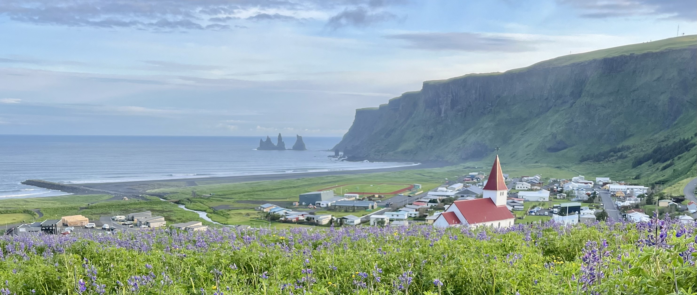
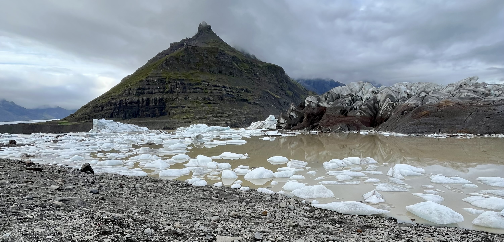
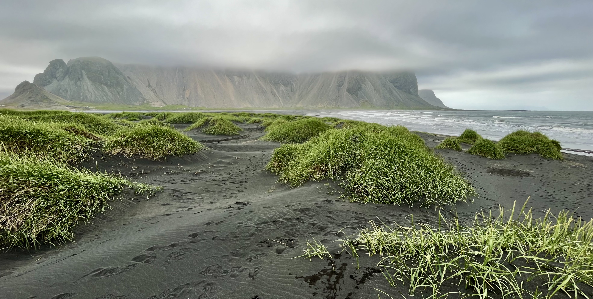
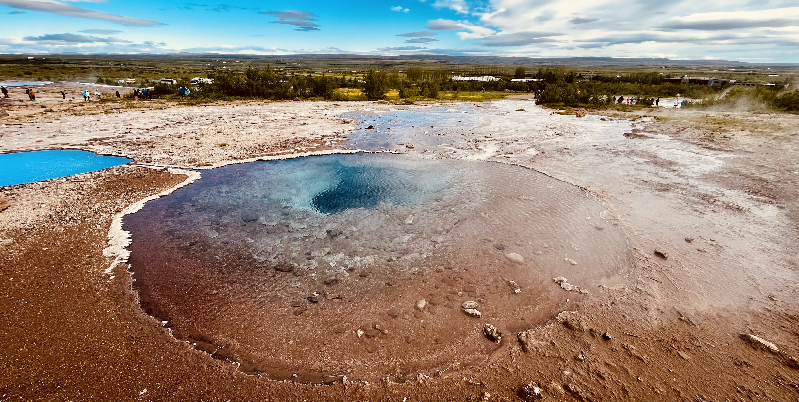
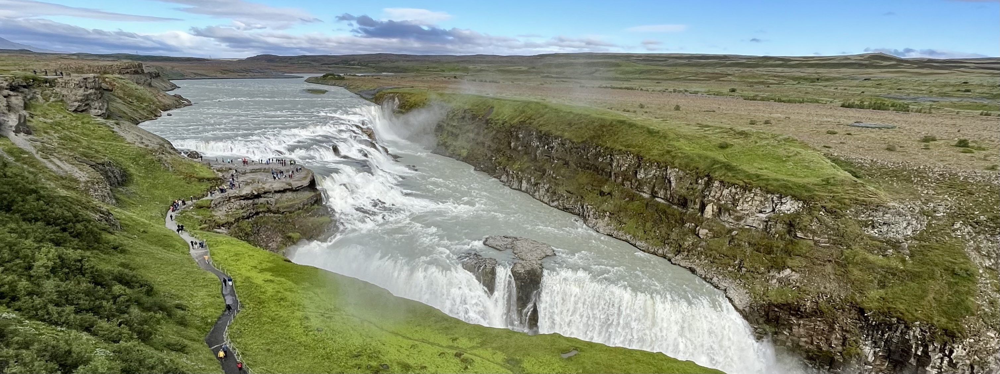

&nbsp;

Kdy jsme se minul칳 rok vr치tili z [Dolomit](traveling_2022_Dolomites.html), tam캩j코칤 hory m캩
okouzlily natolik, 쬰 jsme doma zavedli nov칠 pravidlo: ka쬯칳 rok absolvujeme minim치ln캩 jednu cestu
do p콏칤rody (kv콢li m캩) a minim치ln캩 jednu cestu do m캩sta (kv콢li Kl치콏e). A proto쬰
[Island](https://cs.wikipedia.org/wiki/Island) v na코ich p콏edstav치ch p콏edstavoval ide치ln칤 destinaci
z kategorie "p콏칤roda", rozhodli jsme se prozkoumat, co v코echno by cesta obn치코ela.

O [Islandu](https://cs.wikipedia.org/wiki/Island) jsem u d콏칤ve sly코el spoustu pozitiv.
Zvl치코t캩 pak od kamar치d콢 skaut콢, kte콏칤 se na mal칳 ostrov v severn칤m Atlantiku pravideln캩 vyd치vaj칤
na dlouh칠 treky, p콏i kter칳ch obdivuj칤 obrovskou rozmanitost tamn칤ch p콏칤rodn칤ch kr치s. A i kdy m캩
p콏edstava spat콏it na vlastn칤 o캜i v코echny ty vodop치dy, gejz칤ry, hory a kdov칤 co je코t캩, l치kala,
bylo tu i n캩co, co mi nah치n캩lo strach. Historky o bl치zniv칠m po캜as칤, kter칠 se m캩n칤 ka쬯칳ch
10 minut, siln칠m v캩tru, kter칳 ulamuje dve콏e od aut, nebo o pol치rn칤 noci, kter치 na p콢l roku
zahal칤 cel칳 ostrov do 캜erno캜ern칠 tmy, m캩 sp칤코e d캩sily, ne aby mi 콏칤kaly: "Kupuj letenku a le콘!"

Kdy jsem ale za캜al studovat, o 캜em 쬰 to ten [Island](https://cs.wikipedia.org/wiki/Island) vlastn캩
je, zjistil jsem, 쬰 mnoho m칳ch obav pramen칤 z myln칠 p콏edstavy o tom, 쬰 캜lov캩k jede
na [Island](https://cs.wikipedia.org/wiki/Island) proto, aby 코el na trek. To ale nen칤 pravda.
Dokonce bych 콏ekl, 쬰 v칤ce lid칤 jezd칤 na [Island](https://cs.wikipedia.org/wiki/Island) "nalehko".
A jak se pozd캩ji uk치zalo, p콏칤roda je na ostrov캩 sice drsn치, ale pokud se na ni 캜lov캩k dob콏e
p콏iprav칤 a p콏i n치v코t캩v캩 pou쮂셨치 selsk칳 rozum, nen칤 se 캜eho b치t.

캛eho jsem se b치l nejv칤ce, bylo po캜as칤, kter칠 n치s na na코ich p콏edchoz칤ch cest치ch u n캩kolikr치t zastihlo nep콏ipraven칠. Rozhodl jsem se proto, 쬰 si na [Island](https://cs.wikipedia.org/wiki/Island) zabal칤m
pohorky a p콏ed cestou si koup칤m nepromokav칠 kalhoty, kter칠 v kombinaci s kvalitn칤 v캩trovkou vytvo콏칤
perfektn칤 ochranu proti nep콏칤zniv칠mu po캜as칤. P치r dn칤 p콏ed odletem ale Kl치ra objevila v brn캩nsk칠m
obchodu [Fj칛llraven](https://www.fjallraven.com/) n치dhern치 nepromokav치 poncha, kter치 nakonec
zv칤t캩zila nad neforemn칳mi a v budoucnu t캩쬶o vyu쬴teln칳mi kalhotami. Na
[Island](https://cs.wikipedia.org/wiki/Island) jsem t칤m p치dem odj칤쬯캩l s velk칳m respektem,
ale i s v칤rou, 쬰 jsme dob콏e p콏ipraveni!

&nbsp;

#### DEN 0

Na co jsem ale nebyl p콏ipraven, byla zm캩na v letov칠m 콏치du. Jen p치r hodin p콏ed t칤m, ne jsme cht캩li
vyrazit sm캩r pra쬽k칠 leti코t캩, odkud odl칠talo na코e letadlo, jsem obdr쬰l SMS zpr치vu od leteck칠
spole캜nosti [PLAY](https://www.flyplay.com/en?origin=PRG), 쬰 n치코 let je zru코en. Kdy jsem otev콏el
webovou aplikaci s detailem letu, zjistil jsem, 쬰 let nebyl zru코en, ale p콏esunut na dal코칤 den.

Proto쬰 jsme byli u sbalen칤, rozhodli jsme se jet do [Prahy](https://cs.wikipedia.org/wiki/Praha),
zaj칤t si na dobrou ve캜e콏i, p콏espat v hotelu a r치no se v klidu p콏esunout na leti코t캩.

Mysl칤m, 쬰 nic zaj칤mav칠ho se p콏i cest캩 nestalo, proto alespo켿 nasd칤l칤m jednu historku, kter치
poslou쮂 jako voda na ml칳n n캩kter칳ch konspira캜n칤ch teori칤. N캩kolik dn칤 p콏ed odletem jsme se za캜ali
d칤vat na [seri치l Atypical](https://www.csfd.cz/film/528719-atypicky/prehled/). Seri치l zobrazuje
st콏edo코kolsk칠ho studenta Sama, kter칳 trp칤 autismem. V pr콢b캩hu prvn칤 s칠rie jsem na sob캩 za캜al
pozorovat podobn칠 p콏칤znaky autismu, kter칠 se projevovaly i u hlavn칤ho hrdiny. Na z치klad캩 toho jsem
si ud캩lal online test, kter칳 odhalil, 쬰 moje obavy byly na m칤st캩. Kdy jsem o tom 콏ekl Kl치콏e,
i ona si ud캩lala test. Po jeho dokon캜en칤 zjistila, 쬰 je na tom je코t캩 h콢콏e ne j치. A te캞 ta
konspirace - v na코em obl칤ben칠m pra쬽k칠m hotelu jsme cca 3 hodiny po dokon캜en칤 testu dostali pokoj
pro posti쬰n칠. Je t칤m p치dem jasn칠, 쬰 [Google](https://www.google.com/)
a [Netflix](https://www.netflix.com/cz-en/) n치s odposlouch치vaj칤 a prod치vaj칤 informace jin칳m
subjekt콢m!

A nyn칤 zase zp캩t k [Islandu](https://cs.wikipedia.org/wiki/Island).

&nbsp;

#### DEN 1

Na [mezin치rodn칤 leti코t캩 v Keflav칤ku](https://www.cestujlevne.com/letiste/keflavik) jsme dorazili
po naprosto nekone캜n칠m (캜ti 캜ty콏hodinov칠m) letu ve 3 hodiny odpoledne m칤stn칤ho 캜asu. 캛as
na [Islandu](https://cs.wikipedia.org/wiki/Island) se 콏칤d칤 캜asem UTC, tzn. 쬰 v zim캩, resp. v l칠t캩
je na ostrov캩 o 1 hodinu, resp. o 2 hodiny m칠n캩 ne v 캛esku.

Hned po p콏칤letu jsme za코li do pobo캜ky [spole캜nosti Payless](https://www.paylesscar.com/en/home)
a s pomoc칤 upov칤dan칠ho Pol치ka Charlieho, kter칳 sed캩l za p콏ep치쬶ou, jsme si p콢j캜ili prd칤tko
zna캜ky Hyundai, [model i10](https://en.wikipedia.org/wiki/Hyundai_i10). Nem캩l jsem z toho 칰pln캩
nejlep코칤 pocit, proto쬰 v쬯ycky, kdy vid칤m v콢z zna캜ky
[Hyundai](https://en.wikipedia.org/wiki/Hyundai_Motor_Company), vzpomenu si na slova sv칠ho b칳val칠ho
kolegy Jirky Polcara: "Kdo si koup칤 [Hyundaie](https://en.wikipedia.org/wiki/Hyundai_Motor_Company),
nadosmrti kunda je!" Na druhou stranu ale mus칤m uznat, 쬰 i kdy aut칤캜ko nem캩lo 칰pln캩 nejv칳konn캩j코칤
motor a v n캩kter칳ch islandsk칳ch kopc칤ch se hodn캩 zad칳ch치valo, v pr콢b캩hu na코칤 dovolen칠 n치s zavezlo
칰pln캩 v코ude, byl na n캩j spoleh a hlavn캩 - jak ukazuje dal코칤 fotka - v코echno se do n캩j vlezlo!

&nbsp;

*Pln캩 nalo쬰n칳 v콢z Hyundai i10.*

&nbsp;

Ne jsme si p콢j캜ili auto, tro코ku n치m vyhl치dlo, za코li jsme si proto na brzkou ve캜e콏i do stylov칠ho
[Library bistra v Keflav칤ku](https://librarybistro.is/) a pot칠 vyrazili na t콏i hodiny dlouh칳 p콏ejezd
do m캩sta [V칤k](https://cs.wikipedia.org/wiki/V%C3%ADk_%C3%AD_M%C3%BDrdal) na ji쬹칤 stran캩 ostrova.
Cestou n치s 캜ekaly dv캩 zast치vky u dvou vodop치d콢.

Prvn칤 z nich se jmenuje [Seljalandsfoss](https://www.cestujlevne.com/pruvodce/island/seljalandsfoss)
a je specifick칳 t칤m, 쬰 pad치 z pom캩rn캩 dlouh칠ho p콏evisu, tak쬰 jej lze po vy코lapan칠 cesti캜ce cel칳
obej칤t! D칤ky sv칠 unik치tnosti a velmi snadn칠 dostupnosti z hlavn칤 silnice 캜. 1 se jedn치 o jedno
z nejv칤ce turistick칳ch m칤st na [Islandu](https://cs.wikipedia.org/wiki/Island). My jsme k vodop치du
ale p콏ijeli a kolem 9. hodiny ve캜er, tak쬰 jsme se na 60 m vysokou masu vody mohli pod칤vat v klidu,
bez z치stupu dal코칤ch turist콢!

Jen 30 km d치l na v칳chod se nach치z칤 druh칳 slavn칳
vodop치d - [Sk칩gafoss](https://www.cestujlevne.com/pruvodce/island/skogafoss). Oproti tomu
p콏edchoz칤mu je [Sk칩gafoss](https://www.cestujlevne.com/pruvodce/island/skogafoss) mnohem 코ir코칤
a nelze se schovat ve sk치le za n칤m. Je ale mo쬹칠 vy코plhat po 400 쬰lezn칳ch schodech na 칰tes
a pod칤vat se, odkud 25 m 코irok치 콏eka Sk칩ga te캜e. U paty vodop치du z치rove켿 za캜칤n치 d치lkov칳 trek
p콏es pr콢smyk Fimmv칬rduh치ls, kter칳 vede do zn치m칠 oblasti
[Th칩rsm칬rk](https://www.cestujlevne.com/pruvodce/island/thorsmork).

&nbsp;

*Majest치tn칤 vodop치d [Sk칩gafoss](https://www.cestujlevne.com/pruvodce/island/skogafoss).*

&nbsp;

Kdy jsme vylezli na 칰tes, pr코elo, bylo chladno, bl칤쬴la se 10. hodina ve캜er a na m캩 za캜ala padat
칰nava. V tu chv칤li jsem si uv캩domil, jak skv캩l칳 n치pad to byl po콏칤dit si na코e poncha! Bylo chladno?
Ano. Pr코elo? Ano. N치m ale bylo teplo, byli jsme v suchu a nav칤c - hned prvn칤 den jsme vid캩li dva
kr치sn칠 vodop치dy! Kdy jsme proto po dal코칤ch 30 minut치ch p콏ijeli do m캩ste캜ka V칤k, m캩l jsem skv캩lou
n치ladu a byl jsem moc vd캩캜n칳 za to, co jsme hned prvn칤 den za쬴li.

&nbsp;

*J치 a m콢j nov칳 nejobl칤ben캩j코칤 kus oble캜en칤!.*

&nbsp;

#### DEN 2

Proto쬰 jsme p콏esp치vali v mal칠 칰tuln칠 chatce, kterou jsem zarezervoval
p콏es [Airbnb](https://www.airbnb.com/), nem캩li jsme v cen캩 pobytu sn칤dani. Rozhodli jsme se proto
vyu쮂셦 slu쬰b nedalek칠 hipster [kav치rny](https://www.skoolbeans.com/), kter치 vznikla p콏estavbou
쬷ut칠ho 코koln칤ho autobusu. V autobusu bylo mo쬹o si sednout, vyp칤t hork칳 n치poj a sn칤st muffin,
nebo bagel.

Po sn칤dani za캜al n치코 program, ten den v캩novan칳 nejzn치m캩j코칤m atrakc칤m v okol칤
[V칤ku](https://cs.wikipedia.org/wiki/V%C3%ADk_%C3%AD_M%C3%BDrdal), na pl치쬴
[Reynisfjara](https://www.cestujlevne.com/pruvodce/island/reynisfjara). Ta se pravideln캩 dost치v치
do mnoha turistick칳ch 쬰b콏칤캜k콢 jako쬾o jedna z nejkr치sn캩j코칤ch pl치쮂 sv캩ta. A nen칤 se co divit.
캛ern칳 sope캜n칳 p칤sek v kombinaci s 60 m vysok칳mi 캜edi캜ov칳mi sloupy vystupuj칤c칤mi z mo콏e a neobvykl칳mi
칰tesy vytv치콏칤 kulisu jako 쮂멳nou jinou!

Pl치 m치 ale i svoji odvr치cenou tv치콏. Na internetu se vyskytuje mnoho 캜l치nk콢 o tom, 쬰 na pl치쬴 se
vyskytuj칤 tzv. pl칤쬴v칠 vlny. Jedn치 se jev, kdy se sto캜칤 v칤tr z mo콏e sm캩rem k pl치쬴, tak쬰
p콏ich치zej칤c칤 vlna je r치zem zna캜n캩 v캩t코칤 ne vlna p콏edchoz칤. Pokud se v tu chv칤li vyskytuje 캜lov캩k
bl칤zko b콏ehu, vlna vezme 캜lov캩ku p콢du pod nohama. Pot칠 sta캜칤 zavr치vorat a spadnout do mo콏e, odkud
je pot칠 velice obt칤쬹칠 se dostat. P콏칤klad stejn칠 ud치losti ve Francii zachycuje
[toto video](https://www.youtube.com/watch?v=cSgSMZsMh4A) (osobn캩 jej nedoporu캜uji slab코칤m povah치m).
Pl치 si takto v minulosti vzala n캩kolik lidsk칳ch 쬴vot콢 a p치r let byla dokonce 칰pln캩 uzav콏ena.
P콏ed jej칤m znovuotev콏en칤m byla ke vstupu na pl치 um칤st캩na varovn치 tabule, na kter칠 je jasn캩 vid캩t,
kam v dan칳 den 캜lov캩k m콢쬰 chodit a kam ne. J치 osobn캩 jsem se o t캩chto informac칤ch dozv캩d캩l a
po n치v코t캩v캩 a naprosto up콏칤mn캩 - i kdy jsem varovnou tabuli vid캩l, moc velkou pozornost jsem j칤
nev캩noval. V den n치v코t캩vy jsem byl sp칤코 r치d za to, 쬰 m치m poncho, kter칠 m캩 chr치n칤 p콏ed de코t캩m,
a z치rove켿 nem치m d캩ti, kter칠 by si cht캩ly hr치t v p칤sku. A 쬰 jich tam bylo!

&nbsp;

*V dob캩 po콏칤zen칤 fotografie bylo kolem 10 춿C, pr코elo a foukal v칤tr. Jak je vid캩t na fotce, pojem
"dovolen치 u mo콏e" dost치v치 na [Islandu](https://cs.wikipedia.org/wiki/Island) 칰pln캩 nov칳 rozm캩r.*

&nbsp;

Jen 30 km na z치pad od [V칤ku](https://cs.wikipedia.org/wiki/V%C3%ADk_%C3%AD_M%C3%BDrdal) se nach치z칤
[S칩lheimaj칬kull](https://guidetoiceland.is/travel-iceland/drive/solheimajokull), nejdel코칤 jazyk
ledovce [M칳rdalsj칬kull](https://en.wikipedia.org/wiki/M%C3%BDrdalsj%C3%B6kull).
[S칩lheimaj칬kull](https://guidetoiceland.is/travel-iceland/drive/solheimajokull) m캩콏칤 8 km a
[Google](https://www.google.com/) jej ozna캜uje jako "malebn칳 ledovec". Kousek od hlavn칤 silnice 캜. 1
jsme nechali auto na parkovi코ti a po vy코lapan칠 cest캩 jsme se pro코li a ke konci ledovcov칠ho splazu.
Mnoho lid칤 na m칤st캩 vyu쮂셨alo slu쬭y cestovn칤ch agentur, kter칠 nab칤zej칤 t칰ry po ledovci. My jsme ale
nastoupili zp캩t do auta a vydali se na fish and chips
do [Mia's country van](https://www.instagram.com/miascountryvan/?hl=en) pobl칤 vodop치du
[Sk칩gafoss](https://www.cestujlevne.com/pruvodce/island/skogafoss),
u kter칠ho jsme byli p콏edchoz칤 den ve캜er. Kdy na n치s p콏i코la 콏ada a my dostali j칤dlo, p콏ed food truckem
byly v코echny such칠 lavi캜ky obsazen칠 a my si tak museli vybrat jednu z t캩ch, kter칠 po de코ti je코t캩
nikdo neosu코il. Necht캩li jsme pl칳tvat pap칤rov칳mi kapesn칤ky, kter칳ch jsme m캩li nedostatek, proto jsme
se rozhodli vz칤t si poncha a sednout si na lavi캜ku v nich. Kdy jsem si ale sedal, neuv캩domil jsem si,
쬰 poncho m치 na boc칤ch v캩trac칤 otvory. Ob캩d ani n치slednou k치vu v podniku
[Freya Caf칠](https://www.instagram.com/freyacafeiceland/) jsem si t칤m p치dem moc neu쬴l - studil m캩 zadek.

&nbsp;

*Malebn칳 ledovec S칩lheimaj칬kull.*

&nbsp;

Po k치v캩 jsme vyrazili na 7 km dlouh칳 trek
k [vraku letadla](https://www.cestujlevne.com/pruvodce/island/vrak-letadla-dc-3), kde pom캩rn캩 dost
foukalo, tak쬰 mi kalhoty hezky uschly. Krom캩 toho ale nehodnot칤m trek nijak zvl치코콘 pozitivn캩.
Fotky letadla nevypadaj칤 zle, ale jinak je to celkem nuda. Nejd콏칤ve se jde 3.5 km dlouhou cestou
uprost콏ed m캩s칤캜n칤 krajiny k [vraku letadla](https://www.cestujlevne.com/pruvodce/island/vrak-letadla-dc-3)
a potom tou stejnou trasou zase zp캩t. V r치diu cca 10 - 20 km nen칤 nic k vid캩n칤, pouze 코ed치 placka
tvo콏en치 코t캩rkem a 캜ern칳m l치vov칳m prachem. Pokud bych jel na [Island](https://cs.wikipedia.org/wiki/Island)
znovu, tento trek bych na 100 % vynechal.

&nbsp;

*[Vrak americk칠ho arm치dn칤ho letadla Dakota DC-3](https://www.cestujlevne.com/pruvodce/island/vrak-letadla-dc-3),
kter칠 le쮂 v osi콏el칠 krajin캩 코irok칠ho l치vov칠ho pole od hav치rie v roce 1973.*

&nbsp;

Po n칠 moc z치쬴vn칠 proch치zce n치s 캜ekala posledn칤 zast치vka dne - [mys Dyrh칩laey](https://www.cestujlevne.com/pruvodce/island/dyrholaey),
kter칳 je z치rove켿 nejji쬹캩j코칤m bodem pevninsk칠ho [Islandu](https://cs.wikipedia.org/wiki/Island).
Turisticky atraktivn칤 je mys zvl치코t캩 z toho d콢vodu, 쬰 je tvo콏en vysok칳mi 칰tesy, z nich je p캩kn칳
pohled na skaln칤 br치nu vystupuj칤c칤 do mo콏e. Ta slou쮂 jako 칰to캜i코t캩 mnoha mo콏sk칳ch pt치k콢, tak쬰
p콏i bli쮄뫆셠 pohledu nen칤 zase tolik l치k치v치 jako na fotk치ch. Krom캩 skaln칤 br치ny je ale z 칰tes콢 vid캩t
i pl치 Reynisfjara, kter치 na jedn칠 stran캩 칰tes콢 kon캜칤. Na druh칠 stran캩 se potom n치v코t캩vn칤k콢m nab칤z칤
pohled na tzv. "Endless black beach" (v p콏ekladu "nekone캜n치 캜ern치 pl치"), kter치 v kontrastu se zelen칳mi
kopci za n칤 vytv치콏칤 opravdu n치dhernou scen칠rii.

&nbsp;

*Jm칠no "Endless black beach" hovo콏칤 za v코e.*

&nbsp;

Po n치ro캜n칠m dni jsme si za코li na ve캜e콏i do podniku
[Black Crust Pizza](https://www.facebook.com/BlackCrustPizzeria/)
ve [V칤ku](https://cs.wikipedia.org/wiki/V%C3%ADk_%C3%AD_M%C3%BDrdal), kde - jak u n치zev
napov칤d치 - jsme si dali pizzu s 캜ern칳m okrajem. Proto쬰 bylo moc p캩kn칠 po캜as칤, po ve캜e콏i jsme se
je코t캩 pro코li k m칤stn칤mu [ikonick칠mu kostel칤ku](https://en.wikipedia.org/wiki/Vik_Church)
s 캜ervenou st콏echou a vy코plhali jsme i k nedalek칠mu h콏bitovu, odkud se n치m naskytl n치dhern칳 v칳hled
nejen na cel칠 m캩ste캜ko, ale i na okoln칤 zelen칠 kopce.

&nbsp;

*Pohled na [kostel칤k v m캩ste캜ku V칤k](https://en.wikipedia.org/wiki/Vik_Church). V pozad칤 캜edi캜ov칠
sloupy na pl치쬴 [Reynisfjara](https://www.cestujlevne.com/pruvodce/island/reynisfjara).*

&nbsp;

#### DEN 3

R치no jsme za코li na bagel do [코koln칤ho autobusu](https://www.skoolbeans.com/) a po dvou noc칤ch
str치ven칳ch ve [V칤ku](https://cs.wikipedia.org/wiki/V%C3%ADk_%C3%AD_M%C3%BDrdal) se vydali
na v칳chod. Po necel칠 hodin캩 cesty jsme dorazili
ke [ka켿onu Fj치dr치rglj칰fur](https://www.cestujlevne.com/pruvodce/island/fjadrargljufur). Pod칠l ka켿onu
vede turistick치 stezka, po kter칠 je mo쬹칠 doj칤t k 쬰lezn칠 vyhl칤dkov칠 plo코in캩. Z n칤 se nab칤z칤 v칳hled
na p치r men코칤ch vodop치d콢. P콏esto쬰 jsem se na ka켿on uprost콏ed syt캩 zelen칠 krajiny hodn캩 t캩코il, mus칤m
콏칤ct, 쬰 moje pocity byly v pr콢b캩hu n치v코t캩vy dost sm칤코en칠. Kolem turistick칠 stezky je vid캩t, 쬰 mnoz칤
turist칠 ignoruj칤 zna캜en칤 a p콏i honb캩 za co nejlep코칤 fotkou vy코lap치vaj칤 kolem cesty dal코칤
chodn칤캜ky, kter칠 naru코uj칤 p콢vodn칤 r치z krajiny. Kolem jednoho m칤sta na vyhl칤dkov칠 plo코in캩 je dokonce
um칤st캩n i ostnat칳 dr치t, kter칳 m치 zabr치nit lidem p콏el칠zt z치bradl칤 a 코lapat po zelen칠 tr치v캩. Kdy ale
odhl칠dnu od skute캜nosti, 쬰 ka켿on nav코t캩vuj칤 pouze turist칠 a n캩kte콏칤 z nich neprojevuj칤 respekt
k dan칠mu m칤stu, jedn치 se o skv캩lou zast치vku na cest캩 po v칳chodn칤m
[Islandu](https://cs.wikipedia.org/wiki/Island)!

&nbsp;

*Pohled do [ka켿onu Fj치dr치rglj칰fur](https://www.cestujlevne.com/pruvodce/island/fjadrargljufur).*

&nbsp;

Po kr치tk칠 zast치vce na ob캩d v m캩ste캜ku
[Kirkjub칝jarklaustur](https://en.wikipedia.org/wiki/Kirkjub%C3%A6jarklaustur) jsme pokra캜ovali d치l
po hlavn칤 silnici 캜. 1. Na ji쬹칤 캜치sti ostrova vedla cesta pod칠l vysok칳ch skal porostl칳ch zelenou
tr치vou, na druh칠 stran캩 cesty - sm캩rem k pob콏e쮂 - se rovn치 krajina 캜asto m캩nila. Jeli jsme kolem
l치vov칳ch pol칤, travnat칳ch pl치n칤, na kter칳ch se p치sly ove캜ky a kon캩, nebo pod칠l nekone캜n칳ch l치n콢
[vl캜칤ch bob콢](https://cs.wikipedia.org/wiki/Lupina).
Ty na [Islandu](https://cs.wikipedia.org/wiki/Island) rostou skoro v코ude a mn캩 osobn캩 p콏ipom칤naj칤
[levandule](https://cs.wikipedia.org/wiki/Levandule). D치l na v칳chod se ale r치z krajiny ust치lil.
Za캜al se toti 콏칤dit zdej코칤m p치nem [Vatnaj칬kullem](https://cs.wikipedia.org/wiki/Vatnaj%C3%B6kull).
Podle [n캩kter칳ch zdroj콢](https://www.icelandontheweb.com/articles-on-iceland/nature/glaciers/vatnajokull#:~:text=Iceland's%20Vatnaj%C3%B6kull%20glacier%20is%20Europe's,thick%20at%20its%20thickest%20point.)
se jedn치 o nejv캩t코칤 ledovec v Evrop캩. Ledovec, kter칳 je zaps치n
na [seznamu UNESCO](https://en.wikipedia.org/wiki/List_of_World_Heritage_Sites_in_Iceland), zauj칤m치
asi 10 % rozlohy cel칠ho [Islandu](https://cs.wikipedia.org/wiki/Island) a z hlavn칤 cesty nejde
p콏ehl칠dnout. Masy ledu a sn캩hu se plaz칤 mezi vysok칳mi horami do 칰dol칤 a vytv치콏칤 ledovcov치 jezera.

K jednomu takov칠mu jsme se v r치mci na코칤 dal코칤 zast치vky 코li pod칤vat i my. Jednalo se o jezero
u ledovcov칠ho splazu [Skaftafell](https://www.cestujlevne.com/pruvodce/island/skaftafell).
Jezero bylo ale hrozn캩 velk칠, tak쬰 nebylo mo쬹칠 se dostat bl칤zko ledovce. Ve v칳sledku se mi t칤m
p치dem zd치lo, 쬰 jsme nevid캩li o moc v칤c, ne p콏edchoz칤 den u ledovcov칠ho splazu
[S칩lheimaj칬kull](https://www.cestujlevne.com/pruvodce/island/solheimajokull).

Po ne moc z치쬴vn칠 proch치zce jsme se vydali na druhou stranu od turistick칠ho centra do hor.
Po asi 2 km jsme dorazili do nen치padn칠ho 칰dol칤, kde na n치s u 캜ekal vodop치d
[Svartifoss](https://en.wikipedia.org/wiki/Svartifoss). Ten pat콏칤 k tomu nejlep코칤mu,
co [Island](https://cs.wikipedia.org/wiki/Island) nab칤z칤. V porovn치n칤 s ostatn칤mi vodop치dy
na ostrov캩 se jedn치 sp칤코e jeden z t캩ch men코칤ch. Svoji sl치vu si ale z칤skal t칤m, 쬰 20 m dlouh칳 proud
vody pad치 ze st캩ny, kter치 je tvo콏ena geometricky p콏esn칳mi 캜edi캜ov칳mi hranoly. Pr치v캩 ty mnoh칳m
p콏ipom칤naj칤 p칤코콘aly kosteln칤ch varhan.

&nbsp;

*Vodop치d [Svartifoss](https://en.wikipedia.org/wiki/Svartifoss), kter칠mu se d칤ky 캜edi캜ov칠 st캩n캩
p콏ezd칤v치 "캜ern칳 vodop치d".*

&nbsp;

Po t콏ech mini t칰r치ch jsem se u t캩코il na ve캜e콏i a do postele. Ten den n치s ale 캜ekala je코t캩 jedna
zast치vka u ledovcov칠ho splazu
[Sv칤nafellsj칬kull](https://guidetoiceland.is/travel-iceland/drive/svinafellsjokull). Zast치vku n치m
doporu캜il Nasty, kter칳 ji dokonce ozna캜il za sv콢j highlight na ji쬹칤m pob콏e쮂. Po zku코enosti
s p콏edchoz칤mi ledovcov칳mi splazy jsem up콏칤mn캩 nem캩l moc velk치 o캜ek치v치n칤, ale nejednalo se o velkou
zaj칤쮃끎u a nav칤c, kdy u jsme byli pobl칤, 콏칤kal jsem si, 쬰 by byla 코koda se tam nezastavit.
A dob콏e jsme ud캩lali!

Z hlavn칤 silnice 캜. 1 vedla ke splazu kamenit치 cesta, na kter칠 jsem se celou dobu b치l, 쬰 p칤chneme
kolo. Po asi 2 km jsme dorazili na pr치zdn칠 parkovi코t캩, kde jsme nechali auto a vydali se
po vyzna캜en칠 cest캩 k ledovci. Jak jsem zm칤nil v칳코e, nem캩li jsme moc velk치 o캜ek치v치n칤. J치 si na cestu
k ledovci nav칤c nevzal poncho a za캜칤nalo se smr치kat, tak쬰 kdy jsme p콏i코li na prvn칤 horizont
a ledovec nikde, m캩l jsem chu콘 se oto캜it a j칤t zp캩t k autu. Za druh칳m horizontem na n치s ale
vykoukla obrovsk치 masa ledu, kter치 se nezd치la b칳t v콢bec daleko. P콏idali jsme proto do kroku, cestu
jsme si zkr치tili p콏es nevy코lapan칠 l치vov칠 pole a po chvilce se n치m naskytl pohled jako 쮂멳n칳 jin칳.
St치li jsme u hn캩d칠ho ledovcov칠ho jezera, ve kter칠m plavaly obrovsk칠 kry. Mal칠 jezero obklopoval
z jedn칠 strany ledovec, z druh칠 strany potom vysok치 hora k칩nick칠ho tvaru. Nav칤c jsme na m칤st캩 byli
skoro sami. 칔쬬sn칳 z치쬴tek a ur캜it캩 nejlep코칤 ledovcov칳 splaz
na [Islandu](https://cs.wikipedia.org/wiki/Island). D칤ky, Nasty!

&nbsp;

*Ledovcov칳 splaz [Sv칤nafellsj칬kull](https://guidetoiceland.is/travel-iceland/drive/svinafellsjokull).*

&nbsp;

#### DEN 4

캛tvrt칳 den na코칤 dovolen칠 m캩l b칳t podle m칳ch p콏edstav voln캩j코칤. Kdy jsme se tedy v 10:30 dostali
na hotelov칠 parkovi코t캩, kde u st치lo jen na코e auto, a to i p콏esto, 쬰 p콏edchoz칤 den jsme m캩li
probl칠m zaparkovat, nijak zvl치코콘 m캩 to neznerv칩z켿ovalo.

Prvn칤 zast치vku jsme si ud캩lali u ledovcov칠 laguny
[J칬kuls치rl칩n](https://www.cestujlevne.com/pruvodce/island/jokulsarlon), kter치 je tvo콏ena taj칤c칤m
ledovcem [Brei칧amerkurj칬kull](https://en.wikipedia.org/wiki/Brei%C3%B0amerkurj%C3%B6kull).
Ten je코t캩 p콏ed 40 lety sahal a k mo콏i, jen쬰 postupn칳m t치n칤m se st치hl d치l do vnitrozem칤 a vytvo콏il
lagunu, ze kter칠 proud칤 voda do mo콏e. Z ledovce se postupn캩 odlamuj칤 kry r콢zn칠 velikosti, kter칠 pluj칤
na hladin캩 laguny a vytv치콏칤 hodn캩 fotogenick칠 prost콏ed칤. Mysl칤m, 쬰 na tomto m칤st캩 n치m skv캩le
vy코lo po캜as칤, tak쬰 se mi zde poda콏ilo vytvo콏it p캩knou 칰vodn칤 fotku pro tento 캜l치nek.

Kry, kter칠 pluj칤 z laguny do mo콏e, jsou 캜asto vyplavov치ny na pl치, kter치 se nach치z칤 na druh칠
stran캩 hlavn칤 silnice. D칤ky t캩mto vyplaven칳m kr치m dostala pl치 p콏칤hodn칠 jm칠no - diamantov치. J치 osobn캩
jsem na pl치쬴 캜ekal o dost v칤c "diamant콢", ale to bylo asi zp콢sobeno skute캜nost칤, 쬰 v코echny zn치m칠
fotky t칠to pl치쬰 jsou po콏칤zeny v zim캩.

&nbsp;

*[Diamantov치 pl치쬫(https://www.cestujlevne.com/pruvodce/island/jokulsarlon), kter치 by podle m캩 mohla
b칳t v칤ce diamantov치.*

&nbsp;

Po kr치tk칠 proch치zce jsme si za코li na j칤dlo do hladov칳ch oken u laguny. J치 si koupil slanou pala캜inku
se 코unkou a s칳rem, kterou mi k m칠mu p콏ekvapen칤 prodal
[캛ech jm칠nem La캞a](https://www.instagram.com/buttinthenature/?hl=en). Ne nachystal pala캜inku
z치kazn칤kovi p콏ede mnou, stihl mi 콏칤ct, 쬰 na [Islandu](https://cs.wikipedia.org/wiki/Island) 쬴je
u 10 let, vlastn칤 food truck s pala캜inkami a bydl칤 v m캩ste캜ku
[H칬fn](https://cs.wikipedia.org/wiki/H%C3%B6fn)... kam jsme ten den m캩li nam칤콏eno i my!

Kdy jsme dorazili do [H칬fnu](https://cs.wikipedia.org/wiki/H%C3%B6fn), co v p콏ekladu znamen치
p콏칤stav, byl 캜as na k치vu. Auto jsme proto nechali na parkovi코ti "v centru" a zam칤콏ili do na코칤
[vytipovan칠 kav치rny](https://pakkhus.is/). Hned u parkovi코t캩 ale st치l coffee truck. Nev칤m, zda se
tento pojem pou쮂셨치, ale byla to prost캩 dod치vka, kde se m칤sto j칤dla prod치vala k치va - proto ne
"food truck", ale "coffee truck". Kapi코to? 콎칤kali jsme si, 쬰 tento coffee truck vypad치 skv캩le
a 쬰 ho vyzkou코칤me. Kdy jsme ale p콏i코li bl칤, pan칤 baristka n치m ozn치mila, 쬰 v cel칠m m캩ste캜ku
vypadl proud a 쬰 jedin칠, co n치m m콢쬰 nab칤dnout, je limon치da. My jsme proto slu코n캩 odm칤tli a
zam칤콏ili do p콢vodn칤 [kav치rny](https://pakkhus.is/). Tam n치s u od dve콏칤 v칤tali zdej코칤 zam캩stnanci
s t칤m, 쬰 v cel칠m [H칬fnu](https://cs.wikipedia.org/wiki/H%C3%B6fn) vypadl proud - p콏ekv치pko - a 쬰
n치m nejen쬰 neud캩laj칤 k치vu, ale ani si nic nem콢쬰me objednat, proto쬰 nefunguje jejich objedn치vkov칳
syst칠m. My se proto zeptali, zda m콢쬰me v kav치rn캩 alespo켿 po캜kat, ne proud znovu nab캩hne a objednat
si pot칠. S t칤m nem캩l nikdo probl칠m, a tak jsme si sedli a 캜ekali. Po chvilce za캜aly 캜칤코nice v코em
z치kazn칤k콢m rozn치코et chl칠b s m치slem na 칰캜et podniku. Toto mil칠 gesto je코t캩 doprov치zely slovy, 쬰 se
omlouvaj칤 za nep콏칤jemnosti, i kdy za ony za nic nemohly. Tomu 콏칤k치m proklientsk칳 p콏칤stup!
Po asi 15 minut치ch nab캩hl proud, co byl okam쬴k, kter칳 cel치 kav치rna oslavila hlasit칳m potleskem.
V tu chv칤li jsem se c칤til sou캜치st칤 [H칬fnu](https://cs.wikipedia.org/wiki/H%C3%B6fn). :-)

Po k치v캩 jsme si nechali v캩ci v na코em guesthousu a vyrazili na nedalekou
[pl치 Stokksness](https://www.cestujlevne.com/pruvodce/island/vestrahorn). Pl치 je
v칳znamn치 hned z n캩kolika d콢vod콢.

1. Stejn캩 jako v코ude na [Islandu](https://cs.wikipedia.org/wiki/Island), i v tomto p콏칤pad캩 se jedn치
o pl치 s 캜ern칳m p칤sek. Nicm칠n캩! Zdej코칤 duny jsou porostl칠 콏칤dkou vysokou tr치vou, co u moc typick칠 nen칤.
2. Za pl치쮂 se nach치z칤 [minipoho콏칤 Vestrahorn](https://www.cestujlevne.com/pruvodce/island/vestrahorn).
3. Na 칰pat칤 hor (nobo bych m캩l ps치t minihor?) nechali filma콏i vybudovat repliku vikingsk칠
vesni캜ky. Kulisy ale nikdy neodvezly, tak쬰 tam jsou dodnes.

Kdy d치me tohle v코echno dohromady, m치me tady zase jedno z nejv칤ce fotografovan칳ch m칤st
na [Islandu](https://cs.wikipedia.org/wiki/Island). A podle m캩 naprosto pr치vem!

&nbsp;

*Kombinace 캜ern칠ho p칤sku, zelen칠 tr치vy a jasn캩 ohrani캜en칠ho
[minipoho콏칤 Vestrahorn](https://www.cestujlevne.com/pruvodce/island/vestrahorn) vytv치콏칤 sc칠nu jako
z jin칠 planety.*

&nbsp;

Kdy jsme p콏ijeli na pl치, nejd콏칤v jsme zam칤콏ili na 칰tesy, odkud jsme pozorovali tulen캩. Abych byl
p콏esn칳 - mysl칤m, 쬰 jsme nevid캩li TY tulen캩, ale sp칤코 TOHO tulen캩. A neb칳t Kl치ry, nevid칤m 콯츼DN칄HO
tulen캩. Zv칤콏e v쬯ycky na chv칤li vystr캜ilo hlavi캜ku nad hladinu rozbou콏en칠ho mo콏e, 콏eklo n치m "Ahoj!"
a zase se pono콏ilo. I kdy jsme ale byli daleko a takto jsme ho zahl칠dli jen p치rkr치t, m캩li jsme
velkou radost z toho, 쬰 jsme vid캩li tohoto ploutvono쬮e ve voln칠 p콏칤rod캩.

Po sezn치m칤 s panem tulen캩m jsme si pro코li pl치, kde Kl치ra nasb칤rala n캩kolik modr칳ch mu코li캜ek a pot칠
jsme zam칤콏ili do vikingsk칠 vesni캜ky. Ta m캩 osobn캩 dost zklamala. Na kulis치ch je vid캩t, 쬰
za posledn칤ch v칤ce ne 10 let se na nich vy콏치dila na [Islandu](https://cs.wikipedia.org/wiki/Island)
nemilosrdn치 matka p콏칤roda. V m칳ch o캜칤ch t칤m p치dem vesni캜ka danou oblast sp칤코e hyzd칤, ne aby ji
posouvala na dal코칤 칰rove켿.

Po proch치zce jsme nasedli do auta a jeli zp캩t do [H칬fnu](https://cs.wikipedia.org/wiki/H%C3%B6fn)
na ve캜e콏i, konkr칠tn캩 do malebn칠
[restaurace Otto Matur & Drykkur](https://www.instagram.com/ottoveitingahus/?hl=en),
kterou n캩kter칠 recenze na [Googlu](https://www.google.com/) ozna캜uj칤 jako nejlep코칤 restauraci
na cel칠m [Islandu](https://cs.wikipedia.org/wiki/Island). To jsem v tu chv칤li ale nebral moc v치쬹캩.
Kdy jsme dorazili na m칤sto, nebyl voln칳 st콢l. Pan칤 캜칤코nice n치m proto donesla 쬴dli캜ky a usadila n치s
u baru, kde jsme asi 20 minut 캜ekali, ne se n치코 st콢l uvoln칤. Z minimalistick칠ho menu o p캩ti
j칤dlech jsem si vybral du코en칠 jehn캩캜칤 maso s ko콏enovou zeleninou a pe캜en칳mi brambory. Kl치ra si
objednala stejn칠 j칤dlo, jen s t칤m rozd칤lem, 쬰 nam칤sto jehn캩캜칤ho masa ochutnala maso hov캩z칤.
A jak to dopadlo? A캜 jsem recenz칤m na [Googlu](https://www.google.com/) v캩noval minim치ln칤 pozornost
a moc jsem jim nev캩콏il, nakonec jsem jim musel d치t za pravdu. Jednalo se toti o jedno z nejlep코칤ch
j칤del v m칠m 쬴vot캩! M캩kou캜k칠 maso p콏elit칠 skv캩le dochucenou om치캜kou vytvo콏ilo u tak bohat칳
gastronomick칳 koncert, kter칳 jsme zakon캜ili nev코edn칤m rebarborov칳m kol치캜em se zakysanou smetanou.
Naprost칳 strop! 10/10!

*Mic drop.*

&nbsp;

#### DEN 5

Proto쬰 m캩ste캜ko [H칬fn](https://cs.wikipedia.org/wiki/H%C3%B6fn) bylo nejv칳chodn캩j코칤m bodem na코칤
cesty a v코echny zaj칤mavosti z okol칤 jsme vy캜erpali p콏edchoz칤 den, byl 캜as na 550 km dlouh칳 p콏ejezd
do [Reykjav칤ku](https://cs.wikipedia.org/wiki/Reykjav%C3%ADk). Ten n치m m캩l kv콢li nejvy코코칤
povolen치 rychlosti 90 km/h zabrat skoro 7 hodin. Nebyl proto 캜as na 쮂멳n칠 dlouh칠 vysp치v치n칤. R치no jsme
si p콏ivstali, za코li na rychlou sn칤dani a v 9 hodin jsme u sed캩li v aut캩.

Po 1 zast치vce na benz칤nov칠 pump캩, 1 zast치vce na ob캩d a celkem 5 hodin치ch str치ven칳ch za volantem
jsme kone캜n캩 dorazili k jednomu z vrchol콢 cel칠 na코칤 dovolen칠, a to dlouho o캜ek치van칠mu gejz칤ru! P칤코i
"dlouho o캜ek치van칠mu", proto쬰 kolem toho byla u n치s doma dlouh치 diskuze. J치 na gejz칤r jet necht캩l.
Jednalo se o pom캩rn캩 velkou zaj칤쮃끎u a pokud jsem si m캩l vybrat mezi mo쬹ost칤 A) str치vit za volantem
7 hodin a vid캩t gejz칤r, nebo B) str치vit za volantem 5,5 hodiny a zast치vku ud캩lat jinde, volil bych
mo쬹ost B). Kl치ra mi ale jasn캩 콏ekla, 쬰 je j칤 prakticky jedno, jak칳 budeme m칤t
na [Islandu](https://cs.wikipedia.org/wiki/Island) program, ale mus칤me vid캩t gejz칤r.
Proto jsme "ud캩lali kompromis" a jeli jsme se pod칤vat na gejz칤r.

V jasn캩 ohrani캜en칠m p콏칤rodn칤m are치lu [Haukadalur](https://en.wikipedia.org/wiki/Haukadalur), kam se
neplatil vstup, bylo gejz칤r콢 v칤ce. P콏esto쬰 aktivn칤 byl pouze jeden, prakticky v코ude se kou콏ilo
ze zem캩 a ve vzduchu byla c칤tit s칤ra. U n캩kter칳ch jez칤rek by ani 캜lov캩k ne콏ekl, 쬰 se v nich va콏칤
voda. V코udyp콏칤tomn칠 varovn칠 cedule ale p콏esv캩d캜ovaly o opaku. Dv캩mi nejv캩t코칤mi atrakcemi v relativn캩
mal칠m are치lu jsou bezpochyby dva nejv캩t코칤 gejz칤ry v dan칠 oblasti. Prvn칤m z nich je praotec
[Geysir](https://cs.wikipedia.org/wiki/Geysir). P콏esto쬰 jeho 캜innost je p콏칤mo z치visl치 na sope캜n칠
aktivit캩 a tud칤 velmi nepravideln치, jedn치 se o gejz칤r, kter칳 dal v코em ostatn칤m gejz칤r콢m jm칠no.
Asi 20 m od [Geysiru](https://cs.wikipedia.org/wiki/Geysir) se nach치z칤 turisticky o n캩co zaj칤mav캩j코칤
gejz칤r [Strokkur](https://cs.wikipedia.org/wiki/Strokkur). Ten pat콏칤
k nejaktivn캩j코칤m gejz칤r콢m na ostrov캩. Sloupec vody vysok칳 15 - 30 m se objevuje zhruba
ka쬯칳ch 10 minut. My jsme ho zastihli 3x a byl to skute캜n캩 z치쬴tek!

&nbsp;

*Geoterm치ln칤m 칰dol칤 [Haukadalur](https://en.wikipedia.org/wiki/Haukadalur). Vlevo vzadu
[Geysir](https://cs.wikipedia.org/wiki/Geysir). Vpravo vzadu 캜ekaj칤 n치v코t캩vn칤ci na to,
co p콏edvede [Strokkur](https://cs.wikipedia.org/wiki/Strokkur).*

&nbsp;

Z 칰dol칤 [Haukadalur](https://en.wikipedia.org/wiki/Haukadalur) jsme se p콏esunuli jen o 10 km d치l
k vodop치du [Gullfoss](https://cs.wikipedia.org/wiki/Zlat%C3%BD_vodop%C3%A1d). Ten pat콏칤 k jedn캩m
z nejmohutn캩j코칤m vodop치d콢 na ostrov캩. 캛lenit칠 칰dol칤 rozd캩luje 코irokou 콏eku na dv캩 kask치dy, kter칠
maj칤 celkovou v칳코ku 32 m. P콏i코lo mi, 쬰 ze spodn칤 kask치dy se val칤 takov치 masa vody, 쬰 ani nebylo
vid캩t na dno ka켿onu. P콏esto쬰 n치m skv캩le vy코lo po캜as칤, tak쬰 jsme u vodop치du vid캩li i duhu, m캩
osobn캩 zase tolik nenadchl. Vodop치dy z prvn칤ho dne se mi rozhodn캩 l칤bily mnohem v칤c.

&nbsp;

*Vodop치d [Gullfoss](https://cs.wikipedia.org/wiki/Zlat%C3%BD_vodop%C3%A1d), t칳 zvan칳 Zlat칳 vodop치d.*

&nbsp;

Po proch치zce k [vodop치du](https://cs.wikipedia.org/wiki/Zlat%C3%BD_vodop%C3%A1d) u byl zase ve캜er,
tak쬰 jsme se stavili na rychlou ve캜e콏i a potom pokra캜ovali
do [Reykjav칤ku](https://cs.wikipedia.org/wiki/Reykjav%C3%ADk). Hlavn칤 m캩sto
[Islandu](https://cs.wikipedia.org/wiki/Island) mi hned ze startu tro코ku p콏ipom캩lo Brno. Kdy jsme
toti p콏ijeli k [hotelu](https://www.booking.com/hotel/is/reykjavik-styles.en-gb.html), cel칠 hotelov칠
parkovi코t캩 bylo obsazen칠 a pan칤 na recepci n치m sd캩lila, 쬰 mus칤me p콏es noc zaparkovat na placen칠m
m캩stsk칠m st치n칤. Kdy jsem ale od hotelu odbo캜il do vedlej코칤 ulice a zjistil jsem, 쬰 polovina
parkovac칤ch m칤st v dan칠 z칩n캩 je st치le voln치, uv캩domil jsem si, 쬰 nikde to nem콢쬰 b칳t tak 코patn칠
jako v Brn캩.

&nbsp;

#### DEN 6

P콏edposledn칤 den na코칤 dovolen칠 m캩l naprosto jasn칳 pl치n: r치no p콏eparkovat auto na hotelov칠 parkovi코t캩,
dopoledne si proj칤t nejzn치m캩j코칤 pam치tky [Reykjav칤ku](https://cs.wikipedia.org/wiki/Reykjav%C3%ADk)
a odpoledne hur치 na mo콏e pozorovat velryby! Kdy jsme ale vy코li
z [hotelu](https://www.booking.com/hotel/is/reykjavik-styles.en-gb.html), bylo chladno, hrozn캩 moc
foukalo a Kl치ra u v tu chv칤li 콏칤kala, 쬰 n치m v칳pravu za velrybami ur캜it캩 zru코칤. J치 jsem tipoval,
쬰 se na mo콏e sice vyprav칤me, ale na lodi zem콏eme. A jak to tak v캩t코inou b칳v치, pravda byla n캩kde
mezi.

P콏i dopoledn칤 proch치zce po hlavn칤m m캩st캩 [Islandu](https://cs.wikipedia.org/wiki/Island) jsem docela
trp캩l. M캩l jsem na sob캩 tri캜ko, ko코ili, bundu a 캜epici a po콏치d mi byla zima. Nep콏칤v캩tiv칠 podm칤nky
jsme ale n캩jak zvl치dli a postupn캩 se pod칤vali k n치sleduj칤c칤m pam치tk치m.

1. [Vila H칬fdi](https://en.wikipedia.org/wiki/H%C3%B6f%C3%B0i). D콏ev캩n치 vilka postaven치 v roce 1909,
kter치 p콢vodn캩 slou쬴la jako s칤dlo francouzsk칠ho konzula, ale do pov캩dom칤 코ir코칤 ve콏ejnosti vstoupila
a o 77 let pozd캩ji. V roce 1986 se toti ve vilce se코el tehdej코칤 americk칳 prezident
[Ronald Reagan](https://cs.wikipedia.org/wiki/Ronald_Reagan) se sv칳m sov캩tsk칳m prot캩j코kem
[Michailem Gorba캜ovem](https://cs.wikipedia.org/wiki/Michail_Gorba%C4%8Dov) a spole캜n캩 se domluvili
na tom, 쬰 nebudou rozmis콘ovat rakety st콏edn칤ho doletu na 칰zem칤 Evropy. Tento akt byl pozd캩ji
ozna캜ov치n jako po캜치tek konce studen칠 v치lky.
2. [Sun voyager](https://en.wikipedia.org/wiki/The_Sun_Voyager). Ocelov치 socha p콏ipom칤naj칤c칤 lo캞
a z치rove켿 jeden ze symbol콢 [Reykjav칤ku](https://cs.wikipedia.org/wiki/Reykjav%C3%ADk).
3. [Kostel Hallgr칤mskirkja](https://cs.wikipedia.org/wiki/Hallgr%C3%ADmskirkja). Luter치nsk칳 kostel
p콏edstavuje nejv캩t코칤 dominantu m캩sta. D칤ky sv칠 poloze na vrcholu kopce je dob콏e viditeln칳 skoro
z cel칠ho 코ir코칤ho centra [Reykjav칤ku](https://cs.wikipedia.org/wiki/Reykjav%C3%ADk). Kostel je zn치m칳
p콏edev코칤m svoj칤 unik치tn칤 architekturou, kter치 m캩 osobn캩 p콏ipom칤n치 histogram symetrick칠ho
pravd캩podobnostn칤ho rozd캩len칤.

&nbsp;

*[Vila H칬fdi](https://en.wikipedia.org/wiki/H%C3%B6f%C3%B0i).*

&nbsp;

Bylo asi 11:30, kdy mi cestou po hlavn칤 n치kupn칤 ulici
[Sk칩lav칬rdust칤gur](https://guidetoiceland.is/travel-iceland/drive/skolavordustigur) sm캩rem
do p콏칤stavu zazvonil telefon. Volala pan칤 z cestovn칤 agentury, 쬰 n치m kv콢li 코patn칠mu po캜as칤 zru코ili
na코i cestu za velrybami. M칤sto zru코en칠 cesty ve 14 hodin n치m ale nab칤dla cestu ve 13 hodin. Moc
jsem nech치pal, jak n치m m콢쬰 nab칤zet jinou cestu jen o hodinu d콏칤v, kdy p콏ed chv칤l칤 콏ekla, 쬰 podm칤nky
na mo콏i nejsou vyhovuj칤c칤. Pan칤 mi vysv캩tlila, 쬰 po캜as칤 neovlivn칤, ale ve 13 hodin vyr치쮂
z p콏칤stavu v캩t코칤 lo캞, kter치 podm칤nky na mo콏i zvl치dne. To mi sta캜ilo, abych s cestou souhlasil.

Kdy jsme po rychl칠m ob캩d캩 dorazili do kancel치콏e cestovn칤 agentury, kde bylo nutn칠 vyzvednout
palubn칤 vstupenky, nad p콏ep치쬶ami jsem si v코iml sv캩teln칠 tabule se seznamem v코ech v칳prav na mo콏e,
kter칠 se ten den organizovaly. U na코칤 plavby v kolonce "podm칤nky na mo콏i" sv칤tila hodnota
"very rough" (v p콏ekladu "hodn캩 drsn칠") a v z치vorce byla uvedena v칳코ka vln mezi 1,5 - 2 m.
Pokud by byla v칳코ka vln vy코코칤 ne 2 m, plavba by byla zru코ena. Mus칤m se p콏iznat, 쬰 v tu chv칤li jsem
malinko znerv칩zn캩l, ale na druhou stranu jsem v캩콏il tomu, 쬰 n치코 ledoborec Andrea plavbu zvl치dne.

Kr치tce po tom, co jsme vypluli z p콏칤stavu, k n치m promluvila kapit치nka lodi. Ta n치s upozornila,
쬰 mo콏sk치 nemoc je na plavb치ch velice 캜ast치. P콏itom n치m doporu캜ila, abychom si vzali tablety proti
mo콏sk칠 nemoci, nebo p콏inejmen코칤m cucali n캩jak칠 bonbony, kter칠 jej칤 projevy potla캜uj칤. Tak칠
zd콢raznila, 쬰 pokud n치m bude 코patn캩, m치me j칤t ven a rozhodn캩 nem치me zvracet do mo콏e, ale m치me
pou쮂셦 pytl칤ky k tomu ur캜en칠. Kapit치nka n치m taky doporu캜ila, abychom tr치vili co nejv칤ce 캜asu venku
na 캜erstv칠m vzduchu, odkud jsou velryby nejl칠pe viditeln칠 a kde b칳v치 lidem nejm칠n캩 코patn캩. Po t캩ch
slovech se n치m samoz콏ejm캩 ud캩lalo nevolno, proto jsme si navl칠kli zateplen칠 overaly, kter칠 byly
na lodi k dispozici, a vyrazili jsme se palubu.

Zateplen칠 overaly m캩li oble캜en칠 v코ichni. A nebylo divu. Na palub캩 foukal tak studen칳 v칤tr, 쬰 m캩
v tu chv칤li hodn캩 mrzelo, 쬰 jsem si dopoledne nekoupil pleten칠 rukavice z ov캜칤 vlny, po kter칳ch
jsem pokukoval. Kdy jsme ale vyjeli ze z치livu na 코ir칳 oce치n, zk콏ehl칠 prsty p콏estaly b칳t moj칤
jedinou obavou. V칤tr toti nebyl jen studen칳, ale i siln칳, tak쬰 jsem po chv칤li pochopil, co
znamenaj칤 "very rough" podm칤nky na mo콏i. Jak na코e lo캞 br치zdila 1,5 - 2 m vysok칠 vlny, kym치cela se
nejen zep콏edu dozadu, ale i ze strany na stranu, co zp콢sobilo, 쬰 ostatn칤 캜lenov칠 pos치dky,
a캜 nadopovan칤 tabletami proti mo콏sk칠 nemoci, za캜ali odpadat jako hru코ky. V zadn칤 캜치sti lodi bylo
vid캩t lidi sed칤c칤 v poloze Supermana, v podpalub칤 zase ka쬯칳 druh칳 "odpo캜칤val" s pytl칤kem u pusy.
Holt mo콏e nesv캩d캜칤 ka쬯칠mu!

&nbsp;

*Vyhl칤쬰n칤 velryb.*

&nbsp;

N치m sice 코patn캩 nebylo, ale j치 osobn캩 jsem se b치l vysok칳ch vln. Ob캜as se lo캞 naklonila tak moc, 쬰
jsem si 콏칤kal, 쬰 se tam n캩kde p콏evr치t칤me a umrzneme v oce치nu. Kdy jsem na tu horskou dr치hu ale
p콏estal myslet a v캩noval se tomu, co se d캩lo na mo콏i, cestu jsem si nesm칤rn캩 u쮂셨al. V코ude kolem
n치s toti l칠tali nejr콢zn캩j코칤 mo콏코t칤 pt치ci, v캜etn캩 roztomil칳ch papuchalk콢, o kter칳ch jsme mluvili
snad celou dovolenou a hrozn캩 moc jsme je cht캩li vid캩t. To ale nebylo v코echno. Po asi hodin캩 cesty
jsme p콏ijeli na m칤sto, kde jsme spat콏ili prvn칤ho [keporkaka](https://cs.wikipedia.org/wiki/Keporkak).
Nejd콏칤v vyst콏칤kla voda nad hladinu a potom se uk치zal i zbytek t캩la. Po chvilce se stejn칳 jev zopakoval,
ale to u n치m zv칤콏e zam치valo i zadn칤 ploutv칤. Velryba se potom vyno콏ila je코t캩 p치rkr치t, poka쬯칠 ale
z dost velk칠 d치lky a jen na mal칳 okam쬴k. V tu chv칤li jsem si 콏칤kal, 쬰 to nejlep코칤 je za n치mi.
To jsem se ale m칳lil. Pokra캜ovali jsme toti d치l, ne jsme narazili na m칤sto, kde se nach치zela
dal코칤 velryba. Nejd콏칤ve jedna, nakonec t콏i, kter칠 se postupn캩 st콏칤dali ve vykukov치n칤 na hladinu
a n치sledn칠m pono콏en칤 s c칤lem obstarat si n캩co k sn캩dku. Byla to n치dhern치 pod칤van치, kter칠 se pr칳
nepo코t캩st칤 v코em a j치 za ni byl neskute캜n캩 vd캩캜n칳! Cesta zp캩t byla ale nekone캜n치. U jsme se taky
nec칤tili zrovna nejl칠pe, tak쬰 kdy jsme po 3,5 hodin치ch p콏ijeli zp캩t do p콏칤stavu, byli jsme r치di,
쬰 m치me zase pevnou p콢du pod nohama.

Proto쬰 jsme to po plavb캩 u oba pot콏ebovali, zastavili jsme se k치vu do n치dhern칠 kav치rny
[Reykjav칤k](https://cs.wikipedia.org/wiki/Reykjav%C3%ADk)
Roasters, pot칠 jsme si pro코li okoln칤 uli캜ky a n치ro캜n칳 den jsme zakon캜ili v islandsk칠 restauraci
칈slenski barinn. Tam jsme se p콏i 캜ek치n칤 na voln칳 st콢l sezn치mili se dv캩ma americk칳mi piloty.
Po rychl칠 ve캜e콏i v podob캩 hot dogu jsme se pro코li do hotelu a 코li brzo sp치t.

&nbsp;

#### DEN 7

P콏ed odpoledn칤m letem do Prahy n치s 캜ekalo voln칠 r치no
v [nejsevern캩j코칤m hlavn칤m m캩sta sv캩ta](https://cs.wikipedia.org/wiki/Reykjav%C3%ADk).
P콢vodn캩 jsme m캩li v pl치nu nav코t칤vit slavnou
[Modrou laguna](https://www.cestujlevne.com/pruvodce/island/modra-laguna), kter치 se nach치z칤
na ide치ln칤m m칤st캩 mezi [Reykjav칤kem](https://cs.wikipedia.org/wiki/Reykjav%C3%ADk)
a [Keflav칤kem](https://cs.wikipedia.org/wiki/Keflav%C3%ADk). Kdy jsem ale r치no za캜al studovat,
jak to v [Modr칠 lagun캩](https://www.cestujlevne.com/pruvodce/island/modra-laguna) chod칤, zjistil
jsem, 쬰 si mus칤me rezervovat vstup na konkr칠tn칤 hodinu a k na코칤 sm콢le byly v코echny sloty u pln캩
obsazen칠.

Proto쬰 oproti p콏edchoz칤mu dni byl kr치sn칠 po캜as칤 s p콏칤jemnou teplotou okolo 15 춿C, nakonec
jsme se rozhodli se je코t캩 jednou proj칤t po malebn칳ch uli캜k치ch v centru
[Reykjav칤ku](https://cs.wikipedia.org/wiki/Reykjav%C3%ADk) a nav코t칤vit pek치rnu
[Braud & Co](https://www.braudogco.is/en-gb), kde jsme si koupili dopoledn칤 sva캜inu.

Kolem poledne jsme se p콏esunuli
na [leti코t캩](https://cs.wikipedia.org/wiki/Leti%C5%A1t%C4%9B_Keflav%C3%ADk) a fr캜eli dom콢!

&nbsp;

#### DOJMY Z ISLANDU

- [Island](https://cs.wikipedia.org/wiki/Island) p콏ed캜il v코echna m치 o캜ek치v치n칤. Mysl칤m, 쬰 jsme tam
nebyli naposledy. 游쉻릖
- [V칤k](https://cs.wikipedia.org/wiki/V%C3%ADk_%C3%AD_M%C3%BDrdal) m캩 naprosto ohromil. Mal칠
p콏칤stavn칤 m캩ste캜ko obklopen칠 zelen칳mi kopci je prost캩 WOW. Cestou dom콢 z dovolen칠 jsem se dokonce
d칤val, zda se ve [V칤ku](https://cs.wikipedia.org/wiki/V%C3%ADk_%C3%AD_M%C3%BDrdal) neprod치v치 n캩jak치
nemovitost. Bohu쬰l, v nab칤dce nic nebylo. 游
- Unik치tn칤 p콏칤rodn칤 scen칠rie jsou 캜asto jako z jin칠ho sv캩ta. Nejv칤ce ze v코ech se mi l칤bily prvn칤 dva
vodop치dy a [minipoho콏칤 Vestrahorn](https://www.cestujlevne.com/pruvodce/island/vestrahorn). 久썶잺
- Sledov치n칤 zv칤콏at ve voln칠 p콏칤rod캩, zvl치코t캩 pak velryb, byl nezapomenuteln칳 z치쬴tek! 游냡
- Hlavn칤 silnice 캜. 1 p콏ipom칤nala hodn캩 dobrou a v n캩kter칳ch m칤stech hodn캩 코irokou 캜eskou okresku.
I proto m캩 ob캜as 코tvala nejvy코코칤 povolen치 rychlost 90 km/h. Mysl칤m, 쬰 na n캩kter칳ch m칤stech by 코lo
jet rychleji. 游뚳
- Bohu쬰l se jedn치 o hodn캩 turistickou destinaci. A proto쬰 na [Island](https://cs.wikipedia.org/wiki/Island)
jezd칤 mnoho Ameri캜an콢, na ka쬯칠m m칤st캩 je sly코et americk치 angli캜tina. 游쥟릖
- Skoro ve v코ech slu쬭치ch jsme potk치vali pracuj칤c칤 cizince - Pol치ky, 맗an캩ly, 콎eky, Italy,
nebo jednoho 캛echa, 캜칤m zdrav칤m [La캞u Sk치lu](https://www.instagram.com/buttinthenature/?hl=en)
do [H칬fnu](https://cs.wikipedia.org/wiki/H%C3%B6fn)! Od dovolen칠 v zahrani캜칤 o캜ek치v치m, 쬰 m칤stn칤
kulturu budu pozn치vat i skrze lidi. Tady jsme ale m칤stn칤ch lid칤 potkali minimum. 游늴

&nbsp;

#### FOTKY

Fotky z [Islandu](https://cs.wikipedia.org/wiki/Island)
najdete [zde](https://photos.app.goo.gl/zACbx1LnA2d2SxLH9).

---

[blog](../index.html)

- [seznam 캜l치nk콢](content.html)
