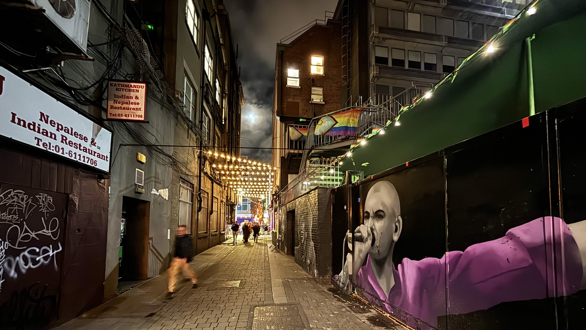
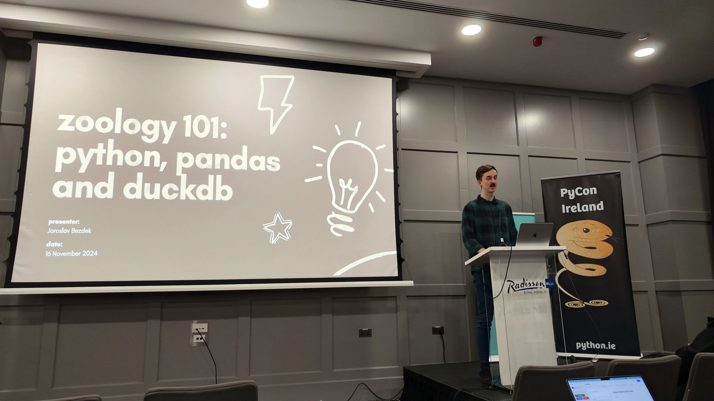
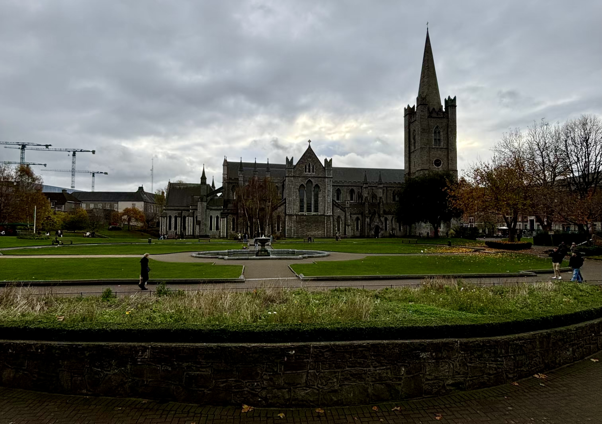
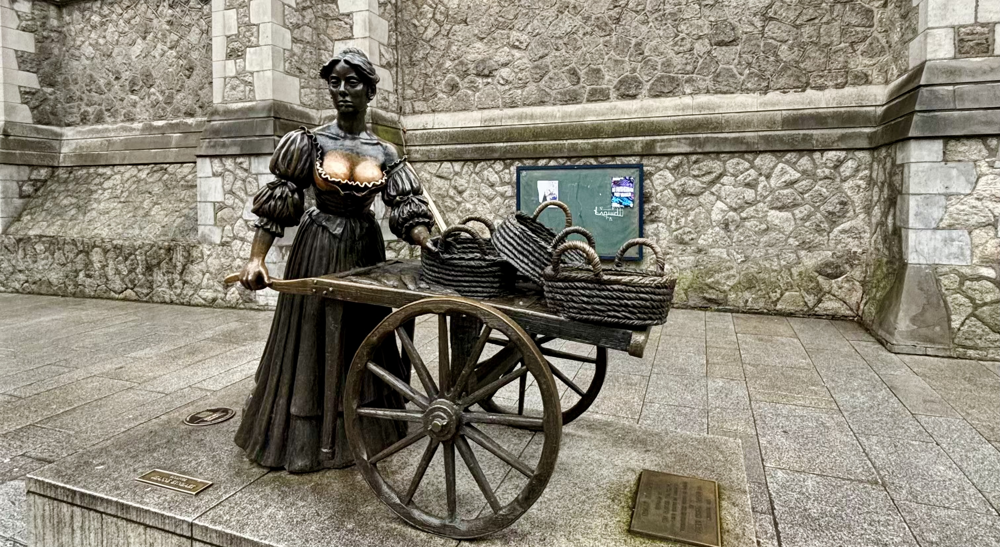

&nbsp;

Když jsem se na začátku roku vrátil z [konference v Namibii](traveling_2024_Namibie.html),
byl jsem z ní tak nadšený, že jsem prakticky hned jsem začal vymýšlet, kam bych mohl jet příště.
Bylo mi ale jasné, že nemůžu být všude. Navíc jsem cítil, že se s cestami po světě musím trošku
krotit, abych doma nevytvářel zbytečné dusno. S Klárou jsme se proto domluvili, že absolvuji max.
dvě konference ročně, jednu evropskou a jednu mimoevropskou. A protože tu mimoevropskou jsem si
tento rok už vyčerpal, začal jsem přihlašovat své talky na evropské konference zaměřené
na programovací jazyk Python, neboli [PyCony](https://pycon.org/).

Po několika měsících mi napsali organizátoři [francouzského PyConu](https://www.pycon.fr/),
že přijímají jeden z mých talků. Velké nadšení ale brzy vytřídala velká frustrace. Zjistil
jsem totiž, že konference bude probíhat v týdnu, kdy bychom se
měli [vracet z Islandu](traveling_2024_Island.html) a navíc proběhne
ve [Štrasburku](https://cs.wikipedia.org/wiki/%C5%A0trasburk), kam nic nelétá.
To by tím pádem znamenalo, že bych se [vrátil z Islandu](traveling_2024_Island.html), doma se moc dlouho
neohřál a už se musel vydat na další cestu. Konkrétně bych se musel dostat
do [Vídně](https://cs.wikipedia.org/wiki/V%C3%ADde%C5%88), z ní letět
do [Frankfurtu](https://cs.wikipedia.org/wiki/Frankfurt_nad_Mohanem) a tam
přestoupit na autobus, který by mě převezl přes hranice
do [Francie](https://cs.wikipedia.org/wiki/Francie). Když jsem zjistil,
kolik by tahle sranda stála a kolik času bych cestováním ztratil, nějaké přednášení na konferenci
se mi přestalo jevit jako nejlepší nápad. Na druhou stranu mým hlavním argumentem, proč na konferenci
vůbec jet, bylo, že bych rád pokračoval v budování své osobní značky a zároveň dělal něco prospěšného
pro Pythoní komunitu, která mi v minulosti tolik dala. I proto jsem se po několika dnech rozhodl,
že na konferenci pojedu. Když jsem ale jednoho pozdního večera otevřel počítat a už
se chystal potvrdit svoji účast na [francouzském PyConu](https://www.pycon.fr/), přišel mi email
z [Irska](https://cs.wikipedia.org/wiki/Irsko). Organizátoři [tamního PyConu](https://python.ie/)
totiž přijali můj druhý talk! Konference měla proběhnout v listopadu, asi tři týdny
[po našem návratu z Islandu](traveling_2024_Island.html) a navíc
do [Dublinu](https://cs.wikipedia.org/wiki/Dublin) létá [Ryanair](https://www.ryanair.com/cz/cs)
přímým letem z [Prahy](https://cs.wikipedia.org/wiki/Praha) za pár stovek. V tu chvíli nebylo
co řešit. Francouzům jsem se omluvil a naopak potvrdil účast
v [Dublinu](https://cs.wikipedia.org/wiki/Dublin).

A protože Kláře se do [Irska](https://cs.wikipedia.org/wiki/Irsko) druhý rok po sobě nechtělo,
zeptal jsem se Adama, zda by se ke mně na cestu nechtěl přidat. Ještě před tím, než jsem otázku
položil, bylo mi jasné, že jakožto největší milovník
[Irska](https://cs.wikipedia.org/wiki/Irsko), kterého znám, neodmítne. A taky, že ne! 👍

&nbsp;

#### DEN 0

Cesta do [Irska](https://cs.wikipedia.org/wiki/Irsko) začala na brněnském nádraží, kde jsme měli
s Adamem sraz. Krátce po 18. hodině jsme nastoupili do vlaku společnosti
[RegioJet](https://regiojet.cz/) a absolvovali poklidnou cestu
do [Prahy](https://cs.wikipedia.org/wiki/Praha). V hlavním městě jsme se ubytovali v mém oblíbeném
hotelu na [Karlíně](https://cs.wikipedia.org/wiki/Karl%C3%ADn), já si vyzkoušel svůj talk
na konferenci a kolem 23. hodiny jsme šli spát.

&nbsp;

#### DEN 1

Po snídani na hotelu jsme si objednali [Uber](https://www.uber.com/cz/cs/) a přesunuli se na letiště.

Když jsme dorazili do odletové haly a já uviděl frontu na pasovou kontrolu, trošku ve mě hrklo.
Na pasovou kontrolu jsem totiž v [Praze](https://cs.wikipedia.org/wiki/Praha) nikdy nečekal, ale
tentokrát tam stál nekonečný zástup lidí, který se táhl jako had z jedné strany haly až na druhou.
Navíc se mi zdálo, že se řada vůbec nehýbe. Nástupní brána do letadla se nám měla zavřít za hodinu
a já si říkal, že to nemůžeme stihnout. Po chvíli jsem ale zjistil, že fronty jsou dvě. Jedna se
hýbe, druhá ne. Stoupli jsme si proto do té správné a po chvilce jsme už měli zkontrované občanky
a vesele pokračovali k naší bráně.

Let jsem strávil přípravou přednášky.

Po příletu jsme si dali oběd na [dublinském letišti](https://cs.wikipedia.org/wiki/Leti%C5%A1t%C4%9B_Dublin)
a poté absolvovali nekonečnou cestu
žlutozeleným [doubledeckerem](https://cs.wikipedia.org/wiki/Patrov%C3%BD_autobus) do centra města.
Vystoupili jsme u [Dublinské jehly](https://cs.wikipedia.org/wiki/Spire_of_Dublin)
na [O'Connell Street](https://en.wikipedia.org/wiki/O%27Connell_Street) a poté se prošli pěší zónu
plnou obchodů, až jsme dorazili na náš hotel.

Když jsme se ubytovali, otevřel jsem počítal, udělal poslední úpravy mojí prezentace a znovu si
nahlas řekl celý talk. Když jsem s přípravou skončil, vyrazili jsme do města. Postupně jsme se zastavili
u [katedrály Nejsvětější Trojice](https://cs.wikipedia.org/wiki/Katedr%C3%A1la_Nejsv%C4%9Bt%C4%9Bj%C5%A1%C3%AD_Trojice_(Dublin))
a [dublinského hradu](https://dublincastle.ie/) a poté pokračovali na jídlo
do [čtvrti Temple Bar](https://en.wikipedia.org/wiki/Temple_Bar,_Dublin).
V restauraci [The Old Mill](https://oldmillrestaurant.ie/) sice nevařili úplně nejlépe, ale více
než jídlo mi vadil přístup obsluhy, která nás začala nenápadně vyhazovat ve chvíli, kdy viděla,
že už jsme dojedli a nebudeme si objednávat nic dalšího.

Ze čtvrti plné restaurací, barů a pochybných existencí jsme zamířili
na [O’Connell Bridge](https://en.wikipedia.org/wiki/O%27Connell_Bridge). Po něm
jsme přešli řeku [Liffey](https://cs.wikipedia.org/wiki/Liffey) na její severní břeh a po dřevené
náplavce se vrátili zpět na hotel.

Večer jsme si ještě jednou projel prezentaci a šel si brzo lehnout, abych byl na druhý den fresh.

&nbsp;

#### DEN 2

Ráno jsme vstali kolem 7. hodiny a zašli si na snídani. Adam mě potom doprovodil na místo konference
a sám se vydal na cca 30 km dlouhý trek na [poloostrov Howth](https://www.cestujlevne.com/pruvodce/irsko/dublin/howth).

V [hotelu Radisson Blu](https://www.booking.com/hotel/ie/radisson-sas-royal-dublin.cs.html), kde
měla konference proběhnout, jsem našel stánek s registrací, ukázal pořadatelům vstupenku a šel jsem
si najít svoji přednáškovou místnost č. 3. Na řadu jsem měl jít hned jako první v 9:15. Když jsem
přišel do prázdné posluchárny, bylo krátce po 8:30. Sedl jsem si tedy do první řady a čekal
na technika, který by mi pomohl se  zprovozněním prezentace. U přednáškového pultíku byl totiž
připraven pouze HDMI kabel, pro který nemám ve svém počítači vstup a já potřeboval, aby mi někdo
dal redukci.

Když bylo 9 hodin a technik stále nikde, začal jsem být malinko nervózní. Šel jsem proto
do vedlejší posluchárny č. 2 a zeptal se *tamního* technika, zda by mi mohl pomoct. Ten mi řekl,
že moje posluchárna má vlastního technika, který určitě dorazí a pomůže mi. Vrátil jsem se tedy
na svoje místo a čekal dál. Když bylo 9:10, do posluchárny začali chodit lidi. Po technikovi
ani vidu ani slechu. Šel jsem proto zpět do "dvojky" a zkusil poprosit o pomoc znovu svého starého
přítele, který mě před pár minutami odmítl. Ten se otráveně podíval na hodinky a pochopil, že už se
mě asi nezbaví. Když jsme přišli do mojí posluchárny, byl tam už můj technik, který si mě rovnou
převzal. Ten mi během několika okamžiků sehnal redukci a pomohl spustit prezentaci. V tu chvíli
bylo 9:13.

Přestože prezentace byla ready, já byl ready, technik a kameraman v jedné osobně byli ready, tak
jeden článek naší skládačky nám pořád chyběl, a to pořadatel, který by mě uvedl, jak se to
na konferencích obvykle dělá. Postarší technik, se kterým jsme v tu chvíli byli už nejlepší kámoši,
mi řekl, ať se toho nebojím a pokud se nikdo neukáže, ať se uvedu sám a začnu. Počkal jsem tedy
do 9:16 a šel na věc.

Chvíli po tom, co jsem začal mluvit, se rozrazily dveře a do posluchárny přišla zmatená
organizátorka s mikrofonem v ruce, která mě očividně měla uvést. To mě trošku rozhodilo.
Jinak si ale myslím, že jsem svůj talk na téma
"[Zoology 101: python, pandas and duckdb](https://github.com/jardabezdek/talk-zoology-101/blob/master/slides/zoology_101_pycon_ireland.pdf)"
zvládl velice dobře. Posluchárna byla zaplněná skoro do posledního místa, paní organizátorka mi řekla,
že takový zájem o téma společně s ostatními organizátory nečekali a po skončení přednášky za mnou
přišlo i několik dalších lidí, kteří mi položili doplňující otázky a chtěli se o tématu dozvědět víc.
Moc mě také potěšilo, když mi jedna studentka z [Indie](https://cs.wikipedia.org/wiki/Indie) řekla,
že poslední slide, na kterém jsem porovnával dvě pythoní knihovny pomocí emotikonů a příkladů
ze světa zvířat, jí přišel "crazy"! 😁

&nbsp;

*Bla bla bla...*

&nbsp;

Po mém talku ze mě spadl stres a zbytek dopoledne jsem si tím pádem v klidu užil
na následujících přednáškách ostatních Pythonistů:

- Build a RAG to Brag About ([Natan Mish](https://www.linkedin.com/in/natan-mish/))
- Building Scalable AI multi-agent collaboration with Langchain, Langgraph, Crew.AI, and RAG
([Mihai Criveti](https://www.linkedin.com/in/crivetimihai/))
- Testable data pipelines - Lessons learned from writing modular SQL and Python models with DBT
([Florian Stefan](https://www.linkedin.com/in/florian-stefan-90553a109/))
- Build a Powerful Autonomous Assistant with AI ([Mark Smith](https://www.linkedin.com/in/judy2k/))
- Pythonising Government AI (Michael Dowling)

Na obědě jsem si povídal s Johnem Gillem z Kanady o jeho knihovnách
[gotu](https://github.com/swfiua/gotu) a [blume](https://github.com/swfiua/blume). Před odpoledním
programem jsem ještě stihl projít stánky sponzorujících firem, jejichž zástupci primárně přišli
na konferenci nahirovat nové lidi.

Odpoledne jsem si poslechl tyto talky:

- Leveraging GitHub Ecosystem for Python Projects: From Hello World to Docker Deployment
([Tom Halpin](https://www.linkedin.com/in/tom-halpin-3384a312), [Eoin Halpin](https://www.linkedin.com/in/eoin-halpin-62268b19b/))
- How to not Screw Up a Python Based Product Startup ([John Curry](https://www.linkedin.com/in/john-curry-b4750015))
- Designing modular services with a practical example in AI/ML model deployment ([Florenz Hollebrandse](https://github.com/faph))
- Quantifying uncertainty with stochastic and machine learning models (Juan Castillo del Río)
- hodně zábavné lightning talks; ty nejlepší byly o [pre-commit hooks](https://pre-commit.com/),
[válečné lodi Vasa](https://cs.wikipedia.org/wiki/Vasa), nebo
o budoucnosti s AI.

V průběhu dne jsem se seznámil s Davidem z [Bratislavy](https://cs.wikipedia.org/wiki/Bratislava).
Po skončení konference jsme se zakecali a potom spolu ještě chvíli šli směrem na náš hotel.
Když jsme se kousek od mého cíle loučili, vyměnili jsme si čísla a řekli si, že pokud se budeme
cítit, zajdeme večer ještě na pivo. Po návratu na hotel jsem se nicméně potkal s Adamem, společně
jsme zašli na jídlo do skvělé restaurace [The Legal Eagle](https://www.thelegaleagle.ie/) a já byl
potom tak unavený, že jít ještě na pivo bylo to poslední, co se mi chtělo. Davidovi jsem se proto
omluvil a šel na kutě. 💤

&nbsp;

#### DEN 3

Adam už před cestou do [Dublinu](https://cs.wikipedia.org/wiki/Dublin) avizoval, že by rád
navštívil dvě největší katedrály ve městě:
[katedrálu sv. Patrika](https://cs.wikipedia.org/wiki/Katedr%C3%A1la_svat%C3%A9ho_Patrika_(Dublin))
a [katedrálu Nejsvětější Trojice](https://cs.wikipedia.org/wiki/Katedr%C3%A1la_Nejsv%C4%9Bt%C4%9Bj%C5%A1%C3%AD_Trojice_(Dublin)).
A protože jsme jeli do [Dublinu](https://cs.wikipedia.org/wiki/Dublin) na prodloužený víkend,
rozhodli jsme se, že spojíme příjemné s užitečným - v neděli společně zajdeme na mši do jednoho
z kostelů, čímž si splníme svoji křesťanskou povinnost a zároveň se podíváme do jednoho z kostelů,
aniž bychom museli platit vstupné.

A tak jsme v neděli ráno vstali, zašli si na snídani a následně se vydali na mši do
[katedrály sv. Patrika](https://cs.wikipedia.org/wiki/Katedr%C3%A1la_svat%C3%A9ho_Patrika_(Dublin)),
největšího kostela v [Irsku](https://cs.wikipedia.org/wiki/Irsko). Bohoslužba mi přišla hodně
odlišná od toho, na co jsme zvyklí u nás. Kněz stál po většinu času zády k lidem, četl se jen jeden
úryvek z bible a přijímání bylo pod obojí. Ještě před odjezdem
do [Irska](https://cs.wikipedia.org/wiki/Irsko) jsem si ale zjištoval, zda se skutečně jedná
o římskokatolický kostel a našel jsem, že ano. Přestože mi tedy průběh bohoslužby přišel zvláštní,
byl jsem pořád v klidu. Až další den při cestě domů mě Adam upozornil, že jsem se spletl. Nejedná
se totiž o římskokatolický kostel, jak jsem si původně myslel, ale o anglikánský! Tím pádem bylo vše
jasné! Jediné, co mi nebylo jasné, je to, jak jsem se mohl splést! Možná jsem ve spěchu nestudoval,
o které "katedrále sv. Patrika" si zjišťuji informace. Na světě totiž existuje ještě jedna hodně
významná katedrála se stejným jménem, a to
[ta v New Yorku](https://cs.wikipedia.org/wiki/Katedr%C3%A1la_svat%C3%A9ho_Patrika_(New_York)),
která už římskokatolickým kostelem skutečně je!

&nbsp;

*Katedrála sv. Patrika, kam jsme šli na nedělní mši.*

&nbsp;

Po bohoslužbě a prohlídce katedrály jsem se vrátil na konferenci, kde jsem absolvoval dva workshopy
na téma [RAG](https://en.wikipedia.org/wiki/Retrieval-augmented_generation) a zašel na skromný oběd.

Dopoledne mi nebylo úplně dobře a oběd tomu moc nepřidal. Proto jsem se rozhodl, že vynechám
odpolední program, který stejně zahrnoval už jen jeden workshop, a půjdu místo něj na hotel.
A myslím, že to byla dobrá volba. Na pokoji jsem asi na hodinu usnul a vrátil se tím zpět do hry!

Kolem 15. hodiny jsme se s Adamem sbalili a šli
do [Guinness Storehouse](https://www.guinness-storehouse.com/en/home), kde jsme absolvovali
prohlídku věnovanou výrobě, skladování a konzumaci
[piva Guinness](https://cs.wikipedia.org/wiki/Guinness). K mému překvapení jsme celý sklad
prošli velice rychle. Ve střešním baru jsme si potom dali jedno pivo a kolem 18. hodiny jsme
byli už zpět v centru na večeři.

&nbsp;

*Adam, já a velké logo značky [Guinness](https://cs.wikipedia.org/wiki/Guinness)
ve vstupní hale [Guinness Storehouse](https://www.guinness-storehouse.com/en/home).*

&nbsp;

Na jídlo jsme nejdříve chtěli zajít do [steakhousu F.X. Buckley](https://www.thebuckleycollection.ie/),
který nám předchozí den doporučil číšník v [The Legal Eagle](https://www.thelegaleagle.ie/).
Protože v podniku ale bylo plno, zašli jsme na večeři do sesterské restaurace
[The Bull and Castle](https://www.thebuckleycollection.ie/bull-castle-steakhouse), kde jsme si dali
velice průměrný burger a hranolky.

Po jídle jsme zašli na hotel, chvíli poseděli v hotelové restauraci a potom už se přesunuli
na pokoj, kde jsme přepínali televizi mezi vědomostní soutěží
[The Chase](https://en.wikipedia.org/wiki/The_Chase_(British_game_show)) (anglická verze pořadu
[Na lovu](https://www.csfd.cz/film/1064208-na-lovu/prehled/)) a reality show
[I'm a Celebrity...Get Me Out of Here!](https://en.wikipedia.org/wiki/I%27m_a_Celebrity...Get_Me_Out_of_Here!_(British_TV_series))

&nbsp;

#### DEN 4

Poslední den v [Dublinu](https://cs.wikipedia.org/wiki/Dublin) jsme nikam nemuseli spěchat.
Jediným bodem našeho programu byla totiž komentovaná prohlídka
[dublinského hradu](https://dublincastle.ie/), která začínala až v 10 hodin. V rámci hodinové
prohlídky jsme se podívali do [podzemích prostor](https://dublincastle.ie/viking-excavation/)
pod hradem, [gotické kaple](https://dublincastle.ie/the-chapel-royal/)
a [obytné části hradu](https://dublincastle.ie/the-state-apartments/).

Po velice nezáživné prohlídce, kterou bych už příště neabsolvoval, jsme se ještě naposledy prošli
centrem města a poté zamířili na [O'Connell Street](https://en.wikipedia.org/wiki/O%27Connell_Street).
Tam jsme přes [městký portál](https://www.portals.org/portal/dublin) zamávali náhodným kolemjdoucím
v [Lublinu](https://cs.wikipedia.org/wiki/Lublin) a [Vilniusu](https://cs.wikipedia.org/wiki/Vilnius)
a následně nastoupili do autobusu, který nás odvezl
na [dublinské letiště](https://cs.wikipedia.org/wiki/Leti%C5%A1t%C4%9B_Dublin).

&nbsp;

*Při procházce centrem jsme se zastavili
i u sochy [Molly Malone](https://en.wikipedia.org/wiki/Molly_Malone).*

&nbsp;

Tam jsme prošli bezpečnostní kontrolou, dali si oběd v letištní restauraci a odletěli
do [Prahy](https://cs.wikipedia.org/wiki/Praha). Když jsem vystoupil z letadla, zjistil jsem, že let
s námi absolvoval i [pan Veselovský](https://cs.wikipedia.org/wiki/Martin_Veselovsk%C3%BD), neboli
"V" z [DVTV](https://cs.wikipedia.org/wiki/DVTV).

Následovala klidná cesta [Uberem](https://www.uber.com/cz/cs/) na hlavní nádraží a potom cesta
vlakem do Brna, kam jsme dorazili až krátce před 23. hodinou.

&nbsp;

#### DOJMY Z DUBLINU

**Not again...** Už v [minulém článku z Irska](traveling_2023_Irsko.html) jsem psal, že irská města
nejsou úplně můj šálek kávy. A můj názor se nezměnil ani teď. Kombinace pochmurného počasí,
omšelých domů a mnoha lidí na jednom místě na mě působí hrozně depresivně. I to je důvod, proč
necítím potřebu se do země v nejbližších letech znovu vracet. 🛑

**Čeká mě další konference?** Když se zpětně zamýšlím nad [irským PyConem](https://python.ie/),
mám pocit, že se jednalo o konferenci, ze které jsem byl zatím nejvíc ve stresu. Možná to bylo
nekvalitní domácí přípravou, možná tím, že se jednalo o mojí první evropskou konferenci mimo
domácí scénu, nebo možná tím, že to byla moje první konference, kde jsem měl mluvit v angličtině
před lidmi, pro které je angličtina rodným jazykem. Jak vidíte, těch důvodů, proč by se můj talk
měl pokazit, mě před odletem napadlo opravdu hodně. Byly i chvíle, kdy jsem si říkal, že tohle je
naposledy, co někam jedu a že příště už se na něco takového můžu vykašlat. Nakonec ale všecho
dopadlo dobře, lidé v sále reagovali pozitivně a já byl nakonec opravdu moc rád, že jsem překonal
svůj strach a jel! A koneckonců přednášení na konferenci je mnohem víc, než jeden talk nějakého
Jardy z Brna. Je to příležitost se seznámit s místními, naučit se něco nového a podívat se do míst,
kde jsem ještě nebyl. I proto si říkám, že bych i příští rok měl splnit svoji kvótu a vyrazit na
jednu evropskou a jednu mimoevropskou konferenci! A kam to bude? Protože jsem tento rok nebyl
v Asii, přemýšlím, že bych příští rok zkusil přihlásit svůj talk na [PyCon APAC](https://pycon.asia/),
který se uskuteční v [Manile](https://cs.wikipedia.org/wiki/Manila). A co se týče té evropské
konference, z mnoha stran jsem slyšel skvělé ohlasy na [Vilnius](https://cs.wikipedia.org/wiki/Vilnius)
a [litevský PyCon](https://pycon.lt/). Tam je ale podle mě hodně těžké se dostat, takže uvidíme,
kam mě osud zavane. 💨

&nbsp;

#### FOTKY

Fotky z cesty do [Dublinu](https://cs.wikipedia.org/wiki/Dublin)
najdete [zde](https://photos.app.goo.gl/wjEDVhGPgTVfJa7k6).

---

[blog](../index.html)

- [seznam článků](content.html)
