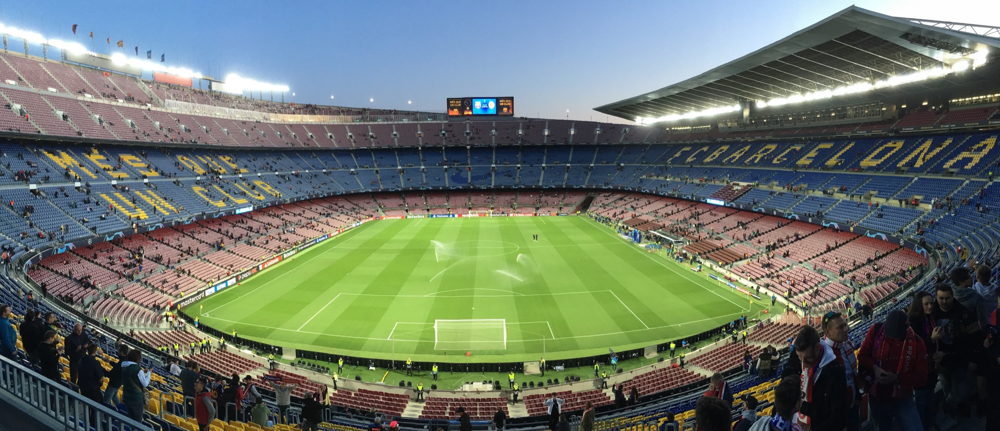

&nbsp;

#### DEN 1

Cesta do Barcelony začala pro mě dost krušným vstáváním v čase 1:55. Budík mě -
nutno dodat s Klářinou pomocí - vzbudil, a já si tak mohl dobalit poslední věci
a ve 2:10 nasednout do taxíku, který mě odvezl ke Grandhotelu na Benešově třídě,
kde jsme s [Kubou](https://abload.de/img/2ulu4kzj.png?fbclid=IwAR3R3DEP6xM_3oPI0404xos9xQmZX_sMtNy_pskfZgY-njSu45so43dWPik)
nasedli do žlutého autobusu a ve 2:30 vyrazili směr vídeňské letiště.

Plán byl takový, že se v autobuse trošku prospíme. Bohužel kolem nás sedělo několik
lidí, nebo spíš bezmozků, kteří spát nechtěli a nedopřáli to ani ostatním.
Zvláště rád bych vzpomněl mladého pána ve věku kolem 25 let, který měl
[zářivě modrý dětský batůžek](https://potreby-kancelarske.eu/batoh-me-to-you-motylci-modry~velky.jpg)
a když se snažil sklopit sedadlo do vodorovné polohy, využíval k tomu opěrku rukou.

Na letišti ve Vídni jsme si vyzvedli palubní vstupenky a s menšími komplikacemi
jsme prošli bezpečnostní kontrolou. Uvádím *s menšími komplikacemi*, protože
až na letišti jsem si uvědomil, že mám v batohu kapesní nožík, který jsem před
několika měsíci vyhrál v soutěži organizované serverem [pojisteni.cz](https://www.pojisteni.cz/).
Kapesní nůž byl samozřejmě odhalen při skenu příručních zavazadel, takže mě
zaměstnanec letiště požádal, abych otevřel batoh a on do něj mohl nahlédnout. Na tváři
člověka s asijskými kořeny bylo vidět, že se těší, až mi nůž vezme a připraví mě
tak o jednu z mála věcí, kterou jsem kdy v životě vyhrál. Naštěstí pro mě
měří čepel mého kapesního nože přesně 6 cm, což je maximální povolená délka nože,
který je možno si vzít s sebou na palubu letadla. Asi nemusím zmiňovat, jak byl
pán po tomto zjištění zklamaný :-)

Na letišti jsme si poté na nějakou dobu sedli a povídali si. Kuba u toho snědl banán, který
měl z domu, a pořád mi nabízel druhý s tím, že ten je pro mě. Nějak jsem ale v pět
hodin ráno neměl chuť k jídlu, takže jsem zdvořile odmítl. Přibližně hodinu před
odletem jsme zašli na snídani - ano, pro Kubu se jednalo o jeho druhou snídani.
Já jsem si koupil bagetku se sýrem, Kuba čokoládový croissant. Zelený čaj jsme dali napůl.

Let po snídani uběhl jako voda. V 6:55 jsme odlétali z Vídně a po 2,5 hodinách
jsme přistáli na letišti [El Prat](https://cs.wikipedia.org/wiki/Leti%C5%A1t%C4%9B_Barcelona-El_Prat)
v Barceloně, jak bylo v plánu. Na letišti jsme na chvíli sedli do místního baru a
osvěžili se miskou ovoce, kterou jsme, jak jinak, dali napůl :-)

Potom jsme nasedli na autobus a nechali se zavést na
[Plaça de Catalunya](https://en.wikipedia.org/wiki/Pla%C3%A7a_de_Catalunya), kde
začínala naše malá dopolední [procházka](https://www.strava.com/activities/2842718115).
Prošli jsme ulicí [La Rambla](https://en.wikipedia.org/wiki/La_Rambla,_Barcelona) až
k [památníku Kryštofa Kolumba](https://en.wikipedia.org/wiki/Columbus_Monument,_Barcelona),
odkud jsme potom pokračovali podél moře na pláž Barceloneta. Na jejím konci jsme
zahnuli do centra a šli směrem k
[chrámu Sagrada Família](https://cs.wikipedia.org/wiki/Sagrada_Fam%C3%ADlia).
Než jsme k němu ale došli, nasedli jsme na zastávce
[Marina](https://en.wikipedia.org/wiki/Marina_station) na metro a jeli se ubytovat
do našeho [hotelu](https://apartamentos-dv.hotelbcn-barcelona.com/en/#rooms).

Po check-inu, který jsme udělali kolem 14:30, jsme se šli konečně naobědvat, konkrétně
do podniku s názvem [Café de Galiza](https://www.tripadvisor.cz/Restaurant_Review-g187497-d12288451-Reviews-Cafe_de_Galiza_Restaurant_Bar-Barcelona_Catalonia.html).
Zde jsme si dali tříchodové menu v tomto pořadí:

- [arroz negro](https://cs.wikipedia.org/wiki/Arr%C3%B2s_negre) - jídlo podobné
jako [paella](https://cs.wikipedia.org/wiki/Paella), *arroz negro* v překladu
znamená *černá rýže*, jedná se však o klasickou bílou řýži, která je do černa
pouze zbarvená rozvařenými sépiemi, či krakaticemi, jídlo se v našem případě
podávalo s černekovou pomazánkou bez sýra a bagetkou;
- chuletas de pavo con fritas - Kuba si dal na druhý chod chobotnice, ale já jsem
byl pořád nerozhodný; potom mi Kuba řekl, že pokud chci jistotu, mám si dát
chuletas de pavo, tak jsem si dal chuletas de pavo - dostal jsem šťavnatý krůtí
steak s hranolkama, který byl opravdu moc dobrý;
- pudink [flan](https://en.wikipedia.org/wiki/Flan) - sladkou tečku tvořil pudink
s karamelovým přelivem a šlehačkou, ke kterému jsme popíjeli ještě
[kávu](https://cs.wikipedia.org/wiki/K%C3%A1va).

Po obědě, na kterém jsme strávili minimálně hodinu a půl, jsme se přesunuli zpět
do hotelu, osprchovali se a vyrazili pomalu na stadion [Camp Nou](https://cs.wikipedia.org/wiki/Camp_Nou).
Před stadionem bylo celkem dost různého vyžití - mohli jsme si koupit suvenýry
v oficiálním obchodě FC Barcelona, mohli jsme si kopnout tři penalty na
elektronického [Marca-Andrého ter Stegena](https://cs.wikipedia.org/wiki/Marc-Andr%C3%A9_ter_Stegen),
který byl pro malé klučíky zkoušející štěstí naprosto nepřekonatelný, nebo jsme
si mohli popovídat s jedním z aktivistů o politické situaci. Sice nás nic z toho
nelákalo, ale kdyby tam bylo méně lidí, ta možnost by tam byla. Hodinu před
začátkem zápasu jsme se tedy rozhodli, že půjdeme na stadion a najdeme naše místa.

Celou dobu nás s Kubou štvalo, že nebudeme sedět vedle sebe. Sice jsme měli
sedět ve stejné řadě, ale Kuba měl sedět na sedadle č. 15 a já na sedadle č. 17.
Když jsme ale přišli na místa, byli jsme překvapeni, že vedle sebe sedíme. Do teď
to nechápu, ale sedadla byla prostě číslovaná pouze lichými čísly. Číslování ale
není tak důležité. To podstatné je, že po příchodu na stadion jsme si doslova
sedli na zadek. Camp Nou je obrovský, ale přitom moderní stadion, který
se mi opravdu moc líbil. Před výkopem jsme si proto udělali ještě několik fotek.

S blížícím se začátkem zápasu se pomalu snižovala i venkovní teplota, takže jsem
začal přemýšlet, zda si ještě nezajdu koupit dvoubarevnou šálu s logem obou klubů.
Nakonec jsem to ale vydržel a koupil radši pro sebe a pro Kubu pivo, abychom měli
v průběhu prvního poločasu něco na pití.

[Zápas](https://www.slavia.cz/zapas.asp?id=Po-heroickem-vykonu-vezeme-z-Nou-Campu-bod-3607)
mezi FC Barcelona a SK Slavií Praha popisovat nebudu. Reportů existuje na internetu dost.
Jen bych rád řekl, že jsem si to užil. I když jsme neviděli žádný regulerní gól,
atmosféra na stadionu byla úžasná. Na začátku mě naprosto mrazilo, když hráči
přicházeli na plochu za zvuku hymny Ligy mistrů, v průběhu zápasu mě zase bavilo
sledovat, jak Kuba prožívá každou situaci úplně stejně jako Katalánci sedící vedle
nás, a na konec jsem cítil obrovskou vděčnost za to, že jsem Čech a že jsem mohl
sledovat historický úspěch českého fotbalu na evropské scéně.

Po zápase, který skončil neobvykle před 21. hodinou, jsme se vrátili zpět na hotel,
umyli se a ještě chvíli sledovali šílený [zápas](https://www.chelsea-fc.cz/12206-chelsea-4-4-ajax)
mezi Chelsea FC a Ajaxem Amsterodam, který nám na dálku streamoval
[Adam Zouhar](https://www.linkedin.com/in/zouharadam/?originalSubdomain=cz).
Tímto bych mu rád poděkoval za jeho služby :-)

&nbsp;

#### DEN 2

Plán na druhý den byl jasný - dostat se domů. Kvůli pozdnímu nákupu letenek se
nejednalo o úplně nejpříjemnější variantu cesty z Barcelony do Brna, ale zvládli
jsme to. Itinerář druhého dne byl následující:

- 06:15 - budíček,
- 09:25 - odlet z Barcelony,
- 10:15 - přílet do Palma de Mallorca,
- 13:25 - odlet z Palma de Mallorca,
- 15:55 - přílet na letiště do Vídně,
- 18:39 - odjezd vlaku RegioJet z Hbf,
- 20:05 - příjezd vlaku RegioJet do Brna.

Ještě jednou děkuji Kubovi, že se mnou celou cestu absolvoval a založil mě, když
jsem potřeboval cash. Vážně jsem si to moc užil a už teď se těším, až zase příště
vyrazíme na další cestu za kvalitním evropským fotbalem :-)

&nbsp;

#### FOTKY

Fotky z Barcelony najdete [zde](https://photos.app.goo.gl/n7AR8iHBaUTsw7RN9).
