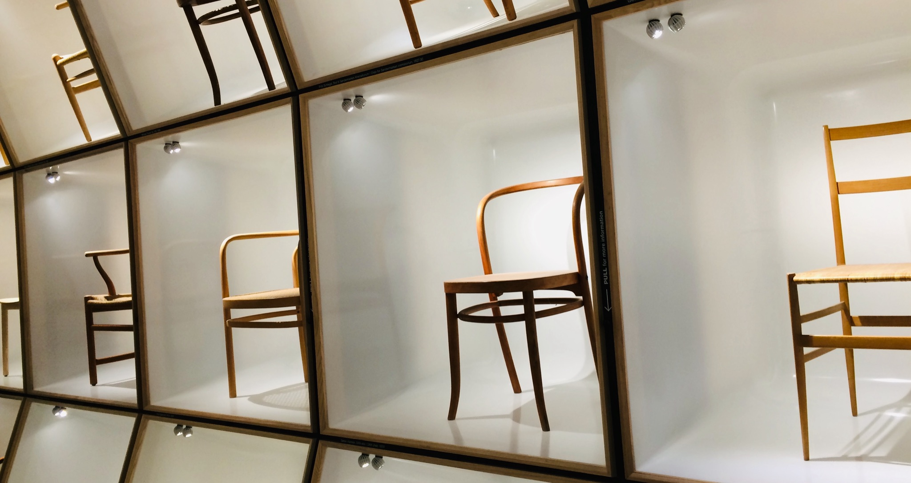

&nbsp;

V průběhu letních prázdnin se Klára pustila do čtení knihy
[Kavárna v Kodani](https://www.databazeknih.cz/knihy/romanticke-uteky-kavarna-v-kodani-393227)
od [Julie Caplin](https://www.databazeknih.cz/zivotopis/julie-caplin-119914),
po jejímž přečtení u&nbsp;nás doma nastalo kodaňské období. V jeho průběhu se
velice často hovořilo o všem, co s Dánskem a jeho hlavním městem souvisí, Klára
se po hlavě vrhla do studia dánštiny na
[DuoLingo](https://cs.wikipedia.org/wiki/Duolingo) a dokonce se začalo velice
intenzivně mluvit o tom, že bychom se jednou mohli do Kodaně přestěhovat
a nějakou dobu tam zkusit žít. Abychom si ale nejdříve vyzkoušeli, zda je Kodaň
pro nás to pravé ořechové, rozhodli jsme se, že koupíme letenky a poletíme se
tam na pár dní podívat. Spojili jsme tedy příjemné s&nbsp;užitečným a v
rámci našeho každoročního předvánočního výletu letěli do hlavního města Dánska.

&nbsp;

#### DEN 0

Jak rychle kodaňské období začalo, tak rychle také skončilo. Na konci září už
tedy o Dánsku nikdo nemluvil, Klára už se neučila dánsky a pokud se skloňoval
pojem nějakého stěhování, jednalo se pouze o stěhování v rámci hlavního města
Moravy.

Přestože kodaňské období skončilo, letenky zakoupené na konci srpna nám zůstaly.
Takže jsme se 14. prosince ráno sbalili a v 11 hodin vyrazili žlutým autobusem
do Prahy. Na Florenci jsme zašli na záchod, koupili jízdenky na metro a frčeli
na letiště, kde jsme si dali menší ochutnávku Dánska - zašli jsme do kavárny
na *extrémně* drahou kávu a zákusek.

V 16:40 odlétalo letadlo z Prahy. Let trval necelou hodinu a půl. Vedle nás seděl
pán, který se svým synem cestoval do Helsingborgu, aby se podíval na zápas svého
šestnáctiletého vnuka, který se polde jeho slov 'vydal na dráhu hokeje'. Pány tedy
po přistání v Kodani čekala ještě asi hodinová cesta vlakem do Švédska. Nás už
čekaly jen dvě věci:

- zakoupení [Copenhagen Card](https://copenhagencard.com/) - průkazky, se kterou
jsme mohli jezdit po Kodani, jak se na nám zlíbilo a zároveň jsme měli zdarma vstupy
do vybraných turistických atrakcí,
- desetiminutový přesun na [hotel](http://cphstudiohotel.dk/).

Po příjezdu na hotel jsme si vybalili věci, při čemž nás dost překvapilo řešení
místní koupelny. Na 1 m2 se náchazela toaleta, mini umyvadlo a sprcha.
Sprchu tvořila jen sprchová hadice a závěs připevněný na strop, žádné kachličky
na zdi, ždáný sprchový kout. Prostě nic! Pokud se tedy člověk sprchoval, voda
tekla na zemi pod záchod a stříkala na zdi ve "sprše". Když se potom člověk
dosprchoval, stála na zemi štěrka na sklo, kterou bylo možné setřít vodu ze země,
aby podlaha rychle uschla. Toto řešení bylo sice typicky dánsky minimalistické,
ale fungovalo. To ale nemění nic na tom, že na sprchu jsem se nikdy v rámci našeho
pobytu netěšil.

Po vybalení věcí jsme zašli do hotelové restaurace na jídlo. Já jsem si dal
hamburger za 100 DKK, Klára si  za stejnou cenu objednala nachos. Když jsem si
uvědomil, kolik jsme za jídlo dali peněz, dojem z jinak velice dobrého jídla
se troku zhoršil. Holt se ale nedá nic dělat. To je Dánsko :-)

&nbsp;

#### DEN 1

První den našeho pobytu byl značně ovlivněn počasím. Podle předpovědi mělo v průběhu
celého dne pršet, takže jsme se snažili naplánovat program tak, abychom byli
co nejméně vystaveni dešti.

Po snídani jsme se tedy vydali na
<a name="rosenborg">[zámek Rosenborg](https://cs.wikipedia.org/wiki/Rosenborg)</a>,
který v minulosti sloužil jako sídlo dánského krále. Dnes jsou ve sklepení zámku
vystaveny dánské korunovační klenoty. Kromě nich se na zámku nachází i královský
trůn. Ten hlídají sochy tří lvů, kteří se nacházejí i ve
[státním znaku Dánska](https://cs.wikipedia.org/wiki/St%C3%A1tn%C3%AD_znak_D%C3%A1nska).
Zámek, který je je z jedné strany obklopen úzkým vodním příkopem, vypadá velice
hezky. Uvnitř nás ale moc nezaujal. Všechny místnosti totiž byly dost tmavé,
takže působily ponuře a smutně.

Kolem zámku, který se nachází v blízkosti centra města, se rozprostírají královské
zahrady, které jsme ale vlivem špatného počasí jen proběhli. Asi 500 metrů od zámku
se nachází [Rundetaarn](https://cs.wikipedia.org/wiki/Rundetaarn), která byla
v 17. století vybudována jako astronomická observatoř. Dnes ji ale turisté navštěvují
hlavně kvůli její spirálovité cestě nahoru a vyhlídce na město. Jak už jsem říkal,
neměli jsme moc štěstí na počasí, takže my jsme si vyhlídku moc neužili - když
jsme přišli nahoru začalo totiž dost foukat a přšet. Klára si ale užila stání
na skleněném podlaze, která se nachází v horním patře věže a díky které je vidět
skrz celou věž dolů.

Po prohlídce věže jsme se šli najíst do Burger Kingu, jednoho z nejlevnějších
restauračních zařízení v Kodani. U jídla jsme dlouho váhali, co budeme po obědě
dělat. Podle předpovědi nás totiž měla čekat hodina bez deště, po které se mělo
začít stmívat a pršet.

Nakonec jsme se rozhodli, že se projdeme po úzkých uličkách v centru města až k paláci
<a name="christiansborg">[Christiansborg](https://cs.wikipedia.org/wiki/Christiansborg)</a>,
což je bývalý královský palác. Dnes se v budově nachází sídlo dánského parlamentu
a muzea, z nichž jsme jedno navštívili. Jednalo se o prostory, kde se pořádají královské
bankety a kde královská rodina vítá významné zahraniční hosty při mezinárodních
návštěvách.

Mně osobně se palác líbil mnohem více než [Rosenborg](#rosenborg). Myslím si, že
to ale nebylo jen tím, že oproti Rosenborgu je palác větší, světlejší a modernější,
ale i tím, že mě obecně více zajímá novodobá historie, než ta "dávno zapomenutá".
S novodobými dějinami se v paláci člověk setká prakticky na každém rohu, např.
na obrazech členů královské rodiny, které se nacházejí snad v každém druhém pokoji,
přes které prohlídka paláce vede, nebo na moderně zpracovaných gobelínech, které
vyobrazují dánskou historii od Vikingů až po současnost, ty dostala současná
dánská královna [Markéta II.](https://cs.wikipedia.org/wiki/Mark%C3%A9ta_II.)
ke svým padesátým narozeninám.

Po prohlídce paláce jsme si ještě udělali několik fotek budovy bývalé kodaňské burzy
[Borsen](https://en.wikipedia.org/wiki/B%C3%B8rsen), kterou dnes využívá jako své sídlo
[regionální hospodářská komora](https://en.wikipedia.org/wiki/Danish_Chamber_of_Commerce).
Budova je zajímavá díky věži, kterou tvoří do sebe stočené ocasy čtyř draků.

Když zapadlo sluníčko, vydali jsme se po nákupní třídě
[Stroget](https://en.wikipedia.org/wiki/Str%C3%B8get) do nejznámějšího kodaňského
kanálu [Nyhavn](https://en.wikipedia.org/wiki/Nyhavn), který je známý díky
barevným domečkům připomínajícím duhu. Ta sice ve tmě nebyla úplně dobře vidět,
ale na druhou stranu bylo pěkné pozorovat, jak hezky byly osvětleny lodě, které
v kanálu kotvily.

Protože nás už bolely nohy, rozhodli jsme se, že zajdeme do jedné z restaurací
v Nyhavn, kde jsme si objednali jedno z typických dánských jídel - masové kuličky
s dušeným červeným zelím, omáčkou a vařenými brambory. Jako dezert jsme si dali
další typický pokrm, a sice mléčnou rýži s mandlemi a višňovou marmeládou. Oběma
nám moc chutnalo.

Po věčeři si Klára na vánočních trzích koupila nové naušnice ve tvaru
lístečku, které už po zbytek dovolené nesundala. V tu chvíli jsme už měli vše,
a tak nám nic nebránilo vyrazit na hotel a jít spát.

&nbsp;

#### DEN 2

Po vydatné snídani jsme jeli na místo, kde náš včerejší program skončil, tedy do
[Nyhavn](https://en.wikipedia.org/wiki/Nyhavn), odkud jsme vyrazili na vyjížďku
loďkou po kodaňských kanálech. V průběhu cesty jsme projeli kolem těch nejvýznamnějších památek, které je možné z vodních kanálů vidět. Jak jsem již poznamenal, vyjeli jsme z
[Nyhavn](https://en.wikipedia.org/wiki/Nyhavn) a pokračovali k
[budově Opery](https://en.wikipedia.org/wiki/Copenhagen_Opera_House).

Následovala cesta kanálem přes čtvrť
[Svobodné město Christiánie](https://cs.wikipedia.org/wiki/Christi%C3%A1nie).
Zde žije komunita velice alternativních lidí, kteří toto území
prohlásili za samostatný stát, který nemá být součástí EU. Žádná země jej však
oficiálně jako samostatný stát neuznala.

Po vyplutí z "mezinárodních vod" tohoto mikrostátu jsme projeli kolem
[spalovny Amager Bakke](https://en.wikipedia.org/wiki/Amager_Bakke).
Jedná se o 85 m vysokou budovu, na níž je vybudovaná sjezdovka a lezecká stěna.
Místními obyvateli bývá satyricky označována jako nejvyšší hora Dánska.
V době, kdy jsme kolem ní projížděli, byl na její střeše také umístěn rozsvícený
vánoční strom.

Přibližně v polovině plavby jsme dorazili k pravděpodobně nejznámější památce
dánského hlavního města, a sice k [soše malé mořské víly](https://cs.wikipedia.org/wiki/Mal%C3%A1_mo%C5%99sk%C3%A1_v%C3%ADla_(socha)). Socha, která je opravdu celkem
malá (měří pouze 1,25 m), bývá často pro turisty zklamáním. I proto se dostala
do několika výběrů nějhorších turistických atrakcí světa, např.
[zde](https://blog.zenhotels.com/the-worlds-10-worst-tourist-attractions/).
Socha není lákavá jen pro turisty, ale i pro vandaly a politické aktivisty.
Nekolikrát již byla socha přebarvena na jinou barvu, párkrát jí byla odňata
hlava od zbytku těla a jednou, v roce 2010, dokonce cestovala do
[Šanghaje](https://en.wikipedia.org/wiki/Expo_2010). Představitelé města nechtěli
v průběhu její cesty připravit turisty o zážitek. Proto na místo sochy umístili
televizní obrazovku, která měla ukazovat cestu malé mořské víly v živém vysílání.
Bohužel, nedomyslela se jedna věc. Když byl v Kodani den, v Šanghaji byla zrovna
noc, takže na obrazovce stejně byla po většinu času vidět jen černá barva.

Cesta lodí poté pokračovala kolem bývalých přístavních skladů, které se dnes
využívají jako kancelářské budovy, královského paláce
[Amalienborg](https://cs.wikipedia.org/wiki/Amalienborg) a [bývalého královského
paláce](#christiansborg), který jsme viděli včera. Po hodině plavby nás loďka vysadila
zpět v nejznámějším kanálu Kodaně.

Z něj jsme vyrazili na prohlídku města. Šli jsme se zblízka podívat na královský
palác [Amalienborg](https://cs.wikipedia.org/wiki/Amalienborg) a na kostel
[Frederik Kirke](https://en.wikipedia.org/wiki/Frederik%27s_Church), který se
nachází hned vedle královského paláce a jeho velká kulatá kopule je k vidění snad
z každého vyvýšeného bodu ve městě.

Potom jsme pokračovali podél vody k jedinému gotickému kostelu v Kodani,
[Kostelu sv. Albana](https://en.wikipedia.org/wiki/St._Alban%27s_Church,_Copenhagen),
vedle něhož se nachází [Gefionina fontána](https://en.wikipedia.org/wiki/Gefion_Fountain).
Ta vyobrazuje bohyni Gefion, která podle legendy přelstila švédského krále.
Ten jí řekl, že si dostane tolik půdy, kolik stihne za den poorat. Bohyně Gefion
proto proměnila své čtyři syny na býky a s nimi poorala půdu, ze které vznikl
ostrov [Sjælland](https://cs.wikipedia.org/wiki/Sj%C3%A6lland). Dle legendy se
také říká, že půda se dříve nacházela na místě, kde se dnes nachází jezero
[Vänern](https://cs.wikipedia.org/wiki/V%C3%A4nern). Proto mají ostrov a jezero
tak podobný tvar.

Po prohlídce fontány jsme pokračovali k malé mořské víle a k její alternativní verzi,
která se nachází asi 500 metrů od originálu. Od ní jsme šli do podniku s názvem
[Cafe Petersborg](http://www.cafe-petersborg.dk/), kde jsme ochutnali
[smørrebrød](https://cs.wikipedia.org/wiki/Sm%C3%B8rrebr%C3%B8d). Jedná se o
dánský vydatný chlebíček, který se skládá z žitného chleba s máslem doplněný o
další (volitelné) ingredience. Každý jsme ve zmíněné restauraci ochutnali dvě variace:

- Klára:
  - smørrebrød s tatarákem, žloutkem, paprikou, křenem, kapary a indickou omáčkou,
  - smørrebrød se smaženým hermelínem a brusinkami,
- Jarda:
  - smørrebrød se smaženými vajíčky, pažitkou a uzeným sleděm,
  - smørrebrød s krevetami a majonézou.

Oba jsme si mysleli, že se bude jednat jen o chlebíčky, ale porce byly docela dost
vydatné, takže jsme se najedli tolik, že jsme už potom nemuseli ani večeřet.

Když jsme vyšli z restaurace, začalo se už pomalu stmívat. Spěchali jsme proto
ještě na poslední místo, které bylo v plánu na tento den -
[Kastellet](https://en.wikipedia.org/wiki/Kastellet,_Copenhagen).
Jedná se o bývalou vojenskou pevnost ve tvaru pěticípé hvězdy, která je obehnaná
vodním příkopem. Na jejím území dnes sídlí velitel dánské obrany a další vojenské
instituce. Při naší návštěvě jsme v prostorách pevnosti sice potkali pár vojáků
se zbraněmi, kteří byli pravděpodobně na obchůzce, ale mnohem častěji jsme míjeli
lidi, kteří se šli na pevnost projít se psem, nebo si zaběhat. Kromě vojenských
domečků červené barvy je na pevnosti k vidění také větrný mlýn a kostel.

Když jsme opouštěli pevnost, byly sice čtyři hodiny odpoledne, ale Kodaň už se
zahalila do tmy. Proto jsme se šli už jen projít po osvětleném kanálu
[Nyhavn](https://en.wikipedia.org/wiki/Nyhavn) a nákupní třídě
[Stroget](https://en.wikipedia.org/wiki/Str%C3%B8get), kde se nám obecně moc líbilo.
Cestou jsme si chvíli odpočinuli v kavárně, kde si Klára dala chai latté a mrkvový
muffin a já jsem si objednal klasické latte a skořicovou rolku. Krátce po návštěvě
kavárny jsme se rozhodli, že půjdeme na metro a pojedeme už odpočívat na hotel.

&nbsp;

#### DEN 3

Třetí den našeho pobytu v Kodani jsme si mohli přispat. Mezi desátou a jedenáctou
totiž mělo pršet. Udělali jsme si tedy takové klidné ráno, kdy jsme spali dlouho
a potom šli na vydatnou snídani, při níž jsem vyzkoušel místní vafle, které mi
moc chutnaly.

Po snídani jsme vyrazili metrem do centra. První zastávka dne byla na
[ostrově Christianshavn](https://cs.wikipedia.org/wiki/Christianshavn), kde se
nachází [Kostel Našeho Spasitele](https://en.wikipedia.org/wiki/Church_of_Our_Saviour,_Copenhagen).
Ten je proslavený hlavně díky točité věži, po jejíž vnější straně vedou
schody nahoru. Podle průvodců se dřevěná věž při velkém větru naklání na stranu
a výšlap nahoru tak není vhodný pro osoby trpícími závratěmi. Klára to chtěla na
vlastní kůži vyzkoušet, ale věž byla kvůli zimnímu období zavřená, takže na tento
zážitek si bude muset počkat do další návštěvy Kodaně.

Další zastávkou prohlídky bylo [Dánské muzeum designu](https://designmuseum.dk/),
ve kterém jsme strávili asi hodinu a půl. Součástí prohlídky byla např. místnost
plná nejrůznějších designů židlí, nebo místnost s desinovými příbory. Podle mě byla
prohlídka velice zajímavá a určitě bych ji doporučil každému, kdo hlavní město
Dánska navštíví. Na druhou stranu jsme se ale s Klárou shodli, že to nejzajímavější
z celého muzea byl obchod se suvenýry. Tam se totiž dalo najít mnoho opravdu
pěkných vychytaných věcí, které sváděly k tomu, aby si je někdo koupil. Ani jeden
z nás neodolal, a tak si Klára koupila gumičku do vlasů (myslím, že ta moc designová
není) a já jsem sáhl po knize
[How to save the world for free](https://www.goodreads.com/book/show/43886496-how-to-save-the-world-for-free).

Po prohlídce muzea nám malinko vyhládlo, takže jsme šli na oběd. Tentokrát jsme
vybrali [budget](https://slovnik.seznam.cz/preklad/anglicky_cesky/budget) verzi
v podobě [McDonald's](https://cs.wikipedia.org/wiki/McDonald%27s).

Po obědě jsme sedli na metro a popojeli dvě zastávky na náměstí
[Rådhuspladsen](https://en.wikipedia.org/wiki/City_Hall_Square,_Copenhagen),
kde se nachází poměrně slavná budovy městské radnice. Pro mě je známá asi hlavně proto,
že ji má teta na magnetce z Kodaně, která jí zdobí ledničku v kuchyni. Na náměstí
jsme si poslechli [buskera](https://cs.wikipedia.org/wiki/Pouli%C4%8Dn%C3%AD_um%C4%9Bn%C3%AD)
z [Ukrajiny](https://cs.wikipedia.org/wiki/Ukrajina), který právě hrál písničku
[Can't Help Falling In Love](https://www.youtube.com/watch?v=vGJTaP6anOU) od
[Elvise Presleyho](https://cs.wikipedia.org/wiki/Elvis_Presley). Někteří z vás si
možná vzpomenout, že tato písnička hrála při našem prvním tanci na naší svatbě :-)

Ten den nás čekala ještě jedna velká zastávka, na kterou se těšila hlavně Klára,
a to návštěva [zábavního parku Tivoli](https://cs.wikipedia.org/wiki/Z%C3%A1bavn%C3%AD_park_Tivoli),
který se nachází co by kamenem dohodil od náměstí
[Rådhuspladsen](https://en.wikipedia.org/wiki/City_Hall_Square,_Copenhagen).
Park byl před Vánocemi skutečně moc hezky vyzdoben. Všude svítila světýlka, na
lampách viselo jmelí a záhony byly pokryty umělým sněhem - prostě něco, co si
představím, když se řekne "winter wonderland". Při vstupu do parku si Klára koupila
neomezenou vstupenku na všechny atrakce. Adrenalinové zážitky nejsou nic pro mě,
takže já jsem ji ve většině případů čekal dole pod nimi.

A je nutné říct, že Klára začala pěkně zostra. Jako první totiž vyzkoušela [jeden
z největších řetízkových kolotočů na světě](https://www.tivoligardens.com/en/haven+og+forlystelser/forlystelser/himmelskibet),
který se točí ve výšce 80 metrů nad zemí. Mně se dělalo špatně jen při pohledu
na něj. Potom jsme šli spolu na
[nejstarší horskou dráhu v Tivoli](https://www.tivoligardens.com/en/haven+og+forlystelser/forlystelser/rutschebanen),
která je celá ze dřeva. Klára potom vyzkoušela ještě
[Démona](https://www.tivoligardens.com/en/haven+og+forlystelser/forlystelser/daemonen),
[Zlatou věž](https://www.tivoligardens.com/en/haven+og+forlystelser/forlystelser/det+gyldne+taarn) a
[Půlnoční expres](https://www.tivoligardens.com/en/haven+og+forlystelser/forlystelser/maelkevejen).

Ještě poznamenám, že asi nejextrémnější atrakce, kterou jsem kdy v životě viděl, bylo
[Vertigo](https://www.tivoligardens.com/en/haven+og+forlystelser/forlystelser/vertigo)
právě v [Tivoli](https://cs.wikipedia.org/wiki/Z%C3%A1bavn%C3%AD_park_Tivoli).
Jednalo se o kabinu v podobě malých letadýlek, která v rychlosti 100 km/h kopíruje
obvod kružnice (kolmo k zemi) a ještě se točila kolem své osy.

Po návštěvě parku, kde jsme strávili minimálně dvě hodiny, jsme se zastavili
v obchodu se suvenýry, kde jsem si docela dlouho zkoušel bundu značky
[Rains](https://www.rains.com/), kterou jsem si stejně nekoupil. Ptom jsme se
ještě naposledy prošli po oblíbeném [Strogetu](https://en.wikipedia.org/wiki/Str%C3%B8get),
dali si malou večeři v jedném z místních kaváren a jeli na hotel, abychom mohli
jít brzo spát.

&nbsp;

#### DEN 4

Budíček v 6 hodin. Snídaně. Cesta metrem na letiště. V 9:20 odlet z Kodaně.
V 10:30 přistání v Praze.

Já jsem jel z letiště rovnou do naší kanceláře, kde mě čekal předvánoční
týmový meeting. Klára se jela podívat do [Palladia](https://www.palladiumpraha.cz/)
a zašla do [Slovanského domu](https://cs.wikipedia.org/wiki/Slovansk%C3%BD_d%C5%AFm) na film,
který jsme v Dánsku překřtili na
[Frost II](https://www.csfd.cz/film/413445-ledove-kralovstvi-ii/prehled/).

V 17:20 nám jel vlak z
[hlavního nádraží](https://cs.wikipedia.org/wiki/Praha_hlavn%C3%AD_n%C3%A1dra%C5%BE%C3%AD)
do Brna, kam jsme vlivem zpoždění dorazili až kolem 20:30.

&nbsp;

#### DOJMY Z DÁNSKA

- Všechno je opravdu hodně drahé.
- Všude jsou kola a volná parkovací místa pro auta.
- Na každém místě je možné se setkat s minimalistickým řešením, které by v Česku
nepřipadalo v úvahu, např.:
  - metrem se dá z letiště se do centra města dostat za 20 minut,
  - metro nikdo neřídí,
  - Dánové nemají závěsy a minimálně používají žaluzie, takže z ulice lze vidět
  skoro každému až do kuchyně,
  - prakticky každé kolo, které člověk ve městě vidí, vypadá jako kolo z
  [Bajkazylu](http://www.bajkazylbrno.cz/#cyklodilna),
  - oblečení, příkladem může být třeba [tato bunda](images/rains_coat.jpg) dánské oděvní značky [Rains](https://www.rains.com/).
- Počasí (zvláště) v prosinci je chladné.
- Budovy v industriálních částech města, které nejsou ozdobeny vánočními dekoracemi,
jsou chladné.
- Dánové jsou chladní.
- Díky [Revolut](https://cs.wikipedia.org/wiki/Revolut) platební kartě se
jednalo o naši první bezhotovostní dovolenou. A na základě dobrých zkušeností
říkám, že nebyla poslední.
- Tak dobrou kohoutkovou vodu, kterou jsme v Kodani pili, jsem ochutnal snad jen
v [Řece](https://cs.wikipedia.org/wiki/%C5%98eka_(okres_Fr%C3%BDdek-M%C3%ADstek)).
Ve srovnání s touto slezskou vízkou ale v Kodani žije 1 205x více obyvatel.
- Kodaň je opravdu moc pěkné město a život v ní bych si dokázal představit.

&nbsp;

#### FOTKY

Fotky z Kodaně najdete [zde](https://photos.app.goo.gl/218TuP4UKrawsV4KA).
