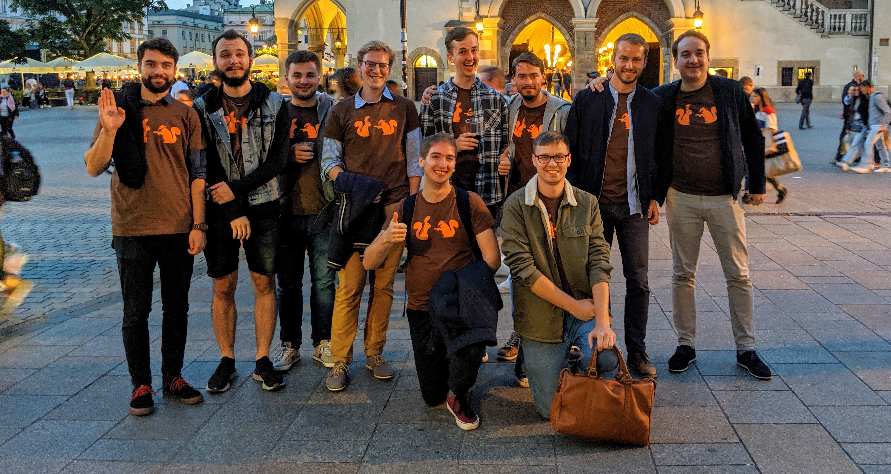

 

Přibližně týden před tím, než měla být moje rozlučka se svobodou, jsem jel vlakem
z Prahy do Brna a volal jsem si se svým svědkem, který celou akci plánoval.

"No, a řekni mi ještě, jak se máš teď v práci?" zeptal jsem se ke konci našeho rozhovoru.

"Jardo, to je na dlouho. Povíme si to o víkendu v tom Polsku," odpověděl.

"V jakém Polsku?" zeptal jsem se Adama nechápavě, i když mi bylo hned jasné, která bije.

Nebýt ale tohoto trapného prořeknutí, do poslední chvíle nevím, co budeme dělat.
Podle Kláry to věděli úplně všichni, jen já ne. Všichni lidé z mého okolí tedy
odvedli velice dobrou práci, abych na nic nepřišel, za což jsem moc vděčný -
všem, kromě Adama, nejhoršího svědka na světě.

 

#### DEN 1

Na rozlučku jsme měli vyrážet v 11 hodin dopoledne. Milky si ale na poslední chvíli
naplánoval rande, takže jsme odjezd odložili na 13. hodinu. Jak je dobrým zvykem
mezi mými kamarády, na čas se to samozřejmě nestihlo, takže jsme vyjeli až
kolem 13:45. Nicméně zahájení celé akce bylo velkolepé. Kluci přijeli před náš
dům, zazvonili a když jsem vyšel ven, všichni na sobě meli oblečené pro mě
typické [tričko s veverkama](https://www.bastard.cz/potisky/veverky/). Zároveň
měli připravené i jedno pro mě, takže jsem se hned převlékl, abych nevybočoval z řady.
Následoval přípitek, při němž jsem všem poděkoval za to, že pro mě něco takového
udělali, a zároveň jsem nezapomněl zmínit, že Adam je nejhorší svědek v historii.

Potom už byl čas, abychom vyrazili na cestu. Jeli jsme ve dvou autech, která byla
okupována následujícími posádkami:

- Ford Focus Combi: řidič Milky, Kuba Kudýn, Mojmír, Marian a Adam,
- Škoda Octavia Combi: řidič Čuri, Zále, Dežna, Kuba Sedláček a já.

Upřímně, cesta neubíhala moc rychle, protože jsme se pořád zastavovali, takže
do [Krakova](https://cs.wikipedia.org/wiki/Krakov) jsme přijeli asi po čtyřech
hodinách strávených na cestě. Zaparkovali jsme v centru u jedné z budov
[Jagellonské univerzity](https://en.uj.edu.pl/en_GB/start),
kde právě probíhal sraz fyziků. Zaznělo tedy několik vtípků na osobu našeho
oblíbeného fyzikáře z gymplu a poté jsme vyrazili na místo našeho ubytování.

Jednalo se o zařízení s názvem [Intro Hostel](https://www.booking.com/hotel/pl/intro-hostel-krakow.cs.html),
které se nacházelo cca 200 metrů od hlavního krakovského náměstí [Rynek Główny](https://cs.wikipedia.org/wiki/Krakovsk%C3%BD_rynek).
Poloha ubytování byla skvělá, kvalita už tolik ne. Vyfasovali jsme pokoj s deseti
lůžky, kde každé vrzalo tak moc, že by to probudilo snad i medvěda, který právě
ulehl k zimnímu spánku.

Po vybalení věcí jsme vyrazili do víru velkoměsta. Nejdřív jsme se stavili na kebab
a poté šli směrem k [Wawelu](https://cs.wikipedia.org/wiki/Wawel). Na břehu řeky
[Visly](https://cs.wikipedia.org/wiki/Visla) jsme obsadili jednu lavičku, u které
jsme dlouho popíjeli, diskutovali a užívali si atmosféru večerního města.

Potom jsme chodili nějakou dobu po [Krakově](https://cs.wikipedia.org/wiki/Krakov),
než jsme našli [Plac Nowy](https://pl.wikipedia.org/wiki/Plac_Nowy_w_Krakowie), kde
jsme si dali vynikající [zapékanku](https://cs.wikipedia.org/wiki/Zap%C3%A9kanka).
Adam chtěl poté pořád vyzkoušet nějaké polské pití, proto jsme hledali nějaké
restaurační zařízení, kam bychom si mohli sednout. Našli jsme hospodu, jejíž
název si už nepamatuju. Bylo ale vtipné, že jsme si všichni dali panáka
[nalewky](https://en.wikipedia.org/wiki/Soplica), slabé ochucené polské vodky, která
byla s příchutí [kdoulí](https://cs.wikipedia.org/wiki/Kdoulo%C5%88_obecn%C3%A1).
A vybral ji Adam - ano, kdo jiný. Já jsem měl v tu dobu chuť na sladké, takže jsem si objednal
ještě jablečný koláč, kvůli kterému se mi ostatní smáli, protože vypadal jako
hovno se šlehačkou. Mně ale moc chutnal :-)

Ostatní chtěli pořád do klubu, takže jsme zapadli do nějaké pasáže, v níž se
nacházela hromada nejrůznějších podniků a mimo jiné i klub. Do klubu stejně moc lidí nešlo,
takže jsem se zbytkem byl v hospodě, kde si ostatní objednali pivo a já popíjel vodu.
Bylo mi totiž špatně z toho nejhnusnějšího panáku, který jsem kdy v životě měl.
Po vstupu do pasáže totiž Adam s Kubou šli do nějakého podniku koupit panáky.
Celou situaci popisovali tak, že si mohli vybrat co chtěli, ale oni vybrali nějakou
ochucenou kyselou vodku, která poté docela zabila můj večer.

V pozdních ranních hodinách už bylo hodně z nás, kteří chtěli jít spát. Proto jsme
to v hospodě zabalili a šli směrem na hostel. Někteří měli ještě hlad, takže jsme se
zastavili u hladového okna a čekali na kebab. V řadě před námi
stála skupinka Angličanů, kteří také slavili rozlučku se svobodou. Jednomu z nich
ale kebab evidentně nechutnal, protože jej hned po tom, co do něj jednou kousl,
hodil na zem, po které právě projel čistící vůz. Nevím, jak se to událo, ale
Honzi kebab zvedl a nabízel ho ostatním, zda si nedají. Jako první do něj
kousnul Adam, který si tím vysloužil posměch a ponižování celé party snad do konce
života :-D A to musím říct, že nebyl jediný, kdo si dal. Že, Zále? Milki? Honzi?

 

#### DEN 2

Druhý den jsme vstali kolem 9. hodiny, nasnídali se a vyrazili znovu do města.
Po prvním dni byli všichni unavení, takže jsme se šli podívat k těm nejvýznamnějším
památkám [Krakova](https://cs.wikipedia.org/wiki/Krakov), které jsme stejně viděli
už desetkrát.

Udělali jsme si tedy takovou procházku přes
[Rynek Główny](https://cs.wikipedia.org/wiki/Krakovsk%C3%BD_rynek), kolem
[Wawelu](https://cs.wikipedia.org/wiki/Wawel) k [Visle](https://cs.wikipedia.org/wiki/Visla)
a na [Plac Nowy](https://pl.wikipedia.org/wiki/Plac_Nowy_w_Krakowie), kde jsme
si chtěli dát znovu [zapékanku](https://cs.wikipedia.org/wiki/Zap%C3%A9kanka), ale
naneštěstí byly všechny stánky zavřené.

Na jídlo jsme se tedy rozdělili. Já jsem šel s Honzou, Čurim, Mojmírem a Koudym
do bistra s názvem [Jonatan Street Kitchen](https://www.krakowfoodie.pl/en/2019/07/nowe-zeberka-w-krakowie-czyli-jonatan-street-kitchen/).
Jedná se o podnik, kde dělají vynikající vepřová žebra podávané s bramborovým salátem.

Po obědě jsme nakoupili suvenýry pro rodiny a vyrazili zpět domů.

 

#### FOTKY

Fotky z Krakova najdete [zde](https://photos.app.goo.gl/gBTGBJZVJyc4cAE58).
