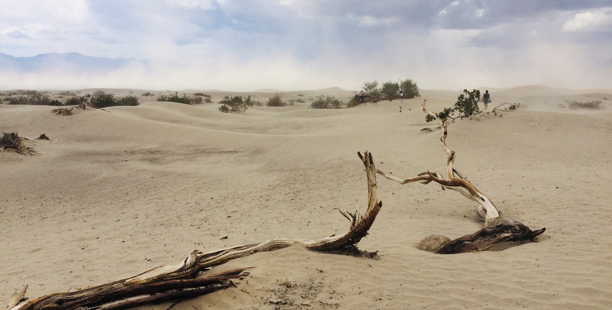

 

#### DEN 0

Možná to bude znít zvláštně, ale začal bych letem. Letěli jsme z Vídně do LA se
spoleÄností Austrian Airlines a let trval 12 hodin. Letěli jsme severní stezkou
přes Česko, Polskou, Skandinávii, Grónsko a Kanadu. Přestože jsme se toho
s Klárou oba báli, bylo to úplně v pohodě. Jak by řekl tatínek, pořád tam
někdo chodil a něco nám vnucoval, takže to rychle uteklo.

To nejlepší na letu ale nebylo jídlo a pití, ale to, že let byl “vyhlídkový”!
Nad Evropou toho moc vidět nebylo, ale když jsme přeletěli Grónsko, byly vidět
obrovské ledové kry plující v oceánu, které jsme díky krásnému počasí bez mráčků
měli jako na dlani. Nad Kanadou jsme potom pozorovali, jak se krajina mění ze
zmrzlého permafrostu na zelený koberec. To havní, z čeho mě osobně spadla čelist,
teprve přišlo. Letěli jsme totiž nad Yosemitským národním parkem, který z ptačí
perspektivy vypadal naprosto famózně. Jedná se o lesy zarostlé údolí, ze kterého
vyčnívá několik skalních objektů. Nikdy jsem si nemyslel, že něco takového uvidím
a musím uznat, že nebýt Kláry, ani si toho nevšimnu.

Třešničkou na dortu byl potom ppřílet do LA, kdy jsme celkem nízko přeletěli
nad velkou částí města a měli jsme tak možnost z letadla vidět mrakodpady
v centru a nápis HOLLYWOOD na kopci za nimi. Jen doplním, že mrakodrapy nejsou
v LA nijak obvyklé. Celé město je pokryto nízkou zástavbou a mrakodrapy
se nacházejí jen v centru. Z letadla tedy nic významného kromě nich a nápisu
ani nemohlo být vidět.

Po příletu jsme si vystáli asi dvouhodinovou frontu na pohovor s imigračním
pracovníkem, vyzvedli si našeho nového parťáka, který nás bude vozit
následujících 14 dní po všech čertech a vyrazili jsme domů. Po cestě jsme se
dostali na šestiproudou dálnici (v jednom směru), kde jsme asi hodinu jeli
krokem. Domů jsme se tedy dostali celkem pozdě. Proto jsme po příjezdu zašli
jen na rychlé tacos do stánku s rychlým občerstvením, kde lidé rozumí více
španělsky, než anglicky, a šli jsme si lehnout.

Co se týče ubytování, bydlíme ve velice pěkné a klidně čtvrti, kde se není čeho
 bát. Bydlíme v malém přízemním domě, který jeho majitel prnajímá lidem přes
 Airbnb. Je to tedy spíše taková ubytovna :-) Pokud se chcete podívat, náš dům
 je na adrese 4242 Tujunga Avenue, LA. Na Google Streetview má celkem
 pěknou fotku :-)

 

#### DEN 1

První den v LA jsme začali stylově - na chodníku slávy. Vyfotili jsme
se u hvězdy Morgana Freemana, Marilyn Monroe, nebo Walta Disneho. Kromě toho
jsme také potkali lidi, se kterými jsme předchozí den seděli v letadle. Potom
jsme se projeli po čtvrti Beverly Hills, kde bydlí místní smětánka. K vidění
tedy byly hlavně velké honosné vily. Následoval oběd v jednom z nejtypičtějších
fast foodů v Kalifornii, který se jmenuje In-N-Out Burger, a potom už jsme
frčeli do Gettyho centra. Jedná se o obrovský komplex věnovaný umění, který
je postavený na kopci nad LA, takže je odtamtud skutečně moc pěkný výhled
na město. Kromě výhledu jsme ale v Gettyho centru obdivovali především obrazy
(Rubens, Rembrandt, van Gogh, Manet aj.) a místní zahrady.

Den ještě nekončil, proto jsme se vydali na místní Pařížskou. Ta se v LA jmenuje
Rodeo Drive. Kromě luxusního zboží a nádherných palmových alejí tam nic jiného
k vidění nebylo. Myslím, že všichni víme, kdo se tam chtěl jít hlavně
podívat :-) Na konci dne nás ještě čekala Griffitova observatoř, kam turisté
jezdí hlavně kvůli dvěma výhledům - na město a na nápis HOLLYWOOD. Protože jsme
kvůli husté dopravě dojeli na místo až za tmy, první z výhledů byl fantastický,
ale druhý nebyl vůbec. Abych to vysvětlil, LA se ve tmě nádherně rozvísitilo,
takže se jednalo o skvělý zážitek. Na druhou stranu, jeden z nejslavnějších
nápisů světa ve tmě osvětlený nebyl, takže jsme ho ani moc neviděli.

 

#### DEN 2

Druhý den jsme trošku déle spali a po snídani se vydali do Universal Studios,
což je vlastně zábavní park věnovaný filmům. Nachází se v něm nepřeberné
množství atrakcí, které člověka zabaví na celý den. My s Klárou jsme byli
na těchto:

- Prasinky a Bradavice - vesnička a Bradavický zámek v životní velikosti,
v komplexu se nachází horská dráha, 4D projekce a hromada obchodů s
tématikou Harryho Pottera;
- Dream Works Studio show - další 4D projekce s tématikou Kung Fu Panda,
- Walking Dead atrakce - procházka po postapokalyptické nemocnici,
ve které vás lekají lidé převlečení za zombíky (tohle jsem málem nedal),
- Universal Studios tour - projížďka otevřeným autobusem po reálnýh studiích,
kde se točila hromada slavných filmů; součástí prohlídky jsou i reálné ukázky
některých scén, nebo efektů z filmů; tohle bylo opravdu zajímavé; ukazovali nám,
jak v těchto studiích např. postavili maketu newyorských ulic, nebo jak se dělá
efekt deště, nebo jsme byli v zákulisí ateliéru, kde se před nějakou dobou
točila scéna Sběratelů kostí, ve které se byla zobrazena dopravní nehoda
v metru způsobená zemětřesením - všechno z toho jsme si na prohlídce
zažili - přijeli jsme tedy do ateliéru, který vypadal jako zastávka
metra, a najednou se s námi začala třepat podlaha, potom se propadl
strop a vedle mě začal hořet nějaký oheň, následně se z druhé strany vyřítila
masa vody a já se bál, že nás to zaplaví :-)

Odpoledne jsme se jeli ještě podívat na Tichý oceán na Venice beach a potom
jsme už frčeli domů.

 

#### DEN 3

Třetí den  jsme posnídali sýrovou pizzu, kterou jsme nesnědli předchozí den
na večeři, a vyrazili na sever. Kolem poledne jsme přijeli do malého městečka
Pismo Beach, kde jsme se naobědvali - já jsem si dal fish and chips a Klára si
dala quesadillas s hranolkama, které jsme dojídali ještě na večeři. Po obědě
jsme se prišlo po molu na pláži a pokraÄovali v cestě.

Asi po hodině cesty jsme přijeli na Hearst Castle. Přestože je v názvu místa
slovo “castle”, neboli zámek, já bych spíše řekl, že se jedná o takovou vilu.
Objekt je postaven na vysokém kopci, ze kterého je nádherný výhled na Tichý
oceán a okolní zelené kopce, na kterých se pásly krávy. Ve vile se do sebe motá
hromada stylů a prvků. AÄ byla budova vystavena na začátku 20. století, jsou
v ní prvky ze starého Řecka, Říma, nebo Egypta. Jednoduše je to taková
splácanina všeho a vlastně ničeho pořádně. V mých očích byl pan Hearst, který si
nechal tento objekt postavit jako letní sídlo, člověkem, co nevěděl, co s penězi.
Aby toho nebylo málo, kolem celé rezidence nechal navozit spoustu exotických
zvířat, a to od antilop až po lední medvědy, kteří se podle mě museli
v prosluněné Kalifornii dost natrápit.

Po zajímavé prohlídce nás čekala poslední zastávka toho dne. Jednalo se o místo,
ze kterého bylo možné pozorovat na pláži ležící rypouše sloní - obrovské
ploutvonožce, kteří se na Zemi vyskytují jen v oblastech blízkých Antarktidě
a v Kalifornii :-) Ta zvířata sice hrozně smrděla, ale byl to opravdu zajímavý
zážitek.

Večer jsme se ubytovali v hotelu a šli spát.

 

#### DEN 4

Čtrvtý den byl o vyhlídkách.

Vstali jsme, nasnídali se v hotelu a vyrazili na cestu po Pacific Coast Highway,
což je silnice vedoucí po západním pobřeží USA. V průvodci jsem se dočetl, že
na této cestě krása střídá nádheru a upřímně bylo to tak. Celou cestu se nám
naskýtal nádherný výhled na útesy a oceán, takže jsme každou chvíli zastavovali,
abychom si něco mohli vyfotit :-)

Jednou z hlavních zastávek byl Bixby Creek Bridge a poté městečko Pebble Beach,
kde se nachází 17-Miles Drive. Jak už název napovídá, jedná se o 17 mil dlouhou
cestu. Na této  cestě je několik zastávek, kde člověk může vidět nejrůznější
zajímavosti - cypřišové lesy, útes, na kterém hnízdí nějací ptáci, pláž atd.
Cesta byla zajímavá, ale znovu bych tam asi nejel. Celá trasa ale končila
v městě Monterrey, kde jsme zašli na oběd na náš asi miliontý hamburger
v USA a potom jsme se šli podívat do místního akvária.

Bylo to takové to typické americké akvárium, kde člověk může vidět obrovské
vodní nádrže, ve kterých plave spousta nejrůznějších ryb. Pro mě osobně bylo asi
nejzajímavější to, že jsme viděli krmení tučňáků, že jsme si pohladili rejnoka
a že jsme viděli krmení ostatních ryb, při němž vlezl potapěč přímo do vodní
nádrže a my ho tak viděli, jak tam vedle nás plave potapěč s ostatníma
rybkama :-)

Po konci prohlídky jsme sedli do auta a jeli do San Francisca, kde jsme se
sešli s Joeym. Joey je člověk, kterého jsem našel na couchsurfingu a který nás
nechal u sebe přespat tři noci. Joey bydlí v malém 2+kk na kraji SF společně
se dvěma psy (Misha a Sage) a jedním hadem (je to krajta, ale nevím, jak se
  jmenuje). Joey je učitel na základní škole (zdravíme Řeku) a každý den
  dojíždí do práce do cca 40 mil vzdáleného města Mountain View
  v Sillicon Valley.

Po seznámení jsme se šli s Klárou najíst do mexické restaurace v našem
neighborhoodu a šli jsme spát.

 

#### DEN 5

Pátý den jsme se probudili trošku později, nasnídali se a vyrazili do města.
Čekala nás hodinová cesta metrem na druhý konec SF, odkud jsme šli na vyhlídku
na Coit Tower, poté jsme se prošli po klikaté ulici Lombard Street a odtud jsme
pokračovali do přístavu. Na oběd jsme si dali typický bagel (houska s dírkou
  uprostřed) a potom jsme vyrazili podél doků k největšímu lákadlu města - Golden
  Gate Bridge. Most je opravdu monumentální, takže jsme pořád jen fotili.
  Potom jsme chtěli jít ještě do dvou parků, ale bylo už pozdě a navíc nás
  přepadl déšť, takže jsme v prvním nasedli na autobus a jeli domů.

Večer jsme se ještě s Joey dívali na televizi a povídali si a kolem deváté jsme
si šli lehnout.

 

#### DEN 6

Dneska nás čekala asi druhá největší památka v SF, a to Alcatraz. Tramvaj,
kterou jsme se měli dostat na místo, odkud nám odjížděla na Alcatraz loď,
měla zpoždění, takže jsme museli jet další lodí. Docela jsme kvůli tomu
stresovali, ale nakonec to dobře dopadlo.

Na Alcatrazu jsme si prošli všechny místnosti, ať už to byly cely, jídelna,
sprcha, místnost pro návštěvy, nebo knihovna. Po prohlídce začalo hrozně moc
pršet, takže zpět do SF jsme přijeli úplně promočení. Před deštěm jsme se šli
schovat do Hrad Rock Café, kde jsme se najedli a po obědě šli (neplánovaně)
do sídla Levi’s, kde si Klára koupila nové rifle a já nové suché ponožky :-)
Odpoledne jsme se ještě prošli po centru SF a Chinatownu a jeli domů.

Protože Joey spal a psi chtěli jít ven, vzali jsme je na procházku. Nebyla moc
dlouhá, jen jsme obešli blok. Potom jsem napsal tento report a teď už jdeme spát.

#### DEN 7

Ráno jsme se vzbudili u Joeyho v SF, zabalili si věci a vyrazili směr národní
park Yosemite. Cestou jsme se stavili na oběd do nějakého BBQ restaurantu
u dálnice, kde si Klára objednala sandwich, ale to, co jí donesli vypadalo
přesně jako hamburger. Cesta byla celkem dlouhá, takže jsme do Yosemitu dorazili
až kolem třetí hodiny odpoledne.

Hned po příjezdu jsme navštívili místní informace, kde nám ranger poradil, co
v následujících 24 hodinách, kdy jsme měli být v parku, dělat. Naše první
zastávka proto byl sekvojový háj, k němuž vedla asi 2 km dlouhá cesta lesem.
Na této procházce nás zastihl déšť, takže jsme dost zmokli a navíc jsme byli
úplně špinaví, protože se šlo po bahnitých lesních cestách.

Nasedli jsme proto rychle do auta a jeli se ubytovat do vesničky v údolí.
Ubytovaní jsme nebyli v hotelu, ale v takovém stanu. Jednalo se o dřevěnou
platformu, která byla překrytá nějakou látkou. Nebudeme se nic nalhávat, i když
jsme měli v noci zapnutý přímotop na maximum, byla tam dost zima.

Po vybalení věcí jsme ale ještě chtěli vidět něco z parku, takže jsme sedli
na autobus, který jezdí zdarma po celém parku a nechali se zavést k místu,
kde začíná další hike (procházka, túra). Jednalo se o cestu k Mirror Lake,
což je jezero, jehož jméno je podle nás odvozeno od toho, že se v jeho hladině
odráží skály vedle něj (Mirror Lake = zrcadlové jezero, pozn. redaktora).
Tahle procházka se mi hrozně moc líbila. Šlo se totiž takovou klidnou lesní
cestou, nepršelo a co víc - viděli jsme na ní několikrát srny a plavajícího
bobra :-)

Po návratu do vesničky jsme zašli na pizzu a šli spát.

 

#### DEN 8

Jak už jsem říkal, vstávání ve stanu nebylo nejpříjemnější, ale zvládli jsme to.
Po probuzení jsme si dali snídani, zašli na čaj a vyrazili na další túru.
Tentokrát se jednalo o túru s názvem Mist Trail, která byla v průvodcích
zařazená do kategorie “náročné” (kategorie byly tři - nenáročné, mírně náročné
a náročné). To jsme ale s Klárou nevěděli.

Túra měřila asi 13 km a v průběhu 4 hodin, co jsme ji šli, jsme zdolali
převýšení přesahující 800 m. Cesta vedla do strmého kopce kolem dvou vodopádů
(posílal jsem na fotkách). U prvního z nich se šlo cestou, kde jsme celí
promokli od vody, která stříkala z vodopádu. Cestou zpět jsme se zase brodili
ve vodě, takže jsme měli mokro v botech. Musím říct, že jsme si asi sáhli
na dno, ale stálo to za to. Výhledy do údolí i na vodopády za to prostě stály.

Po návratu do vesničky jsme se najedli a vyrazili autem do Visalie - cca
stotisícového města na jih od Yosemitu. V parku se mi opravdu moc líbilo. Byla
škoda, že jsme tam strávili jen dva necelé dny. K vidění bylo o mnoho více,
takže jsme se shodli na tom, že se musíme zase někdy vrátit zpět a projít
i ostatní túry, které park nabízí.

Ve Visalii jsme spali přes couchsurfing u Mellisy. Když jsme přijeli, Mellisa
nebyla doma. Nechala nám ale zprávu, že nechala klíče pod rohožkou a že máme
jít klidně k ní domů. Uvnitř bylo vše připraveno na náš příjezd - postel,
ručníky a papír s “návodem k použití” (heslo k wi-fi, informace, kde je
odpadkový koš, kde najdeme čaj, jak se používá sprcha atd.). Protože jsme byli
unavení po túře, jen jsme se osprchovali a šli spát.

 

#### DEN 9

Den s pořadovým číslem 9 byl specifický v tom, že jsme na něj na poslední chvíli
změnili program. Důvodem bylo počasí. Původně jsme měli jet do národního parku
Sequoia, kde rostou největší stromy na světě. Nicméně podle předpovědí tam
zrovna byla sněhová bouře a pro vjezd do parku bylo zapotřebí mít řetězy.
Rozhodli jsme se proto zrušit ubytování na danou noc a pokračovat na naši další
zastávku - do Údolí smrti.

Vyjeli jsme hned ráno, protože náš čekala cesta dlouhá cca 5,5 hodiny. Snídani
i oběd jsme si proto dali na benzínkách. Do parku jsme dorazili i tak až
odpoledne a už jsme v něm toho moc nestihli. Co jsme ale stihli byla další
nepřízeň počasí - zažili jsme písečnou bouři! Když jsme projížděli údolím,
začalo hrozně moc foukat. A vítr vířil prach tak moc, že v některých částech
silnice jsem neviděl ani na kapotu auta. Celou cestu jsem proto  jel se
zapnutými dálkovými světly. S dálkovými jsem jel ale jen proto, že na našem autě
neumím zapnout klasická světla. I když nám počasí úplně nepřálo, udělali jsme
v údolí několik zastávek, např. na písečných dunách, nebo na vyhlídce na skály,
a prošli jsme se po jedné stezce.

Pokud bych měl více popsat, jak to v údolí smrti vypadá, řekl bych, že je tam
prostě mrtvo. Ne vážně, jedná se o poušť, kde je jen kamení, písek a prach. Sem
tam roste pár nízkých keřů a občas je vidět i nějaký kaktus. Co se týče fauny,
průvodci tvrdí, že se v údolí vyskytují nějaké horské kozy, nebo hadi. My jsme
viděli jen ještěrky a jednoho kojota.

Po průjezdu parkem jsme jeli na hotel, kde jsme se ubytovali a zašli se najíst.
Já jsem si dal špagety s masovými koulemi a Klára si dala grilované kuřecí
kousky v tortile.

 

#### DEN 10

Další den jsme spali o něco déle, abychom nabrali síly po náročné cestě. Na
snídani jsme potom zašli do stejné hotelové restaurace, kde jsme měli den před
tím večeři. Sice říkám, že jsme šli na snídani, ale byl to spíš brunch. Já jsem
si totiž dal hovězí steak s míchanými vajíčky a bramborama (bylo to poprvé
v životě, co jsem snídal steak) a Klára měla dvě velké palačinky s javorovým
sirupem, které nedojedla, takže mi zbylo ještě na dezert :-)

Po vydatné snídani jsme se vrátili zpět do údolí, abychom se podívali na to, co
jsme předchozí den nestihli. Turisté se do parku jezdí dívat hlavně na druhý
nejnižší bod na západní polokouli, který se jmenuje Badwater Basin, a na různé
skalní útvary. Obojí jsme navštívili. Cestou z údolí jsme doplnili vodu
v informaÄním centru a vyjeli do Las Vegas. Musím říct, že před návštěvou jsem
moc nevěděl, co čekat, ale park toho nabízí celkem dost a mně osobně se tam moc
líbilo. Za návštěvu to tedy určitě stálo :-)

V Las Vegas jsme ubytovaní v hotelu Stratosphere, který se pyšní druhou nejvyšší
věží na západní polokouli. Jedná se o vyhlídkovou věž, kde ale kromě restaurace
a možnosti zúčastnit se některého z adrenalinových zážitků nic není. Po vybalení
věcí jsme zašli na večeři do Taco Bell, amerického fast foodu, kde se prodává
mexické jídlo a kam chtěla Klára jít od prvního dne v USA. Cestou tam a zpět
jsme procházeli přes nějakou divnou čtvrť, kde jsme potkali tolik bezdomovců,
chlapů přeoperovaných na holky a jiných individuí, kolik jsem jich nepotkal
za pět let studia v Praze. Upřímně musím říct, že jsem byl po návratu na hotel
rád, že jsme zase zpátky.

 

#### DEN 11

Jedenáctý den nás čekala jen prohlídka Las Vegas, proto jsme zase spali o něco
déle. Po snídani jsme vyrazili nadzemkou na začátek hlavní ulice v Las Vegas,
která se oficiálně jmenuje Las Vegas Boulevard. Ano, je to velice originální.
Všude se jí ale říká Strip. Na této ulici se nachází všechny známé hotely
a kasína ve městě.

Naši prohlídku jsme začali trošku netradičně v CBS Television City, kde jsme se
zúčastnili průzkumu americké televize CBS. Průzkum probíhal tak, že nás zavřeli
do jedné místnosti s počítači a pustili nám díl jednoho seriálu, který ještě
neběží v televizích. Po promítání nám dali dotazník, který jsme museli vyplnit.
To, jaký seriál se bude promítat, se nikdy neví dopředu. My s Klárou jsme viděli
první díl sitcomu, který byl o Bobovi, bělošském prodejci ponožek ve středních
letech. Bob dostal hned na začátku dílu infarkt a byl převezen do nemocnice, kde
poznal černošskou nemocniční sestru Abisholu pocházející z Nigérie. Bob se
do ní zamiloval a potom jí celý díl uháněl, aby s ním šla na rande. S Klárou
jsme se shodli, že to bylo zajímavé a pokud to pustí do vysílání, budeme seriál
sledovat :-)

Tohle byl asi vrchol dnešního dne. Potom jsme totiž už šli jen kolem hotelů
a kasín zpět na náš hotel, kam jsme dorazili až kolem sedmé hodiny večer.
Krokoměr mi napočítal, že jsme ušli 13 km. Cestou jsme se zastavili v několika
obchodech, ale moc jsme toho nekoupili, jen pár suvenýrů a Klára si koupila
druhé rifle, a zase Levisky :-)

Po návratu na hotel jsme zašli ještě do hotelového kasína, kde jsme zkusili
štěstí v místních automatech. Po asi 20 minutách jsme byli chudší o 10 dolarů,
takže jsme to zabalili a šli na večeři do McDonald’s :-)

 

#### DEN 12

Dvanáctý den jsme se vzbudili hned brzo ráno, odhlásili se z hotelu v Las Vegas
a vyrazili znovu na cestu. Naší další zastávkou byl národní park Zion. I když
jsme vyrazili kolem sedmé a cesta zabrala tři hodiny, na místo jsme dorazili
někdy kolem jedenácté hodiny dopoledne, protože jsme zároveň přejeli do jiného
časového pásma.

Národní park Zion se nachází na jihu státu Utah a jeho hlavní dominantou je
údolí, kterým protéká řeka Virgin. Toto údolí je tvořeno do červena zbarvnými
skalními útvary, které v kombinaci se zelenou trávou a stromy vytváří nádherné
úkazy. Ne nadarmo je NP Zion označován v mnohých průvodcích jako jeden
z nejhezčích parků v USA.

My jsme po příjezdu sedli na bezplatný autobus a nechali se zavézt na zastávku,
ze které jsme vyšli na naši první túru. Jednalo se o výšlap na jednu ze skal,
odkud byl nádherný výhled do údolí. Vyhlídka se jmenovala Scout’s Lookout. Z ní
bylo možné pokračovat na skálu tak vysokou, že na ní létají jen andělé (proto se
jmenuje Angel’s Landing). Tam jsme ale už nešli. Jedná se totiž o cestu po kraji
skály, kde se člověk drží jen lana a pod vámi je sráz hlukobý cca 600 m. Jednak
jsme se báli, že skončíme jako několik nešťastníků, kteří tam za 100 let
existence parku zahučeli, druhak tam byla taková tlačenka, že nás to ani
nelákalo. Jo, a taky nejsme andělé :-) Sešli jsme proto zpět do údolí, zašli
jsme si na oběd (burger a hot dog) a potom jsme se vydali ještě ke dvěma
vodopádům. Oba tyto tracky byly velice krátké, takže jsme je měli hned za sebou.

Z parku jsme vyjeli kolem čtvrté hodiny a vyrazili jsme se na jih, konkrétně
do Page ve státu Arizona. Jedná se o malé městeÄko, kam jsme dorazili kolem
sedmé hodiny, ubytovali se do jednoho domu přes Airbnb a zašli na pizzu do Pizza
Hutu :-)

 

#### DEN 13

Poslední den naší výpravy nezačal úplně podle plánu. Den předem jsme totiž
obdrželi zprávu o tom, že se kvůli počasí ruší naše prohlídka místa zvaného
Antilope Canyon. Pokud se podíváte na fotky, určitě se vám vybaví [tapeta
z Windows](https://i.huffpost.com/gen/1565047/thumbs/o-ANTELOPE-570.jpg?1).
Sice nás storno návštěvy Antilope Canyonu štvalo, ale na druhou stranu je v Page
ještě jedna věc, na kterou se tam jezdí dívat turisté z celého světa.

Jedná se o vyhlídku zvanou Horseshoe Bend, která se nachází asi 5 km za městem.
Horseshoe Bend je vlastně meandr řeky Colorado, které se podařilo v daném místě
vyhloubit obří kaňon v podobě koňské podkovy, odtud také Horseshoe Bend. Pro mě
se jedná o jedno z nejikoničtějších míst západu USA, takže vyhlídka byla
skutečným zážitkem.

Cestou z vyhlídky nám začalo trošku poprchat a když jsme vyjížděli směr Grand
Canyon, už pršelo. Cestou také začala teplota klesat k bodu mrazu a než jsme se
nadáli, dostali jsme se do husté sněhové vánice. Musím říct, že to byl jeden
z dalších momentů naší cesty, kdy jsem se opravdu bál. Venku sněžilo tak, jak
v Brně nesněžilo celou předchozí zimu, stěrače jeli na maximum, hrozně se mlžilo
přední okno a do toho se na palubní desce rozsvítilo červené světýlko, které mě
mělo informovat o tom, že nám odešel tempomat. Za volantem jsem toho tedy moc
neviděl a obloha před námi nevypadala, že by se mělo v dalších chvílích něco
změnit. Celou dobu jsem si u toho ještě říkal, že to ani nemlže být pravda -
byli jsme v Arizoně, kde je poušť a podle průvodců tam má být na jaře mezi
20 a 30 °C. Jenže se mi to nezdálo, nebyl to sen. Naštěstí jsme za 10 minut
sjeli z takového “horského průsmyku” dolů do údolí a po sněhu nebyla ani vidu
ani slechu. Když roztál sníh na kapotě, najednou začal fungovat i tempomat,
takže vše bylo zase při starém a my jsme spokojeně fičeli do Grand Canyonu.
To ale bohužel nebyl poslední sníh, který jsme ten den viděli.

Když jsme někdy kolem oběda přijížděli do Grand Canyonu, bylo kolem 0 °C (pořád
jsme v Arizoně) a v protisměru nás míjela auta, která měla na střeše dobrých 10
cm sněhu. Paní na vstupní bráně nás potom ujistila, že sice ráno dost sněžilo,
ale že se nemusíme bát. Už prý vychází sluníčko a během následujících hodin to
bude úplně v pohodě. Tak jsme vjeli do parku, zastavili se na první vyhlídce do
kaňonu, která byla naprosto nádherná a pokračovali jsme do Grand Canyon
Village - vesničky na úpatí kaňonu, kde jsou další vyhlídky.

Pro představu ještě doplním, že Grand Canyon NP je tvořen, jak název napovídá,
jedním obrovským kaňonem, ve kterém teče řeka Colorado. Kaňon je dlouhý cca
450 km, jeho šířka se pohybuje v rozmezí od 500 m do 29 km. Hloubku kaňonu
neznám, ale když se podíváte dolů ze srázu, mnohdy není vidět, kde je zem :-)
Kaňon je starý kolem 1,8 miliardy let, což je přibližně 1/3 stáří Země. Na
seznam UNESCO byl zařazen v roce 1979. Zvlášť z toho důvodu, že je tak obrovský
(a hlavně hluboký), se tam moc nechodí na nějaké túry. Samozřejmě to asi jde,
ale tyto túry jsou už pro zdatné lidi, ne pro nás s Klárou. Nejčastěji tam
turisté proto jezdí na vyhlídky. Stačí si totiž stoupnout na okraj kaňonu
a kochat se :-)

A to přesně byl náš plán - jet do Grand Canyon Village, stoupnout si na okraj
a kochat se. Před tím jsme se ale zastavili na oběd (pizza a hot dog) a na
místní poštu. Mezitím, co jsme ale jedli, zase proběhla další 10minutová sněhová
“přeháňka”, takže jsme po příjezdu do vesničky nemíjeli už jen zasněžená auta,
ale dokonce i rolbaře.

Sníh by asi tolik nevadil, ale nejhorší bylo, že se hned oteplilo. Když jsem
tedy přišli na okraj kaňonu a podívali jsme se dolů, viděli jsme jen bílý opar,
který vycházel z kaňonu. Z kaňonu jsme tedy v tu chvíli viděli úplné hovno. To
byla další chvíle, kdy jsem se cítil fakt na nic. Řekli jsme si ale, že se
projdeme podél kaňonu a uvidíme, zda se to nezlepší. Naštěstí se to během další
hodiny zlepšilo, takže jsme jednak viděli Grand Canyon a druhak si podle mě
udělali vážně moc pěkné fotky :-) Já osobně jsem tam původně ani nechtěl jet,
protože to bylo daleko. Klára mě ale překecala a musím říct, že jsem rád, že
jsme tam byli. Byl to vážně zážitek.

Kolem čtvrté hodiny jsme potom nasedli do auta a vyrazili na čtyřhodinovou cestu
zpět do Las Vegas, kde jsme se ubytovali, pobalili věci domů a šli si lehnout.

 

#### DEN 14

Ráno jsme vstali, vrátili auto do půjčovny a pádili po trase Las Vegas - LA -
Vídeň - Brno zpět domů :-)

Když se ohlížím zpět, osobně si myslím, že cesta to byla dost náročná a pro mě
v mnohém překvapivá. Nečekal jsem, že v Arizoně bude sněžit, nebo že v Death
Valley zažijeme písečnou bouři. Přiznám se, že jsem měl mnohdy strach, ale
myslím si, že to stálo za to. Navštívili jsme hromadu nádherných míst a máme
spoustu zážitků, na které budeme vzpomínat.

 

#### FOTKY

Fotky z USA najdete [zde](https://photos.app.goo.gl/PgKPYdYnc88GRNwz8).
