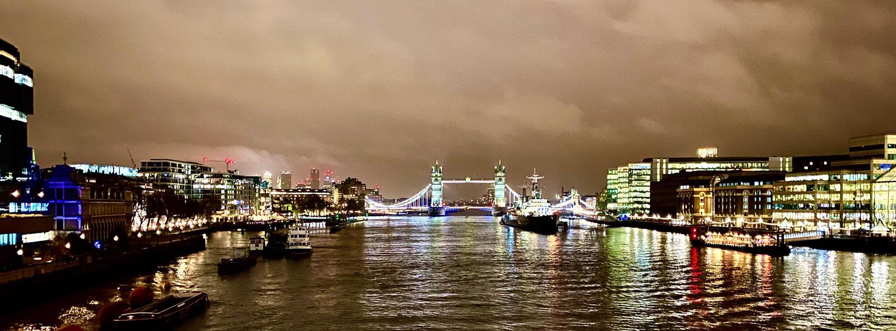

 

Na začátku října 2019 jsem v rámci svého kontraktu v Aures Apps začal pracovat
na prediktivním modelu pro klienta z Londýna. O tři měsíce později bylo naše
řešení připravené k nasazení, a tak jsme se s ostatními kolegy vydali do sídla
klienta, abychom oficiálně zahájili jejich pilotní program.

 

#### DEN 0

Probudil jsem se ve 4:30. V Praze. Vedle mě ještě spal
[Mojmír](https://twitter.com/mojmirbarak), který byl natolik
ochotný, že mě nechal u něho na bytě složit hlavu :-) V 5 hodin mě vyzvedl před
domem firemní řidič, v jehož autě se už na mě smál kolega Martin. Společně jsme
jeli do Holešovic, kde jsme vyzvedli našeho šéfa Viktora. S ním jsme pokračovali
do Dejvic. Na Kulaťáku jsme nabrali posledního člena naší výpravy Pavla.

Na letiště jsme dorazili asi 15 minut před šestou hodinou, takže jsme měli dost
času, abychom před odletem v 7:00 ještě nakoupili redukce na britské zásuvky,
které jsme si všichni zapomněli doma.

Do Londýna jsme příletěli kolem 7:30 místního času. Z
[Heathrow](https://cs.wikipedia.org/wiki/Leti%C5%A1t%C4%9B_London_Heathrow) na
[hotel](https://www.booking.com/hotel/gb/holiday-inn-express-london-epsom-downs.cs.html)
jsme poté jeli Uberem. Na hotelu jsme se checkli v jednom pokoji, protože ostatní ještě
nebyly připraveny. Kolem 10:30 nás vyzvedl projektový manažer Andrew, který nás
zavezl do sídla společnosti. Tam jsme měli cca 2 hodiny dlouhé jednání, po kterém
nás Andrew pozval na oběd do místní firemní jídelny. Nebylo to tam vůbec špatné.
Já jsem si dal jacket potato s kuřecím masem.

V 15 hodin následovalo další jednání s lidmi z finančního oddělení, kterým jsem
se snažil popsat, jak funguje model, na kterém jsem posledního čtvrt roku pracoval.
Po chvíli ale moji prezentaci přebral Viktor, který prezentaci dokončil. Kolem
16:30 jednání skončilo, takže jsme jeli na hotel, kde jsme si chvíli odpočinuli.

Kolem 18. hodiny jsme si vzali Uber do centra Londýna, kam jsme jeli podle
Martinových slov do "úplně skvělé restaurace" na večeři. Cesta trvala cca 1 hodinu
a 30 minut, přičemž auto řídil "dvouprstý Ind" a já seděl na zadní sedačce uprostřed
mezi Viktorem a Pavlem, takže jsem si v průběhu té nekonečné jízdy i říkal, zda
nám to za to vůbec stálo.

Po příjezdu na místo jsem si ale uvědomil, že to za to stálo určitě. Ta "úplně
skvělá restaurace" se totiž nachází v nádherné historické budově bývalé banky,
kterou dnes využívá pětihvězdičkový hotel [The Ned](https://www.thened.com/).
V jeho vstupní hale se kromě "naší" italské restaurace
[Cecconi's](https://www.thened.com/restaurants/cecconis) nachází ještě sedm dalších
restaurací či barů a podium, na kterém v průběhu celého večera hrála živá jazzová hudba.

Ptáte se, co jsem si dal na jídlo? Podle Viktora dětskou polévku minestrone,
pizzu s italskými párečky a pannacotu. Viktor měl dobrou náladu, takže objednal
i víno. Co bylo ale lepší než jídlo a pití, byla dobrá atmosféra, která v průběhu
večera panovala. Přišlo mi, že jsme si dobře popovídali a celkově se lépe poznali.

Po večeři jsme si udělali krátkou procházku k
[The Shard](https://cs.wikipedia.org/wiki/The_Shard), přičemž jsme udělali
několik fotek [Tower Bridge](https://cs.wikipedia.org/wiki/Tower_Bridge).
V [The Shard](https://cs.wikipedia.org/wiki/The_Shard) jsme se chtěli jít podívat
na vyhlídku na město. Ta byla bohužel už zavřená. Vyjeli jsme tedy alespoň do 32. patra
(cca v půlce budovy), kde se nachází bar [Oblix](https://www.oblixrestaurant.com/).
V něm jsme si sedli, dívali se na noční Londýn, poslouchali jsme skvělou kapelu
Pocket Jukebox a já popíjel pivo.

Kolem 23:30 jsme to zabalili a jeli Uberem zpět na hotel. Tentokrát byl náš řidič
černoch a v průběhu cesty si zpíval. Při cestě panovala skvělá nálada, takže to
opravdu rychle uteklo. Na hotelu jsem si už dal jen sprchu a kolem jedné šel spát.

 

#### DEN 1

Druhý den se toho v Londýně už tolik nestalo. Vzbudil jsem se v 7:30, zašel jsem
na snídani, sbalil si věci a šel na check-out.

Kolem 10. hodiny jsme přijeli ke klientovi, kde jsme se s Andrewem připravili
na stěžejní meeting naší návštěvy. Meeting začal v 11:30 a trval cca 3 hodiny.
A probíhal velice dobře. Přišlo mi, že všichni zúčastnění byli z našeho řešení
nadšení.

Kolem 14:30 jsme vyrazili Uberem na letiště, tentokrát řídil John, který měl podle
mě špatnou náladu. Na letišti jsme si dali burger v jedné restauraci a v 17:35
odletěli do Prahy. Na letišti Václava Havla jsme přistáli kolem 20. hodiny,
potom mě firemní taxikář zavezl na Florenc, kde jsem si sedl do Stabucks a pracoval.
Ve 22:00 mi Starbucks zavřeli, takže jsem se přesunul do McDonald's.
Ve 23:00 odjezd do Brna, v 1:30 jsem byl v Brně, ve 2:00 v posteli.

 

#### FOTKY

Fotky z Londýna najdete [zde](https://photos.app.goo.gl/mzX5h3WVv8mZVpMD7).
