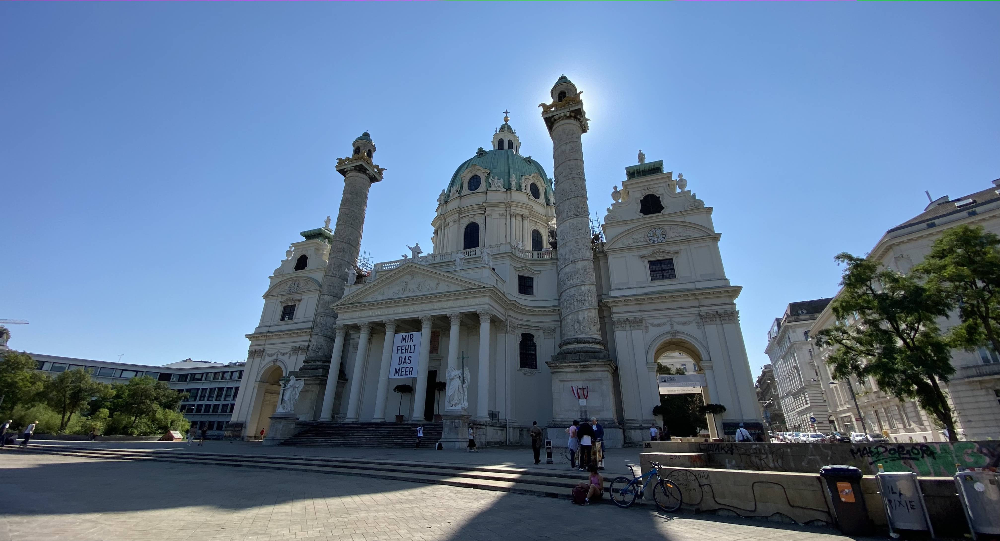

&nbsp;

Už dlouho jsme se s Marťou a Aničkou bavili o tom, že bychom mohli podniknout
nějakou společnou dovolenou. Když jsme ale začali chrlit megalomanské nápady
na cesty kolem světa, uvědomili jsme si, že bychom nejdříve mohli vyzkoušet něco
menšího, při čemž zjistíme, zda nás to spolu baví a zda se na takovém "double
date" vzájemně nepozabíjíme.

A tak jsme vymysleli jednodenní výlet do
[Vídně](https://cs.wikipedia.org/wiki/V%C3%ADde%C5%88). Nejdříve jsme ho měli
naplánovaný na polovinu května. Ale v daném termínu mělo být špatné počasí, takže
jsme nakonec náš premiérový trip přesunuli na začátek září.

Osobně jsem nechtěl nechat nic náhodě, takže jsem koupil jízdenky, připravil
program a koupil průvodce. Ani holky nezůstaly nepřipravené. Anička vytipovala
několik podniků, kam bychom mohli zajít na oběd, nebo na kávu. A Marťa koupila
pro všechny členy svého tandemu cestovní pojištění. Není se co divit - přece jen
[Vídeň](https://cs.wikipedia.org/wiki/V%C3%ADde%C5%88) není
[Hrádek](https://cs.wikipedia.org/wiki/Hr%C3%A1dek_(okres_Fr%C3%BDdek-M%C3%ADstek)).

&nbsp;

#### DEN 0

V 7:24 jsme vyjeli tramvají z Tábora na hlavní nádraží, odkud nám v 7:48 odjížděl
žlutý vlak do [Vídně](https://cs.wikipedia.org/wiki/V%C3%ADde%C5%88). V něm jsme
se marně snažili objednat občerstvení.

Vlak jel na čas. Takže v 9:20 jsme přijeli na
[hlavní vídeňské nádraží](https://cs.wikipedia.org/wiki/Wien_Hauptbahnhof),
zašli na záchod a vyrazili jsme do víru velkoměsta. Nejdřív jsme si dali kávu
a zákusek (já pouze horkou čokoládu) v kavárně
[Café Goldegg](https://www.cafegoldegg.at/). Poté jsme se podívali na
[palác Belveder](https://cs.wikipedia.org/wiki/Belveder_(pal%C3%A1c)), prošli si
jeho zahrady a pokračovali na náměstí
[Karlsplatz](https://cs.wikipedia.org/wiki/Karlovo_n%C3%A1m%C4%9Bst%C3%AD_(V%C3%ADde%C5%88)).
Tam nám skvěle vyšlo světlo, takže se Klárounovi a Aničce podařilo vyfotit nádherné
fotky [kostela](https://cs.wikipedia.org/wiki/Kostel_svat%C3%A9ho_Karla_Boromejsk%C3%A9ho_(V%C3%ADde%C5%88)).
Pokračovali jsme kolem [Staatsoper](https://cs.wikipedia.org/wiki/V%C3%ADde%C5%88sk%C3%A1_st%C3%A1tn%C3%AD_opera) a
[Albertiny](https://cs.wikipedia.org/wiki/Albertina)
až ke [Stephansdomu](https://cs.wikipedia.org/wiki/Katedr%C3%A1la_svat%C3%A9ho_%C5%A0t%C4%9Bp%C3%A1na_(V%C3%ADde%C5%88)), kde
jsme se rozhodli zajít na oběd. V jedné z klidných bočních uliček jsme narazili
na malebnou hospůdku [Weibel's Wirtshaus](http://www.weibel.at/wirtshaus01.html),
kde jsem si dal na jídlo [vídeňský telecí řízek](https://cs.wikipedia.org/wiki/V%C3%ADde%C5%88sk%C3%BD_%C5%99%C3%ADzek) s bramborovo-okurkovým salátem a pivem.
Nebudu nikomu nic nalhávat, to pivo nebyl dobrý nápad, takže přišel útlum.
O to horší bylo, že po obědě jsme se rozhodli jít na vyhlídku na [Stephansdom](https://cs.wikipedia.org/wiki/Katedr%C3%A1la_svat%C3%A9ho_%C5%A0t%C4%9Bp%C3%A1na_(V%C3%ADde%C5%88)),
kde na nás čekalo 343 strmých schodů.
Myslím, že pohled na [Vídeň](https://cs.wikipedia.org/wiki/V%C3%ADde%C5%88) ale
za tu námahu stál. Ze Stephansplatzu jsme pokračovali
k [Hofburgu](https://cs.wikipedia.org/wiki/Hofburg). Na náměstíčku před touto
ikonickou stavbou Vídně jsme chvíli pozorovali
koňské povozy. Na jednom z nich jsme dokonce viděli, jak se veze
[vipet](https://cs.wikipedia.org/wiki/Whippet). Po opuštění bývalého
císařského objektu jsme dorazili na
[MuseumsQuartier](https://cs.wikipedia.org/wiki/MuseumsQuartier), kde naše
plánovaná prohlídka města končila. Protože jsme byli dost unavení zašli jsme na
kávu a zákusek do [Café Ulrich](https://ulrichwien.at/). Holky se potom chtěly
jít podívat na [Mariahilfer strasse](https://cs.wikipedia.org/wiki/Mariahilfer_Stra%C3%9Fe).
Při cestě z kavárny jsem se ale ztratil, takže jsme si trošku zašli. Nakonec
jsme ale hlavní nákupní tah našli a po něm se vraceli k budovám muzejí se sochou
[Marie Terezie](https://cs.wikipedia.org/wiki/Marie_Terezie) sedící mezi nimi.
Odtud jsme to vzali přes zahrady [Hofburgu](https://cs.wikipedia.org/wiki/Hofburg)
k [Albertině](https://cs.wikipedia.org/wiki/Albertina)
a spěchali na [nádraží]((https://cs.wikipedia.org/wiki/Wien_Hauptbahnhof)).
Tam jsme měli čas tak akorát na to, abychom si koupili
večeři do vlaku (krocan se šunkou a vajíčkem) a zašli si na záchod.

V 18:39 jsme vyjeli vlakem do Brna. Domů jsme dorazili kolem 20:30.

Sečteno podtrženo, myslím si, že trip se moc vydařil. A pokud bude od ostatních
členů zájezdu zájem, dalším levelem by mohl být prodloužený víkend v některém
z jiných evropských měst, nebo cyklovýlet podél
[Dunaje](https://cs.wikipedia.org/wiki/Dunaj).

&nbsp;

#### FOTKY

Fotky z [Vídně](https://cs.wikipedia.org/wiki/V%C3%ADde%C5%88) najdete
[zde](https://photos.app.goo.gl/aR1FRxRf31eZm1e77).
