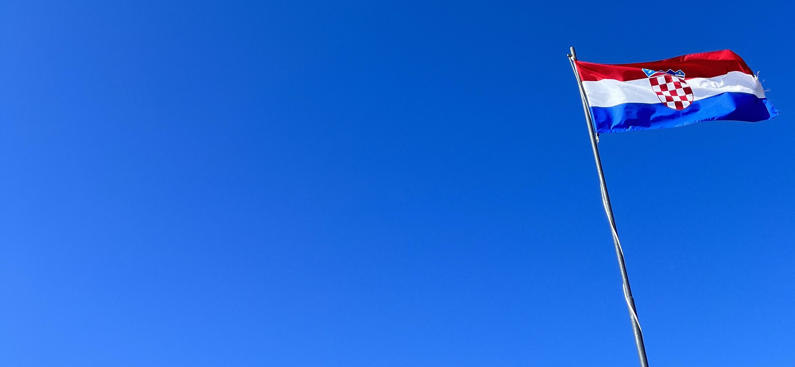
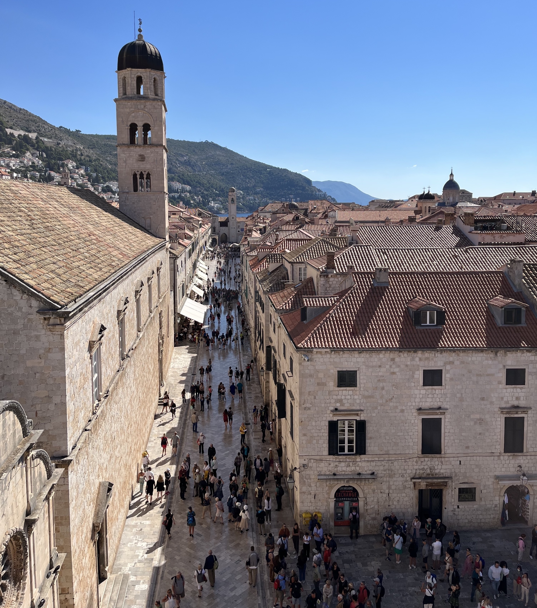
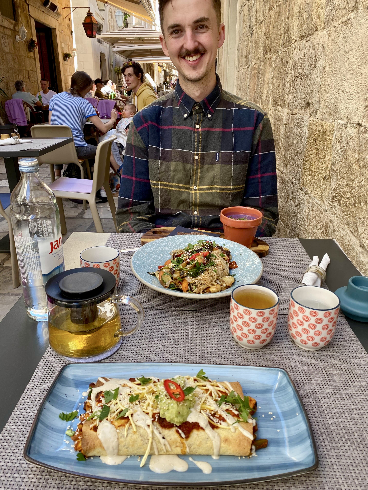
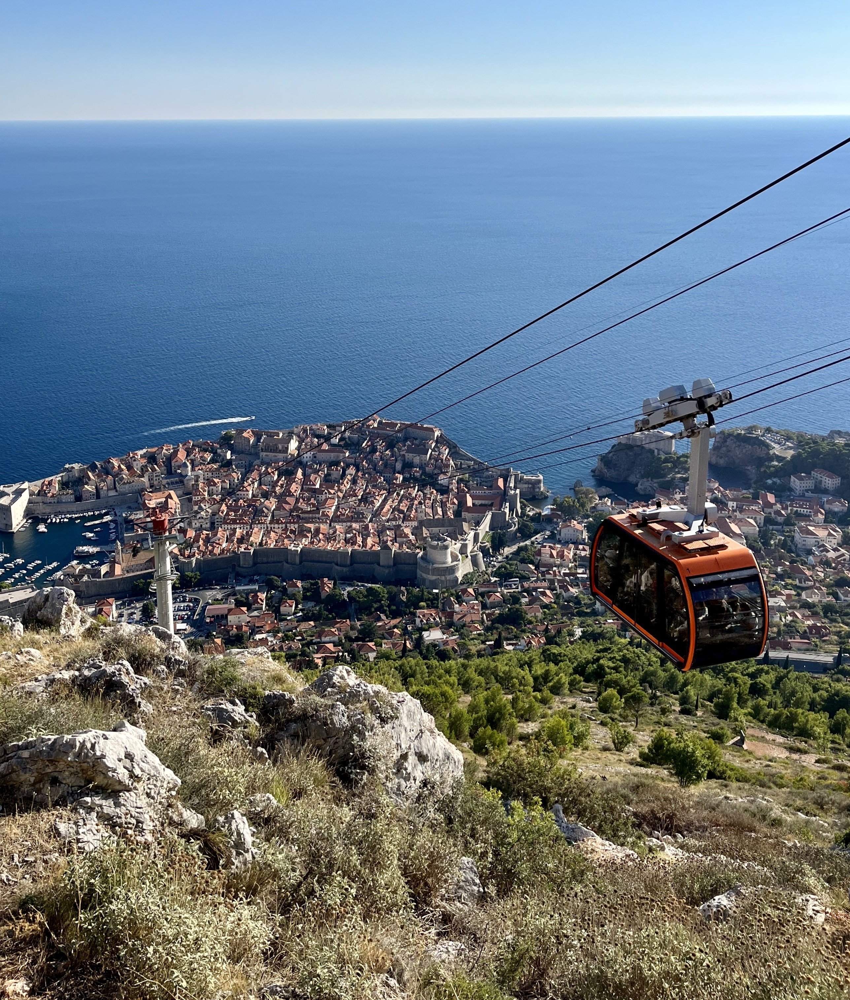
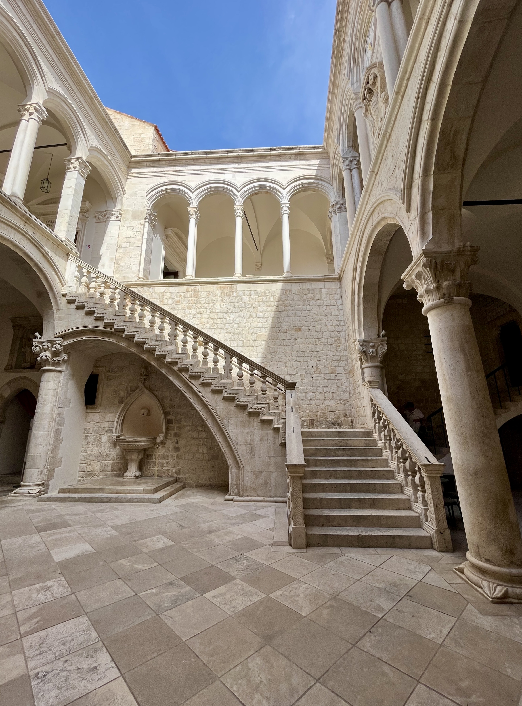
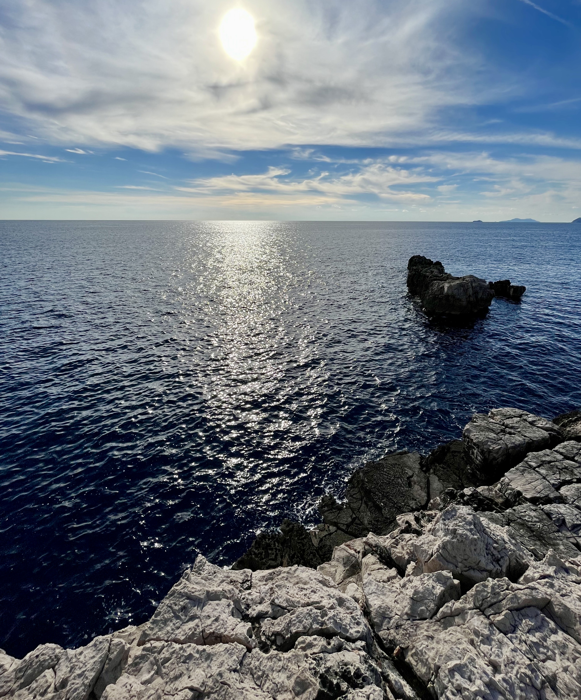

&nbsp;

Tento rok jsem absolvoval
[fotbalov칳 v칤kend v Madridu](traveling_2022_Madrid.html),
[pozn치vac칤 dovolenou ve Stockholmu](traveling_2022_Stockholm.html)
i [horsk칠 t칰ry v Dolomitech](traveling_2022_Dolomites.html).
Kdy jsem se proto p콏ed za캜치tkem l칠ta zam칳코lel, kam se vydat d치l, uv캩domil jsem
si, 쬰 jsme nem캩li napl치novanou 쮂멳nou cestu k mo콏i - pokud tedy nepo캜칤t치m
[zamrzl칳 Balt v b콏eznu](traveling_2022_Stockholm.html).
A캜 cesta k mo콏i v na코em pod치n칤 znamen치 program ve stylu "cel칳 den budeme
pozn치vat okol칤 a ve캜er si p콢jdeme na p콢l hodiny zaplavat", nep콏i코lo mi to jako
코patn칳 n치pad. A tak jsem na코el letenky do
[Dubrovn칤ku](https://cs.wikipedia.org/wiki/Dubrovn%C3%ADk).

Byly to letenky za p치r tis칤c korun a na konec z치콏i, kdy jsem
캜ekal 쬰 by ve m캩st캩 mohla u dozn칤vat hlavn칤 turistick치 sez칩na a z치rove켿 by
nemuselo b칳t takov칠 horko. Nakonec se v코ak uk치zalo, 쬰 moje o캜ek치v치n칤 se od
reality tro코ku li코ila. Pokud hlavn칤 turistick치 sez칩na dozn칤vala, tak hodn캩
pomalu. A horko u sice nebylo, ale na druhou stranu teploty klesly ke 20 춿C,
tak쬰 jsme si ani nebalili plavky a j치 byl v pr콢b캩hu na코eho pobytu r치d za
flanelovou ko코ili.

P콏esto si ale mysl칤m, 쬰 pobyt
v [Dubrovn칤ku](https://cs.wikipedia.org/wiki/Dubrovn%C3%ADk) byl super!
Posu캞te sami. :-)

&nbsp;

#### DEN 0

Ve 캜tvrtek r치no jsem se vzbudil, posn칤dal, sbalil si v캩ci do batohu a
nepl치novan캩 se vydal na men코칤 n치kup do dm drogerie. Kl치ra si toti vzpomn캩la, 쬰
n치m sch치z칤 n캩kolik hygienick칳ch p콏칤pravk콢. Asi nemus칤m popisovat jej칤 v칳raz,
kdy jsem se vr치til dom콢 a ona zjistila, 쬰 jsem na jeden ze dvou zapomn캩l. Na
mou obranu, t캩ch v캩c칤 na za콏칤zen칤 bylo to r치no v칤ce a v코echno jsem si prost캩
nezapamatoval. Cestou z drogerie jsem jel je코t캩 natankovat a tak칠 jsem se
malinko b치l, abych v rann칤 코pi캜ce zaparkoval n캩kde pobl칤 domu.

To se mi na코t캩st칤 poda콏ilo, a tak jsme se kolem 10. hodiny naskl치dali do na코칤
ko캜ky a vyrazili do [V칤dn캩](https://cs.wikipedia.org/wiki/V%C3%ADde%C5%88).
Na leti코t캩 jsme dorazili kolem poledne, a proto쬰 n치m cestou vyhl치dlo, hned po
bezpe캜nostn칤 a pasov칠 kontrole jsme zam칤콏ili do italsk칠ho fast foodu
[Ciao a Tutti](https://www.viennaairport.com/hu/utas/uezletek__ttermek/detail_shops_und_restaurants?sug_id=1393953274301).
J치 jsem si dal t캩stovinov칳 sal치t s raj캜atovou om치캜kou,
mozzarellou a hr치코kem. Kl치ra si objednala pizzu. Kdyby j칤dlo bylo tepl칠 a nest치lo
stejn캩 jako menu s pol칠vkou v [Red Piranha](https://redpiranha.cz/tydenni-menu/),
asi bych i p콏em칳코lel nad t칤m, 쬰 bych se tam p콏i dal코칤 n치v코t캩v캩 v칤de켿sk칠ho
leti코t캩 najedl znovu.

Po ne moc uspokojiv칠m ob캩d캩 n치sledoval velice uspokojiv칳 let
do [Dubrovn칤ku](https://cs.wikipedia.org/wiki/Dubrovn%C3%ADk). Moc
캜asto se mi to nest치v치, ale tentokr치t se mi kr치tce po vzletu poda콏ilo usnout a
probudil jsem se a ve chv칤li, kdy stevard oznamoval, 쬰 se chyst치me na p콏ist치n칤.
Proto쬰 to nen칤 z [V칤dn캩](https://cs.wikipedia.org/wiki/V%C3%ADde%C5%88)
do [Dubrovn칤ku](https://cs.wikipedia.org/wiki/Dubrovn%C3%ADk)
zase takov치 코treka, ob캩 v칳코e zm칤n캩n칠 ud치losti odd캩lovalo asi 30 minut.
I tak jsem byl ale r치d, 쬰 jsem si mohl p콏i cest캩 odpo캜inout.

Hned po p콏칤letu jsme si na p콏ep치쬮e koupili j칤zdenky na autobus do centra m캩sta.
Nikde jsme se potom nezdr쬺vali a hned jsme 코li obsadit dv캩 m칤sta ve voze.
Pozd캩ji se to uk치zalo jako hodn캩 dobr칳 tah. Pro 콏idi캜e toti kapacita autobusu
nebyla 쮂멳n치 m칤ra, a tak nab칤ral turisty, dokud chodili. Nakonec se tedy
obsadila v코echna sedadla i uli캜ka po cel칠 sv칠 d칠lce. Cesta do centra m캩sta sice
trvala pouze 40 minut, i tak jsem byl ale r치d, 쬰 nemus칤me st치t v uli캜ce vedle
skupinky Asijat콢, kte콏칤 si p콏ed n치stupem rad캩ji fotili autobus ze v코ech stran,
ne aby si 코li sednout.

Autobus n치m zastavil kousek od [Plo캜sk칠 br치ny](https://www.dubrovnik-travel.net/ploce-gate/),
jedn칠 ze dvou hlavn칤ch bran do star칠ho m캩sta. Po kamenn칠 cest캩 jsme se dostali
za hradby a ocitli se v 칰pln캩 jin칠m sv캩t캩. 칔zk칠 uli캜ky a b칠쬺v칠 dome캜ky s oran쬺v칳mi
st콏echami naprosto vystihovaly moji p콏edstavu
[m캩sta Kr치lovo p콏칤stavi코t캩](https://gameofthrones.fandom.com/wiki/King%27s_Landing)
ze seri치lu [Hra o tr콢ny](https://www.csfd.cz/film/263138-hra-o-truny/prehled/).
Byla to par치da! V jedn칠 z 칰zk칳ch uli캜ek jsme na코li recepci na코eho
[hotelu](https://www.booking.com/hotel/hr/apartment-coffeatus-a21.cs.html).
Tam jsme se sezn치mili s recep캜n칤 Jasm칤nou, kter치 n치m vysv캩tlila, jak to
v [hotelu](https://www.booking.com/hotel/hr/apartment-coffeatus-a21.cs.html)
chod칤. Narozd칤l od jin칳ch za콏칤zen칤, na kter칠 jsme z cest zvykl칤, maj칤 recepci
na jednom m칤st캩, konkr칠tn캩 v 말rok칠 ulici, pokoje se nach치z칤 ve vedlej코칤 ulici
Za Rokom a, aby to nebylo tak snadn칠, na sn칤dani se chod칤 do 칰pln캩 jin칠ho podniku
[Caf칠 Festival](https://www.cafefestival.com/) na hlavn칤m ulici
[Stradun](https://en.wikipedia.org/wiki/Stradun_(street)).
A캜 to m콢쬰 zn칤t slo쬴t캩, rychle jsme se zorientovali. Star칠 m캩sto je nav칤c
malink칠, tak쬰 i kdyby se 캜lov캩k cht캩l dostat z jedn칠 strany m캩sta na druhou,
cesta p캩코ky by netrvala ani 5 minut. Kdy si tedy uv캩dom칤m, 쬰 my v n치sleduj칤c칤ch
dnech chodili na sn칤dani jen do vedlej코칤 ulice, asi n치m zabralo v칤ce 캜asu sej칤t
schody v budov캩 ne samotn치 cesta po m캩st캩.

Po check-inu na recepci n치s Jasm칤na doprovodila do na코eho apartm치nu a n치sledn캩
n치m poskytla n캩kolik cenn칳ch rad k jeho u쮂셨치n칤. Nejv칤ce se mi l칤bilo, kdy se
n치s zeptala, zda um칤me nastavit kotel. My na to, 쬰 ne. Jasm칤na potom uk치zala
na mal칠 tla캜칤tko na zdi, kter칠 se nach치zelo vedle vyp칤na캜e na sv캩tlo a 콏ekla:
"Dneska jsem kotel zapla. T칤mto tla캜칤tkem se kotel vyp칤n치, tak쬰 na n캩j nesahejte
a v코echno bude v pohod캩." Kotel byl tedy nastaven. Uf. Tak to jsem si oddechl.
Po n캩kolika dal코칤ch podobn캩 u쬴te캜n칳ch rad치ch Jasm칤na ode코la a nechala n치s
vlastn칤mu osudu. My se vybalili a vyrazili na ve캜e콏i.

N캩kolik zdroj콢 chv치lilo
[restauraci Lady Pi Pi](https://www.tripadvisor.com/Restaurant_Review-g295371-d1797401-Reviews-Lady_Pi_Pi-Dubrovnik_Dubrovnik_Neretva_County_Dalmatia.html),
o kterou m치 b칳t pr칳 v [Dubrovn칤ku](https://cs.wikipedia.org/wiki/Dubrovn%C3%ADk)
takov칳 z치jem, 쬰 se na st콢l mnohdy stoj칤 dlouh칠 fronty. 콎ekli jsme si, 쬰 podnik
vyzkou코칤me, ale ve front캩 st치t nebudeme. Kdy jsme se vy코kr치bali na kopec, kde se
restaurace nach치zela, nikdo p콏ed n칤 nest치l. Po캜kali jsme tedy na 캜칤코n칤ka a ten
n치m nab칤dl na v칳b캩r ze dvou stol콢. 콎칤kal jsem si proto, 쬰 to asi zase takov치
sl치va nebude. Ne jsme si ale stihli objednat pit칤, neuhodnete, co se p콏ed
restaurac칤 za캜alo vytv치콏et... Fronti캜ka!

J치 jsem si v t칠to "supr 캜upr" restauraci objednal grilovanou rybu s fazolkami a
brambory. Kl치ra si dala vegetari치nsk칳 burger s grilovanou zeleninou a bramborov칳mi
duk치tky. P콏ekvapen칤m pro n치s bylo, kdy donesli burger a na tal칤콏i nebyla 쮂멳n치
houska. Jednalo se pouze o zeleninovou placku, tak쬰 Kl치ra si moc nepochutnala.
J치 na druhou stranu mus칤m 콏칤ct, 쬰 ryba byla vynikaj칤c칤. 콯e by ale na코e zku코enost
odpov칤dala obrovsk칳m o캜ek치v치n칤m, to se 콏칤ct ned치. Restaurace je koncipov치na jako
podnik, kde se p콏ipravuj칤 pokrmy na grilu, typick칠 pro chorvatskou kuchyni. Host칠
si mohou sednout pouze na venkovn칤 zahr치dku porostlou hust칳m b콏e캜콘anem, tak쬰,
kdy pr코칤, je zav콏eno. Tato skute캜nost samoz콏ejm캩 m콢쬰 navozovat jist칳 pocit
exkluzivity, pokud se 캜lov캩k do podniku dostane. Nav칤c jedna 캜치st restaurace
nab칤z칤 opravdu p캩kn칳 v칳hled na m캩sto, tak쬰 ch치pu, 쬰 mnoz칤 n치v코t캩vn칤ci mohou
hodnotit kladn캩 u jen to, 쬰 sed칤. Opravdu si ale  nemysl칤m, 쬰 by se jednalo
o zase tak 칰쬬sn칳 podnik, aby se vyplatilo 캜ekat v dlouh칠 front캩 na m칤sto u stolu.

Posezen칤 jsme zakon캜ili o콏칤코kov칳m dortem, kter칳 vypadal tak dob콏e, 쬰 jej cht캩l
ochutnat i p치n ze skupiny 캜ty콏 americk칳ch d콢chodc콢 sed칤c칤ch u stolu vedle n치s.
I kdy to bylo l치kav칠, my se nakonec nerozd캩lili. M칤sto toho jsme dojedli dort,
zaplatili a vyrazili na kr치tkou proch치zku po ve캜ern칤m
[Dubrovn칤ku](https://cs.wikipedia.org/wiki/Dubrovn%C3%ADk). Na pokoj
jsme se dostali kolem 20. hodiny, umyli se a 코li si po n치ro캜n칠m dni brzo lehnout.

&nbsp;

#### DEN 1

Nev칤m, 캜칤m to bylo, ale prvn칤 noc
v [Dubrovn칤ku](https://cs.wikipedia.org/wiki/Dubrovn%C3%ADk) se mi spalo skv캩le!
Vst치val jsem tedy a v 8:30 a t칤m p치dem jsem skoro zaspal domluvenou pracovn칤
akci, p콏i kter칠 jsme m캩li s kolegou Niekem v pl치nu nasadit n치코 aplika캜n칤 k칩d na produk캜n칤
prost콏ed칤. Ano, m캩l jsem sice dovolenou, ale tohle byla d콢le쬴t치 v캩c, kter치 m캩la
b칳t hotov치 v pond캩l칤 r치no. A proto쬰 jsem pot콏eboval Niekovu pomoc a Niek m캩l
v pl치nu v pond캩l칤 r치no let캩t za svoj칤 rodinou
do [Holandska](https://cs.wikipedia.org/wiki/Holandsko), napl치novali jsme
nasazen칤 na p치te캜n칤 r치no. Bohu쬰l se v캩ci nevyv칤jeli podle m칳ch p콏edstav. Po
chv칤li jsem naznal, 쬰 pokud bych to cht캩l ud캩lat po콏치dn캩, str치v칤m nad t칤m dal코칤ch
n캩kolik hodin, kter칠 jsem k dispozici nem캩l, a tak jsem po 15 minut치ch zaklapl
po캜칤ta캜 a vydal se s Kl치rou na sn칤dani do [Caf칠 Festival](https://www.cafefestival.com/).

Jen pro zaj칤mavost uvedu, 쬰 v pond캩l칤 jsem za캜al nasazovat k칩d na na코e produk캜n칤
prost콏ed칤 v 8 hodin r치no. Skon캜il jsem ve 2 hodiny odpoledne.

V [Caf칠 Festival](https://www.cafefestival.com/) jsme si dali vaje캜nou omeletu
s pe캜ivem. Naprosto up콏칤mn캩, nebyla
to 쮂멳n치 sl치va, ale n캩co tepl칠ho do 쬬ludku p콏i코lo vhod. Po sn칤dani, to u mohlo
b칳t kolem p콢l jeden치ct칠, jsme se kone캜n캩 pustili do prohl칤dky m캩sta. A pokud
v [Pa콏칤쬴](https://cs.wikipedia.org/wiki/Pa%C5%99%C3%AD%C5%BE) maj칤
[Eiffelovku](https://cs.wikipedia.org/wiki/Eiffelova_v%C4%9B%C5%BE),
v [Lond칳n캩](https://cs.wikipedia.org/wiki/Lond%C3%BDn)
[Big Ben](https://cs.wikipedia.org/wiki/Big_Ben) a
v [콎칤m캩](https://cs.wikipedia.org/wiki/%C5%98%C3%ADm)
[Koloseum](https://cs.wikipedia.org/wiki/Koloseum), tak
v [Dubrovn칤ku](https://cs.wikipedia.org/wiki/Dubrovn%C3%ADk)
maj칤 hradby, na kter칳ch jsme za캜ali. A osobn캩 si mysl칤m, 쬰 jako prvn칤
zast치vka p콏i prohl칤dce m캩sta poslou쬴ly hradby skv캩le. N치v코t캩vn칤k toti obejde
cel칠 star칠 m캩sto, pod칤v치 se na v코echny budovy z tro코ku jin칠 perspektivy a tak
n캩jak si ud캩l치 n치zor na to, kam by se potom je코t캩 r치d ve star칠m m캩st캩 pod칤val.
Krom캩 toho proch치zka nab칤z칤 skv캩l칠 v칳hledy na mo콏e, okoln칤 칰tesy a hlavn캩 na
p콏칤stav, kter칳 m치 캜lov캩k stoj칤c칤 na hradb치ch jako na dlani. Za m캩 se tedy
jednalo o jeden z highlight콢 h콏eb na코칤 dovolen칠.

&nbsp;

*Pohled z hradeb na [Stradun](https://en.wikipedia.org/wiki/Stradun_(street)),
hlavn칤 ulici ve star칠m m캩sta. V pop콏ed칤 se nach치z칤 franti코k치nsk칳 kl치코ter, na
konci ulice stoj칤 zvonice.*

&nbsp;

Druh칳m highlightem byla n치v코t캩va vegansk칠
[restaurace Nishta](https://www.nishtarestaurant.com/). Osobn캩 moc vegansk칠
podniky v 캛esku nemus칤m. I kdy jim fand칤m, v캩t코inou m치m s nimi 코patnou zku코enost.
A probl칠m je jednoduch칳 - j칤dlo mi prost캩 nechutn치, a tak, pokud nechci j칤st maso,
rad캩ji vol칤m bezmas치 j칤dla v klasick칳ch restaurac칤ch.
V [Dubrovn칤ku](https://cs.wikipedia.org/wiki/Dubrovn%C3%ADk) jsem tedy p콏ed
n치v코t캩vou vegansk칠ho podniku nem캩l moc velk치 o캜ek치v치n칤. M칤stn칤 kucha콏i m캩 ale
p콏ekvapili. J치 jsem vyzkou코el r칳쬺v칠 nudle se zeleninou a tofu. Kl치ra si objednala
tortilly s tempehem a fazolemi na mexick칳 zp콢sob. Ochutnal jsem ob캩 j칤dla a mus칤m
콏칤ct, 쬰 ka쬯칠 z nich nab칤zelo obrovskou paletu chut칤. Na코e chu콘ov칠 poh치rky byly
v sedm칠m nebi, a tak se nen칤 캜emu divit, 쬰 druh칳 den jsme cht캩li j칤t do restaurace
na ob캩d znovu!

&nbsp;

*Hladov칳 Jarda, kter칳 se chyst치 sn칤st zelnou pol칠vku serv칤rovanou v kv캩tin치캜i.*

&nbsp;

Po ob캩d캩 n치s 캜ekal druh칳 bod na코eho programu,
[pevnost Lovrijenac](https://en.wikipedia.org/wiki/Lovrijenac). Jedn치 se o
pevnost polo쬰nou na sk치le ve v칳코ce 37 metr콢 nad mo콏em. M칤stn칤 j칤 캜asto
p콏ezd칤vaj칤 "Dubrovnick칳 [Gibraltar](https://en.wikipedia.org/wiki/Gibraltar)" a
pro fanou코ky [seri치lu Hra o tr콢ny](https://www.csfd.cz/film/263138-hra-o-truny/prehled/)
je zaj칤mav치 t칤m, 쬰 poslou쬴la jako inspirace p콏i vytv치콏en칤 modelu Rud칠 ba코ty. V re치lu ale
pevnost ni캜칤m extra zaj칤mav치 nen칤. Na hradb치ch pevnosti stoj칤 p치r historick칳ch
d캩l, na jedn칠 v캩쬴 vis칤 chorvatsk치 vlajka a to je, pros칤m p캩kn캩, v코e! Samoz콏ejm캩
je nutn칠 dodat, 쬰 pevnost t캩쮂 ze sv칠ho um칤st캩n칤 naproti star칠ho m캩sta. Z hradeb
je tedy mo쬹칠 ud캩lat p캩knou fotku [Dubrovn칤ku](https://cs.wikipedia.org/wiki/Dubrovn%C3%ADk)
s okoln칤m z치livem. Ale te캞 u je to opravdu v코e.

Po n치v코t캩v캩 pevnosti jsme se vydali na k치vu do dubrovnick칠ho coffee shopu numero uno, a sice
[kav치rny Cogito](https://www.tripadvisor.com/Restaurant_Review-g295371-d12501076-Reviews-Cogito_Coffee-Dubrovnik_Dubrovnik_Neretva_County_Dalmatia.html),
kter치 je zastr캜en치 v podloub칤 kousek u p콏칤stavu. Nejsem 쮂멳n칳 znalec k치vy,
tak쬰 jen dopln칤m, 쬰 mi m칤stn칤 filtr chutnal.

N치코 odpoledn칤 program pokra캜oval kr치tk칳m v칳letem
na [horu Srd](https://en.wikipedia.org/wiki/Sr%C4%91). Na ni se lze
dostat lanovkou. Zp치te캜n칤 j칤zdenku jsme po콏칤dili za 200 kun, co podle m캩 nen칤
쮂멳n치 l치ce, ale na druhou stranu to st치lo za to. I p캩tilet칳 klu캜ina, kter칳 st치l
v kabin캩 lanovky celou cestu vedle n치s, za캜al po p콏칤jezdu do c칤le 콏v치t na v코echny
strany: "Tati, to byla super j칤zda! Tati, to bylo 칰쬬sn칳!" Maminka, kter치 se celou
cestu d칤vala do zem캩, jeho nad코en칤 nesd칤lela. Mn캩 se ale 10minutov치 vyhl칤dkov치
cesta l칤bila.

Na vrcholku hory si turist칠 mohou zakoupit adrenalinov칳 z치쬴tek v podob캩 proj칤쮃끎y
buginou, nebo svezen칤 na zipline. Ti m칠n캩 odv치쬹칤 mohou vyu쮂셦 nab칤dky pokrm콢
v [restauraci Panorama](https://www.nautikarestaurants.com/panorama-restaurant-bar/).
My jsme nezvolili ani jedno. M칤sto toho jsme si pro코li cel칳
are치l a n캩jakou dobu se kochali n치dhern칳m v칳hledem na star칠 m캩sto i nedalek칳 ostrov
[Lokrum](https://cs.wikipedia.org/wiki/Lokrum).

&nbsp;

*Lanovka jedouc칤 na horu Srd.*

&nbsp;

Po n치vratu zp캩t do historick칠ho centra m캩sta jsme si za코li na ve캜e콏i do
[trattorie Carmen](http://www.trattoria-carmen-dubrovnik.com/). J치 jsem
si objednal pizzu Carmen, kter치 obsahovala prosciutto, mozzarellu,
lan칳쬰 a rukolu. Kl치ra zvolila dom치c칤 t캩stoviny s raj캜atovou om치캜kou a mozzarellu.
Bohu쬰l tato volba se j칤 nejevila jako ta nej코콘astn캩j코칤, tak쬰 jsem si s n칤, pro
klid v rodin캩, j칤dlo vym캩nil. Mn캩 to ale nevadilo, proto쬰 mi moc chutnalo
oboj칤 - jak pizza, tak dom치c칤 t캩stoviny. Jako dezert jsem si dal vynikaj칤c칤 panna
cottu s ovocem, kter치 hezky doplnila u tak p콏칤jemnou n치v코t캩vu mal칠ho rodinn칠ho
podniku.

Po ve캜e콏i u n치s 쮂멳n칳 program ne캜ekal, tak쬰 jsme se je코t캩 pro코li po centru m캩sta
a pot칠 se pomalu p콏esunuli na [hotel](https://www.booking.com/hotel/hr/apartment-coffeatus-a21.cs.html).

&nbsp;

#### DEN 2

Druh칳 den v [Dubrovn칤ku](https://cs.wikipedia.org/wiki/Dubrovn%C3%ADk)
jsme zase nikam nesp캩chali. Vstali jsme kolem 8. hodiny,
za코li si na sn칤dani a potom vyrazili na prohl칤dku nejv칳znamn캩j코칤ch pam치tek star칠ho
m캩sta.

Vid캩li jsme:

- [Onofriovu font치nu](https://www.dubrovnik-travel.net/onofrios-fountain/),
- [franti코k치nsk칳 kl치코ter](https://en.wikipedia.org/wiki/Franciscan_friary,_Dubrovnik),
- [kostel sv. Bla쬰je](https://www.dubrovnik-travel.net/church-of-saint-blaise/),
- [zvonici](https://www.dubrovnik-travel.net/clock-tower/),
- [Rektorsk칳 pal치c](https://www.dubrovnik-travel.net/knezev-dvor-rectors-palace/),
- [katedr치la Nanebevzet칤 Panny Marie](https://www.dubrovnik-travel.net/dubrovnik-cathedral/),
- [kostel sv. Ign치ce](https://www.cestujlevne.com/pruvodce/chorvatsko/dubrovnik/kostel-sv-ignace).

U ka쬯칠 pam치tky jsme si p콏e캜etli kr치tk칳 popisek z na코eho kapesn칤ho pr콢vodce. Do
kostel콢 jsme se 코li pod칤vat a do rektorsk칠ho pal치ce jsme si zaplatili vstup.

Jak u n치zev napov칤d치,
[rektorsk칳 pal치c](https://www.dubrovnik-travel.net/knezev-dvor-rectors-palace/)
je budova, ve kter칠 쬴l rektor m캩sta. Dnes
slou쮂 jako muzeum. N치v코t캩vn칤ci mohou v interi칠ru vid캩t obrazy chorvatsk칳ch
um캩lc콢, sochy patrona [Dubrovn칤ku](https://cs.wikipedia.org/wiki/Dubrovn%C3%ADk)
sv. Bla쬰je nebo historick칠 spisy. Mn캩 nejv칤ce
zaujalo n치dvo콏칤 pal치ce, ve kter칠m se nat치캜ela sc칠na
[seri치lu Hra o tr콢ny](https://www.csfd.cz/film/263138-hra-o-truny/prehled/), ve
kter칠 jde kr치lovna [Daenerys Targaryen](https://cs.wikipedia.org/wiki/Daenerys_Targaryen)
쮂멳at Kr치le ko콏en칤 o to, aby j칤 p콢j캜il lod캩.

&nbsp;

*N치dvo콏칤 rektorsk칠ho pal치ce.*

&nbsp;

Po prohl칤dce m캩sta jsme se vydali na ob캩d do na코칤 obl칤ben칠
[restaurace Nishta](https://www.nishtarestaurant.com/).
Bohu쬰l jsme p콏i코li v dob캩, kdy v podniku nem캩li m칤sto, a tak jsme museli j칤t
jinam. Nakonec jsme vybrali burgr치rnu [Guloso](https://www.guloso.com.hr/),
kde se chlubili t칤m, 쬰 prod치vaj칤
nejlep코칤 burgery v cel칠m [Chorvatsku](https://cs.wikipedia.org/wiki/Chorvatsko).
Jejich recepty toti vyhr치ly sout캩
Zagreb Hamburger festival 2021, a tak jsme si 콏ekli, 쬰 podnik vyzkou코칤me.
Sed캩li jsme venku na k콏iv칠 dla쬭캩, padal jsem po콏치d dop콏edu a batoh jsem musel
m칤t na z치dech, proto쬰 na barov칠 stoli캜ce si ho nebylo kam odlo쬴t. Pohodl칤 nic
moc. Kdy ale p콏inesli j칤dlo, to byl jin칳 p콏칤b캩h. J치 jsem vyzkou코el v칤t캩ze v칳코e
zm칤n캩n칠ho festivalu. Jednalo se o hov캩z칤 burger v bramborov칠 bulce se slaninou,
zelenou paprikou a mlad칳m s칳rem "코kripavac", kter칳 se pod치val s hranolky a ke캜upem.
Toho s칳ra tam bylo opravdu poctiv캩, tak쬰 by se j칤dlo dalo p콏irovnat k takov칠mu
cheeseburgeru na chorvatsk칳 zp콢sob. A bylo to nebe v hub캩!

Po vynikaj칤c칤m ob캩d캩 n치s 캜ekala n치v코t캩va druh칠ho muzea. Jednalo se o
[War Photo Limited](https://www.warphotoltd.com/), muzeum v치le캜n칳ch fotografi칤.
Muzeum bylo rozd캩leno na dv캩 patra. V tom prvn칤m byla v칳stava fotografi칤 z
[Libanonsk칠 ob캜ansk칠 v치lky](https://cs.wikipedia.org/wiki/Libanonsk%C3%A1_ob%C4%8Dansk%C3%A1_v%C3%A1lka),
kter치 prob칤hala v letech 1975 a 1990 mezi k콏es콘anskou a muslimskou 캜치st칤 obyvatel zem캩.
Druh칠 patro muzea bylo v캩novan칠 [v치lce v Jugosl치vii](https://cs.wikipedia.org/wiki/V%C3%A1lka_v_Jugosl%C3%A1vii)
z konce minul칠ho stolet칤, kter치 vedla k rozpadu Jugosl치vie. V t칠to sekci se
nach치zely i fotografie [Dubrovn칤ku](https://cs.wikipedia.org/wiki/Dubrovn%C3%ADk).
Na nich bylo vid캩t, 쬰 m캩sto bylo v dob캩 konfliktu bombardov치no a velk치 v캩t코ina
historick칠ho centra byla po코kozena. Po skon캜en칤 v치lky p콏ijelo
do [Dubrovn칤ku](https://cs.wikipedia.org/wiki/Dubrovn%C3%ADk) mnoho
dobrovoln칤k콢, kte콏칤 se zaslou쬴li o rekonstrukci m캩sta a zachov치n칤 jeho
historick칠ho r치zu.

Po kr치tk칠 zast치vce na k치vu jsme se vydali do p콏칤stavu. Tam jsme si koupili l칤stky
na lo캞 a jeli se pod칤vat na ostrov [Lokrum](https://cs.wikipedia.org/wiki/Lokrum). Ostrov se nach치z칤 necel칳 kilometr
jihov칳chodn캩 od [Dubrovn칤ku](https://cs.wikipedia.org/wiki/Dubrovn%C3%ADk).
Po vylod캩n칤 jsme se pro코li po tamn칤 p콏칤rodn칤
rezervaci, pokochali se v칳hledem na mo콏e ze skalnat칳ch 칰tes콢 a pro코li se po rajsk칠
cest캩 a ke kr치lovsk칠 pevnosti, kde se n치m naskytl n치dhern칳 pohled
na [Dubrovn칤k](https://cs.wikipedia.org/wiki/Dubrovn%C3%ADk).

&nbsp;

*V칳hled na mo콏e ze skalnat칳ch 칰tes콢 na ostrov캩 [Lokrum](https://cs.wikipedia.org/wiki/Lokrum).*

&nbsp;

P콏ed 코estou hodinou jsme se nalodili na spoj zp캩t na pevninu a za코li na ve캜e콏i
do bosensk칠 [restaurace Taj mahal](https://tajmahal-dubrovnik.com/).
Ano, bosensk칠 restaurace. A ano, jmenuje se Taj mahal.
Proto쬰 se jednalo o n치코 posledn칤 ve캜er, rozhodli jsme se,
쬰 se malinko roz코oupeneme. J치 jsem si dal jehn캩캜칤 v칳var a telec칤 steak
s cibulovo-ho콏캜i캜nou krusti캜kou, grilovanou zeleninou a b칤l칳m chlebem.
Kl치ra si na p콏edkrm objednala 캜erstv칳 sma쬰n칳 kobl칤쬰k se s칳rem a jako hlavn칤
chod si vybrala masov칠 kuli캜ky s ma캜kan칳mi brambory. Podnik se mi opravdu l칤bil
a j칤dlo mi moc chutnalo, tak쬰 v코em budouc칤m n치v코t캩vn칤k콢m
[Dubrovn칤ku](https://cs.wikipedia.org/wiki/Dubrovn%C3%ADk) doporu캜uji!

Po j칤dle jsme se je코t캩 pro코li po m캩st캩 a dali si zmrzlinu v
[Peppino's Gelato](https://peppinosgelato.com/), nejlep코칤
zmrzlin치rn캩 v [Dubrovn칤ku](https://cs.wikipedia.org/wiki/Dubrovn%C3%ADk).
J치 jsem zkusil p콏칤chu콘 tiramisu, Kl치ra kinder maxi king.

Na pokoj jsme dorazili kolem 20. hodiny, umyli se a 코li si lehnout, abychom
nabrali s칤ly p콏ed cestou dom콢, kter치 n치s dal코칤 den 캜ekala.

&nbsp;

#### DEN 3

Posledn칤 den v [Dubrovn칤ku](https://cs.wikipedia.org/wiki/Dubrovn%C3%ADk)
jsme se vzbudili v 5 hodin, sbalili si v캩ci a vyrazili
na cestu dom콢. Dost m캩 p콏ekvapilo, kdy se hned na poschod칤 pod n치mi otev콏ely
dve콏e a z nich na n치s koukal mlad칳 mu v trenk치ch. O캜ividn캩 rozespal칳 se n치s
siln칳m britsk칳m p콏칤zvukem zeptal: "Are you off?" J치 jsem tro코ku vyd캩코en캩
odpov캩d캩l: "Yes," a hned jsem dodal: "why?" Cel치 situace se vysv캩tlila ve
chv칤li, kdy odv캩til: "You were extremely loud!" Pot칠 zav콏el dve콏e a mn캩 bylo
tro코ku l칤to, 쬰 jsme vzbudili tohoto mlad칠ho Angli캜ana, kdy jsme se r치no balili.

V pek치rn캩 mlinar, kter치 m치 otev콏eno non-stop, jsme si koupili sn칤dani a
pokra캜ovali jsme za hradby star칠ho m캩sta k Pilsk칠 br치n캩, kde na n치s u 캜ekal n치코
taxik치콏. Za necelou p콢lhodinu jsme dorazili s velk칳m 캜asov칳m p콏edstihem na
leti코t캩. A proto쬰 tam nikdo nebyl, 칰pln캩 v klidu jsme pro코li bezpe캜nostn칤 i
pasovou kontrolou, sedli jsme si do jedn칠 z kav치ren a sn캩dli pe캜ivo, kter칠 jsme
si koupili v centru.

Let prob캩hl naprosto v klidu. Ve [V칤dni](https://cs.wikipedia.org/wiki/V%C3%ADde%C5%88)
jsme vyzvedli auto a kolem poledne jsme u byli doma.

&nbsp;

#### DOJMY Z DUBROVN칈KU

- Do [Dubrovn칤ku](https://cs.wikipedia.org/wiki/Dubrovn%C3%ADk) jsem se hodn캩
t캩코il, ale na druhou stranu jsem 캜ekal tro코ku v캩t코칤
[Balk치n](https://cs.wikipedia.org/wiki/Balk%C3%A1n). Byl jsem tedy
velice p콏칤jemn캩 p콏ekvapen칳, kdy jsme dorazili do malebn칠ho
캜ist칠ho m캩ste캜ka s p캩kn칳mi silnicemi a dobrou infrastrukturou.
- Na ka쬯칠m kroku se nach치z칤 ofici치ln칤 obchod s t칠matikou seri치lu
[Hra o tr콢ny](https://www.csfd.cz/film/263138-hra-o-truny/prehled/).
- Pek치rna mlinar m치 otev콏eno 24/7.
- Z jednoho konce star칠ho m캩sta na druh칳 konec 캜lov캩k dojde za 5 minut.
- V [Dubrovn칤ku](https://cs.wikipedia.org/wiki/Dubrovn%C3%ADk) se mi opravdu moc
l칤bilo. Jeho n치v코t캩vu bych ka쬯칠mu doporu캜il!

&nbsp;

#### FOTKY

Fotky z [Dubrovn칤ku](https://cs.wikipedia.org/wiki/Dubrovn%C3%ADk)
najdete [zde](https://photos.app.goo.gl/XYkVTMt1PxawfiYd7).
