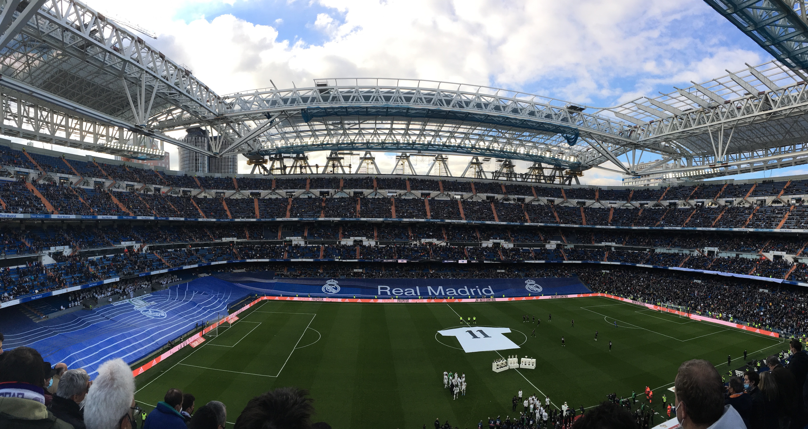

&nbsp;

U del코칤 dobu jsme se s Kubou bavili o tom, 쬰 bychom mohli po vzoru
[v칳letu do Barcelony](traveling_2019_Barcelona.html) zase sbalit na코e p콏칤ru캜n칤
zavazadla a vyrazit n캩kam za sportem. Vysn캩n칠 destinace byly
jasn칠 - [Anglie](https://cs.wikipedia.org/wiki/Anglie) a
[Madrid](https://cs.wikipedia.org/wiki/Madrid).
Z치rove켿 jsme se shodli na tom, 쬰 pokud u n캩kam pojedeme, bylo by dobr칠 zkusit
naj칤t v칤kend, kdy se v dan칠 lokalit캩 bude hr치t v칤ce ne jedno utk치n칤. A proto쬰
[COVIDov치](https://cs.wikipedia.org/wiki/Covid-19) opat콏en칤 byla touto dobou
v [Anglii](https://cs.wikipedia.org/wiki/Anglie) dost p콏칤sn치, v칳b캩r se relativn캩
rychle omezil pouze na hlavn칤 m캩sto
[맗an캩lska](https://cs.wikipedia.org/wiki/%C5%A0pan%C4%9Blsko).

Oba jsme v캩d캩li o tom, 쬰 ide치ln칤m term칤nem pro n치코 trip bude t콏et칤 v칤kend v lednu.
V sobotu hraje [Atl칠tico](https://cs.wikipedia.org/wiki/Atl%C3%A9tico_Madrid)
a v ned캩li zase [Real](https://cs.wikipedia.org/wiki/Real_Madrid).
Kde by mohl b칳t probl칠m? Pro m캩 osobn캩 to byly finance. Kombinace V치noc, nov칠ho
auta a jin칳ch dovolen칳ch si vybrala svoji da켿. A to nemluv칤m o
[dani z p콏칤jmu fyzick칳ch osob](https://cs.wikipedia.org/wiki/Da%C5%88_z_p%C5%99%C3%ADjm%C5%AF_fyzick%C3%BDch_osob),
kter치 p콏ijde na ja콏e. Mn캩 osobn캩 se tedy necht캩lo takhle rychle zase utr치cet
dal코칤 pen칤ze, a tak jsem tento v칳let moc netla캜il.

To se ale zm캩nilo v pond캩l칤. Kdy na m캩 vysko캜ila ak캜n칤 nab칤dka na letenky do
[Madridu](https://cs.wikipedia.org/wiki/Madrid), p콏i코lo mi, 쬰 mi osud nazna캜uje,
쬰 tahle p콏칤le쬴tost se taky nemus칤 opakovat.
Vypadalo to, 쬰 v코echno sed칤. Proto jsem se docela rychle pro v칳let nadchnul, zvedl
jsem telefon a zavolal Kubovi, zda do toho jdeme. Jinou odpov캩캞 ne "ano" jsem
up콏칤mn캩 ne캜ekal. Kuba je prost캩 klasick칳 Yes man, kter칳 쮂멳n칳 v칳let za kvalitn칤m
fotbalem neodm칤t치. Dal코칤m takov칳m Yes manem je Alberta. Na코e parta byla tedy
kompletn칤 a mohlo se vyrazit.

&nbsp;

#### DEN 0

Vlak do [V칤dn캩](https://cs.wikipedia.org/wiki/V%C3%ADde%C5%88) n치m odj칤쬯캩l v 8:48,
sraz na n치dra쮂 jsme m캩li v 8:30.
Kdy jsem se tedy vzbudil v 6:30, po콏치d jsem si 콏칤kal, 쬰 m치m hodn캩 캜asu. Jak
to tak ale v캩t코inou b칳v치, kdy m치 캜lov캩k hodn캩 캜asu, nakonec jsem v콢bec nest칤hal,
a tak jsem musel celou cestu z domu na 코alinu b캩쬰t. 칔pln캩 propocen칳 jsem dorazil
na n치dra쮂, kde u m캩 캜ekal zbytek moj칤 crew. Mo쬹치 jsem m캩l jazyk na vest캩, ale
taky jsem se usm칤val od ucha k uchu, proto쬰 jsem je r치d vid캩l a up콏칤mn캩 jsem se
hrozn캩 moc t캩코il na to, co n치s 캜ek치.

N치코 spoj jel na 캜as. Kdy jsem ale p콏ijeli na
[v칤de켿sk칠 n치dra쮂셓(https://cs.wikipedia.org/wiki/Wien_Hauptbahnhof), zjistili jsme,
쬰 navazuj칤c칤 vlak na [leti코t캩](https://cs.wikipedia.org/wiki/Leti%C5%A1t%C4%9B_V%C3%ADde%C5%88)
m치 zpo쬯캩n칤. A to se postupn캩 navy코ovalo. 콎ekli jsme
si, 쬰 po캜k치me 15 minut a pokud vlak nep콏ijede, pojedeme
[Uberem](https://cs.wikipedia.org/wiki/Uber). Ten nakonec nebyl
pot콏eba. Ale nebudu nikomu nic nalh치vat, spoje jsme m캩li napl치novan칠 relativn캩
na t캩sno, tak쬰 zpo쬯캩n칤 jednoho z nich n치s tro코ku vyklepalo.

Na [leti코ti](https://cs.wikipedia.org/wiki/Leti%C5%A1t%C4%9B_V%C3%ADde%C5%88) jsme
pro코li bezpe캜nostn칤 kontrolou, dali si malou sva캜inku v podob캩
bagety a nastoupili do letadla. N치sledoval 2,5 hodiny dlouh칳 let, kter칳 pro m캩 byl
neobvykl칳 hned z n캩kolika d콢vod콢.

1. Asi 30 minut po vzletu do oblak n치s zas치hly na m콢j vkus dost siln칠 turbulence.
Netrvaly dlouho, ale s letadlem to h치zelo doprava, doleva, nahoru i dol콢. Byly
to rozhodn캩 ty nejsiln캩j코칤 turbulence, kter칠 jsem kdy za쬴l a na rovinu 콏칤k치m, 쬰
to nebylo nic p콏칤jemn칠ho.
2. Sed캩l jsem na m칤st캩 u ok칳nka a dlouho chv칤li jsem si kr치til pozorov치n칤 krajiny
pod n치mi. Asi 45 minut jsme p콏el칠tali nad [Alpami](https://cs.wikipedia.org/wiki/Alpy),
nad kter칳mi se nevyskytovaly 쮂멳n칠 mraky, tak쬰 viditelnost byla vynikaj칤c칤.
Jen jsem sed캩l a s otev콏en칳mi 칰sty obdivoval n치dhern칠 p콏칤rodn칤 scen칠rie.
3. Po [Alp치ch](https://cs.wikipedia.org/wiki/Alpy) p콏i코la
[Marseille](https://cs.wikipedia.org/wiki/Marseille). V pr콢b캩hu letu
jsem nev캩d캩l, o jak칠 velkom캩sto se jedn치, ale dost specifick치 st콏echa
[fotbalov칠ho stadionu](https://en.wikipedia.org/wiki/Stade_V%C3%A9lodrome) a
[캜lenit칠 pob콏e쮂셓(https://www.google.com/maps/place/Marseille,+Francie/@43.2802598,5.2405647,11z/data=!3m1!4b1!4m5!3m4!1s0x12c9bf4344da5333:0x40819a5fd970220!8m2!3d43.296482!4d5.36978)
byly dobr칳mi indiciemi p콏i n치sledn칠m hled치n칤 n치zvu velkom캩sta, nad kter칳m jsme p콏el칠tali.
4. Po p콏ist치n칤 na [Barajas](https://cs.wikipedia.org/wiki/Leti%C5%A1t%C4%9B_Adolfa_Su%C3%A1reze)
jsme asi 15 minut jezdili po ranveji, ne jsme na코li
vhodn칠 "parkovac칤 m칤sto" pro na코e letadlo. V pr콢b캩hu t칠to doby si jedna na코e
spolucestuj칤c칤 sed칤c칤 o p치r 콏ad p콏ede mnou zapnula telefon a podle Kubov칳ch slov
zjistila, 쬰 n캩kdo j칤 bl칤zk칳 le쮂 v nemocnici. N치sledovalo naprost칠 nervov칠
zhroucen칤. Pan칤 se hlasit캩 rozbre캜ela a za캜ala na cel칠 letadlo vyk콏ikovat
"Porque? Porque?" Jej칤 partner vzal n치vod na postup v krizov칳ch situac칤ch, kter칳
na코el v s칤콘ce sedadla p콏ed n칤m a za캜al ji ov칤vat a uklid켿ovat. Moc to ale nepomohlo.

Do [Madridu](https://cs.wikipedia.org/wiki/Madrid) jsme p콏ilet캩li kolem 16. hodiny
a up콏칤mn캩 m캩 p콏ekvapilo m칤stn칤 po캜as칤.
Na obloze jsem sice nena코el jedin칳 mr치캜ek, ale bylo relativn캩 chladno. Kdy jsme
st치li na zast치vce a 캜ekali na leti코tn칤 autobus, kter칳 n치s m캩l zav칠st do centra,
dalo se to vydr쬰t i v mikin캩. Ale situace se zhor코ila v autobuse. Ne moc chyt콏e
jsme si toti sedli do jeho zadn칤 캜치sti, kde byla otev콏en치 okna, tak쬰 cestou to
tam sypalo jako bl치zen. Zat칤mco j치 jsem klepal kosu, ostatn칤m 맗an캩l콢m to evidentn캩
v콢bec nevadilo. A Kuba ani Bert nem캩li z치jem situaci 콏e코it. C칤til jsem, 쬰 pokud
n캩co neud캩l치m, v tom autobuse zmrznu. Zajistil jsem proto okna na na코칤 stran캩
vozu a n치sledn캩 jsem svoj칤 l치manou 코pan캩l코tinou poprosil se켿ora sed칤c칤ho naproti
p콏es uli캜ku, aby ud캩lal to stejn칠 u sebe. A bylo teplo, nebo alespo켿 tepleji.

Po 30 minut치ch jsme vystoupili na
[Plaza de Cibeles](https://es.wikipedia.org/wiki/Plaza_de_Cibeles), vyfotili si
ka코nu, kde fotbalist칠 [kr치lovsk칠ho klubu](https://cs.wikipedia.org/wiki/Real_Madrid)
slav칤 ka쬯칳 titul se sv칳mi fanou코ky a p캩코ky
pokra캜ovali na [Puerta del Sol](https://cs.wikipedia.org/wiki/Puerta_del_Sol),
odkud u to bylo jen kousek do na코eho
[hotelu](https://www.booking.com/hotel/es/hotelvictoria.cs.html).
Po vybalen칤 v캩c칤 jsme se p콏evl칠kli a vyrazili do v칤ru velkom캩sta. Proto쬰 jsme
u m캩li hlad, na코칤 prvn칤 zast치vkou byl tapas bar
[El Matador](https://www.tripadvisor.com/Restaurant_Review-g187514-d990964-Reviews-Matador-Madrid.html).
Tam jsme si dali pivo a sd칤len칳 tal칤콏 pln칳 tapas v podob캩 nakr치jen칳m jamon콢,
choriz a salchichon콢. K uzenin치m se pod치vala bagetka a tzv. pequitos, neboli
mal칠 k콏upky z b칤l칠ho t캩sta ve tvaru mal칳ch roztomil칳ch rohl칤캜k콢.

Kdy jsme byli najezen칤, tro코ku jsme zrekognoskovali okol칤 na코eho
[hotelu](https://www.booking.com/hotel/es/hotelvictoria.cs.html).
Pro코li jsme se na [Puerta del Sol](https://cs.wikipedia.org/wiki/Puerta_del_Sol)
a [Plaza Mayor](https://cs.wikipedia.org/wiki/Plaza_Mayor). Proto쬰 u ale bylo relativn캩 dost
hodin, nasedli jsme na metro a jeli na zast치vku Las Rojas, odkud jsme pokra캜ovali
p캩코ky na stadion [Atl칠tica Madrid](https://cs.wikipedia.org/wiki/Atl%C3%A9tico_Madrid)
zvan칳 [Wanda Metropolitano](https://en.wikipedia.org/wiki/Metropolitano_Stadium). Cestou jsme se
zastavili u m칤stn칤ho fotbalov칠ho h콏i코t캩 "za bar치kem", kam si p콏i코la zakopat skupina
p콏치tel. Kdy to porovn치m s na코imi v칳kony na fotb치lku, 코pan캩l코t칤 borci byli 칰pln캩
jinde. A mysl칤m, 쬰 vy코코칤 칰rovn캩 dosahovalo i jejich h콏i코t캩. V porovn치n칤 s um캩lou tr치vou ve
[vy코kovsk칠m parku](https://mapy.cz/zakladni?x=16.9930440&y=49.2827819&z=17&source=base&id=1921307)
se ta jejich zd치la mnohem zelen캩j코칤. Nev칤m, zda to tak
ale skute캜n캩 je, nebo si to jen namlouv치m. Co ale v칤m naprosto jist캩, je
skute캜nost, 쬰 jim se za rohem nach치z칤
[sv캩tov칳 stadion](https://en.wikipedia.org/wiki/Metropolitano_Stadium), na kter칠m
se ka쬯ou sez칩nu hraje
[Liga Mistr콢](https://cs.wikipedia.org/wiki/Liga_mistr%C5%AF_UEFA) (v roce 2019 dokonce jej칤
[fin치le](https://www.eurofotbal.cz/liga-mistru/2018-2019/reportaz/tottenham-hotspur-liverpool-fc-561847/)), zat칤mco
n치m se za rohem nach치z칤
[atletick칳 ov치l s pa쬴tem](https://www.vyskov-mesto.cz/atleticky-a-fotbalovy-stadion/os-94795),
kter칳 nevyhovuje ani n치rok콢m
[druh칠 nejvy코코칤 fotbalov칠 sout캩쬰 v 캛esku](https://www.fnliga.cz/), a tak
[n치코 klub](https://mfkvyskov.cz/) mus칤 hr치t
v [Drnovic칤ch](https://cs.wikipedia.org/wiki/Sportovn%C3%AD_are%C3%A1l_Drnovice).

Na [stadionu](https://en.wikipedia.org/wiki/Metropolitano_Stadium) jsme nav코t칤vili
fan shop, kde jsme nic nevybrali, a koupili si druhou
ve캜e콏i v podob캩 [tortilla de patatas](https://sk.wikipedia.org/wiki/Tortilla_de_patatas).
Na m칤sta jsme dorazili s p콏edstihem, tak쬰
jsme byli sv캩dkem p콏edstaven칤
[sestav](https://www.livesport.cz/zapas/4rKp6Vfq/#prehled-zapasu/sestavy) a jmen
rozhod캜칤ch. Osobn캩 m캩 dost mrzelo, 쬰 byl zran캩n칳
[Antoine Griezmann](https://www.livesport.cz/hrac/griezmann-antoine/OxCa1jdT/), tak쬰
jsme nevid캩li v akci nejv캩t코칤 sou캜asnou hv캩zdu klubu.
Nicm칠n캩 i bez [francouzsk칠ho 코p칤lmachra](https://www.livesport.cz/hrac/griezmann-antoine/OxCa1jdT/)
byla sestava dom치c칤ch pln치 velk칳ch jmen. Mohli jsme tak vid캩t t콏eba kapit치na
[Kokeho](https://www.livesport.cz/hrac/koke/v9hLv1xJ/), vych치zej칤c칤 hv캩zdu portugalsk칠 reprezentace
[Joao Felixe](https://www.livesport.cz/hrac/joao-felix/KI3YXMhi/), kontroverzn칤ho
[Luise Suareze](https://www.livesport.cz/hrac/suarez-luis/dUShzrBp/), brank치콏skou st치lici
dom치c칤ch v podob캩 [Jana Oblaka](https://www.livesport.cz/hrac/oblak-jan/SYy8ZHN9/), nebo
hv캩zdu z치pasu [Yannicka Carrasca](https://www.livesport.cz/hrac/carrasco-yannick/lzccuuAC/).

Na [Wandu Metropolitano](https://en.wikipedia.org/wiki/Metropolitano_Stadium) p콏ijela
v r치mci 21. kola [코pan캩lsk칠 ligy](https://www.laliga.com/en-GB)
[Valencia](https://cs.wikipedia.org/wiki/Valencia_CF), kterou p콏ed z치pasem d캩lily
v tabulce pouze 캜ty콏i body od
[dom치c칤ho mu쬽tva](https://cs.wikipedia.org/wiki/Atl%C3%A9tico_Madrid). S klukama jsme
proto o캜ek치vali vyrovnan칠 utk치n칤. I podle bookmaker콢 bylo ale favorizov치no
[Atl칠tico](https://cs.wikipedia.org/wiki/Atl%C3%A9tico_Madrid). Nicm칠n캩 prvn칤
polo캜as ani jedn칠 z p콏edpov캩d칤 moc nenahr치val. Dom치c칤 se nedost치vali do 코anc칤
a host칠 je naopak prom캩켿ovali. Do 코aten se tedy 코lo za stavu 0:2.

Po p콏est치vce ale p콏i코ly velk칠 zm캩ny. Tren칠r
[Diego Simeone](https://cs.wikipedia.org/wiki/Diego_Simeone) st치hl
[Joao Felixe](https://www.livesport.cz/hrac/joao-felix/KI3YXMhi/), kter칠ho
jsme do t칠 doby hodnotili jako jednoho z nejlep코칤ch hr치캜콢 v dresu 캜ervenob칤l칳ch, a
nahradil ho [Matheusem Cunhou](https://www.livesport.cz/hrac/cunha-matheus/bq5QzRdb/),
hr치캜em, o kter칠m jsem do t칠 doby nesly코el. Pr치v캩
[brazilsk칳 rod치k](https://www.livesport.cz/hrac/cunha-matheus/bq5QzRdb/) se ale
po rohov칠m kopu dostal k propadl칠mu m칤캜i a v 64. minut캩 vst콏elil kontaktn칤 g칩l.

N치sledn캩 za캜ala [Valencia](https://cs.wikipedia.org/wiki/Valencia_CF)
hodn캩 kouskovat hru a zdr쬺vat, co se nel칤bilo dom치c칤m fanou코k콢m. Poka쬯칠,
kdy n캩kdo z hostuj칤c칤ho t칳mu z콢stal po souboji le쬰t na zemi,
sly코el jsem kolem sebe slova jako cabr칩n, nebo puta. Prost캩 nic p캩kn칠ho.
Temperamentn칤 맗an캩l칠 m캩 ale bavili a z치rove켿 vytv치콏eli skv캩lou atmosf칠ru pro
sledov치n칤 fotbalu. Nicm칠n캩 ani povzbuzov치n칤 m칤stn칤ch p콏칤znivc콢 nepomohlo hr치캜콢m
[Atl칠tica](https://cs.wikipedia.org/wiki/Atl%C3%A9tico_Madrid) vst콏elit
v 90 minut치ch dal코칤 g칩l zaru캜uj칤c칤 alespo켿 bod. Na druhou stranu
v코ichni na [stadionu](https://en.wikipedia.org/wiki/Metropolitano_Stadium)
doufali, 쬰 se to dom치c칤m hr치캜콢m poda콏칤 v prodlou쬰n칤, kter칠
bylo napl치nov치no na 7 minut. Kr치tce po jeho za캜치tku neudr쬰l
[brank치콏 Valencie](https://www.livesport.cz/hrac/domenech-jaume/KbobTIgr/) st콏elu
z kraje pokutov칠ho 칰zem칤 a
[Angel Correa](https://www.livesport.cz/hrac/correa-angel/McWkid34/)
nem캩l t캩쬶ou  pr치ci p콏i vst콏elen칤 branky.
Stav byl 2:2, cel치 [Wanda](https://en.wikipedia.org/wiki/Metropolitano_Stadium)
sk치kala a j치sala. Star코칤 mu sed칤c칤 vedle m캩 za캜al
ukazovat prost콏edn칤캜ek k
[brank치콏i host칤](https://www.livesport.cz/hrac/domenech-jaume/KbobTIgr/), kter칳
zdr쬺val asi nejv칤ce a svoje gestikulace doprov치zel n캩kolika peprn칳mi v칳razy.
Bylo to 코칤len칠, ale z치pas nekon캜il.
Dom치c칤 cht캩li v칤c a nakonec i v칤c dostali. V sam칠m z치v캩ru utk치n칤 dostal na hranici
코estn치ctky p콏ihr치vku st콏elec prvn칤ho g칩lu
[Cunha](https://www.livesport.cz/hrac/cunha-matheus/bq5QzRdb/). M칤sto st콏ely zvolil p콏칤zemn칤
ostr칳 centr na zadn칤 ty캜, kam si nab캩hl krajn칤 obr치nce
[Mario Hermoso](https://www.livesport.cz/hrac/hermoso-mario/OUjnz4Ab/).
A odkrytou br치nu neminul. Obrat byl dokon치n a mn캩 se tak splnil sen za쮂셦 takto dramatick칳 obrat
utk치n칤 p콏칤mo na stadionu s fanou코ky v칤t캩zn칠ho tymu. Bylo to neskute캜n칠.

Po z치pase, na jeho sest콏ih je mo쬹칠 se pod칤vat
[zde](https://www.youtube.com/watch?v=dsfkqbRjX5k), jsme se p콏esunuli na
[hotel](https://www.booking.com/hotel/es/hotelvictoria.cs.html), umyli se a 코li spat.

&nbsp;

#### DEN 1

Proto쬰 jsme se p콏edchoz칤 den dostali do postele hodn캩 pozd캩, r치no jsme z n칤 moc
nesp캩chali. Le쬰li jsme asi do dev칤ti hodin. Po tro코ku neobvykl칠 hotelov칠
sn칤dani, kde jedinou zeleninovou polo쬶u tvo콏ilo rozmixovan칠 raj캜atov칠 pyr칠, jsme
vyrazili na prohl칤dku m캩sta.

Spole캜n캩 jsme napl치novali kr치tk칳 okruh v okol칤
[hotelu](https://www.booking.com/hotel/es/hotelvictoria.cs.html), kter칳 ale zahrnoval to nej
z [Madridu](https://cs.wikipedia.org/wiki/Madrid). Prohl칤dku jsme za캜ali na
[Puerta del Sol](https://cs.wikipedia.org/wiki/Puerta_del_Sol), kter칠 se nach치zelo asi 50 metr콢
od na코eho [ubytov치n칤](https://www.booking.com/hotel/es/hotelvictoria.cs.html).
A to jsem t칠 vzd치lenosti mo쬹치 je코t캩 p콏idal. Pot칠 jsme si
pro코li [Mercado de San Miguel](https://es.wikipedia.org/wiki/Mercado_de_San_Miguel),
kter칠 jsem p콏ek콏til na "r치j tapas". Jedn치 se o malou
tr쬹ici plnou mal칳ch obch콢dk콢 s tapas. Kdybychom nem캩li pr치v캩 po sn칤dani, ur캜it캩
bychom n캩kter치 ochutnali. V칳born캩 toti vypadala v코echna! Po kr치tk칠 zast치vce
v [hlavn칤 madridsk칠 katedr치le](https://cs.wikipedia.org/wiki/Katedr%C3%A1la_Panny_Marie_Almudensk%C3%A9)
jsme si ud캩lali p치r fotek
u [kr치lovsk칠ho pal치ce](https://cs.wikipedia.org/wiki/Kr%C3%A1lovsk%C3%BD_pal%C3%A1c_v_Madridu).
J치 jsem tro코ku na hulv치ta vylezl na malou z칤dku, ze kter칠 jsem
cht캩l po콏칤dit vysn캩n칳 sn칤mek. Kdy m캩 ale uvid캩l m칤stn칤
[carabinieri](https://cs.wikipedia.org/wiki/Karabini%C3%A9%C5%99i), musel jsem
dol콢. Na코t캩st칤 m캩 to nic nest치lo. Na코e tour pokra캜ovala na nov캩 zrekonstruovan칠
[Plaza de Espa켿a](https://cs.wikipedia.org/wiki/Plaza_de_Espa%C3%B1a_(Madrid))
pln칠ho zelen캩, modern칤ch lavi캜ek, dov치d캩j칤c칤ch d캩t칤 a pejska콏콢. A캜 se na
n치m캩st칤 vyskytovaly nov칠 zelen칠 plochy a chodn칤캜ky, pana
[Cervantese](https://cs.wikipedia.org/wiki/Miguel_de_Cervantes_y_Saavedra)
spole캜n캩 s jeho hrdiny v podob캩
[Dona Quijota a Sancha Panzy](https://cs.wikipedia.org/wiki/D%C5%AFmysln%C3%BD_ryt%C3%AD%C5%99_Don_Quijote_de_la_Mancha)
jsme na코li na stejn칠m m칤st캩 jako p콏i moj칤 posledn칤 n치v코t캩v캩
[Madridu](https://cs.wikipedia.org/wiki/Madrid) v roce 2016.

Z [Plaza de Espa켿a](https://cs.wikipedia.org/wiki/Plaza_de_Espa%C3%B1a_(Madrid))
jsme se vydali na ru코nou [Gran Via](https://cs.wikipedia.org/wiki/Gran_V%C3%ADa).
Po n칤 jsme do코li a na [Plaza de Cibeles](https://es.wikipedia.org/wiki/Plaza_de_Cibeles),
kde jsme obdivovali budovu b칳val칠 po코ty a ikonickou ka코nu. Odtud jsme se
vydali na jih po 코irok칠m bulv치ru [Paseo del Prado](https://cs.wikipedia.org/wiki/Paseo_del_Prado).
Na n캩m se nach치z칤 nap콏.
[Museo del Prado](https://cs.wikipedia.org/wiki/Museo_del_Prado), nebo
[CaixaForum](https://en.wikipedia.org/wiki/CaixaForum_Madrid), star치 elektr치rna, kter치
nyn칤 slou쮂 jako muzeum. V칳jime캜n치 je ale hlavn캩 svoj칤 쬴vou fas치dou plnou zelen칳ch
rostlin. Na bulv치ru [Paseo del Prado](https://cs.wikipedia.org/wiki/Paseo_del_Prado),
po kter칠m jsme se vraceli zp캩t k parku
[Buen Retiro](https://en.wikipedia.org/wiki/Parque_del_Buen_Retiro,_Madrid),
nebyla k obdivu pouze hromada historick칳ch budov, nebo platanov치 alej.
V dob캩 na코칤 n치st캩vy se do [Madridu](https://cs.wikipedia.org/wiki/Madrid)
sjeli zem캩d캩lci z cel칠ho [맗an캩lska](https://cs.wikipedia.org/wiki/%C5%A0pan%C4%9Blsko)
a spole캜n캩 protestovali proti vl치dn칤m na콏칤zen칤m. Po 코irok칠m bulv치ru proto proj칤쬯캩ly
obrovsk칠 zem캩d캩lsk칠 stroje, kter칠 v jednom kuse troubily a vytv치콏ely tak
hrozn칳 krav치l. A kdyby toho bylo pro n캩koho m치la, v pr콢vodu kolem nich proch치zeli
dal코칤 protestuj칤c칤, kte콏칤 캜as od 캜asu zap치lili n캩jakou tu petardu. P콏i ka쬯칠
detonaci jsem se nehor치zn캩 lekl, tak쬰 jsem byl r치d, kdy jsme se od
demonstrant콢 vzd치lili a za코li na j칤dlo v jedn칠 z vedlej코칤ch uli캜ek.

Na ob캩d se pod치valo "menu del d칤a", t콏칤chodov칠 denn칤 menu v podob캩 코pen치tov칠ho
코치te캜ku se s칳rem, sma쬰n칳ch ku콏ec칤ch 콏칤ze캜k콢 s hranolky a r칳쬺v칠ho pudinku.
[Restaurace](https://rtorrenostra.blogspot.com/) ani j칤dlo nevypadaly 칰pln캩
fancy, ale mn캩 moc chutnalo. Po hodinov칠m ob캩d캩 jsme se dostali do men코칤ho
캜asov칠ho pressu, proto쬰 do za캜치tku na코eho dal코칤ho
programu, tedy [fotbalov칠ho z치pasu](https://www.livesport.cz/zapas/h40uSCH2/#prehled-zapasu/prehled-zapasu)
[kr치lovsk칠ho klubu](https://en.wikipedia.org/wiki/Real_Madrid_CF), zb칳vala asi
hodina a my se museli p콏esunout z centra ke stadionu
[Santiago Bernab칠u](https://cs.wikipedia.org/wiki/Estadio_Santiago_Bernab%C3%A9u).
P콏i cest캩 (pro m캩 velice nep콏ehledn캩 zna캜en칳m) metrem jsem malinko p콏est치val
v캩콏it, 쬰 [utk치n칤](https://www.livesport.cz/zapas/h40uSCH2/#prehled-zapasu/prehled-zapasu)
stihneme. Kuba s Bertem ale zachovali klid a zorientovali se mnohem l칠pe ne
j치, tak쬰 jsme d칤ky nim v코echno stihli. A vy코lo to hezky. Po p콏칤chodu na
[stadion](https://cs.wikipedia.org/wiki/Estadio_Santiago_Bernab%C3%A9u) jsem si za코el
na z치chod, sedl na m칤sto a 코lo se na v캩c.

Tedy ne 칰pln캩, proto쬰 p콏ed z치pasem prob캩hl je코t캩 vzpom칤nkov칳 akt v캩novan칳
[Franciscu Gentovi](https://cs.wikipedia.org/wiki/Francisco_Gento), legend캩
klubu, kter치 p콏ed n캩kolika dny ode코la na v캩캜nost. A bylo vid캩t, 쬰 si
jej v [Madridu](https://cs.wikipedia.org/wiki/Madrid) skute캜n캩 v치쮂. Fanou코ci
p콏ipravili dv캩 obrovsk치 chorea. To v캩t코칤 s podobiznou
[hr치캜e](https://cs.wikipedia.org/wiki/Francisco_Gento) rozt치hli na hlavn칤
tribun캩, druh칠 s n치pisem "Gracias Gento" za brankou. Ve st콏edov칠m kruhu le쬰l
obrovsk칳 b칤l칳 dres s 캜칤slem 11 a z치rove켿 i v코ichni hr치캜i
[B칤l칠ho baletu](https://cs.wikipedia.org/wiki/Real_Madrid) m캩li trikot s t칤mto
캜칤slem na z치dech. N치sledovalo vystoupen칤 smy캜cov칠ho kvartetu. Myslel jsem si, 쬰
toto bude konec pietn칤 akce, ale fanou코ci vzdali hold zesnul칠mu obl칤benci
je코t캩 v pr콢b캩hu z치pasu. Kdy skon캜ila symbolick치 11. minuta, cel칳 stadion
za캜al aplaudovat. Potlesk utichl po 60 vte콏in치ch.

Co se t칳캜e fotbalu, m캩l jsem radost, 쬰 tren칠r
[Carlo Ancelotti](https://cs.wikipedia.org/wiki/Carlo_Ancelotti) k
[z치pasu](https://www.livesport.cz/zapas/h40uSCH2/#prehled-zapasu/prehled-zapasu)
[nominoval](https://www.livesport.cz/zapas/h40uSCH2/#prehled-zapasu/sestavy)
prakticky to nejlep코칤, co mohl. M캩li jsme tak mo쬹ost vid캩t n캩kolikan치sobn칠 v칤t캩ze
[Ligy Mistr콢](https://cs.wikipedia.org/wiki/Liga_mistr%C5%AF_UEFA), mistra sv캩ta
z roku 2014, nebo mlad칠 vych치zej칤c칤 hv캩zdy.
Z t칳mu [Elche](https://cs.wikipedia.org/wiki/Elche_CF) jsem naopak neznal v콢bec
nikoho. To ale nic neznamenalo. Host칠 toti nehr치li v콢bec 코patn캩 a kdy nav칤c
[Karim Benzema](https://www.livesport.cz/hrac/benzema-karim/tpV0VX0S/), sou캜asn칳
nejlep코칤 st콏elec [Realu Madrid](https://cs.wikipedia.org/wiki/Real_Madrid), nedal
penaltu, st콏eleck칠 konto otev콏eli hr치캜i v 캜ern칳ch dresech. Ve 42. minut캩 toti
p콏i코el break a centr do pokutov칠ho 칰zem칤 prom캩nil
[Lucas Boye](https://www.livesport.cz/hrac/boye-lucas/YiAqdTFb/). Do 코aten se tak
코lo za nep콏칤zniv칠ho stavu pro dom치c칤.

Po p콢lce p콏i코lo n캩kolik st콏칤d치n칤 a [Real](https://cs.wikipedia.org/wiki/Real_Madrid)
se za캜al v칤ce tla캜it do br치ny. Naopak [Elche](https://cs.wikipedia.org/wiki/Elche_CF)
se sna쬴lo zdr쬺vat hru a urputn캩 se br치nilo. Nicm칠n캩 po jedn칠 ztr치t캩 m칤캜e
[Realu Madrid](https://cs.wikipedia.org/wiki/Real_Madrid) se hr치캜i host칠
pustili do kombinace, kter치 skon캜ila dal코칤m g칩lem.
V 76. minut캩 se proto stav utk치n칤 zm캩nil na 0:2 pro dom치c칤 a tlak
[Realu](https://cs.wikipedia.org/wiki/Real_Madrid) se za캜al stup켿ovat.
O 코est minut pozd캩ji se fanou코ci na
[Santiago Bernab칠u](https://cs.wikipedia.org/wiki/Estadio_Santiago_Bernab%C3%A9u) do캜kali.
[Real](https://cs.wikipedia.org/wiki/Real_Madrid) zahr치l roh, p콏i kter칠m se
jeden z hr치캜콢 [Elche](https://cs.wikipedia.org/wiki/Elche_CF) dotkl m칤캜e rukou
a chorvatsk칳 z치lo쬹칤k [Luka Modri캜](https://www.livesport.cz/hrac/modric-luka/bZWyoJnA/)
se p콏i druh칠 na콏칤zen칠 penalt캩 nem칳lil. Kontaktn칤 branka nebyla 코patn치, ale
[Real](https://cs.wikipedia.org/wiki/Real_Madrid) pot콏eboval minim치ln캩 je코t캩 jeden
g칩l. V nastaven칤 u byli na 칰to캜n칠 p콢lce skoro v코ichni hr치캜i
[B칤l칠ho baletu](https://cs.wikipedia.org/wiki/Real_Madrid). A kdy p콏ilet캩l do
pokutov칠ho 칰zem칤 centr z kopa캜ky
[Viniciuse Juniora](https://www.livesport.cz/hrac/vinicius-junior/CbwQ4Mws/), nejv칳코e
si na n캩j vysko캜il obr치nce [Eder Militao](https://www.livesport.cz/hrac/militao-eder/zX2Rm9YG/)
a uzav콏el sk칩re utk치n칤 na kone캜n칳ch 2:2. Hlasit칳 star코칤 p치n sed칤c칤 vedle Kuby
se za캜al obj칤mat se v코emi kolem sebe a byl 코콘astn칳 za bod proti t칳mu, kter칳 se
po utk치n칤 nach치zel na 15. m칤st캩 tabulky.

Po skon캜en칤 utk치n칤, jeho sest콏ih je k dispozici [zde](https://www.youtube.com/watch?v=JhvnNhWOIcI), jsem
se rozlou캜il se sv칳m sousedem. Ten mi v pr콢b캩hu utk치n칤 콏칤kal, 쬰 fanou코ci
[Realu](https://cs.wikipedia.org/wiki/Real_Madrid) nemaj칤 r치di st콏칤daj칤c칤ho 칰to캜n칤ka
[Luku Jovi캜e](https://www.livesport.cz/hrac/jovic-luka/viIS0FT7/), proto쬰 dostal v
b칤l칠m drese spoustu 코anc칤, ale nedok치zal je vyu쮂셦. Tak칠 zm칤nil, 쬰 na
[stadionu](https://cs.wikipedia.org/wiki/Estadio_Santiago_Bernab%C3%A9u) nebyli
쮂멳n칤 fanou코ci [Elche](https://cs.wikipedia.org/wiki/Elche_CF). Ukazoval p콏i tom
na pr치zdn칳 sektor hostuj칤c칤ho t칳mu nach치zej칤c칤 se pod nedokon캜enou st콏echou
[stadionu](https://cs.wikipedia.org/wiki/Estadio_Santiago_Bernab%C3%A9u).
S klukama jsme si potom ud캩lali je코t캩 n캩kolik fotek, pokochali se n치dhern칳m
fotbalov칳m st치nkem a jako jedni z posledn칤ch opustili
[stadion](https://cs.wikipedia.org/wiki/Estadio_Santiago_Bernab%C3%A9u).
Kdy jsme vy코li ven, cht캩li jsme si stavbu je코t캩 dokola obej칤t. Hned za
prvn칤m rohem jsme ale p콏i코li k zatarasen칠 cest캩, kde st치lo n캩kolik policejn칤ch
aut a skupina fanou코k콢. Po n캩jak칠 chv칤li jsme zjistili, 쬰 캜ekaj칤
u p콏칤jezdov칠 cesty ke [stadionu](https://cs.wikipedia.org/wiki/Estadio_Santiago_Bernab%C3%A9u),
aby mohli spat콏it sv칠 obl칤bence, kte콏칤 budou
za chv칤li odj칤쬯캩t. U cesty jsme ne캜ekali ani p캩t minut a hned jsme
m캩li 코t캩st칤. Ve velk칠m SUV n치s minul lev칳 obr치nce a kapit치n v jedn칠
osob캩, [Marcelo](https://www.livesport.cz/hrac/marcelo/zmAm2AEH/).
N치sledn캩 se n치m u ale moc neda콏ilo. Na dal코칤 "칰lovek" jsme 캜ekali dal코칤ch 30 minut.
Osobn캩 mi u za캜칤nala b칳t zima a ani m캩 to moc nebavilo. Kdo se ale ve sv칠 nov칠 roli
paparazziho na코el, byl Kuba. S Bertem jsme se ho sna쬴li p콏emluvit, abychom u 코li.
On ale ne칰stupn캩 trval na sv칠m, 쬰 je코t캩 chv칤li po캜k치me. B치l se hlavn캩 toho, 쬰
kdy vyjdeme, potom jako na potvoru bude vyj칤쬯캩t autobus se v코emi fotbalisty
a my tak p콏ijdeme o v코echno. Po n캩jak칠 dob캩 se n치m poda콏ilo Kubu zlomit. Vyrazili
jsme na cestu. Kdy jsme se ale po chvilce ohl칠dli, skute캜n캩 jsme spat콏ili
vyj칤쬯캩j칤c칤 autobus s hr치캜i dom치c칤ch. Kubova no캜n칤 m콢ra se naplnila a my jsme
tento p콏e코lap m캩li na tal칤콏i a do konce na코eho tripu. Mysl칤m, 쬰 pokud bychom
ale Kubu nep콏emluvili, stoj칤 tam dodnes a 캜ek치 je코t캩 na odjezd hr치캜콢
[Elche](https://cs.wikipedia.org/wiki/Elche_CF).

Ze [stadionu](https://cs.wikipedia.org/wiki/Estadio_Santiago_Bernab%C3%A9u) jsme
se vydali na 5 km dlouhou proch치zku do centra. A캜 se mi nejd콏칤v
v콢bec necht캩lo, m캩l jsem nakonec obrovskou radost, 쬰 jsme 코li. Nejd콏칤ve jsme
코li kolem ru코n칠 캜ty콏proud칠 cesty. Potom se z치stavba zm캩nila a my m칤jeli
[budovy ministerstev](https://en.wikipedia.org/wiki/Nuevos_Ministerios) a
soudu, a jsme se dostali do velice hezk칠 a klidn칠 reziden캜n칤
캜치sti m캩sta. Na konci na코칤 ve캜ern칤 v칳pravy jsme na코li p캩knou
[restauraci](https://www.srasmithrestaurante.com/), kam jsme
za코li na j칤dlo. Jako p콏edkrm jsme si na Kubovo doporu캜en칤 dali
[patatas bravas](https://fresh.iprima.cz/recepty/patatas-bravas), pe캜en칠
brambory s p치re캜ky a chilli om치캜kou. Jako hlavn칤 chod jsem m캩l du코en칠 hov캩z칤
maso s va콏en칳mi bramborami a na dezert jsem si objednal 캜okol치dovou buchtu. J칤dlo
bylo vynikaj칤c칤 a my byli dob콏e najezen칤. Jedna v캩c tomu ale je코t캩 chyb캩la.
Od sam칠ho za캜치tku pobytu v [Madridu](https://cs.wikipedia.org/wiki/Madrid) jsme
si toti 콏칤kali, 쬰 mus칤me zaj칤t je코t캩 do n캩kter칠 ze zn치m칳ch
chocolateri칤, kde pod치vaj칤 [churros](https://cs.wikipedia.org/wiki/Churro) s horkou
캜okol치dou. A proto쬰 jsme druh칳 den r치no let캩li dom콢, posledn칤 mo쬹ost칤 bylo
j칤t hned. Jako n치코 dal코칤 c칤l jsme proto vybrali tu nejstar코칤 ve m캩st캩, tedy
[Chocolateria San Gines](https://chocolateriasangines.com/) kousek od
[Puerta del Sol](https://cs.wikipedia.org/wiki/Puerta_del_Sol).
[Churros](https://cs.wikipedia.org/wiki/Churro) s 캜okol치dou jsem ochutnal.
Dalo se to sn칤st, ale up콏칤mn캩 se o 쮂멳nou hitpar치du nejednalo, a to zvl치코콘 kv콢li
tomu, 쬰 pe캜ivo bylo na m콢j vkus hodn캩 mastn칠.

Po [churros](https://cs.wikipedia.org/wiki/Churro) jsme se p콏esunuli
na [hotel](https://www.booking.com/hotel/es/hotelvictoria.cs.html) a 코li sp치t.

&nbsp;

#### DEN 2

Z치v캩re캜n칳 den na코칤 v칳pravy byl dedikovan칳 cest캩 dom콢.

Vstali jsme v 7 hodin, sbalili si v캩ci a p콏i check outu si vyzvedli bal칤캜ek se
sn칤dan칤, kter칳 obsahoval dva pl치tky toustov칠ho chleba se 코unkou a s칳rem, pomeran캜
a hroznov칳 d쬿s ve skle.

Pro cestu na [leti코t캩](https://cs.wikipedia.org/wiki/Leti%C5%A1t%C4%9B_Adolfa_Su%C3%A1reze)
jsme zvolili [Uber](https://cs.wikipedia.org/wiki/Uber).
Kousek od [hotelu](https://www.booking.com/hotel/es/hotelvictoria.cs.html) n치s m캩l
vyzvednout Pedro Emanuel v
[Toyot캩 Corolla](https://en.wikipedia.org/wiki/Toyota_Corolla). Kdy k n치m p콏ijela
캜ern치 [Toyota Corolla](https://en.wikipedia.org/wiki/Toyota_Corolla), j치 otev콏el dve콏e
a 콏idi캜 mi polo쬴l stru캜nou ot치zku: "Jorge?" V tu chv칤li jsem pochopil, 쬰 se
sna쮂셠e dostat do 코patn칠ho vozu. Na mal칠m n치m캩st칤캜ku jsem proto za캜al hledat
dal코칤 v콢z stejn칠 zna캜ky. Asi 10 metr콢 od n치s st치lo auto se spr치vnou SPZkou a v n캩m
na n치s 캜ekal mal칳, slu코n캩 oble캜en칳 콏idi캜, kter칳 nemluvil anglicky. Docela rychle
jsme se ale pochopili, kdy se ptal, s jakou leteckou spole캜nost칤 let칤me, aby
v캩d캩l, na kter칳 termin치l budeme cht칤t zav칠zt. Pedro Emanuel 콏칤dil
nad moje limity tolerance. 캛asto jel rychle, v n캩kter칳ch zat치캜k치ch se a moc tla캜il
na n치kladn칤 auto jedouc칤 ve vedlej코칤m pruhu a ob캜as se nech치val rozptylovat
dv캩ma telefony, kter칠 m캩l p콏ipevn캩n칠 na palubn칤 desce. Na
[leti코t캩](https://cs.wikipedia.org/wiki/Leti%C5%A1t%C4%9B_Adolfa_Su%C3%A1reze) jsme
ale dorazili cel칤, tak쬰 jsme se s Pedrem rozlou캜ili a p콏esunuli se k bezpe캜nostn칤
kontrole. Ta prob캩hla bez v캩t코칤ch probl칠m콢.

Do odletu na코eho letadla zb칳valo asi 90 minut. 캛as jsme si zkr치tili v duty free
shopu. J치 jsem nakoupil n캩kolik pamlsk콢 dom콢, to stejn칠 ud캩lal Kuba. Bert se ale
zasekl hned u prvn칤ho reg치lu s v칤ny, kde pomoc칤 aplikace
[Vivino](https://www.vivino.com/app) vyhled치val tu
nejlep코칤 mo쬹ou l치hev, za kterou by utratil svoje pen칤ze. Po n치kupu jsme si sedli
a vypr치zdnili sn칤da켿ov칠 bal칤캜ky. Pak u n치sledoval pouze t콏칤hodinov칳 let, p콏i
kter칠m jsem se v캩켿oval tomuto blogu.

Ve [V칤dni](https://cs.wikipedia.org/wiki/V%C3%ADde%C5%88) jsme ani nemuseli moc
dlouho 캜ekat na vlak, proto쬰 n치m spoje hezky navazovali na sebe. Na
[hlavn칤m n치dra쮂셓(https://cs.wikipedia.org/wiki/Wien_Hauptbahnhof) jsem si dal
s Bertem ob캩d. Ve fast foodov칠 restauraci s p콏칤hodn칳m n치zvem
[Wienerwald](https://en.wikipedia.org/wiki/Wienerwald_(restaurant)) jsme
si koupili sma쬰n칳 ku콏ec칤 콏칤zek s hranolky a bramborov칳m sal치tem. Kuba nem캩l
hlad, tak쬰 si 코el mezit칤m nakuupit do [Intersparu](https://cs.wikipedia.org/wiki/SPAR).

Do [Brna](https://cs.wikipedia.org/wiki/Brno) jsme dorazili kolem 16. hodiny, se
skv캩l칳mi z치쬴tky a hlavami pln칳mi pl치n콢 na dal코칤 v칳let za sportem. J치 osobn캩
mus칤m uznat, 쬰 i kdy byl tento trip pl치novan칳 na posledn칤 chv칤li, v코echno
klaplo na jedni캜ku a j치 m치m moc velkou radost, 쬰 jsme jeli. U te캞 se moc
t캩코칤m na dal코칤, chlapci! <3

&nbsp;

#### FOTKY

Fotky z [Madridu](https://cs.wikipedia.org/wiki/Madrid) najdete
[zde](https://photos.app.goo.gl/yPi1RwTJHDgU9MXC6).
