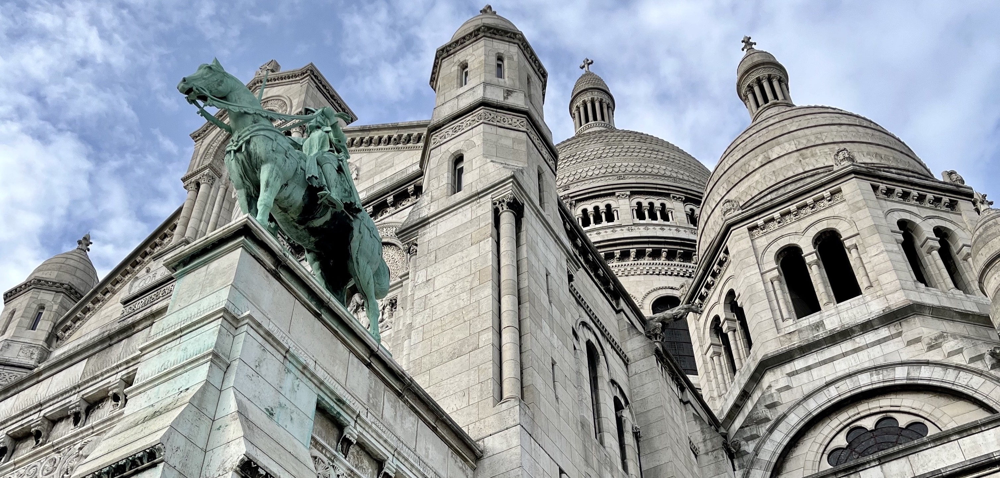
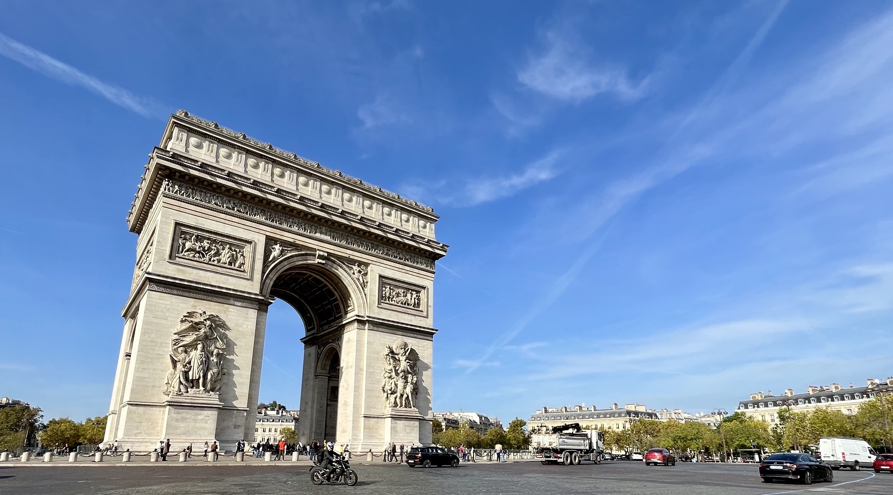
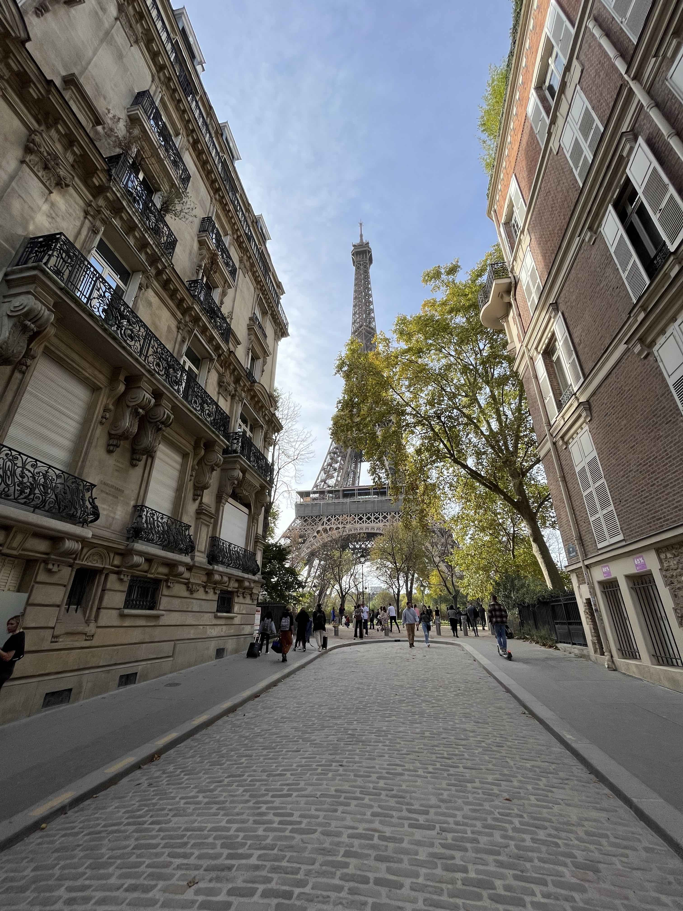

&nbsp;

Naprosto na rovinu se musím přiznat, že jsem se do Paříže vůbec netěšil. Klára se
tam chtěla podívat už dlouho, ale já jsem pořád bojoval s tím, že už jsem v hlavním
městě Francie byl. Sice se tehdy psal rok 2011, ale jednalo se o zájezd s cestovní
kanceláří, při kterém jsme s Kubou a tetou viděli všechny nejdůležitější památky
města. A tak jsem si říkal, že v Paříži už pravděpodobně nebude moc míst, která
bych rád viděl.

Tento názor se ale změnil, když jsem se podíval na rozpis zápasů PSG a zjistil
jsem, že v Parku princů se v termínu naší návštěvy odehraje utkání proti Troyes.
S Kubou a tetou jsme na fotbale nebyli a na mém imaginárním cestovním bucket
listu se stále nacházela položka "navštívit zápas PSG v Parku princů". Lístky
sice nebyly zadarmo, ale myšlenka na to, že uvidím v akci jeden z nejlepších
fotbalových týmů současnosti, mi na nějakou dobu dodala nadšení ohledně naší
cesty.

Píšu "na nějakou dobu", protože poslední týden před cestou nastala krize.
Pracovní vytížení v kombinaci s častými cestami do Prahy si vybralo svoji
daň, a tak jsme den před odjezdem s Klárou začali hodně vážně uvažovat nad tím, že
bychom si nechali propadnout letenky a raději zůstali doma, nebo jeli do Řeky.
V jednu chvíli jsem si už opravdu myslel, že nikam nepoletíme. Potom jsme si ale
řekli, že nebudeme másla, zatneme zuby a vyrazíme. A musím říct, že to bylo dobré
rozhodnutí, protože Paříž jsem si užil maximálně! :-)

&nbsp;

#### DEN 0

Odlétali jsme z Ruzyně. Ráno jsme si tedy sbalili věci, nasedli do auta
a vyrazili do Prahy. Na základě předchozích negativních zkušeností s dálnicí D1
jsem chtěl mít dostatečnou časovou rezervu, a tak jsme vyjeli z Brna cca 6 hodin
před odletem. Nakonec se ukázalo, že moje obavy byly zbytečné. Ve středu ráno
se jelo hezky, a tak jsme za dvě hodiny dorazili do firemních garáží, kde jsme
nechali zaparkované auto.

Na letišti jsme prošli bezpečnostní kontrolou a protože jsme měli dostatek času,
zašli jsme si na oběd do typické české restaurace. Podával se smažák s hranolky
a kučecí supreme se šťouchanými brambory.

I když jsem nebyl tím, kdo si dal smažený sýr, po jídle na mě padla obrovská
únava, a tak není divu, že jsem hodinu a půl dlouhý let prospal. Po příletu na
[letiště Beauvais–Tillé](https://www.cestujlevne.com/letiste/pariz-beauvais),
které [Marek Sourak](https://www.cestujlevne.com/letiste/pariz-beauvais)
trefně označil za "pole", jsme nasedli do autobusu a vyrazili na další hodinu
a půl dlouhou cestu. Tentokrát už jsme nepřijeli na pole, ale do centra Paříže.

Po vystoupení z autobusu mě překvapilo místní počasí. Oproti Česku bylo tou dobou
ve Francii nádherně. Svítilo sluníčko a předpověď ukazovala teploty kolem
20 stupňů na celý náš pobyt.

Kolem 18. hodiny jsme konečně dorazili
na náš [hotel](https://www.hoteljardinseiffel.com/), kde jsme vybalili příruční
zavazadla a na chvíli se natáhli. Protože noc byla ještě mladá (a my měli hlad),
zašli jsme si na jídlo do řecké restaurace [Apollon](https://www.apollon-paris.fr/).
Můj gyros talíř s hranolky i Klářina musaka byly připraveny během dvou minut,
což mi přišlo trošku podezřelé. I tak jsme si ale pochutnali.

Po jídle jsme se zašli podívat na
[nějakou slavnou věž](https://cs.wikipedia.org/wiki/Eiffelova_v%C4%9B%C5%BE) - na
jméno si asi nevzpomenu - která se nacházela kousek od našeho
[hotelu](https://www.hoteljardinseiffel.com/). Než jsme k ní dorazili, setmělo
se. To nás ale nemuselo trápit. 300 metrů vysoký kolos byl nádherně osvětlený
reflektory, které navíc přesně v celou začaly blikat a vytvořily tak (pro mě
malinko kýčovitou) světelnou show.

&nbsp;

*Osvětlená [Eiffelova věž](https://cs.wikipedia.org/wiki/Eiffelova_v%C4%9B%C5%BE).*

&nbsp;

Po večerní procházce jsme se vrátili na hotel a šli spát.

&nbsp;

#### DEN 1

Moc často se to nestává, ale musím uznat, že po předchozím dni stráveném
na cestách se mi v nové posteli spalo opravdu dobře. Z postele jsem tedy vstal
pravou nohou napřed a společně s Klárou jsme vyrazili na hotelovou snídani.
Nedá se říct, že by místní švédské stoly nabízely nekonečné možnosti, a tak se
stalo, že jsem každé ráno snídal to stejné - bagetu, šunku a míchaná vajíčka.

Po jídle jsme vyrazili na prohlídku města. A začali jsme památkou, která byla
nejblíž našeho hotelu - [Invalidovnou](https://cs.wikipedia.org/wiki/Invalidovna_(Pa%C5%99%C3%AD%C5%BE)).
Jedná se o komplex budov zahrnující
[Muzeum Armády](https://cs.wikipedia.org/wiki/Mus%C3%A9e_de_l%27Arm%C3%A9e),
vojenskou nemocnici a domov pro válečné veterány, což byl i původní účel budov.
Pod kopulí Dómu se potom nachází honosná
[Napoleonova](https://cs.wikipedia.org/wiki/Napoleon_Bonaparte) hrobka, na
kterou jsme se chtěli jít podívat původně. Nicméně samostatné vstupné do Dómu
zakoupit nelze. Proto jsme byli nuceni koupit si vstupné do celého komplexu. No,
a když už jsme měli vstupenky, podívali jsme se na rozsáhlé expozice věnované
francouzské vojenské historii v
[Muzeu Armády](https://cs.wikipedia.org/wiki/Mus%C3%A9e_de_l%27Arm%C3%A9e).
Jednou ze zajímavostí, na kterou může návštěvník muzea narazit, je vycpaný
[Napoleonův](https://cs.wikipedia.org/wiki/Napoleon_Bonaparte) kůň
[Vizir](https://www.atlasobscura.com/articles/objects-of-intrigue-napoleons-last-horse).

Po neplánované návštěvě muzea jsme si prohlédli Dóm a vyrazili na oběd do jednoho
z podniků fast foodového řetězce [Bagelstein](https://www.bagelstein.com/).
Jak název napovídá, v podniku neměli na výběr z mnoha druhů pečiva, a tak jsme
si dali [bagel](https://en.wikipedia.org/wiki/Bagel). Já jsem vyzkoušel jeden
s humusem, avokádem a zeleninou. Klára si objednala bagel s kuřecím masem.
V porovnání s řeckou restaurací ze včerejšího večera trvala příprava jídla
o poznání déle. Na chuti to ale nijak neubralo! I proto jsme se hned po jídle
shodli na tom, že pokud budeme mít příležitost, do podniku se rádi ještě vrátíme.

Po vynikajícím obědě jsme zamířili na [Martovo pole](https://cs.wikipedia.org/wiki/Champ-de-Mars).
V tu dobu to bylo podruhé za posledních 24 hodin. Narozdíl od včerejší procházky
byla ale dnešní návštěva dopředu plánovaná, protože jsme se chteli jít podívat
na vyhlídku
z [nějaké věže](https://cs.wikipedia.org/wiki/Eiffelova_v%C4%9B%C5%BE) - na
jméno si nevzpomenu. Naneštěstí pro nás jsme nezvolili úplně nejvhodnější
dobu. V nekonečných frontách se mačkaly davy lidí, a tak jsme se rozhodli, že
pohlídku ještě odložíme. Představa, že k tomu ocelovému monstru půjdeme ještě
jednou, se mi úplně nelíbila. Na druhou stranu nám to v tu chvíli přišlo mnohem
rozumnější, než pálit drahocenný čas ve frontách.

Ten jsme se rozhodli strávit procházkou k
[Vítěznému oblouku](https://cs.wikipedia.org/wiki/V%C3%ADt%C4%9Bzn%C3%BD_oblouk_(Pa%C5%99%C3%AD%C5%BE))
a brouzdáním po jednom z nejslavnějších bulvárů světa,
[Champs-Élysées](https://cs.wikipedia.org/wiki/Avenue_des_Champs-%C3%89lys%C3%A9es).

&nbsp;

*[Vítězný oblouk](https://cs.wikipedia.org/wiki/V%C3%ADt%C4%9Bzn%C3%BD_oblouk_(Pa%C5%99%C3%AD%C5%BE)),
který nechal [Napoleon](https://cs.wikipedia.org/wiki/Napoleon_Bonaparte) postavit,
aby připomínal jeho slavné vítězství
v [bitvě u Slavkova](https://cs.wikipedia.org/wiki/Bitva_u_Slavkova).*

&nbsp;

Když nad tím tak přemýšlím, do žádného obchodu jsme na
[Champs-Élysées](https://cs.wikipedia.org/wiki/Avenue_des_Champs-%C3%89lys%C3%A9es)
nešli. Spokojili jsme se pouze s jednou zastávkou, a to ve slavné kavárně
[Ladurée](https://www.laduree.fr/en/laduree-paris-champs-elysees.html). Ta si
získala oblibu Pařížanů hlavně díky výrobě vynikajících makronek.
Ač se jedná o kavárnu, na kávu jsme se nezastavovali.
Chtěli jsme si jen koupit makronky a pokračovat dál. "Jen koupit makronky" ale
znamenalo vystát si cca 30 minut ve frontě. Když se zákazník dostal dovnitř,
vyhazovač mu u dveří předal letáček se seznamem makronek, ze kterého bylo možné
si vybrat. Když jsme čekali v řadě, dost jsem nadával na lidi před námi, že
nejsou schopni si při čekání v řadě rozmyslet, jaké makronky budou chtít
a namísto toho potom před pultíkem dlouho koukají na hromady makronek a zdržují
všechny ostatní. Když jsme ale přišli na řadu, zjistil jsem, že to není tak jednoduché.
I když jsme měli dopředu vybráno, nevyhráli jsme úplně nejlepšího prodavače. Za pultem
stálo asi 10 zaměstnanců a nás se ujal mladý blonďatý Francouz, pro kterého makronky
evidentně nebyly životním posláním. Asi 5 minut mu trvalo, než připravil krabičku na
sladkosti. Dalších několik minut si nasazoval rukavice. Druhá makronka, kterou
jsme si vybrali, mu při nabírání spadla. A pokaždé, když nějakou makronku vložil
do krabičky, zadíval se potom na frontu za námi, nebo na svoje kolegy a vůbec
nám nevěnoval pozornost. Je sice možné, že se díval kolem sebe, protože neočekával,
že budeme mít (narozdíl od ostatních zákazníků) dopředu vybráno, ale jedno je
jasné - s jeho přístupem jsem nebyl úplně spokojený. Nakonec jsme se ale i my
dočkali makronek z [Ladurée](https://www.laduree.fr/en/laduree-paris-champs-elysees.html),
které nám zabalili do ikonické zelené taštičky, a tak když jsme vyšli z kavárny,
zážitku se znuděným prodavačem jsme se už jen zasmáli.

Protože [Champs-Élysées](https://cs.wikipedia.org/wiki/Avenue_des_Champs-%C3%89lys%C3%A9es)
byla delší, než jsme čekali a nám začaly docházet síly, rozhodli jsme se nasednout
na metro a přiblížit se k našemu dalšímu bodu programu, [Louvru](https://cs.wikipedia.org/wiki/Louvre).
Když jsme dorazili k prosklené pyramidě, zjistili jsme, že vystát si frontu do
muzea zabere přibližně 2 hodiny, což nám úplně nedávalo smysl, když muzeum za
2 hodiny zavíralo. Přesunuli jsme se proto do nedaleké kavárny, dali si
palačinku, přes web muzea jsme koupili lístky do [Louvru](https://cs.wikipedia.org/wiki/Louvre)
na další den a zároveň jsme naplánovali, co budeme dělat s načatým večerem.

Rozhodli jsme se, že se projdeme kolem [Seiny](https://cs.wikipedia.org/wiki/Seina)
a podíváme se na ostrov [Île de la Cité](https://cs.wikipedia.org/wiki/%C3%8Ele_de_la_Cit%C3%A9).
Na něm stojí [katedrála Notre Dame](https://cs.wikipedia.org/wiki/Katedr%C3%A1la_Notre-Dame_(Pa%C5%99%C3%AD%C5%BE)),
která je kvůli [požáru z roku 2019](https://cs.wikipedia.org/wiki/Po%C5%BE%C3%A1r_katedr%C3%A1ly_Notre-Dame)
pro veřejnost uzavřená. Kromě katedrály se na ostrově nachází jiné památky,
např. gotická kaple [Sainte-Chapelle](https://cs.wikipedia.org/wiki/Sainte-Chapelle),
nebo palác [Conciergerie](https://cs.wikipedia.org/wiki/Conciergerie), který
původně sloužil správci královského paláce, ale za doby
[Velké francouzské revoluce](https://cs.wikipedia.org/wiki/Velk%C3%A1_francouzsk%C3%A1_revoluce)
se z něj stalo vězení. Hodně nás lákala návštěva kaple. Nicméně když jsme k ní
přišli, byla už uzavřená. Proto jsme se spokojili alespoň s palácem
[Conciergerie](https://cs.wikipedia.org/wiki/Conciergerie). Úplně mě sice
nezaujala cela, kde byla vězněna
[Marie Antoinetta](https://cs.wikipedia.org/wiki/Marie_Antoinetta), ani mě nijak
neohromila jména ostatních vězňů vyobrazená v jedné z místností muzea, ale musím
uznat, že hlavní prostor s nádherným gotickým průčelím se mi líbil hodně. Celou
atmosféru ještě dokreslovala výstava soch vyrobených z písku. Mezi jednotlivými
exponáty bylo možné se volně procházet, takže jsem se docela bál, abych do nějaké
písečné sochy omylem nekopl a umělecké dílo nezničil. I tak jsem ale žasl nad
tím, co je někdo schopný vytvořit.

&nbsp;

*Písečná socha ve tvaru matrace v paláci
[Conciergerie](https://cs.wikipedia.org/wiki/Conciergerie).*

&nbsp;

Po prohlídce paláce [Conciergerie](https://cs.wikipedia.org/wiki/Conciergerie)
jsme se přesunuli do [Latinské čtvrti](https://cs.wikipedia.org/wiki/Latinsk%C3%A1_%C4%8Dtvr%C5%A5).
Tam jsme zamířili ze dvou důvodů.

1. Prohlídka [Pantheonu](https://cs.wikipedia.org/wiki/Pantheon_(Pa%C5%99%C3%AD%C5%BE)),
klasicistního kostela, v jehož podzemní kryptě jsou uloženy ostatky významných
osobností, např. [Victora Huga](https://cs.wikipedia.org/wiki/Victor_Hugo), nebo
[Marie Curie-Skłodowské](https://cs.wikipedia.org/wiki/Marie_Curie-Sk%C5%82odowsk%C3%A1).
Nicméně, jak už jsme si v [Paříži zvykli]((https://cs.wikipedia.org/wiki/Pa%C5%99%C3%AD%C5%BE)),
[Pantheon](https://cs.wikipedia.org/wiki/Pantheon_(Pa%C5%99%C3%AD%C5%BE)) byl
zavřený. Zašli jsme se proto alespoň podívat do nádherného sousedního
[kostela Saint-Étienne-du-Mont](https://cs.wikipedia.org/wiki/Kostel_Saint-%C3%89tienne-du-Mont),
ve kterém byly do roku 1793 uchovávány ostatky
[sv. Jenovéfy](https://cs.wikipedia.org/wiki/Svat%C3%A1_Jenov%C3%A9fa), patronky
[Paříže](https://cs.wikipedia.org/wiki/Pa%C5%99%C3%AD%C5%BE).
2. Fotka domu, kde bydlela Emily v seriálu
[Emily in Paris](https://www.csfd.cz/film/721172-emily-in-paris/prehled/). Seriál
jsem neviděl, ale ten dům je opravdu moc pěkný. Nachází se na malebném náměstíčku
ve tvaru trojúhelníku s kašnou uprostřed, ke které jsme si sedli a vybrali
místo, kam zajdeme na večeři.

Nakonec jsme se rozhodli pro nedalekou francouzskou restauraci
[Le Vieux Bistrot](https://levieuxbistrot-paris.fr/). A myslím, že to byla
vynikající volba. Mně osobně moc chutnala silná cibulačka, které bylo tolik, že
by se dala považovat za hlavní chod, i druhé jídlo v podobě orestovaného
kachního stehna s křupavou krustičkou, pečenými brambory a pečenou zeleninou.
Klára kromě polévky ochutnala hovězí po burgundsku, které v konečném hodnocení
také dostalo kladné body.

Po vynikající večeři jsme se přesunuli na hotel, snědli vymodlené makronky
z [Ladurée](https://www.laduree.fr/en/laduree-paris-champs-elysees.html)
a šli do hajan.

&nbsp;

#### DEN 2

Plán na druhý den byl naprosto jasný - dostat se na
[tu věž](https://cs.wikipedia.org/wiki/Eiffelova_v%C4%9B%C5%BE)! Rozhodli jsme se
proto nenechat nic náhodě. Ráno jsme se nikde neflákali, rychle jsme vstali,
zašli jsme si na snídani a vyrazili
na [Martovo pole](https://cs.wikipedia.org/wiki/Champ-de-Mars) (v tu dobu už
potřetí za náš pobyt). Abychom se vyhnuli frontám, měli jsme podle
Googlu přijít k [věži](https://cs.wikipedia.org/wiki/Eiffelova_v%C4%9B%C5%BE)
v 9:30, kdy se otevírají kasy. Přiznejme si narovinu, že
náš time management nebyl zase tak ideální, takže jsme ke vstupu dorazili v 9:40.
A co si myslíte, že nás tam čekalo? Ano, fronta... fronta, která končila ještě
dál, než ta z předchozího dne, kterou jsme se rozhodli neabsolvovat!

Stoupli jsme si tedy na konec a doufali v nejlepší. Přibližně uprostřed
řady nás potkal zázrak, kdy nás jeden ze zaměstnanců koordinujích "provoz"
poslal k bezpečnostní kontrole s nejmenší frontou. Návštěvníci, kteří stáli
v původní frontě před námi, "vyhráli" přepážku, kde byla řada snad třikrát
delší. Měli jsme štěstí. Za 20 minut jsme se tedy dostali do areálu
[věže](https://cs.wikipedia.org/wiki/Eiffelova_v%C4%9B%C5%BE)
a já si myslel, že to nejhorší máme za sebou. To jsem se ale šeredně spletl!

Do další fronty jsme se zařadili hned po tom, co jsme pochopili, kde se
kupují lístky. Na ně jsme čekali dalších 45 minut. Dlouhou chvíli mi alespoň
částečně krátilo pozorování italské rodiny za námi. Tatínek s maminkou si povídali
se svými přáteli, a tak si nevšimli, že jedno z jejich dětí ve věku kolem 3 let
baví zbylé dva sourozence tím, že se zakusuje do provazu, který vymezoval frontu.

To bylo vtipné. Už méně vtipné mi ale přišlo poslouchat Čechy, kteří s námi po
nákupu vstupenek nastoupili do výtahu do 1. patra a následně za námi stáli
i v řadě na výtah do druhého, tedy nejvyššího patra
[věže](https://cs.wikipedia.org/wiki/Eiffelova_v%C4%9B%C5%BE). Rodiče se svými dvěma
adolescentními dcerami nejdřív řešili, co by se stalo, kdyby se někomu ve výtahu
chtělo kadit. Možná jsem se nesmál kvůli tomu, že já byl cestou nahoru posranej
až za ušima z té 300 metrové výšky, do které jsme společně stoupali. Jejich
fekální vtípky bych ale asi ještě dokázal pochopit. Co mě ale začalo hodně
štvát, bylo to, že tatík měl potřebu stále osahávat konstrukci
[věže](https://cs.wikipedia.org/wiki/Eiffelova_v%C4%9B%C5%BE) a komentovat
to slovy: "To je poctivá ocelařina!" Když se to stalo poprvé, pomyslel jsem
si: "Určitě, Sherlocku, to bude poctivá ocelařina." Když už to ale řekl popáté,
měl jsem sto chutí se otočit a prohlásit: "Pochopili jsme to hned napoprvé.
Je to poctivá ocelařina!"

Tato rodinka z Čech, tipoval bych je na
[Příbramsko](https://cs.wikipedia.org/wiki/P%C5%99%C3%ADbram), se od nás naštěstí nahoře
odpojila, a tak jsme si mohli relativně v klidu užívat výhled
z [věže](https://cs.wikipedia.org/wiki/Eiffelova_v%C4%9B%C5%BE), která se
ve své době mohla pyšnit titulem nejvyšší budovy světa. Říkám "relativně", protože
jsem se nahoře trošku bál výšky a navíc jsme na malém prostoru nejvyššího patra
nebyli jediní, takže jsme se museli často vyhýbat ostatním turistům, nebo
poslouchat komentáře jiných Čechů. Nejlepší rozhovor, který jsem ve 300 metrech
nad zemí zaznamenal, byl následující.

> Přibližně desetiletý kluk se otočí na svého vrstevníka a nadšeně mu povídá:
"Víš co, kámo? Já mám hroznou chuť flusnout dolů!" Na to mu jeho "kámo" se
stejným nadšením odpoví: "Jooooo, jooooo, já taky!"

Nikoho jsem sice neviděl flusat dolů, ale za to jsem viděl
[Park princů](https://cs.wikipedia.org/wiki/Parc_des_Princes), areál
[Roland Gaross](https://cs.wikipedia.org/wiki/French_Open), nebo všechny
nejvýznamnější památky francouzské metropole. A za to ty tři hodiny strávené
ve frontách určitě stály!

Když jsme se naprosto zničení dostali dolů (z prvního patra na zem jsme šli
po schodech), sedli jsme si ještě na chvíli na lavičku u jezírka a obdivovali
monumentální stavbu. Potom jsme vyšli ven z areálu, udělali jsme si fotku,
kterou se při cestě do [Paříže](https://cs.wikipedia.org/wiki/Pa%C5%99%C3%AD%C5%BE)
chlubí každý influecer na [Instagramu](https://www.instagram.com/), a zamířili
jsme do našeho oblíbeného podniku [Bagelstein](https://www.bagelstein.com/).

&nbsp;

*Instagramové vyobrazení poctivé ocelařiny.*

&nbsp;

Po obědě jsme nasedli na metro a vydali se do
[čtvrti Montmartre](https://cs.wikipedia.org/wiki/Montmartre). Tam jsme si dali
kávu a zákusek v [jedné hipsterské kavárně](https://www.instagram.com/spreecafegalerie/),
vyšlápli si kopec až
k [bazilice Sacre Coeur](https://cs.wikipedia.org/wiki/Bazilika_Sacr%C3%A9-C%C5%93ur)
a potom seběhli dolů k Moulin Rouge. Co se týče
[Montmartru](https://cs.wikipedia.org/wiki/Montmartre), z naší
poslední cesty s Kubou a tetou jsem si toho moc nepamatoval. Vím, že jsme viděli
Sacre Coeur, vím, že jsme seděli v parčíku
před [Moulin Rouge](https://cs.wikipedia.org/wiki/Moulin_Rouge), ale to bylo tak
všechno. Tentokrát se ale z [Montmartru](https://cs.wikipedia.org/wiki/Montmartre)
stal jeden z highlightů naší cesty. Umělecká atmosféra, úzké uličky a malé
restaurace a kavárny se mi líbily natolik, že jsem si říkal, že pokud někdy zase
pojedu do [Paříže](https://cs.wikipedia.org/wiki/Pa%C5%99%C3%AD%C5%BE), budu
hledat ubytování už jen tam!

Kolem 17. hodiny jsme se přesunuli do centra města a nakoupili druhou sadu
makronek, tentokrát v cukrárně [Pierre Hermé](https://www.pierreherme.com/), kde
byla fronta o poznání menší než
v [Ladurée](https://www.laduree.fr/en/laduree-paris-champs-elysees.html).
Potom jsme zašli na rychlou večeři do turistické kavárny
[Le Café de la Régence](https://www.cafedelaregence.fr/). V podniku nacházejícím
se hned vedle rušné cesty jsem si objednal veganskou
[poke](https://en.wikipedia.org/wiki/Poke_(Hawaiian_dish)) bowl a Klára si dala
těstoviny s bazalkovým pestem. Ač jsem od jídla moc nečekal, chutnalo mi hodně,
Klára však měla opačný názor.

Po večeři jsme se přesunuli k [Louvru](https://cs.wikipedia.org/wiki/Louvre),
kam jsme měli zakoupené vstupné na 19. hodinu. Nějakou dobu jsme strávili čekáním
na bezpečnostní kontrolu, takže do muzea jsme se dostali až kolem 19:30. Bylo
jasné, že celé muzeum do zavíračky v 21:30 projít nestihneme. Vzali jsme si
proto plánek tří budov, které muzeum tvoří, a rozhodli jsme se podívat alespoň
na nejvýznamnější díla. Viděli jsme tedy např.
[da Vinciho](https://cs.wikipedia.org/wiki/Leonardo_da_Vinci)
[Monu Lisu](https://cs.wikipedia.org/wiki/Mona_Lisa), obraz
[Svoboda vede lid na barikády](https://cs.wikipedia.org/wiki/Svoboda_vede_lid_na_barik%C3%A1dy)
od [Eugèna Delacroix](https://cs.wikipedia.org/wiki/Eug%C3%A8ne_Delacroix), nebo
sochy [Níké](https://cs.wikipedia.org/wiki/N%C3%ADk%C3%A9_Samothr%C3%A1ck%C3%A1)
a [Venuše](https://cs.wikipedia.org/wiki/Venu%C5%A1e_M%C3%A9lsk%C3%A1). Naprosto
upřímně musím ale říct, že dobrý pocit jsem z toho neměl. Hodně jsme spěchali,
ale ani tak jsme neviděli vše, co jsme chtěli. Některé chodby byly navíc kvůli
rekonstrukcím uzavřeny, takže jsme často bloudili a nevěděli jsme, jak se nejlépe
dostat z jedné části muzea do druhé. Měli jsme jednoduše velké oči a trošku jsme
přecenili naše síly. Příště bych šel do muzea hned ráno a na odpoledne bych si
toho už moc neplánoval.

Kolem půl desáté jsme se úplně vyčerpaní odebrali na hotel, doplnili energii
výběrem makronek z [Pierre Hermé](https://www.pierreherme.com/) a šli na kutě.

&nbsp;

#### DEN 3

Na třetí den jsme toho neměli naplánováno tolik jako předchozí dny, takže by se
dalo říct, že se jednalo o klidnější den.

Po snídani jsme se vydali
do [Muzea Orsay](https://cs.wikipedia.org/wiki/Muzeum_Orsay), které se nachází
v budově bývalého vlakového nádraží. Muzeum se zaměřuje převážně na francouzské
umění z druhé poloviny 19. století. Návštěvníci tak mohou obdivovat jedinečnou
sbírku děl impresionalistů, jako jsou např.
[Clade Monet](https://cs.wikipedia.org/wiki/Claude_Monet),
[Édouard Manet](https://cs.wikipedia.org/wiki/%C3%89douard_Manet),
[Auguste Renoir](https://cs.wikipedia.org/wiki/Auguste_Renoir), nebo
[Paul Gauguin](https://cs.wikipedia.org/wiki/Paul_Gauguin).
Po prohlídce slavných děl jsme si dali oběd v muzejní kavárně, která se mohla
pyšnit obrovskými ručičkovými hodinami. Ty jsou pravděpodobně jedním z pozůstatků
vlakového nádraží.

Po jídle jsme se vydali na procházku do
[Latinské čtvrti](https://cs.wikipedia.org/wiki/Latinsk%C3%A1_%C4%8Dtvr%C5%A5).
Viděli jsme budovu pařížské univerzity [Sorbonny](https://cs.wikipedia.org/wiki/Sorbonna)
a navštívili jsme několik kostelů. Za zmínku stojí hlavně ten nejstarší v celé
[Paříži](https://cs.wikipedia.org/wiki/Pa%C5%99%C3%AD%C5%BE),
[Saint-Germain-des-Prés](https://cs.wikipedia.org/wiki/Kl%C3%A1%C5%A1ter_Saint-Germain-des-Pr%C3%A9s).
Kostel se nachází v areálu stejnojmenného opatství. To bylo založeno už v 6.
století!

Procházku jsme zakončili na ostrově
[Île de la Cité](https://cs.wikipedia.org/wiki/%C3%8Ele_de_la_Cit%C3%A9), kde
jsme si, stejně jako první den, chtěli prohlédnout gotickou kapli
[Sainte-Chapelle](https://cs.wikipedia.org/wiki/Sainte-Chapelle). Dlouhá řada
návštěvníků se stejným úmyslem stojících před vstupem nás ale odradila. Zašli
jsme proto do nedaleké kavárny a alespoň na chvíli jsme si spravili chuť
u kávy a obráceného jablečného koláče. Potom jsme sedli na metro a přesunuli
se na západ města, kde nás čekal jeden z bodů našeho programu, na které jsem se
před odletem těšil nejvíc, fotbalový zápas mezi domácím
[PSG](https://cs.wikipedia.org/wiki/Paris_Saint-Germain_FC)
a hostujícím [Troyes AC](https://cs.wikipedia.org/wiki/Troyes_AC).

Přestože konečné skóre 4:3 nasvědčuje tomu, že se jednalo o atraktivní zápas,
musím na rovinu přiznat, že moje pocity byly hodně smíšené. Hned, když jsme
přišli do [Parku princů](https://cs.wikipedia.org/wiki/Parc_des_Princes)
a posadili jsme se na naše místa, překvapilo mě, jak je stadion "malý". Dopředu
jsem neznal jeho kapacitu, ale od nejslavnějšího francouzského klubu jsem čekal
víc než necelých 50,000 míst. V porovnání se stadiony jako je
[Santiago Bernabéu](https://en.wikipedia.org/wiki/Santiago_Bernab%C3%A9u_Stadium)
(81,000), nebo [Camp Nou](https://en.wikipedia.org/wiki/Camp_Nou) (99,000)
tedy [Park princů](https://cs.wikipedia.org/wiki/Parc_des_Princes) působil
trošku jako chudý příbuzný. Na druhou stranu pokud by celý stadion fandil a hnal
své svěřence dopředu, asi by mi velikost stadionu nepřišla nijak relevantní.
To se ale nestalo. Zdálo se mi, že na zápase bylo hodně turistů, a tak se
fanoušci výrazněji ozývali jen po vstřelení gólu domácího týmu. A to mi přišlo
hrozně málo.

Ať jen nekydám, musím uznat, že jsem byl opravdu rád, že jsme měli možnost vidět
možná nejslavnější útočné trio současnosti v akci. Před zápasem jsem se trošku bál, aby
útok domácích ve složení [Messi](https://cs.wikipedia.org/wiki/Lionel_Messi) -
[Mbappé](https://cs.wikipedia.org/wiki/Kylian_Mbapp%C3%A9) -
[Neymar](https://cs.wikipedia.org/wiki/Neymar) vůbec nastoupil. A co nestalo?
Nejenže všichni tři nastoupili od první minuty, ale navíc každý z nich dal gól!

&nbsp;

*Pohled na [Park princů](https://cs.wikipedia.org/wiki/Parc_des_Princes) při utkání
mezi [PSG](https://cs.wikipedia.org/wiki/Paris_Saint-Germain_FC) a
[Troyes AC](https://cs.wikipedia.org/wiki/Troyes_AC). Odkaz na sestřih zápasu
[zde](https://www.youtube.com/watch?v=rXNRDN7b3Rk).*

&nbsp;

Přibližně 10 minut před koncem zápasu jsme odešli ze stadionu, abychom se vyhnuli
davům. Neviděli tím pádem třetí branku hostujícího týmu, ale to nám zase tolik
nevadilo. Cestou na hotel jsme se ještě stavili na rychlou večeři do
[Starbucks](https://cs.wikipedia.org/wiki/Starbucks), kde jsme si dali nějakou
napodobeninu senviče [croque monsieur](https://cs.wikipedia.org/wiki/Croque_monsieur).

&nbsp;

#### DEN 4

Poslední den v [Paříži](https://cs.wikipedia.org/wiki/Pa%C5%99%C3%AD%C5%BE) jsme
nikam nespěchali. V klidu jsme vstali, zašli si na snídani a poté sbalili všechny
věci. Kolem desáté hodiny nás u hotelu vyzvedl náš řidič z Uberu a zavezl nás na
[letiště Orly](https://cs.wikipedia.org/wiki/Leti%C5%A1t%C4%9B_Pa%C5%99%C3%AD%C5%BE-Orly).
Po bezpečnostní kontrole jsme si dali menší oběd v pekařství
[PAUL](https://cs.wikipedia.org/wiki/Paul_(peka%C5%99stv%C3%AD)) a krátce po 13.
hodině jsme odletěli do [Prahy](https://cs.wikipedia.org/wiki/Praha).

Po příletu jsme se přesunuli na Stodůlky, kde jsme si dali polévku v místní
[Kolkovně](https://www.kolkovna.cz/cs/kolkovna-stodulky-24). Klára poté
nasedla do auta k panu Honzovi z [blablacaru](https://www.blablacar.cz/) a
frčela domů do Brna. Já jsem naopak nasedl na metro a jel do kanceláře, kde jsem
ten den spal, protože hned druhý den jsme měli v pražských kancelářích pracovní
akci.

&nbsp;

#### DOJMY Z PAŘÍŽE

- [Montmartre](https://cs.wikipedia.org/wiki/Montmartre) je top strop! 🚀
- Gastrovýlet v [Paříži](https://cs.wikipedia.org/wiki/Pa%C5%99%C3%AD%C5%BE) by
byl hoooooodně drahý, ale jel bych na něj hned! 💸
- [Poctivou ocelařinu](https://cs.wikipedia.org/wiki/Eiffelova_v%C4%9B%C5%BE) si
musí člověk zasloužit ve frontě. 🗼
- Jsem rád, že jsem viděl [PSG](https://cs.wikipedia.org/wiki/Paris_Saint-Germain_FC)
na vlastní oči, ale jednou stačilo. ⚽

&nbsp;

#### FOTKY

Fotky z [Paříže](https://cs.wikipedia.org/wiki/Pa%C5%99%C3%AD%C5%BE)
najdete [zde](https://photos.app.goo.gl/UadYaGmTv9DUfMzW7).
