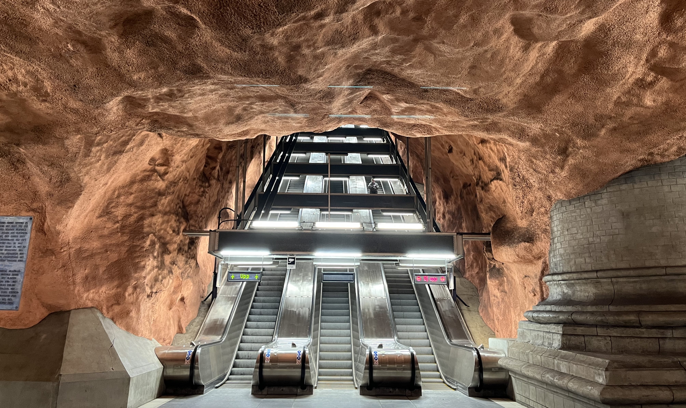

 

Byly časy, kdy jsem si myslel, že do [Stockholmu](https://cs.wikipedia.org/wiki/Stockholm)
vůbec nepojedeme. Nakonec jsme se tam ale vypravili na začátku března roku 2022.

Do [hlavního města Švédska](https://cs.wikipedia.org/wiki/Stockholm)
jsme měli jet už v prosinci roku 2021. Letenky jsem
totiž dostal od Kláry k našemu druhému výročí svatby. Věděl jsem, že Klára na tyto
dárky moc není, takže jsem upřímně nic podobného nečekal. O to větší radost jsem
ale měl, když jsem obálku s lístky otevřel. Jak ale říká tatínek: "Lepší je
se na nic netěšit, protože člověk nikdy neví, jak to nakonec dopadne!" A v tomto
případě by mi dal určitě za pravdu. Letenky nám totiž po pár měsících zrušili
a z adventního [Stockholmu](https://cs.wikipedia.org/wiki/Stockholm) tím pádem sešlo.

Druhá jiskřička naděje se ale objevila pod vánočním stromečkem. Klára cítila, že
mi "dluží" dárek ještě za naše výročí, a tak jsem si otevřel obálku s letenkami
do [Stockholmu](https://cs.wikipedia.org/wiki/Stockholm) ten rok již podruhé.
Tentokrát už nám [RyanAir](https://cs.wikipedia.org/wiki/Ryanair)
let nezrušil, a tak jsme mohli začít balit kufry!

*Poznámka: Všimli jste si někdy, že slovo
[Ryanair](https://cs.wikipedia.org/wiki/Ryanair) je
[palindrom](https://cs.wikipedia.org/wiki/Palindrom)? Já také ne!*

 

#### DEN 0

Ráno po probuzení jsem si sbalil věci, přenastavil termostat, zkontroloval, že
jsou zavřená okna a vynesl koš. Víc úkolů jsem neměl.

V 8:48 nás čekala cesta do [Vídně](https://cs.wikipedia.org/wiki/V%C3%ADde%C5%88).
Ve žlutém vlaku jsem si pročítal průvodce a
jedl snídani v podobě krocana obloženého šunkou a sýrem. Na
[hlavním vlakovém nádraží ve Vídni](https://cs.wikipedia.org/wiki/Wien_Hauptbahnhof)
jsme si poté šli koupit lístek na vlak na
[letiště](https://cs.wikipedia.org/wiki/Leti%C5%A1t%C4%9B_V%C3%ADde%C5%88). Vedle nás se
o něco podobného snažila česky mluvící babička se svými dvěma vnučkami. Jedné
bylo sedmnáct, druhé devatenáct. Ani tak ale nebyly schopné babičce pomoct koupit
jízdenky na vídeňskou MHD. Proto babička oslovila nás, dva od pohledu technicky
vyspělé jedince znalé alespoň jednoho cizího jazyka. Zatímco já jsem vyřídil naše
jízdenky na [letiště](https://cs.wikipedia.org/wiki/Leti%C5%A1t%C4%9B_V%C3%ADde%C5%88),
Klára pomohla babičce a jejím vnučkám. Nepříjemné bylo, že
babička chtěla nějakou slevu. I když jí ale Klára vybrala jednu dospělou jízdenku
a dvě studentské, cena za všechny byla stejná. Babička byla zdrcená. Měla sice
tři celodenní jízdenky, ale všechny za plnou cenu!

Na [letišti](https://cs.wikipedia.org/wiki/Leti%C5%A1t%C4%9B_V%C3%ADde%C5%88)
jsme relativně rychle prošli bezpečnostní kontrolou a následné čekání na let
jsme si zkrátili dojídáním zbytků. Já jsem si dal k obědu housku se šunkou
zakoupenou v jednom z letištních stánků. K této rakouské delikatese jsem
dojedl [avokádo](https://cs.wikipedia.org/wiki/Avok%C3%A1do) z domu
a jako dezert jsem zvolil černočerný banán, který nám ležel v ledničce
už několik (tý)dnů.

Let do [Stockholmu](https://cs.wikipedia.org/wiki/Stockholm) trval asi 2,5 hodiny.
Tuto dobu jsem nevyužil nijak produktivně.
Většinu času jsem poklimbával, nebo pozoroval dění kolem sebe. A že se bylo na co
dívat! Před odletem vzniklo menší drama v řadě před námi. Paní zahalená do
[hidžábu](https://cs.wikipedia.org/wiki/Hid%C5%BE%C3%A1b)
seděla na místě, na které si přišel měl sednout i muž tureckého původu ve
středních letech. Když si oba ukázali svoje chyré telefony a na obou svítilo
označení stejného sedadla, tedy 29F, pán řekl, že se posadí na místo vedle ní.
Další problém ale nastal, když přišla mladá, slovensky mluvící rodina s pěti
dětmi, která měla vytvořenou rezervaci na místa 29A až 29E. Nastal mírný zmatek,
který uklidnila až letuška, která přesunula tatínka a jednu z jeho dcer do naší
řady, tedy do řady číslo 30.

Slovenská rodina se postarala i o další zpestření našeho
jinak nezáživného letu. Asi 15 minut před přistáním začala nejmladší holčička
plakat. Pořád dokola opakovala, že potřebuje vodu. Z mírného pláče se postupem
času stal hysterický křík, při kterém začala být holčička agresivní. Nejenže
svými malými ručičkami bila naprosto klidnou matku, ale také kolem sebe začala
naštvaně házet různé předměty. A tak se stalo, že do řady za sebou mrštila pytlík
s bonbóny. Ten dopadl na nic netušícího obtloustlého pána, který měl na uších
nasazená velká slucházka a v klidu chroupal svoje brambůrky značky Pringles.
Když jsme vystoupili z letadla, holčička byla jako vyměněná. Ač nedostala napít,
úplně v klidu pozorovala dění na
[stockholmském letišti](https://cs.wikipedia.org/wiki/Stockholm-Arlanda)
a na vodu už vůbec nemyslela. Možná i na ni měl vliv čerstvý švédksý vzduch,
o kterém Klára prohlásila, že je úplně jiný než u nás.

Na letišti jsme se moc neohřáli. Rychle jsme nasedli na
[Arlanda Express](https://cs.wikipedia.org/wiki/Arlanda_Express) a cestou
do centra [Stockholmu](https://cs.wikipedia.org/wiki/Stockholm) jsme obdivovali
krajinu a domy okolo železnice. Vlak jel rychlostí až 180 km/h, takže na
[hlavní vlakové nádraží](https://en.wikipedia.org/wiki/Stockholm_Central_Station)
jsme dorazili za necelých 20 minut. V centru jsme chvíli hledali náš hotel.
Ubytovacích zařízení ze sítě Radisson je totiž v okolí
[nádraží](https://en.wikipedia.org/wiki/Stockholm_Central_Station) víc.
Nejdříve jsme se snažili ubytovat v
[Radisson Blu Royal Viking Hotel](https://www.booking.com/hotel/se/radisson-sas-royal-viking.cs.html).
Až paní na recepci nám ale sdělila, že máme vytvořenou rezervaci v
[Radisson Blu Waterfront Hotel](https://booking.com/hotel/se/radisson-blu-waterfront.cs.html),
hotelu, který se nachází asi o 200 metrů dál.

Na [hotelu](https://booking.com/hotel/se/radisson-blu-waterfront.cs.html)
jsme si vybalili věci, chvíli si odpočinuli a vyrazili na večeři. Z
průvodců na internetu jsem měl vytipovanou
[restauraci Lilla Ego](https://www.lillaego.com/), která měla být
vzdálená asi 2 km od [hotelu](https://booking.com/hotel/se/radisson-blu-waterfront.cs.html).
Procházeli jsme pěknou rezidenční čtvrtí Norrmalm
a cestou jsme narazili na spoustu jiných podniků, které nás zaujaly. Pořád jsem
si ale říkal, že počkáme až do [Lilla Ego](https://www.lillaego.com/).
O to více mě mrzelo, že všechna místa v restauraci byla obsazená.
Nedalo se nic dělat. Vrátili jsme se cestou zpět a zakotvili jsme v jednom
z velice solidních podniků, který se jmenoval [Nomad](https://www.nomad.bar/).
Tam nás se širokým úsměvem přivítala paní servírka, ze které se po chvíli vyklubal
pán číšník s dlouhými vlasy. Hned první den ve Švédsku jsme ochutnali
[masové kuličky](https://cs.wikipedia.org/wiki/Masov%C3%A9_koule)
s bramborovou kaší, nakládanými okurky a brusinkami. Jako dezert
jsme zkusili rozložený jablečný koláč se zmrzlinou. Jídlo bylo vynikající.
Když jsme se rozhodli zaplatit a Klára se zeptala, zda přijímají platební karty,
pán odpověděl, že přijímají *pouze* karty. Musím říct, že to mi bylo hodně sympatické.
Stejně jako před dvěma lety v Kodani, i ve
[Stockholmu](https://cs.wikipedia.org/wiki/Stockholm) jsme vůbec nepotřebovali
hotovost. Ve všech podnicích nám stačil telefon s načtenou platební kartou. Když
jsme se na toto téma bavili s jednou číšnicí v jiné kavárně, ta řekla, že snad
už ani ve [Stockholmu](https://cs.wikipedia.org/wiki/Stockholm) není možné
platit hotově, možná s výjimkou obchodů s potravinami.

Po večeři jsme se vydali zpět na [hotel](https://booking.com/hotel/se/radisson-blu-waterfront.cs.html).
Já jsem se pouze osprchoval a šel jsem si hned lehnout. Po náročném dni se mi
podařilo usnout už kolem osmé hodiny večer.

 

#### DEN 1

Ráno jsme vstali vyspaní do růžova a vyrazili na snídani. V hotelové jídelně na nás čekal pravý
[švédský stůl](https://cs.wikipedia.org/wiki/%C5%A0v%C3%A9dsk%C3%BD_st%C5%AFl).
Přemýšlím, zda bych před sousloví "švédský stůl" neměl napsat ještě jednou slovo
"švédský", aby byl jasný ten vtip (?) Nevadí. Vraťme se ke snídani!
Asi nikdy jsem nezažil tak bohatý výběr jako právě tady. Člověk si mohl vybrat
jídla sladká, slaná, masná, vegetariánská, nebo třeba
[bezlepková](https://cs.wikipedia.org/wiki/Bezlepkov%C3%A1_dieta). V jiných
hotelích jsem na snídani viděl jeden druh mléka, tady jich bylo pět. U každého
sýru byl štítek s uvedeným obsahem tuku. Na výběr bylo ze tří druhů vajec a dvou
druhů párků, z toho jeden druh byl s příměsí ovčího masa. Pečiva bylo nepřeberné
množství a každý den se měnil výběr džusů. Pokud by toho bylo málo, hotel nabízel
možnost objednat si snídani z menu. V nabídce figuroval např.
[avokádový toast](https://en.wikipedia.org/wiki/Avocado_toast),
nebo [vejce benny](https://cs.wikipedia.org/wiki/Vejce_Benedikt).

Já to první den hrozně přepálil, takže jsem si dal smažená vajíčka, párečky,
brambory, dušená rajčata, čerstvou papriku a bagetku. Jako dezert jsem zvolil
šáteček s vanilkovým pudinkem, ke kterému jsem si ještě uvařil cappuccino v kávovaru.
Nebudu nikomu nic nalhávat - bylo mi těžko. Když jsme ale vyšli ven z
[hotelu](https://booking.com/hotel/se/radisson-blu-waterfront.cs.html), byl
jsem rád, že jsem se pořádně najedl. Venku totiž bylo pod mrakem a foukal studený
vítr.

Prohlídku města jsme zahájili ve [starém městě](https://cs.wikipedia.org/wiki/Gamla_stan)
na ostrově [Stadsholmen](https://cs.wikipedia.org/wiki/Stadsholmen).
Nejdříve jsme prošli celou hlavní ulici plnou restaurací a obchodů se suvenýry.
Po ní jsme se dostali až ke [královskému paláci](https://cs.wikipedia.org/wiki/Stockholmsk%C3%BD_pal%C3%A1c).
Královská rodina v něm už sice nebydlí, ale stále se v něm nachází prostory, kde
probíhají mezinárodní návštěvy. Na cedulce v pokoji pro hosty jsme našli jména
i jednoho českého páru, konkrétně Václava a Dagmar Havlových, kteří podle informací
přijeli do [Stockholmu](https://cs.wikipedia.org/wiki/Stockholm) na začátku 90. letech
minulého století. Po prohlídce [paláce](https://cs.wikipedia.org/wiki/Stockholmsk%C3%BD_pal%C3%A1c)
jsme se šli ještě podívat do pokladnice a
[muzea Tre Kronor](https://www.kungligaslotten.se/english/royal-palaces-and-sites/the-royal-palace/museum-three-crowns.html).
To není věnované švédské hokejové reprezentaci, jak by si mohli někteří myslet,
ale pevnosti, která dříve stála na místě dnešního
[královského paláce](https://cs.wikipedia.org/wiki/Stockholmsk%C3%BD_pal%C3%A1c).

Na oběd jsme zamířili do [Taco Bar](https://tacobar.se/), kde jsme si dal quesadillu
se zeleninou a nachos. Klára si objednala habaňero tacos. Po obědě jsme se ještě
zastavili v jedné z blízkých kaváren na [fika](https://cs.wikipedia.org/wiki/Fika),
což je slovo označující na přestávku na kávu. My jsme si dali nejen kávu ale i
skořicovou rolku.

Když jsme zase nabrali síly, vydali jsme se do
[muzea ručně malovaných dřevěných koníků](http://www.woodenhorsemuseumsweden.se/index.html), které
mají být pro Švédsko také typické. Osobně jsem to vůbec nevěděl,
ale budiž. Vstupné do muzea bylo zdarma. I tak jsme tam ale utratili více peněz
než za vstup do [královského paláce](https://cs.wikipedia.org/wiki/Stockholmsk%C3%BD_pal%C3%A1c),
protože jsme si jednoho dřevěného koníka koupili na památku. Hned vedle muzea
stojí [Nobelovo muzeum](https://cs.wikipedia.org/wiki/Muzeum_Nobelovy_ceny) a za ním
[Velký kostel](https://cs.wikipedia.org/wiki/Katedr%C3%A1la_svat%C3%A9ho_Mikul%C3%A1%C5%A1e_(Stockholm)).
Ten se opravdu jmenuje "Velký". Mně osobně moc velký nepřišel, nebo rozhodně
ne o moc větší než ostatní kostely ve [starém městě](https://cs.wikipedia.org/wiki/Gamla_stan).
Interiér kostela nám ale přišel hodně specifický a já osobně jej hodnotím
jako jeden z vrcholů našeho výletu. Obzvlášť mi utkvěly v paměti oranžové cihlové
zdi, které v kombinaci s černým oltářem vytvářely neobvyklý kontrast.

Cestou ze Starého kostela jsme chvíli hledali nejužší uličku ve
[Stockholmu](https://cs.wikipedia.org/wiki/Stockholm). Když jsme ji našli,
zamířili jsme na nábřeží. Tam se nachází
[kostel Riddarholmskyrkan](https://cs.wikipedia.org/wiki/Riddarholmskyrkan),
který lze na panoramatu [Stockholmu](https://cs.wikipedia.org/wiki/Stockholm)
lehce identifikovat díky svojí děravé věži, a
[stockholmská radnice](https://cs.wikipedia.org/wiki/Stockholmsk%C3%A1_radnice).
U ní jsme udělali několik pěkných fotek moře, na jehož hladině právě pluly ledové kry.

Kolem 17. hodiny jsme zašli na
[hotel](https://booking.com/hotel/se/radisson-blu-waterfront.cs.html), chvíli
si odpočinuli a potom vyrazili do nákupní čtvrti Norrmalm. Tam jsme sice nic
nekoupili, ale alespoň jsme si dali večeři v podniku Nu, který byl součástí
[tržnice K25](http://k25.nu/en/om-k25/). Já vyzkoušel rýžový salát s portobello
houbami a zeleninou. Klára si dala tofu s zeleninovými nudlemi. Zpět
na hotel jsme dorazili kolem 20. hodiny, osprchovali jsme se a šli jsme hned spát.

 

#### DEN 2

Ráno jsme vstali kolem 8. hodiny, dali si vydatnou snídani v hotelové restauraci
a vydali se do města.

Hned na začátku dne náš čekala procházka přes
[Gamla Stan](https://cs.wikipedia.org/wiki/Gamla_stan) až do čtvrti
Sodermalm, kde se nacházel cíl naší
cesty, [muzeum Fotografiska](https://www.fotografiska.com/sto). Jak už název
napovídá, jedná se o galerii fotografií. Při naší návštěvě probíhaly ve
[Fotografisce](https://www.fotografiska.com/sto)
výstavy tří soudobých fotografů. Každá z výstav mi buď přišla hrozně
bizarní, nebo zůstala v mých očích nepochopená, takže asi jediné, co se mi
z naší návštěvy líbilo, byla budova samotná a obchod s upomínkovými předměty.
V něm se nacházela spousta plakátů s pěknými fotografiemi z předchozích výstav
a zajímavé knihy. Kdyby mě Klára nevzala za ruka a nevyvedla ven, asi bych si
ještě teď prohlížel knihu věnovanou lidem s tetováním.

Prohlídkou fotografií jsme strávili skoro celé dopoledne, takže když jsme vyšli
ven, byl prakticky čas oběda. A ten jsme měli naplánovaný v podniku
[Meatballs for the People](http://meatball.se/), který se nejenže nacházel kousek od
[Fotografisky](https://www.fotografiska.com/sto), ale navíc nám jej
doporučili Sedláčci a Zouhaři. Přestože jsme měli
[masové kuličky](https://cs.wikipedia.org/wiki/Masov%C3%A9_koule) už v den příjezdu,
řekli jsme si, že jich ve [Stockholmu](https://cs.wikipedia.org/wiki/Stockholm)
ochutnáme víc. I proto jsem  si v restauraci
objednal vegetariánskou variantu servírovanou na bílém toustovém chlebu se
zeleninovou oblohou. Klára naopak zvolila klasickou úpravu
[masových kuliček](https://cs.wikipedia.org/wiki/Masov%C3%A9_koule)
s bramborovou kaší, nakládanou okurkou a brusinkami.
Objednala si ale výběr z různých druhů masa. Vyzkoušela tedy kuličky hovězí,
vepřové, kuřecí a sobí! Dost mě překvapilo, když řekla, že asi nejlepší byly ty
vepřové, protože byly nejjemnější ze všech. Co se týče podniku
samotného, posezení tam bylo velice příjemné a já osobně bych jej také doporučil
dalším návštěvníkům švédské metropole.

Po obědě jsme si prošli hipsterskou čtvrť Sodermalm. Podívali jsme se ke kostelu
[Katarina kyrkogard](https://sv.wikipedia.org/wiki/Katarina_kyrkog%C3%A5rd),
minuli jsme hospodu dobrého vojáka Švejka a z dálky jsme
viděli multifunkční [Avicii Arenu](https://cs.wikipedia.org/wiki/Avicii_Arena),
která je největší stavbou půlkulového tvaru
na světě. Po krátké procházce jsme se zastavili na kávu
v [Espresso House](https://en.wikipedia.org/wiki/Espresso_House), což je
taková švédská verze [Starbucks](https://cs.wikipedia.org/wiki/Starbucks).
Nutno dodat, že o dost horší.

Po kávě a zákusku jsme seběhli zpět na ostrov
[Stadsholmen](https://cs.wikipedia.org/wiki/Stadsholmen) a nechali se lodní MHD
převést na [ostrov Djurgarden](https://en.wikipedia.org/wiki/Djurg%C3%A5rden).
Jedná se o jeden z větších stockholmských ostrovů,
na kterém se nachází národní městský park stejného jména a spousta muzeí. My jsme
se rozhodli navštívit pouze jedno z nich, konkrétně
[muzeum Vasa](https://cs.wikipedia.org/wiki/Muzeum_Vasa).
[Vasa](https://cs.wikipedia.org/wiki/Vasa) je dřevěná válečná loď, která se
potopila v roce 1628, a to ještě dříve než pořádně vyplula z přístavu. O více než
300 let později ji Švédové vylovili, vyčistili a postavili kolem ní
obrovský dům, kterému se dnes říká muzeum. Ač je to ve
[Vyškově](https://cs.wikipedia.org/wiki/Vy%C5%A1kov) hodně nepopulární
názor, já musím říct, že se mi prohlídka hodně líbila. Nejenže je
[loď](https://cs.wikipedia.org/wiki/Vasa) obrovská, ale
hlavně je na ní vidět, že její stavba musela dát hrozně moc práce. Po celé své
délce je totiž zdobená různými ornamenty a dřevěnými sochami, které byly původně
ještě natřené pestrými barvami. Barvy sice smyla voda, ale loď připomínající
Černou perlu, na které se plavil
[Jak Sparrow](https://cs.wikipedia.org/wiki/Jack_Sparrow), přežila.
A já jsem opravdu rád, že jsem ji mohl vidět na vlastní oči.

Z [ostrova Djurgarden](https://en.wikipedia.org/wiki/Djurg%C3%A5rden) jsme to vzali přes
elegantní čtvrť Östermalm. Ta je mimo jiné známá stylovými domy, které nám
hodně připomínaly prvorepublikové obytné domy stojící na Veveří. Kousek od našeho
[hotelu](https://booking.com/hotel/se/radisson-blu-waterfront.cs.html) jsme
se zastavili v mexické restauraci
[Zocalo](https://zocalo.se/restaurangerna/regeringsgatan-20/) na jídlo.
Já si dal veggie burrito, Klára si objednala tacos s mangovým chutney.
Na [hotelu](https://booking.com/hotel/se/radisson-blu-waterfront.cs.html) jsme se
umyli, dodívali se na rozkoukaný
[šestý díl Harryho Pottera](https://cs.wikipedia.org/wiki/Harry_Potter_a_princ_dvoj%C3%AD_krve)
a po dlouhém dni si šli brzo lehnout.

 

#### DEN 3

V 8 hodin zazvonil budík, my vstali a šli na snídani. Tentokrát jsme vyzkoušeli
jídlo ze snídaňového menu. Objednali jsme si
[avokádový toast](https://en.wikipedia.org/wiki/Avocado_toast) se
[zastřeným vejcem](https://cs.wikipedia.org/wiki/Ztracen%C3%A9_vejce)
a kousky chilli. Jak by řekli ve
[Vyškově](https://cs.wikipedia.org/wiki/Vy%C5%A1kov): "Bylo to dobré, ale
smrdělo to málem!" Po toastíku jsme si proto dali ještě přídavek ze sladké sekce.
Já jsem zvolil palačinku s jahodovou marmeládou, Klára výběr sladkého pečiva.

Po snídani jsme se vydali do víru velkoměsta. No, spíš než "do víru" bych měl
napsat "do podzemí", protože jsme si koupili jízdenku na metro a jeli se podívat
na tři atypické zastávky. Na
[stanici Radhuset](https://cs.wikipedia.org/wiki/R%C3%A5dhuset_(stanice_metra))
jsou k vidění cihlově červené stěny, které se objevují na titulních stranách
mnoha městských průvodců po [Stockholmu](https://cs.wikipedia.org/wiki/Stockholm).
I já jsem proto klasické vyobrazení této zastávky vybral jako titulní fotku tohoto
článku :-) Na druhé zastávce,
[stanici T-Centralen](https://cs.wikipedia.org/wiki/T-centralen_(stanice_metra)),
jsou na bílých stěnách namalovány modré květinové ornamenty připomínající
porcelánové talíře značky [Thun](https://cs.wikipedia.org/wiki/Porcel%C3%A1nka_Thun).
A na [stanici Kungstradgarden](https://en.wikipedia.org/wiki/Kungstr%C3%A4dg%C3%A5rden_metro_station),
kde naše mini prohlídka končila (jedná se o konečnou stanici), bylo všechno, řekl bych.
Ani nevím, jak bych stanici popsal. Na stěnách člověk mohl najít snad všechny
barvy světa, v podlaze byl zapuštěný nějaký neidentifikovatelný barel, vedle
nástupišť bylo možno nahlédnout do prostoru, který připomínal naleziště zbytků
antických paláců, a kdyby toho bylo málo, uprostřed zastávky mezi nástupišti stála
socha, která vypadala jako [Radegast](https://www.pustevny.cz/radegast/).
Bylo to prostě divné.

Z metra jsme se vydali na ostrov [Skeppsholmen](https://cs.wikipedia.org/wiki/Skeppsholmen).
Ten je zajímavý především tím, že se na něm nachází několik muzeí a nádherná
náplavka, ze které je možné pozorovat malebné domečky na pobřeží protějšího
[starého města](https://cs.wikipedia.org/wiki/Gamla_stan). Švédské názvy pro nás
byly těžko zapamatovatelné, a tak jsme s Klárou ostrov překřtili. Pokud
tedy budu dále zmiňovat "ořech", nebude se jednat o jídlo, ale o ostrov, který
nám na mapě ořech připomíná. Na ostrově jsme navštívili
[Muzeum moderního umění](https://cs.wikipedia.org/wiki/Muzeum_moderny).
Osobně se mi dovnitř moc nechtělo, ale vstup byl zdarma, a tak jsme si řekli, že
do [muzea](https://cs.wikipedia.org/wiki/Muzeum_moderny) nakoukneme a rychle ho
projdeme. Muzeum bylo rozděleno na dvě části. První z nich byla věnovaná
architektuře, což bylo téma, které mě moc neoslovilo. Výstava
popisovala historii, materiály a konstrukce staveb ve
[Stockholmu](https://cs.wikipedia.org/wiki/Stockholm) i jinde ve Švédsku, které
jsem vůbec neznal, takže mi to moc neříkalo. Druhá část výstavy
byla zasvěcena obrazům, sochám a jiným instalacím moderní doby.
Bez znalosti popsaného kontextu mnohé z nich nedávaly smysl. Když se ale člověk
začetl více do popisu, často pochopil pohnutky autora a najednou díla byla snáze
uchopitelná. Nakonec tedy bylo zajímavé se něco dozvědět a pochopit, jak někteří
umělci přemýšleli. Já osobně jsem byl hrozně rád, že v rámci expozice bylo možné
vidět obrazy od [Salvadora Dalího](https://cs.wikipedia.org/wiki/Salvador_Dal%C3%AD)
a [Andyho Warhola](https://cs.wikipedia.org/wiki/Andy_Warhol).

Po prohlídce obou výstav jsme se zastavili v muzejní jídelně, kde jsme si dali
oběd. Podávala se fazolová polévka. Na druhé si Klára objednala zeleninové curry
s rýží, já jsem se rozhodl vyzkoušet jídlo pojmenované jako "švédská klasika".
Nakonec se jednalo o světlý toast opečený na másle s krevetovým salátem. Tento
pokrm se obvykle nazývá [toast skagen](https://en.wikipedia.org/wiki/Toast_Skagen).
Na dezert jsem si dal [semlu](https://en.wikipedia.org/wiki/Semla), což je zákusek,
který jsme překřtili na "hovínko". Asi chápete proč. Jedná se o hnědé pečivo vypadající
jako koblížek, který má ořízlý vršek. Mezi tento vršek a zbytek koblížku je
daný hustě našlehaný krém. V zásadě je to takový nerovnoměrný větrník, který nemá
nahoře polevu a je udělaný z kynutého těsta. Uvnitř je ještě nějaká sladká těžko
popsatelná hmota. A jak to chutná? No, je to nebe v hubě!

Po obědě v [muzeu](https://cs.wikipedia.org/wiki/Muzeum_moderny) jsme se prošli
po zbytku ostrova, nafotili jsme panoramata z místní náplavky a vydali jsme se
do dalšího [muzea Hallwylska](https://en.wikipedia.org/wiki/Hallwyl_Museum).
[Google](https://www.google.com/) říká, že je to muzeum, ale upřímně nevím, zda je toto označení vhodné.
Jedná se totiž o historický dům v centru [Stockholmu](https://cs.wikipedia.org/wiki/Stockholm),
který dřívě patřil hraběti a hraběnce von Hallwyl, kteří jej potom věnovali státu.
Dům je zajímavý především tím, že měl na svoji dobu (konec 19. století) velice
moderní a nadčasové vybavení, např. topení, splachovací záchod, koupelnu se
sprchou a telefon. A je třeba dodat, že to tam není žádnej šunt. V koupelně
nejsou obklady z [Bauhausu](https://cs.wikipedia.org/wiki/Bauhaus_(obchodn%C3%AD_%C5%99et%C4%9Bzec)),
ale z mramoru a záchod je celý obložený dřevem, takže, předpokládám, nestudí.
Jen co se týče té komunikace přes telefon, tam si myslím, že jsme v dnešní době už dál.

Po prohlídce domu pana Walthera a jeho ženy Wilhelminy von Hallwyl jsme šli do šatny
pro věci. Protože nás ale bolely nohy, rozhodli jsme se, že si na pár minut sedneme
a odpočineme si. Klára začala projíždět stories na
[Instagramu](https://cs.wikipedia.org/wiki/Instagram) a já jsem se pustil do kontroly
sportovní výsledků na [Livesportu](https://cs.wikipedia.org/wiki/Livesport).
Po necelé minutce k nám přišel
postarší zaměstnanec muzea a zeptal se nás, zda bychom nevyplnili dotazník
na jeho tabletu. Klára šla na řadu první. Když se v dotazníku vyplnily
informace o věku, pohlaví a především národnosti, nám aplikace oznámila, že
další otázky jsou relevantní pouze pro Švédy. Po pár vteřinách tedy bylo hotovo.
S pánem jsme se ale dali do nezávazného
[small talku](https://slovnik-cizich-slov.abz.cz/web.php/slovo/small-talk-angl).
Ptal se nás, odkud jsme a kdy letíme domů. Všechno vypadalo blankytně.
Potom se ale Klára ze zdvořilosti zeptala,
zda by nám pán mohl doporučit nějaká další muzea. A to neměla dělat! Pánovi se
rozzářily oči a s nadšením prohlásil, že nám dá velice rád několik tipů.
Nejdříve ale potřeboval mapu, na které by nám ukázal, kde se jednotlivá místa
nacházejí. Tu ale neměl u sebe, takže nám řekl, ať s ním jdeme přes celé muzeum
do obchodu s upomínkovými předměty, kde určitě nějaká bude. Po krátkém rozhovoru
s dalšími dvěma zaměstnankyněmi muzea nám oznámil, že tam mapa není. A tak jsme
se vydali zpět do šatny. Ta se mezitím naplnila dalšími návštěvníky, a tak tam
začalo být docela plno. Postarší pán zjistil, že stojan s mapami, který hledal,
stál celou dobu vedle něj. Měli jsme tedy mapu a on začal mluvit
o dalších muzeích, která bychom mohli navštívit. Když mluvil o obecných věcech,
bylo mu rozumět skvěle. Když na nás ale začal házet švédské názvy památek, byli jsme
úplně mimo a nerozuměli jsme ani slovo. Klára se mu snažila naznačit, zda by nám
mohl ukázat na mapě, kde se muzea nacházejí. On odvětil, že seznam muzeí je na
druhé straně. Říkal, ať si to přečteme a nastudujeme. Žádné místo nám ale neukázal
a po nějaké době se omluvil s tím, že už musí jít. Byl to velice milý stařík! :-)
Jak jsem zmínil výše, při návratu do šatny se celá místnost naplnila ostatními
návštěvníky, kteří na malém prostoru museli slyšet celý náš rozhovor. Kousek vedle
nás seděla i maminka se dvěma malými dětmi, chlapečkem a holčičkou. Všichni tři byli
blonďatí, jak kdyby pocházeli ze Švédska. Po tom, co zaměstnanec muzea odešel, se
s námi paní dala do řeči. Říkala, že pokud je to náš poslední den ve
[Stockholmu](https://cs.wikipedia.org/wiki/Stockholm),
doporučí nám nějaký bar, kam si můžeme večer zajít. Upřímně - to poslední, co jsme večer chtěli,
bylo jít do baru, ale nechali jsme paní, aby nám poradila. Nejdřív našla
lokalitu baru na Google Maps na svém telefonu a potom se snažila lokalizovat bar
na naší nové mapce. Když místo našla, uvědomila si, že to nemá jak vyznačit.
Začala tedy v kabelce hledat propisku. Celou dobu se po ní válel otrávený syn,
kterého to v muzeu evidentně přestalo bavit už před nějakou dobou. Paní ale byla
pořád úplně vyrovnaná a otráveného syna si nevšímala. V klidu našla propisku,
vyznačila bar na naši mapku a poté se ještě zamyslela, zda ji nenapadne nějaké
jiné místo, které by nám mohla doporučit. Napadla ji ještě restaurace kousek
od [starého města](https://cs.wikipedia.org/wiki/Gamla_stan), ze které je podle
jejích slov nádherný výhled na celý [Gamla Stan](https://cs.wikipedia.org/wiki/Gamla_stan).
Vtipné bylo, když nám potom řekla, že moc podniků nezná, protože bydlí na kraji
[Stockholmu](https://cs.wikipedia.org/wiki/Stockholm) a do centra jezdí také
spíše jako turista. I když mi celá situace se starým pánem i maminkou dvou dětí
přišla hodně úsměvná a nyní si z toho dělám legraci, musím uznat, že od obou bylo
velice pěkné, že se nám snažili pomoct. Jejich ochoty si opravdu vážím!

Z [muzea Hallwylska](https://en.wikipedia.org/wiki/Hallwyl_Museum) jsme se naposledy
vydali do [starého města](https://cs.wikipedia.org/wiki/Gamla_stan). Klára si tam
chtěla koupit svetr, který si předchozí den vyhlédla v jednom z mnoha butiků. Když
jsme ale dorazili na místo, obchod byl už zavřený, takže z nákupu sešlo.

Poslední večer jsme si řekli, že se trošku rozšoupneme, takže jsme našli pěknou
restauraci s názvem [Bistro Bestick](http://bistrobestick.se/) kousek od našeho
[hotelu](https://booking.com/hotel/se/radisson-blu-waterfront.cs.html)
a zašli si na večeři. Klára si dala svoje třetí masové kuličky ve
[Stockholmu](https://cs.wikipedia.org/wiki/Stockholm), já jsem vyzkoušel tresku
s mrkvovým pyré, chorizem a bramborami.

Na [hotelu](https://booking.com/hotel/se/radisson-blu-waterfront.cs.html)
jsme se osprchovali, pomalu začali s balením věcí a šli si lehnout.

 

#### DEN 4

Poslední den byl věnovaný návratu domů.

Vstali jsme v 6:30, zašli si na brzkou snídani a vydali se na
[Arlanda Express](https://cs.wikipedia.org/wiki/Arlanda_Express),
který nás zavezl na [letiště](https://cs.wikipedia.org/wiki/Stockholm-Arlanda).
Letadlo do [Vídně](https://cs.wikipedia.org/wiki/V%C3%ADde%C5%88) nám letělo v 10:45.
Let nebyl ničím zajímavý. Většinu času jsem pospával, nebo pozoroval švédská jezera
a chvíli před přistáním [Alpy](https://en.wikipedia.org/wiki/Alps).

Ve [Vídni](https://cs.wikipedia.org/wiki/V%C3%ADde%C5%88) jsme se přesunuli
na [hlavní vlakové nádraží](https://cs.wikipedia.org/wiki/Wien_Hauptbahnhof), kde
jsme si chtěli dát pozdní oběd. V jindy relativně prázdném food courtu byly tentokrát mraky lidí.
Většinou se jednalo o ženy a děti z [Ukrajiny](https://cs.wikipedia.org/wiki/Ukrajina).
Abych pravdu řekl, pohled na jejich veškerý majetek sbalený do jednoho kufru mi
nedělal moc dobře. Na oběd jsem si dal bramborový guláš s chlebem a
nakládaným okurkem z [Würstel Boutique](http://wuerstelboutique.at/). Klára si
koupila veggie bagetu v [Burger King](https://cs.wikipedia.org/wiki/Burger_King).

Zpět do [Brna](https://cs.wikipedia.org/wiki/Brno) jsme jeli žlutým vlakem v 14:39.
Na hlavní nádraží jsme dorazili na čas krátce po 16. hodině.

 

#### DOJMY ZE STOCKHOLMU

- Ve [Stockholmu](https://cs.wikipedia.org/wiki/Stockholm) je muzeum vedle muzea.
[Vasa](https://cs.wikipedia.org/wiki/Vasa) je podle mě "must-see".
- Turisticky profláklý [Gamla Stan](https://cs.wikipedia.org/wiki/Gamla_stan) mě moc neoslovil.
Mnohem více se mi líbily rezidenční čtvrtě Norrmalm a Ostermalm na sever od
[starého města](https://cs.wikipedia.org/wiki/Gamla_stan).
- Lidé jsou usměvaví a velice ochotní.
- [Masové kuličky](https://cs.wikipedia.org/wiki/Masov%C3%A9_koule) mi chutnaly na všechny způsoby.
- Mít možnost cestovat po městě lodním MHD mi přijde "cool".
- Soucit s válkou zasaženou [Ukrajinou](https://cs.wikipedia.org/wiki/Ukrajina)
projevují ve [Stockholmu](https://cs.wikipedia.org/wiki/Stockholm) opravdu hodně.
Ve všech obchodech se suvenýry bylo možné zakoupit předměty laděné do žluté a modré
barvy. Většinou na nich bylo napsané Sverige, což nevím, co znamená. Možná
švédky "[Ukrajina](https://cs.wikipedia.org/wiki/Ukrajina)"?
- Teď vážně. Rád bych se do Švédska ještě někdy vrátil a podíval se i mimo
[hlavní město](https://cs.wikipedia.org/wiki/Stockholm).
- Bylo to super!

 

#### FOTKY

Fotky ze [Stockholmu](https://cs.wikipedia.org/wiki/Stockholm) najdete
[zde](https://photos.app.goo.gl/EG6A2z6Sqz4SYRj59).
