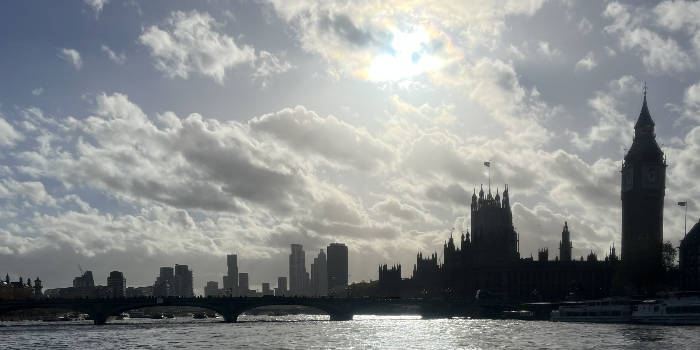
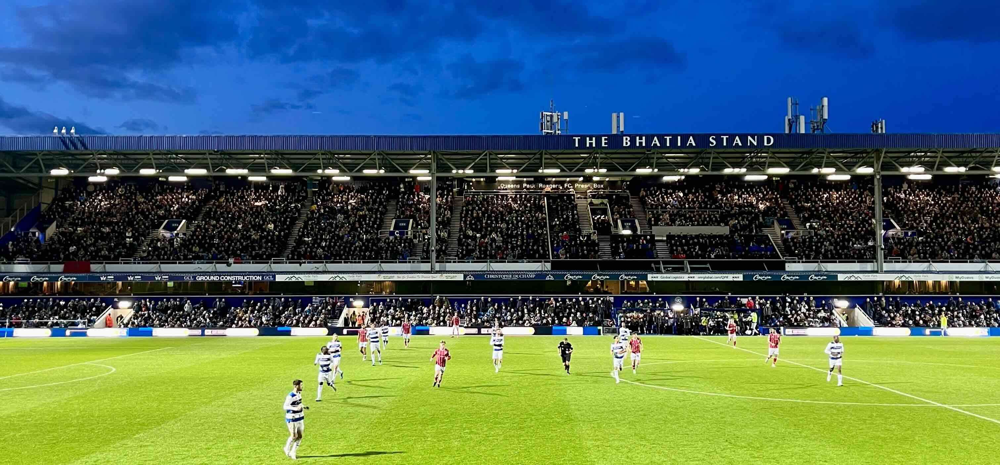
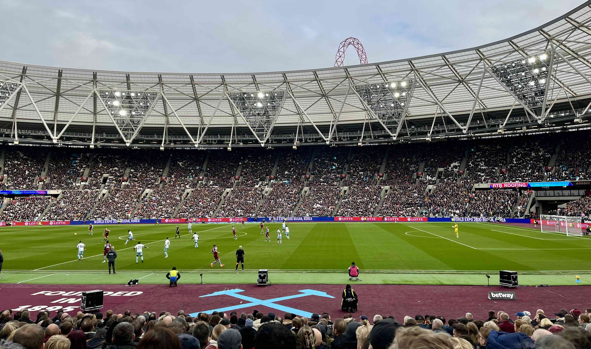
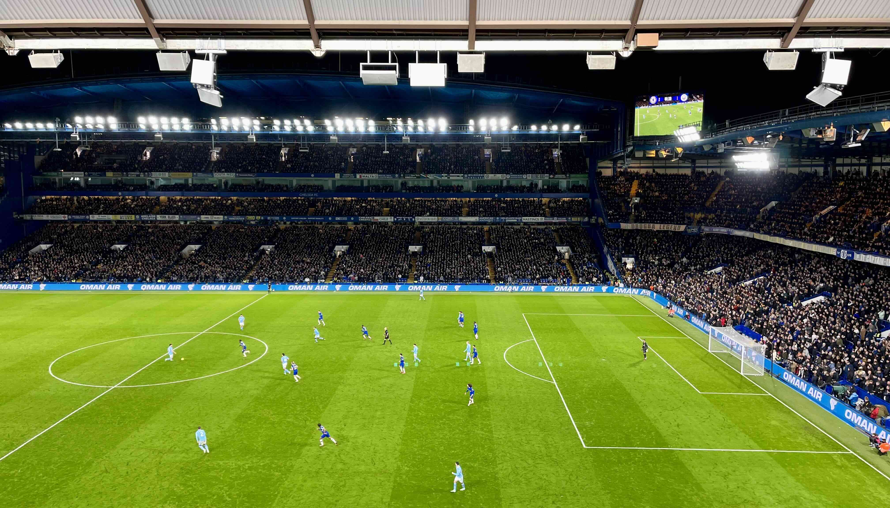
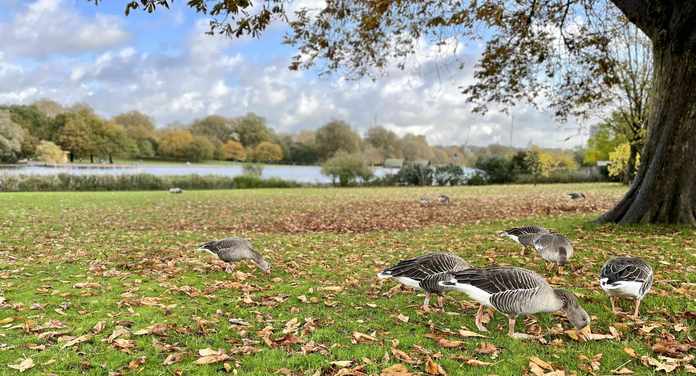
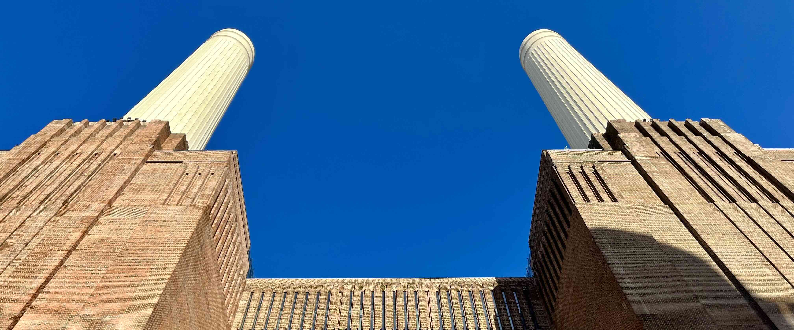

 

Krátce po začátku nové fotbalové sezóny padl mezi fanoušky kvalitního fotbalu návrh, že bychom
mohli v listopadu znovu někam vyjet! Návrhu jsem se nebránil, ale naprosto upřímně jsem neměl vůbec
čas něco zařizovat, takže jsem řekl, že se přidám, pokud se nebudu muset o nic starat.

Chvíli jsme rozmýšleli, kam se vydat. Padlo několik návrhů, ale nakonec jsme se rozhodli
pro budgetový výlet do [Londýna](https://cs.wikipedia.org/wiki/Lond%C3%BDn). Naplánovali jsme dva zápasy:

- [QPR](https://cs.wikipedia.org/wiki/Queens_Park_Rangers_FC) vs.
[Bristol City](https://cs.wikipedia.org/wiki/Bristol_City_FC)
([EFL Championship](https://cs.wikipedia.org/wiki/EFL_Championship)),
- [West Ham United](https://cs.wikipedia.org/wiki/West_Ham_United_FC) vs.
[Nottingham Forrest](https://cs.wikipedia.org/wiki/Nottingham_Forest_FC)
([Premier League](https://cs.wikipedia.org/wiki/Premier_League)).

Od druhého zmíněného jsme si navíc slibovali účast českých legionářů
[Tomáše Součka](https://cs.wikipedia.org/wiki/Tom%C3%A1%C5%A1_Sou%C4%8Dek) a
[Vladimíra Coufala](https://cs.wikipedia.org/wiki/Vladim%C3%ADr_Coufal), což pro nás bylo velkým
lákadlem!

Až na místě jsme se rozhodli pro návštěvu třetího zápasu mezi
[Chelsea](https://cs.wikipedia.org/wiki/Chelsea_FC) a
[Manchesterem City](https://cs.wikipedia.org/wiki/Manchester_City_FC), takže
výlet nakonec nebyl tak budgetový, jak jsem si původně myslel. Stálo to ale za to!

 

#### DEN 0

V sobotu ráno jsem se vzbudil v 7 hodin, nasnídal jsem se a sbalil si věci. V 8:30 mě už před domem
čekal Martin a Kuba. Martin nás odvezl na brněnské letiště, kde jsme se sešli s Bertem. V 10:45 nám
letělo letadlo do [Londýna](https://cs.wikipedia.org/wiki/Lond%C3%BDn). Docela pohodlný, když
nebydlíte v [Kyjově](https://cs.wikipedia.org/wiki/Kyjov), ale kousek od centra Brna, že jo?

V průběhu letu jsem mazal fotky na telefonu a chilloval. Po příletu jsme si dali lehký oběd, potom
sedli na vlak a přesunuli se na [hotel](https://www.booking.com/hotel/gb/novotellondonwest.en-gb.html).
Tam jsme nechali batohy a zavolali si [Uber](https://cs.wikipedia.org/wiki/Uber). Přijel pro nás
Polák Mateusz, od kterého jsme se během 10minutové cesty dozvěděli, že od svých 5 let vyrůstal
ve Velké Británii, a tak neví, kde je Brno ani jak se jmenuje hlavní město Rakouska.

Na [Loftus Road Stadium](https://cs.wikipedia.org/wiki/Loftus_Road) jsme z 11. řady sledovali zápas
domácího [QPR](https://cs.wikipedia.org/wiki/Queens_Park_Rangers_FC) proti
[Bristolu City](https://cs.wikipedia.org/wiki/Bristol_City_FC). Po velice bojovném, ale jinak hodně
nezáživném výkonu obou celků skončil zápas pravděpodobně spravedlivou remízou 0:0.

 

*Zápas mezi [QPR](https://cs.wikipedia.org/wiki/Queens_Park_Rangers_FC) a
[Bristolem City](https://cs.wikipedia.org/wiki/Bristol_City_FC) na
[Loftus Road Stadium](https://cs.wikipedia.org/wiki/Loftus_Road).*

 

Po zápase jsme se jeli ubytovat na
[hotel](https://www.booking.com/hotel/gb/novotellondonwest.en-gb.html) a poté jsme zašli na večeři
do podniku [The Distillers](https://www.distillershammersmith.co.uk/), kde jsem si dal hamburger
s halloumi sýrem a hranolky.

Na [hotel](https://www.booking.com/hotel/gb/novotellondonwest.en-gb.html) jsme dorazili kolem 22. hodiny
a po náročném dni jsme si šli brzo lehnout.

 

#### DEN 1

Po budíčku v 7 hodin jsme zašli na snídani do nedalekého podniku
[Kave Cafe](https://www.instagram.com/kavecafelondon). Ve velice pěkné kavárně jsem si dal krocana
se sýrem a zelený čaj.

U snídaně Bert zmínil, že se stále ještě prodávají lístky na zápas mezi
[Chelsea](https://cs.wikipedia.org/wiki/Chelsea_FC) a
[Manchesterem City](https://cs.wikipedia.org/wiki/Manchester_City_FC),
který začínal krátce po zápase [West Hamu United](https://cs.wikipedia.org/wiki/West_Ham_United_FC).
Při pomyšlení na to, že nás odpoledne možná čeká něco podobného jako včera na
[Loftus Road Stadium](https://cs.wikipedia.org/wiki/Loftus_Road),
protože [West Ham United](https://cs.wikipedia.org/wiki/West_Ham_United_FC) a
[Nottingham Forrest](https://cs.wikipedia.org/wiki/Nottingham_Forest_FC) patří spíše k průměrným
týmům [Premier League](https://cs.wikipedia.org/wiki/Premier_League), říkal jsem si, že zápas mojí
oblíbené [Chelsea](https://cs.wikipedia.org/wiki/Chelsea_FC) proti nejlepšímu současnému
týmu na světě by mohl celý víkend posunout na úplně jinou úroveň! Když jsem navíc zjistil, že lístky
bylo ještě v den zápasu možné koupit za polovinu toho, co poptávaly české agentury v době, kdy jsme
celý výlet plánovali, začala mi návštěva
[Stamford Bridge](https://cs.wikipedia.org/wiki/Stamford_Bridge) dávat smysl!

Protože Kubovi nebylo kvůli začínající nemoci úplně do smíchu, rozhodl se, že po zápase
[West Hamu United](https://cs.wikipedia.org/wiki/West_Ham_United_FC) pojede odpočívat na
[hotel](https://www.booking.com/hotel/gb/novotellondonwest.en-gb.html) a na
[Chelsea](https://cs.wikipedia.org/wiki/Chelsea_FC) se tím pádem nepřidá. Ještě v kavárně jsem proto
nažhavil nějakou [pochybnou překupnickou stránku](https://seatpick.com/), kterou mi doporuřil Bert,
a koupil pouze dva lístky. Krátce po tom, co se mi z účtu strhlo 10.000 CZK, přišel mi email
s potvrzením objednávky. Žádné lístky v něm ale nebyly. Lekl jsem se, že jsem se nechal napálit.
V emailu sice bylo napsáno, že lístky dorazí v následujících 48 hodinách, ale do zápasu jich zbývalo
už jenom 8, což mi na klidu moc nepřidalo! Po snídani jsme se ale vydali ještě pro teplé oblečení
do [hotelu](https://www.booking.com/hotel/gb/novotellondonwest.en-gb.html) a když jsme vyjížděli
výtahem do našeho 8. patra, lístky přišly! Sice na nich byla napsaná úplně cizí jména, ale v tu
chvíli jsem už věřil, že se na stadion dostaneme.

S plným žaludkem a klidným srdcem jsme se metrem přesunuli
k [Westminsterskému paláci](https://cs.wikipedia.org/wiki/Westminstersk%C3%BD_pal%C3%A1c). Od něj
jsme se prošli podél řeky Temže až k [Tate Modern](https://cs.wikipedia.org/wiki/Tate_Modern).
Na oběd jsme se zastavili na trhu [Borough Market](https://en.wikipedia.org/wiki/Borough_Market),
kde bylo možné dát si jídlo snad ze všech světových kuchyní, které vás napadnou. Já jsem se zastavil
u stánku s asijskými pokrmy, kde jsem si koupil tofu s rýží.

Po obědě už byl čas na přesun na fotbalový zápas. Ze zastávky Stratford jsme se po krátkém bloudění
v nákupním centru dostali do
[Olympijského parku](https://cs.wikipedia.org/wiki/Olympijsk%C3%BD_park_(Lond%C3%BDn)). Prošli jsme
kolem [Aquatics Centra](https://cs.wikipedia.org/wiki/Lond%C3%BDnsk%C3%A9_centrum_plaveck%C3%BDch_sport%C5%AF),
až jsme se dostali k monumentálnímu
[London Stadium](https://cs.wikipedia.org/wiki/Olympijsk%C3%BD_stadion_(Lond%C3%BDn)).
Na velkoformátové obrazovce na vnější stěně stadionu se už promítaly sestavy obou mužstev.
A čeští zástupci v nich nechyběli!

Na moderním stadionu jsme poté sledovali první polovinu zápasu domácího
[West Hamu United](https://cs.wikipedia.org/wiki/West_Ham_United_FC) proti
[Nottinghamu Forrest](https://cs.wikipedia.org/wiki/Nottingham_Forest_FC). Přestože domácí šli
rychle do vedení, nebezpečným hostím se podařilo ještě do konce poločasu vyrovnat. Po 45 minutách
byl tak stav nerozhodný 1:1.

 

*Zápas mezi [West Hamem United](https://cs.wikipedia.org/wiki/West_Ham_United_FC) a
[Nottinghamem Forrest](https://cs.wikipedia.org/wiki/Nottingham_Forest_FC) na
[London Stadium](https://cs.wikipedia.org/wiki/Olympijsk%C3%BD_stadion_(Lond%C3%BDn)).*

 

Protože jsme přesun na další zápas původně úplně neodhadli, s Bertem jsme se zvedli už o poločase,
zavolali si taxi a absolvovali jsme skoro 1,5 hodiny dlouhou cestu ke stadionu
[Stamford Bridge](https://cs.wikipedia.org/wiki/Stamford_Bridge). Cestou jsme sledovali stav zápasu
[West Hamu United](https://cs.wikipedia.org/wiki/West_Ham_United_FC). Když jsme viděli, že ve druhém
poločase padly ještě další tři góly a že rozhodující branku na 3:2 vstřelil v samém závěru utkání
Čech [Tomáš Souček](https://cs.wikipedia.org/wiki/Tom%C3%A1%C5%A1_Sou%C4%8Dek), začali jsme si
brzký odchod ze stadionu vyčítat. V tu chvíli jsme ale nevěděli, co nás čeká na
[Stamford Bridge](https://cs.wikipedia.org/wiki/Stamford_Bridge)!

Protože silnice kolem stadionu byly uzavřeny, posledních 500 metrů jsme museli dojít pěšky. Když
jsme přišli na místa, už probíhal ceremoniál na uctění památky britských legií. Ten víkend už náš
třetí!

Hned po úvodním hvizdu se začalo hrát ve vysokém tempu. Šance střídala šanci a hra se přelévala
z jedné strany na druhou. Fanoušci hnali své svěřence dopředu a neutichli ani po prvním gólu, který
padl po sporné penaltě v 25. minutě. Krátce po ní přišlo vyrovnání. Na roh z právé strany si
neskočil nejstarší hráč na hřišti [Thiago Silva](https://cs.wikipedia.org/wiki/Thiago_Silva) a hlavou
uklidil míč do sítě. Společně s ostatními fanoušky jsem v tu chvíli vyskočil ze sedaček a začal se
objímat s přibližně stejně starým černouškem sedícím napravo ode mě. Poté jsme se zaradovali
i s jeho dvěma bílými kamarády. Trojice staříků sedících po mojí levici zůstala v klidu. Do konce
poločasu padly ještě další dva góly a ten tak skončil poměrem 2:2. Průběh oslav u gólu domácího celku
měl hodně podobný průběh jako v prvním případě. Druhý gól hostujícího týmu okomentovala skupinka
vedle mě slovy: "Way too cheap!"

Před začátkem druhé půle jsem zjistil, že vedle Berta je volné místo, a tak jsem se přesunul za ním.
Společně jsme poté sledovali prakticky identických 45 minut. Ty nabídly další 2 góly na obou stranách.

Když v 86. minutě vstřelil hostující Rodri gól na 4:3
pro [Manchester City](https://cs.wikipedia.org/wiki/Manchester_City_FC), myslel jsem si, že se
[Chelsea](https://cs.wikipedia.org/wiki/Chelsea_FC) už nezvedne. Bylo ale skvělé vidět, že i když
skoro celý stadion ztichnul, asi 20 řad před námi vstal jeden z domácích fanoušků, otočil se za sebe
a začal burcovat dav, aby začal podporovat hráče [Chelsea](https://cs.wikipedia.org/wiki/Chelsea_FC)
právě ve chvíli, kdy to nejvíc potřebují. Chvíli na to se rozezněl kotel domácích, který strhl celý
stadion. V nastaveném čase odpískal rozhodčí faul na domácího hráče v pokutovém území
[Manchesteru City](https://cs.wikipedia.org/wiki/Manchester_City_FC). K nařízené penaltě se postavil
odchovanec [Manchesteru City](https://cs.wikipedia.org/wiki/Manchester_City_FC)
[Cole Palmer](https://cs.wikipedia.org/wiki/Cole_Palmer), který pokutový kop s ledovým klidem
proměnil. V tu chvíli se [Stamford Bridge](https://cs.wikipedia.org/wiki/Stamford_Bridge) dostal
do naprosté extáze!

O pár minut později přišel hvizd rozhodčího, který ukončil zápas za stavu 4:4.

1 zápas. 2 top kluby. 8 branek. Nepopsatelná atmosféra. Neskutečný zážitek. Ne nadarmo následně
média označila [utkání Chelsea proti Manchesteru City](https://www.youtube.com/watch?v=49bPz5eL0KY)
titulem ["zápas roku"](https://www.fotbalportal.cz/anglie/premier-league/66824-zapas-roku-na-stamford-bridge-remiza-o-8-golech-mezi-chelsea-a-manchesterem-city-byla-famozni/)!

 

*Zápas roku mezi [Chelsea](https://cs.wikipedia.org/wiki/Chelsea_FC) a
[Manchesterem City](https://cs.wikipedia.org/wiki/Manchester_City_FC) na
[Stamford Bridge](https://cs.wikipedia.org/wiki/Stamford_Bridge).*

 

Cestou na [hotel](https://www.booking.com/hotel/gb/novotellondonwest.en-gb.html) jsme se zastavili
na večeři v restauraci [The Colton Arms](https://www.colton-arms.com/). Po příchodu
na [hotel](https://www.booking.com/hotel/gb/novotellondonwest.en-gb.html) jsme se umyli a plní dojmů
si šli lehnout.

 

#### DEN 2

Ráno mělo hodně podobný průběh jako to minulé - budíček v 7 hodin a následná snídaně
v [Kave Cafe](https://www.instagram.com/kavecafelondon), kde jsme tentokrát koupili pouze snídani,
žádné lístky!

Po snídani jsme se šli projít do [Hyde Parku](https://cs.wikipedia.org/wiki/Hyde_Park_(Lond%C3%BDn)).
Zastavili jsme se u
[památníku Princezny Diany](https://cs.wikipedia.org/wiki/Pam%C3%A1tn%C3%ADk_Diany,_princezny_z_Walesu)
a také u [Galerie Serpentine](https://www.serpentinegalleries.org/). Ta je významná nejen dočasnými
expozicemi umění, ale také tím, že každý rok v létě zviditelňuje začínající architekty narozené mimo
britské ostrovy. Nabízí jim totiž místo vedle budovy galerie, který architekt může použít pro vlastní
ukázkovou realizaci. Shodli jsme se na tom, že za pár let se tam pojedeme podívat na Kubovu realizaci! ❤️

 

*Kachny u [památníku Princezny Diany](https://cs.wikipedia.org/wiki/Pam%C3%A1tn%C3%ADk_Diany,_princezny_z_Walesu).*

 

Po procházce parkem jsme jeli na zastávku
[Battersea Power Station](https://cs.wikipedia.org/wiki/Elektr%C3%A1rna_Battersea), kde jsme se
podívali na zrenovovanou budovu staré uhelné elektrárny, ve které se dnes nacházejí byty, kanceláře
a obchodní centrum. Celý komplex stojí na moc pěkném místě u řeky Temže a je obklopen moderními
bytovými domy.

 

*[Battersea Power Station](https://cs.wikipedia.org/wiki/Elektr%C3%A1rna_Battersea).*

 

Uvnitř nákupního centra jsme si dali hodně malý oběd a poté se nalodili na místní přívoz. Lodí jsme
se projeli přes centrum [Londýna](https://cs.wikipedia.org/wiki/Lond%C3%BDn) až na zastávku
[Canary Wharf](https://cs.wikipedia.org/wiki/Canary_Wharf), kde se nachází londýnský finanční
distrikt. V [Canary Wharf](https://cs.wikipedia.org/wiki/Canary_Wharf) jsme se prošli mezi výškovými
budovami. Kanceláře zde mají firmy jako [Barclays](https://cs.wikipedia.org/wiki/Barclays),
[HSBC](https://cs.wikipedia.org/wiki/HSBC), nebo [KPMG](https://cs.wikipedia.org/wiki/KPMG).

Poté jsme nasedli na metro a jeli na
[letiště Stansted](https://cs.wikipedia.org/wiki/Leti%C5%A1t%C4%9B_London_Stansted), kde jsme prošli
dlouhou bezpečnostní kontrolou, najedli se v restauraci The Windmill a nakoupili suvenýry.

V 18 hodin jsme odletěli společně s ostatními fotbalovými příznivci do Brna. V hlavním městě Moravy
nám těsně ujel autobus do centra města, a tak jsme si objednali náš poslední
[Uber](https://cs.wikipedia.org/wiki/Uber). Domů jsem dorazil krátce před 22. hodinou.

 

#### DOJMY Z LONDÝNA

- Sobotní let v 10:45 z Brna do [Londýna](https://cs.wikipedia.org/wiki/Lond%C3%BDn) byl velice
pohodlný! Abych ho stihnul, nemusel jsem brzo vstávat, brněnské letiště mám blízko a navíc z něj
skoro nic nelétá, takže ani není potřeba na něj jezdit s nějakým velkým časovým předstihem. Na let
relativně dobře navazují i odpolední fotbalové zápasy v severní části
[Londýna](https://cs.wikipedia.org/wiki/Lond%C3%BDn), takže příště bych se podobnému výletu na
[Emirates Stadium](https://cs.wikipedia.org/wiki/Emirates_Stadium), nebo
[Tottenham Hotspur Stadium](https://cs.wikipedia.org/wiki/Tottenham_Hotspur_Stadium) vůbec nebránil! 🛫
- Zápas na [Loftus Road Stadium](https://cs.wikipedia.org/wiki/Loftus_Road) pro mě byl jedním velkým
utrpením! Na fotbal se skoro nedalo dívat, sedačka přede mnou mě řezala do kolen a atmosféra taky za
moc nestála. Na [QPR](https://cs.wikipedia.org/wiki/Queens_Park_Rangers_FC) mě už příště nikdo
nedostane! ❌
- Zpětně musím uznat, že kombinovat zápas [West Hamu United](https://cs.wikipedia.org/wiki/West_Ham_United_FC)
a [Chelsea](https://cs.wikipedia.org/wiki/Chelsea_FC) nebylo nejchytřejší. Kvůli přesunu jsme museli
[London Stadium](https://cs.wikipedia.org/wiki/Olympijsk%C3%BD_stadion_(Lond%C3%BDn)) opustit už
o poločase, takže jsme vlastně vyhodili peníze za lístky oknem. Navíc jsme se rozdělili s Kubou,
což mě zpětně taky moc netěšilo. 😿
- Zápas [Chelsea](https://cs.wikipedia.org/wiki/Chelsea_FC) proti
[Manchesteru City](https://cs.wikipedia.org/wiki/Manchester_City_FC) byl nejlepším sportovním
zážitkem mého života! Všechno perfektně vyšlo - atmosféra, průběh zápasu i výsledek.
A já si to neskutečně užil! 🎉
- Jednalo se už o mojí 5. návštěvu [Londýna](https://cs.wikipedia.org/wiki/Lond%C3%BDn) a já si
upřímně nemyslel, že mě ještě něco v hlavním městě Anglie překvapí. Ale stalo se. Kuba připravil
parádní program podpořený výkladem z pohledu architekta, který z výletu udělal něco víc než
"jen" cestu za fotbalem! 🏭
- Vzpomínám si, že když jsme s Klárou navštívili [Londýn](https://cs.wikipedia.org/wiki/Lond%C3%BDn)
před 5 lety, město mi tehdy přišlo neskutečně přelidněné. V tu dobu jsem si říkal, že bych tam určitě
nechtěl žít. Tentokrát jsem to ale cítil trošku jinak! Nevím, zda to bylo jiným ročním obdobím,
nebo tím, že jsme neobráželi úplně největší londýnské památky, ale nyní se mi
[Londýn](https://cs.wikipedia.org/wiki/Lond%C3%BDn) tolik zaplněný nezdál. Dokonce jsem si říkal, že
to tam není vůbec špatné a život v některých čvrtích bych si určitě představit dokázal! ❤️

 

#### FOTKY

Fotky z [Londýna](https://cs.wikipedia.org/wiki/Lond%C3%BDn)
najdete [zde](https://photos.app.goo.gl/MZJdgHH14SGQQUr56).
