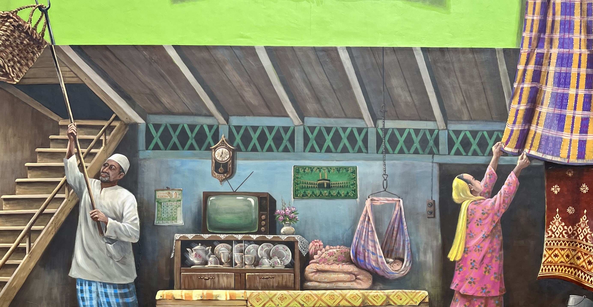
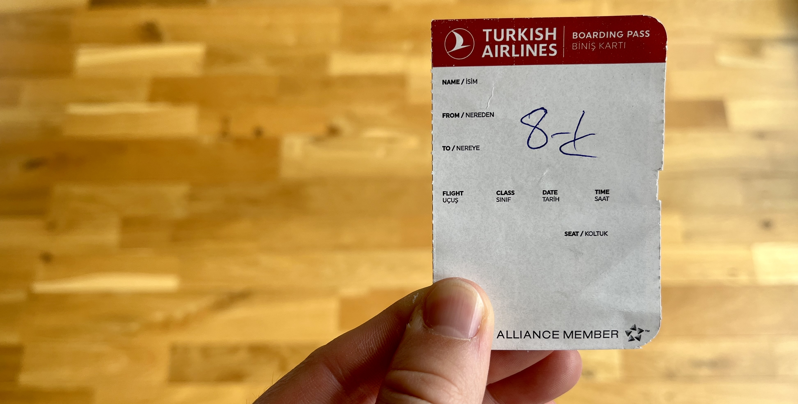
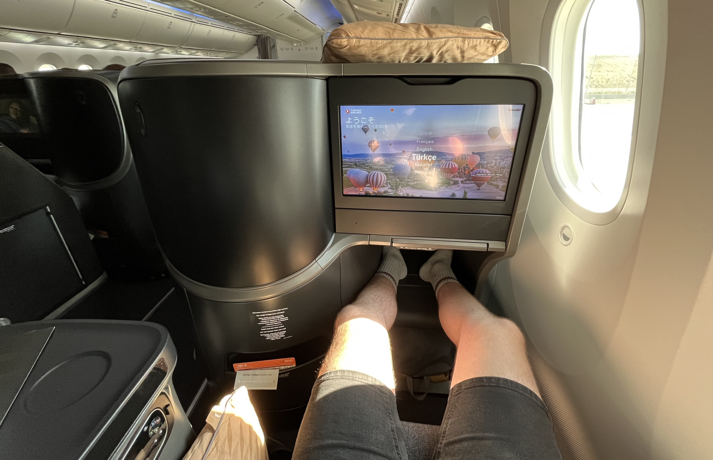
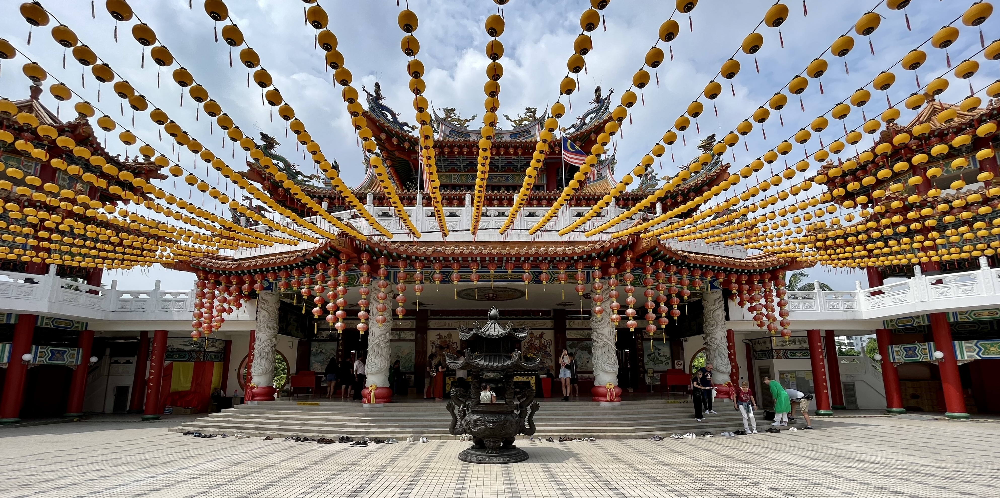
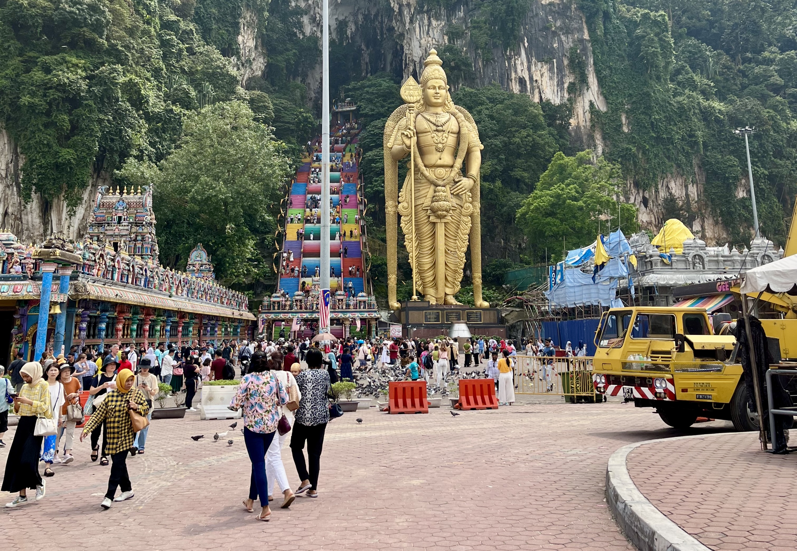
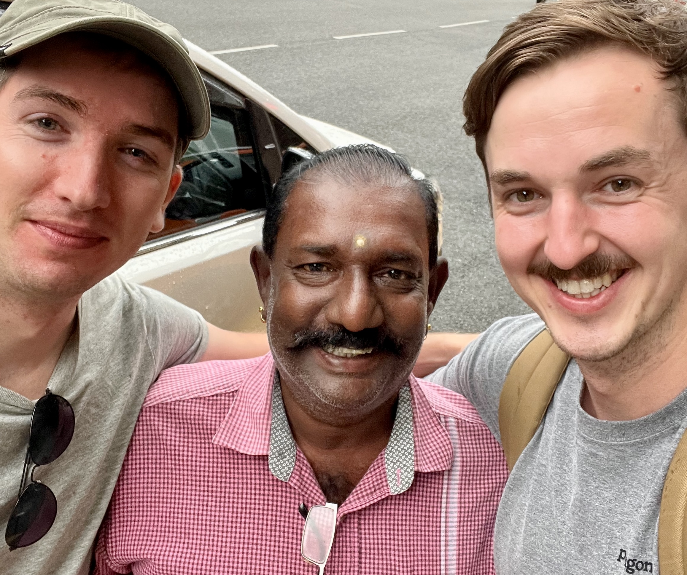
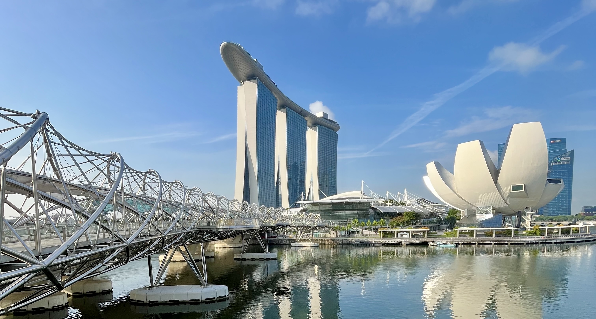
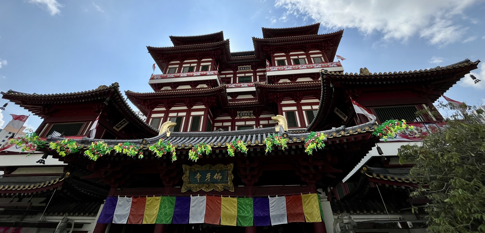
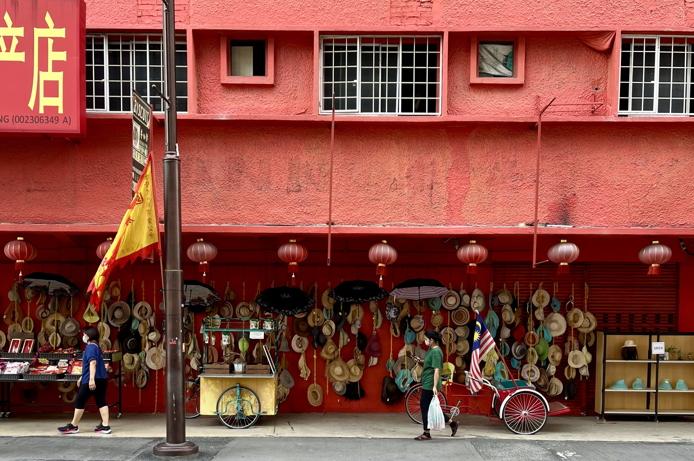

 

Když jsme na začátku roku organizovali v práci sérii interních
[meet-upů](https://svetuspesnych.cz/co-je-to-meet-up-a-proc-se-na-nem-lide-setkavaji/) v Brně
a v Praze, nečekal jsem, že se díky tomu dostanu do [Malajsie](https://cs.wikipedia.org/wiki/Malajsie).
A hle! Stalo se.

Pojďme si to ale shrnout pěkně od začátku. Každý rok v lednu organizuje naše oddělení dva veřejné
[meet-upy](https://svetuspesnych.cz/co-je-to-meet-up-a-proc-se-na-nem-lide-setkavaji/) - jeden v Brně
a jeden v Praze. Každý [meet-up](https://svetuspesnych.cz/co-je-to-meet-up-a-proc-se-na-nem-lide-setkavaji/)
má stejný program. Pokud tedy jdete na ten v Praze, na brněnském se už nic nového nedozvíte.
Dělá se to tak ze dvou důvodů.

1. Se stejným obsahem chceme oslovit komunity ve dvou největších městech v Česku.
2. Když už někdo investuje čas do přípravy přednášky, chceme, aby se to využilo na maximum.

I proto jsem si po sérii dvou
[meet-upů](https://svetuspesnych.cz/co-je-to-meet-up-a-proc-se-na-nem-lide-setkavaji/) řekl, že by
bylo fajn využít talk i na dalších akcích, a tak jsem krátce
po [meet-upech](https://svetuspesnych.cz/co-je-to-meet-up-a-proc-se-na-nem-lide-setkavaji/)
v Brně a Praze zamířil do Bratislavy, kde jsem vystoupil na akci pořádané společnostmi
[kiwi](https://www.kiwi.com/) a [slido](https://www.slido.com/). Krátce potom jsem se rozhodl
přihlásit přednášku na několik konferencí různě po světě. Z 10 přihlášek mi vyšly 3, konkrétně
v [Namibii](https://cs.wikipedia.org/wiki/Namibie), [Malajsii](https://cs.wikipedia.org/wiki/Malajsie)
a [Japonsku](https://cs.wikipedia.org/wiki/Japonsko). Do [Namibie](https://cs.wikipedia.org/wiki/Namibie)
jsem nejel, protože v té době mi firma nemohla poskytnout žádné peníze na cestu.
[Malajsie](https://cs.wikipedia.org/wiki/Malajsie) klapla. To už peníze byly.
[Japonsko](https://cs.wikipedia.org/wiki/Japonsko) ale nevyšlo, protože jsem rozpočet využil
na [Malajsii](https://cs.wikipedia.org/wiki/Malajsie).

Pokud by přijetí z [Japonska](https://cs.wikipedia.org/wiki/Japonsko) přišlo dřív, určitě bych jel
raději tam. Jednalo se totiž o mnohem prestižnější konferenci, která nabízela i možnost zpětného
příspěvku na cestu. To ale jen v případě, že člověk potvrdí účast a následně bude mít štěstí,
když bude komise přerozdělovat finance uchazečům. To jsem ale nechtěl riskovat, a tak jsem
[Japonsko](https://cs.wikipedia.org/wiki/Japonsko) odmítl.

Z [Malajsie](https://cs.wikipedia.org/wiki/Malajsie) jsem byl ale nadšený. Pokud nepočítám
[Turecko](https://cs.wikipedia.org/wiki/Turecko) a [Rusko](https://cs.wikipedia.org/wiki/Rusko),
v Asii jsem do té doby nikdy nebyl, a tak jsem se těšil na nová dobrodružství! Na druhou stranu
ale musím přiznat, že byla i jedna věc, která mě před cestou trošku znervózňovala, a to skutečnost,
že tak daleko pojedu sám. Když jsem si před cestou uvědomil, že jsem v zahraničí nikdy sám nebyl,
že neumím trávit čas osamotě (zeptejte se Kláry) a že z mnoha věcí bývám často nervózní
nebo vystrašený, nedělala mi představa týdenního pobytu 10,000 km daleko od domova úplně dobře.
A to nemluvím ještě o tom, že jsem měl přednášet na konferenci. V angličtině.

Jak se ale říká, člověk míní, Pán Bůh mění. Asi měsíc před cestou jsem šel na nedělní mši do kostela,
kde jsem potkal Adama. Jako obvykle jsme potom šli společně domů, přičemž jsem se mu pochlubil, že
na konci srpna mířím do [Malajsie](https://cs.wikipedia.org/wiki/Malajsie). Hned nato se mě Adam
zeptal: "A jedeš sám?" Já odkýval, že ano. "Tak už nejedeš!" odpověděl. A tak jsme jeli dva!

 

#### DEN 0

V 6 hodin ráno jsem se probudili ve sleeping boxu v naší pražské kanceláři, nasedli do taxíku
a vyrazili na letiště.

Ač bylo brzo ráno, s panem řidičem jsme si až nečekaně dobře popovídali. Protože jsme jeli
na letiště, logickým tématem bylo cestování. Pan řidič jen mezi řečí zmínil, že i on byl jednou
v jihovýchodní Asii, a to asi před pěti lety, když se na [Bali](https://cs.wikipedia.org/wiki/Bali)
ženil jeho dobrý kamarád. Hodně mě to překvapilo, protože neznám nikoho, kdo by kvůli svatbě pozval
50 lidí na [Bali](https://cs.wikipedia.org/wiki/Bali). Chvíli jsme se na to téma bavili - já se ptal,
jak svatba probíhala, zda měli hosté připravený i nějaký "doprovodný program" a zda se panu řidiči
na [Bali](https://cs.wikipedia.org/wiki/Bali) líbilo. Po nějaké chvíli jsme ale téma opustili
a pan řidič se mě zeptal, jestli kvůli práci hodně cestuju. Začal jsem proto zeširoka popisovat, že
kvůli práci necestuji skoro vůbec, ale často jezdíme do zahraničí s manželkou a kromě toho se snažíme
pravidelně jezdit i za fotbalem s naším pánským klubem. To už jsme byli v areálu letiště, když se
pan řidič loučil se slovy: "Tak vám, jakožto fanouškovi fotbalu, to říct můžu. Ten kamarád, co se
ženil na [Bali](https://cs.wikipedia.org/wiki/Bali), byl
[Dan Pudil](https://cs.wikipedia.org/wiki/Daniel_Pudil).
A znám se i s [Matějem Vydrou](https://cs.wikipedia.org/wiki/Mat%C4%9Bj_Vydra), takže jsem se párkrát
zajel podívat na [Watford](https://cs.wikipedia.org/wiki/Watford_FC)!" Nebudu nikomu nic nalhávat,
v tu chvíli mi úplně spadla čelist.

Na letišti jsme prošli pasovou a bezpečnostní kontrolou a kolem 7:30 jsme si dali snídani.
V 9:20 jsme vzlétli do vzduchu a zamířili do [Istanbulu](https://cs.wikipedia.org/wiki/Istanbul).
Celý let jsem prokecal s manželi Aschenbrennerovými z Prahy. Pár aktivních důchodců mi velkou část
cesty popisoval, které země už společně navštívili, kde se jim líbilo a kam by se naopak už nikdy
nevrátili. S panem Petrem jsme si také nějakou dobu povídali o našich zaměstnáních. Ač už jsou
manželé v důchodu, pán říkal, že občas ještě přijímá nějaké zakázky v rámci své projektantské praxe
a protože jsme si s pánem docela sedli a paní hrozně zajímalo, jak se mi bude líbit
v [Malajsii](https://cs.wikipedia.org/wiki/Malajsie), dali mi na sebe číslo, abych jim
z [Kuala Lumpur](https://cs.wikipedia.org/wiki/Kuala_Lumpur) poslal pár fotek.

Kolem 13. hodiny místního času jsme přiletěli do [Istanbulu](https://cs.wikipedia.org/wiki/Istanbul)
a na místním mezinárodním letišti si zašli na oběd. Já jsem si nemohl dát nic jiného než tureckou
klasiku v podobě kebabu, Adam také zvolil klasiku, jen tu americkou v podobě cheeseburgeru. Další
hodinu jsme se poflakovali na letišti a zabíjeli čas do doby nástupu do letadla. Když jsem se jako
poslední pasažér dostal k pultíku u brány a přiložil palubní vstupenku ke čtečce, rozsvítilo
se červené světlo a zaměstnanec letiště mi oznámil, že mi musí změnit místo v letadle. Moc jsem
nepochopil proč, ale on vytáhl nějaký kousek papíru, napsal na něj "8-K" a řekl, že můžu jít.
Nejdřív jsem si říkal, že "8-K" bude při mé smůle místo u záchodů, které už nikdo nechtěl, nakonec
se ukázalo, že místo u záchodů to sice bylo, ale... Když jsem přišel do letadla, namířil jsem si to
automaticky do [třídy economy](https://cs.wikipedia.org/wiki/Turistick%C3%A1_t%C5%99%C3%ADda), tam
ale žádná řada 8 nebyla. [Třída economy](https://cs.wikipedia.org/wiki/Turistick%C3%A1_t%C5%99%C3%ADda)
totiž začínala řadou 9. A v tom mě to trklo - dostal jsem
[první třídu](https://cs.wikipedia.org/wiki/Prvn%C3%AD_t%C5%99%C3%ADda)!

 

*Moje vstupenka do vyšší společnosti.*

 

Když jsem zpětně hledal, čím to mohlo být, zjistil jsem, že na daný let se pravděpodobně prodalo
více letenek do [třídy economy](https://cs.wikipedia.org/wiki/Turistick%C3%A1_t%C5%99%C3%ADda), a tak
musela letecká společnost vybrat několik šťastlivců, které pošle
do [první třídy](https://cs.wikipedia.org/wiki/Prvn%C3%AD_t%C5%99%C3%ADda). Jedním z faktorů
je u některých společností cena letenky, tedy kdo si koupí dražší letenku, ten bude pravděpodobněji
přeřazen do [první třídy](https://cs.wikipedia.org/wiki/Prvn%C3%AD_t%C5%99%C3%ADda). To u nás ale
neplatilo, protože Adamova letenka stála více a i tak seděl
ve [třídě economy](https://cs.wikipedia.org/wiki/Turistick%C3%A1_t%C5%99%C3%ADda). Myslím si proto,
že já se dostal do první třídy proto, že jsem členem věrnostního programu u Turkish Airlines.
Vtipné je, že jsem se do něj dostal jen proto, že jsem si kupoval letenku
do [Kuala Lumpur](https://cs.wikipedia.org/wiki/Kuala_Lumpur) přes mobilní aplikaci aerolinky.

A co taková cesta v [první třídě](https://cs.wikipedia.org/wiki/Prvn%C3%AD_t%C5%99%C3%ADda) u jedné
z nejlepších aerolinek světa zahrnovala?

- Měl jsem hromadu místa na nohy a automaticky polohovatelnou sedačku, která se dala sklopit
do vodorovné pozice, čímž se změnila na postel.
- Obrazovka na sedadle přede mnou byla větší než monitor mého notebooku.
- Pod obrazovkou bylo možné vysunout stůl, který byl dvojnásobný oproti
[economy](https://cs.wikipedia.org/wiki/Turistick%C3%A1_t%C5%99%C3%ADda) a hlavně - nijak se
neviklal.
- Krátce před odletem přišel kuchař v kuchařské čepici a přijal moji objednávku z menu.
- Před servírováním stevard prostřel stůl plátěným ubrusem. Na něj položil sadu kořenek, nádob(k)u
s olivovým olejem a umělou svíčku pro navození příjemné atmosféry.
- Pití se servírovalo pouze ve skle. Na večeři se podávalo čtyřchodové menu, které se skládalo
z polévky (květákový krém), předkrmu (sýrový burek se salátem), hlavního chodu (špagety s kalamáry
a špenátem) a zákusku (ovocný salát).
- K dispozici byla over-head sluchátka v pevném obalu s funkcí noise-cancelling.
- Před nočním klidem přišel stevard, který mě požádal, abych vstal. Chtěl totiž připravit
"sleeping set". To znamenalo, že mi na sedadlo dal přehoz. Společně s ním donesl přikrývku a povlékl
mi polštář.
- Dostal jsem papuče, ve kterých jsem chodil po letadle.
- Vedle sedadla se nacházel můj osobní trezor - ten zůstal nevyužit.

 

*V [první třídě](https://cs.wikipedia.org/wiki/Prvn%C3%AD_t%C5%99%C3%ADda) nebyla o místo na nohy nouze.*

 

Po nástupu do letadla jsem hned vyzkoušel postel a protože jsem byl dost unavený, na chvíli jsem si
zchrupnul. Když jsem se probudil, uklidil jsem polštářek, narovnal sedačku a za chvíli se začala
servírovat večeře. Potom jsem asi dvě hodiny pracoval. Snažil jsem se připravovat prezentaci
na konferenci, ale i kvůli extrémně pomalému internetu to nešlo tak dobře, jak bych si představoval.
Kolem 3. hodiny malajského času jsem s prací seknul, přeměnil jsem sedačku na postel a šel spát.

 

#### DEN 1

Když jsem se vzbudil, do přistání zbývala už jen necelá hodina. Bohužel jsem zaspal snídani,
takže po příletu do [Malajsie](https://cs.wikipedia.org/wiki/Malajsie) jsem si za 60 CZK koupil
toustový chleba namazaný burákovým máslem, dvě vajíčka na hniličku a přeslazený čaj s mlékem.
I já se divil této kombinaci, ale jednalo se o jediné jídlo, které v letištním stánku nabízeli.
Asi nikoho nepřekvapí, že při následné cestě taxíkem do centra města se snídaně začala drát ven. 💩
Cesta trvala hodinu a moje akutní potřeba nebyla to jediné, co mě v průběhu jízdy znervozňovalo.
Po nástupu do auta jsme totiž zjistili, že pro čínskou řidičku taxi jsme jejími prvními zákazníky.
Aby se paní zaučila, celou dobu za námi jelo doprovodné vozidlo s jejím manželem. Paní evidentně
občas bojovala s aplikací, přes kterou jsme jízdu objednávali. I proto si paní se svým manželem
občas telefonovala a jednou se dokonce stalo, že jsme zastavili v odstavném pruhu čtyřproudé dálnice
a z auta za námi přiběhl ridiččin manžel, aby jí pomohl nastavit navigaci. Pořád se nám omlouvali,
že je to její první jízda. Na jednu stranu jsem chápal, že zaučení chce nějaký čas, na druhou stranu
to ale přišlo ve chvíli, kdy se mi to úplně nehodilo. Posledních 15 minut cesty bylo nekonečných.
Když nás proto paní přivezla k čínskému chrámu
[Thean Hou](https://www.cestujlevne.com/pruvodce/malajsie/kuala-lumpur/thean-hou-temple), první, co
jsem hledal, byly záchody. Naštěstí všechno dobře dopadlo!

 

*Čínský chrám [Thean Hou](https://www.cestujlevne.com/pruvodce/malajsie/kuala-lumpur/thean-hou-temple).*

 

Po prohlídce [chrámu](https://www.cestujlevne.com/pruvodce/malajsie/kuala-lumpur/thean-hou-temple),
ze kterého je nádherný výhled na [Kuala Lumpur](https://cs.wikipedia.org/wiki/Kuala_Lumpur), jsme se
pěšky vydali do centra města. Naším cílem bylo dojít až
do [hotelu](https://www.booking.com/hotel/my/santa-grand-signature-kuala-lumpur-kuala-lumpur.en-gb.html),
který se od [chrámu](https://www.cestujlevne.com/pruvodce/malajsie/kuala-lumpur/thean-hou-temple)
nacházel cca 6 km daleko. Po cestě jsme se chtěli zastavit u několika památek malajského hlavního
města. To byl plán. Nicméně podmínky nebyly úplně ideální. Obrovské horko, vysoká vlhkost vzduchu
a těžké batohy na zádech si po chvilce začaly vybírat svoji daň. Když se k tomu připočte ještě
nerozvinutá infrastruktura pro pěší, kvůli které se cesta prodloužila minimálně o polovinu, musím
zpětně konstatovat, že to nebyla úplně příjemná procházka.

Po dlouhém hledání jsme se dostali
k [národnímu muzeu](https://www.cestujlevne.com/pruvodce/malajsie/kuala-lumpur/national-museum),
[národní mešitě](https://www.cestujlevne.com/pruvodce/malajsie/kuala-lumpur/national-mosque-of-malaysia)
a nakonec i na [náměstí Merdeka](https://www.cestujlevne.com/pruvodce/malajsie/kuala-lumpur/merdeka-square),
jedno z hlavních náměstí, na kterém se kromě radnice, knihovny a malajského nultého kilometru nachází
i bývalé vládní budovy z dob britské kolonie. V tu dobu už bylo pozdní odpoledne, my měli hlad a já
skoro vybitý telefon, na kterém jsme byli kvůli navigaci závislí. Kousek
od [náměstí Merdeka](https://www.cestujlevne.com/pruvodce/malajsie/kuala-lumpur/merdeka-square) se
nám ale podařilo najít KFC. Tam jsme trošku dobili nejen telefon ale i nás. Na jídlo se podávalo
smažené kuřecí maso s rýží a vařeným vejcem (ten den už moje třetí). Po jídle jsme se ještě vrátili
na [náměstí Merdeka](https://www.cestujlevne.com/pruvodce/malajsie/kuala-lumpur/merdeka-square).
Tam jsme udělali pár fotek a potom už jsme se přesunuli
na [hotel](https://www.booking.com/hotel/my/santa-grand-signature-kuala-lumpur-kuala-lumpur.en-gb.html).
Po dlouhém letu a náročném prvním dni v [Kuala Lumpur](https://cs.wikipedia.org/wiki/Kuala_Lumpur)
jsme si chvíli odpočinuli na pokoji a kolem 19:30 jsme zašli na večeři.

V [restauraci Mojo](https://www.instagram.com/mojotherow/?hl=en) jsem ochutnal dvě pro mě typické
věci malajsijské kuchyně.

1. Ostré jídlo. Hned první večer jsem si objednal asi to nejostřejší kuřecí kari s rýží, které jsem
kdy měl. Ze zkušenosti z českých indických podniků jsem vůbec nečekal, že to bude takové peklo,
a tak jsem si od té doby dával na ostrá jídla pozor. Když jsem si nebyl jistý, raději jsem se obsluhy
ptal, jak moc ostré jídlo je.
2. Ovocný džus. Prakticky na každém rohu vám nabídnou ovocný fresh. Jedná se o opravdu čerstvou
šťávu z místního ovoce, takže džus chutná o dost jinak než ten, který si koupíte u nás. Jednak je
sladší, jednak v něm opravdu cítíte chuť ovoce. Já pil nejčastěji pomerančový džus, jednou jsem ale
vyzkoušel i šťávu z kiwi. Adam zase nejvíc ujížděl na melounovém freshi.

Cestou zpět
na [hotel](https://www.booking.com/hotel/my/santa-grand-signature-kuala-lumpur-kuala-lumpur.en-gb.html)
jsme se stavili v supermarketu koupit balenou vodu a potom šli brzo spát.

 

#### DEN 2

Druhý den v [Kuala Lumpur](https://cs.wikipedia.org/wiki/Kuala_Lumpur) jsme se vstáváním moc
nespěchali. Po probuzení jsme si zašli na snídani a poté se vydali na kopec
za [hotelem](https://www.booking.com/hotel/my/santa-grand-signature-kuala-lumpur-kuala-lumpur.en-gb.html),
kde se nachází [Menara Kuala Lumpur](https://cs.wikipedia.org/wiki/Menara_Kuala_Lumpur). "Menara"
v malajštině znamená "věž" a přestože výškových budov je
v [Kuala Lumpur](https://cs.wikipedia.org/wiki/Kuala_Lumpur) opravdu hodně, televizní věž je tam jen
jedna. Včetně antén měří 421 m a tím, že se nachází na kopci, je z ní podle průvodců jeden
z nejhezčích výhledů na celé město.

Po zakoupení vstupenek jsme se nechali vyvézt výtahem do posledního patra, které se
nachází 308 metrů nad zemí. Osobně jsem byl na výhled hodně zvědavý, ale při návštěvě přišlo menší
zklamání. Město bylo totiž zahaleno do mírného smogu, takže jsme neviděli tak dobře, jak bych si
představoval. Navíc jsem se hodně těšil na výhled
na [Petronas Twin Towers](https://cs.wikipedia.org/wiki/Petronas_Twin_Towers).
Ty jsou ale k televizní věži otočeny bokem, takže je dobře vidět pouze jedna z nich. Skvělý výhled
je ale na 678 m vysokou budovu [Merdeka 118](https://cs.wikipedia.org/wiki/Merdeka_118), která
se pyšní titulem druhé nejvyšší budovy světa.

Ve vnitřních prostorách televizní věže se nachází mapa členů
[Světové federace vysokých budov](https://www.great-towers.com/node/96), tj. asociace, která sdružuje
vysoké věže a mrakodrapy po celém světě. Zajímavostí je,
že do [asociace](https://www.great-towers.com/node/96) patří
i [Žižkovská televizní věž](https://cs.wikipedia.org/wiki/%C5%BDi%C5%BEkovsk%C3%BD_vys%C3%ADla%C4%8D)
a [bratislavský Most SNP](https://sk.wikipedia.org/wiki/Most_SNP). Ten je se svými 95 metry nejnižší
členskou budovou. Klíčovým kritériem pro zařazení stavby
do [asociace](https://www.great-towers.com/node/96) je existence veřejné vyhlídkové plošiny, i proto
si myslím, že se naši prcci na tomto bezvýznamném seznamu nacházejí. Nebudu nikomu nic
nalhávat - přítomnost obou staveb na seznamu mě hodně překvapila, na druhou stranu ale musím uznat,
že jsem byl rád, že i v daleké Asii mají Češi a Slováci svůj odkaz.

Po prohlídce věže jsme si dali oběd v jedné z tamních restaurací a poté vyrazili
do [KLCC Parku](https://www.cestujlevne.com/pruvodce/malajsie/kuala-lumpur/klcc-park). KLCC je
zkratka pro Kuala Lumpur City Center a i když
[park](https://www.cestujlevne.com/pruvodce/malajsie/kuala-lumpur/klcc-park) skutečně stojí
uprostřed rušného byznys centra, je naprostou oázou klidu, ze které se člověk může kochat pohledem
na nejvyšší dvojčata na světě - [Petronas Twin Towers](https://cs.wikipedia.org/wiki/Petronas_Twin_Towers).
Když jsme do [parku](https://www.cestujlevne.com/pruvodce/malajsie/kuala-lumpur/klcc-park) dorazili,
právě začalo pršet. I proto jsme se schovali do jedné z kaváren v okolí a čekali, až déšť ustane.
Než jsem dopil kávu, pršet přestalo. Následovala dobrá půlhodinka, při které jsem byl naprosto
fascinován dvojicí mrakodrapů, takže jsem se při procházce parkem pořád zastavoval a snažil
se vytvořit co nejhezčí fotku.

 

*Pohled na [Petronas Twin Towers](https://cs.wikipedia.org/wiki/Petronas_Twin_Towers)
z [KLCC Parku](https://www.cestujlevne.com/pruvodce/malajsie/kuala-lumpur/klcc-park).*

 

Když už jsme měli fotek dost, přesunuli jsme se na zastávku metra. Tam jsme docela dlouho bojovali
s nákupem jízdenek a tím, jak se dostat zpět
na [hotel](https://www.booking.com/hotel/my/santa-grand-signature-kuala-lumpur-kuala-lumpur.en-gb.html).
Naštěstí na zastávce pracoval usměvavý zaměstnanec metra, který nám se vším pomohl. Nejdřív nám řekl,
na kterou zastávku máme jet, potom nám vysvětlil, že nadzemkou se
na [hotel](https://www.booking.com/hotel/my/santa-grand-signature-kuala-lumpur-kuala-lumpur.en-gb.html)
určitě nedostaneme a nakonec nám i poradil, jak si koupit lístky.

Na [hotelu](https://www.booking.com/hotel/my/santa-grand-signature-kuala-lumpur-kuala-lumpur.en-gb.html)
už se nic moc zajímavé nedělo. Já jsem se připravoval na konferenci, Adam odpočíval. Večer jsme
si zašli na jídlo do hotelové restaurace a poté jsme ještě chvíli poseděli v střešním baru,
odkud byl nádherný výhled na město.

 

#### DEN 3

Předchozí večer se na mě začal projevovat 6hodinový časový posun, takže i když jsme šli spát
relativně brzo, usnul jsem až kolem 1 hodiny ranní. Třetí den ale nebyl úplně čas na to vyspávat.
V 10 hodin nás totiž měl vyzvednout
na [hotelu](https://www.booking.com/hotel/my/santa-grand-signature-kuala-lumpur-kuala-lumpur.en-gb.html)
soukromý řidič, u kterého jsme si zaplatili prohlídku města.

Abych to uvedl na pravou míru. Před cestou do [Kuala Lumpur](https://cs.wikipedia.org/wiki/Kuala_Lumpur)
jsme se s Adamem chtěli podívat hlavně na jednu památku,
a to [Petronas Twin Towers](https://cs.wikipedia.org/wiki/Petronas_Twin_Towers). Když jsem ale pár
dní před odletem začal zjišťovat, jak to se vstupenkami na věže vypadá, zjistil jsem, že na dobu
našeho pobytu už jsou všechny vyprodané. Jediná možnost proto byla objednat si vstup na mrakodrapy
jako součást nějakého výletu. Našel jsem celodenní výlet po největší památkách
[Kuala Lumpur](https://cs.wikipedia.org/wiki/Kuala_Lumpur) se soukromým řidičem, který ani nestál
tolik, a tak jsme jeli!

V 9:30 mi psal náš řidič Karthi, že už stojí
před [hotelem](https://www.booking.com/hotel/my/santa-grand-signature-kuala-lumpur-kuala-lumpur.en-gb.html)
a čeká na nás. Protože jsem v tu chvíli ještě seděl na záchodě, napsal jsem mu, že počítáme
s 10. hodinou a dřívější odjezd nestíháme. S tím řidič neměl problém. Když jsme ale v 10:01 jeli
výtahem z 18. patra našeho
[hotelu](https://www.booking.com/hotel/my/santa-grand-signature-kuala-lumpur-kuala-lumpur.en-gb.html)
do přízemí, přišla mi další zpráva. V té mi Karthi připomínal: "Už je 10!"

Po krátkém small talku nás Karthi seznámil s denním programem. První zastávka byla
u [Batu Caves](https://www.cestujlevne.com/pruvodce/malajsie/kuala-lumpur/batu-caves),
jeskynního komplexu na okraji města, který je jedním z největších hinduistických poutních míst mimo
[Indii](https://cs.wikipedia.org/wiki/Indie). Do komplexu se neplatí vstupné. K jeskyním vede
ale 270 strmých schodů, které podle mě otestují odhodlání každého poutníka velice dobře. Podél
schodů se navíc potulují drzé opice, které se stávají agresivní v případě, že u některého
z návštěvníků vidí jídlo nebo pití. Musím říct, že malí chlupáči naši návštěvu malinko kazili,
protože jsem se v jejich přítomnosti necítil úplně bezpečně.

 

*Zlatá socha boha Murugana vedle barevných schodů vedoucích
k [Batu Caves](https://www.cestujlevne.com/pruvodce/malajsie/kuala-lumpur/batu-caves).*

 

Následovaly krátké zastávky
u [královského paláce](https://www.cestujlevne.com/pruvodce/malajsie/kuala-lumpur/istana-negara)
a [národního památníku](https://www.cestujlevne.com/pruvodce/malajsie/kuala-lumpur/national-monument).
Potom jsme projeli kolem
[islámského muzea](https://www.cestujlevne.com/pruvodce/malajsie/kuala-lumpur/muzeum-islamskeho-umeni)
a [národní mešity](https://www.cestujlevne.com/pruvodce/malajsie/kuala-lumpur/national-mosque-of-malaysia)
až na staré známé
[náměstí Merdeka](https://www.cestujlevne.com/pruvodce/malajsie/kuala-lumpur/merdeka-square). Kousek
od něj Karthi zaparkoval auto a my s Adamem jsme se prošli po moderní náplavce kolem soutoku
řek Klang a Gombak. Toto místo, na kterém byly vybudovány základy
[Kuala Lumpur](https://cs.wikipedia.org/wiki/Kuala_Lumpur), se označuje jako "River of Life",
v překladu "řeka života". Podle barvy vody bych ale neřekl, že je toto označení úplně přesné. Kalná
voda ale není způsobena pouze odpadky a splašky, které do řek tečou, ale také bahnitým podložím.
[Kuala Lumpur](https://cs.wikipedia.org/wiki/Kuala_Lumpur) totiž v překladu znamená "bahnitý soutok".
Název města tedy nabízí polopravdivé vysvětlení, proč je voda v místních řekách tak hnědá.

 

*Jedna z nejstarších mešit na území [Kuala Lumpur](https://cs.wikipedia.org/wiki/Kuala_Lumpur),
[Masjid Jamek](https://www.cestujlevne.com/pruvodce/malajsie/kuala-lumpur/masjid-jamek). Ta stojí
na místě zvaném "River of Life".*

 

Po procházce kolem toxické vody jsme navštívili nedaleký
[trh](https://www.cestujlevne.com/pruvodce/malajsie/kuala-lumpur/central-market), kde nám Karthi
ukázal obrazy s malajsijským králem a ministrem. Poté jsme si dali 20 minut rozchod, který jsme
využili k nákupu několika suvenýrů. Když jsme se potkali poté zase potkali s Karthim, byl už čas
na hlavní bod programu - [Petronas Twin Towers](https://cs.wikipedia.org/wiki/Petronas_Twin_Towers)!
Karthi nás vysadil u věží, popsal nám, jak se ve složitém komplexu budov dostaneme ke vstupu
na prohlídku a popřál příjemnou zábavu. Protože do začátku komentované prohlídky zbývala více
než hodina, zašli jsme si na jídlo do nákupního centra, které se nachází v přízemí věží.

Prohlídka trvala 45 minut a byla rozdělena do tří částí. Prvních 15 minut jsme strávili na mostu,
který propojuje obě věže. Most se nachází ve 41. a 42. patře a zajímavostí je, že není s budovami
spojen napevno, ale je do nich zasunut. Tím pádem mohou věže čelit vnějším vlivům jako celek. Věže
mohou stoupat nebo klesat, mohou se vzájemně naklonit nebo se od sebe odklonit, každá až o 3,5 metru.
Most tedy neplní pouze funkci zkratky, ale funguje i jako vyrovnávací prvek v případě nepříznivým
okolních vlivů. Po krátké přednášce jsme se přesunuli do 86. patra, kde se nacházely modely věží
i budov v okolí [KLCC Parku](https://www.cestujlevne.com/pruvodce/malajsie/kuala-lumpur/klcc-park).
Posledních 15 minut jsme se už jen kochali výhledem z 83. patra, kde se nacházejí obchody se suvenýry
a občerstvením. Kolem 17. hodiny nás Karthi vyzvedl u věží a zavezl zpět
do [hotelu](https://www.booking.com/hotel/my/santa-grand-signature-kuala-lumpur-kuala-lumpur.en-gb.html).

 

*Selfie s Karthim.*

 

Podvečer jsem znovu strávil přípravou na konferenci. Na večeři jsme poté vyrazili do jednoho
bistra v okolí, kde jsme si dali butter chicken s rýží a vynikající ovocný džus!

 

#### DEN 4

Čtvrtý den v [Malajsii](https://cs.wikipedia.org/wiki/Malajsie) byl dedikován
[konferenci PyCon](https://www.facebook.com/PyConMYofficial/), na které jsem měl vystoupit i já
se svým talkem. Abychom všechno stihli, vstali jsme brzo a po snídani zamířili
na [Malajsijsou univerzitu](https://www.um.edu.my/),
kde [konference](https://www.facebook.com/PyConMYofficial/) probíhala.

Po příjezdu se nám dostalo opravdu vřelého přivítání od Maxe, Ivy a Ivana, organizátorů celého
eventu. V 9 hodin odstartovala [konference](https://www.facebook.com/PyConMYofficial/) úvodní
přednáškou od pana [Maxe Onga](https://www.linkedin.com/in/maxongzb/). Ten nemluvil zase tolik
o programování, ale spíše o tom, co dělat, aby se člověk ve své kariéře někam posunul a ve výsledku
dělal něco, co ho bude bavit a naplňovat.

Po první keynotě se program [konference](https://www.facebook.com/PyConMYofficial/) rozdělil
do dvou současně probíhajících částí. První z nich byla věnována použití pythonu pro back-end,
druhá část zase datové analýze a machine learningu. Já jsem přišel na řadu jako čtvrtý v pořadí
a podle reakce publika bych řekl, že se talk celkem povedl. Něco jsem řekl, něco jsem názorně ukázal
a po přednášce se i pár lidí z publika na něco zeptalo. Po ukončení oficiálních dotazů přišlo pár
zvědavců ještě diskutovat přímo za mnou, což mě upřímně moc potěšilo. Naši diskuzi ale po chvilce
rozpustili organizátoři, kteří nám přišli důrazně připomenout, že ve vedlejší místnosti je pro nás
připraven oběd.

 

*Tady podle mě říkám nějakej vtip. Možná něco jako: "Víte, co se stane s žábou, když je jí pět let?
... Táhne jí na šestej!"*

 

Podávala se smažená houba s rýží a pálivou omáčkou. A protože v jídelně nebylo dost místa, my
s Adamem a ostatními opozdilci jsme si oběd snědli v zasedačce. Po jídle za námi přišla jedna
z účastnic [konference](https://www.facebook.com/PyConMYofficial/), Číňanka Wei, se kterou jsme
si nějakou dobu povídali o rozdílech života v Česku a [Malajsii](https://cs.wikipedia.org/wiki/Malajsie).

Po obědě následoval odpolední slot přednášek, kterého se Adam už neúčastnil. Podle mě ale udělal
docela chybu, protože celá [konference](https://www.facebook.com/PyConMYofficial/) byla zakončena
naprosto skvělým talkem od pana [Theveshe Thevy](https://www.linkedin.com/in/thevesh/), státního
zaměstnance, který vystudoval [Cambridge](https://cs.wikipedia.org/wiki/Univerzita_v_Cambridgi)
a poté se vrátil zpět do [Malajsie](https://cs.wikipedia.org/wiki/Malajsie), aby pomáhal své
zemi v tom, co umí nejlépe - práci s daty. Pan Theva mluvil o tom, jaká data malajsijská vláda
sbírá, jaká data naopak nesbírá a jaká data by podle něj sbírat měla. Svoji přednášku prokládal
vtipnými historkami z natáčení i zajímavými fakty, které posunuly jeho talk na úplně jiný level!

Po ukončení [konference](https://www.facebook.com/PyConMYofficial/) jsem se seznámil
s Egypťanem Solimanem, datovým engineerem z [AirAsia](https://www.airasia.com/en/gb),
se kterým jsme se přesunuli do restaurace [Little Heritage House](https://littleheritagehouse.com.my/)
na společnou večeři pro speakery. Když jsme přijeli, obsluha nám dala na výběr ze dvou
nápojů - studeného "barley", nebo teplého "barley". Neznal jsem slovo "barley", takže jsem vůbec
nevěděl, co si objednávám. Všichni ale říkali, že je to typický nápoj z nějakých bílých plodů
ve tvaru fazolí, a tak jsem byl hodně zvědavý na to, co přinesou. K mému pobavení se z "barley"
vyklubaly kroupy. Poprvé v životě jsem proto pil studený odvar z krup. Nutno ale podotknout, že to
nebylo vůbec špatné!

Obsluha postupně nosila na stůl různé pokrmy malajsijské kuchyně, které si strávníci sami nabírali
z velkých mís na své talíře. V průběhu celého večera jsem tím pádem ochutnal rybí koláček,
masové koule, ostrý mangový salát (tato jídla tvořila předkrm), smažené kuře s rýží, lilek
v rajčatové omáčce a rybí sekanou (hlavní chod). Na stole byla v jednu chvíli ještě obrovská ryba
v celku přelitá nějakou červenou omáčkou, ze které si místní odtrhávali kousky masa. Těch jídel bylo
ale už hodně a navíc mě všichni upozorňovali, že ryba je hodně ostrá, takže tu jsem neochutnal.

Kolem 20. hodiny jsem se od stolu zvedl jako první, objednal jsem si [Grab](https://www.grab.com/sg/)
a jel zpět na [hotel](https://www.booking.com/hotel/my/santa-grand-signature-kuala-lumpur-kuala-lumpur.en-gb.html),
kde už čekal Adam. Chvíli jsme pokecali, já se osprchoval a šel spát, abych naspal alespoň něco před
náročným dnem, který nás oba čekal.

 

#### DEN 5

A že náročný opravdu byl!

Budíček zazvonil ve 2:30 a ve 3 hodiny už jsme seděli v taxíku a vyráželi  na letiště. Po pasové
a bezpečnostní kontrole jsme si zašli do McDonald's na snídani. To mohlo být tak 5 hodin ráno.
V 6 hodin nám odlétalo letadlo do [Singapuru](https://cs.wikipedia.org/wiki/Singapur).
Po 30minutovém letu jsme přistáli
na [letišti Changi](https://cs.wikipedia.org/wiki/Leti%C5%A1t%C4%9B_Singapur-Changi),
jednom z nejmodernějších letiští světa.

Na prohlídku [letiště](https://cs.wikipedia.org/wiki/Leti%C5%A1t%C4%9B_Singapur-Changi) ale nebyl
úplně čas. Proto jsme nasedli na autobus a jeli do centra. Po 40 minut dlouhé cestě jsme vystoupili
kousek od [zátoky Marina Bay](https://en.wikipedia.org/wiki/Marina_Bay,_Singapore). Jedná se
o centrum ostrovního státu, kde se nachází všechny památky novodobého
[Singapuru](https://cs.wikipedia.org/wiki/Singapur). Těmi jsou např.
[hotel Marina Bay Sands](https://cs.wikipedia.org/wiki/Marina_Bay_Sands)
se slavným střešním bazénem, druhé největší ruské kolo na světě
[Singapore Flyer](https://cs.wikipedia.org/wiki/Singapore_Flyer),
[muzeum](https://en.wikipedia.org/wiki/ArtScience_Museum) ve tvaru rozkvetlého květu,
futuristická budova divadla [Esplanade](https://cs.wikipedia.org/wiki/Esplanade_%E2%80%93_Theatres_on_the_Bay),
známá socha singapurského maskota [Merliona](https://en.wikipedia.org/wiki/Merlion),
nebo zahrady [Gardens by the Bay](https://en.wikipedia.org/wiki/Gardens_by_the_Bay),
ve kterých se mj. nachází stezka korunami umělých stromů.

 

*[Hotel Marina Bay Sands](https://cs.wikipedia.org/wiki/Marina_Bay_Sands)
a [ArtScience Museum](https://en.wikipedia.org/wiki/ArtScience_Museum).*

 

My začali naši prohlídku právě ve stezce korunami stromů, odkud je nádherný výhled nejen na zahrady
samotné, ale i na [hotel Marina Bay Sands](https://cs.wikipedia.org/wiki/Marina_Bay_Sands),
který se nachází hned vedle nich. Stezka není dlouhá, takže její návštěva nezabrala více než 15 minut.
Po procházce v korunách stromů jsme sjeli výtahem zpět na pevnou zem a prošli si zbytek
[zahrad](https://en.wikipedia.org/wiki/Gardens_by_the_Bay).

V 11 hodin jsme se přesunuli na střechu nejznámějšího singapurského hotelu, odkud jsme obdivovali
výhled na moderní zátoku. Skvělý výhled byl především na cílovou rovinku
[singapurského městského okruhu](https://en.wikipedia.org/wiki/Marina_Bay_Street_Circuit),
kde se v polovině září pojedou závody [F1](https://en.wikipedia.org/wiki/Formula_One). Už v době
naší návštěvy byly některé části města uzavřené právě kvůli přípravám na sportovní událost roku.
I když se o [F1](https://en.wikipedia.org/wiki/Formula_One) vůbec nezajímám, věřím, že vidět
nejrychlejší vozy na planetě Zemi, jak se prohání moderním centrem
[Singapuru](https://cs.wikipedia.org/wiki/Singapur), by byl opravdový zážitek.

Na střeše [hotelu](https://cs.wikipedia.org/wiki/Marina_Bay_Sands) mě překvapila ještě jedna věc.
Z nějakého důvodu jsem si myslel, že součástí vstupenky bude i možnost navštívit známý nekonečný
bazén, který se na střeše nachází. Bazén jsme sice viděli, ale byl přístupný pouze pro lidi
ubytované v [hotelu](https://cs.wikipedia.org/wiki/Marina_Bay_Sands). Pro nás byla přístupná asi
jen 1/4 z celé střechy, kde se nacházela vyhlídka, několik laviček a jedna restaurace. Abychom se
tedy do bazénu dostali, museli bychom si zaplatit alespoň jednu noc
v [hotelu](https://cs.wikipedia.org/wiki/Marina_Bay_Sands), která v přepočtu vychází přibližně
na 15,000 CZK.

Po prohlídce [hotelu](https://cs.wikipedia.org/wiki/Marina_Bay_Sands) jsme si zašli na oběd
do obrovského obchodního centra, které se nachází v přízemí
[hotelu](https://cs.wikipedia.org/wiki/Marina_Bay_Sands). Tam jsme nejdříve měli velké problémy
najít místo k sezení a potom jsme měli i problémy místa udržet. V průběhu oběda si k nám ale přisedla
trojice Thajců, kteří pomohli Adamovi uchránit moje místo ve chvíli, kdy jsem nám šel koupit pití.

Po jídle jsme se metrem přesunuli do [čtvrti Kampong Glam](https://en.wikipedia.org/wiki/Kampong_Glam).
Tam jsme navštívili přes 190 let starou [Sultánovu mešitu](https://en.wikipedia.org/wiki/Sultan_Mosque)
a udělali si několik fotek barevných domečků na Muscat Street. Dle doporučení průvodců jsme poté
pokračovali do indické čtvrti. Tam ale bylo hrozně moc lidí a nic extra k vidění. Proto jsme sedli
na metro a vydali se do čtvrti čínské, kde jsme navštívili obrovský komplex
[Buddha Tooth Relic](https://en.wikipedia.org/wiki/Buddha_Tooth_Relic_Temple_and_Museum).
V něm se nachází buddhistický chrám a muzeum. Do muzea jsme se podívat nešli, ale chrám za návštěvu
určitě stál!

 

*[Buddha Tooth Relic](https://en.wikipedia.org/wiki/Buddha_Tooth_Relic_Temple_and_Museum).*

 

Z Chinatownu jsme se vydali hledat sídlo [firmy, ve které Adam pracuje](https://www.kongsbergsystems.com/en).
Povedlo se nám to tak napůl. Našli jsme totiž adresu, ale nenašli jsme žádné logo, ani schránku,
se kterou by se mohl Adam vyfotit.

K večeru jsme se přesunuli do přístavu a přes pěší lávku jsme dorazili až
na [ostrov Sentosa](https://cs.wikipedia.org/wiki/Sentosa). Ten je pro mě synonymem singapurské zábavy.
Kasino, zábavní park, vodní akvárium, pláže. To vše tam najdete. My ale na nic z toho už neměli
čas a naprosto upřímně - já ani energii. Vzali jsme si proto taxíka a přesunuli se zpět
na [letiště](https://cs.wikipedia.org/wiki/Leti%C5%A1t%C4%9B_Singapur-Changi), kde nás čekala ještě
jedna zastávka. Hned vedle Terminálu č. 1 se totiž nachází
[nákupní centrum Jewel](https://en.wikipedia.org/wiki/Jewel_Changi_Airport), v překladu "klenot".
V jeho středu je botanická zahrada s největším vnitřním vodopádem na světě, který je pro mě
symbolem [celého letiště Changi](https://cs.wikipedia.org/wiki/Leti%C5%A1t%C4%9B_Singapur-Changi).
Kromě známého vodopádu toho ale letiště nabízí mnohem více, např. střešní bazén, nebo lezeckou stěnu.
To všechno jsou podle mě ale jen zbytečnosti. Pokud se tedy ptáte, jak jinak se projevuje status
nejlepšího letiště světa na obyčejném návštěvníkovi, potom to jsou především plně automatizované
pasové kontroly při odletech i příletech a skvěle fungující bezplatný transport mezi všemi 4 terminály.
Jo, a ještě jedna věc! Nikdy předtím jsem nebyl na letišti, kde by na zemi byly položené koberce.

Po návštěvě ["klenotu"](https://en.wikipedia.org/wiki/Jewel_Changi_Airport) jsme se najedli
a frčeli do [Kuala Lumpur](https://cs.wikipedia.org/wiki/Kuala_Lumpur).
Na [hotel](https://www.booking.com/hotel/my/santa-grand-signature-kuala-lumpur-kuala-lumpur.en-gb.html)
jsme se dostali až po půlnoci. Za sprchu a postel jsem byl v tu chvíli nejvděčnější člověk na světě!

 

#### DEN 6

Poslední den v [Malajsii](https://cs.wikipedia.org/wiki/Malajsie) jsme se s Adamem rozdělili.
Adam se rozhodl řídit heslem "spát budeme až v hrobě" a v 9 hodin vyrazil na výlet do koloniálního
města [Malakka](https://cs.wikipedia.org/wiki/Malakka_(m%C4%9Bsto)), které se nachází asi 150 km
jižně od [Kuala Lumpur](https://cs.wikipedia.org/wiki/Kuala_Lumpur). Já jsem se naopak rozhodl řídit
známým irským příslovím, které říká: "Dobrý smích a dlouhý spánek jsou nejlepší léky v lékařské
knize!" A tak jsem se po Adamově odjezdu převalil na druhý bok a snažil jsem se dospat spánkový
deficit z předchozího dne. Moc se mi to ale nedařilo.

Kolem 13. hodiny jsem proto vstal a šel vybrat peníze do bankomatu. Potom jsem nasedl na nadzemku
a vyrazil do centra města. Vystoupil jsem na zastávce Maharajalela a pokračoval
do [Chinatownu](https://www.cestujlevne.com/pruvodce/malajsie/kuala-lumpur/chinatown). Tam
jsem si koupil oběd v podobě masového vývaru a nudlí s vepřovým masem. Za polévku a hlavní chod
jsem zaplatil asi 45 korun českých a i když prostředí špinavé pouliční tržnice nepůsobilo zrovna
vábně, jednalo se o jedno z nejlepších jídel, které jsem
v [Malajsii](https://cs.wikipedia.org/wiki/Malajsie) ochutnal.

 

*[Chinatown](https://www.cestujlevne.com/pruvodce/malajsie/kuala-lumpur/chinatown).*

 

Následně jsem se šel podívat do hinduistického chrámu
[Sri Maha Mariamman](https://www.cestujlevne.com/pruvodce/malajsie/kuala-lumpur/sri-maha-mariamman),
který se nachází v těsné blízkosti čínské čtvrti. V tu chvíli se už začalo smrákat, takže jsem se
rozhodl schovat do vegetariánské kavárny. Než jsem si objednal, začalo pršet. Asi hodinový déšť jsem
přečkal u cappuccina a vynikajícího mandlového krocana. Po dešti jsem se chtěl jít podívat
do mešity [Masjid Jamek](https://www.cestujlevne.com/pruvodce/malajsie/kuala-lumpur/masjid-jamek),
která se nachází na známém místě River of Life u soutoku řek, ale mešita byla v tu dobu už
pro turisty uzavřená, takže jsem se dovnitř nedostal.

Protože začínalo zase pršet, vydal jsem se zpět
na [hotel](https://www.booking.com/hotel/my/santa-grand-signature-kuala-lumpur-kuala-lumpur.en-gb.html).
Tam jsem ale musel vyřešit nečekaný problém s [durianem](https://cs.wikipedia.org/wiki/Durian).
Abych to uvedl na pravou míru, [durian](https://cs.wikipedia.org/wiki/Durian), též přezdívaný
"král ovoce", je tropický strom, který plodí jedlé ovoce. Plody jsou charakteristické dvěma věcmi:
tlustou trnovou slupkou a silně aromatickou dužinou. Ta může být cítit i ve chvíli, kdy je slupka
neporušená. Protože je ovoce typické pro celou jihovýchodní Asii, s Adamem jsme si celý pobyt říkali,
že [durian](https://cs.wikipedia.org/wiki/Durian) určitě musíme vyzkoušet. Když jsem proto šel
z oběda a v [Chinatownu](https://www.cestujlevne.com/pruvodce/malajsie/kuala-lumpur/chinatown) jsem
narazil na stánek, ve kterém postarší pán duriany prodával, neváhal jsem ani vteřinu! Dužina byla
položená na plastovém tácku a omotaná potravinovou fólií, takže když jsem baelní ukládal do batohu,
věřil jsem, že silné aroma nebude cítit. No, asi už tušíte, že to tak úplně nebyla pravda.

Cestou z [Chinatownu](https://www.cestujlevne.com/pruvodce/malajsie/kuala-lumpur/chinatown)
do kavárny jsem občas [durian](https://cs.wikipedia.org/wiki/Durian) ucítil. Pořád jsem si ale říkal,
že [durian](https://cs.wikipedia.org/wiki/Durian) se
v [Chinatownu](https://www.cestujlevne.com/pruvodce/malajsie/kuala-lumpur/chinatown) prodává
na každém rohu, takže je jasné, že jeho aroma čas od času zaznamenám. Když jsem ale přišel
do kavárny a otevřel jsem batoh, abych si do něj dal čepici, pochopil jsem, že smrad
určitě nepocházel z pouličních stánků, ale ze mě. V kavárně jsem batoh uzavřel jak nejlépe jsem
dokázal a doufal jsem, že u ostatních sousedů nebudu vyvolávat žádné rozpaky! Když jsem dorazil
na hotelový pokoj, věřil jsem, že aroma z [durianu](https://cs.wikipedia.org/wiki/Durian) nebude
problém, protože v pokoji běžela klimatizace. To byl ale hodně hloupý předpoklad. Asi 15 minut
po mém příchodu byla malá místnost tak zamořená silným pachem, že se mi z toho začalo dělat špatně.
V tu chvíli jsem si uvědomil, že na některých veřejných místech, jako jsou např. prostředky
veřejné hromadné dopravy, nebo hotely, je [durian](https://cs.wikipedia.org/wiki/Durian) zakázaný.
I proto jsem se rozhodl vydat na recepci, abych si ověřil, že v našem
[hotelu](https://www.booking.com/hotel/my/santa-grand-signature-kuala-lumpur-kuala-lumpur.en-gb.html)
[durian](https://cs.wikipedia.org/wiki/Durian) mít můžu. Pán za pultíkem se na mě po vznesení dotazu
trošku udiveně podíval a potom řekl: "Durian in the room? Not OK!" Potom mě důrazně požádal,
abych všechen [durian](https://cs.wikipedia.org/wiki/Durian) odnesl
z [hotelu](https://www.booking.com/hotel/my/santa-grand-signature-kuala-lumpur-kuala-lumpur.en-gb.html)
ven. Než jsem vyjel z přízemí zpět do 18. patra, pokoj už byl absolutně promořený. Vzal jsem proto
plastový tácek s králem ovoce a šel si ho sníst na ulici. A jak
[durian](https://cs.wikipedia.org/wiki/Durian) vlastně chutnal? Poměrně velká pecka byla obalená
mazlavou nasládlou dužinou, která mi hodně připomínala mango. Po polknutí jsem ještě cítil
typické silné aroma, ale jinak mi to chutnalo!

Když jsem přijel zpět na patro, u vstupu do našeho pokoje mě už čekala paní uklízečka, které se
po dobu mojí nepřítomnosti podařilo pokoj relativně dobře vyvětrat. Při odchodu jsem jí dal pár
drobných za vzniklé problémy.

Po ukončení "mise durian" jsem se převlékl do plavek a šel si zaplavat do bazénu na střeše. Když
kolem 21. hodiny přijel Adam zpět z [Malakky](https://cs.wikipedia.org/wiki/Malakka_(m%C4%9Bsto)),
společně jsme zašli do hotelového baru a s pivem v ruce jsme si ještě naposledy užili výhled
na noční panorama hlavního města [Malajsie](https://cs.wikipedia.org/wiki/Malajsie).

 

#### DEN 7

Poslední den byl věnovaný cestě.

Když jsme ráno přišli na recepci, abychom udělali check-out, na pultíku už stála cedulka, na které
byl červeně přeškrtnutý obrázek [durianu](https://cs.wikipedia.org/wiki/Durian). Docela to chápu.
Lidi jsou různí a nikdy nevíte, koho napadne to svinstvo s sebou vzít na hotel!

To byla ale ta poslední věc, která mě na cestě domů pobavila. Tentokrát to totiž nebyla
[první třída](https://cs.wikipedia.org/wiki/Prvn%C3%AD_t%C5%99%C3%ADda) na 10hodinovém letu
z [Kuala Lumpur](https://cs.wikipedia.org/wiki/Kuala_Lumpur)
do [Istanbulu](https://cs.wikipedia.org/wiki/Istanbul), ale poctivé prostřední sedadlo mezi
dvoumetrovým Rumunem a postarší Italkou. A na cestě
z [Istanbulu](https://cs.wikipedia.org/wiki/Istanbul) do Prahy to taky nebyla žádná sláva. Tentokrát
jsem si totiž už nepokecal se sympatickými manželi, ale vyhrál jsem místo vedle otce s dcerou, kteří
mi ani nedokázali odpovědět na pozdrav. A taxík v Praze? Kéž by pro nás přijel kamarád
[Dana Pudila](https://cs.wikipedia.org/wiki/Daniel_Pudil)! Místo něj nás na letišti vyzvedl podivín,
který se naštval, když jsem mu poděkoval za to, že pro nás přijel.

Alespoň ta cesta do Brna rychle utekla. Díky, Adame!

 

#### DOJMY Z MALAJSIE A SINGAPURU

- Říká se, že [Malajsie](https://cs.wikipedia.org/wiki/Malajsie) představuje pro turisty
ze západního světa ideální vstupní bránu do jihovýchodní Asie. A i když jsem nebyl v žádné jiné zemi
jihovýchodní Asie, dává mi to smysl. Všichni mluví anglicky. Nápisy jsou v latince. Je tam relativně
čisto, bezpečno a levno. Podle mě ideální dovolenková destinace! 🌴
- Zpět doma jsem už více než týden. Za tu dobu neuplynul den, kdy bych nemyslel na malajsijské
jídlo a místní ovocné džusy! 🍽️
- Malajsijci jsou neskutečně milí a přátelští lidé. I když neví, jak vám pomoct, alespoň se snaží.
A taky se skoro pořád usmívají! ❤️
- Počasí je jednou z mála nevýhod [Malajsie](https://cs.wikipedia.org/wiki/Malajsie)!
- Před odletem jsem se nechal naočkovat na žloutenku typu A, břišní tyfus a meningokoka. Po zkušenostech
s opicemi na [Batu Caves](https://www.cestujlevne.com/pruvodce/malajsie/kuala-lumpur/batu-caves) bych
si příště nechal píchnout i vzteklinu. 🐵
- Následuje vzkaz mému budoucímu já. Pokud tě ještě někdy napadne jet na jednodenní výlet
z [Kuala Lumpur](https://cs.wikipedia.org/wiki/Kuala_Lumpur)
do [Singapuru](https://cs.wikipedia.org/wiki/Singapur), jednu si liskni a rychle na to zapomeň!
Vole! 😡
- Teď vážně. Zpětně jsem rád, že jsme se do [Singapuru](https://cs.wikipedia.org/wiki/Singapur)
podívali, ale jeden den byl prostě málo. Kombinace velkého horka a spánkového deficitu se značně
podepisovala na mojí psychické pohodě snad celý den. Celé to vygradovalo někdy odpoledne, kdy mi už
bylo celkem jedno, co uvidíme, protože jsem si chtěl hlavně sednout a odpočinout si. Pokud bychom
se do [Singapuru](https://cs.wikipedia.org/wiki/Singapur) vydali pozdějším letem a zpět letěli
až druhý den, myslím si, že bychom si město užili mnohem víc. 👍
- Jak řekl jeden můj kolega v práci, [Singapur](https://cs.wikipedia.org/wiki/Singapur) je taková
čistější a dražší [Malajsie](https://cs.wikipedia.org/wiki/Malajsie). 💰
- Do [Malajsie](https://cs.wikipedia.org/wiki/Malajsie) bych se rád někdy vrátil.
Do [Singapuru](https://cs.wikipedia.org/wiki/Singapur) bych už jet nemusel. ❌

 

#### FOTKY

Fotky z [Malajsie](https://cs.wikipedia.org/wiki/Malajsie)
a [Singapuru](https://cs.wikipedia.org/wiki/Singapur)
najdete [zde](https://photos.app.goo.gl/kXaxDAv3hMFP9Jek8).
