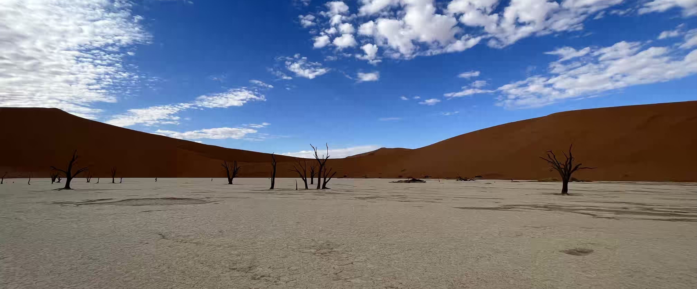

&nbsp;

Vždycky jsem chtěl najít práci, díky které bych mohl cestovat. Když jsem nastoupil
do [STRV](https://www.strv.com/), věřil jsem, že se mi tento sen díky výjezdům na zahraniční
konference splní. Po roce ve firmě jsem měl materiál, se kterým jsem mohl vystoupit, a tak jsem
se na začátku roku 2023 rozhodl obepsat několik zahraničních konferencí a nabídnout jim svůj talk.

Prakticky první vlaštovka přiletěla z [Namibie](https://cs.wikipedia.org/wiki/Namibie).
Byla to podle mě úplně první konference, kam jsem talk přihlásil a odkud mi organizátoři napsali,
že by mě tam rádi viděli. Tehdy se ale vedení [STRV](https://www.strv.com/) rozhodlo zahraniční
výjezd nepodpořit, a tak jsem nakonec zůstal doma a nikam nejel.

Po pár měsících jsem zkusil přihlásit stejný talk na jiné konference a nakonec se z toho vyklubal
[výlet do Malajsie s Adamem](traveling_2023_Malajsie.html). A právě Adam byl tím, se kterým jsem
na začátku roku 2024 šel do [Whiskáče](https://www.whiskeyprovsechny.cz/), abychom spolu zapili
jeho 30. narozeniny a který mi při té příležitosti řekl, že bych mohl zase zkusit poslat přihlášku
do [Namibie](https://cs.wikipedia.org/wiki/Namibie). V tu chvíli mi to nepřišlo jako moc dobrý
nápad. Věděl jsem, že by to bylo na poslední chvíli a že v práci by se na to moc netvářili. Když
jsem se ale vrátil z hospody domů, můj názor se začal nějak formovat - ani nevím, čím to mohlo
být. 😃 Long story short, s pomocí [ChatGPT](https://cs.wikipedia.org/wiki/ChatGPT) jsem napsal
proposal, odeslal ho a na nějakou dobu jsem pustil [Namibii](https://cs.wikipedia.org/wiki/Namibie)
z hlavy.

Po pár týdnech mi napsal nějaký Daniele s tím, že bude rád, když
do [Namibie](https://cs.wikipedia.org/wiki/Namibie) přijedu a talk přednesu místní komunitě.
Moc mě to potěšilo, ale upřímně - samotnému se mi tam nechtělo. Oslovil jsem proto dobrodružné
kolegy z práce, u kterých mi bylo jasné, že by je
[Afrika](https://cs.wikipedia.org/wiki/Afrika) lákala a zároveň by se čtyři dny nenudili
na odborné konferenci. V jednu chvíli jsem si myslel, že bychom z cesty
do [Namibie](https://cs.wikipedia.org/wiki/Namibie) dokonce mohli udělat team building pro celé
naše oddělení, ale to se nelíbilo ani některým kolegům, ani vedení. Nakonec firma poslala
do [Namibie](https://cs.wikipedia.org/wiki/Namibie) pouze mě, jakožto speakera, a kolegu
Nieka, který si stihnul booknout letenku dřív, než si lidé ve vedení uvědomili, že další člověk
na černém kontinentu žádnou velkou hodnotu firmě nepřinese. 😃

&nbsp;

#### DEN 0

Když jsem koupil letenku, začaly se u mě střídat naprosto různorodé pocity. Buď jsem se na cestu
hrozně moc těšil a říkal jsem si, že to bude naprostá pecka, nebo jsem měl noční můry z toho, že
mě kousne nějaký had a já to tam nepřežiju. At už to bylo ale nadšením, nebo stresem, týden před
cestou jsem moc dobře nespal a noc před odletem nebyla žádnou výjimkou.

Dopoledne jsem vyřídil poslední pracovní povinnosti a sbalil si věci. Po obědě mě Klára doprovodila
na nádraží, odkud mi jel vlak do [Vídně](https://cs.wikipedia.org/wiki/V%C3%ADde%C5%88).
Při loučení se mi zdálo, že má o mě Klára opravdu strach, což mě vystresovalo snad ještě víc
než představa toho, že mě pokouše had. V tu chvíli jsem o sobě začal trošku pochybovat. Nepřecenil
jsem svoje síly? Nezapomněl jsem na něco? Nejsem prostě úplně blbej, že jsem se rozhodl tuhle cestu
absolvovat? Když jsem si ale potom uvědomil, že se všude píše, že
[Namibie](https://cs.wikipedia.org/wiki/Namibie) je jedna z nejbezpečnějších zemí
[Afriky](https://cs.wikipedia.org/wiki/Afrika) a největší možnou hrozbou je úžeh nebo úpal kvůli
vysokým teplotám, hned jsem se uklidnil.

Na vídeňské letiště jsem dorazil kolem 18:30. Po pasové a bezpečnostní kontrole jsem si dal jídlo
v teplém baru a potom jsem se snažil krátit dlouhou chvíli přípravou prezentace.

Letadlo do [Addis Abeba](https://cs.wikipedia.org/wiki/Addis_Abeba) odlétalo ve 22:30. Ve chvíli,
kdy jsme se odlepili od země, jsem usnul. Sice jsem se hodně budil, ale prakticky celý let
jsem prospal.

&nbsp;

#### DEN 1

Letadlo přistálo kolem 6. hodiny ráno místního času. Našel jsem odletovou bránu A4 pro let
do [Windhoeku](https://cs.wikipedia.org/wiki/Windhoek), sedl jsem si na křeslo a čekal.
Po chvíli se lidé začali zvedat a odcházet. Když jsem se podíval na tabuli s odlety, zjistil jsem,
že se naše brána změnila na hodnotu A5. Přesunul jsem se proto k nové bráně, která byla už ta
správná. Na relativně malém prostoru ale vznikl zmatek. Lidé z obou letadel se různě mísili
a snažili se zjistit, odkud že to vlastně letí. Pořád přicházeli noví, kteří neměli nejnovější
informace, takže zaměstnanci letiště museli stále kontrolovat palubní vstupenky a posílat lidi
na správná místa. V tu chvíli jsem byl opravdu rád, že jsem jel pouze s příručním zavazadlem
a nemusel jsem se tím pádem bát, zda můj kufr poletí
do [Windhoeku](https://cs.wikipedia.org/wiki/Windhoek) nebo někam do tramtárie.

V 8:35 jsem nasedl na letadlo, naštěstí to správné, a čekal jsem, až zvlétneme. Letadlo se začalo
rovnat na ranvej, ale v tom se pánovi na sedadle přede mnou udělalo špatně. Kdyby nebyl černý jako
bota, možná bych řekl, že zblednul. Když přišla letuška, zeptala se ho, zda má zastavit vzlet
a zavolat letištního doktora. V tu chvíli jsem doufal, že pánovi zase tak špatně není a tuto
velkorysou nabídku odmítne. Moc se mi totiž nechtělo kdovíjak dlouho čekat na to, až přijde doktor.
Pánovi zase tak špatně nebylo, a tak se letuška rozhodla, že pánovi alespoň uvolní jednu řadu
sedaček, aby si mohl lehnout. Malá rošáda zahrnovala i mě. Docela jsem to ale vyhrál, protože mě
letuška přesunula na místo vedle únikového východu, kde bylo mnohem více místa na nohy. Dalších pět
hodin svého života jsem strávil vedle páru Rakušanů v důchodovém věku. Snažil jsem se spát, ale moc
mi to nešlo. Na snídani se podávala unavená houska s vajíčkovou pomazánkou a na oběd kuře s rýží.
Kuře vypadalo docela dost krvavě, takže jsem snědl pouze rýží s omáčkou a pokusil se do sebe
nasoukat suchou bulku. Moc mi to nešlo, byl jsem unavený, ospalý a neměl jsem vůbec chuť na jídlo.

Do [Windhoeku](https://cs.wikipedia.org/wiki/Windhoek) jsme přiletěli kolem 13:30 místního času.
Na letišti jsem si vyřídil vízum a seznámil se s Lidyí, další účastnicí konference, která přiletěla
stejným letadlem jako já. Její cesta ale nebyla tak dlouhá jako ta moje, protože pochází
z [Etiopie](https://cs.wikipedia.org/wiki/Etiopie).
Původní myšlenka byla taková, že Daniele, jeden z organizítorů konference, přiltetí
do [Windhoeku](https://cs.wikipedia.org/wiki/Windhoek) o půl hodiny dříve, půjčí si auto a poté nás
zaveze do našich hotelů v centru města. Po příletu jsme ale zjistili, že Danielemu uletělo letadlo
z [Johannesburgu](https://cs.wikipedia.org/wiki/Johannesburg), takže na dopravu do centra budeme
s Lidyí sami. Myslím si, že jsem si ale nemohl přát lepšího parťáka. Lidya byla totiž typická
projektová manažerka. S každým si vždycky měla co říct a pořád se smála. Když ale bylo potřeba,
dokázala být rázná a přímá. A tuto vlastnost jsme využili, když jsme vyšli z příletové haly a místní
taxikáři se na nás slétli jako supi. Když k nám přišel první taxikář, Lidya jej rázně odmítla
a řekla, že si nabízenou cenu musíme ověřit u našich přátel
z [Namibie](https://cs.wikipedia.org/wiki/Namibie). Při čekání na odpověď jsme odmítli nekolik
dalších supů, kteří se na nás slétali ze všech stran. Když nám jeden z organizátorů konference
napsal, že dobrá cena je 250 namibijských dolarů za osobu, Lidya šla za řidičem, kterého jsme
odmítli jako prvního a vyjednala s ním cenu 175 dolarů za osobu. Po zbytek celé konference si
ze mě potom dělala srandu, že kdyby nebylo jí, tak bych se tam nechal "oscamovat"! 😃

Cesta do centra trvala asi 45 minut.
V [Chameleon Backpackers hostelu](https://www.chameleonbackpackers.com/) jsem se potkal s Niekem,
který mi ukázal, jak vypadá náš společný pokoj. Po vybalení jsem se snažil dokončit prezentaci
pro vysokoškolské studenty, kterou jsem měl mít druhý den. Moc se mi do toho ale nechtělo a Niek měl
už hlad, a tak jsme vyrazili na večeři.

Niek, který byl ve [Windhoeku](https://cs.wikipedia.org/wiki/Windhoek) už déle než týden,
mi ten večer ukázal, jak fungují místní taxíky. Stoupli jsme si vedle cesty a zamávali na auto
označené telefonním číslem na dveřích. Zastavilo autíčko, které by bylo malé, i kdybych v něm jel
sám. Už v něm ale seděl řidič a dva další spolucestující, kteří se stejně jako my potřebovali někam
dopravit. Na zadní sedačce jsme se mačkali jako sardinky, takže hledání pásu jsem hned vzdal. Celou
cestu jsem se modlil, abychom přežili. Prasklina přes celé přední sklo totiž napovídala, že řidič
už má s nehodami nějakou tu zkušenost.

Při cestě se ale naštěstí nic nestalo a my tak v pořádku dorazili
do [podniku Joe's Beerhouse](https://www.joesbeerhouse.com/), velké restuarace určené pro místní
i turisty, kde nabídku tvořily typické africké pokrmy.
[Namibie](https://cs.wikipedia.org/wiki/Namibie) je země masožravců, proto v jídelním lístku
nechyběla typická kapana, neboli hovězí grilované nudličky, ani zvěřinové steaky. Zvěřina
v [Namibii](https://cs.wikipedia.org/wiki/Namibie) neoznačuje jeleny, bažanty, ani divoká prasata,
ale přímorožce, antilopy, zebry a jiná zvířata, které lze najít na afrických pláních.

Po návratu na hostel jsem se ještě snažil dokončit prezentaci. Po dlouhém letu jsem byl ale unavený,
a tak jsem práci odložil na druhý den a šel si lehnout.

&nbsp;

#### DEN 2

Můj první celý den v [Namibii](https://cs.wikipedia.org/wiki/Namibie) byl také prvním dnem
[konference PyCon](https://na.pycon.org/). Konference byla naplánovaná na celkem 4 dny. V pondělí
a v úterý probíhaly tzv. výukové dny. První z nich byl věnovaný studentům na univerzitě, druhý
studentům na střední škole. Ve středu a ve čtvrtek pokračovala konference odbornou sekcí přednášek
pro veřejnost.

Jak jsem zmínil výše, první výukový den byl věnovaný studentům na univerzitě. Po snídani jsem se
proto přesunul taxíkem na [Namibijsou univerzitu](https://www.nust.na/), dále jen NUST. Celý program
vykopla Lidya, která mluvila o farmaření v [Africe](https://cs.wikipedia.org/wiki/Afrika).
Následovala Sheena z [Jihoafrické republiky](https://cs.wikipedia.org/wiki/Jihoafrick%C3%A1_republika).
Ta prezentovala svůj pohled na to, jak učit ostatní lidi učit. Po krátké přestávce jsem šel na
řadu já. Přestože jsem se na konferenci přihlásil s jiným talkem, Daniele mě pár týdnů před odletem
požádal, abych si připravil ještě tento zjednodušený talk pro studenty. Vůbec se mi do toho
nechtělo, ale slíbil jsem, že to udělám. Můj talk pokrýval velice základní témata a jeho první
polovina byla hodně obecná. Myslel jsem si, že to pro studenty bude až moc jednoduché, ale opak byl
pravdou. Po přednášce se nejen studenti hodně ptali a mnoho lidí mi po skončení programu přišlo
osobně říct, že se jim talk líbil. Dopolední program uzavřel Daniele, který se snažil navnadit
studenty, aby se nebáli hlásit na pozice otevíráné společnostmi z Evropy. Myslím, že tento talk
byl nejlepší. Daniele totiž mluvil pěknou angličtinou, byl pro danou věc velice zapálený a svoji
pozitivní energii dokázal přenést i na ostatní.

&nbsp;

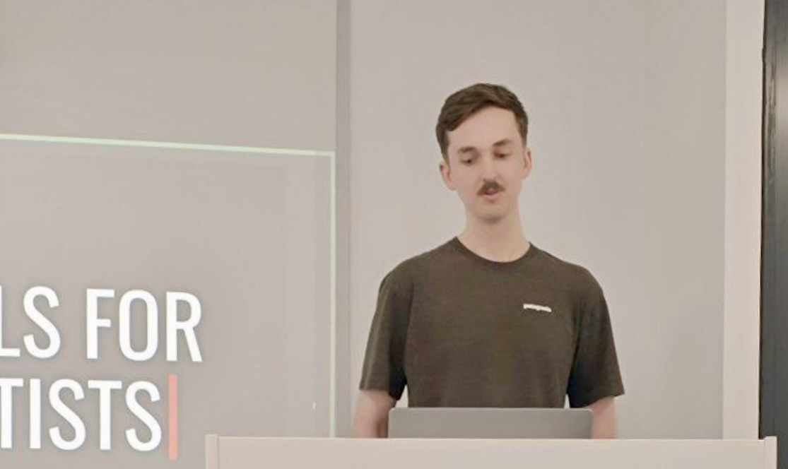

*Bla bla bla.*

&nbsp;

Po dopoledních přednáškách jsme se přesunuli do hotelu naproti přes ulici na oběd. Podávalo se něco
na styl degustačního menu. Na talíři jsem totiž měl špagety, zelí, pečené batáty, rybu a hovězí
maso. Jako dezert se podávala buchta se šlehanou smetanou. Před odletem jsem se jídla a hygieny
v [Africe](https://cs.wikipedia.org/wiki/Afrika) hodně bál, ale tohle bylo naprosto luxusní!
Dost mě pobavilo, že když jsem u oběda sdílel svoje nadšení s místními studenty Sakim, Hubertem
a Aaronem, Saki mi řekl, že tohle nebylo maso podle jeho předtav. Řekl, že on by si dal raději
nějakého krokodýla nebo zebru! 😀 Byl to sice vtip, ale něco pravdy na tom možná bylo. Ještě
nekolikrát v průběhu následujících dní jsme se tomu společně s touto partičkou smáli.

Odpoledne jsem se přesunul do počítačové učebny, kde jsem mladému doktorandovi Matthewovi z USA
pomáhal vést jeho workshop na téma "Introduction to Data Science". Byla to docela zábava. Zapsal
jsem se tam totiž jako ML Engineer, takže když si Matt nevěděl rady s nějakými pokročilými tématy,
přišla otázka: “What does our ML Engineer think about it?” Např. jsem takto reagoval na otázku, zda
je věk diskrétní nebo spojitá proměnná, což teda bylo hodně pokročilé téma! 😀

Po workshopu mě místní učitel Robson zavezl na hostel, kde jsem chvíli odpočíval a potom šel
s Niekem na večeři. Navštívili jsme [Café Zoo](https://www.instagram.com/zoocafe_official/), kde
jsem poprvé ochutnal pečeného přímorožce, namibijské národní zvíře. Grilované nudličky se podávaly
s hranolky a zeleninovým salátem. Kolem 19. hodiny jsme se přesunuli
do [Joe's Beerhouse](https://www.joesbeerhouse.com/), kde jsme se potkali s ostatními speakery
na pivo. Niek probral s Lidyí vše o [Etiopii](https://cs.wikipedia.org/wiki/Etiopie) a já s Danielem
pokecal o tom, proč se rozhodl zorganizovat PyCon právě
v [Namibii](https://cs.wikipedia.org/wiki/Namibie). Říkal, že má k Africe velice blízko už od mládí,
protože několik let bydlel s rodiči v [Addis Abeba](https://cs.wikipedia.org/wiki/Addis_Abeba).
Navíc měl už dříve zkušenosti s organizováním konferencí a budováním komunit, a tak se rozhodl
v Africe pomoct. Obepsal mnoho zemí, ale lidi ochotné zorganizovat konferenci našel až
na univerzitě ve [Windhoeku](https://cs.wikipedia.org/wiki/Windhoek). A tak společně s nimi
zorganizoval [namibijský PyCon](https://na.pycon.org/), který se letos pochlubil už 8. ročníkem!

&nbsp;

#### DEN 3

Po snídani jsme se s Niekem přesunuli do hotelového lobby a čekali na řidiče, který nás měl
vyzvednout a zavést na střední školu. V 8:30 jsme dostali zprávu na slacku, že řidič nabral první
speakery v hotelu kousek od nás, a tak jsme čekali, že nám za chvíli organizátorka konference
napíše, že je auto u nás a my máme jít ven. Místo toho ale přišla zpráva, že řidič vysadil tři lidi
na ulici před naším hostelem a společně máme počkat na další auto. Čekal jsem, že nás někdo nabere,
ne že nám přiveze další lidi. 😀 Nakonec to ale bylo super. Přijel
Vince z [Walesu](https://cs.wikipedia.org/wiki/Wales),
Benjamin z [Namibie](https://cs.wikipedia.org/wiki/Namibie) a
Joao z [Angoly](https://cs.wikipedia.org/wiki/Angola) a za následující půl hodinu strávenou
na sedačce hotelovém lobby jsme stihli prodiskutovat nejrůznější témata; od politické situace
v [Angole](https://cs.wikipedia.org/wiki/Angola), přes teorii her, což byl Vincův obor,
až po [Africký pohár národů](https://cs.wikipedia.org/wiki/Africk%C3%BD_poh%C3%A1r_n%C3%A1rod%C5%AF_2023), ve kterém na začátku roku
[Angola](https://cs.wikipedia.org/wiki/Angola) porazila
[Namibii](https://cs.wikipedia.org/wiki/Namibie) a ukončila tak její působení na turnaji už
v osmifinále.

S velkým zpožděním jsme dorazili do [střední školy Jacob Marengo](https://jakobmarengo.com/), kde
se už ostatní chystali na zahájení dopoledního programu. Ten byl věnovaný výuce. Mně byli přiřazeni
dva studenti, Shimwe (17) a Esperanca (17), které jsem učil základy programování
v [Pythonu](https://cs.wikipedia.org/wiki/Python). Přestože
studenti měli problém s pochopením naprostých základů i výpočtem jednoduchých matematických operací,
na obou byl vidět obrovský zápal pro to, aby se naučili něco nového. S přibývajícím časem už jsem
byl unavený a naprosto upřímně mě ani nebavilo po několikáté vysvětlovat, jak funguje definice
proměnné. Ke konci hodiny jsem se proto začal odklánět od výukových osnov a začal jsem se ptát
na život mých studentů. Chtěl jsem se dozvědět víc o tom, jak žijí a jaké jsou zvyklosti normálních
lidí v [Namibii](https://cs.wikipedia.org/wiki/Namibie). Na každou otázku mi slušně odpověděli, ale
u diskuze nikdy nevydrželi dlouho. Po chvilce mi totiž začali připomínat, že bychom se měli vrátit
k výuce a pokusit se vyřešit některý z dalších programovacích úkolů.

&nbsp;

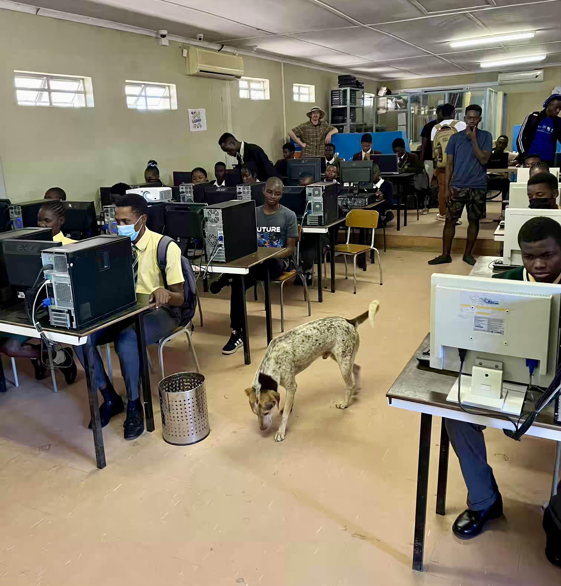

*Zahájení výuky proběhlo v přítomnosti tohoto neznámého chlupáče, který ve třídě řešil svůj
vlastní business. Nikdo z přítomných na něj nereagoval.*

&nbsp;

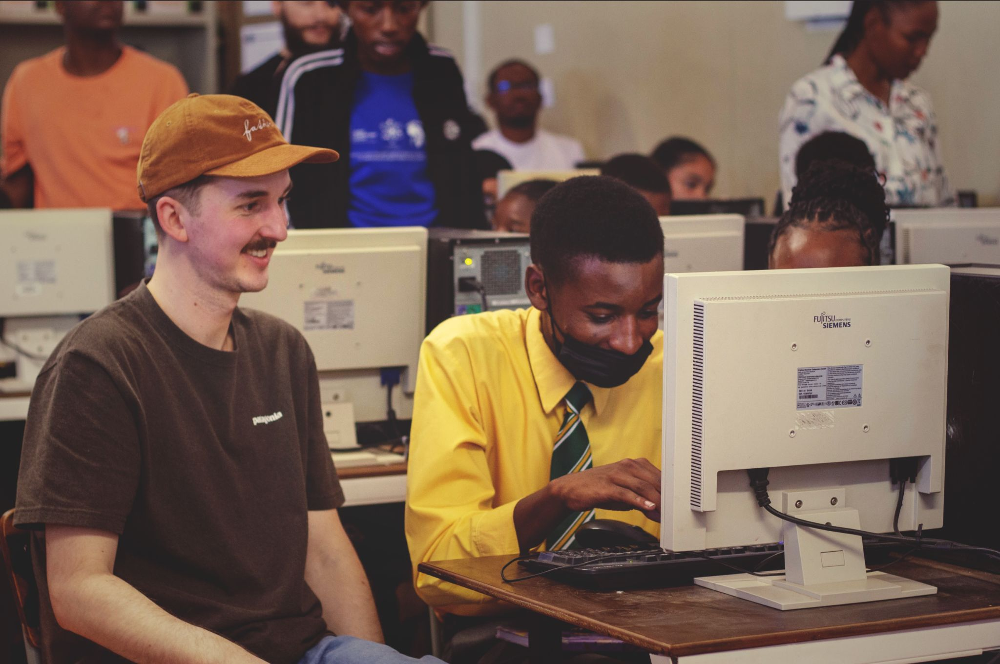

*Udělalo mi velkou radost, když mi oba moji studenti po skončení hodiny řekli, že jsem dobrý učitel.*

&nbsp;

Před obědem jsme si šli umýt ruce. Z nějakého důvodu jsme šli společně s dalšími speakery na toalety
vedle třídy pro nejmenší děti. Těm mohlo být mězi 4 a 6 lety. Děti stály venku na betonovém
plácku a pravděpodobně se s paní učitelkou chystaly obědvat. Ve chvíli, kdy nás ale uviděly, všeho
nechaly a začaly na nás mávat a pokřikovat: "Hello! Hello!" Přišlo mi to hrozně moc roztomilé, proto
jsem šel blíž za nimi a pokusil se o další interakci. Jedno dítě drželo v ruce fotbalový míč a já
jsem se ho zeptal, zda mi ho přihraje. Dítě překvapivě moc nerozumnělo, a tak jsem si míč vzal a
potom ho hodil zpět. Hod se mi ale vůbec nepovedl, a tak jsem úplně jiné dítě trefil míčem do hlavy.
Ostatní se začaly smát a najednou si se mnou chtěly házet všechny! Vyměnili jsme si proto několik
přihrávek a já šel potom na záchod, který vypadal jako záchod pro panenky. Doteď mě mrzí, že jsem si
ho nevyfotil!

Na oběd jsme šli do [Katutura food marketu](https://www.changesinlongitude.com/kapana-katatura-market-namibia/).
O tomto, mezi místními velice oblíbeném, trhu jsem před tím už něco málo slyšel, a tak moje
očekávání byla vysoká. Nicméně na první dobrou přišel hodně silný střet s africkou realitou.
Na velkých železných pultech ležely obrovské kusy hovězího dobytka, nad kterými létala hejna much.
U vedlejších stánků se prodávalo koření a sušení červi. Prodejci na mě pokřikovali a lákali mě,
abych si něco koupil právě u nich, i přestože prodávali to stejné, co prodejce vedle. Uprostřed
trhu jsme si sedli k jednomu velkému stolu. Po chvilce nám jeden z organizátorů konference začal
nosit na stůl jídlo. Nejdřív přinesl kapanu, grilované hovězí kousky, které jsou pro trh tak
specifické, že nikdo z místních místu neřekne jinak než "kapana". K masu jsme jedli zeleninový salát
a tzv. fat cake, v překladu tučný koláč, který nebyl ničím jiným než hodně mastným koblížkem.
Všechno se podávalo ve společných nádobách a jídlo se jedlo rukama. Přestože mi to ze začátku přišlo
nehygienické a měl jsem strach, aby mi potom nebylo špatně, nakonec to mělo naprosto odlišný
efekt - bylo to totiž hodně domácí a já se cítil být součásti komunity. To se mi moc líbilo!

Po jídle byli všichni mastní až za ušima. Když jsem se jednoho místního zeptal, zda jsou tam někde
ubrousky, ukázal na toaletní papír na vedlejším stole. Následovala situace, při které si všichni
podávali toaletní papír a utírali si mastné ruce. Pořád mi to ale nebylo dost, proto jsem se zeptal,
zda se mohu někde umýt. Šli jsme ke kanystru s vodou, u kterého jeden musel vodu pustit a druhý si
umýval ruce. Místo mýdla jsme použili saponát na nádobí. V tu chvíli jsem si říkal, že tohle je
prostě [Afrika](https://cs.wikipedia.org/wiki/Afrika)!

&nbsp;

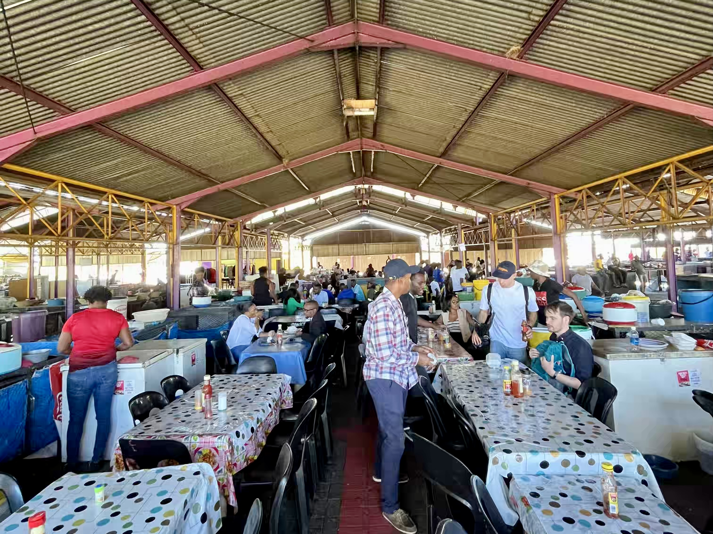

*Katutura food market, kterému nikdo z místních neřekne jinak než "kapana".*

&nbsp;

Po hodně těžkém obědě jsme se vrátili do školy. Program pokračoval odpoledními přednáškami.
Za zmínku stojí hlavně dvě z nich; první od Kudzaye
ze [Zimbabwe](https://cs.wikipedia.org/wiki/Zimbabwe) na téma "programování her
v [Pythonu](https://cs.wikipedia.org/wiki/Python)" a druhá od Matthewa
z [USA](https://cs.wikipedia.org/wiki/Spojen%C3%A9_st%C3%A1ty_americk%C3%A9) na téma "robotika".
Matthew při přednášce ukazoval, jak si vytvořil dekoraci na vstupní dveře na Halloween. Jednalo
se o robotickou hlavu. Tato hlava dokázala reagovat na pohyb, takže když někdo přišel ke vstupním
dveřím, na obličeji se otevřely oči a podívaly se na příchozího člověka. Musím říct, že z video
ukázky to vypadalo dost děsivě.

Po skončení odpoledního programu následovalo společné focení. Potom jsme s ostatními speakery
nasedli do auta a řidič nás rozvezl do našich hotelů, přičemž ještě stihl vyzvednout dceru
ze školy. Po příjezdu na hostel jsem si dal pizzu ve společenské místnosti, zavolal Klárounovi
a šel si pomalu lehnout. Měl jsem ale tolik dojmů a zážitků, že se mi ten den neusínalo zrovna
snadno.

&nbsp;

#### DEN 4

Třetí den se konference přesunula do výukového centra
[Goethe Institut](https://www.goethe.de/ins/na/en/index.html), kde pokračovala
programem pro širší veřejnost. Protože jsme to měli z hostelu docela dost blízko,
rozhodli jsme se, že na konferenci půjdeme pěšky. Nejlepší rozhodnutí to ale nebylo. Asi v polovině
cesty se na nás totiž přilepil tzv. nahaněč. Jednalo se o člověka, který šel tesně vedle mě cca 200
metrů a žebral o peníze. Pořád dokola opakoval, že má hlad a prosil mě o peníze. Žádné peníze jsem
mu dávat nechtěl, ale zároveň jsem nevěděl, jak se ho mám zbavit. Po nějaké době jsme potkali
pána v saku s nápisem “security”. Niek ho jen pozdravil a šel k němu. Pán z ochranky něco řekl
žebrákovi, společně se zasmáli a žebrák odběhl. Po této zkušenosti jsem už jel druhý den
na konferenci raději taxíkem.

Po příchodu do [Goethe Institutu](https://www.goethe.de/ins/na/en/index.html) jsme si chvíli povídali s ostatními účastníky. V 10 hodin konferenci zahájila Sheena
z [Jihoafrické republiky](https://cs.wikipedia.org/wiki/Jihoafrick%C3%A1_republika) se svým keynotem
["Learning to code in the age of AI"](https://github.com/sheenarbw/pres-learning-to-code-in-age-of-ai).
Po přednášce jsem se přesunul do knihovny, kde jsem pomáhal středoškolským studentům programovat
[mikrobity](https://microbit.org/code/). Musím říct, že mě to bavilo mnohem méně než předchozí den,
protože s těmi zařízeními byly pořád nějaké technické problémy. Všechno se tím pádem táhlo, studenti
byli bezradní a já nevěděl, komu pomáhat dřív.

Po obědě následoval odpolední program, při kterém jsem měl co dělat, abych neusnul. Kolem 18. hodiny
jsme se s ostatními speakery přesunuli do nedaleké hospody. Tam jsme si objednali pivo a hráli
společenskou hru Questions. Musím říct, že tamnější pivo není vůbec špatné. V namibijských putikách
lze ochutnat hned několik lokálních značek, z nichž mě osobně nejvíce oslovila
[značka Windhoek](https://www.windhoekbeer.com/). S Niekem jsme se shodli na tom, že se
pravděpodobně jedná o další z mnoha odkazů na dobu, kdy
[Namibie](https://cs.wikipedia.org/wiki/Namibie) byla německou kolonií. Kromě vynikajícího piva si
skoro v každé hospodě můžete objednat [schnitzel](https://en.wikipedia.org/wiki/Schnitzel),
[kartoffelsalat](https://cs.wikipedia.org/wiki/Bramborov%C3%BD_sal%C3%A1t),
nebo [wurst](https://cs.wikipedia.org/wiki/Uzenina). Na konferenci jsme se seznámili se dvěma
vysokoškolskými studenty z [Cách](https://cs.wikipedia.org/wiki/C%C3%A1chy), kteří přijeli
do [Windhoeku](https://cs.wikipedia.org/wiki/Windhoek) na roční studijní pobyt. Když jsme
s ostatními zjistili, co se v [Namibii](https://cs.wikipedia.org/wiki/Namibie) jí a pije, dělali
jsme si z nich často legraci, že se v [Africe](https://cs.wikipedia.org/wiki/Afrika) musí cítit
jako doma!

V průběhu večera přicházeli do hospody další účastníci konference a kapacita našeho stolu přestávala
stačit. Už mě nebavilo, jak se na sebe všichni mačkali a navíc jsem začínal mít hlad. Proto jsem
vyburcoval ostatní Brňáky Pavla a Karolinu a společně jsme se přesunuli do vedlejšího podniku
na večeři. Později jsem zjistil, že Karolina pochází z [Polska](https://cs.wikipedia.org/wiki/Polsko)
a Pavel z [Ježkovic](https://cs.wikipedia.org/wiki/Je%C5%BEkovice), obce, která je
vzdálená asi 10 km od [Vyškova](https://cs.wikipedia.org/wiki/Vy%C5%A1kov). Na jídlo jsem si
objednal něco, co se jmenovalo "magnara". Sevírka říkala, že je to velice tradiční pokrm, tak jsem
se jej rozhodl ochutnat. Po chvíli mi přinesli dršťky, které plavaly v zeleninovém ragů. Prakticky
to chutnalo jako dršťková polévka, jen řidší, pálivější a se zeleninou. Nebylo to vůbec zlé. K tomu
jsem dostal [pap](https://en.wikipedia.org/wiki/Ugali#South_Africa), tuhou kukuřičnou kaši, která
je typickým pokrmem v afrických zemích.

Po jídle jsme se vrátili zpět do hospody, kde už někteří účastníci konference byli značně v náladě.
Před odchodem na hostel jsem ještě pokecal s Aaronem, mladým studentem, který při studiu pracuje
a rád by se v budoucnu věnoval datové analáze. Společně jsme se bavili hlavně o jeho práci a studiu
na vysoké škole. Po chvíli mě Aaron poprosil, zda bych jej mohl mentorovat. Hrozně moc mě to
potěšilo, a tak jsem řekl "ano"! 🎉

&nbsp;

#### DEN 5

Poslední den konference přišel čas na můj hlavní talk s názvem
["Zoology 101: pandas, polars, and ducks in the data wilderness"](https://github.com/jardabezdek/talk-zoology-101/).
Moc velkou radost jsem z jeho přednesu ale neměl. Předchozí dny byly tak nabité, takže jsem si talk
pořádně nezkusil a navíc jsem byl dost unavený. Při přednášce jsem proto dělal hromadu chyb, koktal
a občas těžko hledal slova. Tím pádem jsem s výsledkem nemohl být spokojený. Náladu mi alespoň
trošku spravil oběd, při kterém se podával kuřecí řízek s těstovinovým salátem a mrkví. Tímto
zdravím Řeku! 👋

Kolem 15. hodiny jsme s Niekem sedli do taxíku a frčeli do autopůjčovny vyzvednout absolutní
monstrum, se kterým jsme měli v plánu následující týden jezdit
po [Namibii](https://cs.wikipedia.org/wiki/Namibie). Při předání auta nás zaměstnanci autopůjčovny
seznámili se všemi možnými nástrahami, které nás mohli při cestě potkat. Nejdříve nám paní
v kanceláři předala malou tištěnou brožurku a v rychlosti okomentovala, co v ní najdeme. Kromě
smluvních podmínek a nouzových telefonních čísel tam byl i postup, co máme dělat, když nás pokouše
had. Ten ale paní přeskočila se slovy, že kousnutí hadem není
v [Namibii](https://cs.wikipedia.org/wiki/Namibie) obvyklé. Moje noční můry z Česka ale byly
v tu chvíli zpět! Hady sice paní přeskočila, ale naopak dlouhou dobu věnovala popisování toho, jak
se auto tankuje. Pořád mlela o tom, jak má auto dvě nádrže na naftu a jak musíme auto tankovat
pomalu, aby se nenaplnila pouze jedna nádrž, ale když jsem se jí zeptal na to, jak poznám, že
tankuju pomalu, odpověděla mi, že já nikdy tankovat nebudu; stačí přijet na benzinku a obsluze
říct, že chceme natankovat diesel a auto má dvě nádrže. V tu chvíli jsem si říkal, že to nemůže
myslet vážně. Raději jsme se neměli věnovat těm hadům!

Po "hrozně poučné" přednášce od paní sekretářky nás vzal mechanik do garáže. Ten s námi prošel celé
auto. Ukázal nám, jak používat pohon na všechna čtyři kola, jak auto nastavit při průjezdu hlubokým
pískem a jak vyměnit prasklou pneumatiku. Myslím si, že se vším všudy jsme v autopůjčovně strávili
dobrou hodinu a půl. Zvláště školení od technika ale bylo hodně přínosné a dost mě uklidnilo. Před
cestou jsem měl totiž opravdu velký strach, že dostaneme defekt a nebudeme vědět co dělat.
A zvlášť v [Namibii](https://cs.wikipedia.org/wiki/Namibie), kde je nejmenší hustota osídlení
v Africe a na mnoha místech ani neexistuje telefoní signál, by to nebylo nic příjemného.

&nbsp;

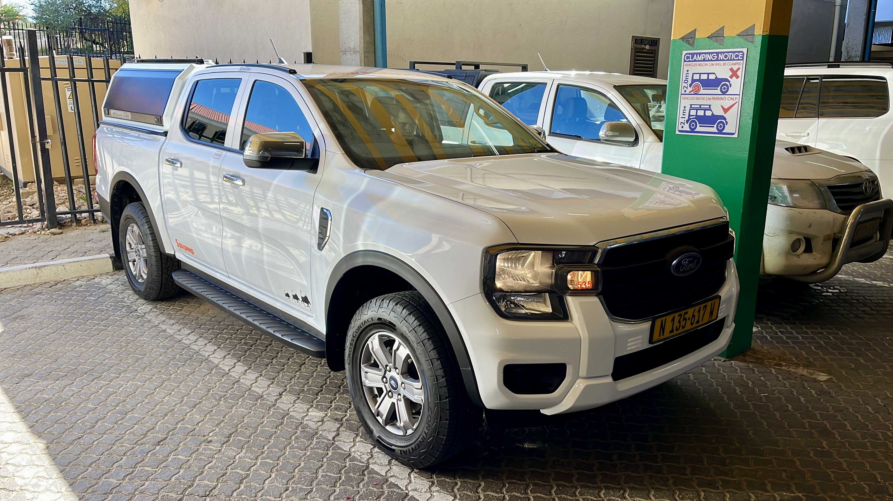

*Ford Ranger, náš společník na cestách po [Namibii](https://cs.wikipedia.org/wiki/Namibie).*

&nbsp;

Auto jsme zavezli na hostel a potom se vrátili na konferenci, kde už probíhaly závěrečné lightning
talks. Po slavnostním ukončení se všichni přesunuli na velké nádvoří, kde jsme se začali loučit.
Mnoho lidí si chtělo udělat společnou fotku, někteří si chtěli vyměnit kontakt a jiní to prostě
zabalili a odešli. Když jsem se rozloučil se všemi, kteří zůstali, bylo asi 18 hodin. Speakers'
dinner začínala o hodinu později. Přemýšlel jsem proto nad tím, co bych mohl do té doby dělat
a napadlo mě, že jsem se ještě nebyl podívat na symbol
[Windhoeku](https://cs.wikipedia.org/wiki/Windhoek),
[luteránský kostel](https://en.wikipedia.org/wiki/Christ_Church,_Windhoek), který se nacházel hned
vedle [Goethe Institutu](https://www.goethe.de/ins/na/en/index.html). Seznámil jsem proto ostatní
s mým plánem a nakonec se ke mně přidal Niek, Sheena a Vince. Společně jsme se prošli kolem
zavřeného kostela a potom zamířili
k [Muzeu nezávislosti](https://en.wikipedia.org/wiki/Independence_Memorial_Museum_(Namibia)),
které se nachází hned přes cestu vedle kostela. U muzea jsme potkali jednoho ze studentů
[NUSTu](https://www.nust.na/), který se účastnil konference jako dobrovolník. K muzeu přijel
proto, aby si u něj zajezdil na skateboardu. Mladík jezdil sem a tam a když z něj opadla počáteční
nervozita, předvedl nám několik skvělých triků. Po chvíli se z útrob muzea vynořili další
účastníci konference, kteří nám řekli, že střešní kavárně muzea je veřejně přístupná a je tam moc
pěkná vyhlídka na celé mšsto. Vstup nic nestál, a tak jsme se rozhodli jít. A protože
v [Namibii](https://cs.wikipedia.org/wiki/Namibie), stejně jako všude jinde ve světě, platí,
že "čím víc pruhů, tím víc Adidas", přidali se k nám i ti, kteří se z muzea právě vrátili.
Jediný, kdo zůstal dole, byl pan skateboarďák. Když jsme vyjeli výtahem do posledního patra budovy,
pomalu začínalo zapadat slunce, a tak výhledy na město byly opravdu nádherné. Když k tomu ještě
připočítám, že se místní postarali o krátký výklad, byl to super zážitek!

&nbsp;

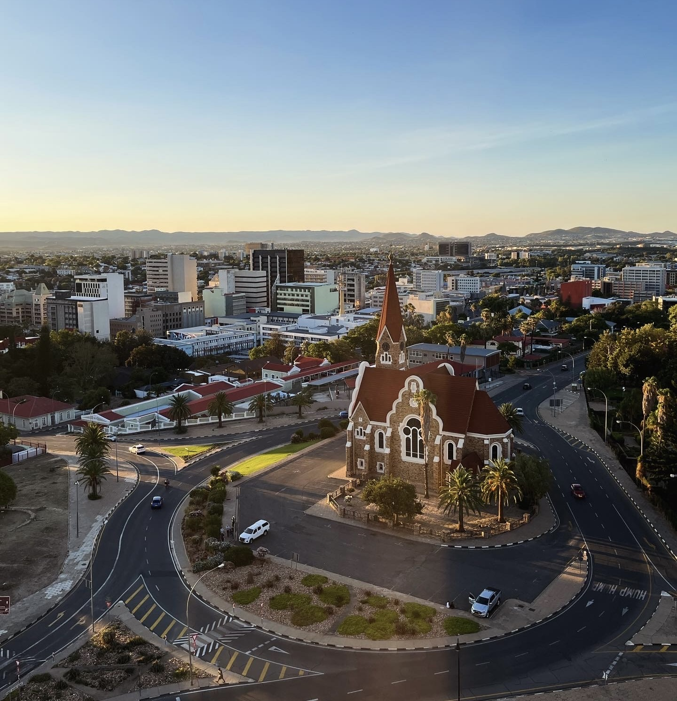

*Výhled na [luteránský kostel Christ Church](https://en.wikipedia.org/wiki/Christ_Church,_Windhoek)
ze střechy [muzea](https://en.wikipedia.org/wiki/Independence_Memorial_Museum_(Namibia)).*

&nbsp;

Kolem 19. hodiny jsme se přesunuli do restaurace Kamaya na speakers' dinner. Společně s ostatními
speakery jsme seděli na klidném nádvoří, kam nám obsluha postupně nosila výběr z typických
namibijských jídel. Některá jídla byly opravdové chuťovky,
např. [mopani worms](https://www.atlasobscura.com/foods/mopane-worms-caterpillars), což jsou
grilované housenky, nebo [smiley](https://www.tasteatlas.com/smiley), v překladu smajlík, což je
pečená kozí hlava. Název jídla je vlastně takový místní žertík, protože když se jídlo podává,
obsluha vám na talíři přinese celou kozí hlavu, která se na vás směje. Na housenky ani na kozí
hlavy jsem moc chuť neměl, proto jsem začal s grilovaným hovězím masem, papem a špenátem. Když jsem
se ale po chvilce podíval vedle sebe, viděl jsem Paula
z [Německa](https://cs.wikipedia.org/wiki/N%C4%9Bmecko), který do sebe hrne jednu housenku
za druhou, a Sheenu z [JAR](https://cs.wikipedia.org/wiki/Jihoafrick%C3%A1_republika), která okusuje
kozí kopýtko. V tu cvhíli jsem si řekl, že nebudu sračka a alespoň něco z těchto exotických jídel
zkusím. Vzal jsem proto Paulovi z talíře jednu housenku, strčil ji do pusy a nakonec byl příjemně
překvapen z toho, že to nebylo vůbec špatné.

Když jsme se vrátili večer na hostel, vůbec jsem nemyslel na pokaženou doppolední přednášku. Naopak
jsem myslel na to, že jsem viděl západ slunce z nádherné vyhlídky na město, že jsem překonal vlastní
strach, když jsem ochutnal housenku a že jsem si za poslední dny užil spoustu legrace s podobně
smýšlejícími lidmi! ❤️

&nbsp;

#### DEN 6

První den dovolené jsem se vzbudil, zapnul jsem slack a zjistil jsem, že na klientském projektu
hoří. Vytáhl jsem proto počítač a ještě v posteli se snažil požár uhasit. Bohužel se mi to
nepodařilo. K vyřešení problému jsem neměl dostatek informací a ani času.

Na ten den jsme totiž měli naplánovaný přejezd
do [NP Etosha](https://en.wikipedia.org/wiki/Etosha_National_Park), který měl zabrat asi 4 hodiny.
Po snídani jsme jeli do supermarketu udělat velký předcestovní nákup. Nakoupili jsme hlavně zásoby
vody a jídla pro případ, že bychom se dostali do míst, kde jsou omezené možnosti stravování.

Na oběd jsme se zastavili v senegalské restauraci v městečku
[Otjiwarongo](https://en.wikipedia.org/wiki/Otjiwarongo). Když jsme dojedli, přesunuli jsme na
krokodýlí farmu na opačném konci města. V průběhu asi hodinové prohlídky nám průvodce ukázal
krokodýlí mláďata i obrovské samce, kteří nehybně leželi ve stínu listnatých stromů. Na konci
prohlídky nás průvodce pozval do restaurace, kde jsme mohli ochutnat výrobky z krokodýlího masa.
Měli jsme ale po obědě a mně nebylo úplně dobře. Místo restaurace jsem proto navštívil toaletu,
kde jsem měl sračku jako bič. Hodně jsem se v tu chvíli bál, aby mě tato nepříjemnost neprovázela
po zbytek naší cesty. Poslal jsem tam ale dvě tabletky černého uhlí a do konce našeho pobytu
v [Namibii](https://cs.wikipedia.org/wiki/Namibie) jsem měl klid.

Do našeho [hotelu Etosha Village](https://etosha-village.com/) jsme přijeli kolem 16. hodiny.
Hotel byl schovaný mezi nízkými keři v zemi nikoho. Když jsme zaparkovali auto, zpoza stromů na nás
vykoukl kudu a za chvíli se nám ukázaly i dvě zebry. Moje očekávání, že uvidíme nějaká další
zajímavá zvířata, byla v tu chvíli obrovská! Po check-inu jsme proto sedli do auta a, i když už
bylo pozdě, vyrazili jsme do parku. U vstupní Andersonovy brány nám paní zabavila všechno sušené
maso, protože žádné maso se do parku vozit nesmí. Aby měla maso kam dát, pro jistotu si nechala
celou igelitovou tašku, ve které jsme měli i tortilly a brambůrky.

Než jsme vyřídili nutnou byrokracii a zaplatili vstupní poplatek, bylo 18 hodin. Park zavíral po 19.
hodině a mně se v parku nocovat nechtělo. Udělali jsme si proto jen krátký okruh po jeho západní
straně, v rámci kterého jsme moc zvířat nepotkali. Očekával jsem, že minimálně uvidíme nějaké
slony a žirafy; pokud budeme mít štěstí, tak i nějakého lva. U jednoho napajedla se procházely 4
zebry a čas od času jsme vjeli do sloního hovna. To bylo tak všechno. V tu chvíli jsem byl hrozně
zklamaný.

Těsně před výjezdem z parku jsem se ale podíval na vysoké stromy, za kterými se něco hýbalo.
Prakticky hned jsem poznal, že se jedná o žirafu. Zastavili jsme proto u krajnice, abychom ji
pozdravili. Po chvilce se nám kousek od ní ukázalo i mládě. To byl skvělý zážitek!

&nbsp;

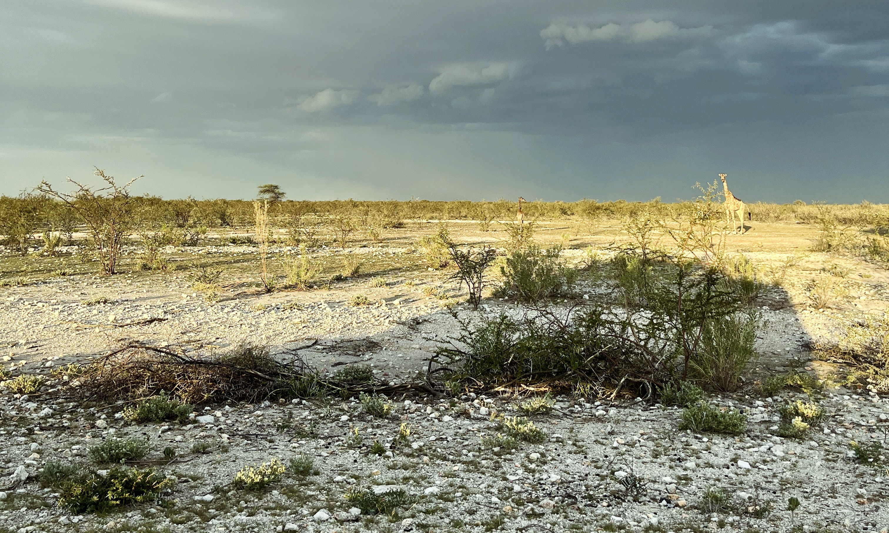

*Kohopak to tady máme?*

&nbsp;

Těsně před zavíračkou jsme si na Andersonově bráně vyzvedli tašku, kterou jsme tam při vstupu
nechali. Když jsem paní řekl, že balíčky brambůrek si přepočítávat nebudu, protože jí věřím, že nic
nesnědla, hlasitě se zasmála a řekla, že už se těší, až nás druhý den ráno uvidí.

Na večeři jsem si dal zebru s bramborama a zeleninou. Klasika.

&nbsp;

#### DEN 7

Všichni nám říkali, že pokud chceme něco vidět, je nutné do parku přijet brzo ráno, kdy se zvířata
chodí napít k napajedlům. Vstali jsme proto už v 6 hodin, rychle zašli na snídani a vyrazili do
parku.

Kousek za Andersonovou bránou jsme viděli žirafí rodinku z předchozího dne. Tu už jsme znali, a tak
jsme se ani nezastavovali a jeli dál. Doufali jsme, že při celém dni na safari uvidíme slony a snad
i nějakou velkou kočku. Podle průvodců mělo být relativně lehké vidět lva. Naopak mělo být vzácné
potkat geparda, a to i přesto, že [Namibie](https://cs.wikipedia.org/wiki/Namibie) je země
s největší populací gepardů na světě. Tyto kočky jsou ale plaché, což je důvod, proč se lidem moc
neukazují. Sečteno podtrženo: věřil jsem, že uvidíme slona, doufal jsem, že uvidíme lva a moc jsem
si přál vidět geparda, i když jsem tomu nevěřil.

Co se ale nestalo? Přijeli jsme k prvnímu napajedlu
[Gemsbokvlakte](http://www.clydesideimages.co.uk/namibia-etosha-waterholes---gemsbokvlakte.html),
u kterého bylo zase 0 zvířat, ale stála tam 2 auta. A protože na safari se říká "když někde stojí
auta, něco se tam děje," zaparkovali jsme našeho plechového obra vedle rusky mluvících turistů.
Ve chvíli, kdy jsem zastavil, Rusáček stáhl okénko a rázně nás vyzval, ať vypneme motor. да. Motor
byl vypnutý, nikdo nic neříkal a všichni civěli někam do dálky. Snažil jsem se hledat na horizontu
nějaký pohyb a nakonec jsem ho našel. Něco se blížilo k nám. Chvíli jsem nedokázal rozeznat, o jaké
zvíře se jedná, ale po nějaké době mi bylo jasné, že je to gepard. Byl jsem naprosto nadšený! Gepard
klidně prošel asi 5 metrů od nás, napil se, potom si lehl a odpočíval. Mezitím přišla k napajedlu
ještě skupinka šakalů, jedna hyena a dvě žirafy. Zvířata si sebe navzájem moc nevšímala, turisté na
nich ale mohli oči nechat. A z geparda se stala naprostá star. Během 20 minut se parkoviště
u napajedla zaplnilo mnoha novými auty, takže jsme se rozhodli, že naše lukrativní místo vedle šelmy
přenecháme někomu jinému a pojedeme zase dál.

&nbsp;

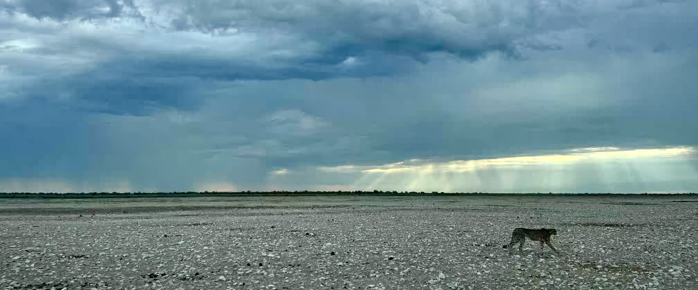

*[NP Etosha](https://en.wikipedia.org/wiki/Etosha_National_Park) byl založen v roce 1907 a tehdy
se mohl chlubit titulem největší přírodní rezervace světa. Rozkládal se totiž na ploše 100.000 km2.
V současné době je rozloha parku přibližně pětinová, ale i tak park stále patří k jedněm z největší
národních parků [Afriky](https://cs.wikipedia.org/wiki/Afrika).*

*Kromě gepardů na území parku žije i velké množství ohrožených zvířat, např. nosorožec dvourohý,
nebo impala černočelá.*

&nbsp;

Cestou k dalšímu napajedlu jsme asi na 10 minut zastavili u krajnice a pozorovali obřího lva,
jak odpočívá ve stínu stromů. Lev byl obrovský, měl mohutnou hřívu a vypadal skutečně jako pravý
král zvířat!

Kolem 10. hodiny jsme přijeli k napajedlu Aus, ke kterému se přišli napít sloni snad
z celé [Namibie](https://cs.wikipedia.org/wiki/Namibie). V jednu chvíli jsme pozorovali dvě stáda,
z nichž každé čítalo přibližně 15 kusů. Byl to neuvěřitelný zážitek. Dospělí samci v klidu pili
vodu z napajedla, zatímco malá slůňata krkolomně běhala tam a zpět. Cestou do osady
[Halali](https://www.etoshanationalpark.org/accommodation/halali-camp) ve středu národního parku
jsme ještě viděli stáda zeber a antilop.

Po obědě jsme se rozhodli vydat zpět do hotelu kolem obří solné pláně, kolem které se celý park
rozkládá. U ní jsme ale dlouho žádná zvířata neviděli, proto jsme se po nějaké době rozhodli sjet
z hlavní cesty a k bráně do parku se vrátit stejnou cestou kolem napajedel, kterou jsme absolvovali
dopoledne.

Znovu se nám podařilo vidět slony. Jednou u napajedla, podruhé přímo na cestě, kde se líně
procházelo početné stádo s malými slůňaty. Když jsme je viděli, zastavili jsme auto, vypnuli motor
a čekali, až projdou kolem nás. Ještě než k nám ale dorazili, namířili si to přímo do vysoké buše.
Když jsme potom pokračovali v cestě, musel jsem se obezřetně vyhýbat nepořádku, který po sobě sloni
zanechali. A že ho bylo! 💩

&nbsp;

#### DEN 8

Další den nás znovu čekal delší přejezd, tentokrát
do [NP Spitzkoppe](https://cs.wikipedia.org/wiki/Spitzkoppe). Vstali jsme proto relativně
brzo, nasnídali se a vyjeli. Po asi hodině cesty se asfaltka změnila na stěrkovou prašnou cestu.
Pokud bych na ní jel traktorem rychlostí 20 km/h, ničeho bych se nebál. Navigace i značky
vedle cesty nám ale ukazovaly, že můžeme šlápnout na plyn a oroštovat to na nádherných 120 km/h.
To jsem si ale nelajznul. Jednak jsem se bál, že kosa narazí na kámen a my budeme muset řešit
defekt, jednak jsem se bál taky toho, že neodhadnu nějakou zatáčku, vjedu do míst s hlubším pískem
a auto se mi vymkne kontrole. Místo povolených 120 km/h jsem tím pádem udržoval pohodovou rychlost
kolem 90 km/h. To ale znamenalo, že se plánovaný čas cesty značně prodloužil. Do naší cílové
stanice, [NP Spitzkoppe](https://cs.wikipedia.org/wiki/Spitzkoppe), jsme proto dorazili až
odpoledne.

Na území národního parku se nechází skupina žulových vrcholků. Ty dominantně vystupují z okolní
placaté krajiny, takže už z dálky vytvářejí naprosto nádhernou scenérii. Skály jsou staré více než
120 milionů let a nejvyšší vrcholek dosahuje výšky 1,728 m. n. m. Převýšení oproti okolní krajině
ale není tak výrazné, protože placka kolem se nachází ve výšce lehce přesahující 1,000 m. n. m.

Možná se ptáte, co se dá v takovém parku dělat. Tím, že je park opplocený a bez průvodce se do něj
nedostanete, moc možností neexistuje, konkrétně pouze tři:

1. jít na krátkou walking tour,
2. jít na delší walking tour,
3. jít na nejdelší walking tour.

My jsme měli v plánu v parku strávit pouze jedno odpoledne, takže jsme se už před příjezdem rozhodli
jít pouze na krátkou walking tour. Když jsme přijeli na recepci našeho ubytování a vyzvedli jsme si
klíče od naší nádherné chatky na úpatí skal, paní se nás hned zeptala, zda máme o walking tour
zájem. Když jsme řekli, že ano, poprosila nás, ať si uděláme pohodlí a počkáme na průvodce.
Na recepci jsme si proto koupili vychlazené pivo, sedli si do stínu a společně s paní recepční
čekali na průvodce Johna, který byl zároveň jejím manželem. Po chvilce přišel John, malý černoch
usmívající se od ucha k uchu. Domluvili jsme se, že na tour vyrazíme v 15 hodin. Měli jsme proto
čas v klidu posedět ve stínu a popovídat si. Nikdo nikam nespěchal. Byl klid a pohoda. To se mi
hrozně líbilo.

Kráce před 15. hodinou přijeli do kempu Oliver a Hana, mladý pár
ze [Stuttgartu](https://cs.wikipedia.org/wiki/Stuttgart), který se k nám na tour přidal. John nás
pustil do parku a společně jsme se vydali na asi hodinu dlouhou cestu ke skalním útvarům, kde
proběhl krátký výklad o [křovácích](https://cs.wikipedia.org/wiki/K%C5%99ov%C3%A1ci),
[namibijských kmenech](https://cs.wikipedia.org/wiki/Namibie#Obyvatelstvo) a jazycích,
kterými se v [Namibii](https://cs.wikipedia.org/wiki/Namibie) hovoří. Cestou jsme obdivovali
okolní skály i skupinku zeber, které byly do parku přivezeny.

&nbsp;

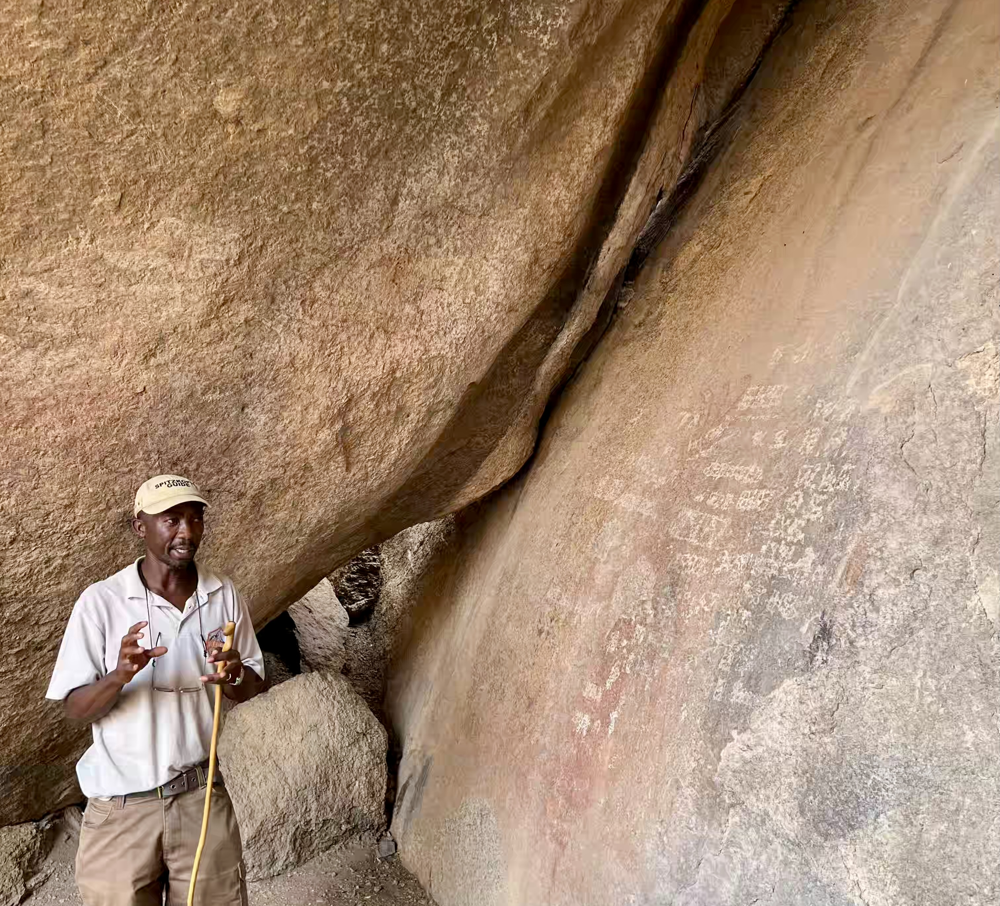

*John ukazuje, jak před 2,000 lety vypadal Facebook.*

&nbsp;

Cestou zpět do kempu jsme se zastavili ještě u jedné skály. Na ní nám John ukázal 2-4 tisíce let
staré malby, které tam zanechali [křováci](https://cs.wikipedia.org/wiki/K%C5%99ov%C3%A1ci).
Po návratu do kempu jsme se domluvili s Oliverem a Hanou, že společně zajedeme ještě do druhé části
parku, kde se nachází slavný skalní převis
[Rock Arch](https://mitchellkrog.com/rock-arch-spitzkoppe-namibia-landscape/). Všichni jsme byli
po walking tour vyprahlí, proto jsme si před odjezdem sedli na recepci a dali si ještě jedno pivo.
John se nás přitom vyptával na život v Evropě a sám nám popisoval, jak by rád coby průvodce povýšil,
a tak se učí další světový jazyk, konkrétně španělštinu.

Když jsme dopili, nasedli jsme do auta k Oliverovi a Haně a jeli se podívat
na [Rock Arch](https://mitchellkrog.com/rock-arch-spitzkoppe-namibia-landscape/). Vyšlápli
jsme si malou skálu, udělali si pár fotek a potom jsme ještě celý skalní útvar objedli dokola,
abychom si byli jistí, že jsme viděli všechno, co jsme vidět měli. Cestou zpět do kempu zapadalo
slunce, které postupně měnilo oranžové kameny do odstínů červené a tmavě hnědé. To byla nádhera!

&nbsp;

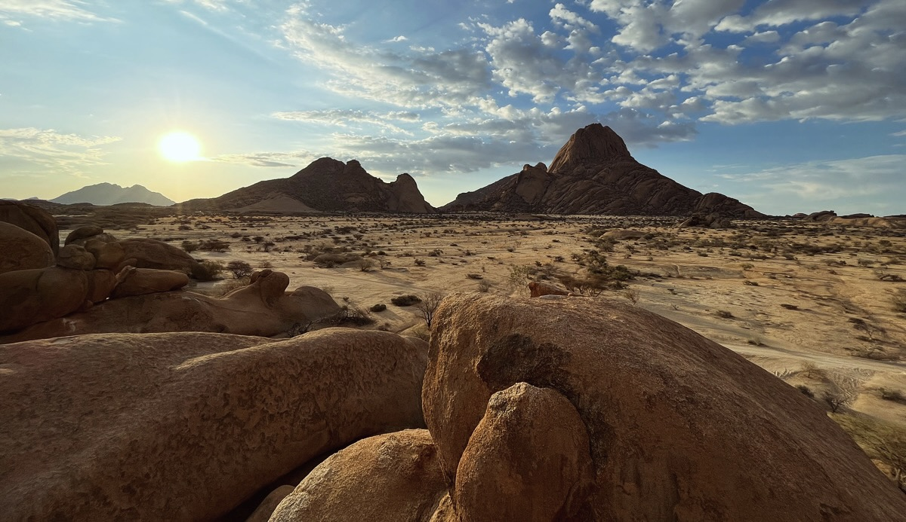

*[Národní park Spitzkoppe](https://cs.wikipedia.org/wiki/Spitzkoppe), kterému se také přezdívá
"Matterhorn of Namibia".*

&nbsp;

Po návratu do kempu jsem si myslel, že už půjdeme každý po vlastní ose, proto jsem si dal večeři
v podobě sušeného masa a očekával jsem, že se budeme pomalu chystat na kutě. Niekovi se ale sušené
maso jíst nechtělo. Na recepci kempu si proto koupil zmraženou klobásu a využil toho, že německý pár
rozdělával oheň na gril. Přifařili jsme se k našim sousedům a společně u jejich ohně jsme
strávili zbytek večera. Bylo to spontánní a ve výsledku moc fajn.

Ten den jsem si opravdu užil!

&nbsp;

#### DEN 9

V noci se mi vůbec nedařilo spát. Uvnitř chatky bylo hrozné horko a venku foukal silný vítr, který
si celou noc pohrával s plátěnou střechou naší chatky a dělal u toho neskutečný hluk. Vstal jsem
proto krátce po svítání, dal jsem si další porci sušeného masa a sledoval, jak vycházející slunce
zabarvuje skály za kempem do jasně oranžové barvy.

&nbsp;

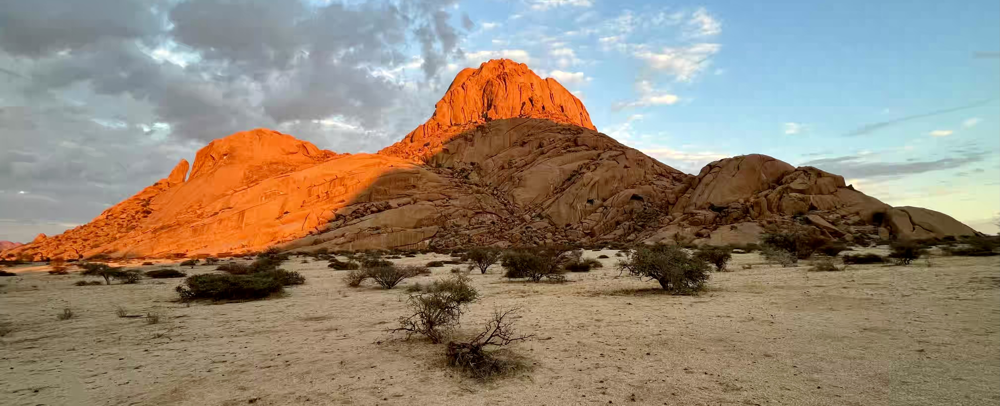

*Ráno v NP Spitzkoppe.*

&nbsp;

Už kolem 7. hodiny jsme seděli a v autě a loučili se podle mě s jedním nejhezčích míst
v celé [Namibii](https://cs.wikipedia.org/wiki/Namibie). Zanedlouho jsme dorazili do městečka
[Henties Bay](https://en.wikipedia.org/wiki/Henties_Bay), kde jsme natankovali auto a dali si
horký nápoj. Po krátké přestávce jsme pokračovali na
[Cape Cross](https://en.wikipedia.org/wiki/Cape_Cross), místo, kde lze pozorovat kolonii
lachtanů. Zajížďka na [Cape Cross](https://en.wikipedia.org/wiki/Cape_Cross) nám vzala dvě hodiny,
na místě jsme strávili asi 20 minut. Byl tam strašný smrad, špína a někteří lachtani byli na sebe
navzájem agresivní, takže jsem se necítil úplně nejlépe. Myslím, že to za to nestálo.

Na oběd jsme se zastavili v přímořském městě [Swakopmund](https://cs.wikipedia.org/wiki/Swakopmund).
Po jídle jsme návštěvili Muzeum Swakopmund. Malé přírodovědecké a historické muzeum je věnované
spíše [Namibii](https://cs.wikipedia.org/wiki/Namibie) než samotnému městu, ale za návštěvu určitě
stálo! Cestou zpět k autu jsme se prošli podél hlavní pláže a udělali si fotky několika barevných
domečků z koloniální doby. V porovnání s předchozími místy bylo ve městě dost chladno. Navíc nás
stále zastavovali žebráci a prosili o peníze a jídlo, což dojmu z jinak pěkného koloniálního města
také moc nepřidalo.

Naše cesta pokračovala podél pobřeží na jih do města
[Walvis Bay](https://cs.wikipedia.org/wiki/Walvis_Bay). Návštěvu druhého největšího města
[Namibie](https://cs.wikipedia.org/wiki/Namibie) jsme odstartovali krátkým odpočinkem na hotelu.
Když jsme doplnili síly, zajeli jsme do průmyslové oblasti za městem, kde se těží sůl. Mezi těžkou
technikou a bílými kopečky bylo mimo jiné možné najít početné kolonie plameňáků a tzv. růžové
jezero. Jeho barvu způsobuje přítomnost speciální řasy tolerantní na sůl. I když fotky od růžového
jezera nevypadají zle, prostředí průmyslové oblasti mi nijak atraktivní nepřišlo. Návštěvu jsem si
tedy nijak zvlášť neužil.

&nbsp;

*Pink Lake ve [Walvis Bay](https://cs.wikipedia.org/wiki/Walvis_Bay).*

&nbsp;

Na večeři jsme se zastavili v přístavní restauraci s výhledem na moře. Relativně rychle začalo být
chladno, takže jsem byl rád, když jsme dojedli a jeli na hotel.

&nbsp;

#### DEN 10

Po snídani jsme nasedli do auta a vyrazili na další přejezd přes vyprahlou namibijskou krajinu.
Naším cílem byla oblast [Sossusvlei](https://en.wikipedia.org/wiki/Sossusvlei)
v [NP Namib-Naukluft](https://en.wikipedia.org/wiki/Namib-Naukluft_National_Park).

Po třech hodinách jsme zastavili u značky
[obratníku Kozoroha](https://cs.wikipedia.org/wiki/Obratn%C3%ADk_Kozoroha) a udělali si několik
fotek. Nieka to moc netankovalo, ale já jsem byl rád, že jsme značku našli. Před cestou jsme si
totiž místo nezadali do navigace a uprostřed pouště nebyl telefonní signál, takže cestou jsem měl
pořád oči na šťopkách a vyhlížel tu podělanou značku. Když jsme k ní ale přijeli, uvědomil jsem si,
že jsem to nemusel tolik prožívat. Značka je totiž tak velká, že by se dala vidět i z vesmíru.

&nbsp;

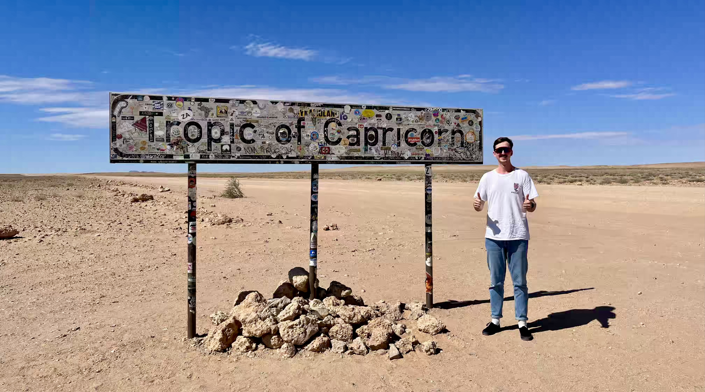

*Značka uprostřed ničeho. A já.*

&nbsp;

Na oběd jsme se zastavili ve městě [Solitaire](https://en.wikipedia.org/wiki/Solitaire,_Namibia),
osadě uprostřed ničeho, ve které se nachází jedna restaurace, jedna kavárna, jeden obchod, jeden
kostel, jeden hotel, jedna benzinka, jeden mechanik a několik starých rezavých aut. Po jídle jsme
se prošli malým městečkem a frčeli dál.

&nbsp;

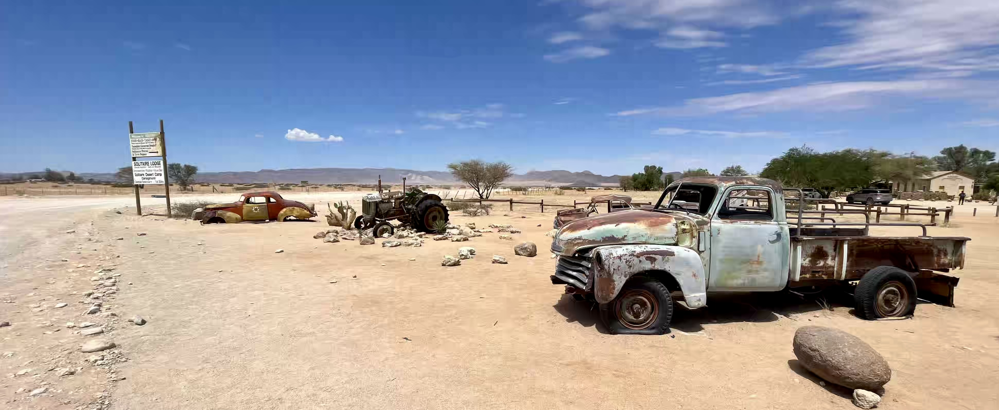

*Vraky starých aut s osadě [Solitaire](https://en.wikipedia.org/wiki/Solitaire,_Namibia).*

&nbsp;

Cesta do našeho hotelu těsně před branami národního parku měla dle navigace zabrat asi hodinu.
Nicméně kvůli nekvalitním štěrkovým cestám jsme v autě strávili mnohem více času. Do hotelu jsme
přijeli kolem 15. hodiny. Po check-inu jsme zamířili do místní cestovní kanceláře, kde jsem se chtěl
dozvědět něco o tom, jak to v národním parku chodí. Naším cílem bylo naštívit písečné duny v oblasti
[Sossusvlei](https://en.wikipedia.org/wiki/Sossusvlei) a vidět ikonickou pláň se suchými stromy
[Deadvlei](https://en.wikipedia.org/wiki/Deadvlei). Zaměstnanec hotelu nám doporučil, abychom ten
den do parku už nejezdili. Důvodem byly hlavně vysoké odpolední teploty a také minimum
lidí, kteří se v tuto dobu v parku nachází. Pokud bychom s naším autem zapadli do hlubokého písku,
nikdo by nám nepomohl. Pán nám proto doporučil, abychom si raději druhý den přivstali a vyrazili
do parku brzo ráno.

Nechtěli jsme nic riskovat, proto jsme se vybalili a chvíli odpočívali u bazénu. Niek si šel
zaplavat a já jsem si četl. Když se přiblížil večer a venku nebylo takové horko, nasedli jsme do
auto a zajeli se podívat do nedalekého kaňonu [Sesreim](https://en.wikipedia.org/wiki/Sesriem).
Cesta trvala asi 10 minut, procházka kaňonem asi půl hodiny. Ani ne za hodinu jsme tedy byli zpět
na hotelu a pomalu se chystali na večeři.

&nbsp;

#### DEN 11

Ráno jsme si přivstali, zašli na snídani a v 6:45 jsme už s ostatními nedočkavci čekali před bránou
do národního parku. Po hodině cesty jsme jsme nechali auto na záchytném parkovišti a poté využili
služby místního shuttle busu, nebo spíše "shuttle autíčka", které nás odvezlo
do [Sossusvlei](https://en.wikipedia.org/wiki/Sossusvlei).

Z parkoviště jsme si vyšlápli první část
[písečné duny Big Daddy Dune](https://www.sossusvlei.org/attractions/big-daddy/), v překladu "Velký
taťka", která je označována za nejvyšší písečnou dunu světa. Některé zdroje uvádějí, že duna měří
325 metrů, ale je nutné si uvědomit, že její výška se mění s každým poryvem větru. Když jsme byli
přibližně v půlce cesty, rozhodli jsme se, že dál už pokračovat nebudeme. Seběhli jsme proto dolů
a ocitli jsme se v [Deadvlei](https://en.wikipedia.org/wiki/Deadvlei), bílé pláni, ze které
vyrůstají mrtvé stromy. Dříve byla na tomto místě voda, díky které mohly stromy růst. Nicméně změna
klimatu vodu vysušila a stromy uschly. Přestože se tomu tak stalo už před 600-700 lety, stromy se
v [Deadvlei](https://en.wikipedia.org/wiki/Deadvlei) stále nachází. Důvodem je právě extrémní sucho,
které zamezilo tomu, aby se stromy v nejstarší poušti světa rozložily.

&nbsp;

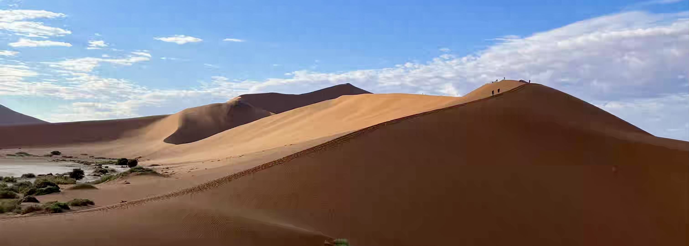

*Jako spořič obrazovky dobrý, ne?*

&nbsp;

Poušť mě naprosto fascinovala. Písečné duny měly svoje vlastní kouzlo a dekadentní pláň mi
nepřipomínala žádné jiné místo, na kterém jsem do té doby byl. Byl to opravdový zážitek a mně se
v tu chvíli ani nechtělo věřit, že tady naše dovolená v podstatě končí.

&nbsp;

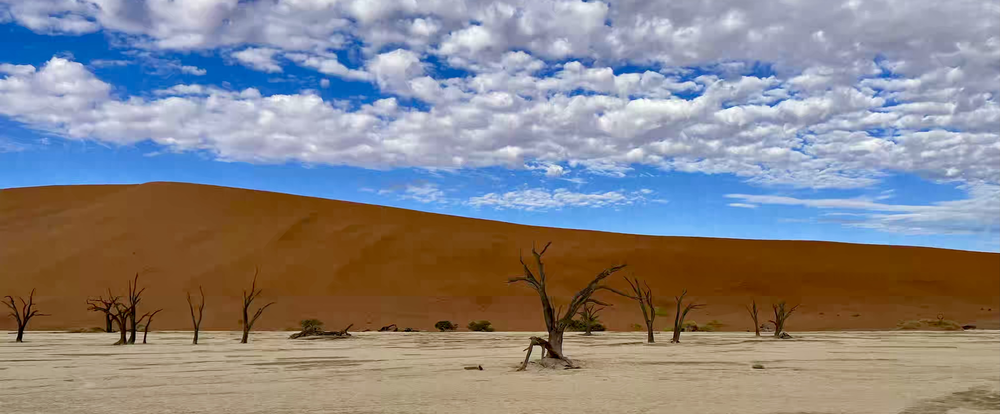

*Bílá pláň, písečné duny a mrtvé stromy. To je [Deadvlei](https://en.wikipedia.org/wiki/Deadvlei).*

&nbsp;

Cestou zpět na záchytné parkoviště zvládl řidič našeho shuttle autíčka vyprostit jednoho
nešťastníka, který zapadl ve vysoké vrstvě jemného písku. Potom už jsme ale jen zaplatili za odvoz
a vyrazili na dlouhou cestu zpět do [hlavního města](https://cs.wikipedia.org/wiki/Windhoek).

Kousek od našeho hostelu jsme navštívili myčku aut, kde nám za nádherných 400 namibijských dolarů
(cca 500 korun českých) umyli auto tak, že jsem ho po týdnu v poušti prakticky nepoznal. A jako
bonus mi pán umyl i zaprášené boty. Tomu říkám prozákaznícký servis!

Na hostelu jsme se sešli s naším známým Aaronem, který nás vzal na večeři do restaurace
[Roof of Africa](http://roofofafrica.eu/). Když jsme se rozhodovali, kam jít, my s Niekem jsme
neměli žádnou preferenci. Aaron ale říkal, že [Roof of Africa](http://roofofafrica.eu/) by určitě
doporučil. Až když jsme dorazili na místo, tak z něj vypadlo, že je tam poprvé. Na jídlo jsme
ochutnali půlku kuřete a pap, což je tradiční jídlo pro jeden z namibijských kmenů. Dle zvyklosti
se má jídlo jíst rukama, proto jsme se alespoň ze začátku drželi dekóru a příbor nechávali bez
povšimnutí. Po chvíli mě ale přestalo bavit, jak jsem byl od kuřete špinavý, proto jsem nakonec
příbor stejně použil.

Byl jsem moc rád, že poslední večer v [Namibii](https://cs.wikipedia.org/wiki/Namibie) jsme strávili
právě s Aaronem, jakožto místňákem, se kterým jsme se na konferenci nejvíce sblížili. Upřímně
doufám, že jsem ho neviděl naposledy. 😊

&nbsp;

#### DEN 12

Před odletem už se nic extra zajímavého nedělo. Po snídani jsme se rozloučili
s [hostelem Chameleon](https://www.chameleonbackpackers.com/) a jeli vrátit auto. V autopůjčovně
nás poté vyzvedl Daniele a společně s ním jsme se přesunuli na letiště. Následoval 6hodinový let
do [Addis Abeba](https://cs.wikipedia.org/wiki/Addis_Abeba), kde jsme se rozloučili s Niekem.

Bylo krátce po 20. hodině a letadlo do [Vídně](https://cs.wikipedia.org/wiki/V%C3%ADde%C5%88) mi
letělo až kolem půlnoci. Měl jsem proto dost času na to, abych nakoupil nějakou
[etopii](https://www.manucafe.cz/etiopie-kava-x2v10062)
z [Etiopie](https://cs.wikipedia.org/wiki/Etiopie) a dal si večeři. V jedné z restaurací jsem si
objednal tradiční cizrnovou omáčku [shiro](https://en.wikipedia.org/wiki/Shiro_(food)) a kyselou
palačinku [injera](https://en.wikipedia.org/wiki/Injera). Moc mi to nejelo. Možná i proto, že
u jídla jsem sledoval trápení pražské [Sparty](https://sparta.cz/cs/), která v rámci čtvrtfinále
[Evropské ligy](https://cs.wikipedia.org/wiki/Evropsk%C3%A1_liga_UEFA) hrála
na [Anfield Road](https://cs.wikipedia.org/wiki/Anfield). Bohužel
na [Liverpool](https://cs.wikipedia.org/wiki/Liverpool_FC) vůbec nestačila a domů odjela s ostudnou
[porážkou 6:1](https://www.youtube.com/watch?v=ta7fBXKQZQ4).

Před půlnocí jsem nastoupil do letadla a snažil se usnout. Nějak jsem prospal první polovinu letu,
ale poslední dvě hodiny už byly naprostým utrpením. Nevěděl jsem, jak si dát hlavu ani nohy a za
žádnou cenu jsem nemohl zabrat. Když jsme proto ráno přistáli
ve [Vídni](https://cs.wikipedia.org/wiki/V%C3%ADde%C5%88), považoval jsem to za vysvobození!

Následovala pohodová cesta vlakem do [Brna](https://cs.wikipedia.org/wiki/Brno).

&nbsp;

#### DOJMY Z NAMIBIE

- Pokud bychom jeli po [PyConu](https://na.pycon.org/) domů, nevadilo by mi to. Cestování jsem si
moc užil, ale samotná konference byla nabitá tolika událostmi, že prostě a jednoduše překonala
zbytek mého pobytu. 🐍
- Místní  obyvatelé byli v naprosté většině usměvaví, bezprostřední a moc milí. Negativní zkušenost
jsme měli pouze s naháněči. Někteří z nich byli dotěrní a hrozně vytrvalí. Jiným zase stačilo říct
"ne" a nechali nás. 🧑🏿
- Namibijci jsou masožravci. Nejraději mají hovězí maso, ale jí i kuřecí, jehněčí, kozí a zvěřinu.
Do kategorie "zvěřina" se v [Namibii](https://cs.wikipedia.org/wiki/Namibie) řadí přímorožec,
antilopa, kudu, zebra a další divoká zvířata. 🦓
- Hotely a hostely byly na podobné úrovni jako v Evropě. Nikde jsem se ničeho neštítil, ani
nebál. 🏠
- Velké rozdíly jsem pozoroval na silnicích. Hlavní tahy byly v lepším stavu než některé úseky
naší dálnice D1. Když jsme se ale dostali na prašné šterkové cesty, neustále jsem se bál,
že píchneme. 🚙
- Národní parky působily jako z jiné planety.
V [NP Etosha](https://en.wikipedia.org/wiki/Etosha_National_Park) mě bavilo pozorovat exotická
zvířata v jejich přirozeném prostředí. V [NP Spitzkoppe](https://en.wikipedia.org/wiki/Spitzkoppe)
a [NP Namib-Naukluft](https://en.wikipedia.org/wiki/Namib-Naukluft_National_Park) mě zase dostávaly
nádherné přírodní scenérie. Moc rád bych se do [Afriky](https://cs.wikipedia.org/wiki/Afrika) ještě
vrátil a navštívil další národní parky. 🌍
- Nočnímu letu do [Afriky](https://cs.wikipedia.org/wiki/Afrika) bych se příště raději vyhnul. Bylo
to jedno velké utrpení. ✈️

&nbsp;

#### FOTKY

Fotky od organizítorů PyConu najdete
[zde](https://drive.google.com/drive/u/0/folders/1cUPJ_1JMAdAwzo6FGUB6glgEafqKTon-).

Můj výběr fotek najdete [zde](https://photos.app.goo.gl/8HYReD1EapUzi3LA7).
