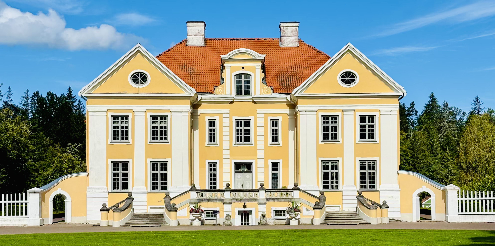
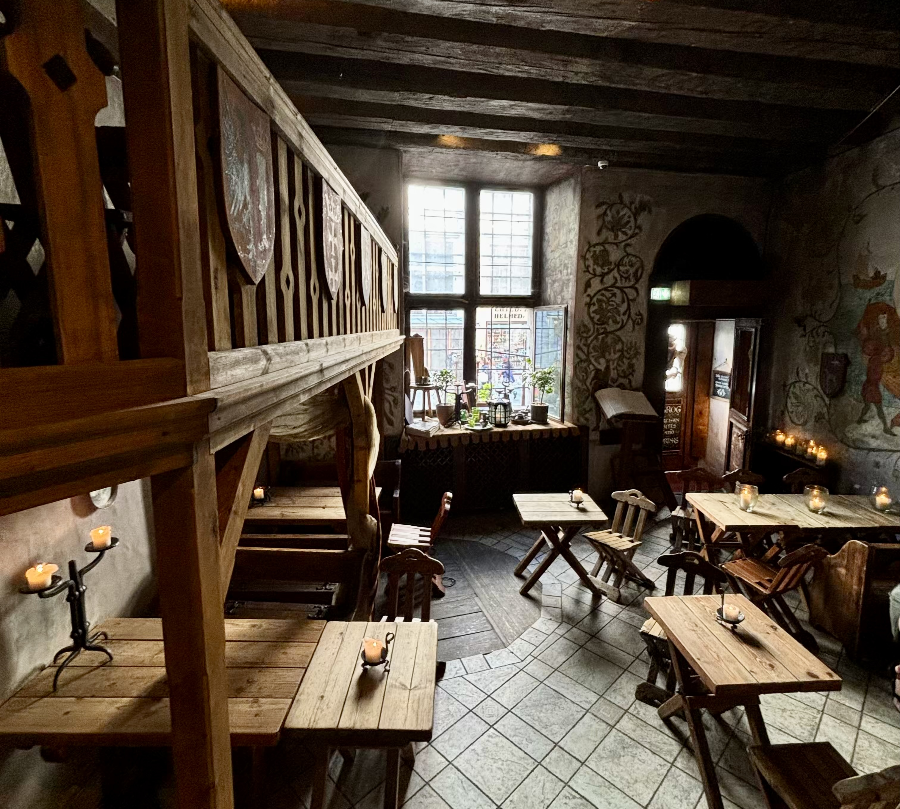
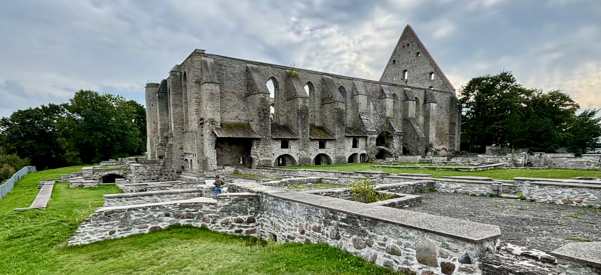
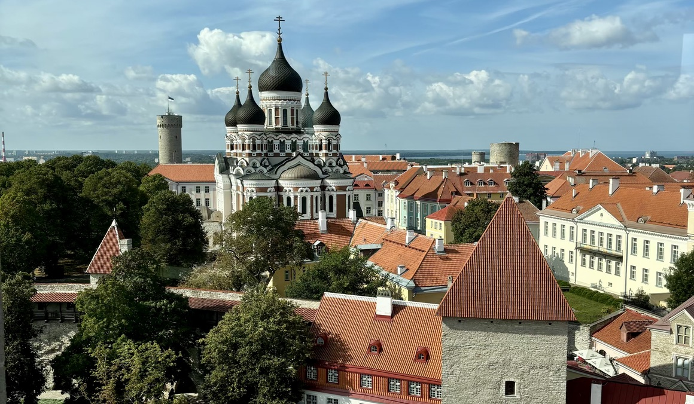
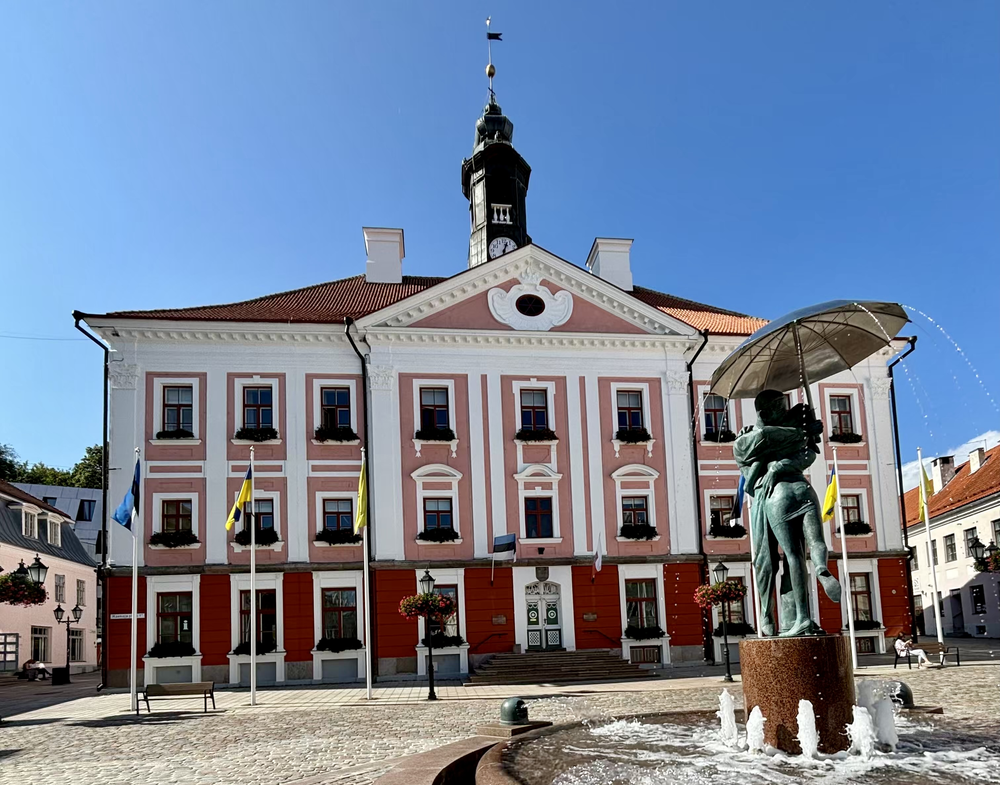
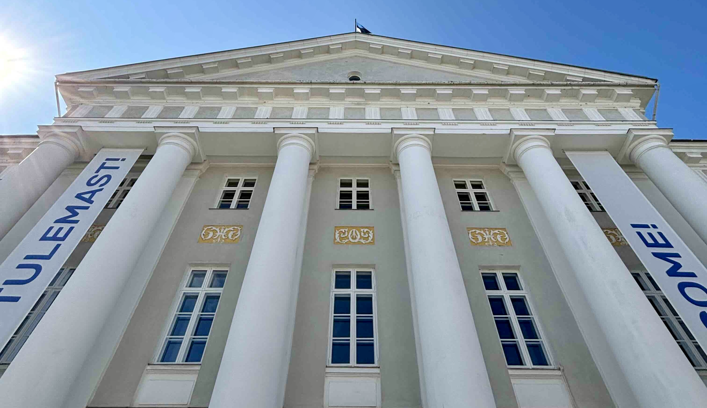
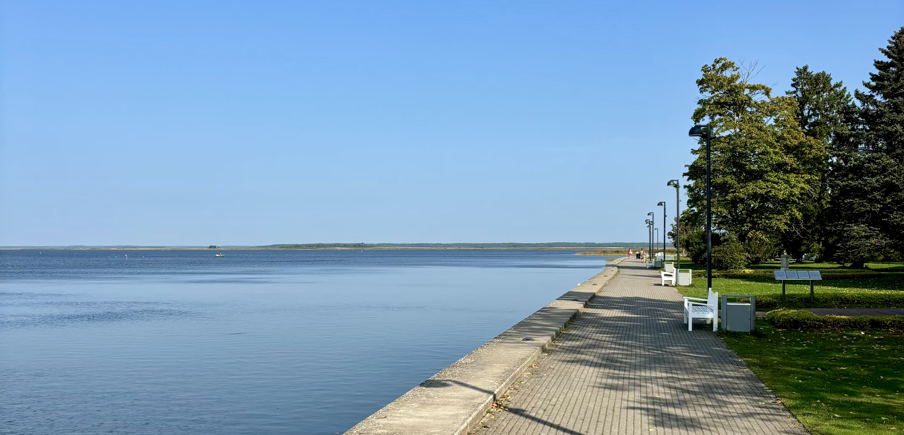

&nbsp;

Už nějaký ten rok říkám, že léta na jižní Moravě jsou na můj vkus moc teplá a nejraději bych
na prázdniny odjel někam, kde nebudu tolik trpět. Na jaře jsem proto toto téma znovu několikrát
otevřel a snažil se ostatní členy naší malé rodinky přesvědčit o tom, že v jiných destinacích
si léto užijeme mnohem více než v [Brně](https://cs.wikipedia.org/wiki/Brno). Bohužel se mi to úplně nepodařilo.

Zprvu mi bylo řečeno, že na celé léto určitě nikam nepojedeme, protože by nám doma zdechly kytky.
Chápu. Navrhl jsem proto, abychom do zahraničí jeli alespoň na dva týdny, a to s tím, že jsem
očekával, že z dané destinace budeme celou dobu pracovat, abychom si nemuseli brát žádnou dovolenou.
V protinávrhu stálo, že dva týdny by klidně šly, ale museli bychom na místě jeden týden cestovat
a jeden týden pracovat, abychom také stihli z dané země něco vidět. Souhlasil jsem. Po nějaké
době ale přišel zvrat. Klára řekla, že nechce pouze týden pracovat odjinud než z domu, protože jí
to nestojí za balení všech pracovních věcí, a tak moje vysněná cesta za chladným létem dopadla tak,
že jsme vyrazili na dovolenou do Estonska. Na týden. A na konci srpna, kdy už léto bylo skoro
za námi a v [Estonsku](https://cs.wikipedia.org/wiki/Estonsko) říkali, že u nich už začal podzim! 😿

&nbsp;

#### DEN 0 (tentokrát bude krátký)

Protože nám letadlo z [Vídně](https://cs.wikipedia.org/wiki/V%C3%ADde%C5%88) letělo v sobotu
brzy ráno, vyrazili jsme do Rakouska už v pátek večer a přespali v hotelu na letišti.

&nbsp;

#### DEN 1

Budík nás probudil ve 4 hodiny. Na hotelu jsme se moc nezdržovali. Jen jsme si sbalili věci, udělali
check-out a zamířili na letiště. Tam jsme prošli bezpečnostní kontrolou a v 6 hodin už jsme seděli
v letadle do [Tallinnu](https://cs.wikipedia.org/wiki/Tallinn).

První hodinu letu jsem prospal. Tu druhou jsem se snažil usnout, ale moc mi to nešlo. A nepomohla
tomu ani paní v důchodovém věku, které se asi 30 minut před přistáním udělalo špatně. Nejdříve jsem
si všiml, jak si paní stoupla do uličky a začala se přidržovat jiné, o dost mladší paní stojící
hned vedle ní. V tu chvíli už bylo vidět, jak paní bledne a začíná se kácet k zemi. Paní se natáhla
v uličce a protože to není zase tak obvyklé, ostatní cestující hned začali křičet: "Help!" Jen aby
bylo jasno, nezpívali
[známou píseň od Beatles](https://cs.wikipedia.org/wiki/Help!_(p%C3%ADse%C5%88)), ale snažili
se přivolat palubní posádku. Přestože se k sedadlům v 15. řadě seběhla celá crew, ani jeden
z členů nevypadal, že by věděl, co dělat. Někdo donesl vodu, jiní jen stáli a přihlíželi.
O pár minut později už ale ostatní cestující pomáhali paní vstát a sednout si zpět na její sedadlo.
Naštěstí se tedy nic vážného nestalo a my tak kolem 9. hodiny místního času přištáli na tallinnském
letišti se stejným počtem pasažérů, se kterým jsme opouštěli
[Vídeň](https://cs.wikipedia.org/wiki/V%C3%ADde%C5%88)!

V malém bistru na letišti jsme si dali snídani, poté si vyzvedli auto 
v [půjčovně Sixt](https://www.sixt.cz/) a jeli
na [hotel](https://www.booking.com/hotel/ee/bob-w.cs.html), nebo lépe řečno "před hotel",
kde jsme pouze zaparkovali auto a potom vyrazili do víru
(velko)města. Přestože centrum bylo vzdálené asi 1.5 km, cesta nám zabrala skoro 2 hodiny.
Hned za naším [hotelem](https://www.booking.com/hotel/ee/bob-w.cs.html) se totiž nacházel
[Telliskivi Loomelinnak](https://telliskivi.cc/), obrovský komplex bývalých továren,
z něhož se stala hipsterská chlouba města. Dnes se v rozsáhlém areálu nachází butiky s lokálními
výrobky, restaurace, kavárny a galerie. V jedné z restaurací
s názvem [F-Hoone](https://www.fhoone.ee/) jsme si dali výborný
oběd a poté si prohlédli malé obchůdky nacházející se v bludišti bývalých továrních budov.

Když jsme dorazili do centra, dostali jsme chuť na kávu, proto Klára nažhavila
[European Coffee Trip](https://europeancoffeetrip.com/)
a vybrala jednu z mála tallinnských kaváren v aplikaci. Cesta měla zabrat pár jednotek minut.
Nakonec jsme tam ale šli spíše pár desítek minut. Důvodem prý bylo, že se "navigace ztratila".
Návštěva kavárny se nakonec prodloužila ještě víc, a to čekáním na volnou toaletu. Kávu a zákusek
jsme dojedli relativně rychle. Chvíli před tím, než jsme ale chtěli odejít, odešla na jedinou
toaletu v kavárně jediná paní baristka, která měla na starost obsluhu všech hostů. Když už byla
paní na toaletě dobrých 20 minut, přišli za námi nešťastní zákazníci, kteří měli tu smůlu, že
dorazili do kavárny těsně po tom, co si paní baristka “odskočila”, a ptali se nás, zda nevíme, kde
je obsluha. Když jsme jim řekli, že obsluha je na toaletě, paní se zasmály, otočily na podpatku
a odešly. V tom okamžiku bylo slyšet, že je na toaletě nějaký pohyb. Po chvíli se ozvalo spláchnutí
a poté se otevřely dveře a ze záchodu vyšla obsluha.

Když jsme vyšli z podniku, rozhodli jsme se vyšlápnout
[kopec Toompea](https://cs.wikipedia.org/wiki/Hrad_Toompea) v historickém
centru města. Na něm se nachází budova parlamentu, pravoslavný
[chrám svatého Alexandra Něvského](https://cs.wikipedia.org/wiki/Chr%C3%A1m_svat%C3%A9ho_Alexandra_N%C4%9Bvsk%C3%A9ho_(Tallinn)),
několik dalších méně významných kostelů a také hromada vyhlídkových plošin nabízejících nádherné
pohledy do širokého okolí hlavního města [Estonska](https://cs.wikipedia.org/wiki/Estonsko).

Po procházce městem jsme se zastavili na rychlou večeři v moderní tržnici
[Balti Jaama Turg](https://visitestonia.com/en/balti-jaam-market)
a poté se šli ubytovat na náš [hotel](https://www.booking.com/hotel/ee/bob-w.cs.html).

&nbsp;

#### DEN 2

Přestože jsme v průběhu našeho prvního dne v [Tallinnu](https://cs.wikipedia.org/wiki/Tallinn)
viděli skoro celé historické centrum města, věděli jsme se, že o památkách, které jsme viděli,
nic nevíme. Proto jsme se rozhodli, že po snídani vyrazíme do centra města znovu a podíváme se
na všechny památky znovu s knižním průvodcem v ruce.

Prohlídka města začala na ulici "Dlouhá noha", delší ze dvou pěších cest
na [kopec Toompea](https://cs.wikipedia.org/wiki/Hrad_Toompea). Na jejím
konci nás přivítalo Hradní náměstí a nádherný pohled na
[chrám svatého Alexandra Něvského](https://cs.wikipedia.org/wiki/Chr%C3%A1m_svat%C3%A9ho_Alexandra_N%C4%9Bvsk%C3%A9ho_(Tallinn)),
jeden ze symbolů města. Z náměstí jsme se vydali do Guvernérské zahrady, kde stojí další
z dominant města, a to věž [Dlouhý Heřman](https://visitestonia.com/en/pikk-hermann-tall-hermann).
Tradice říká, že pokud někdo vyvěsí na věž svoji vlajku, bude
[Estonsku](https://cs.wikipedia.org/wiki/Estonsko) vládnout. V únoru roku 1989 zde byla namísto
rudé vlajky [SSSR](https://cs.wikipedia.org/wiki/Sov%C4%9Btsk%C3%BD_svaz) vyvěšena
[estonská vlajka](https://cs.wikipedia.org/wiki/Estonsk%C3%A1_vlajka) s bílým,
černým a modrým pruhem, což je považováno za jedno z nejodvážnějších gest při boji
[Estonska](https://cs.wikipedia.org/wiki/Estonsko) za nezávislost. Od té doby na věži
[Dlouhý Heřman](https://visitestonia.com/en/pikk-hermann-tall-hermann) vlaje
[estonská vlajka](https://cs.wikipedia.org/wiki/Estonsk%C3%A1_vlajka) každý den.

Ze zahrad jsme se přemístili do poměrně dost nudných podzemních chodeb pod
[hradem Toompea](https://cs.wikipedia.org/wiki/Hrad_Toompea), které ve 20. století sloužily
jako protiatomový kryt. Nebylo tam zrovna velké teplo a ani nic moc zajímavého k vidění.

Když jsme vyšli ven, zamířili jsme se trošku ohřát do středověké krčmy s názvem
[Olde Hansa](https://visitestonia.com/en/olde-hansa). Tam jsme si kromě vynikajícího jídla
objednali i skořicové pivo, které na mě působilo trošku víc, než jsem původně čekal. Možná to
bylo i tím, že jsem dopíjel to Klářino. [Restaurace](https://visitestonia.com/en/olde-hansa) se
nachází na [Radničním náměstí](https://en.wikipedia.org/wiki/Raekoja_plats,_Tallinn) v samém srdci
[Tallinnu](https://cs.wikipedia.org/wiki/Tallinn), takže by se mohlo zdát, že se jedná o typickou
past na turisty. Jak ale říká náš průvodce - bez návštěvy
[Olde Hansa](https://visitestonia.com/en/olde-hansa) by nebyla návštěva
[Tallinnu](https://cs.wikipedia.org/wiki/Tallinn) kompletní. 😁

&nbsp;

*V [restauraci Olde Hansa](https://visitestonia.com/en/olde-hansa) měl člověk pocit, že se vrátil
v čase o několik století zpět.*

&nbsp;

Po obědě jsme pokračovali v prohlídce Dolního města.
Z [Radničního náměstí](https://en.wikipedia.org/wiki/Raekoja_plats,_Tallinn) jsme se vydali pasáží
Saikang ke [kostelu sv. Ducha](https://en.wikipedia.org/wiki/Church_of_the_Holy_Spirit,_Tallinn).
Ten stojí na začátku ulice Pikk. Ulice je charakteristická barevnými
cechovními domy i skutečností, že na jejím konci stojí Velká pobřežní brána, jedna ze šesti
stedověkých bran, které dříve umožňovaly přístup do města. Bránou jsme vyšli ven ze starého města,
abychom ji obešli a druhou stranou se zase vrátili. Udělali jsme tak proto, že jsme měli namířeno
na nejmalebnější uličku v [Tallinnu](https://cs.wikipedia.org/wiki/Tallinn),
neboli [pasáž sv. Kateřiny](https://et.wikipedia.org/wiki/Katariina_k%C3%A4ik), která pro mě
osobně byla spíše zklamáním. Naši procházku městem jsme zakončili
na [Náměstí svobody](https://et.wikipedia.org/wiki/Vabaduse_v%C3%A4ljak), které, přestože stojí hned
za hradbami starého města, má naprosto odlišný
[vibe](https://slovniky.lingea.cz/anglicko-cesky/vibe). A není se co divit. Ještě do roku 2009
fungovalo jako parkoviště. Poté bylo přestavěno do dnešní moderní podoby.

Náročný den jsme zakončili na jídle ve vegetariánské restauraci v našem novém oblíbeném komplexu
[Telliskivi Loomelinnak](https://telliskivi.cc/).

&nbsp;

#### DEN 3

Po snídani jsme si sbalili věci a jeli na celodenní výlet do
[národního parku Lahemaa](https://visitestonia.com/en/lahemaa-national-park-and-information-point).

Kousek za [Tallinnem](https://cs.wikipedia.org/wiki/Tallinn) jsme si udělali krátkou zastávku u vodopádu Jagala a poté jsme se vydali
na cca 5.5 km dlouhý trek přes nádherné rašeliniště Viru. Přestože cesta vedla po úzkých dřevěných
chodníčcích a člověk musel dávat pozor, kam šlape, nejednalo se o nijak náročnou túru.

&nbsp;

*Rašeliniště Viru v [NP Lahemaa](https://visitestonia.com/en/lahemaa-national-park-and-information-point).*

&nbsp;

Když jsme dorazili k autu, bylo už kolem 13:30 a nám poměrně vyhládlo. Nasedli jsme proto do auta
a jeli do první lepší restaurace u cesty, která měla alespoň trošku dobré hodnocení. Když jsme ale
vystoupili z auta, hlady jsme asi už ani neviděli, protože vedle parkoviště stály dva podniky, čehož
jsme si vůbec nevšimli a vešli zrovna do toho špatného. Nejednalo se o restauraci, ale spíše
vývařovnu bez obsluhy. Na černé tabuli bylo bílou křídou napsáno menu v estonštině, které jsme se
snažili rozluštit pomocí mobilní aplikace. Ta nám ale moc nepomohla. Když jsem se paní zeptal, zda
mi může nabídnout nějaké typické estonské jídlo, řekla, že nic takového tam nemají, ale může mi
nabídnout "schnitzel". Řízek jsem ale nechtěl. Nakonec jsem si řekl, že tam nebudu zdržovat a dám si
něco, co bylo nazváno jako "kotletid". "To bude jasná vepřová kotleta!" říkal jsem si. Ale chyba
lávky! Byl to totiž "jasný" holandský řízek.

Kromě řízku jsem si poručil ještě [seljanku](https://estoniancuisine.com/2017/06/22/after-party-s/),
estonskou polévku, kterou jsem před tím neznal. Nyní už
ji znám a znovu bych si ji určitě nedal. Jedná se totiž o pokrm, ve kterém hraje hlavní roli
maso. A i když mi obecně maso neva, tady je ho na mě trošku moc! Přiznávám, že sám umím uvařit jen
dvě jídla, kde první je marinované tofu z igelitu a druhé rýže z pytlíku, ale když se nyní dívám na
[recept na uvaření seljanky](https://estoniancuisine.com/2017/06/22/after-party-s/), vypadá to nějak
podezřele. 2 cibule, 70 g rajčatového protlaku a 500 g masa (šunka, párky, kuřecí, vepřové)?
To mi prostě neštymuje. A spíš to na mě působí jako nějaká pochoutka ze známé pohádky o pejskovi
a kočičce než jídlo, za které bych byl ochotný někomu platit.

Jak jste asi pochopili, jídlo ve vývařovně mi nechutnalo, ale myslím, že Klára na tom byla
ještě o něco hůř. Ta totiž nechtěla masná jídla riskovat vůbec, a tak si objednala jediné bezmasé
jídlo v nabídce: lívance s marmeládou.

Po obědě jsme udělali dvě skoro identické zastávky u dvou malých zámečků uprostřed parku:
[Palmse manor](https://visitestonia.com/en/palmse-manor-and-open-air-museum) (na úvodní fotce)
a [Sagadi manor](https://visitestonia.com/en/sagadi-manor). Při obou zastávkách jsme se prošli
po zámeckých zahradách, podívali se do budov, které náležely do areálu zámků a pokračovali jsme dál.

&nbsp;

*Čelní pohled na zámeček [Sagadi manor](https://visitestonia.com/en/sagadi-manor).*

&nbsp;

Když jsme vyjížděli z parkoviště u druhého zámečku, už bylo relativně pozdě, a tak jsme zvažovali,
zda se už nevrátit do [Tallinnu](https://cs.wikipedia.org/wiki/Tallinn).
Nakonec jsme se ale rozhodli vydat ještě na jeden
[trek přes les Oandu](https://loodusegakoos.ee/where-to-go/national-parks/lahemaa-national-park/oandu-nature-forest-trail-4-dot-7-km),
který měl podle průvodců patřit k jedněm z nejhezších v národním parku.
Jak jsme se blížili k hustému lesu, čím dál intenzivněji jsem přemýšlel nad tím,
že na území [Estonska](https://cs.wikipedia.org/wiki/Estonsko)
[žije kolem tisícovky medvědů](https://visiteurope.com/en/experience/bear-watching-in-estonia/).
Tento fakt navíc potvrdila informační tabule na začátku treku. Chvíli jsem proto
přemýšlel, jak se chovat, když nějakého méďu potkáme. Moc dlouho mi to ale nevydrželo, protože moji
mysl rychle začala zaměstnávat jiná zvěř, a to komáři a další hmyz, který mě po celou dobu 3.5 km
dlouhého treku kousal do všech obnažených částí těla. V tu chvíli jsem na medvědy úplně zapomněl a
spíš jsem si vyčítal, že jsem si nesbalil Predatora, nebo alespoň neoblékl něco s dlouhým rukávem.
Když ale upustím od skutečnosti, že jsem se z treku vrátil s nespočtem štípanců a nevratnými
psychickými následky, opravdu se jednalo o super trek uprostřed nedotčeného hustého lesa a možná
i jedno z nejhezších míst, na kterém jsme v [Estonsku](https://cs.wikipedia.org/wiki/Estonsko) byli!

Cestou zpět do [Tallinnu](https://cs.wikipedia.org/wiki/Tallinn) jsme se zastavili na večeři
v malebné rybářské vesničce [Altja](https://visitestonia.com/en/altja-fishing-village). Po jídle
jsme se ještě prošli kolem moře a poté už zamířili do hlavního města
[Estonska](https://cs.wikipedia.org/wiki/Estonsko).

&nbsp;

#### DEN 4

Po předchozím dni stráveném v přírodě jsme se rozhodli naplánovat další den
v [Tallinnu](https://cs.wikipedia.org/wiki/Tallinn), konkrétně v jeho severní část na pobřeží
[Baltského moře](https://cs.wikipedia.org/wiki/Baltsk%C3%A9_mo%C5%99e).

Po snídani jsme nasedli do auta a jeli do čtvrti [Kalamaja](https://cs.wikipedia.org/wiki/Kalamaja).
V jedné z nejstarších čtvrtí [Tallinnu](https://cs.wikipedia.org/wiki/Tallinn), kde dříve bydlela
převážně pracující třída, se sice dodnes nachází mnoho barevných dřevěných domečků
z přelomu 19. a 20. století, ale na druhou stranu je vidět, že čtvrť se postupně modernizuje
a hlavně na pobřeží vyrůstají moderní bytové domy. Tato část města na mě působila jako takový
mix amerického západu a pražského [Karlína](https://cs.wikipedia.org/wiki/Karl%C3%ADn).

My jsme se ale nepřijeli dívat na bytové domy. Nejdříve jsme se podívali do přístavu,
vyfotili si ledoborec za [muzeem hydroplánu](https://meremuuseum.ee/lennusadam/) a poté se prošli
kolem bývalého [vězení Patarei](https://en.wikipedia.org/wiki/Patarei_Prison). Tato
budova, která je pro Estonce symbolem nacistického a sovětského teroru, dnes slouží jako muzeum.
My se dovnitř bohužel nepodívali, protože v současné době je muzeum zavřené kvůli rekontrukci.

Kousek od věznice stojí další budova připomínající dobu sovětského útlaku,
a to [Linnahall](https://en.wikipedia.org/wiki/Linnahall). Jedná se
o obrovský komplex, který vyrostl kousek za hradbami starého města před
[letní olympiádou v Moskvě v roce 1980](https://cs.wikipedia.org/wiki/Letn%C3%AD_olympijsk%C3%A9_hry_1980).
Moskva, jakožto město ve vnitrozemí, neměla možnost pořádat jachtařskou soutež, a tak tato
"milá" povinnost připadla [Tallinnu](https://cs.wikipedia.org/wiki/Tallinn).
Kvůli tomu vyrostlo v estonském přístavu betonové monstrum, které sice ještě do roku 2009
sloužilo jako koncertní síň pro více než 4 tisíce lidí, ale dnes už bohužel jen chátrá a čeká
na investora, který by budovu oprášil a vrátil jí život. Do té doby asi
bude dál sloužit jen jako hodně bizarní památka pro turisty, nebo jako kulisa při natáčení dalšího
hollywoodského filmu. Tím prvním a zatím posledním byl
[film Tenet](https://www.csfd.cz/film/693159-tenet/prehled/) režiséra
[Christophera Nolana](https://www.csfd.cz/tvurce/3022-christopher-nolan/prehled/).

&nbsp;

*[Linnahall](https://en.wikipedia.org/wiki/Linnahall).*

&nbsp;

Po vynikajícím obědě v klidném bistru
[Soo Uulits](https://visitestonia.com/en/soo-uulits-gourmet-street-food) jsme nasedli do auta
a přesunuli se dále na východ k baroknímu
[paláci Kadriorg](https://cs.wikipedia.org/wiki/Pal%C3%A1c_Kadriorg). V něm se nachází
[Estonské umělecké muzeum](https://cs.wikipedia.org/wiki/Estonsk%C3%A9_um%C4%9Bleck%C3%A9_muzeum),
které vystavuje díla lidí, o kterých jsem nikdy neslyšel, a tak se o nich nebudu ani rozepisovat.

Po prohlídce muzea jsme si prošli okolní zahrady a podívali jsme se k prezidentskému paláci, který
s [Kadriorgským palácem](https://cs.wikipedia.org/wiki/Pal%C3%A1c_Kadriorg) přímo sousedí.

Kolem 16. hodiny jsme přejeli jen o pár kilometrů dál
k [pláži Pirita](https://visitestonia.com/en/pirita-beach). Tam jsme si udělali krátkou
procházku po zpevněném písku blízko vody a cestou zpět k autu jsme to vzali po betonovém chodníčku
v borovicovém háji, který se nacházel hned za pláží.

U auta jsme si řekli, že máme ještě dost času, proto jsme se rozhodli navštívit
[klášter sv. Brigity](https://visitestonia.com/en/ruins-of-bridgettine-convent), nebo alespoň to, co
z něj zbylo. U vstupu do areálu neseděl žádný zaměstnanec, který by vybíral vstupné a nebylo to
ani potřeba. Vedle vstupu totiž visel automat, ve kterém si návštěvník sám koupil lístek, a potom
jeho čárový kód načetl v turniketu. Když jsme takto vešli do areálu, připadalo nám, že v areálu
nikdo kromě nás není. A protože jsme si s sebou vzali z auta vodu, rozhodli jsme se ji nechat
na lavičce za vstupním turniketem, abychom ji nemuseli nosit po celém areálu. Říkali jsme si,
že jsme tam stejně sami, a tak se nemusíme bát, že by nám ji někdo vzal. Když jsme ale udělali pár
kroků a dostali se mezi monumentální zdi starého kláštera, otočil jsem se a všiml jsem si, že
do areálu vchází mladí rodiče s malou, přibližně 5 let starou holčičkou. Skupinky za námi jsem si
moc nevšímal, ale to byla pravděpodobně chyba. O pár chvil později mi totiž Klára řekla, že když
malá holčička uviděla naši vodu, vzala ji a poslušně ji vyhodila do koše. A tak jsme přišli láhev
s vodou! 😁

&nbsp;

*[Klášter sv. Brigity](https://visitestonia.com/en/ruins-of-bridgettine-convent)
mi hodně připomíná
[klášter Rosa Coeli v Dolních Kounicích](https://www.dolnikounice.cz/klaster-rosa-coeli/ds-4770).
Co myslíte?*

&nbsp;

Naštěstí už nás ten den čekala jen večeře, a tak jsme se napili u jídla, které jsme si ten večer
vychutnali na střešní terase
[Muzea Fotografiska](https://visitestonia.com/en/fotografiska-restaurant-rooftop-garden)
s nádherným výhledem na staré město!

&nbsp;

#### DEN 5

Pátý den přišla dlouho očekávaná středa. Píšu "dlouho očekávaná", protože co se každému hned
vybaví, když se řekne "poslední středa v měsíci" a  "Tallinn"? No, jasně!
["3 euro wednesday"](https://kunstimuuseum.ekm.ee/en/tickets-museum/#3-euro-wednesdays), nebo-li
"středa za 3 eura", marketingová akcička vybraných tallinnských muzeí, kterou jsme prostě museli
využít!

A tak jsme na nic nečekali a když už byla ta poslední středa v měsíci, zkusili jsme ta muzea
trošku podojit!

[**Muzeum Niguliste**](https://visitestonia.com/en/niguliste-museum-and-viewing-platform)

Všude se píše, že se jedná o muzeum. Podle mě jsme spíš navštívili kostel a kostelní věž. Ale
nepředbíhejme.

Do "muzea" jsme vešli zadním vchodem do kostela a po kamenných schodech sešli
do prvního podzemního patra, kde jsme si koupili vstupenky - ano, jednu za 3 eura - odložili si věci
do šatny a prošli vstupním turniketem. Za ním jsme vyšli pár schodů a zjevili se v hlavní lodi nádherného
[kostela sv. Mikuláše](https://cs.wikipedia.org/wiki/Kostel_svat%C3%A9ho_Mikul%C3%A1%C5%A1e_(Tallinn)),
ve kterém se neslouží mše už od konce druhé světové války.
V současné době se v něm pořádají koncerty a nachází se v něm stálá expozice
[muzea Niguliste](https://visitestonia.com/en/niguliste-museum-and-viewing-platform).
Ta převážně zahrnuje sochy, obrazy a mnoho ikon s duchovní tématikou. Nejvýznamnějším masterpiecem
je 30 metrů dlouhá malba s názvem Tanec smrti od Bernta Notkeho. Na konci velice krátké prohlídky,
která prakticky zahrnuje pouze obvodové zdi kostela a oltář, se nachází prosklený výtah. Ten
obsluhuje starší personál, který vozí návštěvníky do nejvyššího patra kostelní věže. Z ní je
nádherný výhled na staré město, [kopec Toompea](https://cs.wikipedia.org/wiki/Hrad_Toompea) a hlavně na [chrám svatého Alexandra Něvského](https://cs.wikipedia.org/wiki/Chr%C3%A1m_svat%C3%A9ho_Alexandra_N%C4%9Bvsk%C3%A9ho_(Tallinn))! Wow!
Z kostelní věže dolů se lze dostat buď výtahem, nebo cestou pěšky po schodech, která vede
přes další menší expozice muzea. My jsme si sice vybrali druhou možnost, ale nemyslím si, že to bylo
úplně zapotřebí. Sbírku tří kostelních zvonů ani dočasnou expozici věnovanou poutnictví
ve středověku jsem vidět nemusel.

&nbsp;

*Pohled z věže [kostela sv. Mikuláše](https://cs.wikipedia.org/wiki/Kostel_svat%C3%A9ho_Mikul%C3%A1%C5%A1e_(Tallinn)) na
[chrám svatého Alexandra Něvského](https://cs.wikipedia.org/wiki/Chr%C3%A1m_svat%C3%A9ho_Alexandra_N%C4%9Bvsk%C3%A9ho_(Tallinn)).*

&nbsp;

[**Budova radnice**](https://visitestonia.com/en/tallinn-town-hall)

Po obědě v italské [restauraci La Prima](https://laprima.pizza/vanalinn/) jsme se šli podívat
do budovy nejstarší a zároveň jediné dochované gotické radnice v severní Evropě! Součástí prohlídky
jsou jak nádherné reprezentační prostory s mnoha dřevěnými řezbami, tapisériemi a obrazy,
tak artefakty, které připomínají významné události a setkání se zahraničními hosty. V přízemí
radnice se proto nachází taková "skromná kniha návštěv", do které se v minulosti podepsal např.
[Václav Havel](https://cs.wikipedia.org/wiki/V%C3%A1clav_Havel), nebo
[královna Alžběta II.](https://cs.wikipedia.org/wiki/Al%C5%BEb%C4%9Bta_II.)
s [Princem Philipem](https://cs.wikipedia.org/wiki/Princ_Philip,_v%C3%A9voda_z_Edinburghu).
Kompletní seznam osobností můžete nalézt
[zde](https://raekoda.tallinn.ee/en/tallinn-town-hall-venue-for-events/guests-of-honour/).

[**Muzeum Adamson-Eric**](https://visitestonia.com/en/adamson-eric-museum)

Muzeum je pojmenováno po jednom z nejvšestranější estonských umělců 20. století a nachází se přímo
v srdci [Tallinnu](https://cs.wikipedia.org/wiki/Tallinn), konkrétně na úzké uličce Lühike jalg
hned pod kopcem Toompea v jednom z malých středověkých domů. Stálá expozice umělce se nachází
v 1. patře muzea. Tam návštěvník najde opravdu širokou paletu autorských děl: od obrazů a šperků
až po malované čajové sady a talíře.

Přízemí domu je poté vyhrazeno pro dočasné výstavy. V době naší návštěvy se jednalo o výstavu
s názvem [(Un)balanced](https://adamson-eric.ekm.ee/en/syndmus/unbalanced/) zaměřenou na duševní
zdraví. A naprosto upřímně musím říct, že mě osobně tato výstava zaujala mnohem více, než díla
z ruky pana Adamson-Erica.

[**Výstava The Mystery of Banksy**](https://mystery-banksy.ee/en/)

Když jsme kolem čtvrté hodiny odpoledne seděli na kávě v hipsterské čtvrti
[Telliskivi Loomelinnak](https://telliskivi.cc/), přemýšleli jsme, co dělat s načatým večerem.
Moc možností se nenabízelo, ale když už byla
ta muzejní středa, rozhodli jsme se navštívit výstavu s názvem "The Mystery of Banksy".
V minulých dnech jsme kolem výstavy několikrát procházeli a vždy to vypadalo, že je
o ni relativně velký zájem. I proto jsme si řekli, že i když skoro nevíme, kdo nebo co to ten
[Banksy](https://cs.wikipedia.org/wiki/Banksy) je, zaplatíme vstup a zjistíme to.

Na začátku jsem si myslel, že je to nějaký Američan, který kreslí různé obrázky po ulicích New Yorku
a jehož identitu nikdo nezná. Nakonec se ukázalo, že moje představa byla hodně "zkreslená".
[Banksyho](https://cs.wikipedia.org/wiki/Banksy)
pravou identitu sice nikdo nezná, ale ví se, že to není Američan ale Brit. A zároveň to není jen
tak nějaký vandal, který pouze sprejuje graffiti po městech. Ano, s tvorbou graffiti začínal, ale
postupem času se z něj stal věhlasný umělec, jehož obrazy se draží za emormní sumy a jehož výstavy
navštěvují miliony lidí po celém světě.

[Banksy](https://cs.wikipedia.org/wiki/Banksy) ve svých dílech často poukazuje na palčivá
společenská témata a činí tak velice satirickým
způsobem sobě vlastním. Příkladem může být
[výstava "Barely Legal"](https://banksyexplained.com/barely-legal-los-angeles-2006/) konaná roku
2006 v [Los Angeles](https://cs.wikipedia.org/wiki/Los_Angeles).
Součástí tehdejší expozice byl živý slon natřený na růžovo, který měl symbolizovat anglický idiom
"there is an elephant in the room" a poukazovat na chudobu v zemích třetího světa.

[Banksy](https://cs.wikipedia.org/wiki/Banksy) zároveň o problémech jen nemluví, ale pokud může,
snaží se je řešit. Takovým příkladem může být situace, kdy
[Banksy](https://cs.wikipedia.org/wiki/Banksy) koupil
[loď M.V. Louise Michel](https://mvlouisemichel.org/). Loď je řízená
skupinkou aktivistů na palubě. Ti brázdí vody
[Středozemního moře](https://cs.wikipedia.org/wiki/St%C5%99edozemn%C3%AD_mo%C5%99e) a snaží se
zachraňovat životy lidí prchajících z Afriky do Evropy. Dalším příkladem může být otevření
[The Walled Off hotelu](https://en.wikipedia.org/wiki/The_Walled_Off_Hotel)
v [Betlémě](https://cs.wikipedia.org/wiki/Betl%C3%A9m). Hotel leží
na [Západním břehu Jordánu](https://cs.wikipedia.org/wiki/Z%C3%A1padn%C3%AD_b%C5%99eh_Jord%C3%A1nu)
hned vedle zdi oddělující palestinské a izraelské území města
[Betléma](https://cs.wikipedia.org/wiki/Betl%C3%A9m). Izraelci jí nazývají bezpečnostní bariérou,
Palestinci rasistickou zdí. Zeď je 8 metrů vysoká a každý pokoj v hotelu má výhled na zeď.
I proto [Banksy](https://cs.wikipedia.org/wiki/Banksy) hotel označil jako hotel s nejošklivějším
výhledem na světě. Hotel nicméně nemá lákat turisty na výhled, ale má upozorňovat na problémy
v tomto neklidném regionu.

Od výstavy jsem toho moc nečekal, ale nakonec jsem byl hrozně moc rád, že jsme na ni šli! Moc často
se mi nestává, abych se zastavoval u každého exponátu a četl si do podrobna jeho popisek. Tady se mi
to ale stalo a určitě jsem nelitoval. Pokud by byla příležitost jít na podobnou výstavu znovu,
neváhal bych ani vteřinu!

&nbsp;

*Replika [Banksyho díla "No Ball Games"](https://banksyexplained.com/no-ball-games-2009-2/).*

&nbsp;

Po večeři ve francouzském bistru [Frenchy](https://telliskivi.cc/en/foods/frenchy/), kde jsme si
dali napůl cibulovou polévku, croque madame a vafle s ovocem, jsme se přesunuli
na [hotel](https://www.booking.com/hotel/ee/bob-w.cs.html) a šli si po náročném dni brzo lehnout.

&nbsp;

#### DEN 6

Protože [Tallinn](https://cs.wikipedia.org/wiki/Tallinn) už jsme prochodili křížem krážem, poslední
dva dny naší dovolené jsme se rozhodli věnovat výletům. První z nich jsme podnikli
do [Tartu](https://cs.wikipedia.org/wiki/Tartu), druhého největšího města
[Estonska](https://cs.wikipedia.org/wiki/Estonsko), u kterého se nemohu zbavit dojmu, že se až moc
podobá našemu druhému největšímu městu [Brnu](https://cs.wikipedia.org/wiki/Brno). Cesta
z [Tallinnu](https://cs.wikipedia.org/wiki/Tallinn) do [Tartu](https://cs.wikipedia.org/wiki/Tartu)
trvá autem přibližně 2.5 hodiny, [Tartu](https://cs.wikipedia.org/wiki/Tartu) je, stejně jako
[Brno](https://cs.wikipedia.org/wiki/Brno), městem studentským, obě města mají velice podobné vlajky
a o obyvatelích [Tartu](https://cs.wikipedia.org/wiki/Tartu) se, stejně jako o Brňácích, říká,
že jsou více v klidu než obyvatelé hlavního města!

Z [Tallinnu](https://cs.wikipedia.org/wiki/Tallinn) jsme vyrazili kolem 9. hodiny ranní, takže jsme
do naší cílové destinace dorazili právě na oběd. Ten jsme si dali společně s ostatními místňáky
ve výborné [restauraci Vilde ja Vine](https://visitestonia.com/en/wine-and-art-restaurant-vilde-ja-vine).
Nechtěl jsem se v tomto článku moc zastavovat u restaurací, ale u tohoto podniku prostě musím udělat
výjimku. Měl totiž vše: příjmené prostředí, vynikající jídlo a hlavně skvělé ceny! Za velkou porci
meníčkové fish and chips jsme zaplatili pouze 6.5 euro, což je cena, za kterou bychom si
v [Tallinnu](https://cs.wikipedia.org/wiki/Tallinn) nezašli
ani do [Mekáče](https://cs.wikipedia.org/wiki/McDonald%27s). Kromě hezkého interiéru, dobrého jídla
a přívětivých cen měla restaurace ještě jedno velké plus, a to milého číšníka, který nás
při objednávání jídla hned upozornil na to, že druhé jídlo z poledního menu,
[polévku seljanku](https://estoniancuisine.com/2017/06/22/after-party-s/), by nám určitě nedoporučil.
Po zkušenostech z třetího dne bych si ji určitě nedal ani já, ale i tak mě potěšilo, že nám to řekl!

Po jídle jsme si prohlédli [Radniční náměstí](https://visitestonia.com/en/town-hall-square-in-tartu)
se slavnou fontánou líbalících se studentů a nápisem #Tartu2024, který upozorňoval na skutečnost,
že [Tartu](https://cs.wikipedia.org/wiki/Tartu) bylo jmenováno
[hlavním evropským městem kultury pro rok 2024](https://visitestonia.com/en/tartu-2024-european-capital-of-culture)!

&nbsp;

*Ikonická [fontána líbalících se studentů](https://visitestonia.com/en/the-kissing-students-sculpture-and-fountain)
před [radnicí v Tartu](https://visitestonia.com/en/town-hall-square-in-tartu).*

&nbsp;

Po relativně dlouhé zastávce na kávu jsme se vydali
do [Muzea umění](https://visitestonia.com/en/university-of-tartu-art-museum) v hlavní budově
[Tartuské univerzity](https://cs.wikipedia.org/wiki/Tartusk%C3%A1_univerzita). Prohlídka začala
v přízemí budovy bez průvodce... a vlastně koholiv dalšího. Očividně byl
o [muzeum](https://visitestonia.com/en/university-of-tartu-art-museum) zájem! Ve třech relativně
malých místnostech jsme se tedy úplně sami podívali na několik antických soch, pár obrazů rodáků
z [Tartu](https://cs.wikipedia.org/wiki/Tartu) a jednu mumii malého chlapce, což bylo neuvěřitelně
random. Když jsme měli hotovo, šli jsme zpět ke kase, kde jsme paní oznámili, že jsme připraveni
na další dobrodružství. V tu chvíli si nás převzala paní průvodkyně a k naší skupině se ještě
přidal přibližně 70letý pán z [Finska](https://cs.wikipedia.org/wiki/Finsko).
Najednou nás tedy bylo dvakrát tolik!

Paní průvodkyně nám nejprve ukázala místnost na půdě, kam se dříve zavírali studenti kvůli špatnému
chování. Prohlídka poté pokračovala návštěvou koncertní síně, kde i skončila, a tak bylo možné
pokládat dotazy. Mladá studentka ale neznala odpověď skoro na žádnou otázku týkající
se [Univerzity](https://cs.wikipedia.org/wiki/Tartusk%C3%A1_univerzita). I proto jsem byl rád, když
jsme obrátili list a raději se bavili o [Estonsku](https://cs.wikipedia.org/wiki/Estonsko),
[Tartu](https://cs.wikipedia.org/wiki/Tartu) a místech, která by nám ona i pán
z [Finska](https://cs.wikipedia.org/wiki/Finsko) doporučili další den navštívit.

Před začátkem exkurze jsem si nemohl nevšimnout, že se Fin snažil se zaměstnankyněmi muzea mluvit
svojí rodnou řečí. Estonky mluvící estonsky mu ale i přes velkou snahu moc nerozumněly a on
nerozumněl jim. Oba jazyky jsou si sice hodně podobné, ale u mnohých slov také platí, že i když
stejně zní, v každém jazyce mají naprosto odlišný význam. I proto paní z muzea Fina poprosily, aby
přepnul do angličtiny. Pán se sice po celou dobu exkurze snažil, ale jeho angličtina nepatřila
k těm nejlepším, takže jsem si chvílemi říkal, zda neměl raději zůstat u té finštiny.

Když to tedy shrnu, při prohlídce [Muzea umění](https://visitestonia.com/en/university-of-tartu-art-museum)
na [Tartuské univerzity](https://cs.wikipedia.org/wiki/Tartusk%C3%A1_univerzita) jsme viděli
pár antických soch, nekolik obrazů, jednu náhodnou mumii, půdu a takovou větší aulu. Do toho jsme
vyhráli průvodkyni, která o [Univerzitě](https://cs.wikipedia.org/wiki/Tartusk%C3%A1_univerzita)
věděla asi tolik, že na ní studuje, a doprovázel nás Fin, kterému nikdo nerozumněl. A samozřejmě
už byl čtvrtek, takže nás tahle sranda stála mnohem víc než jen 3 euráče! Normálně bych asi řekl,
že jsme v muzeu viděli docela hovno a ještě jsme za to hovno zaplatili. Když se nad
tím ale tak zamýšlím, byl to nakonec docela vtipný zážitek a já jsem rád, že jsme tam šli!

&nbsp;

*Budova [Univerzity v Tartu](https://cs.wikipedia.org/wiki/Tartusk%C3%A1_univerzita) se slavným
[Muzeem umění](https://visitestonia.com/en/university-of-tartu-art-museum).*

&nbsp;

Po návštěvě [Univerzity](https://cs.wikipedia.org/wiki/Tartusk%C3%A1_univerzita) jsme se podívali
do [kostela sv. Jana](https://cs.wikipedia.org/wiki/Kostel_svat%C3%A9ho_Jana_(Tartu)) a udělali
si krátký výšlap na [kopec Toome](https://visitestonia.com/en/toome-hill-park). Tam se nachází
[další budova Muzea umění](https://visitestonia.com/en/the-university-of-tartu-museum), věž bývalé
katedrály a [observatoř](https://visitestonia.com/en/tartu-old-observatory), na níž se nachází první
zbudovaný bod [Struveho geodetického oblouku](https://cs.wikipedia.org/wiki/Struveho_geodetick%C3%BD_oblouk),
jedna z pěti estonských [památek UNESCO](https://cs.wikipedia.org/wiki/Sv%C4%9Btov%C3%A9_d%C4%9Bdictv%C3%AD).
Po silném zážitku z [Univerzity](https://cs.wikipedia.org/wiki/Tartusk%C3%A1_univerzita) jsme už
ale na žádnou prohlídku nešli. Místo toho jsme se krátce občerstvili v Gustav café a poté se vydali
na cestu zpět do hlavního města.

V [Tallinnu](https://cs.wikipedia.org/wiki/Tallinn) už jsme si jen zašli na večeři
do [restaurace Rock, paper, scissors](https://kivipaber.ee/) a poté šli spát.

&nbsp;

#### DEN 7

Hodně dlouho to vypadalo, že se poslední den naší dovolené vydáme na jednodenní výlet
do [Parnu](https://cs.wikipedia.org/wiki/P%C3%A4rnu), města na jihozápadním pobřeží země, kam jezdí
mnoho Estonců trávit svoji letní dovolenou u vody. My jsme ale neměli plavky a ani jasnou představu,
co bychom ve městě dělali. Po rozhovoru se starším Finem a paní průvodkyní v
[univerzitním muzeu v Tartu](https://visitestonia.com/en/university-of-tartu-art-museum) jsme se
proto rozhodli plán změnit. Oba nám totiž doporučili, abychom místo
[Parnu](https://cs.wikipedia.org/wiki/P%C3%A4rnu) navštívili malé lázeňské
[město Haapsalu](https://cs.wikipedia.org/wiki/Haapsalu).

Po snídani jsme tedy sedli do auta a vyrazili na hodinu a půl dlouho cestu. Do města jsme přijeli
krátce před polednem, takže jsme si hned zašli na oběd do malé útulné restaurace, která se nacházela
na jediné větší ulici ve staré městské zástavbě.

Po jídle jsme zamířili do [muzea](https://visitestonia.com/en/haapsalu-castle-museum), které
je součástí velkého areálu [místního hradu](https://cs.wikipedia.org/wiki/Haapsalu_(hrad)).
V rámci prohlídky jsme navštívili i katedrálu a vyšlápli si několik schodů na hradby, odkud byl
nádherný výhled na městečko i na moře, které omývá jeho břehy. S Klárou jsme se shodli, že se
jednalo o jedno z nejhezčích muzeí, které jsme v [Estonsku](https://cs.wikipedia.org/wiki/Estonsko)
navštívili.

Po krátké zastávce na kávu jsme se si udělali procházku po klidné promenádě. Kolem vody, ve které
plavaly labutě, bych se zvládl procházet mnohem déle. Čas ale utíkal rychle a nás ještě čekala
cesta zpět do [Tallinnu](https://cs.wikipedia.org/wiki/Tallinn). Po procházce jsme proto zamířili
k autu a vydali se na cestu do hlavního města.

&nbsp;

*Promenáda v lázeňském [městě Haapsalu](https://cs.wikipedia.org/wiki/Haapsalu) se líbila i ruskému
skladateli [Petru I. Čajkovskému](https://cs.wikipedia.org/wiki/Petr_Ilji%C4%8D_%C4%8Cajkovskij),
který v městečku strávil část svého života. Na jeho počest byl na promenádě postaven
[památník ve tvaru lavice](https://visitestonia.com/en/tchaikovskys-bench-in-haapsalu).*

&nbsp;

Naši dovolenou jsme zakončili v oblíbeném podniku [F-Hoone](https://www.fhoone.ee/) výběrem trošku
netradičních pokrmů. Já jsem si objednal kuřecí řízek s wafflí a coleslawem, Klára ochutnala
vynikající pizzu s meruňkovým pyré! A ne, nikdo z toho neměl žádné zažívací problémy.

&nbsp;

#### DEN 8

Den odjezdu byl také prvním dnem, kdy jsme v [Estonsku](https://cs.wikipedia.org/wiki/Estonsko)
zažili špatné počasí. Cestou na letiště pršelo a venku bylo chladno. Na letišti jsme se proto trošku
zahřáli teplým čajem a hodně špatnou snídaní. Před 10. hodinou už jsme seděli v letadle a letěli
zpět do [Vídně](https://cs.wikipedia.org/wiki/V%C3%ADde%C5%88).

Po letu do [Tallinnu](https://cs.wikipedia.org/wiki/Tallinn), při kterém se starší paní udělalo
špatně, jsem si už nemyslel, že mě na letu do [Vídně](https://cs.wikipedia.org/wiki/V%C3%ADde%C5%88)
něco překvapí. Let byl sice poklidný, ale velké překvapení ještě přišlo. Konkrétně po přistání
na vídeńském letišti. Při čekání v příletové hale na Kláru jsem si totiž všiml jednoho exota, který
přiletěl stejným letadlem jako my a stejně jako já čekal na někoho, kdo teprve vystupoval z letadla.
Pán měl na sobě oblečenou černou mikinu s obličejem
[Marilyna Mansona](https://cs.wikipedia.org/wiki/Marilyn_Manson),
džínový [kilt](https://cs.wikipedia.org/wiki/Kilt) a kožené vysoké boty
[značky Balenciaga](https://en.wikipedia.org/wiki/Balenciaga). A za 10 minut, co jsem kousek
od pána stál, se s ním vyfotili 3 různí lidé. V tu chvíli jsem si vzpomněl, že
z [Estonska](https://cs.wikipedia.org/wiki/Estonsko) pochází jeden extravagantní
rapper. Nemohl jsem si ale vzpomenout na jméno. Vytáhl jsem proto telefon a po chvilce googlení
jsem na to přišel - byl to [Tommy Cash](https://en.wikipedia.org/wiki/Tommy_Cash_(rapper)),
pravděpodobně jediný estonský hudebník, kterého znám!

Cestou z [Vídně](https://cs.wikipedia.org/wiki/V%C3%ADde%C5%88) jsem potřeboval, abychom se nikde
nezdržovali a co nejdříve se dostali do [Brna](https://cs.wikipedia.org/wiki/Brno). Odpoledne mě
totiž měli vyzvednout kluci z kapely a společně jsme měli jet hrát
na [Vysočinu](https://cs.wikipedia.org/wiki/Kraj_Vyso%C4%8Dina) na svatbu. Ale co čert nechtěl,
kousek před hranicemi jsme se dostali do kolony! Ta nás zdržela asi na hodinu. Naštěstí jsme měli
nějakou rezervu, takže jsem po návratu domů jen vybalil věci z batohu, zašel si k Číňanům na rychlý
oběd a poté vyrazil na další dobrodružtví
na [Vysočinu](https://cs.wikipedia.org/wiki/Kraj_Vyso%C4%8Dina)!

&nbsp;

#### DOJMY Z ESTONSKA

**Tallinn se píše se dvěma N?** Až při naší dovolené jsem přišel na to, že na konci názvu
hlavního města [Estonska](https://cs.wikipedia.org/wiki/Estonsko) se nepíše jen jedno N. 🤦‍♂️

**Nejútulnější letiště na světě mají v Tallinnu?** Ještě před odletem
z [Vídně](https://cs.wikipedia.org/wiki/V%C3%ADde%C5%88) někdo ze spolucestujících říkal, že si
na tallinnském letišti připadá jako doma v obýváku. Přestože se doma v obýváku cítím úplně jinak
než na letišti, musím uznat, že tallinské letiště vypadá velmi útulně. V odletové hale leží na zemi
desky imitující dřevo, v kavárnách a restauracích sedí cestující na polstrovaných lavicích,
a v neposlední řadě všude panuje klid. ✈️

**Nepřehledně značené jednosměrky v centru Tallinnu.** Nejednou se mi stalo, že jsme jeli po ulici
se dvěma pruhy pro dva směry jízdy a po chvilce vidím, že někdo jede vedle mě ve stejném směru,
jako by se nechumelilo. Bylo to způsobeno tím, že se v nějakém mně neznámém okamžiku změnila
cesta na jednosměrku. Jednou se nám také stalo, že jsem vjel na obrovské křižovatce do protisměru.
Vybavuji si, že už v při vjíždění na cestu jsem si nebyl úplně jistý, zda tam můžu vjet. Na 100 %
jistý jsem si začal být ve chvíli, kdy jsem se podíval do tváří řidičů, kteří v autech před námi
čekali, až jim na semaforu blikne zelená. Chvíli jsem si myslel, že jsou všechny tyto nepříjemnosti
způsobeny mnou a tím, že se špatně dívám po značkách. Po nějaké době jsem ale zjistil, že
o nepřehledně značených cestách v centru [Tallinnu](https://cs.wikipedia.org/wiki/Tallinn) píšou
i v našem knižním průvodci, takže jsem asi nebyl jediný, kdo měl s řízením
v [Estonsku](https://cs.wikipedia.org/wiki/Estonsko) menší problémy. 🙈

**e-Estonsko.** [Estonsko](https://cs.wikipedia.org/wiki/Estonsko) má pověst jedné
z nejprogresivnějších zemí světa, co se digitalizace týče. A myslím, že je to oprávněné.
Do [hotelu](https://www.booking.com/hotel/ee/bob-w.cs.html) jsme se dostali jen díky číselnému
kódu, který nám byl zaslán 15 minut před check-inem,
v [hotelové kavárně](https://ruum.work/estonia/tallinn/tallinn-reval-cafe-telliskivi/) jsme naši
totožnost prokazovali jinou kombinací čísel, všechny památky, restaurace a turistické aktivity
jsme našli v jedné [webové aplikaci pro turisty](https://visitestonia.com/en), nikde jsme neplatili
hotově a za parkování ve městě jsme neplatili vůbec, protože jsme neměli nainstalovanou mobilní
appku a jiná možnost prostě nebyla! 🤖

**Náš zákazník, náš pán?** V [Estonsku](https://cs.wikipedia.org/wiki/Estonsko) ani ne. Několikrát
se nám stalo, že lidé pracujících ve službách se mračili, mluvili hrozně potichu, takže jim nebylo
rozumnět, nebo prostě nebyli dostatečně asertivní, jak bych očekával u někoho, kdo se mi snaží něco
prodat. Myslím si ale, že je to kulturní záležitost. V jednom ochodě se suvenýry jsme dokonce našli
magnetku, na které byl nakreslený obličej zamračeného člověka a pod ním byl
nápis: "I'm not angry, I'm Estonian". 😁

**Neexistující itinerář.** Obvykle před každou dovolenou vytvořím podrobný itinerář, abychom věděli,
co který den dělat, nebo si alespoň nastuduji, co je na daném místě k vidění. Před cestou
do [Estonska](https://cs.wikipedia.org/wiki/Estonsko) jsem ale nic takového neudělal, takže jsem
vůbec nevěděl, co nás čeká. I proto byl náš program tak chaotický, jak je poznat z vyprávění výše.
Na jednu stranu si uvědomuji, že kdybych plán vytvořil, mohli jsme toho ve stejném čase vidět víc,
nebo jsme mohli jet do [Estonska](https://cs.wikipedia.org/wiki/Estonsko) na kratší dobu
a viděli bychom toho stejně. Na druhou stranu bylo příjemné se tolik nestresovat přípravami před
cestou a nevytvářet na sebe zbytečný tlak spojený s plánováním každé hodiny. ✌️

**Finální verdikt?** Přestože jsem toho od [Estonska](https://cs.wikipedia.org/wiki/Estonsko) moc
nečekal, byl jsem nakonec nadšený! Přišpělo tomu určitě dobré počasí, skvělé gastro, příznivé ceny,
nádherná příroda i minimum zahraničních turistů. Pokud se mi podaří příští rok přemluvit moji lepší
polovičku, abychom na léto odjeli do chladných krajin, [Estonsku](https://cs.wikipedia.org/wiki/Estonsko)
bude určitě na seznamu zvažovaných destinací. A bude tam hodně vysoko! 💪

&nbsp;

#### FOTKY

Fotky z [Estonska](https://cs.wikipedia.org/wiki/Estonsko)
najdete [zde](https://photos.app.goo.gl/e4fWdVkJDrLen1Ft7).
