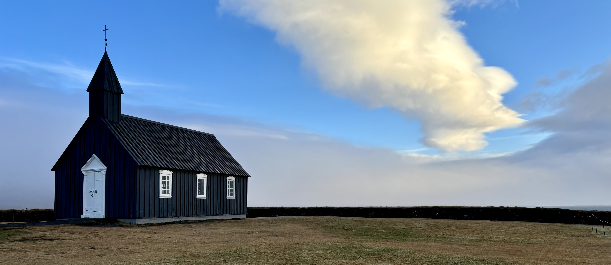
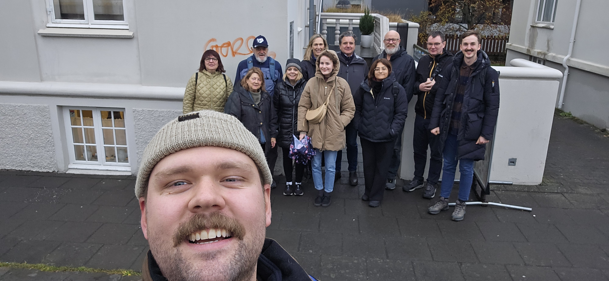
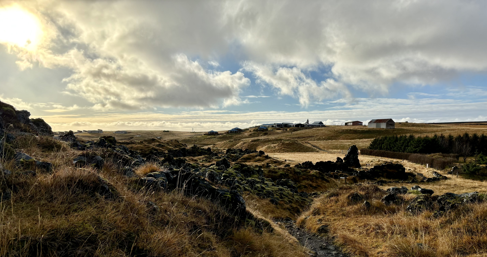
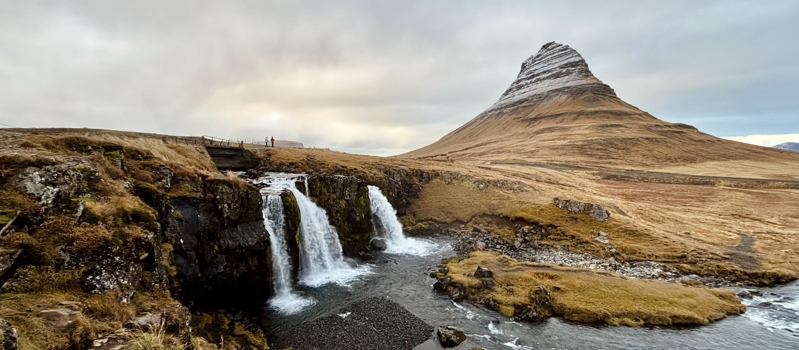
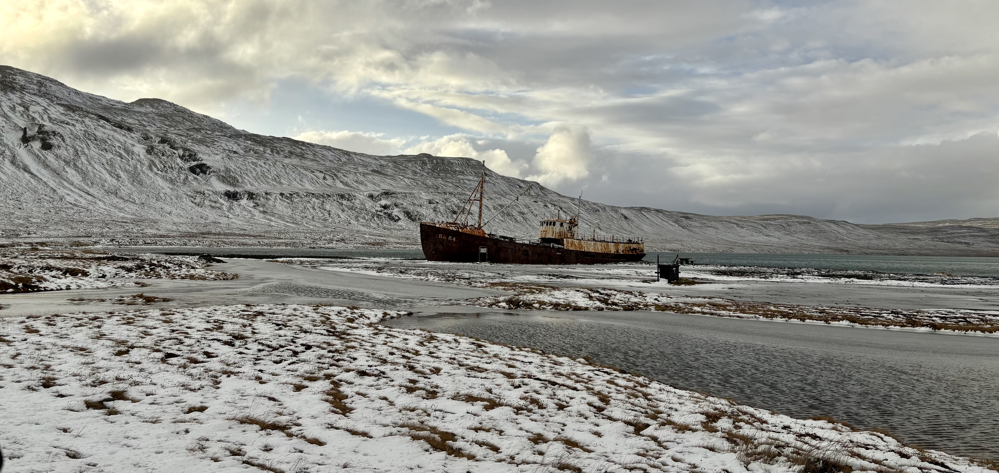
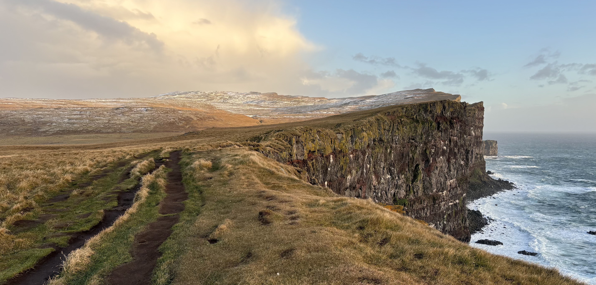
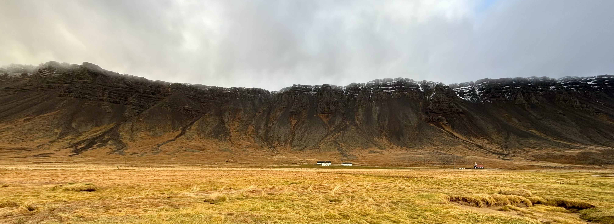
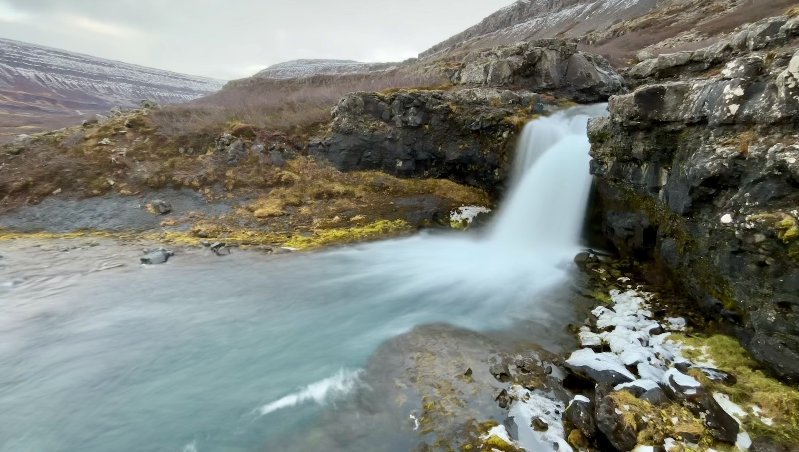
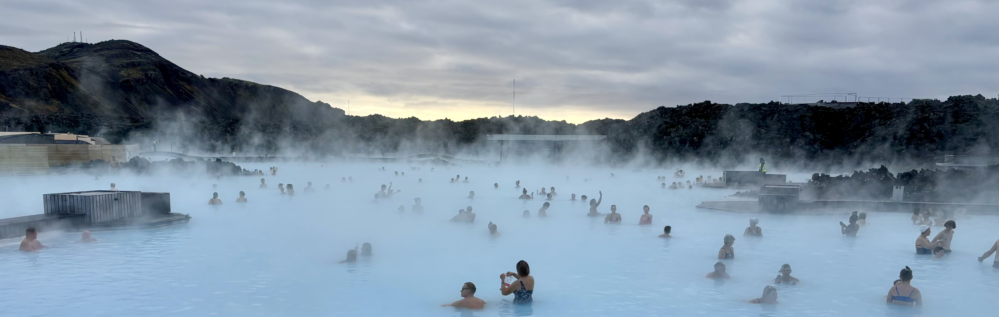

 

Myslím si, že jsem ten typ cestovatele, kterému se líbí skoro všude. Před každou cestou si zjišťuju,
co by se dalo v dané destinaci vidět, na místě mě dokáže nadchnout každá blbost a když nepočítám
pár výjimek, po skončení cesty si vždy říkám, že by mi vůbec nevadilo se do dané země přestěhovat,
nebo ji minimálně navštívit znovu. Nicméně tyto krásné představy vždy skončí jen u planých slov
a nikdy nejsou přetaveny v činy. Když totiž přijde na lámání chleba, přepadne mě pocit, že je
na světě ještě tolik krásných míst, kde jsem doposud nebyl, že je ztráta času jezdit někam dvakrát.
A tak to je. Nutno ale dodat, že dnes už s výjimkou [Islandu](https://cs.wikipedia.org/wiki/Island)!

Ten měl po našem prvním návratu domů kolem sebe takovou zvláštní auru. Nebo mám raději říct "auroru"?
Ne, teď vážně. Polární záře "svítí" na našem bucket listu už hodně dlouho
a [Island](https://cs.wikipedia.org/wiki/Island) je podle mnoha
zdrojů jedním z ideálních míst na světě, kde lze tento přírodní úkaz pozorovat. Když se tím pádem
objevila akce od [Wizz Air](https://wizzair.com/cs-cz) na levné letenky na konec října, kdy je
zároveň ideální čas na pozorování polární záře, nebylo moc co řešit.

 

#### DEN 0

Protože naše letadlo odlétalo z [Vídně](https://cs.wikipedia.org/wiki/V%C3%ADde%C5%88) až
v 10 hodin večer, měli jsme celý den to se na cestu připravit. Dost mě proto naštvalo, když jsem
si v autě uvědomil, že jsem doma zapomněl zbytek chleba, který si tím pádem v době naší
nepřítomnosti nabarví vlasy na zeleno.

Na letišti už jsem na chleba nemyslel. Relativně rychle jsme prošli bezpečnostní kontrolou, dali
si naprosto příšernou pizzu v jedné z letištních restaurací a krátce před 10. hodinou už jsme seděli
v letadle.

Cca 4,5 hodiny dlouhý let jsem prospal. A byl jsem za to opravdu rád!

Po příletu jsme si chtěli vyzvednout objednané auto z autopůjčovny
[Wheego](https://www.wheego-mobility.com/en)! Přestože její název mi nejdříve připadal jako dobrý
vtip, smát jsem se přestal, když jsme prošli celé letiště, ale žádnou autopůjčovnu
[Wheego](https://www.wheego-mobility.com/en) jsme nenašli. Bylo krátce po půlnoci a na druhé kolo
po letišti jsem neměl náladu. Zašel jsem proto do Avizu, abych se paní u přepážky zeptal, zda by nám
pomohla. Ta nám řekla, že pokud pobočku nemůžeme najít, potom na letišti není. Hm, rada za všechny
prachy! V takových případech prý zaměstnanci autopůjčoven čekají na klienty v odletové hale a potom
je shuttle busem zavezou na pobočku. A měla pravdu! V příletové hale na nás už čekal pán, který
vypadal dost jako seveřan a taky moc nemluvil. A když už něco řekl, tak jsem mu vůbec nerozumněl,
protože hrozně šeptal. Nějak mi ale sdělil, že ještě musíme počkat na další cestující a za 10 minut
vyjedeme směr autopůjčovna. Volnou chvíli jsme proto využili tím, že jsme si zašli na záchod. Když
jsme se vrátili a pán nás viděl, řekl ostatním 4 cestujícím, že můžeme vyrazit. V tom jeden ze skupinky
zařval na celou odletovou halu: "Už jsou tady!" Super, typičtí Češi, kteří se v zahraničí chovají
jako naprostí dementi, pomyslel jsem si. A bylo to přesně tak. Do minibusu s námi nastoupili
dva muži a dvě ženy ve středních letech. Jedna z nich za celou dobu nezavřela hubu. Nakonec to byla
ale docela čurina, protože mluvila trošku jako ožralá. Zakoktávala se, házela hodně špatný vtípky
a svého muže oslovovala "táto". Táta jen seděl a mlčel. Po chvilce jsem paní přestal poslouchat,
a tak mi uniklo, že
[se na Island přestěhovala Markéta Irglová](https://www.stream.cz/super-cz/marketa-irglova-popsala-svuj-zivot-na-islandu-64553237).
To jste věděli? Myslím, že Alice by to věděla určitě!

V autopůjčovně nám pán předal auto a poté nám ještě vysvětlil, kde je sever, jih, východ a západ.
Ptal jsem se ho totiž na to, zda si máme cestou na sever dávat na něco pozor. Když se mě zeptal,
kam přesně na sever jedeme a já mu odpověděl, že míříme
na [západní fjordy](https://cs.wikipedia.org/wiki/Vestfir%C3%B0ir), ukázal mi mapu
a řekl, že [západní fjordy](https://cs.wikipedia.org/wiki/Vestfir%C3%B0ir) jsou na západu,
potom ukázal na opačnou stranu ostrova a řekl, že tam
je východ. A když už do té mrtvoly kopnul jednou, rozhodl se kopnout i podruhé a potřetí a ukázal
mi i to, kde je sever a jih. Potom se konečně dostal k odpovědi na moji otázku. Na tu mi řekl,
že cesty na [západních fjordech](https://cs.wikipedia.org/wiki/Vestfir%C3%B0ir) patří k těm
nejhorším na ostrově. Máme si tedy dávat velký pozor. Když viděl naše vyděšené výrazy, snažil
se nás uklidnit tím, že pokud nebudeme dělat hlouposti a budeme dodržovat rychlostní limity,
myslí si, že budeme OK. To "hodně" pomohlo!

Z autopůjčovny jsme jeli rovnou na hotel, ubytovali se a kolem 2. hodiny ranní se konečně dostali
do postele.

 

#### DEN 1

Po hotelové snídani jsme sedli do auta a vyrazili směr
[Reykjavík](https://cs.wikipedia.org/wiki/Reykjav%C3%ADk), kde nás čekaly dvě věci: nákupy
a food walk.

Cesta z [Keflavíku](https://cs.wikipedia.org/wiki/Keflav%C3%ADk) zabrala necelou hodinu.
Auto jsme zaparkovali v podzemních garážích
[koncertní síně Harpa](https://en.wikipedia.org/wiki/Harpa_(concert_hall)) a chystali se
vyrazit na nákupy oblečení z ovčí vlny. Nakonec se ale žádné nákupy
nekonaly. K našemu překvapení jsme totiž zjistili, že naší
[Dacii Duster](https://cs.wikipedia.org/wiki/Dacia_Duster), pro kterou by bylo vhodnější
spíše přízvisko "Ruster", nejdou zamykat zadní dveře. Chvíli jsme se pokoušeli vyřešit problém sami,
ale když se nám nepodařilo dveře uzamknout pomocí dálkového ovládání, starým dobrým otočením klíčku
ve dveřích, ani zamčením auta zevnitř, zvedl jsem telefon a rozhodl se poprosit o pomoc autopůjčovnu.
Telefon mi zvedl pán, který jako přítel na telefonu naprosto selhal. Nejdřív se mi snažil pomoct,
ale žádná z jeho rad dveře nezamčela. Následně mi řekl, že on by byl v klidu. Podle něj se
na [Islandu](https://cs.wikipedia.org/wiki/Island) nekrade a on sám auto nikde nezamyká.
V odlehlých částech ostrova, kde lišky dávají dobrou noc, bych se s tím spokojil. V hlavní městě,
kde se nachází hromada lidí a my máme v autě dva pracovní počítače, mi to ale jako dobrý nápad
neznělo. Proto pán nakonec nabídl, že když mu nasdílím itinerář naší
cesty po [Islandu](https://cs.wikipedia.org/wiki/Island), během následujících dní k nám pošle
technika, který se na auto podívá. Itinerář jsem mu obratem poslal na email, ale "suprise,
suprise", auto viděl technik až ve chvíli, kdy jsme ho za týden vraceli.

Stáli jsme tedy u nezamčeného auta v podzemních garážích, uvnitř jsme měli všechny věci a za pár
desítek minut jsme se měli sejít s průvodcem na food walk. Protože se nám nechtělo brát s sebou
všechny věci, rozhodli jsme se nechat v autě oblečení a náhradní boty a s sebou do batohu si
sbalit pouze cennosti.

Kolem 12:30 začal food walk. Prakticky se jednalo o hodně krátkou procházku
po [Reykjavíku](https://cs.wikipedia.org/wiki/Reykjav%C3%ADk), při které nám průvodce Ari řekl
něco málo o kultuře, lidech... no a hlavně nás vzal do následujících podniků, ve kterých na nás
čekala malá porce jednoho vybraného jídla!

[**Pekárna Baka Baka**](https://www.bakabaka.is/)

K údivu nás všech jsme naši tour začali dezertem. V budově první islandské
pekárny se totiž podávaly palačinky se zakysanou smetanou a marmeládou. Na pití jsme si mohli dát
kávu nebo čaj. Když jsme do podniku přišli, bylo už po půl jedné a já měl hlad. I proto jsem tam
docela rychle poslal dvě palačinky a rázem mi přišlo, že jsem docela nasycenej. V tu chvíli jsem
se trošku začal bát, jak tu food tour zvládnu. Ostatní jedlíci se ale evidentně nemohli dočkat
dalších podniků. I proto průvodce Ari náhle zahlásil odchod a ani nenechal americkou důchodkyni
Madeline sedící vedle nás dojíst její druhou palačinku.

[**Food truck Bajarins Beztu Pylsur**](https://bbp.is/)

Následovala zastávka u food trucku, jehož název v překladu znamená "nejlepší hot dog ve městě".
A není se co divit, že Ari zařadil na seznam míst i stánek, který stojí v centru hlavního města
už od roku 1937. Hot dog je totiž na [Islandu](https://cs.wikipedia.org/wiki/Island) považován
za národní jídlo. A ten, který si můžete ve slavném trucku koupit, se od klasického hot dogu liší
v tom, že na spodu housky je nasypaná čerstvá i smažená cibulka, na ní je položený párek z jehněčího
masa a hot dog je po celé své délce přelitý hořčicí a nasládlou omáčkou. Naše skupina ale hot dog
neochutnala. Když jsme totiž dorazili na místo, u food trucku byla obrovská fronta a náš průvodce
rozhodl, že raději půjdeme do další restaurace, kde jsme měli udělanou rezervaci. Abychom o zážitek
ale nepřišli, dostali jsme od něj poukázku na hot dog, kterou jsme s Klárou využili po skončení celé
tour.

[**Restaurace Solon**](https://www.solon.is/en/)

Po zklamání ze skutečnosti, že jsme neochutnali párek v rohlíku, jsme si měli spravit chuť ve fine
dinigové restauraci Solon v srdci [Reykjavíku](https://cs.wikipedia.org/wiki/Reykjav%C3%ADk).
Prostředí vypadalo moc pěkně, ale chuť jsme si tedy úplně nespravili. Před obědem se totiž podávalo
fermentované žraločí maso [hákarl](https://cs.wikipedia.org/wiki/H%C3%A1karl). Pochoutka se vyrábí
z masa žraloků, kteří nevylučují moč. Ta se jim dostává do krve, a tak je jejich
čerstvé maso pro člověka jedovaté. Aby se dalo jíst, maso se nechává pod velkým vykvasit. Tím se
zasjistí, že močovina z masa vyteče. Po procesu kvašení se maso zavěsí do průvanu a několik týdnů
se suší. Tento proces přípravy sice vyloučí pro člověka jedovaté látky, ale pach a výrazná chuť už
v mase zůstanou. Říká se, že aby si člověk [hákarl](https://cs.wikipedia.org/wiki/H%C3%A1karl)
řádně vychutnal, musí do maličkého kousku masa alespoň pětkrát kousnout. Já jsem se na tuto
pochoutku opravdu hodně těšil a říkal jsem si, že mě určitě žádný žralok nezlomí. I proto jsem se
rozhodl kousat maso o něco déle. Po chvíli se mi ale v ústech rozlila opravdu hodně nepříjemná
chuť, a tak jsem žraloka spolknul a následně jej zapil typickou kmínovou pálenkou, která se
k rybě obvykle servíruje. Ta mi naštěstí z pusy vypláchla všechny ty žraločí chcánky, a tak jsem
byl připraven na servírování hlavního chodu. Jednalo se o jehnečí steak s bramborovou kaší
a glazovanou brokolicí. Ten byl narozdíl od žraloka naprosto vynikající!

[**Restaurace Sjávargrillid**](https://sjavargrillid.is/)

Tento podnik se mi zprvu moc nelíbil. Zvenku na mě působil zvláštně
a když jsme navíc vešli dovnitř, rovnou jsme zamířili do temného podzemí, ve kterém jsme o sebe
společně s dalšími strávníky zakopávali kvůli nedostatku manévrovacího prostoru. Zvláště ve srovnání
s předchozí restaurací, ve které bylo plno světla a místa tolik, že bychom tam mohli tancovat,
na mě další podnik nepůsobil zrovna nejlépe. Původní zdání ale v tomto případě hodně klamalo,
protože jídlo tam podávali výtečné! Konkrétně se jednalo o tacos se smaženým humrem, česnekovou
majonézou, trochou nakládané červené cibule, špenátem, datlovým pyré a parmazánem.

[**Kavárna Hannesarholt**](https://visitreykjavik.is/service/hannesarholt)

Naši food walk jsme zakončili v noblesní
[kavárně Hannesarholt](https://visitreykjavik.is/service/hannesarholt), kde jsme
si dali kávu a typický rebarborový koláč se zakysanou smetanou. Prostory domu, ve kterém žil
před více než 100 lety první islandský ministr
[Hannes Hafstein](https://en.wikipedia.org/wiki/Hannes_Hafstein), se mi hrozně moc líbily! Naprosto
narovinu ale nemohu říct, že bych je tam nějak moc obdivoval. V kavárně jsme si totiž povídali
s naší spřátelenou rodinou z [USA](https://cs.wikipedia.org/wiki/Spojen%C3%A9_st%C3%A1ty_americk%C3%A9).
Jednalo se o paní Deborah, jejího manžela Johna a dceru, jejíž jméno jsem zapomněl. Rodina se
k naší skupině přidala až po návštěvě [pekárny Baka Baka](https://www.bakabaka.is/), kam nestihli
přijet, protože se jim - stejně jako nám - pokazilo auto z půjčovny. Potom už jsme ale ochutnávali
jídla vždy spolu. A řekl bych, že i když jídlo bylo skvělé a ve většině podniků se mi moc líbilo,
tuhle sociální stránku food walku jsem si užil ze všeho nejvíce. 😊

 

*Náš průvodce Ari a zbytek naší skupinky před 
[kavárnou Hannesarholt](https://visitreykjavik.is/service/hannesarholt).*

*Vedle Kláry nalevo se nachází americká sekce naší výpravy. Pán v modré kšiltovce nalevo se jmenuje
Bruno. Žije v [LA](https://cs.wikipedia.org/wiki/Los_Angeles), je v důchodu, cestuje po světě
a utrácí peníze, které za celý život vydělal. Za Klárou vykukuje paní Deborah a její manžel John.
Lidé, se kterými jsme felili nejvíce, bydlí v [New Orleans](https://cs.wikipedia.org/wiki/New_Orleans).
Pan John je ale původem Brit. Jejich dcera na fotce chybí. Vedle Kláry napravo stojí paní
z [Palestiny](https://cs.wikipedia.org/wiki/Palestina). Ta zmínila, že měla velké štěstí,
že se na [Island](https://cs.wikipedia.org/wiki/Island) v této době vůbec dostala. S dvojicí
Britů stojících vedle mě jsme se prakticky nebavili.*

 

Když jsme po skončení food walku řekli zbytku skupiny "goodbye", vydali jsme se na nákup. V oblíbené
prodejně [The Handknitting Association of Iceland](https://handknitted.is/) si Klára pořídila nový
vlněný svetr a já jsem si koupil pár vlněných rukavic. Později na našem tripu se ukázalo, že to
bylo jedno z nejlepších rozhodnutí v mém životě. Po nákupech jsme se zašli podívat do ikonického
kostela [Hallgrímskirkja](https://cs.wikipedia.org/wiki/Hallgr%C3%ADmskirkja),
bez kterého by návštěva [Reykjavíku](https://cs.wikipedia.org/wiki/Reykjav%C3%ADk) nebyla kompletní!
A protože nám káva v poslední kavárně tolik nechutnala, zastavili jsme se ještě v naší oblíbené
kavárně [Reykjavík Roasters](https://reykjavikroasters.is/), kde jsme minulý rok dostali zdarma
pár kusů sladkého pečiva, protože bylo těsně před zavíračkou!

Tentokrát jsme sice žádné pečivo nedostali, ale i kdyby nám jej někdo nabízel, asi bychom odmítli.
Čekala nás totiž ještě zastávka u stánku z hot dogy, u kterého jsme využili poukázku z food walk.
Po brzké večeři jsme se už ale přesunuli k autu, které naštěstí v době naší nepřítomnosti nikdo
neukradl. Poplatek za parkování jsme zaplatili v super intuitivním automatu. Do něj pouze stačilo
zadat poznávací značku auta a automat sám vypočítal, jak dlouho jsme v garážích stáli a kolik máme
za parkování zaplatit! 🤯

Následoval asi 2 hodiny dlouhý přesun do našeho hotelu
na [poloostrově Snafellsnes](https://cs.wikipedia.org/wiki/Sn%C3%A6fellsnes), kde jsme se jen
ubytovali a šli si lehnout.

 

#### DEN 2

Druhý den na [Islandu](https://cs.wikipedia.org/wiki/Island) nás čekala prohlídka
[poloostrova Snafellsnes](https://cs.wikipedia.org/wiki/Sn%C3%A6fellsnes).

Po snídani jsme proto sedli do auta a o 10 minut později už stáli u fotogenického černého kostela
[Búdakirkja](https://www.budakirkja.is/). Venku sice bylo pěkně, ale začalo silně foukat, proto
jsme u kostela pouze udělali pár fotek a po chvilce zamířili do malé vesničky
[Arnarstapi](https://www.cestujlevne.com/pruvodce/island/arnarstapi). Tam vítr
ještě zesílil a navíc se k němu přidal i déšť. V průběhu naší hodinové procházky kolem pobřeží jsem
proto dost promznul. Na sobě jsem měl oblečenou zimní bundu, takže na tělo mi zase takové chladno
nebylo. Nejhůře na tom byly ale ruce, které trpěly i přesto, že jsem je zabalil do svých nových
rukavic, a obličej, který zase špatně zvládal bičování studené směsi deště a sněhu. Pokud by počasí
v [Arnarstapi](https://www.cestujlevne.com/pruvodce/island/arnarstapi) bylo o něco přívětivější,
věřím, že by se mi tam moc líbilo. Procházka po útesech pokrytých hustým zeleným kobercem totiž
nabízela nádherné výhledy na širé moře i na nejrůznější útvary vytvořené matkou přírodou z černých
čedičových skal. Za hodinu cesty kolem pobřeží jsme tím pádem viděli několik skalních mostů, zátok,
proláklin, nebo skalních výběžků.

Procházku po pobřeží jsme zakončili zastávkou na oběd.
V retro [restauraci Samkomuhúsid](https://www.tripadvisor.com/Restaurant_Review-g12873242-d12920347-Reviews-Samkomuhusid_in_Arnarstapi-Arnarstapi_West_Region.html)
jsem si dal jehněčí polévku a Klára ochutnala rybí směs s chlebem. Když jsme dojedli, přisedl si
k nám Klářin kolega Patrik a jeho přítelkyně Terka,
kteří na [Island](https://cs.wikipedia.org/wiki/Island) přijeli o několik dní před námi
a už stihli objet skoro celý ostrov. Abychom na ně u jídla jen nekoukali, objednali jsme si ještě
zákusek a kávu a poslechli si jejich zážitky z cest.

Po příjemně stráveném obědě jsme pokračovali v našem programu. Následovaly krátké zastávky na
[lávovém poli Hellnar](https://www.west.is/en/place/hellnar),
[útesech Lóndrangar](https://www.west.is/en/place/londrangar-basalt-cliffs),
[pláži Skardsvik](https://www.west.is/en/place/skardsvik)
a u [vodopádu Svodufoss](https://www.west.is/en/place/svodufoss). Naši tour
po [poloostrově Snafellsnes](https://cs.wikipedia.org/wiki/Sn%C3%A6fellsnes) jsme zakončili pravděpodobně
tím nejlepším, co nabízí, a to [horou Kirkjufell](https://cs.wikipedia.org/wiki/Kirkjufell), která
se často dostává na přední strany průvodců, jakožto jeden ze symbolů celého ostrova. Hora je
specifická svým umístěním, které zaručuje, že ji skoro ze všech stran oblopuje voda. Jednak totiž
stojí na výběžku do moře a jednak je na druhém konci výběžku ještě vodopád.
[Horu Kirkjufell](https://cs.wikipedia.org/wiki/Kirkjufell) také proslavil
[seriál Hra o trůny](https://cs.wikipedia.org/wiki/Hra_o_tr%C5%AFny_(seri%C3%A1l)).
V něm se hora s malým "h" několikrát ukázala ve "sněžných" scénách za zdí.

 

*[Lávové pole Hellnar](https://www.west.is/en/place/hellnar).*

 

*[Hora Kirkjufell](https://cs.wikipedia.org/wiki/Kirkjufell) a vodopád Kirkjufellfoss.*

 

Protože nám po dlouhém dni plném dobrodružství vyhládlo, sjeli jsme z parkoviště do vedlejší
vesnice hned na úpatí [hory Kirkjufell](https://cs.wikipedia.org/wiki/Kirkjufell) a zašli na večeři
do hodně průměrného podniku [Kaffi 59](https://www.facebook.com/kaffi59). Po jídle jsme nasedl
do auta a vydali se na cca 40 minut dlouhou cestu na hotel přes zasněžený horský průsmyk. Když už
jsme byli skoro doma a já jsem se radoval, že se nám podařilo cestu přes
hory projet ve zdraví, Klára si uvědomila, že si v restauraci zapomněla kabelku. V tu chvíli jsme si
zase já uvědomil, že horský průsmyk musíme projet ještě dvakrát, a navíc ve tmě. Nebylo mi
do smíchu, ale vše jsme zvládli. Za hodinu a půl jsme se vrátili na hotel a pomalu se začali
chystat na kutě.

 

#### DEN 3

Po snídani jsme si sbalili věci a vyrazili na 6 hodin dlouhou cestu autem na nejzápadnější bod
[Islandu](https://cs.wikipedia.org/wiki/Island),
[útes Látrabjarg](https://en.wikipedia.org/wiki/L%C3%A1trabjarg) nacházející se v oblasti
[západních fjordů](https://cs.wikipedia.org/wiki/Vestfir%C3%B0ir).

A přestože cesta to byla dlouhá, nemůžu říct, že bych se nudil. Krajina kolem nás se totiž pořád
měnila. Nejdříve hrozně moc pršelo. Přes hustý déšť toho nebylo moc vidět a drsná islandská příroda
o sobě dávala vědět i prostřednitvím větru, který nás děsil přes špatně doléhající dveře našeho auta.
Pršet přestalo, když jsme vjeli do hor ve vnitrozemí
[poloostrova Snafellsnes](https://cs.wikipedia.org/wiki/Sn%C3%A6fellsnes). Déšť a vítr vystřídaly
jiné nástrahy, a to špatné cesty. Rychlost jsem musel razantně snížit, a tak se začal prodlužovat
čas našeho dojezdu v navigaci. Když jsme se dostali k vodě, kolem cest pomalu začaly mizet domečky,
a nám tak začínalo být jasné, že se dostáváme do oblasti západních fjordů, oblasti s nejmenší
hustotou zalidnění na [Islandu](https://cs.wikipedia.org/wiki/Island). Krajina se hodně proměnila
a cestu začaly střídat úseky, ve kterých jsme vyjížděli do hor a potom z nich sjížděli
do malebných fjordů.

 

*Zastávka u [vraku lodi Gardar BA 64](https://www.atlasobscura.com/places/gardar-ba-64) na cestě
po [západních fjordech](https://cs.wikipedia.org/wiki/Vestfir%C3%B0ir).*

 

Posledních 20 kilometrů před naší cílovou stancí bylo za trest. Kamenitá cesta vedla podél vysokých
útesů padajících strmě do moře a kvalita cest mi připomínala to, co jsem před pár měsíci zažil
v [Namibii](https://cs.wikipedia.org/wiki/Namibie). Klára mi každou chvíli připomínala, abych jel
opatrně a já se jen modlil, aby se nám v opuštěné části ostrova nic nestalo. V blízkosti totiž
nebyl nikdo, kdo by nám pomohl. Když jsme dorazili
na [Látrabjarg](https://en.wikipedia.org/wiki/L%C3%A1trabjarg), foukalo tak, jak jsem ještě nikdy
nezažil. Cestou z parkoviště na útes jsem se místy opravdu bál, že nás oba odfoukne. V tu chvíli
jsem byl smířený s tím se otočit a jít zpět do auta. Nakonec jsme ale obtížnou pasáž výstupu
překonali a za odměnu jsme si mohli vychutnat nádherný výhled na vysoké černé útesy, které byly
blíže k nám pokryty hustou zelenou trávou a dále na kopci i mírnou vrstvou sněhu. Protože nám vyšlo
počasí a právě v tu chvíli nepršelo, mohli jsme se kochat i nádherným pohledem do divokého oceánu
a pozorovat, jak se vysoké vlny rozbíjejí o černé strmé skály. Byla to vážně nádhera!

 

*[Útesy Látrabjarg](https://en.wikipedia.org/wiki/L%C3%A1trabjarg).*

 

[Útesy Látrabjarg](https://en.wikipedia.org/wiki/L%C3%A1trabjarg) jsou také specifické tím,
že na nich hnízdí početné kolonie ptáků. Několik opeřenců jsem sice zahlédl, ale jednalo se spíše
o jednotky kusů. Po krátké procházce po útesech jsme nasedli zpět do auta a vyrazili do našeho hotelu.

Za necelou hodinu jsme už byli ubytovaní, ale i hladoví. Bohužel v našem fjordu s názvem
[Patreksfjordur](https://cs.wikipedia.org/wiki/Patreksfj%C3%B6r%C3%B0ur) nebyla otevřená žádná
restaurace. Byli jsme tak nuceni přejet do vedlejšího fjordu, kde jsme si zašli na večeři
do jediné otevřené restaurace v širém okolí. Kromě nás tam nebyl jediný turista, jen pár místních
štamgastů.

 

#### DEN 4

Po snídani jsme měli v plánu vyrazit na odlehlou pláž
[Raudisandur](https://guidetoiceland.is/travel-iceland/drive/raudasandur), která se nacházela jen
kousek od našeho hotelu. Když jsem si ale ráno pročítal informace o přístupu na pláž, zjistil jsem,
že příjezdová cesta má být v zimně uzavřená. Nebyla sice ještě zima, ale na horách už ležel sníh
a my věděli, že cesta k pláži vede přes hory. Při check-outu jsme se proto zeptali paní na recepci,
zda by nám mohla poradit. Ta otevřelu webovou stránku [road.is](https://www.road.is), na které se
nacházejí aktuální informace o stavu silnic na [Islandu](https://cs.wikipedia.org/wiki/Island),
a k naší smůle konstatovala, že u té naší silnice zrovna žádné informace nejsou. Paní ale řekla,
že cesta by v této části roku měla být ještě průjezdná, a tak jsme s Klárou sedli do auta a jeli
to zjistit.

Sice jsme jeli jako posraní, ale nakonec jsme dojeli. A odměnou nám byla procházka po jedné
z nejhezčích pláží na [Islandu](https://cs.wikipedia.org/wiki/Island), která se od těch ostatních
liší tím, že není tvořena černým lávovým pískem. Pláž je jasně ohraničena vysokými skalisky.
Na ně navazuje široký lán husté zelené trávy a ten následně pomalu přechází v načervenalý písek.
Odtud také pochází jméno pláže. [Raudisandur](https://guidetoiceland.is/travel-iceland/drive/raudasandur)
totiž v překladu znamená "rudé písky". Na 9 km dlouhé pláži jsme byli úplně sami. Nejdříve jsme si
udělali několik fotek místního černého kostela, podívali se na hřbitov a poté se prošli
po travnaté pláni, která postupně přecházela v rudý písek.

 

*Pohled na černé skály ohraničující pláž [Raudisandur](https://guidetoiceland.is/travel-iceland/drive/raudasandur).*

 

Když jsme se té nádhery nabažili, vydali jsme se na oběd. Plánování jídla
na [západních fjordech](https://cs.wikipedia.org/wiki/Vestfir%C3%B0ir) je ale mimo sezónu náročné,
protože mnoho podniků má otevřeno jen v létě a obchody otevírají relativně pozdě. Ve vesničce
[Bíldudalur](https://en.wikipedia.org/wiki/B%C3%ADldudalur) se nicméně nachází podnik s názvem
[Vegamot](https://www.westfjords.is/en/service/vegamot), který má podle místních otevřeno vždycky.
O další zastávce tedy bylo rozhodnuto. Já si objednal pečeného lososa s grilovanou zeleninou,
Klára fish and chips a oběma nám moc chutnalo! Přijemným překvapením bylo i to, že v restauraci
pracovali pouze dva lidé, jedna číšnice a jeden kuchař, a oba byli z Česka.

Naopak nepříjemným překvapením bylo, když jsme v restauraci zjistili, že silnice na naši další
zastávku, [vodopád Dynjandi](https://cs.wikipedia.org/wiki/Dynjandi), je uzavřená. Úsek bylo tedy
nutné objet po jiné silnici, což nám prodloužilo cestu o další hodinu. Osobně jsem měl pochybnosti,
zda nám to za tu štreku stojí. Když jsme ale k vodopádu přijeli, bylo mi jasné, že ano! Monumentální
vodopád totiž stéká po vysoké hoře dolů do vlastního fjordu, ve kterém kromě samotného vodopádu,
pěší cesty podél něj a parkoviště nic není. Auto jsme tedy zaparkovali dole u vody a vydali se
na krátký trek na nejvyšše položenou platformu. Z ní jsme si udělali několik fotek vodopádu,
pokochali se nádherným výhledem do okolí a poté spěchali zpět k autu, abychom nezatměli.

 

*Jedna z menších kaskád [vodopádu Dynjandi](https://cs.wikipedia.org/wiki/Dynjandi).*

 

To byla naše poslední zastávka v oblasti [západních fjordů](https://cs.wikipedia.org/wiki/Vestfir%C3%B0ir). Následovala 2,5 hodiny dlouhá rozlučková cesta na hotel, ze které jsme ale moc neměli, protože už
byla tma.

 

#### DEN 5

Věděli jsme, že jsme cesta ze [západních fjordů](https://cs.wikipedia.org/wiki/Vestfir%C3%B0ir)
zpět do [Keflavíku](https://cs.wikipedia.org/wiki/Keflav%C3%ADk) na letiště bude dlouhá.
I proto jsme část cesty ujeli den předem a zbytek si naplánovali na den s pořadovým číslem 5.

Abychom ale čas nestrávili jen na cestě, rozhodli jsme se odpoledne zavítat
do [Blue Lagoon](https://cs.wikipedia.org/wiki/Modr%C3%A1_laguna_(geoterm%C3%A1ln%C3%AD_l%C3%A1zn%C4%9B)),
geotermálních lázní a jednoho z nejnavštěvovanějších míst na [Islandu](https://cs.wikipedia.org/wiki/Island). 
Tyrkysově modrá voda ve venkovních bazéncích má standardně příjemnou teplotu kolem 39 stupňů,
takže lázně lze navštívit v jakémkoliv ročním období. Specifické navíc je, že voda pocházející
z hlubinného vrtu nejdřív zamíří do nedaleké tepelné elektrárny, kde proteče tepelným výměníkem
a až poté se dostane
do [Blue Lagoon](https://cs.wikipedia.org/wiki/Modr%C3%A1_laguna_(geoterm%C3%A1ln%C3%AD_l%C3%A1zn%C4%9B)).
Voda tedy plní dva účely: pomáhá zajíšťovat teplo pro okolní vesnice a slouží turistům v termálních lázní.

Slavné lázně jsme se chystali navštívit už minulý rok. Tenhdy jsme se ale rozhodli pozdě a když jsme
chtěli vstupenky koupit, byly už všechny vyprodané. I proto jsme tento rok nenechali nic náhodě
a vstupenky koupili už dva měsíce před odletem. Od nákupu nás sice trošku zrazovala vysoká cena,
ale nakonec jsme se rozhodli 2 tisíce korun obětovat
a [Blue Lagoon](https://cs.wikipedia.org/wiki/Modr%C3%A1_laguna_(geoterm%C3%A1ln%C3%AD_l%C3%A1zn%C4%9B))
si odškrtnout ze seznamu. A nakonec to byl velice pěkný zážitek! Už při sjezdu z dálnice bylo vidět,
že se dostáváme do oblasti se silnou geotermální aktivitou. Všude kolem nové příjezdové ležela
ztvrdlá láva a zpod asfaltu, po kterém jsme jeli, se kouřilo. Možná si vzpomenete, že na jaře
tohoto roku [vybuchla sopka kousek od Grindavíku](https://www.novinky.cz/clanek/zahranicni-evropa-na-islandu-opet-vybuchla-sopka-lavove-fontany-vystreluji-do-50-metru-40474022),
vesnice, která se nachází jen pár kilometrů od [Blue Lagoon](https://cs.wikipedia.org/wiki/Modr%C3%A1_laguna_(geoterm%C3%A1ln%C3%AD_l%C3%A1zn%C4%9B)).

Po příjezdu do lázní jsme na recepci dostali župan. Oblečení jsme si nechali v šatnách a přes sprchy
se dostali ke vstupu do venkovní části. Po sprše mi byla docela zima a vyjít ven do nějakých
5 stupňů jsem se docela bál. Teplá voda nás ale rychla zahřála, a tak jsme se rozsáhlým venkovním
bazénem procházeli sem a tam snad 45 minut. Když už jsme byli dost vyhřátí, dali jsme si kávu a džus
v místním baru a poté jsme se do vody vrátili. Při druhém čvachtání jsem si nechal dát na obličej
dvě pleťové masky. Zda mi to nějak pomohlo zlepšit pleť, nevím. Asi ne.

 

*Návštěvu [Blue Lagoon](https://cs.wikipedia.org/wiki/Modr%C3%A1_laguna_(geoterm%C3%A1ln%C3%AD_l%C3%A1zn%C4%9B))
nakonec hodnotím velice kladně. Myslím, že jako relaxační zastávka po náročné dovolené jsou lázně
naprosto perfektní!*

 

Z [Blue Lagoon](https://cs.wikipedia.org/wiki/Modr%C3%A1_laguna_(geoterm%C3%A1ln%C3%AD_l%C3%A1zn%C4%9B))
jsme zamířili na hotel v [Keflavíku](https://cs.wikipedia.org/wiki/Keflav%C3%ADk). Tam jsme si jen
nechali věci a potom se přesunuli do [Reykjavíku](https://cs.wikipedia.org/wiki/Reykjav%C3%ADk)
na večeři. Navštívili jsme skvěle hodnocenou mexickou restauraci
[La Poblana](https://www.dineout.is/lapoblana), kde jsem měl nejlepší nachos ve svém životě
a velmi chutné vegetariánské burrito. Říkali jsme si, že se nám ještě nechce na hotel, a tak jsme
po večeři zastavili ještě na zákusek v nedaleké Library Cafe, kavárně, která vypadá jako knihovna.
To ale byla chyba.

V průběhu večera jsme totiž zjistili, že by v okolí
[Reykjavíku](https://cs.wikipedia.org/wiki/Reykjav%C3%ADk) měla být vidět polární záře.
Snažili jsme se ji spatřit každý den naší dovolené, ale kvůli špatnému počasí se nám to nedařilo.
Podle předpovědi jsme si mysleli, že se nám to nepoštěstí ani poslední den. Když jsme ale zjistili,
že kousek od nás by měla být vidět, rychle jsme zaplatili, sedli do auta a snažili se dostat ven
z města, kde by byl menší světelný smog. Než jsme se však dostali na vhodnější místo, už bylo pozdě.
Obloha se mezitím opět začala zatahovat, a tak jsme viděli jen slabou verzi naší vysněné aurory.
Zpětně jsem si trochu vyčítal, že jsem buď mohl častěji sledovat předpověď, která se během dne
hodně měnila, nebo že jsme mohli zůstat večer v [Reykjavíku](https://cs.wikipedia.org/wiki/Reykjav%C3%ADk)
a spokojit se s nějakým méně osvětleným místem, místo abychom se snažili rychle vyjet z města
a najít perfektní místo v úplné tmě. Bohužel teď už s tím nic nenaděláme. Snad příště, poučeni
z předchozích nezdarů, budeme úspěšnější!

 

#### DEN 6

Po snídani jsme úspěšně vrátili auto v autopůjčovně a poté se přesunuli na letiště. Tam jsme se
potkali s Patrikem a Terkou a společně si vyměnili zážitky z předchozích dní.

Před 11. hodinou jsme nastoupili do letadla. Následoval poklidný 4hodinový let
do [Vídně](https://cs.wikipedia.org/wiki/V%C3%ADde%C5%88). Cestou jsme si dali lehký oběd v podobě
oschlého krocana se sýrem a já začal psát článek na blog.

Ve [Vídni](https://cs.wikipedia.org/wiki/V%C3%ADde%C5%88) v příletové hale jsme se úplnou náhodou
potkali s Adamem, Bertem a Medikem, kteří se právě vrátili z prodlouženého víkendu
v [Litvě](https://cs.wikipedia.org/wiki/Litva). Moc dlouho jsme ale nepofelili. Gentlemani
potřebovali stihnout svého [Geparda](https://www.gepard.com/) a my se těšili na našeho
[Jaguara](https://cs.wikipedia.org/wiki/Jaguar_Cars). Navíc jsme slíbili
Patrikovi a Terce, že je svezeme do Brna a nechtěli jsme je nechat čekat.

Přestože [Vídeň](https://cs.wikipedia.org/wiki/V%C3%ADde%C5%88) byla neuvěřitelně zasekaná,
cesta rychle utekla a kolem 19:30 jsme už byli doma.

 

#### DOJMY Z ISLANDU

**Strach o život.** Jsem známý strašpytel. Bojím se všeho, bojím se často a obzvlášť se bojím
na silnicích. Tentokrát to byl ale extrém. A to z několika důvodů. 🙀

1. Naše auto bylo křáp. Nemělo tempomat, ani automatickou převodovku. Navíc první den přestalo
fungovat rádio a druhý den odešlo zamykání zadních dveří. 🚙
2. Nebezpečné cesty. Už při vyzvedávání auta v půjčovně nám pán říkal, že cesty v oblasti
[západních fjordů](https://cs.wikipedia.org/wiki/Vestfir%C3%B0ir) patří k těm nejhorším na ostrově.
Upozorňoval nás zejména na náhlé změny povrchů při přejíždění horizontů, kdy jedna část kopce je
osvětlená sluníčkem a tím pádem suchá, zatímco druhá strana kopce, nacházející se ve stínu,
může být pokrytá ledem. Musím uznat, že tohle sice bylo děsivé, ale ještě děsivější mi přišla
samota a naprosté odloučení od civilizace. Často se totiž stávalo, že jsme jeli hodinu nebo dvě
a potkali jsme jedno auto. Někdy ani to. V úsecích, kde nikomu nic nehrozí, by mi to nevadilo.
Když ale člověk projíždí podél strmých srázů, nebo přes horské průsmyky pokryté hlubokým sněhem,
kde kontrolka ABS bliká v kuse jako splašená, myšlenka na to, že se mi něco stane a nikdo mi tam
nepomůže, mě děsila opravdu hodně. 🗻
3. Sebevrazi jedoucí v protisměru. ☠️
    - Nejdřív jsme potkali jednoho na kruhovém objezdu. Když jsem vjížděl na objezd, nikde nebylo
    ani živáčka. Pouze ve zpětném zrcátku jsem viděl, že za mnou jedou dvě auta. Na objezdu jsem se
    soustředil na to, abych vyjel třetím výjezdem ven. Když jsem se ale blížil k výjezdu, zjistil
    jsem, že ti blázni jedoucí za mnou střihli kruhový objezd do protisměru, tím pádem mě na něm
    předjeli a vyjeli z něj přede mnou tím stejným výjezdem. Mazané. Ale nebezpečné.
    - Druhý sebevrah byl ještě horší. Kousek od [Keflavíku](https://cs.wikipedia.org/wiki/Keflav%C3%ADk)
    byl úsek, na kterém se jednotlivé jízdní pruhy v opračných směrech rozpojily, protože je
    oddělovala nějaká strážní věž, která už evidentně nebyla v provozu. Bylo to hodně neobvyklé,
    ale bylo to tak. Můj jízdní pruh prakticky nikam neuhýbal a věž obkížděl jen mírně. Nicméně pruh
    v protisměru se kolem věže obtáčel hodně ostře, takže bylo nutné před tímto úsekem razantně
    zpomalit. Muž jedoucí v protisměru ale neměl v plánu zpomalovat, a tak šlápl na plyn, vjel
    do našeho směru a prosvištěl kolem věže v plné rychlosti. My jsme naštěsí nejeli tak rychle,
    takže jsem před věží stihl zabrdit a protijedoucí auto nechal projet. Bylo to ale tak těsné,
    že jsme se z toho vzpamatovávali ještě několik dalších minut.

**Je libo hákarl? Děkuji, nedám si.** Ochutnávka fermentovaného žraloka byla jedna z věcí, na kterou
jsem se v rámci food walk těšil nejvíce. Chtěl jsem zase jednou vystoupit ze své komfortní zóny
a vyzkoušet si pokrm, který všichni recenzenti tolik odsuzují. Vždycky jsem si myslel, že přehánějí.
Neočekával jsem sice nějakou velkou chuťovku, ale ani jsem nečekal nic zase tak strašného. Nakonec
to ale docela strašné bylo, a tak musím narovinu říct, že příště bych vynechal. 🦈

**Žijí na Islandu Islanďané?** Vzpomínám si, že když jsme se vraceli
z [Islandu](https://cs.wikipedia.org/wiki/Island) minulý rok, byl jsem hodně zklamaný z toho, že
jsme za celou dobu našeho pobytu nepřišli do kontaktu s mnoha místními. Ve službách jsme tehdy
potkávali lidi z různých koutů [Evropy](https://cs.wikipedia.org/wiki/Evropa), ale Islanďany moc ne.
To se tentokrát změnilo. Přišlo mi, že čím dál na sever jsme jeli, tím to bylo lepší. Výjimka
potvrzující pravidlo byla pouze restaurace [Vegamot](https://www.westfjords.is/en/service/vegamot),
nejseverněji položená námi navštívená restaurace, ve které pracoval mladý český pár. 🇨🇿

**Aurora.** Byla jedním z hlavních důvodů, proč jsme se na [Island](https://cs.wikipedia.org/wiki/Island)
vrátili. Bohužel jsme neměli úplně štěstí na počasí a poslední den jsme si špatně naplánovali,
takže jsme viděli jen takového chudáčka. Osobně nemohu říct, že bychom si polární záři splnili.
Na mém bucket listu tedy pořád "svítí" a já jen doufám, že příště budeme mít větší štěstí. ✨

**Větřím. Větříš. Větříme.** Před odjezdem jsem věděl, že má
na [Islandu](https://cs.wikipedia.org/wiki/Island) pršet a teploty se mají pohybovat někde kolem
nuly. A i když mi bylo jasné, že chodit v dešti nebude žádná čurina, zase tak
velký respekt jsem z počasí neměl. Možná to bylo tím, že jsem měl před odjezdem jiné starosti, možná
to bylo ale i tím, že jsem byl psychicky nastavený na to, že si nebudu hrát na hrdinu a na cestu si
sbalím to nejteplejší oblečení, co mám. A myslím, že pokud by nefoukalo, byl bych úplně v pohodě.
Ten vítr byl ale masakr! Po hodinové procházce podél pobřeží
v [Arnarstapi](https://www.cestujlevne.com/pruvodce/island/arnarstapi) jsem měl ošlehaný obličej
hůř, než kdybych celý den škvařil sádlo; na [útesech Látrabjarg](https://en.wikipedia.org/wiki/L%C3%A1trabjarg)
jsem myslel, že nás vítr odfounkne do moře; a pokaždé, když jsem otvíral dveře od auta, jsem si
vzpomněl na to, že pokud nám je vichr ulomí, budu to muset zaplatit.
Na [Islandu](https://cs.wikipedia.org/wiki/Island) vás totiž proti této nepříjemnosti nikdo
nepojistí. A to právě proto, o jak častý jev se jedná! 💨

**Příroda drsná. Příroda nádherná!** Přestože jsem v tomto článku několikrát zmínil, že z přírodních
živlů na [Islandu](https://cs.wikipedia.org/wiki/Island) šel často strach, musím naopak podtrhnout,
že tamnější příroda má také druhou tvář. A ta je naprosto dechberoucí! Myslím, že mi to úplně
nedocházelo u zastávek, na kterých jsme se právě potkali s autobusem asijských turistů. Nejvíce
jsem si to uvědomoval, když jsme projížděli kolem nějaké bezvýznamné hory, nebo jsme z té bezvýznamné
hory sjížděli dolů k desátému fjordu, který vypadal úplně stejně jako těch předchozích devět,
a nebo jsme jen na tu horu vyjeli a tam kromě sněhu a nás nebylo vůbec nic. Ale i přesto, že
se nejednalo o slavná místa z turistických průvodců, na kterých zastavují masy, já si i tak řekl,
že je tam nádherně! A najednou jsem dostal nutkání zastavit, vystoupit z auta a udělat si fotku,
která by mi už vždycky připomínala ten moment a to místo... a možná proto jsme taky vždycky někam
jeli sedm hodin, i když podle Googlu to mělo zabrat pět. 😁

**Stává se z Islandu srdcovka?** Asi jo. Přestože moje nutkání
se na [Island](https://cs.wikipedia.org/wiki/Island) vrátit není už tak velké jako minulý rok,
rozhodně by mi nevadilo ještě jednu cestu absolvovat a po jihu a západu navštívit
ještě sever a východ. Přestože se jedná o malou zemi, nabízí toho hrozně moc. Člověk ani nemusí
každý den udělat 5 zastávek a jít na 3 treky, ale bohatě stačí pouze projíždět krajinou a jen
obdivovat, jak se každou chvíli mění před očima. 🙏

 

#### FOTKY

Fotky z naší druhé cesty na [Island](https://cs.wikipedia.org/wiki/Island)
najdete [zde](https://photos.app.goo.gl/yq7wP7xeVKctyJUEA).
