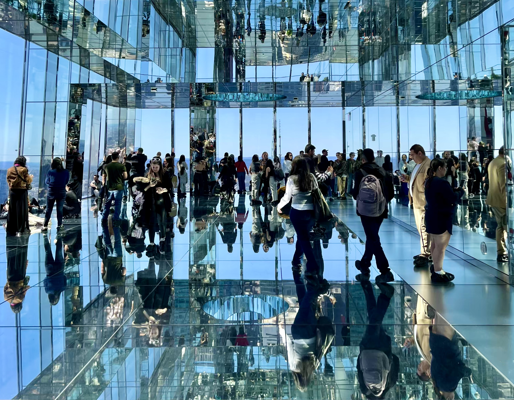
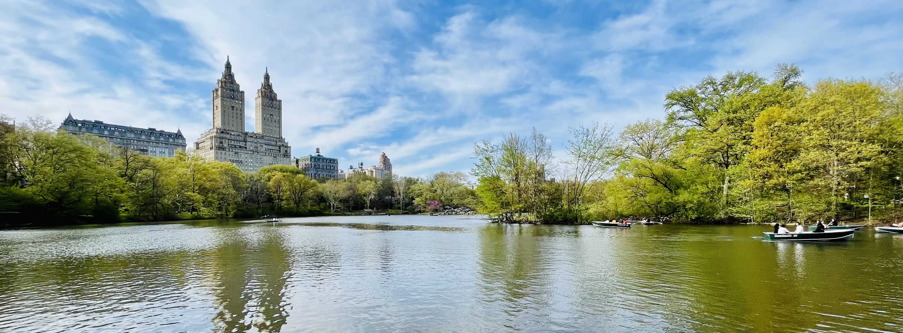
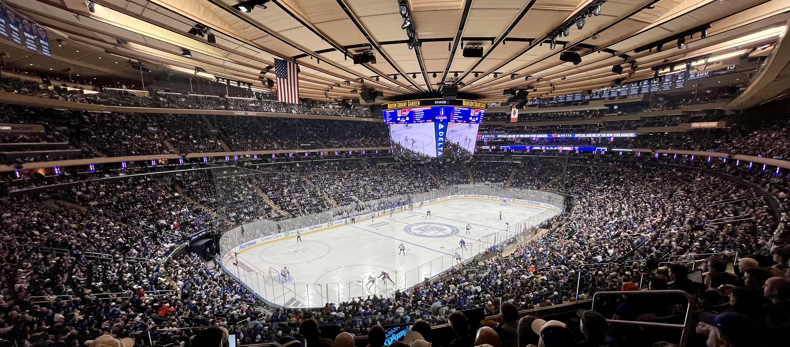
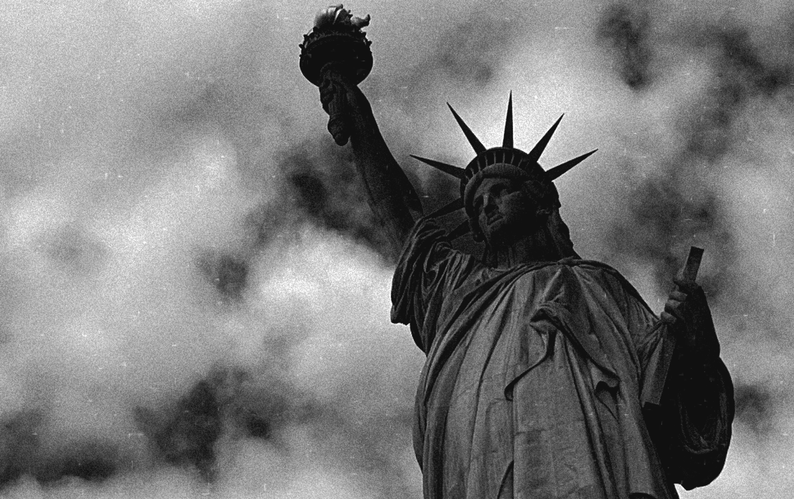
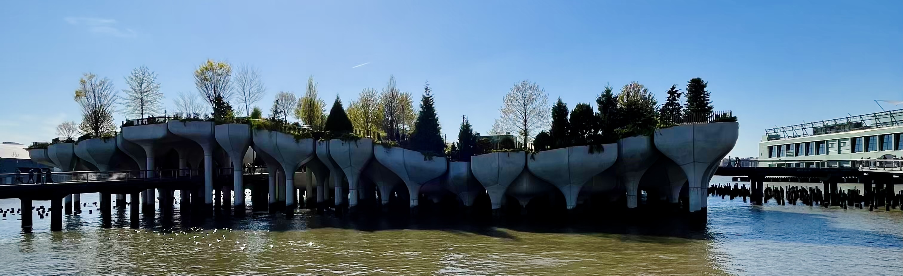
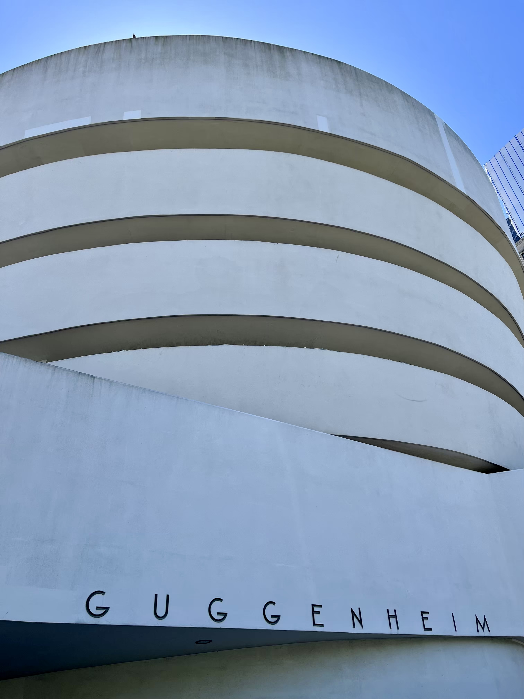

 

[New York](https://cs.wikipedia.org/wiki/New_York) (dále jen NYC) se u nás doma skloňoval už dlouho.
Klára tam chtěla jet, já moc ne, a tak jsme udělali kompromis a jeli jsme.

Já jsem si říkal, že pokud tam pojedeme, naplánuju to na termín, kdy se bude v NYC hrát hokej.
Zápas [NHL](https://cs.wikipedia.org/wiki/National_Hockey_League) jsem sice už viděl, ale jednalo
se pouze o utkání v rámci
[Global Series v Praze v roce 2022](https://www.nhl.com/cs/news/global-series-2022-v-praze-333220482),
navíc mezi [Nashvillem](https://en.wikipedia.org/wiki/Nashville_Predators)
a [San Jose](https://en.wikipedia.org/wiki/San_Jose_Sharks), což jsou pro mě dost neatraktivní týmy.
Letenky jsem proto koupil na termín, ve kterém se mělo hrát první kolo play-off. Už nějakou dobu
bylo jasné, že [NY Rangers](https://en.wikipedia.org/wiki/New_York_Rangers) se do play-off
kvalifikují. Dlouho se ale rozhodovalo o jejich soupeři pro první kolo. O druhou divokou kartu ve
východní konferenci se totiž praly hned čtyři týmy, a tak až do poslední chvíle nebylo jasné, zda
se proti [Rangers](https://en.wikipedia.org/wiki/New_York_Rangers) postaví
[Philadelphia Flyers](https://en.wikipedia.org/wiki/Philadelphia_Flyers),
[Pittsburgh Pinguins](https://en.wikipedia.org/wiki/Pittsburgh_Penguins),
[Detroit Red Wings](https://en.wikipedia.org/wiki/Detroit_Red_Wings), nebo
[Washington Capitals](https://en.wikipedia.org/wiki/Washington_Capitals). Nakonec se rozhodlo
v posledním kole, ve kterém [Washington](https://en.wikipedia.org/wiki/Washington_Capitals)
porazili [Philadelphii](https://en.wikipedia.org/wiki/Philadelphia_Flyers) kuriózním gólem
do prázdné brány za stavu 1:1. Stalo se tak z toho důvodu, že
[Flyers](https://en.wikipedia.org/wiki/Philadelphia_Flyers) potřebovali vyhrát v základní hrací
době, aby měli reálnou šanci se dostat do play-off. To se ale nestalo. Vyhrál
[Washington](https://en.wikipedia.org/wiki/Washington_Capitals), a tak jsem se krátce před odjezdem
začal těšit na to, že v [Madison Square Garden](https://en.wikipedia.org/wiki/Madison_Square_Garden)
uvidíme partu kolem hokejové legendy
[Alexandra Ovechkina](https://en.wikipedia.org/wiki/Alexander_Ovechkin).

 

#### DEN 0

Byla neděle a letadlo do [NYC](https://cs.wikipedia.org/wiki/New_York) nám odlétalo v 17 hodin
z [Vídně](https://en.wikipedia.org/wiki/Vienna). Ráno jsem proto v klidu vstal, nasnídal se a šel
na mši do kostela. Když jsem se vrátil, dobalil jsem si věci a kolem 11. hodiny jsme vyrazili
na cestu.

Na oběd jsme se zastavili v [McDonald's](https://en.wikipedia.org/wiki/McDonald%27s)
u [Mistelbachu](https://en.wikipedia.org/wiki/Mistelbach). Když jsme byli malí,
do [Mistelbachu](https://en.wikipedia.org/wiki/Mistelbach) jsme jezdili relativně často. Tento
[McDonald's](https://en.wikipedia.org/wiki/McDonald%27s) ani cestu k němu jsem ale vůbec nepoznával.
Na letiště jsme dorazili kolem 13:30 a chvíli řešili, zda si můžeme vzít Klářin kufr s sebou
do letadla. I když nám přišla výzva od letecké společnosti, abychom si jej nechali zdarma odbavit,
nakonec jsme to riskli a kufr neodbavili. Poté jsme prošli bezpečnostní kontrolou, kde mi zabavili
kapesní nožík. Docela mě to překvapilo, protože se jednalo o předmět, který se mnou už pár cest
absolvoval. Stejně jsem ho ale vůbec nepoužíval, takže mě to zase tolik nemrzelo.

V 17 hodin jsme odletěli do [NYC](https://cs.wikipedia.org/wiki/New_York). Let trval cca 9 hodin.
Polovinu času jsem prospal a nějakou dobu jsem se díval na filmy. Na
[JFK](https://en.wikipedia.org/wiki/John_F._Kennedy_International_Airport) jsme dorazili
kolem 20. hodiny místního času. Než jsme se ale dostali ke stojánce a než na nás přišla řada
na pasové kontrole, uplynuly další dvě hodiny. Po relativně pohodovém pokecu s imigračním úředníkem
jsme nasedli do taxíku a přesunuli se
do [našeho hotelu](https://www.booking.com/hotel/us/springhill-suites-by-marriott-new-york-manhattan-chelsea.en-gb.html)
na [Manhattanu](https://en.wikipedia.org/wiki/Manhattan). A lokalita to nebylo vůbec špatná!
Podle mě by se dalo říct, že "na americké poměry" jsme prakticky sousedili
s [Empire State Building](https://en.wikipedia.org/wiki/Empire_State_Building). Dalším příjemným
překvapením pro nás bylo, když nám paní recepční oznámila, že nám zdarma udělala upgrade pokoje
do posledního 46. patra!

Cestou nahoru vydával výtah divné zvuky, které mě trošku znervózňovaly. Když jsme ale otevřely
dveře našeho pokoje a já uviděl osvětlený [NYC](https://cs.wikipedia.org/wiki/New_York), na děsivý
výtah jsem hned zapomněl a jen si úžíval dechberoucí výhled! WOW! 🙀

 

#### DEN 1

Z výhledu na osvětlený [NYC](https://cs.wikipedia.org/wiki/New_York) jsem byl v noci naprosto
unešený. Další překvapení ale přišlo ráno. Až za světla jsem totiž zjistil, co všechno je vlastně
vidět. Nejenom, že se nám ukazovala nejvyšší budova ve městě,
[World Trade Center](https://cs.wikipedia.org/wiki/One_World_Trade_Center), ale zároveň bylo možné
spatřit i [Sochu Svobody](https://cs.wikipedia.org/wiki/Socha_Svobody),
[řeku Hudson](https://cs.wikipedia.org/wiki/Hudson_(%C5%99eka)), nebo břehy
[New Jersey](https://cs.wikipedia.org/wiki/New_Jersey).

 

*Výhled z našeho hotelu v [NYC](https://cs.wikipedia.org/wiki/New_York).*

 

Když jsem se nabažil výhledem na město, šli jsme na snídani. Ta bohužel představovala konzum ve své
nejryzejší podobě. V malé jídelně se na sebe teplilo asi milion lidí. Největší horko bylo
u toustovačů. Všichni si totiž chtěli opéct svůj průmyslově zpracovaný bagel, který bylo nutné
nejdříve tepelně zpracovat, než se jej dalo vložit do úst. Kromě návštěvníků se v jídelně pohybovala
ještě skupinka obtloustlých žen černé pleti. Ty sbíraly ze stolů hromady plastových obalů a zbytků
jídla, které tam po sobě bílí turisté nechali, a všechno házely do jednoho odpadkového koše. Při
pohledu na ten bordel mi bylo líto servírek i toho množství vyhozeného jídla. O snidani bych mohl
ještě pár odstavců napsat, ale myslím, že to není potřeba. Všichni už pravděpodobně pochopili, že
snídaně v [NYC](https://cs.wikipedia.org/wiki/New_York) nepatřila k mým oblíbeným částem dne. 😾

Jak jsem psal výše, prakticky jsme sousedili
s [Empire State Building](https://en.wikipedia.org/wiki/Empire_State_Building). Náš program jsme
proto chtěli zahájit tam. Bohužel jsme zjistili, že lístky na daný den jsou vyprodané, a tak jsme si
u automatu koupili lístky na druhý den a pokračovali po 5th Avenue na sever. Cestou jsme se
zastavili v budově [NY Public Library](https://cs.wikipedia.org/wiki/New_York_Public_Library), která
se často dostává do
[seznamů nejkrásnějších knihoven světa](https://www.architecturaldigest.com/gallery/most-beautiful-libraries-in-the-world).
Jejím hlavním lákadlem je nádherná studovna Rose Main Reading Room ve druhém patře budovy. Knihovna
je ale obrovská a nabízí mnohem víc než jen to! Už jen toulat se po širokých chodbách, kde to vypadá
jako na zámku, je totiž zážitek.

Z knihovny jsme si odskočili
na [Grand Central Terminal](https://cs.wikipedia.org/wiki/Grand_Central_Terminal), kde jsme si
udělali pár fotek známé hlavní haly a ikonických zlatých hodin sedících na informačním stánku.
A protože hned vedle nádraží stojí výšková budova
[One Vanderbilt](https://cs.wikipedia.org/wiki/One_Vanderbilt), která se pyšní jednou z nejlepších
vyhlídek na město, po krátkém obědě bylo o naší další zastávce rozhodnuto.
[One Vanderbilt](https://cs.wikipedia.org/wiki/One_Vanderbilt) nabízí opravdu hodně unikátní
zážitek. V 91. patře 4. nejvyšší budovy v [NYC](https://cs.wikipedia.org/wiki/New_York) se totiž
nachází zrcadlová místnost. Díky zrcadlům na stěnách návštěvník vidí výhled na město, i když se dívá
do zdi, a díky zrcadlům na stropě a na podlaze se zase ztrácí vnímání toho, kolik má prostor pater
a ve kterém patře se návštěvník právě nachází. Nic podobného jsem ještě asi nezažil, ale musím říct,
že se mi to moc líbilo! Jedinou nevýhodou byla skutečnost, že se od zrcadel odrážel silný sluneční
svit a často člověka nepříjemně oslňoval. I proto se u vstupu na vyhlídku rozdávaly sluneční brýle,
které bylo nutné po skončení prohlídky vrátit.

 

*Zrcadlová místnost na vyhlídce [One Vanderbilt](https://cs.wikipedia.org/wiki/One_Vanderbilt).*

 

Kromě zrcadlové místnosti se ve [One Vanderbilt](https://cs.wikipedia.org/wiki/One_Vanderbilt)
nachází ještě jedna menší zrcadlová místnost s obrovskými nafukovacími balony. Asi si dokážete
představit, jak to tam vypadá - mnoho balonů leží na zemi, některé líně poletují vzduchem
a návštěvníci mezi nimi procházejí a marně se snaží, aby jich moc neprasklo. Hlavně pro děti to byl
ale hodně těžký úkol. Když jsem do místnosti vešel, chvíli jsem si připadal jako na dětském hřišti.
Byl tam hrozný povyk. Pod nohama se mi pletly nejen nafukovací balony, ale i malí špunti, kteří byli
ve svém živlu. Chvíli jsem se snažil krotit, ale po chvíli jsem atmosféře místa podlehl a začal
jsem po Kláře házet nafukovací balony stejně jako malí špunti. A byla to čurina! Každou chvíli
se ozvala rána, jak něco prasklo. Na chvíli se všichni lekli. Když ale zjistili, že to praskl jen
balonek a ne žádná kost, povyk se zase obnovil. 😹

Po krátké zastávce na kávu jsme pokračovali dál po 5th Avenue. Dalším bodem programu byla
[Katedrála sv. Patrika](https://cs.wikipedia.org/wiki/Katedr%C3%A1la_svat%C3%A9ho_Patrika_(New_York)),
největší novogotická katedrála v severní Americe a zároveň první novogotická katedrála
ve [Spojených státech](https://cs.wikipedia.org/wiki/Spojen%C3%A9_st%C3%A1ty_americk%C3%A9).
Hned naproti ní se nachází [Rockefeller Center](https://cs.wikipedia.org/wiki/Rockefeller_Center).
Jedná se o komplex 19 obchodních budov, které na ploše 22 akrů postavila rodina Rockefellerů
ve 30. letech minulého století.
Součástí [Rockefeller Center](https://cs.wikipedia.org/wiki/Rockefeller_Center) je i náměstí
[Lower Plaza](https://en.wikipedia.org/wiki/Rockefeller_Center#Lower_Plaza). To se velice často
objevuje v amerických vánočních filmech. Každý rok v zimě se totiž na náměstí nachází obrovský
vánoční strom a kluziště, kam chodí Newyorčané bruslit. Další významnou částí
[Rockefeller Center](https://cs.wikipedia.org/wiki/Rockefeller_Center)
je i vyhlídka [Top of the Rock](https://en.wikipedia.org/wiki/30_Rockefeller_Plaza#Observation_deck).
Přestože budova nepatří k těm nejvyšším v okolí, vyhlídka z ní se často uvádí jako jedna
z nejlepších v [NYC](https://cs.wikipedia.org/wiki/New_York). Díky své poloze je z ní totiž dobře
vidět na [Empire State Building](https://en.wikipedia.org/wiki/Empire_State_Building)
i na [Central Park](https://cs.wikipedia.org/wiki/Central_Park).

Kousek od [Rockefeller Center](https://cs.wikipedia.org/wiki/Rockefeller_Center)
jsem objevil obchod s retro fotbalovými dresy, kde jsme strávili více času, než jsem původně čekal.
V obchodě jsem se dostal do svého živlu. Když jsem navíc objevil dres
[Chelsea](https://cs.wikipedia.org/wiki/Chelsea_FC) se jménem
[Roberta Di Mattea](https://cs.wikipedia.org/wiki/Roberto_Di_Matteo), nějakou dobu jsem přemýšlel
o koupi svého prvního suvenýru. Velkou finanční investici do kusu špinavého polyesteru jsem si ale
nakonec rozmyslel, a tak jsme pokračovali dál v poznávání města, konkrétně
na [Times Square](https://cs.wikipedia.org/wiki/Times_Square). Na chvíli jsme se zastavili
na velkých červených schodech a jen nasávali atmosféru rušného místa. Podle mě má náměstí svoje
jedinečné čaro a upřímně jsem si myslel, že to zapůsobí i na Kláru. Bohužel se tak nestalo.

Po příchodu na hotel jsem zapnul televizi a sledoval zápas
[NHL](https://cs.wikipedia.org/wiki/National_Hockey_League), z čehož se stala velice pěkná tradice
celého našeho pobytu!

 

#### DEN 2

Po snídani jsme vyrazili na prohlídku
[Empire State Building](https://en.wikipedia.org/wiki/Empire_State_Building), jedné
z nejikoničtějších budov [NYC](https://cs.wikipedia.org/wiki/New_York). Tento mrakodrap navržený
ve [stylu art deco](https://cs.wikipedia.org/wiki/Art_deco) měří uctihodných 381 m a po svém
dokončení v roce 1931 se stal nejvyšší budovou světa. Titul držel dlouhých 40 let, než jej
v roce 1971 přerostla
["dvojčata" World Trade Center](https://cs.wikipedia.org/wiki/Sv%C4%9Btov%C3%A9_obchodn%C3%AD_centrum),
vzdálená pouze 5 km od [Empire State Building](https://en.wikipedia.org/wiki/Empire_State_Building).

Nejen tyto "fun facts" ale i mnoho dalších je možné se dozvědět přímo v budově. Prohlídka mrakodrapu
totiž začíná v několika místnostech, které jsou věnovány zajímavostem
o [Empire State Building](https://en.wikipedia.org/wiki/Empire_State_Building) a její historii.
Až když návštěvník projde tuto povinnou sekci, dostanete se k výtahu, který
jej vyveze do 86. patra. Tam se nachází venkovní terasa s jedinou 360° open-air vyhlídkou ve městě.
Když se návštěvník nabaží pohledem na okolní budovy, může se ještě nechat vyvézt do 102. patra.
Kromě toho, že 102. patro je výš než to 86. patro, rozdíl je ještě v tom, že tato vyhlídka už není
open-air. Člověk se na město dívá z relativně malé kruhové místnosti s obrovskými okny od podlahy až
ke stropu, ze kterých je město vidět mnohem lépe než zpoza vysokých zídek v 86. patře. Do 102. patra
je navíc možné se dostat pouze za příplatek, takže tam nejezdí mnoho lidí a na kochání se New Yorkem
je tím pádem mnohem větší klid. 👍

Po obědě v [Taco Bell](https://en.wikipedia.org/wiki/Taco_Bell) jsme se šli podívat
do [MoMA](https://cs.wikipedia.org/wiki/Muzeum_modern%C3%ADho_um%C4%9Bn%C3%AD), neboli muzea
moderního umění! V galerii se kromě děl
od [Dalího](https://cs.wikipedia.org/wiki/Salvador_Dal%C3%AD),
[van Gogha](https://cs.wikipedia.org/wiki/Vincent_van_Gogh),
[Warhola](https://cs.wikipedia.org/wiki/Andy_Warhol),
nebo [Picassa](https://cs.wikipedia.org/wiki/Pablo_Picasso) nachází
i bizarní umělecké instalace, které pro mě osobně představují definici moderního umění. Možná to tak
nezní, ale mně přijde galerie naprosto úžasná! Kromě vystavovaných děl je totiž zajímavá
i samotná budova, která působí velice minimalistickým dojmem a tím pádem neodvádí pozornost
od vystavovaných děl. Moc se mi líbí i nádvoří budovy. Na něm si můžete dát kávu,
natáhnout se na lehátko a užít si chvilku klidu na místě, které se nachází uprostřed rušného
[Manhattanu](https://en.wikipedia.org/wiki/Manhattan). Návštěvu
[MoMA](https://cs.wikipedia.org/wiki/Muzeum_modern%C3%ADho_um%C4%9Bn%C3%AD) bych tedy doporučil
všem, nejen milovníkům moderního umění!

Kousek od galerie [MoMA](https://cs.wikipedia.org/wiki/Muzeum_modern%C3%ADho_um%C4%9Bn%C3%AD)
na 7th Avenue stojí slavná koncertní síň [Carnegie Hall](https://cs.wikipedia.org/wiki/Carnegie_Hall).
Ta byla v době naší návštěvy pod lešením, takže jsme z ní moc neviděli.
Po [Carnegie Hall](https://cs.wikipedia.org/wiki/Carnegie_Hall) jsme měli v plánu průzkum
[Central Parku](https://cs.wikipedia.org/wiki/Central_Park). V půjčovně kol jsme si proto půjčili
dvě polorozpadlé plečky a vyrazili na vyjížďku. Nejdříve jsme se projeli po hlavní cestě až k
[The MET](https://cs.wikipedia.org/wiki/Metropolitn%C3%AD_muzeum_um%C4%9Bn%C3%AD), neboli
Metropolitnímu muzeu umění a potom jsme se úzkými cestičkami vraceli zpět. Postupně jsme
se zastavili u [folly](https://cs.wikipedia.org/wiki/Folly) s názvem
[Balvedere castle](https://www.centralparknyc.org/locations/belvedere-castle),
[slavné terasy Bethesda](https://www.centralparknyc.org/locations/bethesda-terrace),
[stejnojmenné fontány](https://www.centralparknyc.org/locations/bethesda-fountain),
[mostu Bow Bridge](https://www.centralparknyc.org/locations/bow-bridge)
a [památníku Johna Lennona](https://www.centralparknyc.org/locations/strawberry-fields).
I když jsme se toho na začátku bál, myslím si, že půjčení kol byl nakonec dobrý nápad. Pokud bychom
chtěli park projít pěšky, trvalo by nám to věcnost. Takto jsme si půjčili kola na dvě hodiny
a i když jsme jeli hodně pomalu a na některých místech jsme museli dokonce kola tlačit, dvě hodiny
bohatě nám to stačilo, abychom z parku viděli všechno, co jsme chtěli. Navíc si myslím, že to byla
docela zábava. Doteď se třeba s Klárou smějeme tomu, jak jsme jeli po hlavní cestě úplně šnečím
tempem, všichni nás předjížděli a potom na Kláru začal někdo volat: "Why are you so slow?" 😹

 

*[Jezero The Lake](https://www.centralpark.com/things-to-do/attractions/lake/)
a [budova The San Remo](https://the-sanremo.com/).*

 

Když jsme vrátili kola, nasedli jsme na metro a přesunuli
se do [Madison Square Garden](https://cs.wikipedia.org/wiki/Madison_Square_Garden)
(dále jen MSG), kde nás čekal vrchol našeho pobytu! V 19 hodin totiž začínal zápas mezi
[NY Rangers](https://cs.wikipedia.org/wiki/New_York_Rangers)
a [Washingtonem Capitals](https://cs.wikipedia.org/wiki/Washington_Capitals). Vidět zápas
[NHL](https://cs.wikipedia.org/wiki/National_Hockey_League) naživo byl můj celoživotní sen.
Asi proto chápete, jak moc jsem se na zápas těšil. O zápasech play-off se navíc říká, že je na nich
úplně jiná atmosféra a když říkám *jiná*, myslím tím lepší. Nikdy taky nezapomenu, jak se můj
tatínek vrátil v roce 2013 z [Chicaga](https://cs.wikipedia.org/wiki/Chicago), kde navštívil rozhodující
[5. zápas konferenčního finále](https://www.livesport.cz/zapas/AFDtM2yo/#/prehled-zapasu/prehled-zapasu)
mezi [Chicagem Blackhawks](https://cs.wikipedia.org/wiki/Chicago_Blackhawks) a
[LA Kings](https://cs.wikipedia.org/wiki/Los_Angeles_Kings) a potom několikrát zopakoval, že se mu
to líbilo tak moc, že by zápas [NHL](https://cs.wikipedia.org/wiki/National_Hockey_League) ještě rád
někdy na vlastní oči viděl. Možná to nezní jako něco extra, ale tatínek nikdy nic moc nechválí,
takže když řekne něco takového, znamená to, že to muselo být něco!

Celý večer odstartovala světelná show, při které se promítaly sestavy týmů na led. Na hokej sice
moc často nechodím, ale ve [Werk Areně](https://cs.wikipedia.org/wiki/Werk_Arena_(2014)) jsem podle
mě nic podobného neviděl! Když se hráči seřadili na modré čáře, v rohu kluziště se rozmotal koberec
a na něm se po chvíli objevil zpěvák [John Brancy](https://en.wikipedia.org/wiki/John_Brancy), který
se chystal zazpívat americkou hymnu. Na fanoušcích kolem nás bylo v tu chvíli vidět obrovské nadšení.
Všichni pokřikovali "Come on, Johny!" nebo "Let's go, Johny!" Když Johny začal zpívat, přeběhla mi
po zádech husí kůže. Žádná hudba, jen jeho hlas a dalších 18 tisíc diváků projevujících respekt
ke své národní hymně. Nádhera!

 

*They say, there are no bad seats at
[Madison Square Garden](https://cs.wikipedia.org/wiki/Madison_Square_Garden).*

 

Zápas začal v relativně vysokém tempu. V první i druhé třetině padly tři góly, ve třetí třetině už
pouze hostující tým reguloval výsledek na konečných 4:3 pro domácí. Kromě hokeje se nám libil
i doprovodný program. V průběhu přerušení hry se často stávalo, že na audiovizuální kostce
nad ledem se začal promítat nějaký klip, ať z filmu, seriálu, nebo z nějakého sestřihu sportovního
utkání a následně kamera zabrala herce, nebo sportovce, sedícího mezi diváky
v [MSG](https://cs.wikipedia.org/wiki/Madison_Square_Garden), který v klipu
vystupoval. Takto nám byl v průběhu večera představen např.
[Liam Neeson](https://en.wikipedia.org/wiki/Liam_Neeson),
[John McEnroe](https://en.wikipedia.org/wiki/John_McEnroe),
[Christopher Meloni](https://en.wikipedia.org/wiki/Christopher_Meloni),
[Matthew Modine](https://en.wikipedia.org/wiki/Matthew_Modine),
nebo [Paul Wesley](https://en.wikipedia.org/wiki/Paul_Wesley).
Kromě představování slavných osobností obsahoval doprovodný program hokejové klasiky, jako jsou
karaoke, dance cam, nebo různé hry. Přestože se hokej často přerušoval, myslím, že se moderátorům
skvěle dařilo diváky bavit. Když jsme proto po třech hodinách odcházeli z haly, vůbec mi to nepřišlo
jako tři hodiny. Musím naopak říct, že jsem si celý večer neskutečně užil a když jsem večer usínal,
moc se mi to nedařilo. Musel jsem totiž pořád myslet na všechno, co jsme
v [MSG](https://cs.wikipedia.org/wiki/Madison_Square_Garden) zažili!

Tati, už ti naprosto rozumím. Zápas [NHL](https://cs.wikipedia.org/wiki/National_Hockey_League)
bych taky ještě rád někdy zažil na vlastní kůži!

 

#### DEN 3

Na třetí den jsme si naplánovali další symbol [NYC](https://cs.wikipedia.org/wiki/New_York),
a to [Sochu Svobody](https://cs.wikipedia.org/wiki/Socha_Svobody). Nasedli jsme proto na metro
a přesunuli se na jižní cíp [Manhattanu](https://en.wikipedia.org/wiki/Manhattan)
do [Battery Parku](https://cs.wikipedia.org/wiki/Battery_Park_City), odkud nám v 10 hodin odjížděla
loď na ostrov s názvem [Liberty Island](https://cs.wikipedia.org/wiki/Liberty_Island),
neboli "ostrov svobody". Ostrov je to maličký. Kolem dokola jej lze obejít
asi za 5 minut a kromě [Sochy Svobody](https://cs.wikipedia.org/wiki/Socha_Svobody),
jednoho [muzea věnovaného Soše Svobody](https://en.wikipedia.org/wiki/Statue_of_Liberty_Museum)
a obchodu s občerstvením na něm nic není. Pokud si tedy člověk nezaplatí vstup do koruny,
nebo si na ostrově nenajde nějakou jinou supr čupr aktivitku, což jsme my neudělali, je to tam
docela nůďo.

Na druhou stranu je ale nutné říct, že návštěva ostrova má nějakou myšlenku. Je totiž součástí
krátké cesty po stopách přistěhovalců. Když přistěhovalci přijížděli do Ameriky na přelomu 19. a 20.
století, nejdříve minuli [Sochu Svobody](https://cs.wikipedia.org/wiki/Socha_Svobody) a poté
pokračovali na [Ellis Island](https://cs.wikipedia.org/wiki/Ellis_Island), kde mezi lety 1892 a 1954
fungovala přistěhovalecká stanice. Velká cihlová budova už dnes ale neslouží lidem, kteří se chtějí
v [USA](https://cs.wikipedia.org/wiki/Spojen%C3%A9_st%C3%A1ty_americk%C3%A9) usadit.
Z bývalé stanice bylo vytvořeno muzeum imigrace, a tak se v něm zastavují už jen
turisté, kteří na [Ellis Island](https://cs.wikipedia.org/wiki/Ellis_Island) přijíždějí
v rámci "Statue of Liberty Tour" z [Liberty Islandu](https://cs.wikipedia.org/wiki/Liberty_Island).
Naprosto narovinu - než se člověk dostane
na [Liberty Island](https://cs.wikipedia.org/wiki/Liberty_Island), tam se podívá na jednu sochu,
potom se přepraví na [Ellis Island](https://cs.wikipedia.org/wiki/Ellis_Island), tam se podívá
do muzea, kde skoro nic není a potom se dostane zpět do civilizace, vezme to sice celé dopoledne,
ale nic extra zajímavého to není. Osobně bych tedy tento zážitek příště vynechal a spokojil
se s tím, že buď [Sochu Svobody](https://cs.wikipedia.org/wiki/Socha_Svobody) uvidím jen
z [Manhattanu](https://en.wikipedia.org/wiki/Manhattan), z vody při plavbě na nějaký jiný ostrov,
nebo ji neuvidím vůbec. Na druhou stranu mě to nemusí zase tolik mrzet, protože lístek na ferry
stál pouze 30 dolarů na osobu, což je v porovnání s ostatními vstupy skoro zadarmo.

 

*[Sochu Svobody](https://cs.wikipedia.org/wiki/Socha_Svobody) daroval francouzský lid obyvatelům
[Spojených států](https://cs.wikipedia.org/wiki/Spojen%C3%A9_st%C3%A1ty_americk%C3%A9). Navrhl
ji francouzský sochař
[Frédéric Auguste Bartholdi](https://cs.wikipedia.org/wiki/Fr%C3%A9d%C3%A9ric_Auguste_Bartholdi)
a její kovovou kostru zkonstruoval [Gustave Eiffel](https://cs.wikipedia.org/wiki/Gustave_Eiffel).
Ano, ten [pan Eiffel](https://cs.wikipedia.org/wiki/Gustave_Eiffel). Socha byla slavnostně
posvěcena 28. října 1886.*

 

Po rychlém obědě v libanonském fast foodu, kde jsme seděli jen my a zaměstnanci
z okolních firem, jsme se prošli po Financial districtu. Nejdříve jsme se zastavili
u [bronzové sochy býka](https://cs.wikipedia.org/wiki/Charging_Bull), která se velice rychle po své
instalaci v roce 1989 stala symbolem newyorského finančního centra. Hned o pár mětrů dál jsme
navštívili [kostel Nejsvětější trojice](https://cs.wikipedia.org/wiki/Trinity_Church_(New_York)).
Ten je nejstarším anglikánským kostelem na světě. Kolem něj ale nic starého nenajdete, takže mezi
železobetonovými výškovými budovami kostel působí, jako by tam vůbec nepatřil. Hned naproti
hlavních dveří do kostela začíná [Wall Street](https://cs.wikipedia.org/wiki/Wall_Street). Na ní
se mimo jiné nachází sídlo [americké burzy](https://cs.wikipedia.org/wiki/New_York_Stock_Exchange).

Z Wall Street jsme pokračovali dál po dolním [Manhattanu](https://en.wikipedia.org/wiki/Manhattan)
na [Ground zero](https://cs.wikipedia.org/wiki/Ground_zero), místo, které bylo 11. září 2001
zasaženo zhroucením budov Světového obchodního centra. Dnes se na místě nachází něoklik zajímavých
staveb. Tou první je The Oculus, extravagantní obchodní centrum a dopravní uzel v jednom, který
pochází z ruky španělského umělce
[Santiaga Calatravy](https://cs.wikipedia.org/wiki/Santiago_Calatrava). Sám architekt prohlásil,
že při návrhu budovy myslel na ptáka, který vylétává z rukou dítěte. Budova tak má reprezentovat
naději, či znovuzrození, což je pro dané místo více než příhodné.

Prakticky hned vedle nádraží se nachází
[národní pámátník 11. září](https://cs.wikipedia.org/wiki/N%C3%A1rodn%C3%AD_pam%C3%A1tn%C3%ADk_a_muzeum_11._z%C3%A1%C5%99%C3%AD),
který nese název "Odraz nepřítomnosti". Památník se skládá ze dvou čtvercoých nádrží, jejichž hrany
tvoří půdorys jednotlivých budov. Po obvodu se nachází deska se jmény všech 2 977 obětí, které
bombový útok nepřežily. Zespodu této desky vytéká voda a padá do hlubin nádrže, ve které není vidět
dno. Vzpomínám si, že když jsem se na místo dostal před 10 lety poprvé, byl to opravdu hodně silný
zážitek. Tentokrát tomu nebylo jinak.

Poslední zajímavou budovou, která se na místě neštěstí nachází, je
[nové Světové obchodní centrum](https://en.wikipedia.org/wiki/One_World_Trade_Center). Jak už bylo
řečeno výše, jedná se o nejvyšší budovu
v [NYC](https://cs.wikipedia.org/wiki/New_York), nejvyšší budovu na západní polokouli a v současné
době i [sedmou nejvyšší budovu světa](https://en.wikipedia.org/wiki/List_of_tallest_buildings).

Z [Ground zero](https://cs.wikipedia.org/wiki/Ground_zero) jsme si poté udělali procházku po
[Brooklynském mostě](https://cs.wikipedia.org/wiki/Brooklynsk%C3%BD_most) do
[Brooklynu](https://cs.wikipedia.org/wiki/Brooklyn) a tam jsme se nějakou dobu jen tak toulali.
Nejdříve po nádherném nábřeží  [Brooklyn Heights](https://en.wikipedia.org/wiki/Brooklyn_Heights)
a poté ve staré zástavbě typických cihlových domů, až jsme došli
k [budově Brooklynské radnice](https://en.wikipedia.org/wiki/Brooklyn_Borough_Hall). A když jsme
dostali hlad, navštívili jsme velice příjemnou [restauraci Clark's](https://clarksdiner.com/),
kde jsme si dali malou večeři.

Po jídle jsme se přesunuli na hotel a po náročném dni už jen odpočívali.

 

#### DEN 4

Čtvrtý den jsme věnovali hlavně místům, které chtěla vidět Klára. Přesouvali jsme se pouze pěšky,
a tak jsme za celý den nachodili skoro 14 km.

Z hotelu jsme vyrazili směrem na jih, prošli jsme
[Union Square](https://cs.wikipedia.org/wiki/Union_Square,_Manhattan) a dva bloky za ním jsme
udělali dlouhou zastávku v nejznámějším nezávislém knihkupectví
v [NYC](https://cs.wikipedia.org/wiki/New_York), které se jmenuje
[The Strand](https://en.wikipedia.org/wiki/Strand_Bookstore). Jejich slogan je "18 Miles Of Books",
což v překladu znamná "18 mil knih". Osobně jsem neměřil, zda těch knížek bylo na 18 mil, ale bylo
jich tam opravdu hodně. Mě osobně bavilo se jen tak toulat mezi vysokými starými regály, procházet
jednotlivé sekce a hledat v poličkách knižní klenoty. Jedním z nich byla třeba statistická bible
[The elements of statistical learning: data mining, inference, and prediction](https://hastie.su.domains/Papers/ESLII.pdf),
kterou jsem před šesti lety několikrát citoval ve svojí diplomové práci.

Protože knihkupectví bylo opravdu hodně velké a my se s Klárou rozdělili, aby se každý mohl jít
v klidu podívat na to, co ho zajímá, samozřejmě jsme se potom nemohli najít. Když jsme se ale po
nějaké době znovu shledali, pokračovali jsme
přes [Washington Square](https://en.wikipedia.org/wiki/Washington_Square_Park) na oběd do podniku
s názvem [Lafayette](https://www.lafayetteny.com/). Primárně jsme tam nešli kvůli obědu, ale
hlavně kvůli dezertům. Nejdříve jsme si proto dali hlavní chod a potom si vychutnali jejich
[typického šneka z listového těsta s polevou nahoře](https://www.instagram.com/reel/C6aGGDCuPma/).
To byla vážně pochoutka! 😋

Po obědě jsme navštívili klenotnictví, kde si Klára koupila několik šperků a potom jsme si dali
vynikající kávu v kavárně [Urban Backyard](https://www.urbanbackyardnyc.com/). Odpolední káva
v [NYC](https://cs.wikipedia.org/wiki/New_York) nám nikdy nechutnala,
tu v [Urban Backyard](https://www.urbanbackyardnyc.com/) jsme si ale užili! Konečně totiž nebyla
přepražená, bylo jí tak akorát, podávaly se k ní vynikající cupcaky a v kavárně samotné to vypadalo
moc pěkně!

Po kávě jsme si prošli [SoHo](https://en.wikipedia.org/wiki/SoHo,_Manhattan) a
[West Village](https://en.wikipedia.org/wiki/West_Village), až jsme dorazili k malému
[umělému ostrovu Little Island](https://cs.wikipedia.org/wiki/Little_Island_(New_York)). Na něm
se nachází park, několik dětských hřišť, vyhlídka a amfiteátr s celkovou kapacitou 687 míst.
Na ostrově, který byl otevřený teprve v roce 2021, se mi opravdu moc líbilo. Škoda jen, že jsme
se o něj museli dělit s hromadou dalších lidí.

 

*[Little Island](https://cs.wikipedia.org/wiki/Little_Island_(New_York)).*

 

A to stejné lze říct i o [High Line](https://cs.wikipedia.org/wiki/High_Line), visutém parku,
který začíná jen pár metrů od umělého ostrova. Od roku 1934 protínala západní
[Manhattan](https://en.wikipedia.org/wiki/Manhattan) 21 km dlouhá nadzemní dráha. Dnes už je
nadzemka kratší. Měří pouze 2,5 km, prochází jen čtvrtí
[Chelsea](https://en.wikipedia.org/wiki/Chelsea,_Manhattan) a místo vlaků se po ní prochází chodci.
Tento park, klikatící se mezi železobetonovými výškovými budovami, si mě získal už před 10 lety.
A ani tentokrát mě nezklamal!

Z [High Line](https://cs.wikipedia.org/wiki/High_Line) jsme zamířili do oficiálního obchodu
[NHL](https://cs.wikipedia.org/wiki/National_Hockey_League). Chtěl jsem si tam koupit kšiltovku
s logem [hokejového klubu LA Kings](https://cs.wikipedia.org/wiki/Los_Angeles_Kings), ale žádná
se mi tam nelíbila, a tak jsme asi po půl hodině marného hledání odešli s prázdnou. Tou dobou
už byl čas na další kulturní zážitek! Když Klára v práci řekla, že jedeme
do [NYC](https://cs.wikipedia.org/wiki/New_York), její kolegyně Lisa nám doporučila, abychom se
zašli podívat na nějaké představení
na [Broadwayi](https://en.wikipedia.org/wiki/Broadway_(Manhattan)). Z široké nabídky muzikálů
jsme nakonec vybrali [Lvího krále](https://en.wikipedia.org/wiki/The_Lion_King_(musical)), který
se hrál v [divadle Minskoff](https://en.wikipedia.org/wiki/Minskoff_Theatre). Přestože nejsem
fanoušek muzikálů a na představení jsem se vůbec netěšil, musím upřímně říct, že to byl opravdu
zážitek! Už chápu, proč nám Lisa představení
na [Broadwayi](https://en.wikipedia.org/wiki/Broadway_(Manhattan)) doporučila.

 

#### DEN 5

Pátý den našeho pobytu nás čekala muzea a výstavy!

Ráno jsme proto nasedli na metro a přesunuli se
ke [Guggenheimovu muzeu](https://cs.wikipedia.org/wiki/Guggenheimovo_muzeum), jedné z nejzmnámějších
galerií moderního umění na světě. Před 10 lety jsem muzeum navštívil a tehdy ve mě sbírka umění
nijak extra velký dojem nezanechala. Proto jsem se rozhodl, že tentokrát dovnitř nepůjdeme a vosí
hnízdo si vyfotíme pouze z ulice.

 

*[Guggenheimovo muzeum](https://cs.wikipedia.org/wiki/Guggenheimovo_muzeum) založila
nadace [Solomon R. Guggenheima](https://cs.wikipedia.org/wiki/Solomon_R._Guggenheim) v roce 1937.*

 

Od muzea jsme pokračovali podél [Central Parku](https://cs.wikipedia.org/wiki/Central_Park) na jih,
až jsme dorazili k muzeu [The MET](https://cs.wikipedia.org/wiki/Metropolitn%C3%AD_muzeum_um%C4%9Bn%C3%AD),
nejstaršímu a největšímu muzeu umění
ve [Spojených státech](https://cs.wikipedia.org/wiki/Spojen%C3%A9_st%C3%A1ty_americk%C3%A9).
A do něj už jsme se podívat šli. V muzeu se nachází bambilion sekcí, které pokrývají umění
z celé historie lidstva a ze všech částí světa. Jedná se přesně o to muzeum, které byste nezvládli
projít ani za rok, a kde velice rychle zapomenete, co jste viděli v předchozí místnosti. I proto
jsme si s Klárou vytipovali několik [masterpieces](https://cs.wikipedia.org/wiki/Veled%C3%ADlo),
které jsme chtěli vidět a jedno po druhém jsme si je při průchodu muzeem odškrtávali z našeho
seznamu. I tak jsme v muzeu strávili asi 3 hodiny a když jsme vyšli ven, byli jsme úplně zničení.

I proto jsme chtěli zajít na kávu do nedalekého
[Hotelu Plaza](https://cs.wikipedia.org/wiki/Hotel_Plaza), kde se mimo jiné ubytoval
[Kevin, když se ztratil v NYC](https://www.csfd.cz/film/1629-sam-doma-2-ztracen-v-new-yorku/prehled/).
Tam jsme se ale nedostali. U vstupu nám bylo řečeno, že se v hotelové restauraci podává
[high tea](https://en.wikipedia.org/wiki/Tea_(meal)#High_tea) a všechna místa jsou už obsazena,
takže nás bez rezervace nemohou usadit. My jsme neměli rezervaci ani zájem
o [high tea](https://en.wikipedia.org/wiki/Tea_(meal)#High_tea), proto jsme zašli
do [kavárny](https://www.sipandco.co/) za rohem, kde to poměrně dost smrdělo a káva chutnala tak,
jakoby se do ní někdo vysral.

Po tomto nezapomenutelném zážitku jsme se přesunuli
do [Midtownu](https://cs.wikipedia.org/wiki/Midtown_Manhattan) na výstavu
[Harry Potter: The Exhibition](https://harrypotterexhibition.com/). O výstavě jsme před cestou
do [NYC](https://cs.wikipedia.org/wiki/New_York) vůbec nevěděli, ale když jsme předchozí den šli
kolem, řekli jsme si, že by to mohlo být zajímvé. A tak jsme ráno koupili lístky a navečer
předposledního dne v [NYC](https://cs.wikipedia.org/wiki/New_York) jsme se šli na výstavu
podívat. Bohužel expozice se primárně skládala z kostýmů, které tvůrci filmů použili při natáčení,
což nebylo úplně záživné. Kromě kostýmů se ale v jednotlivých místnostech nacházely i různé
aktivity. Např. v místnosti, která měla představovat skleník
[paní Prýtové](https://corvinus.hogwarts.cz/clanek.php?clanek=1691), bylo možné
"přesadit mandragoru". Celá aktivita ale spočívala pouze v tom, že se z velkého květináče
vytáhla plastová napodobenina rostliny a z repráčků se ozval řev. Nic víc, nic míň. Když si
uvědomím, že tato aktivitka byla společně s házením potlouků do obručí ta nejzáživnější, vůbec
se nedivím, že mě to na výstavě moc nebavilo.

Po relativně velkém zklmání jsme si zašli na malou večeři do korejské čtvrti a potom se přesunuli
na hotel, kde už jsme se začali psychicky připravovat na konec našeho pobytu.

 

#### DEN 6

Přestože letadlo nám letělo až v 17 hodin místního času, poslední den
v [NYC](https://cs.wikipedia.org/wiki/New_York) jsme toho už moc nestihli. Po snídani jsme
si sbalili věci a udělali check-out. Zavazadla jsme nechali na hotelu a vyrazili na poslední
procházku našeho pobytu.

Nejdříve jsme se zastavili v obchodě [Harryho Pottera](https://cs.wikipedia.org/wiki/Harry_Potter),
kde jsme nakoupili pár suvenýrů a poté jsme se přesunuli
do [Chelsea marketu](https://en.wikipedia.org/wiki/Chelsea_Market). Přestože slovo "market"
v překladu znamená "trh", jako trh to na mě nepůsobilo. V obrovském komplexu, kde byly na začátku
minulého století vynalazeny a následně i vyráběny [sušenky Oreo](https://cs.wikipedia.org/wiki/Oreo)
americkou společností [Nabisco](https://en.wikipedia.org/wiki/Nabisco), se dnes nachází restaurace,
malé obchody a kanceláře. Jen v jedné malé části komplexu byl prostor, který mi trh trošku
připomínal. Tam se na sebe mačkaly stánky místních umělců a malých oděvních značek. Často znudění
prodejci u nich nabízeli své unikátní a ve většině případů i dost alternativní produkty. Právě tam
se mi líbilo nejvíc, a tak jsem si u jednoho stánku koupil kšiltovku s nápisem "Don't Be A Dick."

Protože nás tlačil čas, zašli jsme na rychlý oběd a potom už spěchali zpět na hotel, kde nás
ve 13 hodin vyzvedl letištní shuttle a odvezl nás na
[letiště Newark v New Jersey](https://en.wikipedia.org/wiki/Newark_Liberty_International_Airport).

 

#### DOJMY Z NYC

**Chelsea, West Village a Brooklyn Heights!** Pokud by se mě někdo zeptal, jak se mi
v [NYC](https://cs.wikipedia.org/wiki/New_York) líbilo, řekl bych, že záleží.
[Midtown Manhattan](https://en.wikipedia.org/wiki/Midtown_Manhattan) je podle mě špinavá betová
džungle plná spěchajících chodců, nervózních řidičů aut a zmatených turistů. Naopak ve čtvrtích
jako je [Chelsea](https://en.wikipedia.org/wiki/Chelsea,_Manhattan),
[West Village](https://en.wikipedia.org/wiki/West_Village),
nebo [Brooklyn Heights](https://en.wikipedia.org/wiki/Brooklyn_Heights) se nachází hodně zeleně,
je tam mnohem větší klid a některé ulice dokonce vypadají tak, že by se v nich i dalo žít. 🏡

**NYC je špinavý a smrdí!** Prakticky všude se povalují odpadky. Na každém rohu stojí stánek
s rychlým občerstvením, ze kterého vycházejí pachy - někdy vábné, jindy ne tak docela. Na každém
druhém rohu jsou cítit chcánky, nebo tráva, nebo obojí zároveň. Občas se stane, že se člověk postaví
na přechod a z kanálu se na něj začně valit hustý teplý kouř. 💩

**Všichni Newyorčané nejsou milí!** Před odjezdem jsme poslouchali díl podcastu
od [Pandí královny](https://www.instagram.com/pandikralovna/), která popisovala svoje dojmy
z [NYC](https://cs.wikipedia.org/wiki/New_York), kam se vydala na dovolenou krátce před námi.
V podcastu mj. zmínila, že na ni všichni působili mile. Musím říct, že my jsme měli jinou zkušenost.
Je pravda, že někteří lidé byli usměvaví, ochotní a snažili se, abychom se v jejich přítomnosti
cítili co nejlépe. Na druhou stranu jsme se ale setkali i s jedinci, kteří se co do "milosti"
pohybovali na opačné straně spektra. Jedním z příkladů může být paní, kterou jsme viděli přecházet
cestu na červenou. Ve chvíli, kdy vstoupila na silnici, objevilo se u ní auto, které chtělo
naprosto právem projet. Přestože jsem neslyšel, co nespokojený řidič říká, na zákaldě jeho výrazu
bylo relativně snadné si domyslet, co si o jednání mladé ženy myslí. A pochopila to i ona. Když
kolem ní řidič projel, dala volný průchod svým emocím a na celou ulici zakřičela: "Fuck you, bitch!"
To byl samozřejmě extrém. Navíc se nejednalo o člověka ve službách, o kterých
[Pandí královny](https://www.instagram.com/pandikralovna/) mluvila. Snažím se ale jen říct, že ne
všichni obyvatelé [NYC](https://cs.wikipedia.org/wiki/New_York) jsou sluníčka! 😾

**NHL za ty peníze stojí!** Přestože 500 USD za lístek na hokej mi přijde jako hodně peněz, dal
bych je klidně zase. Nebyl to totiž jen hokej, ale i všechno okolo - show před začátkem zápasu,
doprovodný program v průběhu zápasu, vášniví fanoušci, slavné osobnosti v hledišti a v neposlední
řadě skutečnost, že se hrálo v jedné z nejslavnějších hal světa. 🏟️

**MoMA = moje nejoblíbenější galerie umění na světě!** Po naší návštěvě
[NYC](https://cs.wikipedia.org/wiki/New_York) jsem se rozhodl, že galerii
[MoMA](https://cs.wikipedia.org/wiki/Muzeum_modern%C3%ADho_um%C4%9Bn%C3%AD) udělím čestný titul
"moje nejoblíbenější galerie umění na světě". Před 10 lety to bylo jedno z mnoha muzeí, kam jsem
šel jen proto, že jsem si koupil [NY Pass](https://newyorkpass.com/en) a chtěl jsem ho co nejvíc
podojit. Tehdy jsem od galerie moc nečekal, ale když jsem z ní odcházel, byl jsem naprosto unešený.
Nacházela se vní totiž díla od světových umělců, o kterých nás paní Vlčková učila na hodinách
výtvarné výchovy na gymnáziu a o kterých jsem vůbec nevěděl, že se v galerii nacházejí! Nejvíce mě
tehdy zaujaly [Dálího rozteklé hodiny](https://en.wikipedia.org/wiki/The_Persistence_of_Memory),
[Warholovy polévky](https://en.wikipedia.org/wiki/Campbell%27s_Soup_Cans) a místní
obchod se suvenýry. Také si pamatuju, že v galerii nebylo moc návštěvníků, takže jsem měl pocit,
jako bych byl na nějakém doposud neobjeveném hipster místě. To se sice za posledních 10 let změnilo,
ale co zůstalo stejné, jsou všechna ta díla, která mě před 10 leta nadchla! Navíc k nim přibyl
kousek [Brna](https://cs.wikipedia.org/wiki/Brno) v podobě modelu
[vily Tugendhat](https://cs.wikipedia.org/wiki/Vila_Tugendhat), takže nyní můžu říct, že jsem se
v galerii cítil skoro jako doma. Galerie si tím pádem titul určitě zaslouží a já se už nyní těším
na příští návštěvu zase za 10 let! 🖼️

**Central park na kole? Let's do it!** Když jsem byl v [NYC](https://cs.wikipedia.org/wiki/New_York)
před 10 lety, [Central Park](https://cs.wikipedia.org/wiki/Central_Park)k jsem projel
na kole. Tehdy to byl skvělý zážitek, a tak jsem si říkal, že bychom to tentokrát mohli udělat úplně
stejně. A bylo to zase super! Za relativně krátkou dobu jsme projeli velkou část parku, viděli z něj
to nejlepší a, jak by řekl můj trenér, přidali jsme do naší dovolené další pohybový vzorec! 🚲

**Coffee, please!** Na hipster kavárny s dobrou kávou jsem se před odjezdem hodně těšil. Co se týče
podniků samotných, nebylo to tak zlé. Co se ale týče kávy, přišlo hodně velké zklamání. Chodili jsme
jen do podniků, které se mohly na [Googlu](https://www.google.com/) pochlubit hodnocením vyšším
než 4 hvězdičky, a i přesto se v nich podávala káva velice diskutabilní kvality! Prakticky všude
byla hrozně přepražená, takže nejvíc jsme si paradoxně pochutnali na kávě
na [letišti v New Jersey](https://en.wikipedia.org/wiki/Newark_Liberty_International_Airport)! ☕

**Muzikál na Broadwayi se líbil i mně!** Před odjezdem dostala Klára od svých amerických kolegů
mnoho tipů na to, co v [NYC](https://cs.wikipedia.org/wiki/New_York) dělat. Jedním z nich bylo
doporučení, abychom určitě zašli na muzikál
na [Broadwayi](https://en.wikipedia.org/wiki/Broadway_(Manhattan)). Očekával jsem večer, který
budu muset pro klid v rodině mlčky přetrpět. Místo toho ale přišlo příjemné překvapení. Vynikající
herecké výkony, propracované kostýmy i chytlavé písničky na mě zapůsobily natolik, že bych šel
na [Broadway](https://en.wikipedia.org/wiki/Broadway_(Manhattan)) klidně zase! 🎵

 

#### FOTKY

Fotky z [NYC](https://cs.wikipedia.org/wiki/New_York)
najdete [zde](https://photos.app.goo.gl/bRrvDtvFFHE81C8YA).
