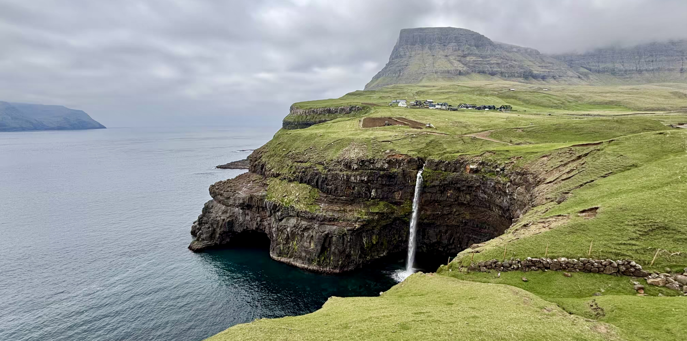
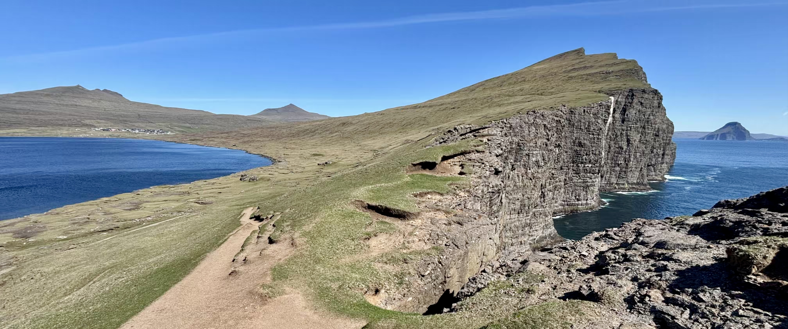
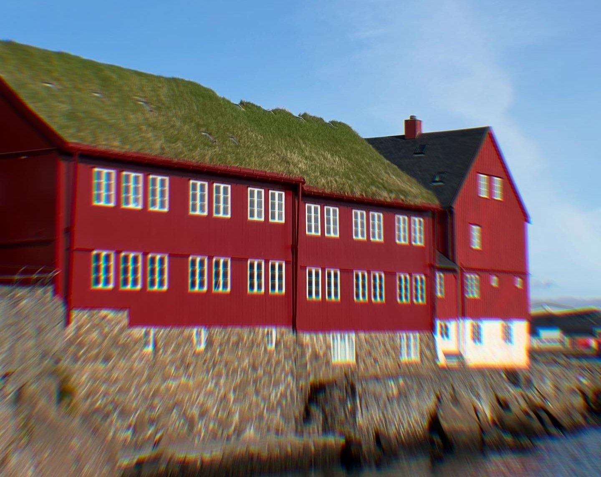
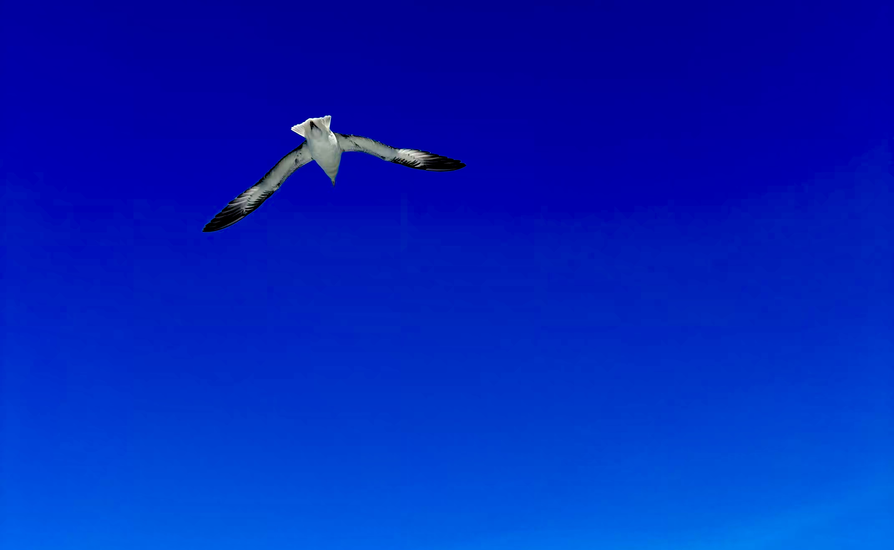
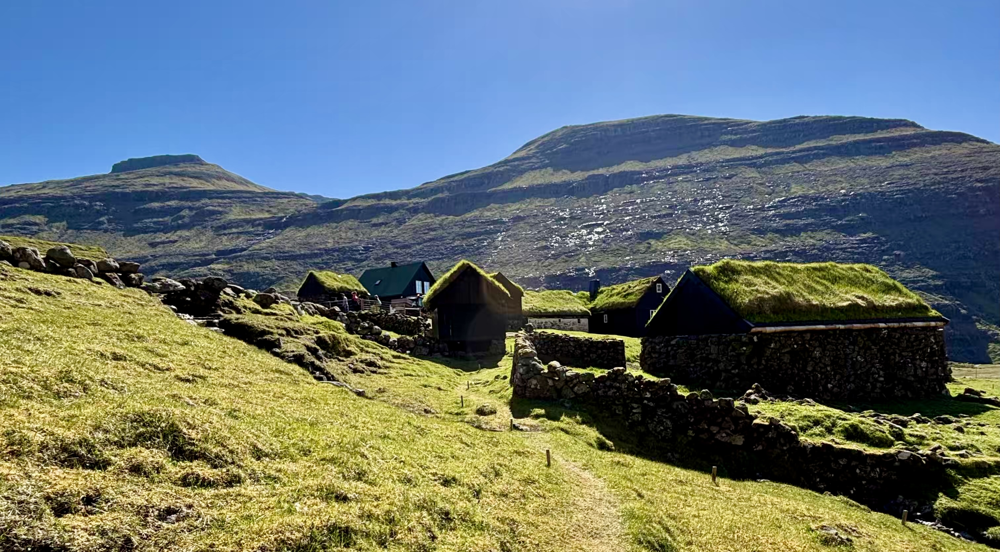
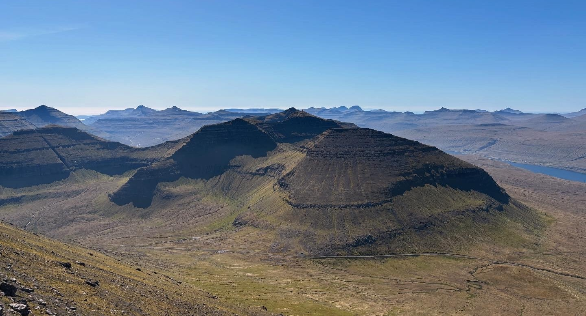
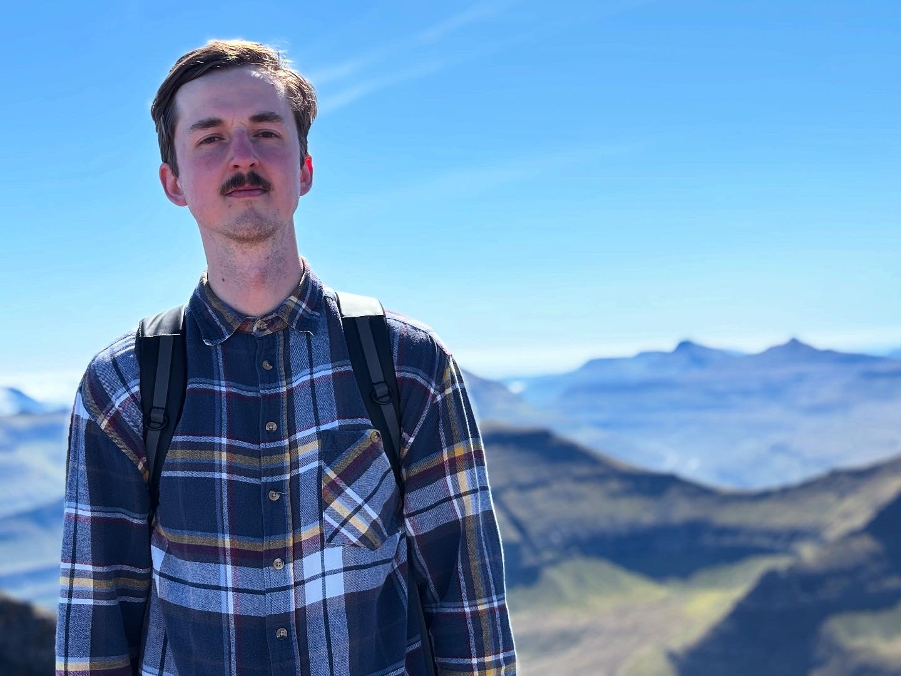
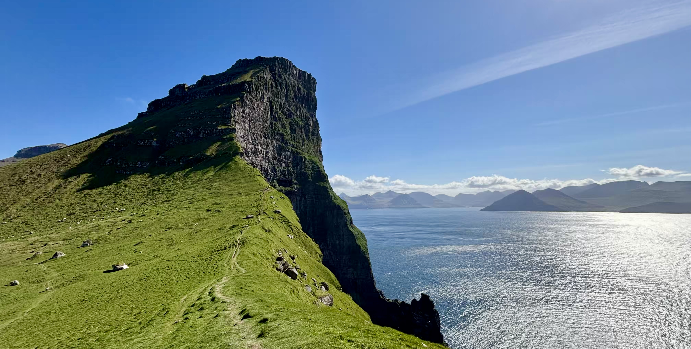
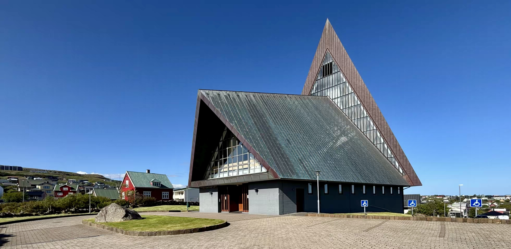

 

Klářiným jazykem lásky jsou dárky. A já musím říct, že mě dřív hodně bavilo dárky dávat. Potom se ale několikrát stalo, že jsem daroval dárek nechtěný, ze kterého neměl radost nikdo, ani darovatel, ani obdarovaný, což můj vztah k dárkům navždy poznamenalo. Navíc mi přijde, že materiální věci v poslední době vůbec nepotřebuji, protože všechno, co jsem chtěl mít, jsem si už v životě pořídil, a tak dárky moc rád nemám. Protože Klára by si ale život bez dárků nedokázala představit, vytvořili jsme nepsané pravidlo, že před každými narozeninami a Vánocemi si nasdílíme seznam věcí, které chceme, a to z toho důvodu, aby obdarovaný dostal to, po čem jeho srdce skutečně touží, darovatel zbytečně nevyhazoval peníze a obě strany tak byly spokojené.

Dlouhá léta tento systém dárků bez překvapení fungoval velice dobře. Až do minulého roku, kdy se blížily moje 30. narozeniny a já vůbec nevěděl, co si přát. Proto jsem s nikým seznam svých tajných přání nesdílel, přestože jsem k tomu byl několikrát vyzván, a v některých případech dost důrazně! Když jsem žádný seznam nenasdílel a tím pádem jsem si vlastně "nic nepřál", upřímně jsem pracoval s variantou, že v den svých narozenin nic nedostanu. Klára mě ale hrozně moc překvapila a darovala mi letenky na [Faerské ostrovy](https://cs.wikipedia.org/wiki/Faersk%C3%A9_ostrovy), což mi udělalo opravdu velkou radost!

A tak jsme počkali pár měsíců a v květnu roku 2025 společně vyrazili za novým dobroužstvím!

 

#### DEN 0: čtvrtek 15. května 2025

Protože letadlo nám letělo z [Vídně](https://cs.wikipedia.org/wiki/V%C3%ADde%C5%88) v pátek v 10 hodin dopoledne, museli jsme buď v pátek vstávat hodně brzo a ještě riskovat, že pokud bude na cestě nějaký problém, my letadlo nestihneme, nebo jsme mohli jet do Vídně už ve čtvrtek večer a na [letiště](https://cs.wikipedia.org/wiki/Leti%C5%A1t%C4%9B_V%C3%ADde%C5%88) se dostat bez zbytečných stresů. Vybrali jsme si druhou možnost.

Ve čtvrtek jsme tím pádem ještě pracovali a rozhodli se vyjet až navečer. Protože poslední den před dovolenou jsem musel v práci vyřídit ještě relativně dost věcí, nebyl to úplně klidný den, jak jsem si ho původně představoval. I proto jsem se začal balit až kolem 17. hodiny a z domu jsme vyjeli asi o 2 hodiny později. Cestou do Vídně jsme se stavili ještě na jídlo do [McDonald’s](https://cs.wikipedia.org/wiki/McDonald%E2%80%99s) v [M Paláci](https://cs.wikipedia.org/wiki/M_Pal%C3%A1c), takže do Vídně jsme dorazili až kolem 22. hodiny. Než jsme se ubytovali a umyli, byl čas jít spát.

 

#### DEN 1: pátek 16. května 2025

Po snídani na hotelu jsme si sbalili věci a přesunuli se na letiště.

Na [Faerské ostrovy](https://cs.wikipedia.org/wiki/Faersk%C3%A9_ostrovy) neexistuje přímá linka z okolních letišť, a tak nás první den čekaly dva lety s přestupem v [Paříži](https://cs.wikipedia.org/wiki/Pa%C5%99%C3%AD%C5%BE). První dvouhodinový let jsem strávil čuměním do blba, protože jsem si zapomněl z batohu vytáhnout sluchátka a pán sedící vedle mě krátce po odletu usnul, takže jsem se nemohl zvednout a jít si je vzít z přihrádky nad našimi hlavami. O zábavu bylo ale i tak postaráno! [Kláře](https://cs.wikipedia.org/wiki/Kl%C3%A1ra) se totiž v průběhu letu vylilo v batohu pití. A samozřejmě jsem za to mohl já, protože jsem flašku před odletem špatně zašrouboval.

Do Paříže jsme už ale dorazili trošku sušší a ne tak moc nasraní, protože těsně před přistáním na letiště [CDG](https://cs.wikipedia.org/wiki/Leti%C5%A1t%C4%9B_Charlese_de_Gaulla) se nám díky dobrému počasí podařilo vidět [Eiffelovu věž](https://cs.wikipedia.org/wiki/Eiffelova_v%C4%9B%C5%BE), což všem zúčastněným udělalo mooooc velkou radost.

Na hlavním pařížském letišti jsme se přesunuli k naší odletové bráně a zašli si na oběd do předražené letištní restaurace. Než jsme se nadáli, už bylo 17 hodin a my jsme seděli v poloprázdném letadle společnosti [Atlantic Airlines](https://en.wikipedia.org/wiki/Atlantic_Airways) a čekali na odlet. V průběhu letu, který trval asi 2,5 hodiny, jsem poslouchal podcast a také si povídal s Klárounem.

Kolem 18:30 místního času jsme za krásného slunečného počasí přistáli na miniaturním letišti na ostrově [Vágar](https://cs.wikipedia.org/wiki/V%C3%A1gar). Protože nikdo nekontroloval naši identitu, hned jsme zamířili do půjčovny aut, kde jsme si vyzvedli našeho nového parťáka na dalších několik dní, šedý [Hyundai i20](https://cs.wikipedia.org/wiki/Hyundai_i20) s palubním počítačem, jehož funkce by strčily naši černou kočku hravě do kapsy!

Ubytování na další 3 dny jsme si zakoupili v hotelu Vágar hned vedle letiště. Cesta na hotel tím pádem zabrala doslova pár minut. Po vybalení věcí jsme si zašli na večeři do hotelové restaurace, kde jsem si dal první z mnoha rybích jídel, které jsem na ostrovech ochutnal. Jednalo se o vynikající pečenou [tresku](https://cs.wikipedia.org/wiki/Treska) s dýní a pečenými brambory! Na hotel vedle letiště ~dobrý~ skvělý!

 

#### DEN 2: sobota 17. května 2025

Hned první den na [Faerských ostrovech](https://cs.wikipedia.org/wiki/Faersk%C3%A9_ostrovy) nás čekal pořádně nabitý program. Vstali jsme v 7 hodin, zašli si na rychlou snídani a frčeli do městečka [Sørvágur](https://cs.wikipedia.org/wiki/S%C3%B8rv%C3%A1gur) kousek od letiště. Tam jsme nechali auto a nasedli na loď, která nás za 45 minut odvezla na ostrov [Mykines](https://cs.wikipedia.org/wiki/Mykines) ["myčines"]. Během plavby nám kapitán lodi ukázal [Drangarnir](https://en.wikipedia.org/wiki/Drangarnir), skalní výběžek ve tvaru obráceného písmene "U", který je podle mě jedním ze symbolů Faerských ostrovů.

Z přístaviště na ostrově [Mykines](https://cs.wikipedia.org/wiki/Mykines) jsme po strmých schodech vyšplhali do vesničky, kde jsme se měli sejít s naším průvodcem po ostrově. Před začátkem tour jsem si ale ještě chtěl zajít na záchod. V řadě na (pravděpodobně) jedinou toaletu na ostrově mě drze předběhla jedna mladá [Polka](https://cs.wikipedia.org/wiki/Polsko). Když se řada posouvala, chtěl jsem si svoje místo vzít zpět, proto jsem promptně udělal krok dopředu. Jenže ona se nedala, narazila do mě a ještě řekla: "Heeej". Naprosto upřímně mě to dost naštvalo. Ale v tu chvíli jsem si řekl, že se tam nebudu s nikým hádat kvůli místu ve frontě na záchod a nebudu si kazit dovolenou. Tak jsem ji prostě nechal jít. Celou dobu jsem na to ale musel myslet a nakonec mi to ten den stejně docela zkazilo. Teď si trošku vyčítám, že jsem nic neřekl a nechal jsem si srát na hlavu.

Sraz se zbytkem naší výpravy jsme měli před budovou školy. Těsně před začátkem výpravy probíhala kontrola lístků. Osobně jsem měl docela strach, že nás na výpravu nepustí – i když jsem lístky koupil a měl je uložené v telefonu, krátce před odletem mi cestovní společnost za lístky vrátila peníze. Při kontrole jsem tuto skutečnost nezmínil. Paní mi naskenovala QR kód, na displeji čtečky se objevila zelená fajfka a my byli vpuštěni do budovy školy. Když zaměstnanci zkontrolovali vstupenky všem členům výpravy a ve škole se skoro nedalo hnout, myslel jsem si, že nás čeká nějaké úvodní slovo. To ale nepřišlo. Namísto toho nás všechny zase vyhnali ven. Tam se skupina rozdělila na dvě části: skupinku lidí "ve formě" a skupinu slabších kusů. Nechtěl jsem naše síly přecenit, proto jsem upřednostňoval druhou skupinu. Klára ale řekla, že se není čeho bát, a tak jsme šli do skupiny pro účastníky, kteří jsou ve formě.

Prohlídka ostrova začala ve vesničce. Náš italský průvodce nám řekl pár slov o faerské kultuře. Následoval výstup na útesy po velice strmém kopci. Přestože jsme se přihlásili do fit skupiny, pořád jsme se nacházeli mezi posledními a na vrchol kopce jsme přišli zpocení jak myši. V tu chvíli jsme ale měli to nejhorší za sebou. Potom jsme totiž už jen chodili po relativně rovinaté hraně útesu, obdivovali nádherné výhledy, dívali se na hnízda [papuchalků](https://cs.wikipedia.org/wiki/Papuchalk) a fotili si zvířata. Kromě velkého množství ptáků se na zelených loukách pohybovaly i ovečky.

Fotky bílých nebo černých chlupatých koulí na zeleném podkladu sice vypadají moc hezky, ale vše má svou cenu. Na cestičkách totiž ležela hromada ovčích bobků. Mnoho lidí nezvládalo obdivovat nádherné výhledy z útesů a zároveň se dívat pod nohy. Výsledkem byly desítky rozšlapaných koblížků a dost špinavé boty téměř všech účastníků výpravy. Na jednu stranu mi to přišlo docela vtipné, na druhou jsem se pořád bál, abych se i já nestal obětí roztomilých chlupáčů.

Po návratu do vesničky jsme si zašli na oběd do jediného bistra na ostrově – pokud se tak podnik v malém dřevěném domečku vůbec dá nazvat. Dali jsme si mrkvovou polévku a hot dog, což byly společně s rybí polévkou a obloženým chlebem jediná jídla v nabídce nepříjemné paní za kasou. Po jídle jsme se šli podívat ještě na jeden útes a poté jsme se už přesunuli do přístaviště. Chtěli jsme být mezi prvními, abychom si na lodi na zpáteční cestu na ostrov [Vágar](https://cs.wikipedia.org/wiki/V%C3%A1gar) chytli místo na přídi a mohli se tak dívat na všechny přírodní krásy, které budeme míjet. To se nám povedlo, takže jsme viděli vše, co jsme chtěli.

To bylo super. 45 minut strávených na přídi lodi ale mělo i jednu nevýhodu – byla tam zima! I proto jsme se na souši rozhodli, že zajdeme do nějaké kavárny, kde se trošku zahřejeme. Přesunuli jsme se tedy do nedaleké vesničky [Gásadalur](https://en.wikipedia.org/wiki/G%C3%A1sadalur). Tam jsme si nejprve dali kávu v jediném místním podniku a poté se prošli po okolí. Obdivovali jsme hlavně vodopád [Múlafossur](https://guidetofaroeislands.fo/travel-faroe-islands/drive/mulafossur/) – pravděpodobně jeden z nejznámějších vodopádů na ostrovech – a také nádherné výhledy na okolní kopce.

 

*Vodopád [Múlafossur](https://guidetofaroeislands.fo/travel-faroe-islands/drive/mulafossur/).*

 

Kolem 17:30 jsme nasedli do auta a zajeli na večeři do [Café Zorva](https://visitvagar.fo/en/whatson/places/place/cafe-zorva0?region=7), podniku, který má ve svém názvu sice slovo „café“, ale kavárna to určitě není. Jedná se spíš o restauraci – a to ne jen tak ledajakou. Podnik provozují [Indové](https://cs.wikipedia.org/wiki/Indie), kteří vaří prakticky všechny kuchyně světa: [italskou](https://cs.wikipedia.org/wiki/Italsk%C3%A1_kuchyn%C4%9B), [americkou](https://cs.wikipedia.org/wiki/Americk%C3%A1_kuchyn%C4%9B), [mexickou](https://cs.wikipedia.org/wiki/Mexick%C3%A1_kuchyn%C4%9B), [indickou](https://cs.wikipedia.org/wiki/Indick%C3%A1_kuchyn%C4%9B), místní… *you name it*. Když jsme do podniku přicházeli, upřímně jsem se toho bál. Nakonec jsme ale odcházeli moc spokojeni. S Klárou jsme si dali napůl pizzu [Hawaii](https://cs.wikipedia.org/wiki/Havajsk%C3%A1_pizza) a [fish and chips](https://cs.wikipedia.org/wiki/Fish_and_chips) – a obě jídla nám moc chutnala. Navíc jsme se najedli za rozumnou cenu, což na [Faerských ostrovech](https://cs.wikipedia.org/wiki/Faersk%C3%A9_ostrovy) není úplně obvyklé.

 

#### DEN 3: neděle 18. května 2025

Po snídani jsme nasedli do auta a jeli do nedaleké vesnice [Sandavágur](https://cs.wikipedia.org/wiki/Sandav%C3%A1gur). Auto jsme nechali na parkovišti za posledním domem ve vesnici a vydali se úzkou asfaltovou cestou podél pobřeží. Cesta se postupně změnila v prašnou pěší cestu, která nás zavedla k vyhlídce na skalní útvar [Trollkonufingur](https://visitfaroeislands.com/en/whatson/places/place/trollkonufingur-monolith), v překladu "prst čarodějnice". Podle pověsti chtěla čarodějnice vzít ostrov [Vágar](https://cs.wikipedia.org/wiki/V%C3%A1gar) a připojit ho k [Islandu](https://cs.wikipedia.org/wiki/Island). Cestou ale vysvitlo slunce, ona se proměnila v kámen a spadla do moře. A tím pádem můžeme dodnes vidět její prst na jižní straně ostrova [Vágar](https://cs.wikipedia.org/wiki/V%C3%A1gar).

Po krátkém treku jsme si zašli na oběd do vynikajícího bistra [FiskaStykkid](https://www.fiskastykkid.fo/), které se nachází v budově bývalého rybářského domu. Já jsem si dal rybí polévku s chlebem a Klára ochutnala lehký salát s kousky ryb a brambory. Oběma nám moc chutnalo, a tak není divu, že nejednalo o naši poslední návštěvu tohoto podniku.

Po obědě jsme zaparkovali auto u jezera [Leitisvatn](https://cs.wikipedia.org/wiki/S%C3%B8rv%C3%A1gsvatn) a podél jeho východní strany jsme se vydali k majestátním útesům, ze kterých [Vikingové](https://cs.wikipedia.org/wiki/Vikingov%C3%A9) shazovali otroky do oceánu. I proto se jim přezdívá "útesy otroků". Místo je také zajímavé tím, že když se člověk dostane na nejvyšší bod útesu, může vidět skoro celé jezero [Leitisvatn](https://cs.wikipedia.org/wiki/S%C3%B8rv%C3%A1gsvatn) "nad hladinou oceánu", který omývá vysoké útesy pod ním.

 

*Jezero [Leitisvatn](https://cs.wikipedia.org/wiki/S%C3%B8rv%C3%A1gsvatn) nad hladinou moře.*

 

Trek měřil něco málo přes 7 kilometrů a my jej i s mnoha přestávkami stihli za méně než 2 hodiny. Když jsme se tedy vrátili k autu, bylo přibližně 16 hodin a my přemýšleli, co s načatým dnem. Při plánování programu jsem si totiž myslel, že nám procházka po útesech zabere celé odpoledne. Nakonec jsme se rozhodli, že využijeme volný čas a pojedeme se podívat do hlavního města [Faerských ostrovů](https://cs.wikipedia.org/wiki/Faersk%C3%A9_ostrovy), které se jmenuje [Tórshavn](https://cs.wikipedia.org/wiki/T%C3%B3rshavn).

První zastávkou byla v kavárně [Brell](https://brell.fo/), kde jsme si dali kávu a zákusek. Poté jsme se prošli kolem [katedrály](https://en.wikipedia.org/wiki/T%C3%B3rshavn_Cathedral) a přístavu, až jsme došli do [historické části města](https://visitfaroeislands.com/en/whatson/places/place/old-town-in-torshavn-a-reyni). Ta je charakteristická červenými domečky, ve kterých se nachází sídla vládních institucí.

 

*[Historická část](https://visitfaroeislands.com/en/whatson/places/place/old-town-in-torshavn-a-reyni) hlavního města [Tórshavn](https://cs.wikipedia.org/wiki/T%C3%B3rshavn).*

 

Večeři jsme si dali v japonské restauraci na shopping street a poté už nasedli do auta a jeli zpět na hotel.

 

#### DEN 4: pondělí 19. května 2025

V pondělí ráno jsme si zašli na snídani a odhlásili se z [Hotelu Vágar](https://visitfaroeislands.com/en/whatson/places/place/hotel-vagar). Následovala asi půlhodinová cesta autem do městečka [Vestmanna](https://cs.wikipedia.org/wiki/Vestmanna). Tam jsme nasedli na malou loď a společně se zbytkem naší výpravy se jeli podívat k ptačím útesům. Myslím, že výlet se opravdu povedl. Nejenže nám vyšlo krásné počasí, ale zároveň jsme viděli spoustu ptáků a součástí vyjížďky byl i průjezd několika úzkými průsmyky, které nabízely nádherné pohledy na vysoké skalní stěny nacházející se kolem nás. A protože jsme měli relativně dobrý čas, kapitán nás na závěr ještě zavezl do zátoky u vesničky [Saksun](https://cs.wikipedia.org/wiki/Saksun), kam jsme se chystali odpoledne.

 

*[Racek](https://cs.wikipedia.org/wiki/Rackovit%C3%AD).*

 

Po návratu do městečka [Vestmanna](https://cs.wikipedia.org/wiki/Vestmanna) jsme se najedli v místním [informačním centru](http://www.visit-vestmanna.com/ven) a poté už vyrazili do již dříve zmíněného [Saksunu](https://cs.wikipedia.org/wiki/Saksun), tentokrát ale po zemi. Ve stánku s občerstvením jsme si dali kávu a zákusek a potom jsme si koupili lístky do skanzenu. Moc jsme nechápali, kam se s lístkem chodit může a kam ne. Nejdřív jsem si myslel, že lístek potřebujeme jen do skanzenu, ale nemusíme jej mít na cestě k vodopádu za vesničkou. Hned na začátku cesty nás ale odchytla místní žena, která nám řekla, že všechny pozemky jsou v soukromém vlastnictví a lístek tím pádem potřebujeme úplně všude.

Už jako držitelé vstupenek jsme tedy nakoukli i do jednoho původního domečku, kam jsem původně vůbec neplánoval jít, a poté jsme vyšplhali na kopec k vodopádu. Tam jsme si na chvíli sedli do trávy a jen se kochali nádherným výhledem do údolí i na domy s trávou porostlými střechami pod námi. To byla prostě idylka!

 

*Skanzen ve vesničce [Saksun](https://cs.wikipedia.org/wiki/Saksun).*

 

Kolem 15:30 jsme sedli do auta a přejeli do druhé části vesničky, odkud jsme se vydali na cca 7 km dlouhý trek na pláž s černým pískem. Ta je přístupná pouze ve chvíli, kdy je odliv. Od treku jsme toho oba čekali víc, ale i tak jsme byli rádi, že jsme ho absolvovali. Když jsme asi po 90 minutách přišli zpět k autu, přemýšleli jsme, co budeme dělat dál. Já osobně jsem byl už unavený a nic moc se mi dělat nechtělo. Nakonec jsme se ale rozhodli, že ještě zajedeme do vedlejší vesničky [Tjørnuvík](https://cs.wikipedia.org/wiki/Tj%C3%B8rnuv%C3%ADk), kterou jsme na daný den měli naplánovanou, a myslím, že jsme udělali více než dobře!

Cestou do vesničky jsme se zastavili ještě u [Fossá](https://visitfaroeislands.com/fo/whatson/places/place/fossa-waterfall), nejvyššího vodopádu na ostrovech, který v porovnání se svými [islandskými](https://cs.wikipedia.org/wiki/Island) protějšky vypadal spíše jako chudý příbuzný, ale potom už jsme zamířili do vesničky [Tjørnuvík](https://cs.wikipedia.org/wiki/Tj%C3%B8rnuv%C3%ADk). Ta se naopak stala absolutním highlightem mého dne! Jednalo se totiž o zapadlou zátoku s písčitou pláží, ve které stálo pár domečků a vysoko nad nimi se rozpínaly vysoké zelené kopce. A když si člověk stoupl na pláž a podíval se do moře, kousek od vysokých útesů spatřil dva skalní útvary [Risin og Kellingin](https://cs.wikipedia.org/wiki/Risin_og_Kellingin), které patří k dalším významným turistickým místům na ostrovech. My jsme si prošli klidnou vesničku a potom si vyšlápli asi polovinu jednoho z kopců, kde jsme si sedli do trávy a jen si užívali nádherný výhled a idylické počasí, které na ostrovech není zase tolik obvyklé.

Navečer jsme se ubytovali u paní Liljy na ostrově [Eysturoy](https://cs.wikipedia.org/wiki/Eysturoy). Přestože jsem [ubytování](https://www.booking.com/hotel/fo/visithomes.cs.html) našel na [Bookingu](https://www.booking.com/), jednalo se o dům v rezidenční zástavbě, ve kterém starší majitelka nabízela několik pokojů ke krátkodobému pronájmu. My jsme bydleli v takovém zahradním domečku, kde jsme měli vlastní koupelnu a záchod, a na snídani jsme vždycky chodili k paní Liljě do kuchyně, kde nás hostila.

Poté, co nám paní domácí ukázala [naše ubytování](https://www.booking.com/hotel/fo/visithomes.cs.html), jsme zase sedli do auta a jeli se najíst do [Klaksvíku](https://cs.wikipedia.org/wiki/Klaksv%C3%ADk), druhého největšího města na ostrovech. Konkrétně jsme si vybrali moderní podnik [Frída Café](https://frida.fo/), který jsme si hned zamilovali!

 

#### DEN 5: úterý 20. května 2025

Když jsme ráno v 8 hodin přišli do kuchyně na snídani, u jídelního stolu už seděla německá důchodkyně Barbara. Zatímco jsme do sebe soukali slaninu, volské oko a domácí chleba, paní Lilja nám vyprávěla o faerské kultuře, místních lidech a zvycích. Hodně mě pobavilo, když začala drbat [Kambodžany](https://cs.wikipedia.org/wiki/Kambod%C5%BEa) bydlící v domě naproti přes cestu. Podle ní vypadají všichni stejně a prý na ostrovy jezdí pravidelně každé léto, aby mohli pracovat v místní fabrice na zpracování ryb. Tam si podle slov naší paní domácí vydělají víc než ona!

Po vydatné snídani nás čekal největší fyzický výkon za dobu našeho pobytu, a to výstup na [Slættaratindur](https://cs.wikipedia.org/wiki/Sl%C3%A6ttaratindur), nejvyšší horu [Faerských ostrovů](https://cs.wikipedia.org/wiki/Faersk%C3%A9_ostrovy), která sahá do výšky 880 m n. m. Zvláště první úsek byl hodně strmý, proto jsme se při cestě nahoru několikrát zastavovali a nabírali síly. Když už jsme byli těsně pod vrcholem, potkali jsme [norskou](https://cs.wikipedia.org/wiki/Norsko) dvojici otce a syna, kteří výstup na horu absolvovali před námi a v danou chvíli se už vraceli zpět. Protože vedle nás seděli na lodi při včerejším výletu na ptačí útesy, na chvíli jsme se zastavili a dali se s nimi do řeči. Když jsme se ptali, jak vypadá další část cesty, řekli nám, že vrchol je už blízko, ale na posledním úseku je cesta poměrně dost kamenitá, a tak je potřeba dávat hodně velký pozor, aby se nám někde nesmekla noha a my nespadli dolů. V daném místě mi přišlo, že jsme prakticky na vrcholu a údolí pod námi máme jako na dlani. Šplhat po kamenech na úplný vrchol a riskovat, že někde spadneme, se mi tím pádem moc nechtělo. Zvlášť když jsem si uvědomil, jak pomalu šel tatínek se synem dolů kvůli kvalitě terénu. Na malé plošině kousek za místem společného setkání jsme si udělali pár fotek okolí a přestože jsme přemýšleli, že už půjdeme zpět, nakonec jsme si řekli, že ještě chvíli zkusíme jít po relativně rovné cestičce z druhé strany kopce. Ta nás zavedla až k poslednímu úseku cesty, o kterém mluvil pán z [Norska](https://cs.wikipedia.org/wiki/Norsko). Cesta nám na první pohled nepřišla tak zlá a navíc absolutní vrchol byl už opravdu na dosah ruky. Vyšplhali jsme tedy po kamenech nahoru a stanuli na střeše [Faerských ostrovů](https://cs.wikipedia.org/wiki/Faersk%C3%A9_ostrovy), hoře [Slættaratindur](https://cs.wikipedia.org/wiki/Sl%C3%A6ttaratindur)! Z plošinky na vrcholu se nám naskytl nádherný výhled do celého údolí a já byl v tu chvíli moc rád, že jsme překonali sami sebe a vrchol pokořili!

 

*Pohled do údolí z nejvyšší hory [Faerských ostrovů](https://cs.wikipedia.org/wiki/Faersk%C3%A9_ostrovy).*

 

*Zvládl jsem to. I já jsem stanul na vrcholu.*

 

Když jsme seběhli kopec dolů, byl už čas oběda a my přemýšleli, kam jít. Z omezeného množství možností jsme si vybrali [bistro Rose's](https://visitfaroeislands.com/en/whatson/places/place/roses-restaurant-catering00). Tam nám ale Rose oznámila, že bez rezervace nám neuvaří, a tak jsme skončili v malém obchůdku ryb [Sjógaeti](https://sjogati.fo/), kde jsme si koupili [fish and chips](https://cs.wikipedia.org/wiki/Fish_and_chips) a následně si jídlo snědli v autě.

Po obědě jsme se přesunuli pod horu Skeggjanov, vypnuli motor a na chvíli jsme si zdřímli, abychom nabrali síly před dalším výstupem. Čekal nás totiž trek [Gongutúrur/Hvithamar](https://visitfaroeislands.com/en/whatson/places/place/hvithamar), při kterém jsme si vyšli dříve zmíněnou horu Skeggjanov a následně ji druhou stranou sešli dolů. Trek nebyl nijak náročný a hora nebyla vůbec vysoká, takže nám celá procházka zabrala asi jen hodinu času. Myslím si ale, že za návštěvu určitě stála. Asi v polovině cesty jsme totiž dorazili na hranu útesu, ze kterého byl nádherný pohled na zátoku pod námi a útesy naproti nám. Chvíli jsme si tam sedli do trávy a užívali si pohodu slunečného dne.

Po tomto krátkém treku jsme nasedli do auta a frčeli do vesničky [Gjógv](https://cs.wikipedia.org/wiki/Gj%C3%B3gv), která se nachází na severním pobřeží ostrova [Eysturoy](https://cs.wikipedia.org/wiki/Eysturoy). Auto jsme nechali na kraji vesnice, zašli si na kávu do pravděpodobně [jediného místního hotelu](https://www.booking.com/hotel/fo/gjaargardur.cs.html) a prošli se k útesům, kde jsme se chvíli snažili pozorovat ptáky. Moc jsme jich ale neviděli, proto jsme to po chvíli vzdali a frčeli na večeři do našeho oblíbeného [Frída Café](https://frida.fo/), kde už nás místní personál poznával. Tam jsem ochutnal rybí polévku, kterou mi dnes ráno u snídaně doporučila naše paní domácí, a musím říct, že nebyla vůbec špatná!

Po jídle jsme udělali ještě menší nákup v [supermarketu](https://www.bonus.fo/) a poté frčeli na ubytko.

 

#### DEN 6: středa 21. května 2025

Po klasické snídani s naší paní domácí Liljou a Němkou Barbarou jsme se vydali na hodinový přejezd na ostrov [Vágar](https://cs.wikipedia.org/wiki/V%C3%A1gar).

Ve vesnici [Sørvágur](https://cs.wikipedia.org/wiki/S%C3%B8rv%C3%A1gur) jsme se sešli s chorvatským párem, mladým [Kanaďanem](https://cs.wikipedia.org/wiki/Kanada) a naší průvodkyní, která nás zavedla k vysokým skalním útvarům vystupujícím z moře. Místo se jmenuje [Dunnesdrangar](https://visitvagar.fo/en/see-do0/culture-attractions/viewpoints/dunnesdrangar) a nachází se asi 1.5 km za vesnicí. Přestože paní průvodkyně docela hnala, my jsme šli relativně pomalu. Skoro celou cestu jsme totiž doprovázeli macatého [Kanaďana](https://cs.wikipedia.org/wiki/Kanada), který nám hned na začátku řekl, že není "in shape". Nám to ale nevadilo. Alespoň jsme měli možnost se dozvědět něco o jeho plánech na léto a o jeho cestovatelských zážitcích.

Přestože jsme si s Klárou mysleli, že nám cesta na útesy zabere více než hodinu, už za 40 minut jsme stáli na hraně útesu a fotili si skalní útvary, kvůli kterým jsme se na trek vydali. Musím říct, že samotná scenérie mě malinko zklamala. Bylo zakázané chodit blízko okraje, a tak člověk ani neviděl celé skály vystupující z moře. Na druhou stranu mě ale potěšilo, že jsme se mohli seznámit s novými lidmi a zároveň si poslechnout nějaké informace o faerské kultuře od paní, která se na [Faerských ostrovech](https://cs.wikipedia.org/wiki/Faersk%C3%A9_ostrovy) skutečně narodila – ano, tímto narážím na našeho italského průvodce z ostrova [Mykines](https://cs.wikipedia.org/wiki/Mykines). S paní jsme se bavili třeba na tému lovení velryb na ostrovech, které se podle mě negativně proslavilo díky [filmu Seaspiracy](https://www.csfd.cz/film/995121-seaspiracy-prava-tvar-udrzitelneho-rybolovu/prehled/).

Ze [Sørváguru](https://cs.wikipedia.org/wiki/S%C3%B8rv%C3%A1gur) jsme se přesunuli na oběd do nedalekého bistra [FiskaStykkid](https://www.fiskastykkid.fo/), kde jsme byli už v neděli a moc nám tam chutnalo. Po obědě jsme sedli do auta a jeli do druhého největšího města [Faerských ostrovů](https://cs.wikipedia.org/wiki/Faersk%C3%A9_ostrovy) – [Klaksvíku](https://cs.wikipedia.org/wiki/Klaksv%C3%ADk). Tam jsme se společně s naším [Hyundai i20](https://cs.wikipedia.org/wiki/Hyundai_i20) nalodili na trajekt a nechali se převést na vedlejší ostrov [Kalsoy](https://cs.wikipedia.org/wiki/Kalsoy). Od ostrova jsem měl vysoká očekávání, ale nakonec přišlo relativní zklamání. Prakticky se jedná o takovou krátkou nudli, kterou protíná jedna silnice s pár odbočkami do malých osad na pobřeží. Na jižním konci ostrova je přístaviště, kde nás vyplivnul trajekt. Na severním cípu ostrova se nachází maják [Kallur](https://guidetofaroeislands.fo/travel-faroe-islands/drive/kallur-lighthouse/), kam jsme měli namířeno.

Protože je ostrov maličký, asi za 20 minut jsme jej přejeli z jihu na sever, zaparkovali auto před vesničkou [Trøllanes](https://visitfaroeislands.com/en/whatson/places/place/trollanes0) a vydali se k [majáku](https://guidetofaroeislands.fo/travel-faroe-islands/drive/kallur-lighthouse/). Dalo by se říct, že jsme tam v podobnou dobu šli s několika separátními skupinkami. Kvůli špatnému značení trasy jsme ale každý přišel k majáku jinou cestou, a to i přesto, že pouze jedna byla ta správná. Přestože výhledy na moře a na okolní kopce byly u majáku naprosto dechberoucí, já si to tam zase tolik neužíval. Na kopci totiž hrozně moc foukalo a mně byla v jednom tričku a dvou flanelových košilích docela zima. I proto jsme se na místě moc dlouho nezdržovali, udělali si pár fotek a vydali se – tentokrát už správnou cestou – zpět.

 

*Pohled na vysoké útesy u [majáku Kallur](https://guidetofaroeislands.fo/travel-faroe-islands/drive/kallur-lighthouse/).*

 

Tento cca 4 km dlouhý trek začínal a končil u jednoho domečku za vesničkou [Trøllanes](https://visitfaroeislands.com/en/whatson/places/place/trollanes0). V něm [thajská](https://cs.wikipedia.org/wiki/Thajsko) žena malého vzrůstu vybírala poplatek za výstup k majáku a zároveň v něm nabízela občerstvení pro unavené turisty. A protože my unavení byli, za odměnu jsme si u paní v restauraci dali kávu a wafli. Restaurace ale vypadala spíše jako něčí dům, takže já osobně jsem se tam úplně necítil. Hned první věc, která mě malinko zarazila, byla, že nás paní posadila do místnosti, která vypadala jako obývák. Vedle dvou menších jídelních stolů pro návštěvníky stál obrovský dřevěný stůl pro cca 10 osob, který měl lví nohy, na zdech visely obrázky malých dětí a v rohu místnosti stál gauč, na který byla namířená velkoplošná televize. Když jsem šel na záchod, ocitl jsem se v koupelně, kde na zemi ležel koberec a půlku místnosti zabíral sprchový kout se závěsem. A protože v domě nebyl žádný bar, jak tomu tak bývá v každé slušné restauraci, když jsem chtěl zaplatit, vstal jsem od stolu a šel zaklepat na dveře od kuchyně, kde si hrály děti, zatímco naše [thajská](https://cs.wikipedia.org/wiki/Thajsko) hostitelka připravovala kuřecí [phad thai](https://cs.wikipedia.org/wiki/Phad_thai) pro [polský](https://cs.wikipedia.org/wiki/Polsko) pár sedící u stolu vedle nás.

No, jinými slovy, nebylo to úplně ono, ale zahřáli jsme se, dali jsme si kávu a wafli a po úspěšném vyrovnání účtů jsme sedli do auta a vydali se do vedlejší vesničky. Tam jsme si ještě před odjezdem z ostrova vyfotili [sochu lachtaní ženy](https://guidetofaroeislands.fo/travel-faroe-islands/drive/kopakonan/). Zpět do [Klaksvíku](https://cs.wikipedia.org/wiki/Klaksv%C3%ADk) jsme se dostali krátce po 19. hodině a hned po příjezdu jsme zamířili do našeho oblíbeného podniku [Frída Café](https://frida.fo/). Známý číšník nás už vítal s otevřenou náručí a když jsem si šel objednat na bar, pán mi řekl, že jsme jeho oblíbení zákazníci a že si moc váží toho, že jsme přijeli na večeři třetí den v řadě! To, že se jedná široko daleko o jediné místo, kde se člověk může rozumně najíst, jsem nezmínil a byl jsem rád, že je rád.

Po výborné večeři jsme se přesunuli na ubytko do [Leirvíku](https://cs.wikipedia.org/wiki/Leirv%C3%ADk) a šli spát.

 

#### DEN 7: čtvrtek 22. května 2025

Na poslední den na [Faerských ostrovech](https://cs.wikipedia.org/wiki/Faersk%C3%A9_ostrovy) jsme si naplánovali odpočinkový program v hlavním městě [Tórshavn](https://cs.wikipedia.org/wiki/T%C3%B3rshavn).

Po snídani jsme proto nikam nespěchali, v klidu se vypravili a než jsme se přesunuli na jih ostrova [Streymoy](https://cs.wikipedia.org/wiki/Streymoy), bylo už skoro 10 hodin. Naší první zastávkou byl [obchodní dům SMS](https://visitfaroeislands.com/en/whatson/places/place/sms-shopping-centre). Tam jsme se snažili najít pěkný vlněný svetr pro Kláru. To se nám ale nepovedlo, a tak jsme zamířili do parku v centru města. V něm se – poměrně nečekaně – páslo několik oveček a také se v něm nacházel vodopád! O kterém z hlavních měst bych tohle mohl říct, že?

Na oběd jsme se zastavili v maličkém bistru [Ástaklokkan](https://www.visittorshavn.fo/place/astaklokkan/), které nás zase překvapilo tím, že z podlahy v interiéru vyrůstaly kapradiny. Po obědě jsme si prošli staré město, podívali se do [luteránské katedrály](https://en.wikipedia.org/wiki/T%C3%B3rshavn_Cathedral), kterou nám shodou okolností otevřela a ukázala místní paní farářka, a poté jsme navštívili knihkupectví spojené s kavárnou [Panama café](https://www.visittorshavn.fo/place/paname-cafe0/). Tam jsme si dali kávu a zákusek a potom seděli a snad hodinu si jen povídali.

Kolem 16. hodiny jsme se zvedli a šli se podívat na památník [Kongaminnið](https://visitfaroeislands.com/en/whatson/places/place/kongaminni00), který stojí na kopci kousek od centra města, a tím pádem je od něj nádherný výhled do okolí. Až u památníku jsme si všimli, že se ve městě nachází ještě jeden [luteránský kostel](https://visitfaroeislands.com/fo/whatson/places/place/vesturkirkjan-church-of-western-torshavn0), s obrovskou černou střechou ve tvaru trojúhelníku. Přestože stál až na druhé straně centra, měli jsme dost času, a tak jsme se rozhodli, že se k němu zajdeme ještě podívat. A nakonec jsme byli rádi, že jsme tak učinili. [Kostel](https://visitfaroeislands.com/fo/whatson/places/place/vesturkirkjan-church-of-western-torshavn0) je totiž oproti [katedrále](https://en.wikipedia.org/wiki/T%C3%B3rshavn_Cathedral) o dost monumentálnější a navíc byl otevřený pro veřejnost, takže jsme se mohli jít v klidu podívat dovnitř.

 

*[Kostel Vesturkirkjan](https://visitfaroeislands.com/fo/whatson/places/place/vesturkirkjan-church-of-western-torshavn0).*

 

Po prohlídce kostela jsme se přesunuli na večeři do restaurace [Katrina Christiansen](https://en.katrina.fo/), kde jsme oslavili poslední den pobytu na [Faerských ostrovech](https://cs.wikipedia.org/wiki/Faersk%C3%A9_ostrovy) noblesní večeří. Nevím, zda nám to za to stálo, protože jsme se hrozně moc přejedli, ale jídlo tam bylo vynikající.

Po návratu do [Leirvíku](https://cs.wikipedia.org/wiki/Leirv%C3%ADk) jsem si dal rychlou sprchu a poté už jen sledoval trápení [české hokejové reprezentace](https://cs.wikipedia.org/wiki/%C4%8Cesk%C3%A1_hokejov%C3%A1_reprezentace) ve čtvrtfinálovém utkání proti [Švédsku](https://cs.wikipedia.org/wiki/%C5%A0v%C3%A9dsko).

 

#### DEN 8: pátek 23. května 2025

Poslední den naší dovolené byl věnovaný cestě domů.

Ráno jsme si sbalili věci, po snídani se rozloučili s Liljou a vyrazili na [letiště](https://cs.wikipedia.org/wiki/Leti%C5%A1t%C4%9B_V%C3%A1gar). Při bezpečnostní kontrole nám paní fašistka nařídila, abychom si přeskládali tekutiny z našich litrových pytlíků do menších pytlíků a vyhodili, nebo odbavili věci, které se do nich nevlezou. Moc jsme to nechápali, protože s našimi pytlíky jsme létali už mnohokrát a nikdy s nimi nebyl problém.

V [duty free](https://cs.wikipedia.org/wiki/Bezceln%C3%AD_obchod) zóně jsme si čekání na odlet zkrátili dojezením zásob z předchozích dní a také pokecem s naším kanadským kamarádem Matthewem, kterého jsme poznali na treku na [Dunnesdrangar](https://visitvagar.fo/en/see-do0/culture-attractions/viewpoints/dunnesdrangar).

Při letu do [Paříže](https://cs.wikipedia.org/wiki/Pa%C5%99%C3%AD%C5%BE) jsem psal článek na blog. Po přistání na [letišti CDG](https://cs.wikipedia.org/wiki/Leti%C5%A1t%C4%9B_Charlese_de_Gaulla) jsme se přesunuli k naší odletové bráně, dali si kávu a zákusek a čekali na letadlo do [Vídně](https://cs.wikipedia.org/wiki/V%C3%ADde%C5%88). Tam jsme přiletěli až kolem 23. hodiny, takže než jsme přijeli do [Brna](https://cs.wikipedia.org/wiki/Brno), byl už prakticky další den.

 

#### DOJMY Z FAERSKÝCH OSTROVŮ

**Existuje ještě pasová kontrola?** Pokud uvažuji cestu tam i zpět, tak jsme absolvovali celkem 4 lety. Na [letišti v Paříži](https://cs.wikipedia.org/wiki/Leti%C5%A1t%C4%9B_Charlese_de_Gaulla) jsme navíc museli vždy vyjít ven z [bezcelní zóny](https://cs.wikipedia.org/wiki/Bezceln%C3%AD_prodej) a tím pádem znovu projít bezpečnostní kontrolou. Nikde nám ale nikdo nekontroloval doklad totožnosti. Pokud bych tedy dal svoji palubní vstupenku komukoliv jinému, dotyčný by se bez problému dostal na palubu letadla. Něco mi uniká, nebo se v rámci [EU](https://cs.wikipedia.org/wiki/Evropsk%C3%A1_unie) kompletně zrušila pasová kontrola? 💬

**Kamarádi turisti všude kolem nás.** [Faerské ostrovy](https://cs.wikipedia.org/wiki/Faersk%C3%A9_ostrovy) jsou skutečně maličký stát a lidé, kteří přijíždí místní krajinu poznat, většinou mají v plánu ty stejné zastávky. I proto se nám často stávalo, že jsme se jeden den s někým seznámili a druhý den ho potkali zase. Krásný příkladem je třeba [Kanaďan](https://cs.wikipedia.org/wiki/Kanada) Matthew, nebo stará paní s berlemi, kterou jsme poznali při naší první návštěvě [hlavního města](https://cs.wikipedia.org/wiki/T%C3%B3rshavn) a o den později ji potkali v [Saksunu](https://cs.wikipedia.org/wiki/Saksun). 🤝

**Drahota.** [Faerské ostrovy](https://cs.wikipedia.org/wiki/Faersk%C3%A9_ostrovy) jsou pravděpodobně jedna z nejdražších destinací, kde jsem kdy byl. Nejenže je všechno hodně drahé, ale hlavně se za všechno platí! Chceš jít na trek na [maják](https://guidetofaroeislands.fo/travel-faroe-islands/drive/kallur-lighthouse/)? Zaplať [thajské](https://cs.wikipedia.org/wiki/Thajsko) ženě 200 DKK! Chceš projet [podmořským tunelem](https://ct24.ceskatelevize.cz/clanek/svet/faerske-ostrovy-otevrely-podmorskou-sit-tunelu-stridani-barevneho-nasviceni-ozvlastnuje-kruhovy-obje-40698) z jednoho ostrova na druhý? Zaplať 100 DKK! Chceš se podívat na ostrov [Mykines](https://cs.wikipedia.org/wiki/Mykines)? Kup si povinnou prohlídku s průvodcem! Peníze na ostrovech tím pádem jen lítaly a já musím říct, že tohle je jeden z hlavních důvodů, proč bych se na FAE už znovu vracet nemusel. 💸

**"We have to protect ourselves!"** Tak přesně tuhle větu pronesla jedno ráno naše paní domácí a od té doby jsem si na ni hned několikrát vzpomněl. Přestože na [Faerské ostrovy](https://cs.wikipedia.org/wiki/Faersk%C3%A9_ostrovy) jezdí stále relativně malé množství lidí, místní obyvatelé cítí, že počty turistů stále rostou a oni tak musí svoji zemi chránit. Všechny pozemky na ostrovech jsou totiž v [soukromém vlastnictví](https://cs.wikipedia.org/wiki/Soukrom%C3%A9_vlastnictv%C3%AD). To znamená, že pokud se vydám na trek k útesům, vcházím na něčí pozemek, o který se někdo musí starat. I proto se na mnoho treků na ostrovech platí vstupné, což je v jiných zemích minimálně neobvyklé. Dalším příkladem toho, že jsou [Faeřané](https://cs.wikipedia.org/wiki/Faersk%C3%A9_ostrovy#Obyvatelstvo) dost ochranářští vůči své zemi, je třeba i fakt, že cizinec si na ostrovech nemůže koupit [nemovitost](https://cs.wikipedia.org/wiki/Nemovitost). ❌

**Cestování po [Faerských ostrovech](https://cs.wikipedia.org/wiki/Faersk%C3%A9_ostrovy).** Přestože se tento maličký stát rozkládá na několika malých ostrovech, přesun mezi nimi je vlastně docela pohodlný. Ty největší a zároveň nejzajímavější ostrovy jsou totiž propojené [podvodními tunely](https://ct24.ceskatelevize.cz/clanek/svet/faerske-ostrovy-otevrely-podmorskou-sit-tunelu-stridani-barevneho-nasviceni-ozvlastnuje-kruhovy-obje-40698), nebo [mosty](https://cs.wikipedia.org/wiki/Most), a tak se člověk dostane prakticky všude, kam potřebuje. A pokud někam nevede cesta po souši, vždy tam jede nějaká [loď](https://cs.wikipedia.org/wiki/Trajekt) nebo dokonce trajekt! 🚇

 

#### FOTKY

Fotky z [Faerských ostrovů](https://cs.wikipedia.org/wiki/Faersk%C3%A9_ostrovy)
najdete [zde](https://photos.app.goo.gl/KfYuxJToWSAUJMUa8).
