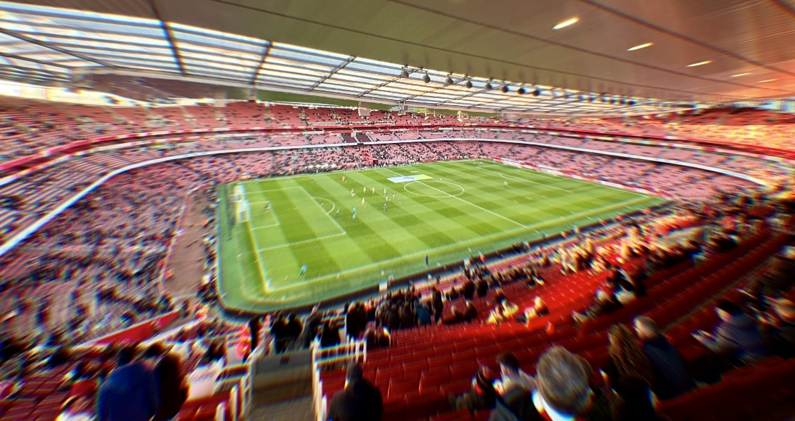
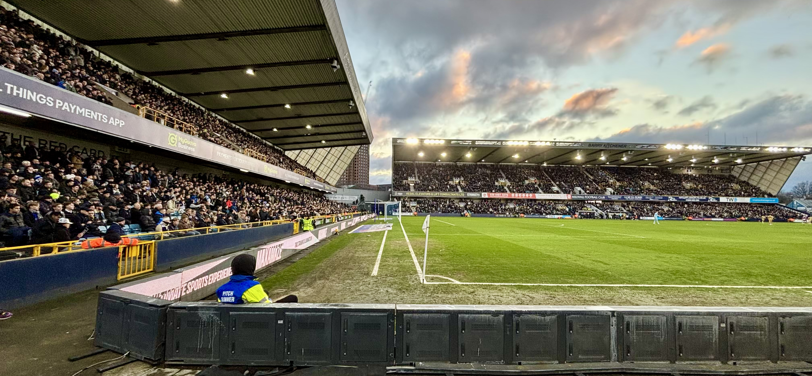
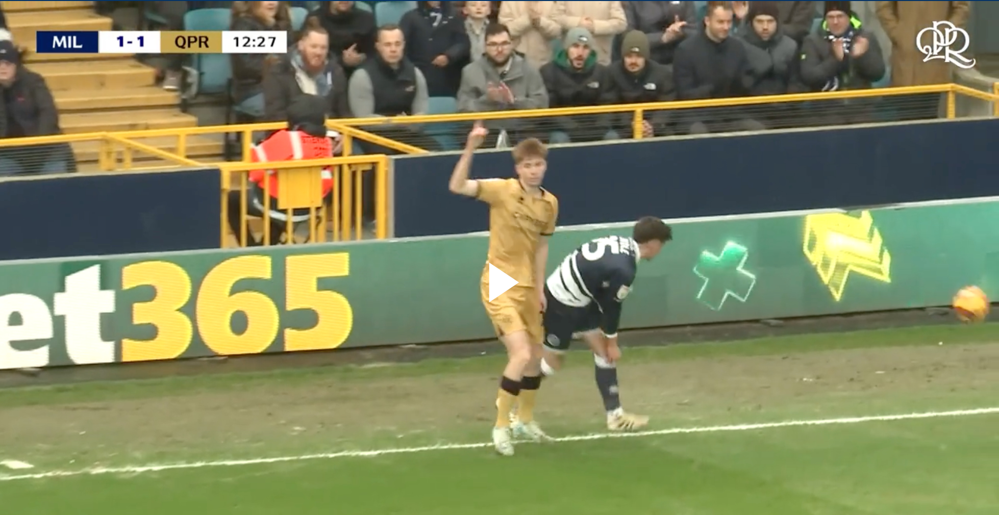
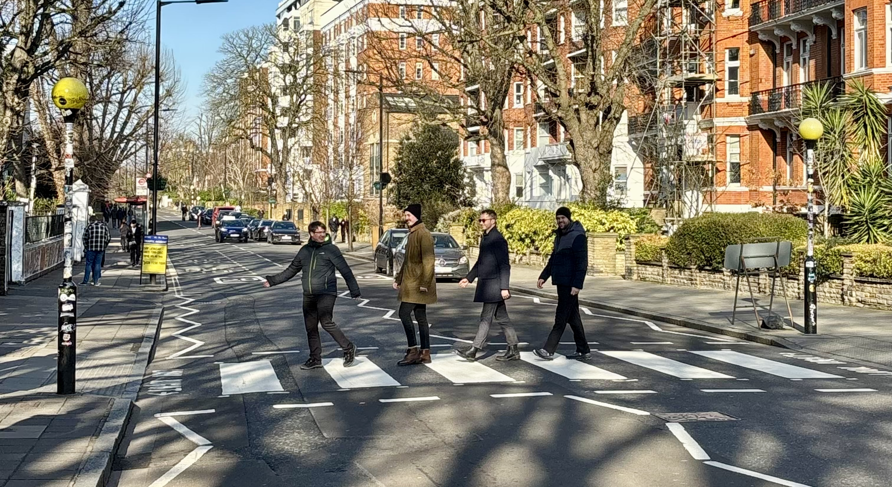
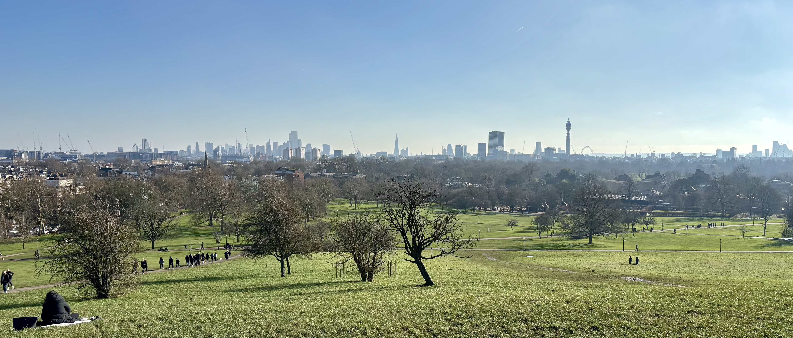

 

Cesta do [Londýna](https://cs.wikipedia.org/wiki/Lond%C3%BDn) přišla relativně spontánně. Na podzim minulého roku nás totiž Kuba pozval na oslavu svých 30. narozenin, a tak jsme začali přemýšlet o vhodném dárku. Nejdřív jsme se doma domluvili, že na oslavu přineseme obálku, ale potom se mi to rozleželo a řekl jsem si, že takto se prezentovat nechci. A protože jsme s Kubou v minulosti párkrát jeli na fotbal a vždy to byl skvělý zážitek, napadlo mě, že bychom se se zbytkem rodiny mohli složit a s Kubou vyrazit na fotbal znovu! Zmobilizoval jsem proto ostatní a začal celou akci plánovat. Barči jsem se zeptal, kdy má Kuba volný víkend, rodiče jsem poprosil o finanční příspěvek a Bertovi se Zouhym jsem nabídl fotbalový zájezd do [Londýna](https://cs.wikipedia.org/wiki/Lond%C3%BDn). Všechno do sebe hezky zapadlo, a tak jsem už za pár dní objednával letenky a ubytování.

Jednalo se o víkend, v jehož průběhu měly v [Londýně](https://cs.wikipedia.org/wiki/Lond%C3%BDn) hrát tři domácí týmy [Premier League](https://cs.wikipedia.org/wiki/Premier_League), a tak jsem očekával, že by mohla být velká šance podívat se v průběhu 3 dní alespoň na 2 zápasy nejlepší fotbalové ligy světa. To ale nakonec nevyšlo. Když [Premier League](https://cs.wikipedia.org/wiki/Premier_League) za pár týdnů zveřejnila program kola, zjistil jsem, že [Arsenal](https://cs.wikipedia.org/wiki/Arsenal_FC) a [Brentford](https://cs.wikipedia.org/wiki/Brentford_FC) budou hrát v něděli hned po sobě a [Chelsea](https://cs.wikipedia.org/wiki/Chelsea_FC) nastoupí proti [West Hamu](https://cs.wikipedia.org/wiki/West_Ham_United_FC) v pondělí večer, kdy se budeme vracet domů. Nakonec jsme ale přecijen naplánovali 2 zápasy: na sobotu utkání mezi [Millwallem](https://cs.wikipedia.org/wiki/Millwall_FC) a [QPR](https://cs.wikipedia.org/wiki/Queens_Park_Rangers_FC) v rámci druhé nejvyšší anglické ligy [Championship](https://cs.wikipedia.org/wiki/EFL_Championship) a na neděli zápas mezi [Arsenalem](https://cs.wikipedia.org/wiki/Arsenal_FC) a [Manchesterem City](https://cs.wikipedia.org/wiki/Manchester_City_FC), ve kterém se mělo bojovat o nejvyšší příčky [Premier League](https://cs.wikipedia.org/wiki/Premier_League).

Kuba při oslavě vypadal, že má z dárku radost, a tak jsme koupili lístky na zápasy a vyrazili společně s ním, Bertem a Zouhym do [Londýna](https://cs.wikipedia.org/wiki/Lond%C3%BDn)!

 

#### DEN 0

Letadlo nám letělo v pátek pozdě večer z Brna. Do práce jsem sice nešel, ale ani tak jsem moc nestíhal. Celý den totiž u nás byli truhláři, kteří nám dodělávali pracovnu a lavici v kuchyni. Když kolem 16. hodiny odešli, pustili jsme se do úklidu. Než jsme ale vysáli, vytřeli, najedli se a já se sbalil, bylo už skoro 19 hodin a já moc nestíhal. I proto jsem si zavolal Bolta a přesunul se na brněnské letiště nejrychlejším možným způsobem.

V odletové hale jsem se sešel se zbytkem party a ve 21:45 jsme společně odletěli do [Londýna](https://cs.wikipedia.org/wiki/Lond%C3%BDn). V průběhu dvouhodinového letu jsem poslouchal hudbu a snažil se usnout. Moc mi to ale nešlo. Po příletu na [Stansted](https://cs.wikipedia.org/wiki/Leti%C5%A1t%C4%9B_Lond%C3%BDn-Stansted) jsme nastoupili do [Tesly](https://cs.wikipedia.org/wiki/Tesla_(americk%C3%A1_firma)) pana Saida, který nás odvezl na hotel. Přestože cesta trvala skoro hodinu a půl, díky upovídanému Turkovi z [Izmiru](https://cs.wikipedia.org/wiki/Smyrna) rychle utekla!

Na hotel jsme dorazili kolem půl jedné v noci. Po check-inu jsme si řekli, že zajdeme ještě na jedno rychlé pivo. A nakonec bylo rychlejší, než jsem čekal. Když jsme přišli do hospody kousek od hotelu, bylo 0:50. Barman nám řekl, že nám jedno pivo natočí, ale v 1 hodinu zavírá. Moc jsme tomu nevěřili, protože v hospodě bylo plno. Vzali jsme si proto pivo, které nám natočil, a šli jsme si sednout ke stolu v rohu místnosti. Přesně v 1:00 se vypla hlasitá hudba a obsluha začala všem rozdávat plastové kelímky, do kterých jsme si měli pivo přelít a vypadnout. My jsme nic nepřelévali, rychle jsme dopili a zamířili zpět na hotel.

Cestou se stala ještě jedna hodně zajímavá věc -- na ulici jsme viděli lišku. Myslím si, že to bylo poprvé v mém životě, kdy jsem toto zvíře viděl ve "volné přírodě". A přestože bych nikdy nečekal, že ji uvidím právě v [Londýně](https://cs.wikipedia.org/wiki/Lond%C3%BDn), po návratu domů jsem zjistil, že lišky jsou v hlavním městě Anglie relativně běžné. Celkem jich na území celého města žije přibližně 10,000 kusů a jak je vidět [zde](https://www.theatlantic.com/photo/2023/07/photos-london-urban-foxes/674870/), lišky se v [Londýně](https://cs.wikipedia.org/wiki/Lond%C3%BDn) pohybují na mnohem frekventovanějích místech, než jsou opuštěné noční ulice čtvrti [Hammersmith](https://en.wikipedia.org/wiki/Hammersmith).

 

#### DEN 1

Protože Zouhy v [Londýně](https://cs.wikipedia.org/wiki/Lond%C3%BDn) ještě nebyl, Kuba do programu na první den zařadil největší londýnské památky.

Po snídani na hotelu jsme proto sedli na metro a přesunuli se na zastávku St. James’s Park. Tam jsme si vyfotili Westminster Abbey, Big Ben a London Eye a poté pokračovali podél Temže až ke galerii Tate Modern. Po krátké prohlídce budovy, která dříve sloužila jako elektrárna, jsme přešli řeku po Millenium Bridge a kolem St. Paul’s Cathedral se dostali až do [čtvrti City](https://cs.wikipedia.org/wiki/City_(Lond%C3%BDn)). Tam jsme se propletli mezi moderními výškovými budovami, až jsme přišli do [Barbicanu](https://cs.wikipedia.org/wiki/Barbican_Centre), kulturního centra, které vzniklo mezi 60. a 80. lety minulého století na místě zničeném během bombardování města za druhé světové války. [Barbican](https://cs.wikipedia.org/wiki/Barbican_Centre) sice zvenčí vypadá jako betonové monstrum, ale uvnitř působí jako příjemná oáza klidu v jinak rušné [čtvrti City](https://cs.wikipedia.org/wiki/City_(Lond%C3%BDn)).

Po obědě v restauraci Globe jsme se podívali na [budovu](https://cs.wikipedia.org/wiki/Budova_poji%C5%A1%C5%A5ovny_Lloyds) britské společnosti [Lloyd's of London](https://cs.wikipedia.org/wiki/Lloyd%27s_of_London), která je specifická tím, že všechny její technické prvky jsou vypuštěny na fasádu budovy. Následovala krátká zastávka u Tower of London a přechod po stejnojmenném mostě na druhý břeh řeky Temže, kde jsme si zavolali řidiče Uberu Simona.

Ten nás odvezl ke stadionu [The Den](https://en.wikipedia.org/wiki/The_Den), kde svoje domácí zápasy hraje tým [Millwall FC](https://en.wikipedia.org/wiki/Millwall_F.C.), jeden z nejnenáviděnějších klubů v celé Anglii. Jejich pokřik "No one likes us, we don’t care, we are Millwall, super Millwall" je toho ostatně důkazem. [Zápas](https://www.livesport.cz/zapas/GnXgLCyI/#/prehled-zapasu/) mezi domácím týmem a hostujícím [Queens Park Rangers](https://en.wikipedia.org/wiki/Queens_Park_Rangers_F.C.) začal ve vysokém tempu. Než jsme si stihli sednou na místa, celý stadion se už radoval z gólu. Hosté však na nic nečekali a ve 3. minutě vyrovnali na 1:1. Do konce první půle se ještě jednou trefili millwallští lvi. Po přestávce už gól nepadl, a tak zápas skončil lépe pro domácí, kteří i přes závěrečný tlak hostů udrželi těsné vítězství 2:1. Zajímavé na zápase bylo, že jsme si koupili lístky do první řady, takže je možné některé z nás najít na [sestřihu utkání](https://www.youtube.com/watch?v=2PH7-2W9NO8&t=38s).

 

*Pohled z našich míst na hřiště.*

 

*Známé tváře v ochozech stadionu [The Den](https://en.wikipedia.org/wiki/The_Den) v [Londýně](https://cs.wikipedia.org/wiki/Lond%C3%BDn).*

 

Po závěrečném hvizdu jsme si společně s domácími fanoušky ještě zazpívali rockovou pecku [Rocking All Over The World od Status Quo](https://youtu.be/17j4rFPAaLY?si=B1ZtlQORBslmDBOg&t=14) a poté se už vydali na cestu do [Chinatownu](https://cs.wikipedia.org/wiki/Chinatown_(Lond%C3%BDn)). Tam jsme se plánovali najíst. Kvůli oslavám čínského nového roku byly ale všechny podniky obsazené a v ulicích se nedalo hnout. Když už jsme to chtěli v [Chinatownu](https://cs.wikipedia.org/wiki/Chinatown_(Lond%C3%BDn)) vzdát a jít hledat restauraci jinam, našli jsme podnik, kde se právě uvolnil stůl. Objednali jsme si sdílené menu pro 4 osoby o celkem 4 chodech.

- První předkrm: Výběr z menších kousků masa a smažená řasa.
- Druhý předkrm: Jarní závitky z kachního masa, které jsme si sami připravovali na talíři.
- Hlavní chod: Několik masových jídel se zeleninou (hovězí, kuřecí, krevety), smažené mořské plody, rýže a pak choi.
- Koláček štěstí: Do něj mi sám osud vepsal, že se stanu bohatým. Předpokládám, že se to asi nebude týkat peněz, když jsem pár dní před odletem dostal v práci výpověď.

Osobně mi přišlo, že jsem byl docela najezený už po kachních závitcích, nicméně když se přinesl hlavní chod, museli jsme alespoň něco sníst. I proto jsem byl při odchodu z restaurace dost přejezený a chvíli jsem se dost bál, aby mi nebylo špatně. Když jsem ale po příjezdu do [Hammersmith](https://en.wikipedia.org/wiki/Hammersmith) dali ještě jedno pivo v [divno-hospodě](https://maps.app.goo.gl/qRqm1CeUn8j6mMFM6) vedle hotelu, příjemně mi slehlo a všechno bylo v pohodě.

 

#### DEN 2

Na druhý den Kuba naplánoval prohlídku několika méně známých, ale o to zajímavějších míst.

První z nich byla brutalistická rezidenční budova [Trellick Tower](https://en.wikipedia.org/wiki/Trellick_Tower) od architekta [Ema Goldfingera](https://en.wikipedia.org/wiki/Ern%C5%91_Goldfinger) z roku 1972. V okolí tohoto betonového monstra, které je dnes zapsáno na seznamu památkově chráněných budov, jsme nepotkali jediného turistu. A moc se tomu nedivím. Pokud bych se na místě pohyboval sám po setmění, měl bych asi trošku nahnáno. Celé okolí budovy totiž působilo dost "shady".

Následoval krátký přesun autobusem na [Abbey Road](https://en.wikipedia.org/wiki/Abbey_Road,_London), kde jsme se nejdřív podívali na další bytový dům [Alexandra & Ainsworth Estate](https://en.wikipedia.org/wiki/Alexandra_Road_Estate) a poté se prošli po jedné z nejslavnějších londýnských ulic až ke [stejnojmennému nahrávacímu studiu](https://en.wikipedia.org/wiki/Abbey_Road_Studios). U něj se nachází nejen obchod se suvenýry, ale hlavně [přechod](https://maps.app.goo.gl/WEi7PSfKt2pJBD6LA), který je zachycený na [jedenáctém studiovém albu](https://cs.wikipedia.org/wiki/Abbey_Road) skupiny [Beatles](https://cs.wikipedia.org/wiki/The_Beatles). Protože i my jsme v ten den byli čtyři, rozhodli jsme se oslovit francouzského turistu a s jeho pomocí zreplikovat slavnou fotografii. Když uvážím, že po [přechodu](https://maps.app.goo.gl/WEi7PSfKt2pJBD6LA) stále někdo chodil a na ulici jezdila auta, myslím, že výsledek není tak špatný!

 

*Předělávka slavné fotky mohla být samozřejmě lepší. Až doma jsem si uvědomil, že jsme šli ve špatném směru. 😁*

 

Od nahrávacího studia jsme pokračovali dál k vodě. Cestou jsme se zastavili u kriketového stadionu [Lord's Cricket Ground](https://en.wikipedia.org/wiki/Lord%27s) a poté se už napojili na stezku pro pěší podél kanálu [Regent’s Canal](https://en.wikipedia.org/wiki/Regent%27s_Canal). Ten mimo jiné vede kolem [londýnské zoo](https://cs.wikipedia.org/wiki/Lond%C3%BDnsk%C3%A1_zoologick%C3%A1_zahrada) a parku [Primrose Hill](https://en.wikipedia.org/wiki/Primrose_Hill), odkud byl nádherný výhled na město. Pod kopcem [Primrose](https://en.wikipedia.org/wiki/Primrose_Hill) jsme udělali občerstvovací pauzu v jedné z typických anglických hospod a poté pokračovali podél vody až na [Camden market](https://camdenmarket.com/), kde jsme si dali oběd v jednom z pouličních stánků. Po úzkých chodníčcích kolem vody jsme poté pokračovali dál, až jsme dorazili na nádraží [King’s Cross](https://cs.wikipedia.org/wiki/N%C3%A1dra%C5%BE%C3%AD_King%27s_Cross).

 

*Výhled na město z kopce [Primrose Hill](https://en.wikipedia.org/wiki/Primrose_Hill).*

 

Tam jsme nastoupili na metro a vyrazili na fotbalový stadion [Emirates Stadium](https://en.wikipedia.org/wiki/Emirates_Stadium), kde nás čekal nezapomenutelný zážitek v podobě skvělého fotbalu, eletrizující atmosféry a především drtivé výhry domácího [Arsenalu](https://cs.wikipedia.org/wiki/Arsenal_FC) v poměru 5:1 nad [obhájci titulu](https://cs.wikipedia.org/wiki/Manchester_City_FC) z modré části [Manchesteru](https://cs.wikipedia.org/wiki/Manchester). Po [zápase](https://www.livesport.cz/zapas/8E9Tec1C/#/prehled-zapasu/) jsme ještě navštívili obchod se suvenýry, udělali si fotku vedle sochy legendárního [Thierry Henryho](https://cs.wikipedia.org/wiki/Thierry_Henry) a poté se šli podívat na [Highbury](https://cs.wikipedia.org/wiki/Arsenal_Stadium), starý stadionu [Arsenalu](https://cs.wikipedia.org/wiki/Arsenal_FC), který je dnes přestavený na byty. Moc jsem od této návštěvy nečekal, ale byl jsem hodně příjemně překvapený. Dle mého názoru se architektům podařilo velice vkusně zakomponovat byty do tribun stadionu, ale přitom ponechat jeho původní prvky. Zvenčí je tím pádem vidět střecha původní tribuny, nebo místa, kudy vedlo schodiště do horních pater stadionu. A na místě, kde se dříve kopalo do kulatého nesmyslu, je nyní vnitroblok s posezením a okrasnou zelení.

 

*[Emirates Stadium](https://en.wikipedia.org/wiki/Emirates_Stadium) je pravděpodobně jeden z nejhezčích fotbalových stadionů, na kterém jsem v životě byl.*

 

Protože už bylo pozdě, zašli jsme si na jídlo do restaurace [Nando’s](https://www.nandos.com/) kousek od našeho hotelu, dali jedno klasické pivo v [divno-hospodě](https://maps.app.goo.gl/qRqm1CeUn8j6mMFM6) a šli si lehnout.

 

#### DEN 3

Dlouho jsem přemýšleli, co poslední den před odletem dělat. Nakonec jsme naplánovali návštěvu mrakodrapu [Bishopsgate 22](https://cs.wikipedia.org/wiki/22_Bishopsgate), odkud je nádherná vyhlídka na centrum města. Příjemným benefitem je i skutečnost, že za vstup na vyhlídku [Horizon 22](https://horizon22.co.uk/) se nic neplatí.

Kolem 11. hodiny jsme nasedli na vlak a přesunuli se na [letiště Stansted](https://cs.wikipedia.org/wiki/Leti%C5%A1t%C4%9B_Lond%C3%BDn-Stansted). Následovala až podezřele rychlá pasová a bezpečnostní kontrola, oběd a odlet do Brna, kam jsme dorazili v 17:30 místního času.

 

#### DOJMY Z LONDÝNA

**Ted Mosby, Architect!** Pokud správně počítám, [Londýn](https://cs.wikipedia.org/wiki/Lond%C3%BDn) jsem během tohoto prodlouženého víkendu navštívil už pošesté a upřímně jsem si před odletem nemyslel, že mě ještě něco překvapí. Kuba ale naplánoval skvělý program a zavedl nás i na místa, kde jsem ještě nebyl. Navíc si ke každému místu připravil krátký komentář plný zajímavostí a historie, takže i škaredou betonovou bytovku dokázal vybarvit v tom nejlepším světle! Náš víkend byl tím pádem takovou menší komentovanou prohlídkou města z pohledu architekta, což člověk nezažije každý den a já jsem za to opravdu moc vděčný. Díky, Kubo! 🏛️

**Stay humble, you cunt!** Atmosféra na stadionech je jedním z hlavních důvodů, proč tak rád na fotbalové zápasy jezdím. Vášniví fanoušci. Pokřiky. Hymny. Pyrotechnika. Prostě všechno, co člověk nikdy v obýváku u televize nezažije. A přijde mi, že tentokrát to bylo zase o něco lepší než minule! Když fanoušci Millwallu začali jako jeden muž hlasitě řvát "Miiiiilll", běhala mi husina po zádech. Když se fanoušci Arsenalu vysmívali Erlingu Haalandovi v pokřiku "Stay humble, you cunt!", musel jsem se smát. A když po skončení zápasu celý Emirates zazpíval [klubovou hymnu](https://www.youtube.com/watch?v=X3ZDwnGqLY4), ve které se zpívá "North London forever, whatever the weather", chtělo se mi smát a brečet zároveň! 💥

 

#### FOTKY

Fotky z [Londýna](https://cs.wikipedia.org/wiki/Londýn)
najdete [zde](https://photos.app.goo.gl/etgThqNccbq8deXs7).
