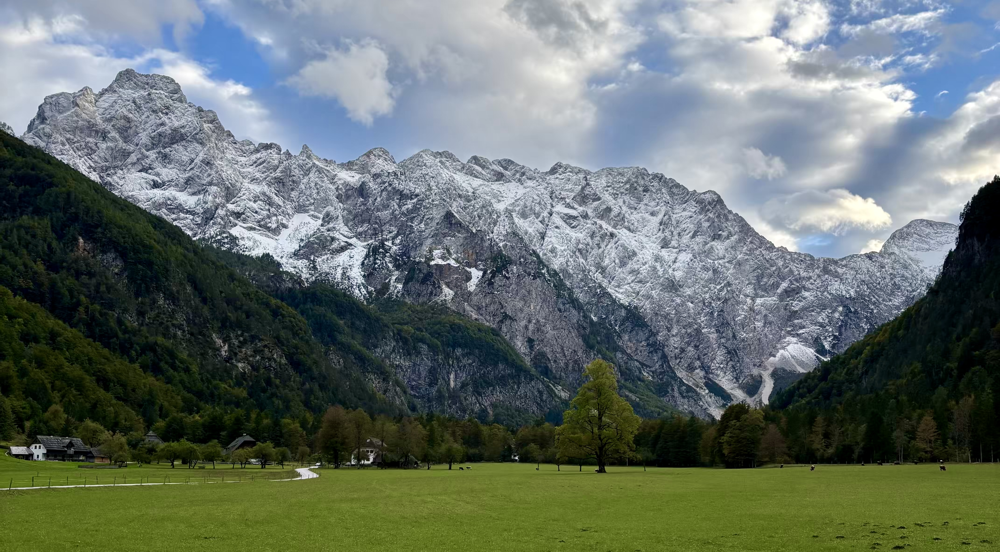
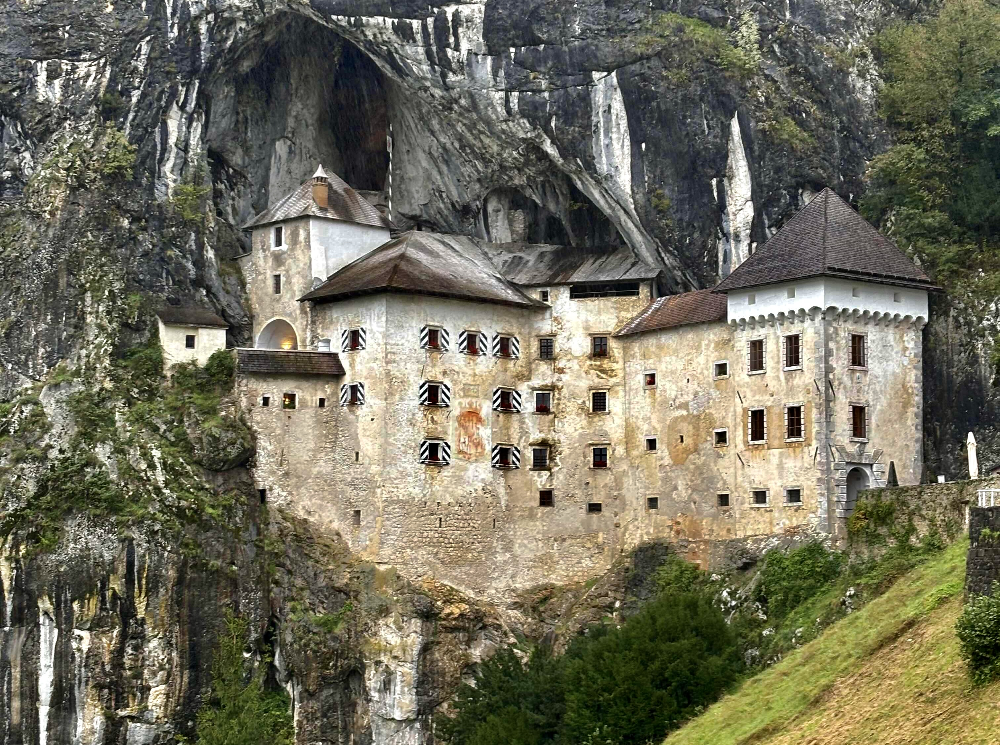
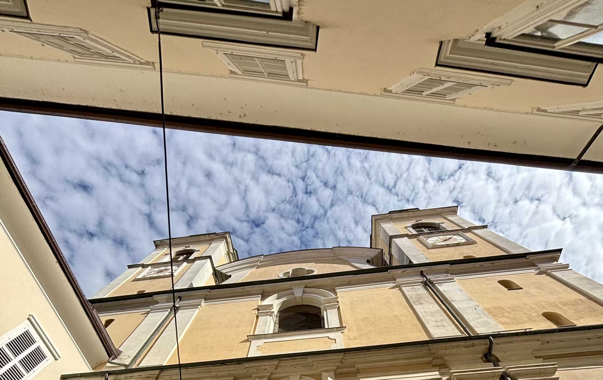
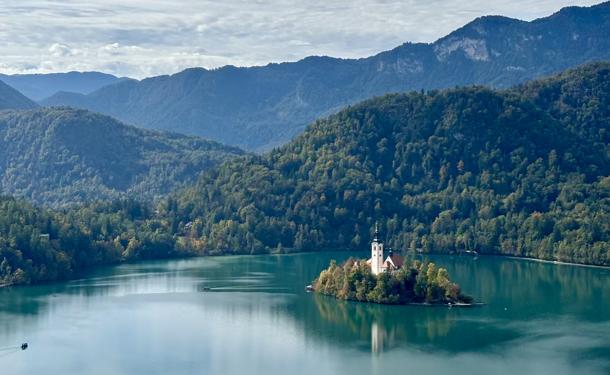
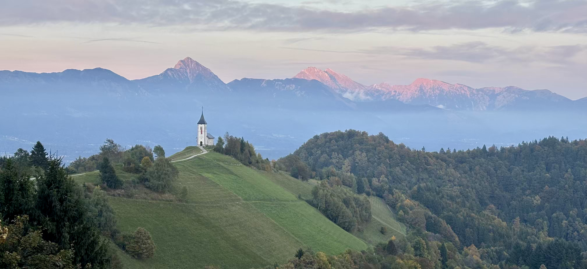

&nbsp;

Naprosto upřímně musím říct, že ještě na začátku letních prázdnin - ne že bych nějaké měl - jsem plánoval, že bych jel v polovině října na [pythoní konferenci](https://pycon.org/), a to buď do [Bagkoku](https://cs.wikipedia.org/wiki/Bangkok), nebo do [Jihoafrické republiky](https://cs.wikipedia.org/wiki/Jihoafrick%C3%A1_republika). Když jsem tento svůj plán ale přednesl doma, nesetkal se úplně s pochopením. Namísto toho mi bylo politicky vysvětleno, že už jsem tento rok navštívil dvě zahraniční konference, ale společnou dovolenou jsme zatím absolvovali jen jednu. Abych tím pádem vyrovnal misky vah, připravil jsem na další den prezentaci s možnými destinacemi naší další cesty... a Klára si vybrala [Slovinsko](https://cs.wikipedia.org/wiki/Slovinsko).

&nbsp;

#### DEN 0: sobota 4. října 2025

Přestože mám ve zvyku svoje cesty plánovat dopředu, v případě cesty do [Slovinska](https://cs.wikipedia.org/wiki/Slovinsko) jsem nechal vše na poslední chvíli. Hotel jsem objednal den před odjezdem a finální program jsem piloval ještě na místě. Není tedy divu, že ani v den odjezdu jsme nikam moc nespěchali. Dopoledne jsem tedy zalil kytky na balkoně, vynesl odpadky a ještě dodělával poslední resty do práce. Po obědě jsme si sbalili věci a vyrazili na skoro šestihodinovou cestu na [Balkán](https://cs.wikipedia.org/wiki/Balk%C3%A1n).

Hned po první hodině v autě jsme se zastavili v [Mikulově](https://cs.wikipedia.org/wiki/Mikulov) ve vynikající [kavárně 48° 16°](https://www.instagram.com/4816cafebar/?hl=cs) a na večeři jsme zašli v [Mariboru](https://cs.wikipedia.org/wiki/Maribor) do podniku [Mandl food and bar](https://www.instagram.com/mandlfoodbar/?hl=cs), kde jsem si dal naprosto famózní burger se smaženým kuřecím masem a hranolky.

Na hotel kousek od [Lublaně](https://cs.wikipedia.org/wiki/Lubla%C5%88) jsme dorazili až kolem 21. hodiny. Je ale nutné říct, že [náš hotel](https://www.booking.com/hotel/si/b-b-bizeljcan-rooms-ljubljana.html) vlastně nebyl hotel a ani tím pádem neměl hotelovou restauraci. Jednalo se spíše o několik apartmánů ve stylu bed & breakfast s tím, že snídaně se podávala ve [stejnojmenné italské restauraci v též budově](https://miononno.com/). A podle mě měly obě zařízení - [restaurace](https://miononno.com/) i [apartmány](https://www.booking.com/hotel/si/b-b-bizeljcan-rooms-ljubljana.html) - téhož majitele.

Když jsme přijeli, byla už tma a nám se nedařilo přijít na to, jak se dostat do našeho apartmánu. Šli jsme proto do restaurace, kde jsme se seznámili s jedním pánem – říkejme mu třeba Anton. Anton byl oblečený jako číšník, ale později se ukázalo, že toho v podniku dělá mnohem víc. O pár dní později se třeba staral o zahradu, nebo opravoval plot. Dodnes tedy nevím, jaká je Antonova oficiální funkce v tomto prapodivném zařízení.

Nicméně Anton nám poradil, jak se dostaneme do našeho apartmánu, takže jsme se ubytovali, vybalili a šli se lehnout.

&nbsp;

#### DEN 1: neděle 5. října 2025

První den ve [Slovinsku](https://cs.wikipedia.org/wiki/Slovinsko) jsem nevstával úplně v klidu. A ano, souviselo to s Antonem. Anton mě totiž předchozí den večer trošku vycukal, co se týče fungování snídaní. Podle jeho slov snídaně připravuje Denis "from outside" – whatever it means. A protože Denis měl v neděli na 7:30 připravovat snídani pro 20 Italů, Anton nám poradil, abychom do restaurace nepřišli moc pozdě, aby na nás Denis nemusel dlouho čekat. A protože jsem nevěděl, jak Denis bude reagovat, když přijdeme na 10. hodinu, snažil jsem se ráno vypravit relativně brzy. I proto jsme vstali už v 8 hodin, oblékli se a vyrazili do restaurace. Tam už na nás čekal Denis, snědý muž s vizáží mafiána, výraznými kérkami a hlavně milým úsměvem. V restauraci už nebylo po Italech ani vidu ani slechu. Když nepočítám Denise, byli jsme tam sami, a tak jsme si mohli nerušeně vychutnat to, co nám Italové nechali. Klára si každé ráno nabrala 3 palačinky, pistáciovou nutellu a jogurt. Já jsem v následujících dnech volil mezi dvěma možnostmi: smaženými vajíčky, nebo houskou s máslem, tvrdým sýrem a šunkou.

Po snídani jsme nasedli do auta a vydali se do vesničky Predjama, kde jsme se chystali navštívit místní [hrad](https://cs.wikipedia.org/wiki/Predjamsk%C3%BD_hrad). Původně jsme měli v plánu začít naši dovolenou v hlavním městě, ale venku bylo počasí, že by ani psa nevyhnal, a tak jsme se rozhodli na neděli zařadit program, při kterém jsme se mohli schovat někde uvnitř.

Po příjezdu do Predjamy se nám nedařilo zaparkovat, nejdřív jsme přijeli na parkoviště, u kterého jsem si vzal ze stojanu lísteček, ale nezvedla se závora. Potom jsme se snažili dostat na druhé parkoviště, na kterém už ani nebyla mašinka na lístečky a závora se tím pádem taky nezvedala, až jsme celí zoufalí nechali auto v odstavném pruhu u hlavní cesty. Tam si nás ale hned odchytla paní výběrčí parkovného, která nám řekla, abychom jeli na druhé zmíněné parkoviště a ona nás na dálku pustí. Než jsme s ní ale všechno vykomunikovali, napršelo nám do auta a já měl za tu chvíli úplně promočený levý rukáv od košile. Palubní počítač mi v tu chvíli ukazoval venkovní teplotu 4 stupně a Klára hlásila pocitovou teplotu -4 stupně. Ven se mi tedy v mokrém oblečení moc nechtělo. Nicméně hrad byl od parkoviště kousíček, takže jsme se pořádně oblékli a vyrazili jsme na prohlídku.

&nbsp;

*[Predjamský hrad](https://cs.wikipedia.org/wiki/Predjamsk%C3%BD_hrad).*

&nbsp;

V chladném temném hradu jsme strávili asi hodinu. Přestože prohlídka nebyla komentovaná, díky dobrému značení jsme se mnohokrát neztratili a díky informačním tabulím s krátkými texty jsme se o celém komplexu dozvěděli spoustu zajímavých informací. Počasí nám sice nepřálo a všude byla zima, ale [hrad](https://cs.wikipedia.org/wiki/Predjamsk%C3%BD_hrad) na mě udělal moc dobrý dojem. Když jsem nad tím potom přemýšlel, myslím, že jsem v podobném komplexu vytesaném do skály nikdy nebyl a upřímně se mi to moc líbilo. Nejenže celý komplex působil opravdu monumentálně od první chvíle, co jsem ho spatřil z dálky, ale navíc se z něj naskýtaly moc pěkné výhledy do okolní krajiny. 

Po prohlídce jsme si sedli do jedné z restaurací v podhradí a dali si oběd. Na 15. hodinu odpoledne jsme měli zakoupené lístky do slavných [Postojnských jeskyní](https://cs.wikipedia.org/wiki/Postojensk%C3%A1_jeskyn%C4%9B). Po obědě jsme proto měli ještě hodně času, a tak jsme se rozhodli, že na půli cesty mezi hradem a jeskyněmi (obě místa jsou od sebe vzdálena asi 10 km) zastavíme na kávu v podniku Lipa Plac. Tam jsme si kromě kávy dali i vynikající palačinky. Nevýhodou ale bylo, že v restauraci obsluhovala jen jedna paní servírka, která moc nestíhala, a tak jsme na kávu i jídlo čekali tak dlouho, až jsem byl nervózní, abychom prohlídku jeskyní vůbec stihli.

To se nakonec povedlo! Do jeskyní jsme přijeli na čas a kolem 15. hodiny už jsme seděli ve vláčku, který nás společně s ostatními návštěvníky zavezl asi 60 m pod zem, kde začala komentovaná prohlídka s průvodcem. Ten nám (snad jako v každé jeskyni) nejdříve vysvětlil rozdíl mezi stalagnitem, stalagtitem a stalagnátem, zmínil, že krápníky rostou rychlostí 1mm za 10 let, ukázal nám bílou, resp. červenou místnost, ve kterých jsou krápníky zabarveny podle různých prvků, a to podle vápníku, resp. železa a nakonec nám ukázal obrovské akvárium s několika exempláři vzácného živočicha macaráta jeskynního. Jedná se o místního endemita, který vypadá podobně jako axolotl. Oproti jeho slavnějšímu příbuznému je však slepý a v současné chvíli velmi ohrožený.

Po konci skoro dvouhodinové prohlídky jeskynního komplexu jsme nasedli znovu na vláček, který nás odvezl k východu, my jsme poté nasedli do auta a frčeli zpět na hotel. Cestou jsme se chtěli zastavit ještě někde na jídlo, ale restaurace, kterou jsme si vytipovali neměla volný stůl a my ani neměli po odpoledních palačinkách tak velký hlad, takže jsme se rozhodli, že večeři výjimečně vynecháme.

Po příjezdu na hotel jsme se umyli, chvíli se dívali na [Netflix](https://cs.wikipedia.org/wiki/Netflix) a šli si brzy lehnout.

&nbsp;

#### DEN 2: pondělí 6. října 2025

Po snídani jsme nasedli do auta a vyrazili do [Kamnických Alp](https://cs.wikipedia.org/wiki/Kamnicko-Savinjsk%C3%A9_Alpy) na severu země.

První zastávkou bylo [Planšarské jezero](https://www.jezersko.info/plansarske-jezero.html) v malebné vesnici [Jezersko](https://cs.wikipedia.org/wiki/Ob%C4%8Dina_Jezersko). Auto jsme zaparkovali kousek vedle jezera ve tvaru srdce a vydali jsme se údolím Ravenska Kočna na cca 5 km dlouhý okruh. Ten nás zavedl k úpatí vysokých skal pokrytých sněhem, které v kombinaci se zelenými loukami a stromy v údolí tvořily nádhernou horskou scenérii. Po návratu k jezeru jsme nasedli do auta a jeli na jídlo do jediné otevřené restaurace v obci [Jezersko](https://cs.wikipedia.org/wiki/Ob%C4%8Dina_Jezersko).

&nbsp;

*Pohled na zasněžené kopce z údolí Ravenska Kočna.*

&nbsp;

Po jídle jsme si udělali krátkou zastávku u kostela sv. Osvalda, odkud byl nádherný výhled na celou vesnici [Jezersko](https://cs.wikipedia.org/wiki/Ob%C4%8Dina_Jezersko). Po krátké zastávce jsme se vydali na cca hodinový přejezd přes horský průsmyk vedoucí Rakouskem, který nás zavedl až do nádherného [údolí Logar](https://en.wikipedia.org/wiki/Logar_Valley_(Slovenia)). Přestože jsem od tohoto dne našeho programu čekal hodně, údolí Logar naprosto předčilo moje očekávání. Hned po vjezdu do údolí se před námi rozprostřela nádherná zelená louka, na které se pásly krávy a za ní se tyčil obrovský skalní štít zaprášený sněhem. Když jsem přemýšlel, k čemu bych toto místo přirovnal, napadlo mě, že vypadá jako Yosemitské údolí, jen je o něco menší, s mnohem menším počtem lidí a také špičatějšími skalami. Nebo by se údolí dalo přirovnat k Řece, jen s méně domy a skutečnými horami. A těm, kdo nikdy nebyli v Yosemitu ani v Řece, bych řekl, že to místo vypadalo jako ráj na zemi! To se sice představuje hůře, ale podle mě to hezky odráží to, jak moc se mi tam líbilo.

Po příjezdu do údolí jsme se zastavili na kávu a zákusek v jednom z místních hotelů a poté jsme si udělali krátkou procházku k vodopádu Rinka nacházejícímu se u skal na samém konci [údolí Logar](https://en.wikipedia.org/wiki/Logar_Valley_(Slovenia)). Cesta k vodopádu podle mě neměla ani kilometr, ale vedla tak prudkým kopcem, že se mi místy dost výrazně vracel jablečný štrůdl s vanilkovou zmrzlinou, na kterém jsem si před tím velice pochutnal. Naštěstí všechno zůstalo tam, kde mělo, a tak jsme si mohli užít pěkný výhled na 100 metrů vysokou skálu, ze které padala voda do malého bazénku s průzračnou vodou.

Po krátké procházce jsme se rozhodli ještě na chvíli vrátit zpět do středu [údolí Logar](https://en.wikipedia.org/wiki/Logar_Valley_(Slovenia)) k [Penzionu Ojstrica](https://www.booking.com/hotel/si/kmecka-hisa-ojstrica.cs.html), kde jsme zaparkovali auto a ještě jsme se prošli podél nádherných zelených luk, u čehož jsme se kochali pohledem na okolní zasněžené kopce. Myslím, že kdybychom se nemuseli vracet zpět, kochal bych se tam ještě dnes. To ale nešlo, a tak jsme se kolem 18. hodiny s [údolím Logar](https://en.wikipedia.org/wiki/Logar_Valley_(Slovenia)) rozloučili a vydali se zpět do [Lublaně](https://cs.wikipedia.org/wiki/Lubla%C5%88).

Na hotel jsme dorazili až před 20. hodinou, snědli zbytek pizzy, který si Klára nechala zabalit u oběda a šli si lehnout.

&nbsp;

#### DEN 3: úterý 7. října 2025

Po snídani jsme nažhavili navigaci a vyrazili směr [Velika Planina](https://en.wikipedia.org/wiki/Big_Pasture_Plateau).

Cestou mě přepadlo náhlé nutkání si tzv. zajít na velkou, takže jsem to v serpentinách [Kamnických Alp](https://cs.wikipedia.org/wiki/Kamnicko-Savinjsk%C3%A9_Alpy) nevydržel, nechal jsem auto na štěrku vedle cesty a odběhl do lesa vykonat potřebu. Těsně před tím, než jsme zastavili, se mě Klára zeptala, zda to nevydržím někam do restaurace, nebo třeba na parkoviště. Při pomyšlení, že jsme za posledních 20 minut nepotkali jedinou restauraci, jsem ale další čekání nebyl ochotný riskovat a tak jsem vyrazil. O to vtipnější bylo, že když jsme se potom znovu vydali na cestu, hned za další zatáčkou stála nádherná horská putyka, kde by mě určitě přivítali s otevřenou náručí.

I kvůli neplánované zastávce v lesích jsme přijeli na parkoviště Mačkin kot až kolem 11. hodiny dopoledne. A protože vysoko v horách už byl napadlý sníh, obuli jsme si pohorky, oblékli teplé oblečení a vyrazili na [Velikou Planinu](https://en.wikipedia.org/wiki/Big_Pasture_Plateau), která byla vzdálena asi 30 minut chůzí od našeho parkoviště. Když jsme vyšli z lesů, otevřela se před námi horská plošina posetá malými dřevěnými domečky, které dříve obývali místní pastevci. Přestože dnes už v salaších nikdo nebydlí, domečky stále vlastní místní obyvatelé a zvláště v průběhu sezóny v nich vyrábí autentické výrobky z kravského mléka. Ostatně krávy jsou pro tuto oblast typické, my jsme dostali echo, že některé z nich jsou nebezpečné a nebojí se napadnout bezbranné matky, nebo dokonce malé psy – tímto zdravím do Rousínova a Lulče! Protože my jsme přijeli po sezóně, na místních stráních jsme se setkali pouze s tím, co po kravách zbylo.

&nbsp;

*[Velika Planina](https://en.wikipedia.org/wiki/Big_Pasture_Plateau).*

&nbsp;

Když jsme na náhorní plošinu dorazili, prošli jsme se mezi salašemi a poté jsme zamířili na oběd do podniku Zeleni rob, a to jediné restaurace, která je na náhorní plošině otevřená celoročně. Já jsem ochutnal směs krup a fazolí podávanou s klobásou a chlebem, Klára si dala houbovou polévku a sladký knedlík plněný tvarohem.

Po obědě jsme se vydali na okružní naučnou stezku “Po stopinjah pastirjev”, která nás – jak název napovídá – provedla po stopách pastýřů. Na skoro 7 kilometrech jsme si přečetli 11 informačních tabulí. Na nich jsme se dozvěděli mnoho zajímavostí o životě pastýřů, o místním prostředí i o zdejší flóře a fauně. Naprosto upřímně jsem vůbec nečekal, jak různorodou krajinou nás stezka provede, což hodnotím velice kladně. Stezka nejdříve začala na kamenitém vrcholu hory Gradišče a poté nás vedla dolů zasněženými loukami mezi dřevěné domečky [Veliké Planiny](https://en.wikipedia.org/wiki/Big_Pasture_Plateau). Odtamtud jsme zase vystoupali na malé skalnaté kopečky, za kterými se schovávaly salaše v části Malá Planina. Stezka následně pokračovala borovicovými lesy, vedla nás kolem malých horských jezírek, až nás vrátila z druhé strany zpět na [Velikou Planinu](https://en.wikipedia.org/wiki/Big_Pasture_Plateau).

U poslední informační tabule jsme se s náhorní plošinou rozloučili a zamířili k autu. Tam jsme si pořádně očistili špinavé boty a vydali se na hodinový přejezd zpět do Lublaně. Protože jsme už nechtěli vymýšlet další program, zamířili jsme rovnou do hotelové restaurace, kde jsme si po náročném dni dopřáli zaslouženou odměnu. Po vydatném jídle jsme zamířili na pokoj, osprchovali se a šli si brzy lehnout.

&nbsp;

#### DEN 4: středa 8. října 2025

Čtvrtý den našeho pobytu ve [Slovinsku](https://cs.wikipedia.org/wiki/Slovinsko) nás čekala návštěva [hlavního města](https://cs.wikipedia.org/wiki/Lubla%C5%88).

Z našeho hotelu nám cesta nezabrala ani půl hodiny. Auto jsme zaparkovali na parkovišti u parku Tivoli, které nám doporučil majitel našeho hotelu a poté jsme se vydali pěšky do centra.

Hned první zastávkou byla alternativní čtvrť Metelkova. Přestože průvodci hlásali, že se v ní není čeho bát, já se tam moc necítil. U nejznámějšího domu s plastikami lidských hlav se poflakovali bezdéčka, pokuřovali kdovíco a když se k nim Klára přiblížila, začali na ní něco pokřikovat. Otočili jsme se proto na podpatku a pokračovali dál v krasojízdě. Postupně jsme si prošli [Dračí most](https://cs.wikipedia.org/wiki/Dra%C4%8D%C3%AD_most), centrální tržnici a kolonádu, dále jsme se byli podívat v [katedrále sv. Mikuláše](https://cs.wikipedia.org/wiki/Katedr%C3%A1la_svat%C3%A9ho_Mikul%C3%A1%C5%A1e_(Lubla%C5%88)), až jsme dorazili k [Trojmostí](https://cs.wikipedia.org/wiki/Trojmost%C3%AD), jednomu ze symbolů města. Poté jsme si prošli druhou stranu řeky a poté zamířili na oběd do podniku Raw Pasta, kde jsme si dali… ano, těstoviny!

&nbsp;

*Detail fasády [katedrály sv. Mikuláše](https://cs.wikipedia.org/wiki/Katedr%C3%A1la_svat%C3%A9ho_Mikul%C3%A1%C5%A1e_(Lubla%C5%88)) v [Lublani](https://cs.wikipedia.org/wiki/Lubla%C5%88).*

&nbsp;

Po jídle jsme se vrátili k [Trojmostí](https://cs.wikipedia.org/wiki/Trojmost%C3%AD), prošli si historické centrum a říční promenády a zamířili jsme na [hrad](https://cs.wikipedia.org/wiki/Lubla%C5%88sk%C3%BD_hrad). Tam jsme chvíli obdivovali nádhernou vyhlídku na město a poté prozkoumali snad všechny možné zákoutí pěkně zrekonstruovaného nádvoří. Tam byla slyšet čeština snad z každého rohu, protože jsme narazili na zájezd českých důchodců!

Z [hradu](https://cs.wikipedia.org/wiki/Lubla%C5%88sk%C3%BD_hrad) jsme zamířili do hodně fancy kavárny Stow, kde jsme mimo jiné dostali výklad o kávě, kterou jsme si objednali. Pán nám přiblížil nejen odrůdu a původ, ale dal nám i přičichnout k nemletým zrnům a popsal nám chuťový profil, který jsem zapomněl ve chvíli, kdy odešel.

Cestou zpět k autu jsme to šli přes náměstí Kongresni trg, které je v průvodcích označované jako středobod [Lublaně](https://cs.wikipedia.org/wiki/Lubla%C5%88), dále přes krásnou pěší zónu za náměstím a přes park Tivoli, největší městský park ve [Slovinsku](https://cs.wikipedia.org/wiki/Slovinsko). Musím se přiznat, že od [Lublaně](https://cs.wikipedia.org/wiki/Lubla%C5%88) jsem toho moc nečekal, ale město mě velice příjemně překvapilo – nádherné historické centrum, pěkně zrekonstruované nábřeží, rozsáhlý park Tivoli v anglickém stylu i velice dobrá zkušenost s místní gastro scénou pro mě budou highlighty naší návštěvy! Ani jeden z nich ale nemá na největší highlight dne, kterým se bezpochyby stal kostel sv. Tomáše.

Když jsme přišli k autu, bylo kolem 16 hodin a my se rozhodli, že místo toho, abychom jeli na hotel, vydáme se ještě do opuštěné [vesničky Sv. Tomáš](https://en.wikipedia.org/wiki/Sveti_Toma%C5%BE,_%C5%A0kofja_Loka) v horách kousek za [Lublaní](https://cs.wikipedia.org/wiki/Lubla%C5%88), kde se nachází stejnojmenný kostelík. Ten stojí na zeleném kopci kousek za vesničkou. Když jsme ke kostelíku přišli, pomalu už zapadalo sluníčko a my tak měli možnost pozorovat, jak okolní zelené kopce vrhají stíny do údolí pod nimi. Na místě kromě nás nikdo nebyl, jen v jednom zemědělském stavení štěkal pes. A přestože se jednalo o místo mimo zář reflektorů, bylo tak pěkné a romantické, že ve mně za celý den zanechalo největší dojem.

&nbsp;

*Pohled do údolí od kostela sv. Tomáše ve [stejnojmenné vesničce](https://en.wikipedia.org/wiki/Sveti_Toma%C5%BE,_%C5%A0kofja_Loka).*

&nbsp;

Cestou zpět na hotel jsme se ještě zastavili na večeři ve městě [Škofja Loka](https://cs.wikipedia.org/wiki/%C5%A0kofja_Loka). To je známé svým zachovalým středověkým centrem, které je dnes dokonce vyhlášeno památkovou zónou.

&nbsp;

#### DEN 5: čtvrtek 9. října 2025

Po snídani jsme nasedli do auta a vyrazili k dalšímu ze symbolů [Slovinska](https://cs.wikipedia.org/wiki/Slovinsko), [jezeru Bled](https://cs.wikipedia.org/wiki/Bledsk%C3%A9_jezero), které je charakteristické malým ostrůvkem uprostřed a na něm stojícím [kostelem Nanebevzetí Panny Marie](https://cs.wikipedia.org/wiki/Kostel_Nanebevzet%C3%AD_Panny_Marie_na_ostrov%C4%9B_na_Bledsk%C3%A9m_jeze%C5%99e). Upřímně jsem si nemyslel, že u jezera strávíme tolik času. Původně jsem totiž čekal, že přijedeme, uděláme pár fotek a pofrčíme dál. Jezero je ale docela velké a ostrůvek není z příjezdové strany hezky vidět, takže jsme se rozhodli, že si uděláme krátký výšlap na [bledský hrad](https://cs.wikipedia.org/wiki/Bledsk%C3%BD_hrad), odkud bude výhled lepší. A jak jsme si to naplánovali, tak se také stalo. Cestou jsme se zastavili v kostele sv. Martina a poté si vyšlápli několik desítek dřevěných schodů na kopec nad jezerem, na jehož vrcholku ční [bledský hrad](https://cs.wikipedia.org/wiki/Bledsk%C3%BD_hrad). Na hradním nádvoří jsme si udělali několik fotek ostrůvku uprostřed jezera a poté si prošli krátkou expozici v interiéru krásně udržovaného hradního komplexu.

&nbsp;

*Známý pohled na [jezero Bled](https://cs.wikipedia.org/wiki/Bledsk%C3%A9_jezero).*

&nbsp;

Když jsme seběhli dolů k jezeru, byl už čas oběda. Proto jsme zamířili do vynikající veganské restaurace [Public & Vegan Kitchen](https://www.instagram.com/public_bled/?hl=cs), kde jsme si dali hamburger s rostlinou náhražkou masa a pečenými brambory. Potom jsme se svalili ze schodů dolů do [kavárny Park](https://www.bled.si/en/what-to-see-do/cuisine/catering-facilities/3/kavarna-park/). Ta je zajímavá tím, že v ní jako první začali vyrábět typický bledský dort kremšnita, neboli [krémeš](https://sk.wikipedia.org/wiki/Kr%C3%A9me%C5%A1). A to jsme si nemohli nechat ujít! Dortík byl vynikající, ale bylo ho tolik, že jsme se nacpali k prasknutí a já se bál, že nedojdu k autu. *Spoiler alert!* Nakonec jsem to dal.

Po návštěvě [jezera Bled](https://cs.wikipedia.org/wiki/Bledsk%C3%A9_jezero) jsme se přesunuli jen pár kilometrů za městečko. Auto jsme nechali na odstavném parkovišti a poté nasedli do shuttle busu, který nás odvezl ke vstupu do [soutěsky Vintgard](https://en.wikipedia.org/wiki/Vintgar_Gorge). Soutěska je vytesaná řekou Radovnou do skal [Triglavského národního parku](https://en.wikipedia.org/wiki/Triglav_National_Park) a je dlouhá asi 1,6 km. Nad místy hodně divokou řekou je zavěšena dřevěná lávka, po které jsme prošli celou délkou soutěsky a poté se vraceli zpět přes lesy a kopce [Triglavského národního parku](https://en.wikipedia.org/wiki/Triglav_National_Park) zpět k turistickému infocentru, kde nás zase nabral shuttle bus a odvezl zpět k autu. Celý okruh měřil necelých 6 kilometrů a vedl nádhernou krajinou parku, takže při jeho hodnocení musím říct, že jeho jedinou nevýhodou bylo, že nám přibližně v polovině začalo pršet. A pršet nepřestalo, ani když jsme dorazili k autu – spíš naopak. Přestože jsme tedy měli naplánovaný ještě další program, rozhodli jsme se jej zrušit a jet zpět na hotel.

Tam jsme dorazili kolem 18. hodiny, trošku jsme se osušili a poté si zašli na jídlo do hotelové restaurace.

&nbsp;

#### DEN 6: pátek 10. října 2025

Poslední den ve [Slovinsku](https://cs.wikipedia.org/wiki/Slovinsko) nás čekalo několik restů, které jsme v posledních dnech nestihli a to s sebou přineslo i hodně cestování. Po snídani jsme proto nasedli do auta a vydali se zpět do [Národního parku Triglav](https://en.wikipedia.org/wiki/Triglav_National_Park).

Nejdříve jsme se zastavili u mokřin [Zelenci](https://www.objevuj-slovinsko.cz/zelenci/), azurově modrého jezírka na úpatí [Julských Alp](https://cs.wikipedia.org/wiki/Julsk%C3%A9_Alpy), které obklopují mokřady a na nich vystavěné dřevěné chodníčky. Jednalo se pouze o krátkou zastávku na 20 minut, protože jezírko je malinké a dobře přístupné z příjezdové cesty. Hodinový přejezd z [Lublaně](https://cs.wikipedia.org/wiki/Lubla%C5%88) za tu nádheru ale stál.

&nbsp;

*Ani [Švýcarsko](https://cs.wikipedia.org/wiki/%C5%A0v%C3%BDcarsko), ani [Kanada](https://cs.wikipedia.org/wiki/Kanada), ale [přírodní rezervace Zelenci](https://www.objevuj-slovinsko.cz/zelenci/)!*

&nbsp;

Naše cesta pokračovala přes malebné horské městečko [Kranjska Gora](https://www.objevuj-slovinsko.cz/kranjska-gora/?gad_source=1&gad_campaignid=20671339399) do hor k dřevěné [ruské kapli](https://en.wikipedia.org/wiki/Russian_Chapel_(Vr%C5%A1i%C4%8D_Pass)), kde jsme si jen udělali pár fotek a frčeli zpět. Samotná kaplička nijak zajímavá nebyla, ale scénická cesta kolem skalnatých štítů byla sama o sobě zážitkem.

Cestou na další místo jsme se zastavili na oběd v [restauraci Veranda](https://www.tripadvisor.com/Restaurant_Review-g2554455-d10367363-Reviews-Guesthouse_Veranda_GOSTILNA-Mojstrana_Upper_Carniola_Region.html). V nějakém průvodci jsem četl, že ceny služeb jsou ve [Slovinsku](https://cs.wikipedia.org/wiki/Slovinsko) vyšší než v Česku, podle mě je ale nutné dodat, že za vyšší cenu člověk dostane mnohem více muziky, což je případ snad každé restaurace, kterou jsme ve [Slovinsku](https://cs.wikipedia.org/wiki/Slovinsko) navštívili. A ne jinak tomu bylo ve [Verandě](https://www.tripadvisor.com/Restaurant_Review-g2554455-d10367363-Reviews-Guesthouse_Veranda_GOSTILNA-Mojstrana_Upper_Carniola_Region.html), kde jsem si objednal čevabčiči s hranolky, ajvarem a hořčicí. Namísto 3 malých šulínků, na které jsem zvyklý ze školních jídelen, jsem jich dostal 12 (!) K tomu byla ještě zeleninová obloha, několik plátků cibule a našlehané jemné máslo s několika kusy nadýchaného rohlíku. Přestože jsem měl problémy s tím jídlo dokončit, bylo to tak dobré, že jsem to tam prostě nemohl nechat. V tomto mi přijde [Slovinsko](https://cs.wikipedia.org/wiki/Slovinsko) opravdu skvělé. Za jídlo možná člověk utratí více než v Česku, ale nají se královsky a hlavně velice chutně!

Po obědě jsme se přesunuli k [jezeru Bohinj](https://www.objevuj-slovinsko.cz/bohinjske-jezero/?gad_source=1&gad_campaignid=20671339399), největšímu slovinskému jezeru, které je oproti [jezeru Bled](https://cs.wikipedia.org/wiki/Bledsk%C3%A9_jezero) méně turistické a hlavně více romantické. Leží totiž v hlubokém údolí v Alpách a je obklopené hustými lesy, které v době naší návštěvy vytvářely v okolí [jezera](://www.objevuj-slovinsko.cz/bohinjske-jezero/?gad_source=1&gad_campaignid=20671339399) nádhernou podzimní atmosféru. U [jezera](://www.objevuj-slovinsko.cz/bohinjske-jezero/?gad_source=1&gad_campaignid=20671339399) jsme se ale tentokrát nezastavovali, naším hlavním cílem byl totiž skiareál [Vogel](https://cs.wikipedia.org/wiki/Vogel_(Julsk%C3%A9_Alpy)) nacházející se vysoko v kopcích nad [jezerem Bohinj](https://www.objevuj-slovinsko.cz/bohinjske-jezero/?gad_source=1&gad_campaignid=20671339399). Auto jsme proto nechali pod lanovkou, koupili si lístek a za pár desítek minut už frčeli nahoru.

Už v lanovce se nám díky nádhernému počasí ukázalo údolí v celé své kráse a [jezero Bohinj](https://www.objevuj-slovinsko.cz/bohinjske-jezero/?gad_source=1&gad_campaignid=20671339399) jsme měli v tu chvíli jako na dlani. Když jsme vystoupili ve ski areálu, výhled nabral nový rozměr, a to hlavně z toho důvodu, že naproti přes údolí na nás vykukoval [Triglav](https://cs.wikipedia.org/wiki/Triglav), nejvyšší hora [Slovinska](https://cs.wikipedia.org/wiki/Slovinsko). Věděl jsem, že má bát z [Vogelu](https://cs.wikipedia.org/wiki/Vogel_(Julsk%C3%A9_Alpy)) vidět, ale kvůli špatné předpovědi počasí jsem s tím moc nepočítal. Předpověď ale naštěstí nevyšla, takže jsem opravdu rád, že jsme nejvyšší horu [Slovinska](https://cs.wikipedia.org/wiki/Slovinsko) mohli vidět na vlastní oči!

Když jsme si udělali pár fotek, rozhodli jsme se trošku projít po skiareálu, nic moc tam ale k vidění nebylo a navíc jsme nechtěli chodit moc daleko, abychom stihli poslední lanovku zpět dolů. Za hodinu jsme tedy byly zpět u restaurace, kde jsme si dali kávu a zákusek. Poté jsme nasedli na lanovku a užili si ještě jednu cestu s výhled na nádherná panoramata.

Pomalu se blížil západ slunce a nám v tu chvíli chybělo navštívit ještě jedno místo, konkrétně katolický kostel sv. Prima a Feliciána ve [vesničce Jamnik](https://en.wikipedia.org/wiki/Jamnik,_Kranj). Jedná se o další "opuštěný" kostelík na kopci, který na fotkách vypadá moc hezky. V našem seznamu míst se jednalo spíše o fakultativní zastávku, ale po úterní návštěvě kostela sv. Tomáše jsme se rozhodli, že druhý kostelík nesmíme vynechat. Od lanovky jsme proto nasedli do auta a vydali se na hodinový přejezd do [obce Jamnik](https://en.wikipedia.org/wiki/Jamnik,_Kranj). Tam nás přivítalo několik fotografů, kteří měli stejný nápad jako my. Zájmu dalších turistů se ale vůbec nedivím. Ke kostelíku totiž vede úzká pěší cestička po hřebeni kopce a napravo i nalevo od ní se rozpíná hlukové údolí. Místo prostě působí jako z pohádky a na fotkách vypadá naprosto fantasticky. Tím, že je kostel špatně přístupný, se ale nejednalo o žádnou masovku a já si tím pádem krátkou návštěvu moc užil.

&nbsp;

*Kostel sv. Prima a Feliciána ve [vesničce Jamnik](https://en.wikipedia.org/wiki/Jamnik,_Kranj).*

&nbsp;

Když jsme od kostelíku odjížděli, údolí se začalo pomalu zahalovat do tmy a hezky tak symbolizovalo naši pomalu končící dovolenou ve [Slovinsku](https://cs.wikipedia.org/wiki/Slovinsko).

&nbsp;

#### DEN 7: sobota 11. října 2025

V den odjezdu jsme si zašli na snídani, sbalili věci a vyrazili zpět domů. Kousek před [Vídní](https://cs.wikipedia.org/wiki/V%C3%ADde%C5%88) jsme se zastavili na oběd v [McDonald’s](https://cs.wikipedia.org/wiki/McDonald's) a když jsme jeli přes [Mikulov](https://cs.wikipedia.org/wiki/Mikulov), neodolali jsme a zase zašli do [kavárny 48° 16°](https://www.instagram.com/4816cafebar/?hl=cs), kterou jsme objevili před týdnem.

&nbsp;

#### DOJMY ZE SLOVINSKA

**Top!** Občas se na [Youtube](https://www.youtube.com/) dívám na cestovatelská videa typu "Top 10 destinations to visit in 2025" a [Slovinsko](https://cs.wikipedia.org/wiki/Slovinsko) se v nich vyskytuje dost často. Tato skutečnost vedla k tomu, že jsem měl před naším odjezdem relativně velká očekávání. Naprosto upřímně ale musím konstatovat, že [Slovinsko](https://cs.wikipedia.org/wiki/Slovinsko) všechna moje očekávání překonalo. Malebné hlavní město, dechberoucí přírodní krásy, milí lidé, přívětivé ceny, nebo poctivé jídlo jsou aspekty, díky kterým se vůbec nedivím, že jej tvůrci videí řadí mezi současné top destinace! 🎩

**Země malá, ale bohatá!** Přestože se jedná o relativně malou zemi, při pohledu na mapu naší trasy je patrné, že jsme pořád nenavštívili spoustu míst, která tato země nabízí. Osobně jsem chtěl vidět hlavně přírodní krásy [Slovinska](https://cs.wikipedia.org/wiki/Slovinsko), které se nachází v horách na severu a západě země. Prakticky vůbec jsme ale neprozkoumali východ, kde leží města [Maribor](https://cs.wikipedia.org/wiki/Maribor) a [Ptuj](https://cs.wikipedia.org/wiki/Ptuj) a také jsme úplně vynechali pobřeží [Jadranského moře](https://cs.wikipedia.org/wiki/Jadersk%C3%A9_mo%C5%99e). Přestože se tedy jedná o malou zemi, myslím si, že toho nabízí opravdu hodně! 👀

**Blíže do Rakouska, nebo na Balkán?** Před cestou jsem si myslel, že mi [Slovinsko](https://cs.wikipedia.org/wiki/Slovinsko) bude díky horám hodně připomínat ostatní alpské země. Nyní ale musím konstatovat, že hory byly prakticky to jediné, co mi je připomínalo. Vše ostatní - ať už jídlo, lidi, nebo architektura - mi spíš dávalo najevo, že jsem na [Balkáně](https://cs.wikipedia.org/wiki/Balk%C3%A1n), a ne v [jižním Tyrolsku](https://cs.wikipedia.org/wiki/Ji%C5%BEn%C3%AD_Tyrolsko). 🗻

&nbsp;

#### FOTKY

Fotky ze [Slovinska](https://cs.wikipedia.org/wiki/Slovinsko) najdete [zde](https://photos.app.goo.gl/T3sPJT6voX2rm82V8).
