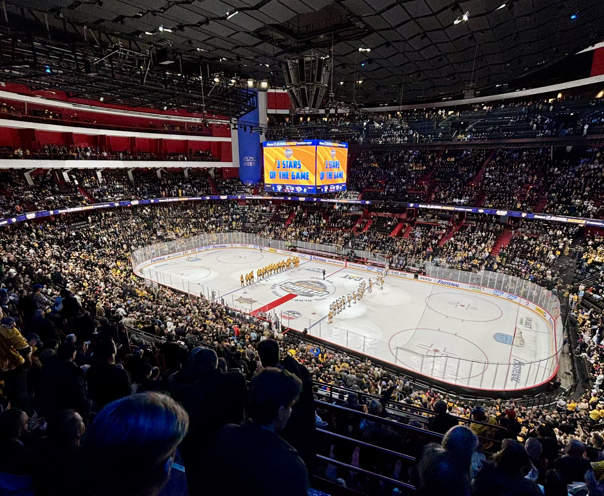
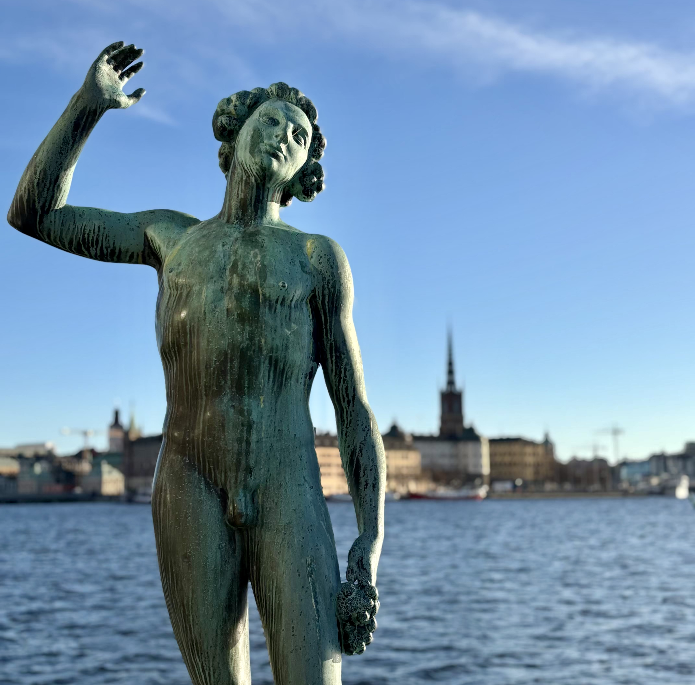

&nbsp;

Na jaře letošního roku vedení [NHL](https://www.nhl.com/) oznámilo, že v listopadu zorganizuje dva zápasy mezi [Pittsburghem Penguins](https://www.nhl.com/penguins/) a [Nashvillem Predators](https://www.nhl.com/predators/) ve stockholmské [Avicii Areně](https://cs.wikipedia.org/wiki/Avicii_Arena). A zpráva neušla pozornosti místních hokejových nadšenců, kteří krátce na to začali organizovat výpravu do hlavního města [Švédska](https://cs.wikipedia.org/wiki/%C5%A0v%C3%A9dsko).

Když mi Bert poprvné představil možnost přidat se k němu na krátkou cestu do [Skandinávie](https://cs.wikipedia.org/wiki/Skandin%C3%A1vie), nápad se mi upřímně líbil. Nicméně po zvážení všech okolností jsem se nakonec rozhodl nepřidat. V tu dobu jsme už totiž měli naplánovanou dovolenou na Faerské ostrovy a já jsem chtěl vyrazit na konferenci do [Linkopingu](https://cs.wikipedia.org/wiki/Link%C3%B6ping). Protože obě tyto výpravy měly významně zasáhnout můj bankovní účet, rozhodl jsem se další cestu do drahé [Skandinávie](https://cs.wikipedia.org/wiki/Skandin%C3%A1vie) vynechat. Vše se ale otočilo o 180 stupňů, když mi o pár dní později zavolal Bert, který se mě znovu zeptal, zda bych si to ještě nechtěl rozmyslet. Při nákupů lístků totiž zjistil, že lze koupit pouze sudý počet kusů a tehdejší výprava čítala 3 členy. Netrvalo mi to dlouho a na nabídku jsem kývnul s tím, že uvidím, jak na tom budu s blížícím se datem odjezdu a pokud se na cestu nebudu cítit, lístek jednoduše prodám. Už v tu chvíli jsem ale moc nevěřil tomu, že bych do [Stockholmu](https://cs.wikipedia.org/wiki/Stockholm) společně s Bertem, Zouhym a Bradym neodcestoval... zvlášť když jsem si uvědomil, že by se mohlo jednat o poslední šanci vidět legendárního [Sydneyho Crosbyho](https://www.nhl.com/cs/player/sidney-crosby-8471675) naživo!

&nbsp;

#### DEN 0: čtvrtek 13. listopadu 2025

Přestože letadlo odlétalo z pražské Ruzyně až v pátek krátce po poledni, rozhodl jsem se nepokoušet paní štěstěnu a do [Prahy](https://cs.wikipedia.org/wiki/Praha) jsem se vydal už ve čtvrtek večer. V [Praze](https://cs.wikipedia.org/wiki/Praha) jsem se jen ubytoval v oblíbeném hotelu na Karlíně, dal si sprchu a šel spát.

&nbsp;

#### DEN 1: pátek 14. listopadu 2025

Protože jsem měl volné ráno v [Praze](https://cs.wikipedia.org/wiki/Praha), rozhodl jsem se napsat bývalému kolegovi Jozefovi, zda by se ke mně nechtěl přidat na snídani. Jakožto správný "yes man" Jozef souhlasil a navíc navrhl, abychom se sešli v jeho oblíbené kavárně [Kafe Francin](https://kafefrancin.cz/) na [Strossmayerově náměstí](https://cs.wikipedia.org/wiki/Strossmayerovo_n%C3%A1m%C4%9Bst%C3%AD). Kávu jsem si sice nedal, ale bílý jogurt s granolou a ovocem byl vynikající. Kromě jídla a  příjemného prostředí jsem si ale hlavně užil společnost. Jozefa jsem neviděl už několik měsíců, takže bylo super slyšet updaty z bývalé práce i jeho života.

Po snídani jsem si zavolal [Uber](https://cs.wikipedia.org/wiki/Uber), abych se přesunul se na letiště. Přijel pro mě řidič vietnamského původu, který z nějakého důvodu vůbec nepoužíval blinkry. Upřímně mi to nedělalo úplně dobře, ale vše dobře dopadlo a já se tak v pořádku shledal se Zouhym a Bradym v odletové hale ruzyňského letiště. Společně jsme prošli bezpečnostní kontrolou, naobědvali se v [Bageterii Boulevard](https://www.bb.cz/) a poté si sedli k naší odletové bráně a čekali na zpožděné letadlo do [Stockholmu](https://cs.wikipedia.org/wiki/Stockholm). Čekání jsme si zkrátili diskuzí o mojí práci pro Spartu a snahou o vyjmenování všech [vítězů Stanley Cupu](https://cs.wikipedia.org/wiki/Seznam_v%C3%ADt%C4%9Bz%C5%AF_Stanley_Cupu) od roku 2000 až po současnost – to jsme nezvládli.

Kolem 13:30 jsme konečně vzlétli. Let trval přibližně 2 hodiny, ale mně to připadalo jako chvilka. Celou dobu jsme si totiž povídali, a tak mi čas rychle utekl.

Po příletu do [Stockholmu](https://cs.wikipedia.org/wiki/Stockholm) jsme nasedli do taxíku a přesunuli se do našeho [hotelu Langholmen](https://www.booking.com/hotel/se/langholmen-hotell.en-gb.html), který byl hooodně netradiční. Jednalo se totiž o budovu bývalé věznice. V ní se kromě [hotelu](https://www.booking.com/hotel/se/langholmen-hotell.en-gb.html) nacházelo ještě muzeum a restaurace. My tím pádem nespali na pokojích ale na celách. Já jsem dostal celu číslo 301, na které nás už čekal můj "spoluvězeň" Bert.

Na [hotelu](https://www.booking.com/hotel/se/langholmen-hotell.en-gb.html) jsme si jen nechali věci a prakticky hned vyrazili do víru velkoměsta - nejdříve na večeři do texaské restaurace a poté na zápas mezi [Penguins](https://www.nhl.com/penguins/) a [Predators](https://www.nhl.com/predators/) do legendární [Avicii Areny](https://cs.wikipedia.org/wiki/Avicii_Arena)! Tam jsme sledovali pro mě relativně nezáživné utkání. První gól padl až ve druhé třetině, a to ještě relativně šťastnou střelou [Evgenie Malkina](https://www.nhl.com/cs/player/evgeni-malkin-8471215) zpoza brány soupeře. Tučňáci poté hájili nejtěsnější možný náskok až do samotného konce utkání. Ubránit se jim ho ale nepodařilo. Predátoři totiž odvolali krátce před poslední sirénou brankáře, přišlo buly a po šťastném odrazu se před brankářem soupeře nejlépe zorientoval domácí [Filip Forsberg](https://www.nhl.com/cs/player/filip-forsberg-8476887), který backendem uklidil kotouč za záda do té doby famózního brankáře [Silovse](https://www.nhl.com/penguins/player/arturs-silovs-8481668). V prodloužení hraném 3 na 3 byli blízko vítěznému gólu borci z [Pensylvánie](https://cs.wikipedia.org/wiki/Pensylv%C3%A1nie), ale puk do brány nedostali. Hned v následujícím protiútoku se kotouče chopil legendární [Steven Stamkos](https://www.nhl.com/cs/player/steven-stamkos-8474564), zavezl jej do soupeřovy třetiny hřiště a nádhernou ranou pod víko nedal brankáři šanci. [Nashville](https://www.nhl.com/predators/) tedy vyhrál v prodloužení 2:1 a odnesl si ze zápasu dva body.

Po skončení utkání jsme ještě počkali na vyhlášení hvězd zápasu a následně se vydali do nedaleké hospody na jedno pivo. Protože už bylo relativně pozdě, pivo jsme do sebe relativně rychle kopli, zavolali si taxík a frčeli na [hotel](https://www.booking.com/hotel/se/langholmen-hotell.en-gb.html).

&nbsp;

#### DEN 2: sobota 15. listopadu 2025

Po snídani ve [věznici](https://www.booking.com/hotel/se/langholmen-hotell.en-gb.html) jsme vyrazili do města. Nejdříve jsme přešli relativně rušný most na protější ostrov Kungsholmen a poté pokračovali po pěkné pěší stezce podél vody, až jsme se dostali k městské [radnici](https://cs.wikipedia.org/wiki/Stockholmsk%C3%A1_radnice). I když foukal relativně studený vítr, nebe bylo naopak bez mráčků a svítilo sluníčko. I to nahrálo skutečnosti, že k [radnici](https://cs.wikipedia.org/wiki/Stockholmsk%C3%A1_radnice) jsem přišel mokrý jak myš a chvíli jsem přemýšlel, zda se neodpojím od zbytku skupiny a nepůjdu se na [hotel](https://www.booking.com/hotel/se/langholmen-hotell.en-gb.html) převléknout. To jsem ale neudělal, protože jsem nechtěl propásnout další zastávku - a ta byla opravdu speciální! V rámci [NHL Global Series](https://en.wikipedia.org/wiki/List_of_international_games_played_by_NHL_teams) se do [Stockholmu](https://cs.wikipedia.org/wiki/Stockholm) totiž vydal kromě dvou týmů [NHL](https://www.nhl.com/) i [Phil Pritchard](https://www.nhl.com/cs/news/stanley-cup-a-jeho-strazce-phil-pritchard), neboli člověk, který se stará o slavný [Stanley Cup](https://cs.wikipedia.org/wiki/Stanley_Cup) a pohár přivezl s sebou. Fanoušci tedy měli možnost se na pohár přijít podívat a vyfotit se s ním. A protože se taková příležitost nemusí opakovat, rozhodli jsme se jí využít.

&nbsp;

*Detail sochy před [stockholmskou radnicí](https://cs.wikipedia.org/wiki/Stockholmsk%C3%A1_radnice) a za ní obrys historického centra na ostrově [Gamla Stan](https://cs.wikipedia.org/wiki/Gamla_stan).*

&nbsp;

Když jsme přišli do parku [Kungsträdgården](https://en.wikipedia.org/wiki/Kungstr%C3%A4dg%C3%A5rden) kousek od historického centra města, na fotku s pohárem se už stála poměrně dlouhá fronta. My se zařadili na její konec a než jsme se dostali na řadu, řádně jsme vymrzli. Za fotku s pohárem i s [Philem](https://www.nhl.com/cs/news/stanley-cup-a-jeho-strazce-phil-pritchard) to ale stálo. Před odchodem z fan-zony si ještě Brady zkusil v rámci několika dovednostních aktivit pro fanoušky vystřelit na bránu.

V tu chvíli se už blížil čas oběda, proto jsme přesunuli do malého nákupního centra kousek od parku, sedli jsme si do dobře hodnocené salaterie [Zoey’s Freshfood](https://www.zoeys.se/) a dali si vynikající zdravé jídlo za relativně přijatelnou cenu! A k mému překvapení jsme si od hokeje neodpočinuli ani tam! Vedle nás si totiž sedl přibližně starý pár muže a ženy a když pán viděl můj dres a Bradyho čepici s logem [Pittsburghu Penguins](https://www.nhl.com/penguins/), dal se s námi do řeči. Po chvilce z pána vypadlo, že jeho bratranec je brankář [Carl Lindbom](https://www.nhl.com/cs/player/carl-lindbom-8482761), který před pár dny debutoval v [NHL](https://www.nhl.com/) za [Vegas Golden Knights](https://www.nhl.com/goldenknights/) – WOW!

Po rozloučení se sympatickým párem jsme se vydali do centra center v podobě ostrovu [Gamla Stan](https://cs.wikipedia.org/wiki/Gamla_stan), kde jsme si prošli nejznámější památky města, konkrétně [budovu Parlamentu](https://en.wikipedia.org/wiki/Parliament_House,_Stockholm), [Stockholmský palác](https://cs.wikipedia.org/wiki/Stockholmsk%C3%BD_pal%C3%A1c), [Muzeum Nobelovy ceny](https://cs.wikipedia.org/wiki/Muzeum_Nobelovy_ceny) a [katedrálu sv. Mikuláše](https://cs.wikipedia.org/wiki/Katedr%C3%A1la_svat%C3%A9ho_Mikul%C3%A1%C5%A1e_(Stockholm)). Po nutném kolečku v přelidněném centru jsme přešli most a zamířili do alternativní klidné čtvrti [Södermalm](https://en.wikipedia.org/wiki/S%C3%B6dermalm). Tam jsme si zašli na kávu do vynikající [kavárny Lykke](https://europeancoffeetrip.com/cafe/lykke-sodermalm-stockholm/). Po kávě jsme se shodli na tom, že co jsme chtěli vidět, jsme viděli, navíc padala tma, a tak jsme se rozhodli přesunout do hospody [The Mad Hatter](https://www.instagram.com/madhatterstockholm/?hl=en), kde jsme si krátili čas před večeří.

&nbsp;

*[Stockholmský palác](https://cs.wikipedia.org/wiki/Stockholmsk%C3%BD_pal%C3%A1c).*

&nbsp;

Kolem 18. hodiny jsme chtěli Bradymu ukázat slavnou restauraci [Meatballs for the People](https://meatball.se/). Bohužel před ní byla taková fronta, že jsme raději našli alternativu v podobě [restaurace Pelikan](https://pelikan.se/en) o pár bloků dál. Tam to bylo hodně zajímavé. V jedné polovině restaurace všichni hosté seděli u nádherně prostřených stolů a mezi nimi chodili upravení číšníci, kteří místu dodávali pocit luxusu a noblesy. Rozhodně se tedy nejednalo o podnik, kam bych si vzal hokejový dresu [Pittsburghu Penguins](https://www.nhl.com/penguins/). V druhé polovině to byla jiná písnička. Kolem baru totiž postávali lidé s drinky v ruce, hudba tam hrála mnohem více nahlas a všichni byli oblečeni snad ještě více fancy než v té první půlce. Podle Bertových slov to tam vypadalo na nějaký maturitní večírek. To sice nebyl ten případ, ale mělo to tam takový vibe - to se musí Bertovi nechat. Číšník nám řekl, že pokud nemáme rezervaci a chceme někde jíst, musíme kousnout půlku s barem a podle jeho slov "take it easy" nemáme mít přehnaná očekávání. Když jsem si ale uvědomil, jak to tam vypadalo, pro mě osobně bylo hodně těžké mít malá očekávání. A [Pelikan](https://pelikan.se/en) nezklamal! Hned chleba s nadýchaným máslem mě vystřelil z trenek. Po něm přišla ještě skvělá pórková polévka a hodně poctivé masové koule s bramborovou kaší. V Pelikánovi to byla prostě raketa - a to nejen po gastronomické stránce, ale i po té společenské! Když jsem se totiž po večeři vracel z toalety zpět ke stolu, zastavila mě dvojce Švédů přibližně v mém věku a začali se mě vyptávat na můj dres [Sidneyho Crosbyho](https://www.nhl.com/cs/player/sidney-crosby-8471675). Kdyby se čeští kluci nezvedli od stolu a nechtěli jít, se dvěma Švédy bych si možná povídal ještě teď!

&nbsp;

*Fotka s dvojicí Švédů z restaurace [Pelikan](https://pelikan.se/en).*

&nbsp;

Po zaplacení jsme se vydali pěšky na [hotel](https://www.booking.com/hotel/se/langholmen-hotell.en-gb.html). V plánu bylo, že se projdeme jen kousek a po nějaké době si zavoláme taxi. Cesta nám ale rychle utíkala – možná i proto, že jsme hráli sportovní kvíz, a tak jsme 6 km dlouhou cestu zvládli celou. Na [hotelu](https://www.booking.com/hotel/se/langholmen-hotell.en-gb.html) jsme si dali jedno pivo na dobrou noc, já jsem potom udělal ještě něco málo do práce a kolem půlnoci jsme si šli lehnout.

&nbsp;

#### DEN 3: neděle 16. listopadu 2025

Po snídani jsme si sbalili věci a  přesunuli se taxíkem do [muzea Vasa](https://cs.wikipedia.org/wiki/Muzeum_Vasa), kde jsme strávili asi 2 hodiny prohlídkou stejnojmenné lodi. Ta se potopila hned při své první plavbě v roce 1628. Její vrak ležel dalších 333 let na dně stockholmských vod, než byl v roce 1961 vyzvednutý a uložený do muzea. V [muzeu](https://cs.wikipedia.org/wiki/Muzeum_Vasa) jsem sice už byl před třemi lety s Klárou, ale i tak bylo pěkné se na monumentální dřevěnou loď zajít znovu podívat a připomenout si její historii.

Kolem poledne jsme nasedli do auta a jeli na letiště. Následovala bezpečnostní kontrola, pozdní oběd a klidný let do zpět [Prahy](https://cs.wikipedia.org/wiki/Praha).

&nbsp;

#### DOJMY ZE STOCKHOLMU

**NHL v Evropě? Naposledy!** Před cestou do Stokcholmu jsem mohl říct, že jsem na vlastní oči viděl 3 zápasy [NHL](https://www.nhl.com/): [zápas mezi Predators a Sharks](https://www.nhl.com/gamecenter/nsh-vs-sjs/2022/10/07/2022020001) na podzim roku 2022 v [Praze](https://cs.wikipedia.org/wiki/Praha), [zápas mezi Rangers a Capitals](https://www.nhl.com/gamecenter/nyr-vs-wsh/2024/04/23/2023030132) na jaře roku 2024 v New Yorku a nakonec [zápas mezi Devils a Sabers](https://www.nhl.com/gamecenter/buf-vs-njd/2024/10/05/2024020002) na podzim roku 2024 znovu v [Praze](https://cs.wikipedia.org/wiki/Praha). Po posledním zmíněném zápase jsem si řekl, že se na další klání organizované v [Evropě](https://cs.wikipedia.org/wiki/Evropa) nepohrnu. V obou případech jsem totiž byl zklamaný z předvedené hry i atmosféry na stadioně, která se se zápasem play-off v Americe vůbec nedala srovnat, a tím pádem jsem přestal být přesvědčený o tom, že bych za takovou zkušenost měl utrácet svoje peníze. Bohužel musím konstatovat, že můj názor nezměnil ani letošní výlet do [Stockholmu](https://cs.wikipedia.org/wiki/Stockholm), který mě jen utvrdil v tom, že zápasy [NHL](https://www.nhl.com/) v [Evropě](https://cs.wikipedia.org/wiki/Evropa) nejsou nic pro mě. 🏒

**Švédové jsou cool!** Vždy, když se vrátím ze [Švédska](https://cs.wikipedia.org/wiki/%C5%A0v%C3%A9dsko), říkám si, že ti Švédové jsou moc milí lidé. A ani tentokrát tomu nebylo jinak. Určitě tomu přispěla skutečnost, že jsem celý víkend chodil po [Stockholmu](https://cs.wikipedia.org/wiki/Stockholm) v dresu [Pittsburghu Penguins](https://www.nhl.com/penguins/), ale často se mi stávalo, že mě někdo zastavil, zeptal se na zápas a při té příležitosti se zeptal i na něco osobního. Bylo to vážně moc milé a já osobně si tato malá setkání a krátké rozhovory neskutečně užíval. ❤️

&nbsp;

#### FOTKY

Fotky ze [Stockholmu](https://cs.wikipedia.org/wiki/Stockholm) najdete [zde](https://photos.app.goo.gl/phs5LgFNRstPutPi6).
