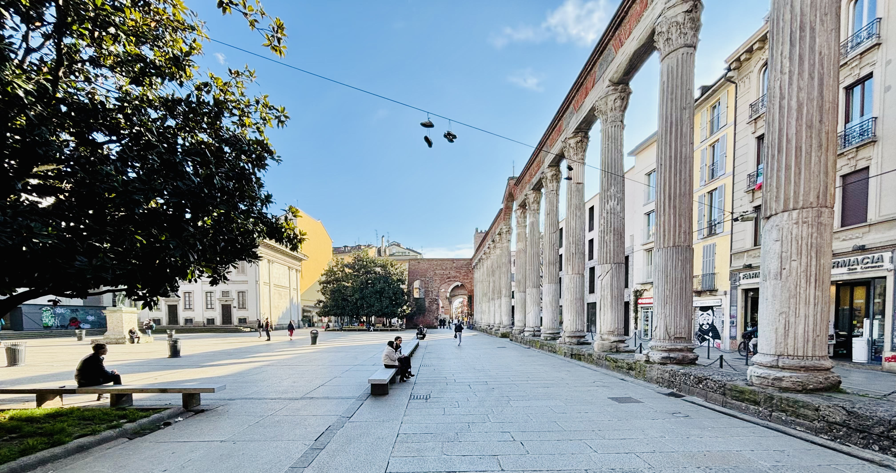
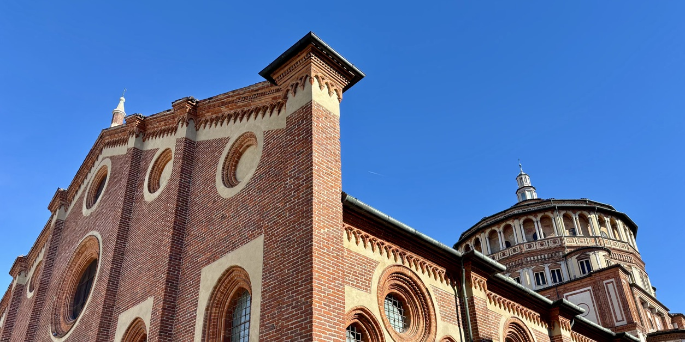
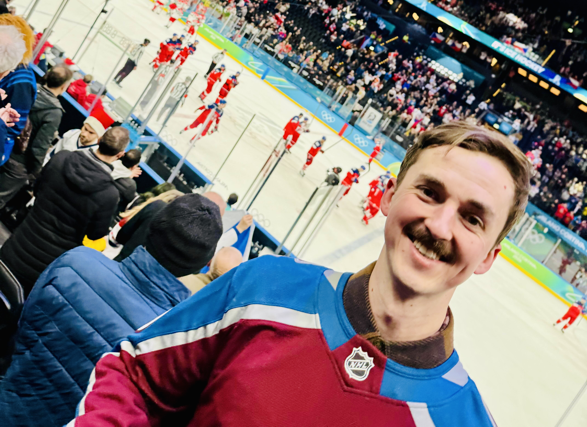
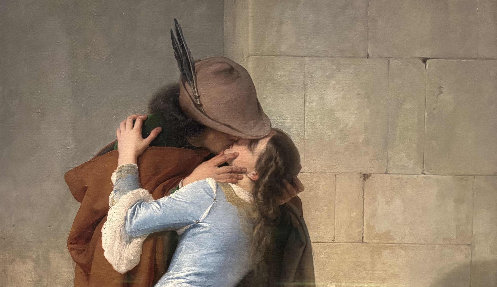

&nbsp;

Už si ani nepamatuju, kdy se poprvé zveřejnila informace o tom, že na [zimních olympijských hrách v Miláně](https://cs.wikipedia.org/wiki/Zimn%C3%AD_olympijsk%C3%A9_hry_2026) budou v roce 2026 znovu startovat hráči z [NHL](https://cs.wikipedia.org/wiki/National_Hockey_League), ale co si pamatuju dost jasně, je chvíle, která následovala hned potom - to jsem si totiž řekl, že u toho nesmím chybět!

Na posledních dvou olympiádách jsme byli všichni ochuzeni o ten nejlepší světový hokej, a tak jsem byl nejen hodně natěšený na to, co nás v [Miláně](https://cs.wikipedia.org/wiki/Mil%C3%A1n) čeká, ale zároveň jsem měl i obavy, aby to nebyla jedna z mých posledních možností vidět ten pravý olympijský hokej na vlastní oči. I proto jsem dlouho neváhal a když se na začátku roku 2025 otevřel prodej vstupenek, hned jsem koupil lupeny na tři zápasy, konkrétně na jedno osmifinále a dvě čtvrtfinále.

To bylo přibližně rok před startem celé akce. Dalšího půl roku nato jsem objednal hotel - k mému překvapení za velice rozumnou cenu - a koupil letenky, na kterých také nebyla patrná jakákoliv "olympijská přirážka". S dobrým pocitem v srdci a ne úplně prázdnou peněženkou jsme tedy měli více než půl roku před odletem zařízeno vše potřebné a já se už pomalu začínal těšit na to, až okusíme olympijskou atmosféru na vlastní kůži!

&nbsp;

#### DEN 0: neděle 15. února 2026

V den odletu jsem si poležel v posteli o něco déle. Den předem jsme totiž měli s kapelou koncert a já se vrátil domů dost pozdě. Poté, co jsem vstal z postele, jsem se najedl, sbalil si věci a zašel pro auto. Následovala cesta do Vídně se zastávkou v [McDonald's](https://cs.wikipedia.org/wiki/McDonald%27s) na oběd.

Do [Vídně](https://cs.wikipedia.org/wiki/V%C3%ADde%C5%88) jsme dorazili kolem 13:30, prošli bezpečnostní kontrolou a šli si dát kávu a zákusek do jednoho z podniků kousek od naší odletové brány. Přestože v kavárně dávali přímý přenos z [posledního zápasu ve skupině mezi Českem a Švýcarskem](https://www.livesport.cz/zpravy/hokej-olympijske-hry-cesi-na-zoh-nenasli-recept-na-svycarsko-padli-v-prodlouzeni-a-ceka-je-tezsi-cesta-do-ctvrtfinale/4Ux4L9un/), konec  [zápasu](https://www.livesport.cz/zapas/hokej/cesko-OdY4GUuO/svycarsko-buO3jBAo/?mid=hMX24udB) včetně prodloužení jsme neviděli, protože jsem nechtěli, aby nám uletělo letadlo. Když jsme ale přišli k odletové bráně, zjistili jsme, že jsme vůbec nemuseli špěchat. Naše letadlo totiž nabralo cca 45 minut zpoždění.

Přes hodinu dlouhý let sice provázely slabé turbulence, přesto se mi krátce po vzletu podařilo usnout a alespoň na chvíli si odpočinout. Když jsem se vzbudil, právě jsme přelétali nad [Alpami](https://cs.wikipedia.org/wiki/Alpy). Nebe bylo bez mráčků, a tak jsme společně s Klárou mohli obdivovat nádherný pohled na zasněžené vrcholky masivních hor pod námi. Ten pohled mě snad nikdy neomrzí!

Po příletu do [Milána](https://cs.wikipedia.org/wiki/Mil%C3%A1n) jsme si zavolali [Uber](https://cs.wikipedia.org/wiki/Uber) a frčeli na [hotel](https://www.booking.com/hotel/it/short-rent-milan.html) - nebo spíše do apartmánu v jednom bytovém domě. Tam se s námi potkal jeho majitel Jimmy, který nám předal klíče, seznámil nás s pravidly užívání bytu a poté nás nechal našemu vlastnímu osudu. V tu chvíli bylo už skoro 19 hodin, a tak jsme si jen rychle vybalili věci a poté vyrazili ven na jídlo. Navštívili jsme vynikající restauraci [Guido Vizio Italiano](https://www.instagram.com/guido.ristorante/), kde sice neuměli moc dobře anglicky, ale za to uměli připravit skvělé těstoviny a pizzu. Já nejdříve ochutnal těstoviny [carbonara](https://cs.wikipedia.org/wiki/Carbonara). Ty byly sice vynikající, ale protože jsem po nich měl ještě hlad, objednal jsem si druhý chod v podobě pizzy bufala.

Zpět na byt jsme se dostali kolem 21. hodiny, dali jsme sprchu a šli si brzo lehnout.

&nbsp;

#### DEN 1: pondělí 16. února 2026

Tím, že jsme nebydleli v hotelu, v jehož ceně by byla i snídaně, jsme se museli o jídlo starat sami. Hned první den v [Miláně](https://cs.wikipedia.org/wiki/Mil%C3%A1n) jsme proto otevřeli [aplikaci European Coffee Trip](https://europeancoffeetrip.com/) (no collab, but I wouldn't mind) a v ní objevili vynikající [kavárnu Cafezal - Coffee Hub](https://cafezal.it/en), kde se nám hned první den líbilo natolik, že už jsme ji nevyměnili za jinou, a dokonce jsme ještě jeden navštívili i jejich druhou pobočku ve [čtvrti Brera](https://en.wikipedia.org/wiki/Brera,_Milan)! Klára v průběhu našeho pobytu vsadila na osvědčenou klasiku a každý den holdovala palačinkám s javorovým sirupem a brusinkovým kompotem. To já jsem v průběhu třech návštěv postupně vyzkoušel croissant se smaženými vajíčky a slaninou, bílý jogurt s müsli a tropickým ovocem a na závěr zapečený toust se šunkou, tvrdým sýrem a nakládanými okurky. A přestože mi všechna jídla opravdu moc chutnala, jejich postupné hodnocení by mělo mírně vzestupnou tendenci.

Po vydatné snídani následovala procházka do centra města, kde jsme se podívali na [operu La Scala](https://cs.wikipedia.org/wiki/La_Scala), [galerii Viktora Emanuela II.](https://cs.wikipedia.org/wiki/Galerie_Viktora_Emanuela_II.) a hlavní dominantu města - [katedrálu Narození Panny Marie, známou spíše jako Duomo](https://cs.wikipedia.org/wiki/Katedr%C3%A1la_Narozen%C3%AD_Panny_Marie_(Mil%C3%A1n)). Když nepočítám [da Vinciho Poslední večeři](https://cs.wikipedia.org/wiki/Posledn%C3%AD_ve%C4%8De%C5%99e_(da_Vinci)), tyto tři stavby jsem vždy považoval za hlavní symboly [Milána](https://cs.wikipedia.org/wiki/Mil%C3%A1n). Nikdy před tím jsem si ale neuvědomil, jak blízko jsou u sebe. [Klasicistní budova světoznámé opery](https://cs.wikipedia.org/wiki/La_Scala) stojí tak trošku "mimoděk" v jednom rohu malého čtvercového náměstí [Piazza della Scala](https://en.wikipedia.org/wiki/Piazza_della_Scala). Diagonálně naproti ní se už otevírá majestátní vstup do [galerie](https://cs.wikipedia.org/wiki/Galerie_Viktora_Emanuela_II.) plné obchodů luxusních značek a to tak, že je od [divadla](https://cs.wikipedia.org/wiki/La_Scala) vidět dovnitř [galerie](https://cs.wikipedia.org/wiki/Galerie_Viktora_Emanuela_II.). Když poté člověk do [galerie](https://cs.wikipedia.org/wiki/Galerie_Viktora_Emanuela_II.) vstoupí a projde až na její druhý konec, ocitne se na [náměstí Piazza del Duomo](https://cs.wikipedia.org/wiki/Piazza_del_Duomo_(Mil%C3%A1n)), kde na něj už vykukuje bílá gotická stavba [milánské katedrály](https://cs.wikipedia.org/wiki/Katedr%C3%A1la_Narozen%C3%AD_Panny_Marie_(Mil%C3%A1n)). Protože jsem vůbec neodhadl, jak dlouho nám bude trvat přesun od hotelu ke [katedrále](https://cs.wikipedia.org/wiki/Katedr%C3%A1la_Narozen%C3%AD_Panny_Marie_(Mil%C3%A1n)), a tím pádem jsem prohlídku [katedrály](https://cs.wikipedia.org/wiki/Katedr%C3%A1la_Narozen%C3%AD_Panny_Marie_(Mil%C3%A1n)) objednal až na odpoledne, potřebovali jsme nějak zabít čas. Nejdřív jsme si proto dali rychlý čaj v kavárně, která se nacházela v budově královského paláce, a poté se šli podívat do nákupního centra vedle [katedrály](https://cs.wikipedia.org/wiki/Katedr%C3%A1la_Narozen%C3%AD_Panny_Marie_(Mil%C3%A1n)).

Když přišla hodina H, přesunuli jsme se k jednomu ze zadních vstupů do [katedrály](https://cs.wikipedia.org/wiki/Katedr%C3%A1la_Narozen%C3%AD_Panny_Marie_(Mil%C3%A1n)). Tam jsme nastoupili do malého výtahu, který nás vyvezl na úzkou terasu vysoko nad rušnou ulici pod námi. Na terase jsme se mohli procházet po úzkých chodníčcích mezi typickými bílými věžičkami a zblízka obdivovat sošky andělíčků a svatých na jejich okrajích. Když jsme přišli na druhou stranu [katedrály](https://cs.wikipedia.org/wiki/Katedr%C3%A1la_Narozen%C3%AD_Panny_Marie_(Mil%C3%A1n)), vystoupali  jsme ještě několik schodů nahoru a ocitli se na nejvyšší části střechy, odkud se nám naskytl nádherný pohled na výškové budovy [finanční čtvrti](https://en.wikipedia.org/wiki/Porta_Nuova_(Milan)) i na zasněžené alpské vrcholy za nimi. Musím říct, že po návštěvě většiny významných evropských metropolí a jejich památek jsem si nemyslel, že mě ještě něco dokáže překvapit. Ale chodit po střeše jedné z největších katedrál světa a přitom se dívat na [Alpy](https://cs.wikipedia.org/wiki/Alpy) mi přišlo vážně hodně cool. Myslím, že za to ta prohlídka opravdu stála!

&nbsp;

*Z nejvyšší části střechy [milánské katedrály](https://cs.wikipedia.org/wiki/Katedr%C3%A1la_Narozen%C3%AD_Panny_Marie_(Mil%C3%A1n)) jsou vidět výškové budovy ve [finanční čtvrti Porta Nuova](https://en.wikipedia.org/wiki/Porta_Nuova_(Milan)) i zasněžené vrcholky [Alp](https://cs.wikipedia.org/wiki/Alpy).*

&nbsp;

Po prohlídce [katedrály](https://cs.wikipedia.org/wiki/Katedr%C3%A1la_Narozen%C3%AD_Panny_Marie_(Mil%C3%A1n)) jsme zamířili do olympijského megastoru, který tvořil obrovský stan uprostřed [náměstí Piazza del Duomo](https://cs.wikipedia.org/wiki/Piazza_del_Duomo_(Mil%C3%A1n)), tedy jen pár desítek metrů od slavné [katedrály](https://cs.wikipedia.org/wiki/Katedr%C3%A1la_Narozen%C3%AD_Panny_Marie_(Mil%C3%A1n)). O nákup olympijských suvenýrů byl takový zájem, že dovnitř pouštěli jen menší skupinky. Když jsme se ale konečně dostali dovnitř, chuť nakupovat nás prakticky hned přešla. Nechtělo se nám mačkat mezi ostatními turisty, a tak jsme celý megastore jen rychle proběhli a chystali se pokračovat dál v prohlídce města.

Přestože mě obchod s olympijskými předměty zklamal, hned vzápětí jsem se pro tento sportovní svátek znovu nadchl. Jen co jsme vyšli ven, podařilo se nám totiž potkat celou rodinu Tkachukových, včetně hvězd amerického hokejového týmu [Bradyho](https://cs.wikipedia.org/wiki/Brady_Tkachuk) a [Matthewa](https://cs.wikipedia.org/wiki/Matthew_Tkachuk) – pozdějších olympijských šampionů – a jejich slavného otce [Keitha](https://cs.wikipedia.org/wiki/Keith_Tkachuk). Kromě nás si ale hvězdných Američanů téměř nikdo nevšímal. Ve stejnou chvíli se totiž na místě objevil obrovský černoch ve středních letech, který společně se svými bodyguardy strhl pozornost všech přítomných turistů. Ti se za ním okamžitě rozběhli, aby si s ním mohli udělat fotku. A kdože to vlastně byl? Nejprve jsem si myslel, že jde o [Shaquilla O'Neala](https://cs.wikipedia.org/wiki/Shaquille_O%27Neal). Čím déle jsem si ale následně prohlížel jeho fotky, tím víc jsem byl přesvědčený, že to legendární [Shaq](https://cs.wikipedia.org/wiki/Shaquille_O%27Neal) nebyl. Jeho identita nám tak pravděpodobně zůstane utajena.

Když jsem rozdýchal skutečnost, že ani ne 2 metry od nás procházeli [Brady](https://cs.wikipedia.org/wiki/Brady_Tkachuk) a [Matthew](https://cs.wikipedia.org/wiki/Matthew_Tkachuk) Tkachukovi, pokračovali jsme v prohlídce města. Naším cílem byly kanály ve [čtvrti Navigli](https://www.cestujlevne.com/pruvodce/italie/milan/navigli). Cestou k nim jsme se ale ještě zastavili u [antických sloupů San Lorenzo](https://www.cestujlevne.com/pruvodce/italie/milan/colonne-di-san-lorenzo) a na kávu a tiramisu v maličkém podniku [Mascherpa tiramisu](https://www.instagram.com/mascherpatiramisu/?hl=cs), který se nachází hned vedle nich.

&nbsp;

*Na [16 antických sloupů San Lorenzo](https://www.cestujlevne.com/pruvodce/italie/milan/colonne-di-san-lorenzo) jsme v [Miláně](https://cs.wikipedia.org/wiki/Mil%C3%A1n) narazili prakticky náhodou při cestě do [čtvrti Navigli](https://www.cestujlevne.com/pruvodce/italie/milan/navigli). Jsem ale rád, že se tak stalo!*

&nbsp;

Když jsme přišli do [čtvrti vodních kanálů](https://www.cestujlevne.com/pruvodce/italie/milan/navigli), sluníčko pomalu začalo zapadat za obzor a vytvářelo tak perfektní atmosféru pro návštěvu takového místa. Nicméně byli i tací, kteří ji i malinko kazili. Konkrétně se jednalo o restaurační nahaněče, kteří lákali turisty do klasických turistických pastí hned vedle kanálů. My si našli dobře hodnocený podnik [Chunk](https://chunkmilano.it/), vzdálený malinko dál od hlavních turistických míst, který za trošku delší cestu stál. Pánové z rodinného restaurace nám před jídlem nabídli zdarma [bruschettku s rajčaty](https://cs.wikipedia.org/wiki/Bruschetta) a při placení nám nalili panáka [limoncella](https://cs.wikipedia.org/wiki/Limoncello) a každému dali jednu sušenku [oreo](https://cs.wikipedia.org/wiki/Oreo) - a to se vyplatí!

Následovala pěší cesta na hotel, sprcha a hurá do hajan!

&nbsp;

#### DEN 2: úterý 17. února 2026

Po klasické snídani v [podniku Cafezal](https://cafezal.it/en) jsme se vydali ke [kostelu Santa Maria delle Grazie](https://cs.wikipedia.org/wiki/Kostel_Santa_Maria_delle_Grazie_(Mil%C3%A1n)), který mimo jiné ukrývá [da Vinciho](https://cs.wikipedia.org/wiki/Leonardo_da_Vinci) [Poslední večeři](https://cs.wikipedia.org/wiki/Posledn%C3%AD_ve%C4%8De%C5%99e_(da_Vinci)). [Kostel](https://cs.wikipedia.org/wiki/Kostel_Santa_Maria_delle_Grazie_(Mil%C3%A1n)) leží mírně stranou od hlavního centra města, takže nám cesta zabrala o něco více času než včerejší přesun na [Piazza del Duomo](https://cs.wikipedia.org/wiki/Piazza_del_Duomo_(Mil%C3%A1n)). Než jsme k ní dorazili, trochu nám vyhládlo a mně se navíc začalo chtít na záchod, a tak jsme si na chvíli sedli do poměrně rušné kavárny [Ditta Artigianale](https://dittaartigianale.com/), která se nachází jen pár metrů od kostela.

Po lehkém jídle - já jsem si dal [croque monsieur](https://en.wikipedia.org/wiki/Croque_monsieur), Klára [avokádový chléb](https://en.wikipedia.org/wiki/Avocado_toast) - jsme se podívali do nádherného [cihlového chrámu](https://cs.wikipedia.org/wiki/Kostel_Santa_Maria_delle_Grazie_(Mil%C3%A1n)), který ve svých útrobách uchovává slavnou [Poslední večeři](https://cs.wikipedia.org/wiki/Posledn%C3%AD_ve%C4%8De%C5%99e_(da_Vinci)). Vstupenky k samotnému dílu se nám už bohužel nepodařilo sehnat, takže jsme si prohlédli pouze interiér [tohoto kostela](https://cs.wikipedia.org/wiki/Kostel_Santa_Maria_delle_Grazie_(Mil%C3%A1n)).

&nbsp;

*Cihlový [kostel Santa Maria delle Grazie](https://cs.wikipedia.org/wiki/Kostel_Santa_Maria_delle_Grazie_(Mil%C3%A1n)) ukrývá slavnou [Poslední večeři](https://cs.wikipedia.org/wiki/Posledn%C3%AD_ve%C4%8De%C5%99e_(da_Vinci)). I kvůli ní se do [Milána](https://cs.wikipedia.org/wiki/Mil%C3%A1n) budeme muset ještě vrátit.*

&nbsp;

Poté jsme se vrátili do centra a zamířili k dalšímu symbolu města - [hradu Sforzesco](https://cs.wikipedia.org/wiki/Sforzesco_(hrad)). Jde o mohutnou pevnost z 15. století, v níž dnes sídlí několik muzeí s díly mimo jiné od [Leonarda da Vinciho](https://cs.wikipedia.org/wiki/Leonardo_da_Vinci) a [Michelangela](https://cs.wikipedia.org/wiki/Michelangelo_Buonarroti). My jsme se ale do muzeí nevydali. Prošli jsme jednou z vedlejších bran na nádvoří, udělali pár fotek hlavní věže a pokračovali do [parku Sempione](https://en.wikipedia.org/wiki/Parco_Sempione), který se rozprostírá hned za hradním komplexem. Na opačné straně [parku](https://en.wikipedia.org/wiki/Parco_Sempione) stojí monumentální [vítězný oblouk](https://en.wikipedia.org/wiki/Porta_Sempione), jenž nechal v [Miláně](https://cs.wikipedia.org/wiki/Mil%C3%A1n) postavit [Napoleon](https://cs.wikipedia.org/wiki/Napoleon_Bonaparte). Pro nás byl zajímavý i tím, že v jeho středu během [zimní olympiády](https://cs.wikipedia.org/wiki/Zimn%C3%AD_olympijsk%C3%A9_hry_2026) hořel olympijský oheň.

Z [parku Sempione](https://en.wikipedia.org/wiki/Parco_Sempione) jsme se přesunuli do [čtvrti Brera](https://en.wikipedia.org/wiki/Brera,_Milan), malebné části města typické úzkými uličkami, množstvím restaurací a také vyhlášenou [obrazárnou Pinacoteca di Brera](https://cs.wikipedia.org/wiki/Palazzo_di_Brera). Tentokrát jsme jí ale jen prošli a zamířili na kávu a zákusek do místní pobočky [kavárny Cafezal](https://cafezal.it/en).

Po krátkém odpočinku jsme nasedli do taxíku a vrátili se na hotel. Tam jsme si odložili věci, převlékli se do našich fanouškovských outfitů a vyrazili k [hokejové aréně Santa Giulia](https://cs.wikipedia.org/wiki/Arena_Milano) na náš první zápas v [Miláně](https://cs.wikipedia.org/wiki/Mil%C3%A1n) – [osmifinále mezi Českem a Dánskem](https://www.livesport.cz/zapas/hokej/cesko-OdY4GUuO/dansko-2mX8FleU/?mid=6qy9TSas). Řidič [Uberu](https://cs.wikipedia.org/wiki/Uber) nás vysadil u tramvajové zastávky, takže posledních zhruba 500 metrů jsme museli dojít pěšky. Přestože jsem měl pocit, že máme dostatečnou časovou rezervu, než jsme dorazili na stadion, navštívili fanshop, koupili si pití a zašli na záchod, zápas už téměř začínal. Jen jsme se tedy usadili, vyslechli si sestavy obou týmů a šlo se na věc. V [milánské aréně](https://cs.wikipedia.org/wiki/Arena_Milano) jsme byli svědky poměrně nepřesvědčivého výkonu našich borců, který nám zejména v závěru utkání připravil hned několik infarktových momentů. I přes velké trápení jsme ale nakonec vybojovali těsné vítězství 3:2, a mohli se tak začít těšit na [čtvrtfinále proti hvězdné Kanadě](https://www.livesport.cz/zpravy/hokej-olympijske-hry-zoh-cesko-kanada-ctvrtfinale-online/vRuRssDl/)! Musím ale upřímně přiznat, že v tu chvíli jsem se spíš obával další ostudy...

&nbsp;

*V průběhu [osmifinálového zápasu proti Dánům](https://www.livesport.cz/zapas/hokej/cesko-OdY4GUuO/dansko-2mX8FleU/?mid=6qy9TSas) nám fandili i italští fanoušci sedící za námi. Místo pokřiku "Češi! du, du, du" však křičeli "Čeči! du, du, du".*

&nbsp;

Po [zápase](https://www.livesport.cz/zapas/hokej/cesko-OdY4GUuO/dansko-2mX8FleU/?mid=6qy9TSas) jsme se vrátili na tramvajovou zastávku, zavolali si [Uber](https://cs.wikipedia.org/wiki/Uber) a jeli zpět na hotel.

&nbsp;

#### DEN 3: středa 18. února 2026

Třetí den v [Miláně](https://cs.wikipedia.org/wiki/Mil%C3%A1n) nás čekala návštěva několika míst, které byly relativně daleko od sebe. Po snídani jsme proto využili služby [Uberu](https://cs.wikipedia.org/wiki/Uber) a od [kavárny Cafezal](https://cafezal.it/en) se nechali zavést do [čtvrti Brera](https://www.cestujlevne.com/pruvodce/italie/milan/brera), kde jsme se šli podívat do obrazárny [Pinacoteca di Brera](https://www.cestujlevne.com/pruvodce/italie/milan/pinacoteca-di-brera).

Obrazárna se nachází v nádherné [barokní budově Palazzo di Brera](https://cs.wikipedia.org/wiki/Palazzo_di_Brera), ve které mimo jiné sídlí i jedna z nejprestižnějších uměleckých škol v celé [Itálii](https://cs.wikipedia.org/wiki/It%C3%A1lie). Podle průvodců jsme si měli na prohlídku uměleckých děl od [Tiziana](https://cs.wikipedia.org/wiki/Tizian), [Tintoretta](https://cs.wikipedia.org/wiki/Tintoretto) nebo [Caravaggia](https://cs.wikipedia.org/wiki/Caravaggio) vyhradit zhruba 3 hodiny. My ale tolik času neměli, a tak jsme pouze obešli ty největší pecky, které jsme našli v průvodci. Kromě obrazů mě ale zaujala i nádherná místní knihovna s lustry z českého křišťálu a také prostorný dvůr s arkádami, do kterého se návštěvník dostane i bez nutnosti kupovat vstupenku. Pokud bych tedy do [Milána](https://cs.wikipedia.org/wiki/Mil%C3%A1n) jel znovu a neměl bych už potřebu obdivat díla slavných umělců, šel bych se podívat alespoň tam!

&nbsp;

*[Polibek od Francesca Hayeze](https://pinacotecabrera.org/en/collezioni/collezione-on-line/the-kiss/) je jedním z [materpieces](https://pinacotecabrera.org/en/collezioni/masterpieces/) v milánské obrazárně [Pinacoteca di Brera](https://www.cestujlevne.com/pruvodce/italie/milan/pinacoteca-di-brera).*

&nbsp;

Na oběd jsme si vytipovali [restauraci Osteria Da Fortunata](https://osteriadafortunata.it/) nacházející se v samém srdci historické [čtvrti Brera](https://www.cestujlevne.com/pruvodce/italie/milan/brera). [Restaurace](https://osteriadafortunata.it/) je zajímavá tím, že v ní vyrábí domácí těstoviny, což pravděpodobně přispělo její velké popularitě! Když jsme totiž z restaurace odcházeli, do ní jediné se stála dlouhá fronta na volný stůl, přestože v ostatních podnicích by se dalo posadit bez větších problémů. Těstoviny [cacio e pepe](https://cs.wikipedia.org/wiki/Cacio_e_pepe), které jsme si dali, byly sice výborné, ale nemyslím si, že by byly o tolik lepší než jinde v okolí.

Po jídle jsme znovu nasedli do taxíku a frčeli na jižní okraj centra do [českého domu](https://www.olympijskytym.cz/czechhouse). Upřímně jsem toho od návštěvy tohoto "sport baru" moc nečekal, ale přišlo mi, že v průběhu [olympiády](https://cs.wikipedia.org/wiki/Zimn%C3%AD_olympijsk%C3%A9_hry_2026) je to prostě povinnost. Když jsme do [casa ceca](https://www.olympijskytym.cz/czechhouse) kolem 13. hodiny dorazili, moc lidí tam nebylo. Pár jedinců v českých dresech do sebe soukalo pivo a pizzu a u toho sledovalo [čtvrtfinálový zápas mezi Slovenskem a Německem](https://www.livesport.cz/zapas/hokej/nemecko-vgQVYBeh/slovensko-ruzLVmAN/). My jsme si objednali kávu a zákusek a přidali se k nim. Postupem času se podnik na okraji města trošku zaplnil, ale nedá se říct, že by tam bylo nějak tepalo. Nikoho slavného jsme nepotkali, v probraném stánku s českým merchem jsme si nic nekoupili a bohužel jsme ani nesehnali žádný [olympijský odznáček](https://www.denik.cz/zimni_sporty/zimni-olympijske-hry-zoh-2026-odznaky-symbol-milan-italie.html), pro který jsme si do českého domu přijeli. Po asi hodině jsme se proto zvedli, zašli si na provizorní záchod na dvorku a vyrazili pěšky na [hotel](https://www.booking.com/hotel/it/short-rent-milan.html). Cestou jsme se prošli kolem [olympijské vesnice](https://en.wikipedia.org/wiki/Milan_Olympic_Village), která oproti [hokejové hale](https://cs.wikipedia.org/wiki/Arena_Milano) vypadala malinko nedokončeně, a poté jsme si zašli koupit pár suvenýrů do místního supermarketu. Na [hotelu](https://www.booking.com/hotel/it/short-rent-milan.html) jsme se, stejně jako předchozí den, převlékli a vyrazili na stadion na [čtvrtfinálový zápas mezi Českem a Kanadou](https://www.livesport.cz/zpravy/hokej-olympijske-hry-zoh-cesko-kanada-ctvrtfinale-online/vRuRssDl/).

&nbsp;

*[Český dům v Miláně](https://www.olympijskytym.cz/czechhouse) Češi označili jako národní dům, který je nejblíž k [olympijské vesnici](https://en.wikipedia.org/wiki/Milan_Olympic_Village). Ta byla skutečně prakticky za rohem.*

&nbsp;

Když jsme dorazili na [stadion](https://cs.wikipedia.org/wiki/Arena_Milano), měl jsem opravdu strach, že nás [Kanada](https://www.olympics.com/en/milano-cortina-2026/results/team-details/iho/ihomteam6---can01) zostudí. Přispěl k tomu nejen včerejší nepřesvědčivý výkon našich borců, ale také obrovská převaha kanadských fanoušků v hledišti. Dvě řady pod námi seděla rodina [Brada Marchanda](https://www.graet.com/brad-marchand), hned pod nimi se nacházela rodina dalšího "zlého hocha" javorových listů [Toma Wilsona](https://www.graet.com/tom-wilson) a z řady nad námi se ozývala pouze kanadská angličtina. Přestože já jsem se cítil v kanadské převaze, naši borci na ledě se největších hokejových hvězd nezalekli a srdnatě se bili o postup do dalšího kola turnaje. Už asi nikdy nezapomenu na několik okamžiků [tohoto zápasu](https://www.livesport.cz/zpravy/hokej-olympijske-hry-zoh-cesko-kanada-ctvrtfinale-online/vRuRssDl/) - např. na to, jak náš sektor začal vykřikovat "fucking Gudas", když se zranil [Sidney Crosby](https://www.graet.com/sidney-crosby), nebo jak celá hala ztichla, když [David Pastrňák](https://www.graet.com/david-pastrnak) vstřelil svůj klasický gól z přesilovky na 2:1 a já začal řvát "To byl Pastaaaa", nebo když ve třetí třetině naši hráči dali kontroverzní "gól v šesti", kterého si nikdo kromě nich nevšiml a já potom věřil, že to opravdu dáme. V tu chvíli totiž naše reprezentace vedla 3:2 a do konce zápasu zbývalo necelých 8 minut. Vedle nás seděla skupinka mladých Švýcarů, kteří v tu chvíli sledovali na mobilu přímý přenos souběžně hraného [čtvrtfinále mezi Švýcarskem a Finskem](https://www.livesport.cz/zapas/hokej/finsko-rRWMzYQu/svycarsko-buO3jBAo/?mid=zknS7mI0). Výběr helvétského kříže právě vedl nad Suomi 2:0, a tak jsme se z legrace plácali po zádech a říkali si, že se třeba spolu potkáme ve finále. Osud tomu chtěl ale jinak, a tak oba naše týmy vypadly a já si do dneška říkám, zda jsme to tehdy s mladým Švýcarem nezakřikli a naše týmy nevypadly kvůli nám... Vyřazení hodně bolelo. Upřímně jsem snad nikdy necítil takové zklamání po vyřazení "svého" týmu. Ten pocit jsem nepoznával.

&nbsp;

*Výhled z našich míst při [zápase Česka proti Kanadě](https://www.livesport.cz/zpravy/hokej-olympijske-hry-zoh-cesko-kanada-ctvrtfinale-online/vRuRssDl/). Všechny tři góly našich borců padly právě do branky, za kterou jsme seděli.*

&nbsp;

Po [dramatickém zápase](https://www.livesport.cz/zpravy/hokej-olympijske-hry-zoh-cesko-kanada-ctvrtfinale-online/vRuRssDl/) jsme chtěli zajít do restaurace Il Pirate vzdálené asi 15 minut do [stadionu](https://cs.wikipedia.org/wiki/Arena_Milano), kde jsme chtěli počkat na [další čtvrtfinálový zápas](https://www.livesport.cz/zapas/hokej/svedsko-vBLjQRXp/usa-GYgp4SO3/?mid=AP5hCOh3). Nebyli jsme ale jediní, kdo měl stejný nápad, takže restaurace praskala ve švech. Nakonec jsme se tedy otočili a šli čekat do fronty na vstup na [stadion](https://cs.wikipedia.org/wiki/Arena_Milano). Tam jsme čekali asi půl hodiny, než začali pouštět dovnitř. Na [stadionu](https://cs.wikipedia.org/wiki/Arena_Milano) jsme si dali pozdní večeři v podobě burgeru s hranolky a poté byli svědky toho, jak pozdější vítězové olympijského hokejového turnaje z [USA porazili nervózní Švédsko 2:1 v prodloužení](https://www.livesport.cz/zapas/hokej/svedsko-vBLjQRXp/usa-GYgp4SO3/?mid=AP5hCOh3).

Po zápase jsme se snažili objednat [Uber](https://cs.wikipedia.org/wiki/Uber), ale v nočních hodinách se nám to vůbec nedařilo. Nakonec jsme tedy tyto snahy vzdali a k [hotelu](https://www.booking.com/hotel/it/short-rent-milan.html) se přiblížili pomocí přeplněné noční šaliny, která spojovala [stadion](https://cs.wikipedia.org/wiki/Arena_Milano) s centrem města.

&nbsp;

#### DEN 4: čtvrtek 19. února 2026

Letadlo z [Milána](https://cs.wikipedia.org/wiki/Mil%C3%A1n) do [Vídně](https://cs.wikipedia.org/wiki/V%C3%ADde%C5%88) nám letělo krátce po obědě, takže poslední den v [Itálii](https://cs.wikipedia.org/wiki/It%C3%A1lie) už jsme prakticky nic nestihli - jen přesun na letiště a tam pozdní snídani. Následoval hodně rychlý let a potom cesta autem do [Brna](https://cs.wikipedia.org/wiki/Brno).

&nbsp;

#### DOJMY Z MILÁNA

**Nejlepší hokej světa.** Do [Milána](https://cs.wikipedia.org/wiki/Mil%C3%A1n) jsem jel s cílem vidět nejlepší hokej světa a myslím, že to se povedlo na jedničku. Podle mě jsem totiž viděl ten nejlepší hokej ve svém životě. Když jsem kupoval lístky na zápasy, záměrně jsem zvolil dvě čtvrtfinále, protože jsem chtěl vidět alespoň dva týmy z té velké favorizované čtyřky, tzn. [Kanada](https://www.olympics.com/en/milano-cortina-2026/results/team-details/iho/ihomteam6---can01), [USA](https://www.olympics.com/en/milano-cortina-2026/results/team-details/iho/ihomteam6---usa01), [Švédsko](https://www.olympics.com/en/milano-cortina-2026/results/team-details/iho/ihomteam6---swe01) a [Finsko](https://www.olympics.com/en/milano-cortina-2026/results/team-details/iho/ihomteam6---fin01), a u toho jsem si říkal, že pokud uvidíme [českou reprezentaci](https://www.olympics.com/en/milano-cortina-2026/results/team-details/iho/ihomteam6---cze01), bude to moc pěkný bonus. Nakonec to vyšlo tak, že jsme z velké čtyřky viděli tři týmy, z toho dva medailisty a jednoho vítěze a ještě k tomu dva zápasy [Česka](https://www.olympics.com/en/milano-cortina-2026/results/team-details/iho/ihomteam6---cze01). Myslím, že lepší scénář jsem si ani nemohl přát... Možná jen, aby měl ještě ten náš [čtvrtfinálový zápas s Kanadou](https://www.livesport.cz/zpravy/hokej-olympijske-hry-zoh-cesko-kanada-ctvrtfinale-online/vRuRssDl/) vítěznou tečku. 🏒

**V Miláně probíhá nějaká Olympiáda?** Pokud by mi [Uber](https://cs.wikipedia.org/wiki/Uber) místo autíčka na mapě neukazoval lyžaře a pokud by na [letišti Linate](https://cs.wikipedia.org/wiki/Leti%C5%A1t%C4%9B_Linate) nevisely billboardy s motivy [olympiády](https://cs.wikipedia.org/wiki/Zimn%C3%AD_olympijsk%C3%A9_hry_2026), možná bych si ani nevšiml, že nějaká [olympiáda v Miláně](https://cs.wikipedia.org/wiki/Zimn%C3%AD_olympijsk%C3%A9_hry_2026) probíhá. Ani hlavní centrum města totiž nepůsobilo nijak přeplněně a když se nám paní taxikářka omlouvala, že stojíme v koloně a my se jí zeptali, co se to v [Miláně](https://cs.wikipedia.org/wiki/Mil%C3%A1n) děje, ona odpověděla: "[Milan Fashion Week](https://www.vogue.cz/tag/milan-fashion-week) přece!" 👢

**Abych si dal pivo a pizzu, nemusím jezdit do českého domu!** [Český dům v Miláně](https://www.olympijskytym.cz/czechhouse) byl spíše zklamáním. Každý se tam choval jako typický Čech - seděl jak papuč, hleděl si svého a nijak se nebratříčkoval. Myslím, že to ale bylo způsobeno mnoha faktory: časem naší návštěvy, tím, že se zrovna nic neslavilo i tím, že se jednalo o "olympiádu za humny". Právě evropské prostředí podle mě hrálo největší roli. Dokážu si představit, že pokud by byla olympiáda na druhé straně zeměkoule, lidé z naší české kotliny by si v českém domě byli vzácnější a rádi by se zapojili i do konverzací s cizími lidmi. To bylo něco, co jsem v [českém domě](https://www.olympijskytym.cz/czechhouse) čekal a trošku mi to tam chybělo. Na příští [olympiádě ve Francouzských Alpách](https://cs.wikipedia.org/wiki/Zimn%C3%AD_olympijsk%C3%A9_hry_2030) bych tím pádem český dům nenavštěvoval, v [Los Angeles](https://cs.wikipedia.org/wiki/Letn%C3%AD_olympijsk%C3%A9_hry_2028) bych se tam podívat šel. 👍

**Stojí Milán za návštěvu?** Před tím, než jsem začal plánovat program našeho tripu do [Milána](https://cs.wikipedia.org/wiki/Mil%C3%A1n), jsem si chvíli říkal, zda se tam nebudeme nudit. V [Miláně](https://cs.wikipedia.org/wiki/Mil%C3%A1n) jsme totiž měli strávit tři celé dny a já si nebyl jistý, zda tam je dostatek věcí k vidění, abychom se po tu dobu zabavili. Čím víc jsem ale do plánování pronikal, tím víc jsem si uvědomil, na co všechno jsem zapomněl. Ano, hlavní symboly města, jako je [La Scala](https://cs.wikipedia.org/wiki/La_Scala), [galerie Viktora Emanuela II.](https://cs.wikipedia.org/wiki/Galerie_Viktora_Emanuela_II.) a [katedrála Duomo](https://cs.wikipedia.org/wiki/Katedr%C3%A1la_Narozen%C3%AD_Panny_Marie_(Mil%C3%A1n)) jsou hned vedle sebe, takže se jejich návštěva dá sfouknout za půl hodiny. Pokud člověk chce jít ale dovnitř [katedrály](https://cs.wikipedia.org/wiki/Katedr%C3%A1la_Narozen%C3%AD_Panny_Marie_(Mil%C3%A1n)) a na její střechu - což po vlastní zkušenosti silně doporučuju - zabere prohlídka centra města minimálně půl dne. Když si k tomu připočítám, že [Milán](https://cs.wikipedia.org/wiki/Mil%C3%A1n) není zase tak malé město a mnoho památek je rozesetých také v okrajových částech, není divu, že jsme při návštěvě města nakonec nestihli vše, co jsme chtěli. Pokud do [Milána](https://cs.wikipedia.org/wiki/Mil%C3%A1n) pojedeme příště, osobně bych rád viděl [Poslední večeři od Leonarda da Vinciho](https://cs.wikipedia.org/wiki/Posledn%C3%AD_ve%C4%8De%C5%99e_(da_Vinci)) (nutné koupit dlouho dopředu), [San Siro](https://cs.wikipedia.org/wiki/Stadio_Giuseppe_Meazza) (nutné stihonut do roku 2031) a [moderní finanční čtvrť](https://en.wikipedia.org/wiki/Porta_Nuova_(Milan)). Pokud čas dovolí, rád zajdu i na [Cimitero Monumentale](https://www.cestujlevne.com/pruvodce/italie/milan/cimitero-monumentale), tedy hřbitov, který nám zrovna včera doporučili manželé Sedláčkovi. 👀

&nbsp;

#### FOTKY

Fotky z [Milána](https://cs.wikipedia.org/wiki/Mil%C3%A1n) najdete [zde](https://photos.app.goo.gl/RFUugwGjjr2vR5VJ7).
